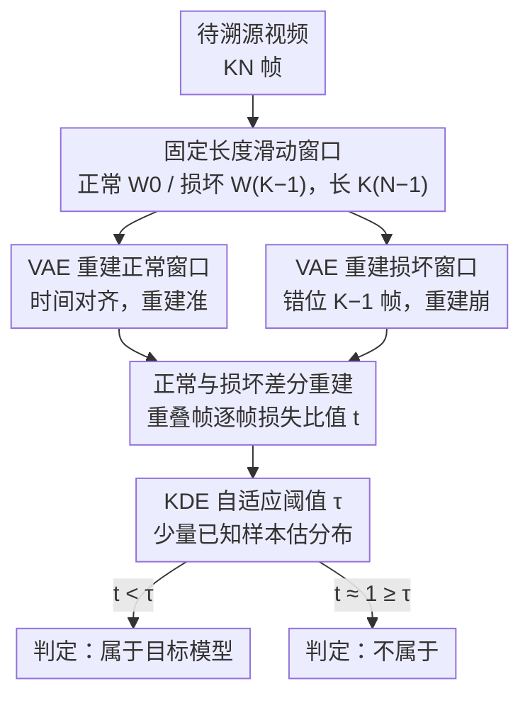

# SWIFT: Sliding Window Reconstruction for Few-Shot Training-Free Generated Video Attribution

**会议**: CVPR 2026  
**arXiv**: [2603.08536](https://arxiv.org/abs/2603.08536)  
**代码**: [GitHub](https://github.com/wangchao0708/SWIFT)  
**领域**: 视频生成  
**关键词**: 生成视频溯源, 3D VAE, 滑动窗口重建, 免训练, 时间一致性

## 一句话总结

SWIFT 首次定义了"少样本免训练生成视频溯源"任务，利用 3D VAE 中"多帧像素↔单帧潜变量"的时间映射特性，通过固定长度滑动窗口执行正常和损坏两次重建，用重叠帧的损失比值作为溯源信号，仅需 20 个样本即可达到 90%+ 平均溯源准确率，5 模型平均 94%。

## 研究背景与动机

1. **领域现状**：视频生成技术（HunyuanVideo、Wan2.1/2.2、EasyAnimate 等）飞速发展，均采用 3D VAE + DiT 架构。生成视频可能被滥用于传播虚假信息、侵犯知识产权。
2. **现有痛点**：现有溯源方法分两类——(1) 水印主动溯源需嵌入操作，可能降低视频质量；(2) 训练式被动溯源需大量训练样本，新模型出现需重新训练。图像溯源方法（RONAN/LatentTracer/AEDR）迁移到视频时准确率显著下降。
3. **核心矛盾**：图像溯源方法只关注空间一致性，忽略了视频数据固有的时间一致性约束，无法有效处理序列相关的扰动。
4. **本文目标** 如何在无需训练、仅需少量样本的条件下，利用视频的时间特性实现可靠的生成视频溯源？
5. **切入角度**：SOTA 视频生成模型的 3D VAE 在时间维度上进行上下采样（压缩比通常为 4 或 8），自然形成了"K 帧像素↔1 帧潜变量"的时间映射。属于某模型的视频在按 chunk 对齐时满足该模型 VAE 分布，而不属于的视频不满足。
6. **核心 idea**：通过滑动窗口打破时间对齐来"损坏"重建，属于目标模型的视频在正常/损坏重建间有显著损失差异，非属于视频无此差异。

## 方法详解

### 整体框架

SWIFT 想回答的问题很具体：给定一段视频，它是不是某个目标模型生成的？方法的支点是 3D VAE 的时间压缩——这些 VAE 在时间维度上以压缩比 $K$（通常 4 或 8）下采样，每 $K$ 帧像素被映射成 1 帧潜变量。属于该模型的视频，只要按 $K$ 帧一组（chunk）对齐，编解码就落在 VAE 熟悉的分布里，重建得很准；一旦把帧错位、打乱 chunk 对齐，重建就崩。SWIFT 正是制造这种「对齐 vs 错位」的对照：给同一段视频取两个滑动窗口，一个保持时间对齐、一个故意错位，各重建一次，看两次的损失差多少。属于目标模型的视频会在对照中露出巨大差异，不属于的则两次都差不多。整条流水线只需白盒访问目标 VAE 的编解码器，不训练任何模型。

### 关键设计

**1. 固定长度滑动窗口：用一个错位窗口把「时间对齐」这个隐藏假设打破**

差分对照需要两个长度相同、但时间对齐状态相反的窗口。设视频有 $KN$ 帧（$N$ 为 chunk 数），窗口长度统一取 $K(N-1)$ 帧。正常窗口 $W_0$ 从第 1 帧起，窗口内每个 chunk 的帧组成和位置都正好满足 VAE 的时间映射；损坏窗口 $W_{K-1}$ 整体向后挪 $K-1$ 帧，于是每一帧都被推到错误的 chunk 槽位上，时间一致性被破坏到最大。一般地，窗口起点 $j$ 满足 $j \bmod K = 0$ 时是正常窗口，$j \bmod K \neq 0$ 时是损坏窗口。之所以专挑 $W_0$ 配 $W_{K-1}$，是因为 $K-1$ 的偏移能同时改掉「chunk 内帧组成」和「帧到潜变量位置的映射」两件事，错位最彻底。以 $K=4$ 为例：正常窗口取第 1–$4(N-1)$ 帧，损坏窗口取第 4–$(4N-1)$ 帧（偏移 3 帧），两者在中段大量帧重叠，但对齐状态正好相反，可以逐帧对比。对于解码器里还带去噪步骤的 VAE（如 LTX），错位带来的破坏会被去噪「修回去」一部分，因此需要定量算一遍才能挑出差异最大的那对窗口。

**2. 正常与损坏差分重建：用损失比值而非绝对误差，抵消视频内容本身的难易差异**

两个窗口各过一遍 VAE：正常窗口重建得 $W_0^* = \mathcal{R}(W_0)$，损坏窗口重建得 $W_{K-1}^{**} = \mathcal{R}(W_{K-1})$。归属信号 $t$ 取两者在重叠帧上的逐帧损失比值的均值：

$$
t = \frac{1}{K(N-1)-K+1} \sum_{i=K}^{K(N-1)} \frac{\mathcal{L}(F_i^*, F_i)}{\mathcal{L}(F_i^{**}, F_i)}
$$

其中 $\mathcal{L}$ 用 MSE，$F_i$ 是第 $i$ 帧原图。如果视频确实出自目标模型，正常重建几乎无损（分子小）、错位重建明显崩坏（分母大），比值 $t \ll 1$；如果不是这个模型生成的，VAE 对它本就不熟，对齐与错位都重建得一般，两个损失接近，$t \approx 1$。这里关键不是看绝对重建误差——那会被视频内容本身的复杂度带偏（纹理多的视频天然难重建），而是看同一段视频在「对齐/错位」下的相对变化，把内容难度从信号里约掉，只留下「这段视频是否吃 VAE 的时间对齐」这一信息。

**3. KDE 自适应阈值：用非参数密度估计定判定线，避开对信号分布的任何假设**

有了 $t$ 还需要一条判定线 $\tau$：$t$ 低于它判为「属于该模型」。但归属信号 $t$ 在不同模型间分布形态各异，还常带离群值，硬套高斯之类的参数分布并不稳。SWIFT 改用核密度估计（KDE，高斯核 + Scott 带宽）从少量已知归属视频的 $t$ 分布里估出阈值，取累积分布达到 $1-\alpha$（$\alpha=0.05$）的那个点作 $\tau$。KDE 不假设分布形式，对离群值天然鲁棒，所以同一套流程不必为每个模型手调，每模型只需几十个样本就能定好自己的阈值。

### 损失函数 / 训练策略

SWIFT 完全免训练，唯一的「度量选择」是用哪种重建损失算 $t$。消融显示 MSE 最能放大对齐/错位的差异（98.4%），略优于 MAE（97.8%），而 PSNR（47.8%）和 SSIM（47.1%）几乎失效——后两者衡量的是结构相似度而非逐像素差异，捕捉不到 VAE 分布层面的细微崩坏，因此把对照信号也抹平了。

## 实验关键数据

### 主实验

在自建 S-Video 数据集（4000 视频：500 真实 + 3500 生成自 5 个 SOTA 模型）上评估：

| 目标模型 | SWIFT 平均准确率 | AEDR 平均准确率 | 提升 |
|---------|----------------|----------------|------|
| HunyuanVideo | 90.7% | 60.5% | +30.2% |
| Wan2.1 | 98.4% | 89.3% | +9.1% |
| EasyAnimate | 97.8% | 63.1% | +34.7% |
| LTX-Video | 85.3% | 79.3% | +6.0% |
| Wan2.2 | 97.9% | 78.5% | +19.4% |
| **整体平均** | **94.0%** | **73.6%** | **+20.4%** |

### 消融实验

少样本能力（阈值所需样本数）：

| 样本数 S | 平均准确率 | 说明 |
|---------|-----------|------|
| 0 (零样本) | 85.1% | 直接设 $\tau=1$ |
| 20 | 90.2% | 少样本即可达 90% |
| 50 | 92.5% | 性能趋于饱和 |
| 200 | 94.0% | 最优 |

窗口选择消融（HunyuanVideo, K=4）：

| 正常窗口 | 损坏窗口 | 准确率 |
|---------|---------|--------|
| $W_0$ | $W_1$ | 82.3% |
| $W_0$ | $W_2$ | 82.3% |
| $W_0$ | $W_3$ | **90.7%** |

### 关键发现

- **Wan2.1/EA/Wan2.2 上表现极其出色**（97-98%），因为这些模型的 VAE 是纯粹的编解码器，VAE 分布特征保留完整。
- **LTX-Video 上最低**（85.3%），因其 VAE 解码时附加去噪步骤，削弱了重建差异信号。但依然远超基线。
- **零样本可行**：对 HunyuanVideo、EasyAnimate、Wan2.2 直接设阈值为 1 即可实现约 90% 准确率。
- **效率优势**：比 AEDR 快 4-32%，因 SWIFT 仅重建窗口而非完整视频。
- **MSE 为最佳损失度量**：MSE 比 MAE 更有效放大差异（98.4% vs 97.8%）。

## 亮点与洞察

- **巧妙利用 3D VAE 时间压缩特性**：将 3D VAE 的固有时间映射关系转化为溯源信号源，思路极为巧妙。这种"利用模型结构特性做取证"的范式可推广到其他利用特定架构组件的检测任务。
- **差分重建消除内容偏差**：不是看绝对重建误差（会受视频内容影响），而是看正常/损坏的比值，使得信号仅依赖于 VAE 分布匹配程度，大幅提升鲁棒性。
- **少样本+免训练的实用性**：仅需 20 个归属视频样本就能达到 90% 准确率，无需训练任何模型，在新模型不断涌现的当下非常实用。

## 局限与展望

- LTX-Video 因解码器去噪步骤导致准确率下降至 85.3%，对于采用更复杂 VAE 设计的未来模型，方法可能需要适配
- 当前仅支持白盒访问 VAE 的场景，模型所有者之外的第三方难以使用
- 未讨论视频经过压缩（如 H.264/H.265）后的鲁棒性
- 当多个模型共享同一 VAE 时（如基于同一基础模型微调），溯源可能失效
- 改进方向：可探索黑盒设置下的溯源、结合频域分析增强对复杂 VAE 的检测

## 相关工作与启发

- **vs AEDR**: 图像溯源方法，通过 VAE 重建一致性做归属。SWIFT 将其扩展到视频，关键创新是利用时间维度的差分重建而非单纯空间重建，准确率从 73.6% 提升到 94.0%。
- **vs RONAN/LatentTracer**: 基于梯度优化的图像溯源方法，计算开销大。SWIFT 无需梯度优化，仅需前向编解码即可。
- **vs 水印方法**: 水印需修改生成管线，SWIFT 完全被动、对生成过程透明。

## 评分

- 新颖性: ⭐⭐⭐⭐⭐ 首次定义该任务，巧妙利用 3D VAE 时间特性，差分重建思路独特
- 实验充分度: ⭐⭐⭐⭐ 5 个模型评测充分，消融详尽，但缺少视频压缩鲁棒性测试
- 写作质量: ⭐⭐⭐⭐ 形式化定义清晰，但部分符号较冗余
- 价值: ⭐⭐⭐⭐⭐ 高度实用，少样本免训练范式在 AI 安全领域有重要应用前景

<!-- RELATED:START -->

## 相关论文

- [\[CVPR 2026\] Training-free Motion Factorization for Compositional Video Generation](training-free_motion_factorization_for_compositional_video_generation.md)
- [\[CVPR 2026\] FlashLips: 100-FPS Mask-Free Latent Lip-Sync using Reconstruction Instead of Diffusion or GANs](flashlips_100-fps_mask-free_latent_lip-sync_using_reconstruction_instead_of_diff.md)
- [\[CVPR 2026\] SwitchCraft: Training-Free Multi-Event Video Generation with Attention Controls](switchcraft_training-free_multi-event_video_generation_with_attention_controls.md)
- [\[CVPR 2026\] FlowDirector: Training-Free Flow Steering for Precise Text-to-Video Editing](flowdirector_training-free_flow_steering_for_precise_text-to-video_editing.md)
- [\[CVPR 2026\] FlowPortal: Residual-Corrected Flow for Training-Free Video Relighting and Background Replacement](flowportal_residual-corrected_flow_for_training-free_video_relighting_and_backgr.md)

<!-- RELATED:END -->
