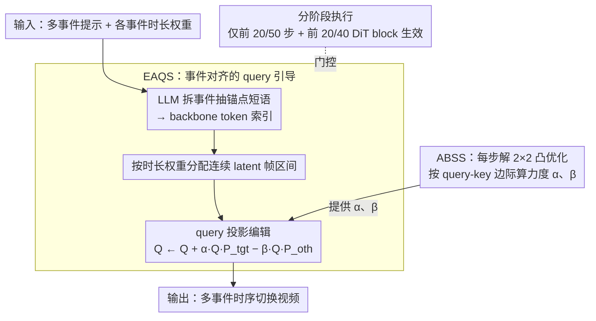

# SwitchCraft: Training-Free Multi-Event Video Generation with Attention Controls

**会议**: CVPR 2026  
**arXiv**: [2602.23956](https://arxiv.org/abs/2602.23956)  
**代码**: 有（即将发布）  
**领域**: 视频生成  
**关键词**: 多事件视频生成, 注意力控制, 无训练框架, 扩散模型, 时序对齐

## 一句话总结

提出 SwitchCraft，一个无需训练的多事件视频生成框架，通过 Event-Aligned Query Steering (EAQS) 将帧级注意力对齐到对应事件提示、Auto-Balance Strength Solver (ABSS) 自适应平衡引导强度，在不修改模型权重的情况下实现多事件视频的清晰时序切换和场景一致性。

## 研究背景与动机

当前主流文本到视频 (T2V) 扩散模型（如 Wan 2.1）在单事件视频生成上表现优异，但在处理包含多个时序事件的提示词时面临严重问题。核心原因在于：现有模型通过 cross-attention 将同一文本表征均匀注入所有帧，导致模型把整个描述当作整体上下文理解，而非时序有序的事件序列。这使得生成结果出现事件混叠、过渡模糊或事件遗漏。

现有解决方案存在两类局限：

**训练/微调方案**（如 MinT）：需要密集标注的时序数据，计算成本高，泛化性差

**拼接方案**（如 MEVG、LongLive）：逐段生成再融合，缺乏全局上下文，每段无法预见后续事件，导致过渡不连续和时序漂移

SwitchCraft 的核心洞察是：均匀的提示词注入忽略了事件与帧之间的对应关系。因此需要一种机制让每帧的注意力精准指向其所属的事件描述。

## 方法详解

### 整体框架

SwitchCraft 要解决的是：让一个只会"把整段描述当成统一上下文"的预训练 T2V 模型，在不重新训练的前提下，把多个事件按时间顺序拆开、依次拍出来。它不碰模型权重，全部改动只发生在推理时——具体说就是动 cross-attention 里的 query 向量。

整条流水线这样转：先用一个 LLM 把多事件提示拆成若干事件，并从每个事件里抽出最有区分度的"锚点短语"；再按用户给的时长权重把这些事件分配到连续的 latent 帧区间，让先发生的事件占住前面的帧；然后在每个事件的帧区间内，EAQS 改写这些帧的 query，使它们在注意力空间里更靠向本事件、远离其他事件；改写的力度 $\alpha$、$\beta$ 不靠手调，而是由 ABSS 在每一步现场解一个小凸优化算出来。整套编辑只在去噪的前 20 步（共 50 步）和前 20 个 DiT block（共 40 个）里生效——早期步骤和浅层 block 负责定场景布局和大尺度运动，把事件的时间位置钉住就够了，之后就放手让原模型补纹理和外观。

### 关键设计

**1. Event-Aligned Query Steering（EAQS）：在 query 空间把每帧"推向"它该演的那个事件**

问题出在均匀注入：模型把多事件描述当作一团整体上下文，每帧的注意力都平摊给所有事件，于是事件混叠、过渡模糊。EAQS 的做法是让每帧只对"轮到它的那个事件"敏感。第一步是定位事件信号——用一个 LLM（如 ChatGPT）从提示里为每个事件抽出区分性锚点短语（场景切换关注设定词如 "sunny desert"、"icy cave"，行为切换关注动作短语如 "walking forward"、"reading a book"），再把这些短语映射到 backbone tokenizer 的 token 索引集合。第二步是把事件铺到时间轴上：用户给每个事件一个相对时长权重 $w_i$，按比例分到 $F'$ 个 latent frame，

$$N_i \approx F' \cdot \frac{w_i}{\sum_{j=1}^{A} w_j}$$

取整后把余数补给小数部分最大的事件以覆盖所有帧，于是第 $i$ 个事件占住一段连续的半开帧区间。一个"先在沙漠行走、再进入冰洞"的双事件提示、若权重各半，前半段帧归"沙漠"、后半段帧归"冰洞"。

真正的引导发生在 key 子空间上。对某个 attention head，设文本 key 矩阵 $K \in \mathbb{R}^{L_k \times D}$、当前事件区间内的 query 为 $Q^* \in \mathbb{R}^{R \times D}$，按锚点索引从 $K$ 里取出目标事件 key $K_{\text{tgt}}$ 与竞争事件 key $K_{\text{oth}}$，各自构造一个正则化右投影算子：

$$P_{\text{tgt}} = K_{\text{tgt}}^\top (K_{\text{tgt}} K_{\text{tgt}}^\top + \epsilon I)^{-1} K_{\text{tgt}}$$

$P_{\text{oth}}$ 同理。这两个投影器把 query 分别投到目标事件子空间 $\mathcal{T}$ 和竞争事件子空间 $\mathcal{O}$，于是 query 更新就是一次"加目标、减竞争"：

$$Q^* \leftarrow Q^* + \alpha \cdot Q^* P_{\text{tgt}} - \beta \cdot Q^* P_{\text{oth}}$$

第一项抬高 query 与目标 key 的点积、让本事件被看见，第二项压掉 query 落在竞争事件子空间的分量、堵住事件泄漏，编辑后再做行归一化稳住注意力幅值。之所以只动 query 而不动权重或 key/value：softmax 之后的注意力权重一改就破坏了预训练结构，key/value 是所有帧共享的、一改就波及全局；query 是帧级别的局部量，改它既能逐帧引导注意力、又保住模型学到的先验，还避开了事件边界处的突变。

**2. Auto-Balance Strength Solver（ABSS）：把"该用多大力气引导"变成一道每步现解的小凸优化**

$\alpha$、$\beta$ 不好手调——给大了外观扭曲、运动失稳，给小了盖不住模型的全局混合偏差，而且不同提示、不同去噪步该用的力度都不一样。ABSS 干脆把它们的取值变成一个可自动求解的优化问题。为了让比较稳定，它先压维度：直接在 token 级比对齐分数维度高、又对 token 数量敏感，于是 ABSS 对每个事件的归一化 key 行做 SVD，取主方向 $k_{\text{tgt}} \in \mathbb{R}^D$ 和各竞争事件的 $k_{\text{oth},j} \in \mathbb{R}^D$，把每个事件压成一个代表方向。

接着量化"当前帧到底偏向谁"。算 query 行在两个方向上的对齐分数

$$S_{\text{tgt}} = Q^* k_{\text{tgt}}, \quad S_{\text{oth}} = Q^* k_{\text{oth}}$$

取最强竞争者 $S_{\text{oth}}^{\max} = \max_j S_{\text{oth},j}$，定义边际赤字 $d = S_{\text{oth}}^{\max} - S_{\text{tgt}} + \varepsilon$。$d > 0$ 意味着竞争事件此刻压过了目标事件，需要出手引导；$d \leq 0$ 说明目标已经主导、不必动。求解时令 $x = [\alpha, \beta]^\top$、$C = [S_{\text{tgt}} \; S_{\text{oth}}^{\max}]$，并用阻力矩阵 $M = \text{diag}(\|S_{\text{tgt}}\|_2^2, \|S_{\text{oth}}^{\max}\|_2^2)$ 给两个方向各自一个尺度感知的阻尼，目标函数为

$$\min_{x \geq 0} \frac{1}{2} x^\top M x + \frac{1}{2} \|\max(0, d - Cx)\|_2^2$$

前一项惩罚过大的引导强度、后一项要求引导刚好把赤字 $d$ 补平。这是个非负约束的二次规划，有闭式解

$$(M + C^\top C) x = C^\top d, \quad x \leftarrow \max(x, 0)$$

当 $d \leq 0$ 时最优解就是 $x = 0$，自动退化为不编辑。这样每一去噪步、每个事件区间都按当前 query-key 对齐的实际边际算出恰到好处的力度，彻底省掉了手调超参，换不同场景也稳。

**3. 分阶段执行：只在"定调"的早期阶段干预，把副作用压到最低**

EAQS+ABSS 并非全程开着，而是只在去噪的前 20/50 步、前 20/40 个 DiT block 里生效。原因是扩散 Transformer 在时间和深度上是分层组织的：早期步骤和浅层 block 搭场景布局、定大尺度运动，后期步骤和深层 block 才精修纹理、身份和外观细节。事件该出现在哪一段时间，在早期阶段就已经定下来了，所以只在这一段引导就够；之后交回原模型补高频细节，既不丢效果、又把对画质的扰动降到最小，换来最好的效果/副作用比。

### 损失函数/训练策略

SwitchCraft 完全无训练，不改任何模型权重、不需要额外数据或微调，所有操作都在推理时在线完成——EAQS 的 query 编辑和 ABSS 的凸优化求解都嵌在去噪前向里跑。backbone 沿用 Wan 2.1 原始的 velocity prediction 目标，SwitchCraft 自身不引入任何损失函数。推理用 UniPC 采样器、50 步去噪、guidance scale 5.0。

## 实验关键数据

### 主实验

实验基于 Wan 2.1 T2V 14B backbone，生成分辨率 832x480、81 帧（5 秒）视频，单张 A100 GPU。评估涵盖 60 个多事件提示（2-4 个事件），覆盖动作切换和场景过渡。

| 方法 | CLIP-T | CLIP-F | 视觉质量 | T2V对齐 | 物理一致 | 运动平滑 | 主体一致 | 背景一致 | 美学 | 成像 |
|------|--------|--------|---------|--------|---------|---------|---------|---------|------|------|
| MEVG | 0.244 | 0.915 | 2.13 | 2.33 | 1.73 | 0.953 | 0.701 | 0.841 | 0.346 | 0.525 |
| DiTCtrl | 0.246 | 0.959 | 3.20 | 3.27 | 2.93 | 0.981 | 0.764 | 0.876 | 0.511 | 0.702 |
| LongLive | 0.252 | 0.984 | 4.27 | 3.13 | 3.97 | 0.984 | 0.898 | 0.908 | 0.627 | 0.725 |
| Wan 2.1 | 0.256 | 0.980 | 4.30 | 3.47 | 4.12 | 0.987 | 0.947 | 0.924 | 0.645 | 0.738 |
| Stitch | 0.257 | 0.963 | 3.73 | 3.67 | 3.80 | 0.983 | 0.926 | 0.910 | 0.608 | 0.711 |
| **Ours** | **0.275** | 0.980 | **4.33** | **4.30** | **4.13** | **0.989** | 0.945 | 0.921 | **0.648** | **0.741** |

SwitchCraft 在文本对齐上显著领先（CLIP-T +7.4%，T2V 对齐 +24%），同时视觉质量和时序平滑度保持或超过 backbone 水平。CLIP-F 未达最优因为该指标奖励相邻帧高度相似，事件切换导致的姿态变化会拉低分数。

### 消融实验

| 变体 | CLIP-T | CLIP-F | 视觉质量 | T2V对齐 | 物理一致 | 运动平滑 |
|------|--------|--------|---------|--------|---------|---------|
| 完整模型 | **0.275** | 0.980 | **4.33** | **4.30** | **4.13** | **0.989** |
| 随机强度 | 0.253 | 0.974 | 4.15 | 3.62 | 3.98 | 0.987 |
| 固定强度=1 | 0.264 | 0.967 | 3.97 | 3.75 | 3.95 | 0.985 |
| 无 SVD | 0.255 | 0.978 | 4.30 | 3.67 | 4.08 | 0.988 |
| 仅增强 | 0.262 | 0.980 | 4.35 | 3.78 | 4.13 | 0.989 |
| 仅抑制 | 0.261 | 0.978 | 4.28 | 3.73 | 4.05 | 0.986 |

人类评估（29 名用户，5 分制）：

| 方法 | 无遗漏 | 无泄漏 | 过渡平滑 | 视觉质量 |
|------|--------|--------|---------|---------|
| MEVG | 1.41 | 1.38 | 1.38 | 1.28 |
| DiTCtrl | 1.66 | 1.48 | 1.48 | 1.59 |
| LongLive | 2.07 | 2.72 | 2.97 | 3.52 |
| MinT | **4.31** | 3.69 | 3.76 | 3.83 |
| Wan 2.1 | 3.17 | 3.38 | 3.79 | 3.93 |
| Stitch | 2.62 | 2.07 | 2.14 | 2.45 |
| **Ours** | 4.21 | **4.04** | **3.93** | **4.24** |

### 关键发现

1. **ABSS 至关重要**：随机强度导致事件遗漏/延迟（T2V 对齐仅 3.62），固定强度=1 导致过度引导和外观退化（视觉质量降至 3.97）；ABSS 自适应求解显著优于两者
2. **增强+抑制缺一不可**：仅增强无法在竞争事件强时隔离区间（后续事件消失），仅抑制无法主动驱动 query 朝向目标事件（主导动作持续混入）
3. **SVD 压缩有效**：去除 SVD 后事件分离度降低，CLIP-T 从 0.275 降至 0.255
4. **推理开销可控**：2 事件从 15.2 分钟增至 17.6 分钟（+16%），4 事件增至 22.3 分钟（+47%），额外开销主要来自 ABSS 的 SVD 和凸优化
5. **创意遮挡过渡**：SwitchCraft 可通过中间段描述遮挡物实现创意转场效果，单次扩散轨迹中遮挡物有明确时间窗口

## 亮点与洞察

1. **仅编辑 query 的设计优雅**：key/value 被所有帧共享，修改会波及全局；query 是帧级别的，可精准局部引导注意力而不破坏全局信息流
2. **投影算子的子空间视角**：将事件对齐转化为子空间投影问题，用正则化伪逆保证数值稳定，几何直观清晰
3. **ABSS 的闭式凸优化**：$2 \times 2$ 线性系统加非负投影，计算开销极低但效果显著——彻底消除手动超参调节
4. **利用扩散模型的层次化生成特性**：早期步骤/浅层建布局，晚期步骤/深层补细节，只在关键阶段干预
5. **与 Attend-and-Excite 思路相通**：但面向时序维度而非空间维度，扩展了注意力操纵的应用范围

## 局限性

1. **受限于 backbone 能力**：底层模型无法生成的复杂动作（如 jumping jacks），SwitchCraft 只能退化为近似
2. **缺乏空间约束**：多主体场景中无法将特定事件绑定到特定主体的空间位置，可能出现动作在主体间混淆
3. **假设线性时序结构**：不支持并行发生的事件或复杂非线性叙事
4. **推理开销随事件数线性增长**：4 事件比基线多约 47% 推理时间

## 评分

| 维度 | 分数 | 说明 |
|------|------|------|
| 新颖性 | ★★★★☆ | 首个基于 query 子空间投影的无训练多事件视频生成方法 |
| 技术深度 | ★★★★☆ | EAQS 的投影设计和 ABSS 的凸优化求解理论扎实 |
| 实验充分性 | ★★★★☆ | 6 个基线对比、5 个消融变体、自动指标+人类评估 |
| 实用性 | ★★★★★ | 无需训练、通用于 DiT 架构、开销可控 |
| 写作质量 | ★★★★☆ | 结构清晰，数学推导完整，图示直观 |

<!-- RELATED:START -->

## 相关论文

- [\[CVPR 2026\] When to Lock Attention: Training-Free KV Control in Video Diffusion](when_to_lock_attention_training-free_kv_control_in_video_diffusion.md)
- [\[CVPR 2026\] Training-free Motion Factorization for Compositional Video Generation](training-free_motion_factorization_for_compositional_video_generation.md)
- [\[CVPR 2026\] LinVideo: A Post-Training Framework towards O(n) Attention in Efficient Video Generation](linvideo_a_post-training_framework_towards_on_attention_in_efficient_video_gener.md)
- [\[CVPR 2025\] Mind the Time: Temporally-Controlled Multi-Event Video Generation](../../CVPR2025/video_generation/mind_the_time_temporally-controlled_multi-event_video_generation.md)
- [\[CVPR 2026\] FlowDirector: Training-Free Flow Steering for Precise Text-to-Video Editing](flowdirector_training-free_flow_steering_for_precise_text-to-video_editing.md)

<!-- RELATED:END -->
