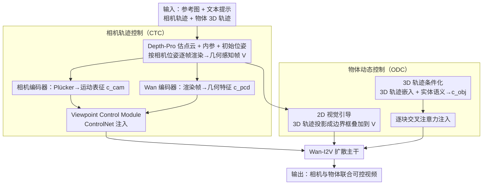

# SymphoMotion: Joint Control of Camera Motion and Object Dynamics for Coherent Video Generation

**会议**: CVPR 2026  
**arXiv**: [2604.03723](https://arxiv.org/abs/2604.03723)  
**代码**: [项目主页](https://grenoble-zhang.github.io/SymphoMotion/)  
**领域**: 视频生成 / 运动控制  
**关键词**: 视频扩散模型, 相机控制, 物体运动控制, 3D感知, 运动解耦

## 一句话总结

提出 SymphoMotion 统一运动控制框架，通过相机轨迹控制（CTC）和物体动态控制（ODC）两个机制同时精确控制视频中的相机运动和物体3D轨迹，并构建了25K规模的真实世界联合标注数据集 RealCOD-25K。

## 研究背景与动机

**领域现状**：精确控制视频生成中的运动动态正受到越来越多的关注。相机控制方法（CameraCtrl、Uni3C等）通过注入相机参数调控视角变化，但仅处理静态或准静态场景；物体控制方法（TrackGo、MagicMotion等）依赖2D运动线索（边界框、光流、关键点），但这些图像平面表示无法区分真实物体运动和相机引发的视差。

**现有痛点**：(1) 单一运动类型控制互不兼容——相机控制方法在前景动态明显时退化，物体控制方法在相机运动下不可靠；(2) 近期联合控制方法（如MotionPrompting、ATI）将相机视差和物体运动混合在同一2D运动场中，导致监督歧义——不同的3D运动可以在图像平面上产生相似的投影，尤其在深度变化大的场景中；(3) MotionCtrl虽然分离了两种运动的处理分支，但物体控制仍限于2D图像空间；(4) FMC使用6D位姿表示但依赖合成数据且需要完整的6DoF输入，实用性差。

**核心矛盾**：相机运动产生全局视差和视角变化，物体遵循独立的3D路径——两者在2D图像平面上的表现高度耦合，难以解耦。

**本文目标** 如何在单一模型中统一且解耦地控制相机轨迹和物体3D动态，使两者在空间上一致、互不干扰？

**切入角度**：作者认为关键在于引入3D感知：用Plücker嵌入+点云几何先验增强相机控制的结构感知，用2D视觉引导+3D轨迹嵌入使物体控制具备深度感知。同时构建首个联合标注相机位姿和物体3D轨迹的大规模真实世界数据集。

**核心 idea**：2D视觉引导提供图像平面锚点 + 3D轨迹嵌入提供深度感知运动监督，在一个统一框架中实现相机和物体运动的解耦联合控制。

## 方法详解

### 整体框架

这篇论文要解决的是：让一个视频生成模型同时听懂"相机怎么动"和"物体怎么动"两条指令，而且两者互不打架。难点在于相机运动和物体运动在 2D 画面上是高度纠缠的——同样一段画面位移，可能是相机在平移，也可能是物体自己在跑，光看图像平面分不清。SymphoMotion 的破局思路是把控制信号搬到 3D 空间去：相机这一路靠点云几何先验补足结构感知，物体这一路靠 3D 轨迹嵌入补足深度感知。

整体管线建立在预训练的 Wan-I2V 图生视频扩散模型之上。推理时模型吃四样东西：一张参考图、一段文本提示、一条相机轨迹、以及若干物体的 3D 运动轨迹。两条控制支路并行工作：相机轨迹控制（CTC）通过 Viewpoint Control Module 注入相机位姿和几何先验，物体动态控制（ODC）通过 Object Motion Module 把 2D 视觉锚点和 3D 轨迹条件一起灌进去。两条支路用不同的注入方式接入扩散主干——CTC 走 ControlNet，ODC 走交叉注意力——既各管各的、又共享同一主干，这正是"解耦但统一"的来源。

### 关键设计

**1. 相机轨迹控制（CTC）：用点云渲染帧给相机控制补上 3D 结构感**

精确控制视角变换时，最常见的相机条件是 Plücker 嵌入（把每条像素射线编码成位置+方向）。但 Plücker 只描述了相机摆在哪、朝哪看，对场景本身的 3D 结构一无所知，碰到大深度变化的场景容易失稳。SymphoMotion 的做法是给相机控制额外喂一份场景几何：先用 Depth-Pro 从参考图估出点云、相机内参和初始位姿 $C^f$，再把这团点云按目标相机位姿序列 $\{C^1,\dots,C^N\}$ 逐帧重新渲染，得到一组"几何感知帧" $\mathcal{V}$。两个编码器各取所需——相机编码器把 Plücker 嵌入编成运动表征 $c_{cam}$，Wan 编码器从渲染帧里抽出几何特征 $c_{pcd}$。$c_{pcd}$ 与噪声潜变量 $z_t$ 拼接、再加上 $c_{cam}$，一并送进由 ControlNet 实现的 Viewpoint Control Module。渲染帧提供的空间结构线索和 Plücker 的位姿信息互补，让模型在转视角时能守住几何一致性，而不是只会机械地搬运像素。

**2. 物体动态控制（ODC）的 2D 视觉引导：把 3D 轨迹"画"成画面里的框，给个看得见的锚点**

光给物体一条 3D 轨迹还不够——轨迹投影到画面后，模型未必能精准对齐到该物体应当出现的像素位置。ODC 的第一招是把约束显式画在画面上：把每个物体的 3D 轨迹 $P_i$ 用目标相机位姿投影到图像平面得到 2D 轨迹 $P_{2D_i}$，基于投影点拟合出逐帧边界框，然后把这些框直接渲染叠加到点云帧 $\mathcal{V}$ 上。关键在于这些框是叠在渲染输入里、而非只在潜空间里编码——相当于在画面上给模型留下"这个物体每一帧应该出现在这块区域"的可见标记，模型据此跟踪每个物体在图像平面上的运动路径，训练也更稳。

**3. 物体动态控制（ODC）的 3D 轨迹条件化：让物体运动绑定真实世界路径，不被相机带偏**

2D 框解决了"在画面哪个位置"，但解决不了"在多远的深度上沿什么三维路径走"——这正是相机运动下物体控制最容易失真的地方。ODC 的第二招是把 3D 轨迹本身编成条件信号。每个物体的轨迹 $P_i \in \mathbb{R}^{N \times N_p \times 3}$ 先变换到参考相机坐标系，经线性投影加时间下采样器编成潜嵌入；同时用冻结的语言编码器把该物体的实体提示 $y_i$ 编成语义嵌入。两份嵌入逐元素相加，得到运动感知表征 $c_{obj}$。注入方式是在每个 transformer 块里新增一个对 $c_{obj}$ 的交叉注意力：

$$Z_i' = Z_i + \text{CrossAttn}(Q=Z_i,\; K=c_{obj},\; V=c_{obj})$$

因为 3D 轨迹描述的是物体在真实世界空间里的运动、与相机视角无关，所以即便相机同时在动，物体运动也能保持空间一致——这正是 ODC 能和 CTC 并存而不冲突的根本原因。

### 损失函数 / 训练策略

训练用 Flow Matching 目标，让网络预测的速度场对齐真实速度场：

$$\min_\theta \mathbb{E}\big[\|v_\theta(z_t, t, c_y, c_f, \phi_\theta(c_{cam}, c_{pcd}), \psi_\theta(P, y)) - v_t\|^2\big]$$

采用两阶段课程：先单独训 CTC 学会相机控制，再冻住 CTC 去训 ODC 学物体运动；基础模型 Wan-I2V 全程冻结，只学两条轻量控制支路。具体配置为 32 张 H100、batch size 32、81 帧视频序列、832×480 分辨率，AdamW 优化器，学习率在前 400 步线性 warm-up 到 $1 \times 10^{-5}$。

## 实验关键数据

### 主实验

| 方法 | FID↓ | FVD↓ | CLIPSIM↑ | CamTransErr↓ | CamRotErr↓ | Box-IoU↑ |
|------|------|------|----------|-------------|-----------|----------|
| CameraCtrl | 196.84 | 1019.49 | 0.29 | 0.68 | 0.12 | – |
| ViewCrafter | 303.83 | 1690.73 | 0.28 | 0.80 | 0.21 | – |
| Uni3C | 86.66 | 404.21 | 0.31 | 0.44 | 0.06 | – |
| MotionCtrl | 182.15 | 738.41 | 0.30 | 0.83 | 0.23 | 31.42 |
| **SymphoMotion** | **70.47** | **332.50** | **0.31** | **0.37** | **0.05** | **61.88** |

### 消融实验

| 设置 | FVD↓ | CamTransErr↓ | CamRotErr↓ | Box-IoU↑ |
|------|------|-------------|-----------|----------|
| w/o 点云先验 | 330.64 | 0.46 | 0.07 | 56.74 |
| w/o 2D边界框 | 337.14 | 0.36 | 0.06 | 54.32 |
| w/o 3D轨迹 | 343.80 | 0.36 | 0.06 | 52.16 |
| **SymphoMotion** | **332.50** | **0.37** | **0.05** | **61.88** |

### 关键发现

- FID 70.47 vs 次优Uni3C 86.66，视觉质量领先；FVD 332.50 vs Uni3C 404.21，时序一致性更好
- Box-IoU 61.88 vs MotionCtrl 31.42，物体轨迹准确度近乎翻倍
- 相机控制精度与专用相机控制方法（Uni3C）可比（CamTransErr 0.37 vs 0.44，CamRotErr 0.05 vs 0.06）
- 消融显示3D轨迹对Box-IoU贡献最大（+9.72），2D框和点云先验也都有明显作用
- 用户研究中SymphoMotion在视觉质量（4.87/5）、物体运动（4.58/5）等维度全面领先

## 亮点与洞察

- **解耦与统一的平衡**：CTC和ODC作为独立机制通过不同的注入方式（ControlNet vs 交叉注意力）与扩散模型交互，实现了解耦控制；但它们共享同一扩散模型主干，保证了整体一致性
- **2D+3D互补设计精妙**：物体控制中2D边界框提供图像平面锚点约束定位，3D轨迹提供深度感知的空间引导——两者分别解决"在哪"和"在多远"的问题
- **数据集构建流程完整**：从百万视频出发，经美学过滤→运动过滤→VLM去噪→120人时人工审核→自动标注的完整管线，具有高度可复现性
- **交互系统设计友好**：用户通过SAM2选择物体→自动3D检测框→拖拽编辑3D轨迹，降低了3D运动指定的门槛

## 局限与展望

- 两阶段训练策略可能导致CTC和ODC之间的协调不够紧密，端到端联合训练可能进一步提升
- RealCOD-25K的标注依赖多个感知模型（SegAnyMo、SpatialTrackerV2、Depth Anything V2等），其精度上限受限于这些模型的性能
- 仅在832×480分辨率81帧上训练和评估，更高分辨率和更长视频的能力未验证
- 物体3D轨迹表示为采样点的位置序列，无法表达物体的旋转和形变
- 相比MotionCtrl的即插即用设计，依赖Depth-Pro重建点云增加了推理时的计算开销

## 相关工作与启发

- CameraCtrl [He et al.] 开创了视频扩散模型的相机控制注入范式，本文在此基础上引入了3D几何先验
- MotionCtrl [Wang et al.] 首次尝试解耦相机和物体运动控制，但物体控制限于2D——SymphoMotion将其扩展至3D
- ViewCrafter [Yu et al.] 的点云作为3D先验的思路被本文CTC模块采纳并改进
- RealCOD-25K填补了联合标注相机+物体运动的真实世界数据集空白，对后续统一运动控制研究有持续价值

## 评分

- **新颖性**: ⭐⭐⭐⭐ — 统一框架、2D+3D互补的物体控制设计新颖，但各组件（ControlNet注入、交叉注意力条件化）属成熟技术
- **实验充分度**: ⭐⭐⭐⭐⭐ — 定量对比全面（6个指标），消融实验逐一验证每个组件，用户研究完整
- **写作质量**: ⭐⭐⭐⭐⭐ — 结构清晰，图示质量高，motiviation到method的逻辑链紧密
- **价值**: ⭐⭐⭐⭐⭐ — 数据集+方法+交互系统的完整贡献，为可控视频生成设立了新标准

<!-- RELATED:START -->

## 相关论文

- [\[CVPR 2026\] FaceCam: Portrait Video Camera Control via Scale-Aware Conditioning](facecam_portrait_video_camera_control_via_scale-aware_conditioning.md)
- [\[CVPR 2026\] Phantom: Physics-Infused Video Generation via Joint Modeling of Visual and Latent Physical Dynamics](phantom_physics-infused_video_generation_via_joint_modeling_of_visual_and_latent.md)
- [\[CVPR 2026\] Let Your Image Move with Your Motion! – Implicit Multi-Object Multi-Motion Transfer](let_your_image_move_with_your_motion_--_implicit_multi-object_multi-motion_trans.md)
- [\[CVPR 2025\] GEN3C: 3D-Informed World-Consistent Video Generation with Precise Camera Control](../../CVPR2025/video_generation/gen3c_3d-informed_world-consistent_video_generation_with_precise_camera_control.md)
- [\[ICLR 2026\] MoSA: Motion-Coherent Human Video Generation via Structure-Appearance Decoupling](../../ICLR2026/video_generation/mosa_motion-coherent_human_video_generation_via_structure-appearance_decoupling.md)

<!-- RELATED:END -->
