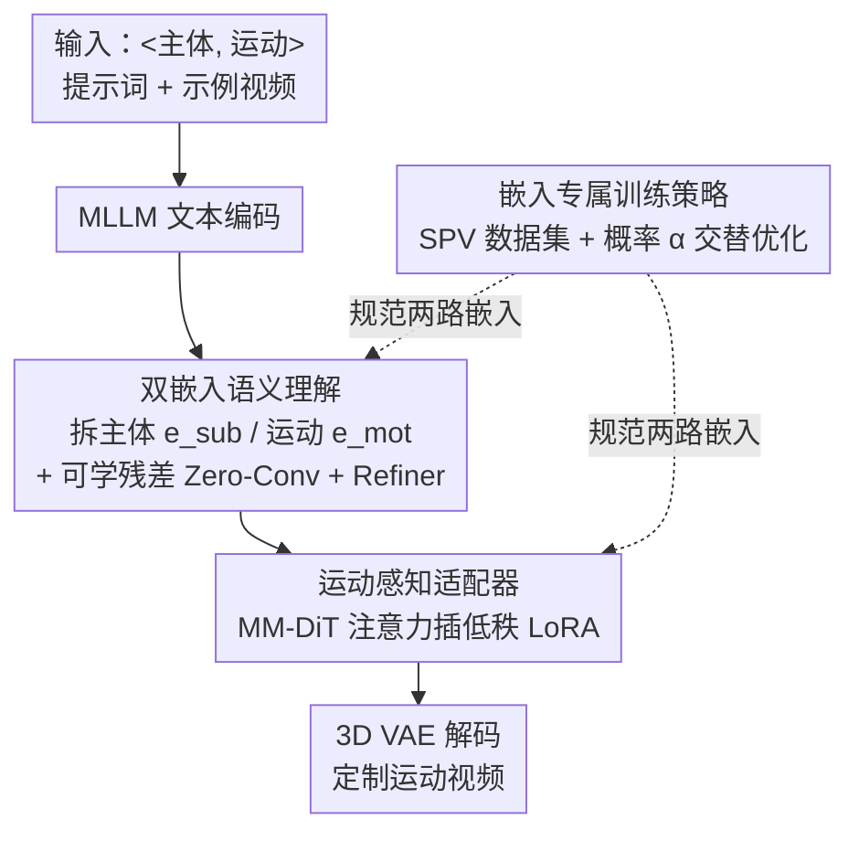

# SynMotion: Semantic-Visual Adaptation for Motion Customized Video Generation

**会议**: CVPR 2026  
**论文**: [CVF Open Access](https://openaccess.thecvf.com/content/CVPR2026/html/Tan_SynMotion_Semantic-Visual_Adaptation_for_Motion_Customized_Video_Generation_CVPR_2026_paper.html)  
**代码**: [lucariaacademy.github.io/SynMotion](https://lucariaacademy.github.io/SynMotion/)（项目页，权重待开源）  
**领域**: 视频生成 / 扩散模型  
**关键词**: 运动定制、视频生成、语义解耦、参数高效适配、扩散模型

## 一句话总结
SynMotion 让"运动定制视频生成"同时在语义层（把文本嵌入拆成主体/运动两路、各加可学残差）和视觉层（在 MM-DiT 里插入轻量运动 LoRA 适配器）上做适配，再配一套交替优化主体/运动嵌入的训练策略，使得从几段示例视频学到的动作能迁移到"鳄鱼倒立""玛丽莲·梦露出拳"等任意主体上，在 T2V 与 I2V 双设定下都超过 SOTA。

## 研究背景与动机
**领域现状**：基于扩散模型的视频生成已经能做出高质量 T2V / I2V，但对一些罕见或专门的动作（如"倒立 handstand"）学不会、泛化不动。于是出现了"运动定制视频生成"这一任务：给几段示例视频，把其中的动作抽取出来，迁移到文本指定的任意主体上。现有做法分两类——语义级（往预训练 T2V 里注入新概念 token，如 ADI、ReVersion）和视觉级（直接在视频特征空间优化运动隐表示，如 Motion Inversion、DMT）。

**现有痛点**：两类方法各有硬伤。语义级方法把图像定制的 textual inversion 直接搬到视频，但视频需要更强的时序语义理解，单个 token 级嵌入根本捕捉不住运动概念，且视频的时序参数复杂度高，训练难、帧间一致性差。视觉级方法擅长复刻动作，但往往过拟合到实例特定的轨迹、连参考视频的空间布局/背景都一并保留下来，结果就是"主体换不动、画面没多样性"——比如想从人类示例生成兔子，DMT 会把人的胳膊长到兔子身上。

**核心矛盾**：运动表达力、主体泛化、视频多样性这三者之间存在张力。只做语义、或只做视觉，都没法同时兼顾——语义级有泛化没精度，视觉级有精度没泛化。

**本文目标**：构建一个既能精确复刻动作、又能把动作迁移到语义上很远的主体、还能保持画面多样性的统一框架，且 T2V / I2V 都支持。

**切入角度**：作者认为运动定制本质上需要语义理解与视觉适配的联合建模，二者缺一不可。语义层负责"是什么动作、配什么主体"的高层控制，视觉层负责把动作的动态细节真正画出来。

**核心 idea**：在以 LLM 为文本编码器的 HunyuanVideo 上，把文本嵌入按提示词角色拆成主体嵌入和运动嵌入两路分别学习（语义解耦），同时往冻结骨干里插入轻量运动适配器补足动态细节（视觉适配），再用一套交替优化策略防止两路嵌入互相干扰。

## 方法详解

### 整体框架
SynMotion 建立在 HunyuanVideo（用 decoder-only LLM/MLLM 做文本编码、MM-DiT 做去噪、3D 因果 VAE 压视频）之上。输入是 `<主体, 运动>` 形式的提示词加几段示例视频，输出是指定主体执行指定动作的视频。整条管线分两条适配路径加一套训练策略：语义路径先用 MLLM 把提示词编成一个文本嵌入，按 token 的语义角色拆成主体嵌入 $e_{sub}$ 和运动嵌入 $e_{mot}$，各自挂一个零初始化卷积残差（Zero-Conv）注入的可学嵌入，再经 Embedding Refiner 做主体—运动交互融合；视觉路径则在 MM-DiT 的各类 DiT block 的注意力层里插入低秩运动适配器；训练时用一套"嵌入专属"的交替采样策略，配合人工构造的 Subject Prior Video（SPV）数据集，让主体/运动两路嵌入各司其职。

### 关键设计

**1. 双嵌入语义理解：把"主体"和"运动"在嵌入空间里拆开学**

针对"单 token inversion 学不动视频运动"的痛点，作者不在词级别做反演，而是深入嵌入空间做结构化分解。给定 `<主体, 运动>` 提示词，先用 MLLM 得到一个文本嵌入，再按 token 在原提示里的语义位置和角色做 prompt-aware 分解，切成主体嵌入 $e_{sub}$ 与运动嵌入 $e_{mot}$。为了让两路既可学又不破坏模型原有的语言理解，各挂一个通过 Zero-Conv 层 $Z$ 注入的可学残差 $e^l_{mot}$、$e^l_{sub}$，并经一个 Embedding Refiner $R$ 做语义交互融合，最后再经一次 Zero-Conv 加回原嵌入：

$$e = [\,e_{mot}+Z(e^l_{mot}),\; e_{sub}+Z(e^l_{sub})\,], \quad e' = e + Z(R(e))$$

巧在两路残差的初始化策略不同、动机相反：运动残差 $e^l_{mot}$ 负责捕捉定制动作，为加速收敛用对应动词的嵌入初始化——又因为 decoder-only MLLM 是因果的、每个 token 受前文影响，作者用完整短语（如"a person claps"）的嵌入而非单词"clap"来初始化；主体残差 $e^l_{sub}$ 要保住对任意主体的原生泛化，所以随机初始化，让它不被既有文本语义带偏、能自由适配新主体外观。Zero-Conv 的零初始化保证训练初期注入为零、平滑接管，既保留底座语义又叠加定制能力。

**2. 运动感知适配器：在冻结骨干里用低秩残差补足动态细节**

只做语义层定制还不够——视频时序建模带来的参数复杂度会拉高训练难度、加剧帧间不一致，纯语义方法常常运动幅度偏小、动态特征复刻不出来。为此作者在视觉层下手：MM-DiT 由 Text DiT Block、Video DiT Block、Single-Stream DiT Block 组成，对其中每个注意力层的 $\{Q,K,V\}$ 投影插入轻量低秩适配器 $A$，以低秩残差方式改权重 $\tilde{W}_* = W_* + \Delta W_* = W_* + B_* A_*$，其中 $A_*\in\mathbb{R}^{r\times d}$、$B_*\in\mathbb{R}^{d\times r}$ 且秩 $r\ll d$，原权重 $W_*$ 训练中冻结。这样只学少量参数就能增强运动感知、提升时序一致性与保真度，与语义层定制互补，最终在大量主体与动作上都能泛化。

**3. 嵌入专属训练策略：用 SPV 数据集 + 概率交替优化防止主体/运动相互干扰**

主体和运动两路嵌入若同时无差别优化，会互相污染语义。作者引入一套"嵌入专属"训练策略加一个辅助数据集 Subject Prior Video（SPV）：SPV 不是罕见动作的示例视频，而是采样各类动物主体（cat、zebra…）配常见动作（run、walk…）拼成"a zebra walks"这类通用提示，喂给冻结的视频生成模型合成出来，作为以主体为中心的先验，帮模型保住对人类之外、未见主体的泛化。训练时定义采样概率 $\alpha\in[0,1]$：以概率 $\alpha$ 采用户提供的真实示例视频，此时主体和运动都与定制目标相关，同时优化运动嵌入和主体嵌入；以概率 $1-\alpha$ 采 SPV 视频，由于其动作与目标定制动作无关，就冻结运动嵌入、只更新主体嵌入，从而把主体嵌入正则化到"能泛化到广泛实体"的方向。实验中 $\alpha$ 取 0.75。这套"按相关性选择性更新"的做法，让运动嵌入学得精、主体嵌入保得住，二者解耦。

## 实验关键数据

实验基于自建 MotionBench（GPT-4 先生成 30 个候选动作类别、只保留预训练模型生成不好的、最终 26 个动作各配 20 段真实示例视频）与开源 FlexiACT 数据集训练，底座 HunyuanVideo，每个动作训 2000 步、AdamW、学习率 2e-5、8×H20。评测用 QwenVL 做 yes/no VQA 算动作/主体准确率，并取 VBench 的多项指标加 FVD、CLIP-T、Flow Score。

### 主实验

| 方法 | 类型 | 运动准确率↑ | 主体准确率↑ | 动态度↑ | CLIP-T↑ | FVD(3DRN50)↓ |
|------|------|------|------|------|------|------|
| VMC | 视觉级 | 53.64% | 38.43% | 20.60% | 0.293 | 395.32 |
| DMT | 视觉级 | 51.16% | 34.88% | 12.50% | 0.291 | 390.06 |
| MotionDirector | 视觉级 | 41.67% | 71.93% | 3.51% | 0.299 | 465.60 |
| MotionInversion | 视觉级 | 59.31% | 73.21% | 3.57% | 0.295 | 213.04 |
| Textual Inversion | 语义级 | 21.43% | 62.94% | 47.06% | 0.277 | 456.23 |
| DreamBooth | 语义级 | 37.56% | 69.76% | 69.77% | 0.278 | 385.82 |
| **SynMotion** | 联合 | **68.60%** | **97.67%** | **88.24%** | **0.322** | **212.05** |

可见两类基线的"撕裂"很典型：视觉级（VMC/DMT）保留示例结构所以运动准确率尚可、但主体准确率和动态度极低（主体换不动、画面僵）；语义级（Textual Inversion/DreamBooth）动态度高、可自由重组，但运动准确率垫底（动作学不准）。SynMotion 在运动准确率、主体准确率、动态度、CLIP-T 上同时拿到最优，FVD 也最低，说明它真正同时兼顾了动作精度、主体泛化和画面多样性。

用户研究（20 名志愿者、20 组视频）进一步佐证：

| 方法 | 运动对齐 | 主体对齐 | 视频质量 |
|------|------|------|------|
| DMT | 8.1% | 5.0% | 3.9% |
| MotionInversion | 7.2% | 5.6% | 4.4% |
| MotionDirector | 3.1% | 3.3% | 3.3% |
| MotionClone | 3.3% | 4.2% | 4.4% |
| **SynMotion** | **78.3%** | **81.9%** | **83.9%** |

### 消融实验

以 HunyuanVideo 为 Baseline，逐步叠加 $e^l_{mot}$、$e^l_{sub}$、Refiner $R$、适配器 $A$：

| 配置 | 现象（定性） | 说明 |
|------|------|------|
| Baseline | 卡通拟人化的狐狸，动作错 | 底座学不到定制动作 |
| + $e^l_{mot}$ | 动作对了，但狐狸长出人手 | 运动嵌入带来正确动作 |
| + $e^l_{sub}$ | 主体外观恢复正常 | 主体嵌入修复主体一致性 |
| + $R$（Refiner） | 语义融合更连贯、上下文对齐 | 主体—运动交互更自然 |
| + $A$（Adapter） | 运动幅度补足，画面自然忠实 | 视觉适配补动态细节，完整模型 |

### 关键发现
- 运动残差 $e^l_{mot}$ 是"会不会做这个动作"的开关，但单独加会污染主体外观（狐狸长人手）；必须配主体残差 $e^l_{sub}$ 才能把外观掰回来——这正印证了"主体/运动必须解耦"的核心论点。
- 即便语义两路都对齐了，运动幅度仍偏小，必须靠视觉层的 Adapter $A$ 才能把动态特征真正画足，说明语义与视觉适配确实互补、缺一不可。
- 把 Dual-Embedding 与 Motion-Aware Adapter 直接搬到 HunyuanVideo-I2V 上也能让输入图像里的主体执行定制动作，验证了框架对输入模态的鲁棒性。

## 亮点与洞察
- **"按角色拆嵌入 + 差异化初始化"很巧**：同一个文本嵌入拆成主体/运动两路，再用"完整短语初始化运动、随机初始化主体"这种反向的初始化策略，把"要学新动作"和"要保旧泛化"两个矛盾目标分到了不同分支上，思路干净。
- **训练策略与数据集是配套设计**：SPV 数据集（动物×常见动作）的存在不是为了学动作，而是当主体先验"锚点"；配合概率 $\alpha$ 下"采 SPV 时冻结运动嵌入、只动主体嵌入"的选择性更新，等于用训练流程显式实现了解耦，这套"数据+采样"的正则化思路可迁移到其他需要解耦两类概念的定制任务。
- **Zero-Conv 残差注入**让可学嵌入从零平滑接管底座，避免训练初期破坏预训练语义，是从 ControlNet 借来的稳妥 trick，用在嵌入空间这里很自然。

## 局限与展望
- 论文承认权重"将很快开源"，方法依赖 HunyuanVideo 这一特定强底座（带 decoder-only LLM 文本编码），换到 CLIP/T5 编码的旧底座上能否复现这套语义解耦，存疑 ⚠️。
- MotionBench 只有 26 个动作、且筛选标准是"底座生成不好的动作"，评测偏向难样本，但动作多样性规模仍有限；评测主依赖 QwenVL 的 yes/no VQA 打分，VLM 判别本身可能有偏。
- $\alpha=0.75$ 是经验设定，主体/运动更新频率的这一权衡对不同动作类别是否稳健、SPV 用动物主体是否会限制到非动物（如机械、抽象主体）的泛化，文中未充分讨论。

## 相关工作与启发
- **vs Motion Inversion / DMT（视觉级）**: 它们直接在视频特征空间优化运动隐表示，复刻动作准但过拟合实例轨迹、连场景布局都搬过来，主体换不动；SynMotion 加了语义层解耦，主体准确率从 ~73%/35% 提到 97.67%，换主体能力质变。
- **vs Textual Inversion / DreamBooth（语义级，本文复现到视频域）**: 它们把整段运动压进单个 token 或微调全模型，动态度高但动作学不准（运动准确率 21%~38%）；SynMotion 用双嵌入 + 视觉适配把运动准确率拉到 68.60%，补上了语义级方法"画不准动作"的短板。
- **vs ADI / ReVersion**: 同属把概念 token 注入预训练模型的思路，但它们源自图像定制、缺时序推理；SynMotion 针对视频专门设计了语义分解 + 参数高效视觉适配，直面帧一致性与参数复杂度问题。

## 评分
- 新颖性: ⭐⭐⭐⭐ 语义解耦 + 视觉适配的联合建模、配套的 SPV 训练策略，思路系统且针对性强
- 实验充分度: ⭐⭐⭐⭐ 主结果/用户研究/渐进消融/ I2V 泛化齐全，但 benchmark 规模偏小、部分依赖 VLM 打分
- 写作质量: ⭐⭐⭐⭐ 动机—矛盾—方法链条清晰，pipeline 图与公式到位
- 价值: ⭐⭐⭐⭐ 运动定制视频生成的实用框架，T2V/I2V 通吃，权重开源后复用价值高

<!-- RELATED:START -->

## 相关论文

- [\[CVPR 2026\] SMRABooth: Subject and Motion Representation Alignment for Customized Video Generation](smrabooth_subject_and_motion_representation_alignment_for_customized_video_gener.md)
- [\[CVPR 2026\] P-Flow: Prompting Visual Effects Generation](p-flow_prompting_visual_effects_generation.md)
- [\[ICML 2026\] MotiMotion: Motion-Controlled Video Generation with Visual Reasoning](../../ICML2026/video_generation/motimotion_motion-controlled_video_generation_with_visual_reasoning.md)
- [\[CVPR 2026\] Less is More: Data-Efficient Adaptation for Controllable Text-to-Video Generation](less_is_more_data-efficient_adaptation_for_controllable_text-to-video_generation.md)
- [\[CVPR 2026\] StoryTailor: A Zero-Shot Pipeline for Action-Rich Multi-Subject Visual Narratives](storytailora_zero-shot_pipeline_for_action-rich_multi-subject_visual_narratives.md)

<!-- RELATED:END -->
