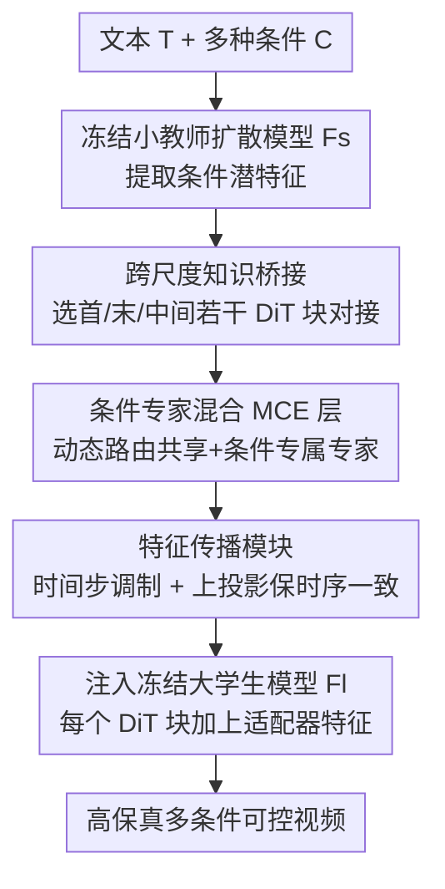

# Tea-Adapter: Teacher Adapter for Efficient Conditional Generation

**会议**: CVPR 2026  
**论文**: [CVF Open Access](https://openaccess.thecvf.com/content/CVPR2026/html/Zhang_Tea-Adapter_Teacher_Adapter_for_Efficient_Conditional_Generation_CVPR_2026_paper.html)  
**代码**: 待确认  
**领域**: 视频生成 / 可控生成  
**关键词**: 视频扩散、可控生成、反向蒸馏、条件专家混合、即插即用适配器

## 一句话总结
Tea-Adapter 是一个即插即用的适配器，用「反向蒸馏」把一个小型、已高效微调出多条件控制能力的教师视频扩散模型的控制知识迁移进一个冻结的大型学生视频扩散模型，再用「条件专家混合（MCE）」层在统一架构里动态路由多种条件、并用「特征传播模块」保证跨帧时序一致，从而在低显存下实现高保真、可组合的多条件可控视频生成。

## 研究背景与动机
**领域现状**：Diffusion Transformer（DiT）把高保真视频合成推上了新高度，但纯文本难以给出物体布局、运动轨迹等细粒度结构控制，于是社区把深度图、Canny 边缘、人体姿态等条件信号引入扩散框架。ControlNet 和 T2I-Adapter 是主流方案：冻结主生成网络、引入额外可训练分支来注入条件；多条件时常见做法是为每个条件再加一个 ControlNet。

**现有痛点**：作者点出三条具体硬伤。(1) **训练成本高**——为 DiT 视频模型微调 ControlNet 动辄需要约 5 亿参数、单条件高质量数据集要 48+ GPU 小时，而 SOTA 视频模型已超 140 亿参数，负担成倍放大；(2) **多条件融合僵硬**——把图像 ControlNet 架构搬到视频上无法应对相机运动、背景、人物特征等视频专属控制，多条件靠级联专门 ControlNet、彼此孤立、不能动态组合；(3) **条件一致性差**——图像条件适配器搬到视频会丢时序与条件相干性，出现帧闪烁、人物/背景抖动，即便加时序卷积也没显式建模条件特征的空间对应和时间步对齐。

**核心矛盾**：可控视频生成里「控制能力」和「训练/参数成本 + 时序一致」存在尖锐冲突——直接全量微调大模型太贵，级联 ControlNet 参数线性膨胀且组合僵硬，而轻量图像适配器又保不住视频的时序一致。

**本文目标**：在**不训练大模型、也不训练新 ControlNet** 的前提下，给大型 T2V 模型装上可灵活组合的多条件控制，并保持跨帧一致、把训练拉到低资源（单卡）可行。

**切入角度**：作者观察到两个关键现象——**同架构家族的小模型和大模型在潜空间里特征高度相似**，使得控制知识（尤其潜空间里的）能从微调好的小模型高效迁移到大基座；而且**低资源微调一个小模型，能让它具备比单条件 ControlNet 更丰富、更多样的条件控制能力**。

**核心 idea**：用「教师=小模型、学生=大模型」的**反向蒸馏**——先低成本把小视频扩散模型微调出多条件控制能力当教师，再训练一个 Tea-Adapter 把教师的控制信号「桥接」进冻结的大学生模型；适配器内部用 MCE 层统一处理异构条件、用特征传播模块保时序一致。

## 方法详解

### 整体框架
给定文本 $T$、多样视觉条件 $C$、大型 T2V 扩散模型 $F_l$、以及一个条件小视频扩散模型 $F_s$，Tea-Adapter $S$ 的目标是把 $F_s$ 里各种条件引导的生成能力迁移进 $F_l$、且**不训练新的 ControlNet**，最终生成 $V_{\text{gen}}=F_l(T, S(F_s(C)))$，要求结果同时对齐文本 $T$ 与条件 $C$。

流程是：条件先喂进**冻结的小型条件扩散模型**（教师，已通过微调或 LoRA 训练适配多条件），其潜特征注入 Tea-Adapter；由于大小模型 DiT 块数不同，作者**选取首块、末块和若干中间块**做特征桥接；适配器内部先用 MCE 层动态路由多条件、再用特征传播模块把控制特征对齐并注入大模型每个 DiT 块；大小两个预训练模型全程冻结，**只训练 Tea-Adapter**，因此远比微调大模型本身高效。

### 关键设计

**1. 反向蒸馏 + 跨尺度知识桥接：让大模型从小模型继承控制力，自己不动一根参数**

最贵的痛点是「为大模型训 ControlNet 太贵」。Tea-Adapter 反其道而行：先**低成本微调一个小视频扩散模型**让它学会多条件控制当教师，再训练适配器把教师的控制能力「蒸」进冻结的大学生模型——之所以可行，是因为同架构家族的大小模型潜空间特征高度相似（论文 Fig.2），控制信号本质上是一次「潜空间特征的高效搬运」。具体借鉴 ControlNet：用扩散块的可训练副本和零初始化线性层注入条件信息；又因大小模型 DiT 块数不一致，只挑首块、末块和几个中间块做桥接，从而只训练 Tea-Adapter 即可。经验上相比 DiT-ControlNet 减少约 70% 可训练参数（去掉 MCE 层时）而性能相当。

**2. 条件专家混合（MCE）层：一套架构里动态路由多条件，还能零样本扩到新条件**

第二个痛点是「多条件融合僵硬、每条件单训一个 ControlNet」。作者观察到不同条件信号之间存在内在关联（如 Canny 边缘与深度图），于是设计 MCE 层在单次前向里并发处理异构条件。给定 $K$ 个条件 token $\{c_1,\dots,c_K\}$，第 $t$ 时间步的条件输出为 $h^{mce}_t=\sum_{k=1}^{K} g_k(c_k,t)\cdot \mathcal{E}_{c_k}(x^a_t,t)$，其中门控 $g_k(c_k,t)=\mathrm{Softmax}(\mathrm{MLP}_g([c_k;t]))$ 按输入条件给各专家分配权重，$x^a_t$ 是适配器注意力输出。专家分两类：**共享专家** $\mathcal{E}_s$ 与**条件专属专家** $\mathcal{E}_c$，二者以 $\mathcal{E}_{c_k}(x^a_t,t)=\mathcal{E}_s(x^a_t,t)+\Delta\mathcal{E}_{c_k}(x^a_t,t)$ 组合——共享专家承载跨条件共性、$\Delta\mathcal{E}_{c_k}$ 只学条件专属增量。推理时只激活相关专家做稀疏路由，省算力；引入新条件时只需加新专家、并可用已有专家权重初始化以快速收敛。这套设计既支持单条件也支持多条件组合，还能靠专家间共享知识对未见条件做零样本泛化，参数比 Multi-ControlNet 更少。

**3. 特征传播模块：把控制特征对齐时间步、注入大模型并保住跨帧一致**

第三个痛点是「图像式条件注入保不住视频时序一致」。特征传播模块含一个可学调制因子、一个时间投影层和一个上投影层：上投影把小模型的条件信息线性映射到大模型的潜空间，可学的缩放调制配合时间投影按去噪阶段自适应地调整条件特征的贡献强度。给定适配器在时间步 $t$ 的潜特征 $x^a_t$，先算它与文本嵌入 $c_{txt}$ 的交叉注意力，再按 $\alpha_{\text{scale}}=\mathrm{Modulation}+\mathrm{Time\_Proj}(t)$、$x^{a'}_t=\mathrm{Up\_Proj}(x^a_t)\cdot\alpha_{\text{scale}}+\mathrm{Up\_Proj}(h^{mce}_t)$ 得到适配器输出，最后以**加性整合** $x_t=x_t+x^{a'}_t$ 注入大模型潜空间——这样既augment了大模型的先验、又保住其结构完整性。让缩放随去噪阶段和时间步对齐，是把图像适配器的时序短板补上的关键。

### 损失函数 / 训练策略
大小两个预训练扩散模型全程**冻结**，只训练 Tea-Adapter。骨干用两组开源 T2V 模型：Wan2.1-1.3B / Wan2.1-14B 与 CogVideoX-2B / CogVideoX-5B（小作教师、大作学生）。从 Koala-36M 采样 15K 视频并生成灰度/低分降质版本，训练前预提取人体姿态、深度图、Canny 边缘等辅助条件；约在 1×H100 80GB 上训 2 天。评估用人工精选 100 条多类别高质量视频，指标含 LPIPS、SSIM、CLIP Score、FVD。

## 实验关键数据

### 主实验
部署在 14B T2V 基座上，与 ControlNet 类、Adapter 类 SOTA 在 Canny / 深度 / 姿态三种条件上对比（FVD↓、CLIP↑、LPIPS↓、SSIM↑，外加时序一致性↑）。

| 方法 | Canny FVD↓ | Canny CLIP↑ | Depth FVD↓ | Pose FVD↓ | 时序一致性↑ |
|------|------|------|------|------|------|
| X-Adapter | — | 0.545 | — | — | 0.754 |
| Uni-ControlNet | — | 0.642 | — | — | 0.763 |
| UniControl | — | 0.584 | — | — | 0.876 |
| Ctrl-Adapter | 427.06 | 0.757 | 448.29 | 487.43 | 0.981 |
| DiT-ControlNet | 425.25 | 0.781 | 540.57 | 537.12 | 0.978 |
| Wan2.1-14B（全量微调，上界参考） | **229.19** | **0.919** | **254.24** | **200.91** | 0.979 |
| **Tea-Adapter（Ours）** | 289.57 | 0.918 | 292.34 | 300.58 | **0.984** |

要点：Tea-Adapter 在 Adapter 类里全面超过 X-Adapter 和 Ctrl-Adapter，CLIP 与全量微调几乎打平（如 Canny 0.918 vs 0.919）、**时序一致性最高（0.984）**；且它只用约 10K 视频训练，而对比基线常用 100K+ 视频和更多 GPU。FVD 上仅次于「全量微调 14B」这一资源上界，但 Tea-Adapter 不训练大模型、也不训练新 ControlNet。

### 消融实验
| 配置 | FVD↓ | LPIPS↓ | SSIM↑ | CLIP↑ | 说明 |
|------|------|------|------|------|------|
| Full Model | **292.34** | **0.251** | **0.591** | **0.913** | 完整模型 |
| w/o MCE | 303.20 | 0.268 | 0.573 | 0.904 | 去掉条件专家混合，运动相干性下降 |
| w/o 一半适配器 | 398.01 | 0.355 | 0.567 | 0.875 | 适配器数减半，运动一致与质量明显退化 |

### 关键发现
- **MCE 层是多条件融合的关键**：去掉后各指标普遍变差（FVD 292→303），且多角色场景里对个体运动与交互的控制变弱——它的收益来自多条件混合训练学到的条件间内在关系。
- **适配器数量有冗余空间**：适配器从 12 个减到 7 个时大多指标不显著退化，参数近乎减半也能保住控制保真——说明特征传播模块与 MCE 的组合能在更少适配器下兜住性能；但**减到一半（如去掉一半适配器）就明显塌**（FVD 飙到 398），存在下限。
- **跨尺度迁移成立**：在小模型、大模型与本方法的同架构对比中，验证了「小教师→大学生」的反向蒸馏确实能高效搬运控制能力。

## 亮点与洞察
- **「反向蒸馏」颠倒了常规蒸馏方向**：让低成本微调的小模型当教师、把控制力蒸进冻结大模型，绕开了「给 14B 大模型训 ControlNet」的高昂成本——其底层依据是同架构大小模型潜空间特征相似，这个观察本身就很有迁移价值。
- **MCE 用「共享专家 + 条件专属增量」**（$\mathcal{E}_s+\Delta\mathcal{E}_{c_k}$）统一多条件，新条件只加专家、可用旧专家初始化，天然支持零样本扩条件——把 MoE 思路落到「条件」粒度上，是可复用的多条件控制范式。
- **特征传播按去噪时间步自适应调制并加性注入**，显式补上了图像适配器在视频上的时序短板，时序一致性反超全量微调（0.984 vs 0.979）。

## 局限与展望
- **依赖一个已具备多条件控制能力的小教师**：教师需先经微调/LoRA 训练，若小模型本身控制力弱，反向蒸馏的上界也会被拉低。
- **FVD 仍逊于全量微调上界**：在视觉保真的 FVD 上 Tea-Adapter 距「全量微调 14B」有可见差距（如 Canny 289.6 vs 229.2），换来的是不训大模型/不训新 ControlNet 的效率，属于效率-保真的折中。
- **评估规模偏小**：定量评测用人工精选 100 条视频，类别覆盖与规模有限；适配器减半即明显塌也说明压缩有下限（⚠️ 桥接块的具体选取数量、专家数、各超参以原文与补充材料为准）。

## 相关工作与启发
- **vs Multi-ControlNet**：后者多条件靠级联孤立 ControlNet、参数线性膨胀且不能动态组合；Tea-Adapter 用单一 MCE 层动态路由，参数更少、支持单/多条件与零样本扩条件。
- **vs Ctrl-Adapter / X-Adapter**：它们把图像 ControlNet 特征注入视频模型，但保不住跨帧一致（X-Adapter 帧间人物外观抖动）；Tea-Adapter 靠特征传播模块拿到最高时序一致性。
- **vs DiT-ControlNet**：在 DiT 里插零模块学新条件、不训骨干但训练开销大；Tea-Adapter 通过「小教师→大学生」反向蒸馏，去掉 MCE 层时仍比 DiT-ControlNet 少约 70% 可训练参数而性能相当。

## 评分
- 新颖性: ⭐⭐⭐⭐⭐ 反向蒸馏（小教师蒸大学生）+ MCE 条件路由的组合在可控视频生成里新颖且自洽
- 实验充分度: ⭐⭐⭐⭐ 三条件定量 + 消融 + 跨尺度验证较完整，但评测集仅 100 条、缺更大规模与更多条件类型
- 写作质量: ⭐⭐⭐⭐ 动机三难点清晰、模块分工明确；部分公式排版与符号略粗糙
- 价值: ⭐⭐⭐⭐⭐ 让 14B 级可控视频生成在单卡低资源下可行，效率与灵活性兼顾，落地意义大

<!-- RELATED:START -->

## 相关论文

- [\[CVPR 2026\] FrameDiT: Diffusion Transformer with Matrix Attention for Efficient Video Generation](framedit_diffusion_transformer_with_matrix_attention_for_efficient_video_generat.md)
- [\[CVPR 2026\] Less is More: Data-Efficient Adaptation for Controllable Text-to-Video Generation](less_is_more_data-efficient_adaptation_for_controllable_text-to-video_generation.md)
- [\[CVPR 2026\] HVG-3D: Bridging Real and Simulation Domains for 3D-Conditional Hand-Object Interaction Video Synthesis](hvg-3d_bridging_real_and_simulation_domains_for_3d-conditional_hand-object_inter.md)
- [\[CVPR 2026\] Dual-Granularity Memory for Efficient Video Generation](dual-granularity_memory_for_efficient_video_generation.md)
- [\[CVPR 2026\] Content-Aware Dynamic Patchification for Efficient Video Diffusion](content-aware_dynamic_patchification_for_efficient_video_diffusion.md)

<!-- RELATED:END -->
