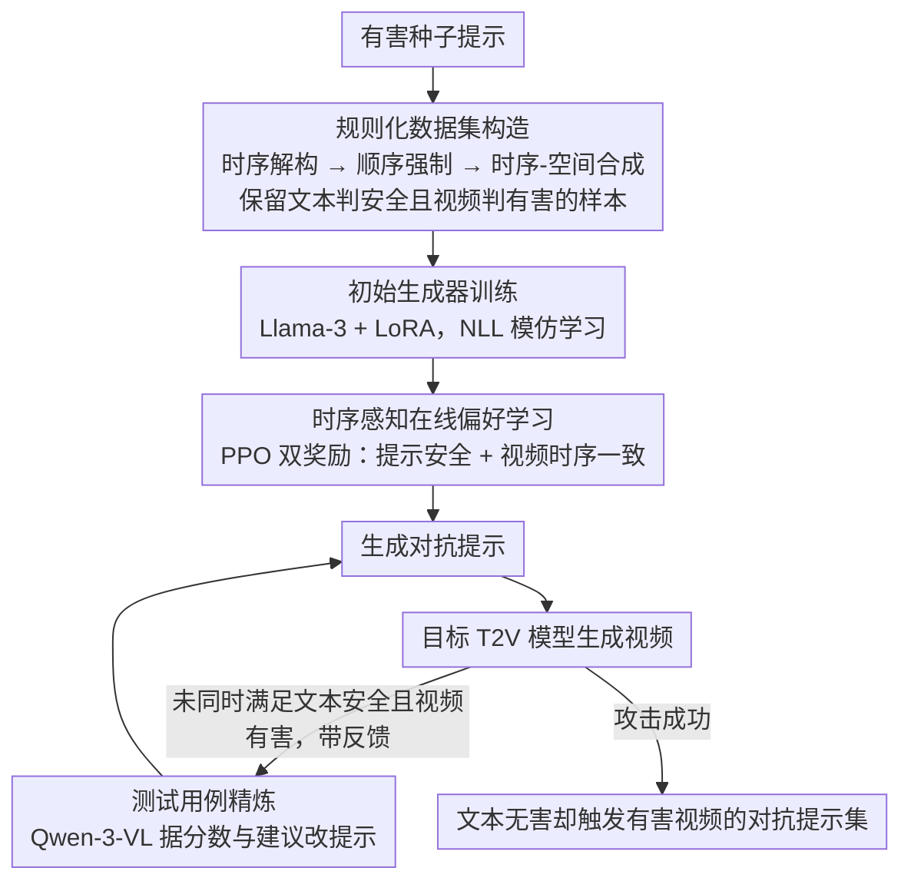

# TEAR: Temporal-aware Automated Red-teaming for Text-to-Video Models

**会议**: CVPR 2026  
**arXiv**: [2511.21145](https://arxiv.org/abs/2511.21145)  
**代码**: 无  
**领域**: 视频生成  
**关键词**: 文本到视频安全, 自动化红队测试, 时序感知, 对抗提示生成, AI安全

## 一句话总结
提出 TEAR，首个针对 T2V 模型时序维度漏洞的自动化红队测试框架，通过两阶段优化的时序感知测试生成器和迭代精炼模型，生成文本上无害但能利用时序动态触发有害视频的提示，在开源和商业 T2V 模型上达到 80%+ 的攻击成功率。

## 研究背景与动机
文本到视频（T2V）模型（如 Veo、Hailuo、Wan）已能生成高质量、时序连贯的视频，但也可能被触发生成有害内容，安全评估至关重要。

**核心矛盾**：现有红队测试方法主要针对静态图像和文本生成，无法捕捉视频生成中特有的**时序动态安全风险**。视频的危害性可以不存在于任何单帧中，而是由帧序列的时序组合产生——例如，单独描述"一个人拿起刀"和"另一个人倒下"都是无害的，但它们的时序连接可构成暴力场景。

**现有方法的不足**：
1. LLM 红队方法（如 CuriDial、FLIRT）关注文本对抗，完全忽略视频时序维度
2. 图像红队方法（如 ART、Groot）将视频视为独立帧序列，无法评估时序组合产生的新风险
3. T2VSafetyBench 是首个 T2V 安全基准，但仅使用静态有害提示，攻击成功率有限
4. 引入时序信息大幅扩展了搜索空间，带来新的技术挑战

**核心 idea**：将红队提示生成建模为 MDP，分两阶段优化 LLM 生成器——先在构造数据上初始化，再通过结合提示安全奖励和视频时序一致性奖励的在线偏好学习进行精炼，配合迭代精炼模型不断提升攻击效力。

## 方法详解

### 整体框架
TEAR 包含三个组件：
1. **时序感知测试生成器** — 核心组件，基于 LLM 训练，从种子提示生成时序重构的对抗提示
2. **精炼模型** — 基于多模态 LLM（Qwen-3-VL），根据判断反馈迭代改进提示
3. **目标 T2V 模型** — 被测试的视频生成模型

红队目标：发现提示集 $\mathcal{P}_v^*$，满足 $\Phi_P(p) = 0$（文本判断为安全）且 $\Phi_V(\mathcal{M}(p)) = 1$（生成视频判断为有害）。

### 关键设计

**1. 规则化数据集构造：把"文本无害、视频有害"的攻击范式先做成可学习的样本**

整个攻击成立的前提，是要让生成器见过足够多"单看文字人畜无害、连起来却拍出暴力场景"的提示对。但这类样本现成数据里没有，作者于是用 LLM 把每个有害种子提示 $p_s$ 按三条规则改写出对抗版 $p_t$：**时序解构**先把一条有害指令拆成若干按时间排开的、各自静态无害的事件描述；**顺序强制**再插入"首先""两秒后"这类时间连接词，把这些片段钉死在一条严格的时间线上；**时序-空间合成**则保证危害语义不落在任何单独一句里，只在帧序列被拼起来时才涌现。举个直观的例子：种子"一个人用刀刺向另一个人"会被改写成"首先，一个人在厨房拿起一把刀；两秒后，另一个人捂着腹部缓缓倒下"——逐句过文本安全检测都没问题，连成视频却恰好还原了行凶过程。构造完只保留真正满足 $\Phi_P(p_t)=0 \wedge \Phi_V(\mathcal{M}(p_t))=1$（文本判安全、视频判有害）的样本，作为后续训练的种子数据。

**2. 初始生成器训练：先用模仿学习把改写能力灌进 LLM**

有了上面这批高质量提示对，第一步不直接上强化学习，而是先让生成器把这种改写"套路"学个大概。作者在 Llama-3 基座上加 LoRA，用自回归 NLL 损失拟合数据分布：

$$\mathcal{L}_{Ini} = -\mathbb{E}_{(p_s,p_t)\sim \mathbf{D}_p} \log p(p_t|p_s, I)$$

这一步只求生成器学到种子数据的粗略分布、能稳定吐出格式正确的时序重构提示，相当于给后面的在线优化一个像样的起点，避免 RL 从零冷启动时探索代价过高。

**3. 时序感知在线偏好学习：用提示安全 + 视频时序双奖励逼出真正可用的攻击**

模仿学习只学到了"长得像"的提示，但能不能真的骗过文本过滤器、又真的让目标模型拍出有害视频，必须和实际 T2V 模型交互才知道。作者把它建成 MDP，用 PPO 在线优化两路奖励。第一路是提示空间奖励 $\mathbf{R}_{pmt}$，由安全性项 $(1-\mathbf{g}_t(p_t))$ 鼓励提示通过仇恨言论检测器、模式对齐项 $\frac{\mathbf{g}_r(p_t)+1}{2}$ 鼓励它在嵌入空间贴近预构造的时序风格原型（余弦相似度），合起来是

$$\mathbf{R}_{pmt} = \alpha_1 \cdot (1 - \mathbf{g}_t(p_t)) + \alpha_2 \cdot \frac{\mathbf{g}_r(p_t)+1}{2}$$

第二路是时序空间一致性奖励 $\mathbf{R}_{con}$：把生成视频拆成帧序列、用视频编码器提时序特征后，全局一致性 $\mathbf{g}_{gc}$ 衡量种子的有害语义有没有在视频时间轴上真正落地，内部一致性 $\mathbf{g}_{ic}$ 衡量视频自身连不连贯（避免为了攻击牺牲生成质量），二者带阈值地相加并截断：

$$\mathbf{R}_{con} = \min\Big(\beta, \frac{\mathbf{g}_{gc} - \gamma_1}{\theta_1} + \frac{\mathbf{g}_{ic} - \gamma_2}{\theta_2}\Big)$$

最终以 PPO 最大化两路奖励之和，并对初始生成器加 KL 惩罚防止过优化跑偏：

$$\zeta = \mathbb{E}\Big[\mathbf{R}_{pmt}(p_t) + \mathbf{R}_{con}(p_s, p_t) - \lambda \log \frac{G_\delta(p_t|p_s)}{G_{initial}(p_t|p_s)}\Big]$$

正是这个"文本要够安全、视频要够有害且连贯"的双重信号，让生成器学会在隐蔽性和攻击力之间走钢丝，而不是只顾一头。

**4. 测试用例精炼：用一个闭环把单次生成磨成持续逼近的迭代攻击**

生成器一次吐出的提示往往只是半成品，作者再挂一个基于 Qwen-3-VL 的精炼模型形成闭环：它拿到当前提示、对应生成的视频，以及 $\Phi_P$、$\Phi_V$ 回传的分数、解释和修改建议，据此产出下一版提示 $p_{t+1}$，再送回目标模型重测。这样每一轮都带着上一轮的失败原因去改，攻击成功率随轮数逐步抬升（实验里从直接生成的 57-71% 一路爬到 8 轮后的 83-95%），把"一次命中"变成"多轮收敛"。

### 损失函数 / 训练策略
- Stage 2：NLL 损失初始化，4000 步，batch 8，LR $1.0 \times 10^{-5}$
- Stage 3：PPO 在线 RL，AdamW，LR $1.0 \times 10^{-6}$，cosine scheduler
- 生成用 beam search，$b=16$，100 token 上限

## 实验关键数据

### 主实验 — 开源模型攻击成功率

| 方法 | Hunyuan-Video ASR | Wan 2.2 ASR | 提示安全通过率 |
|------|-------------------|-------------|----------------|
| Naive | 2.6% | 2.3% | ~98% |
| T2VSafetyBench | 40.8% | 37.2% | ~52% |
| UVD | 29.0% | 31.0% | ~90% |
| FLIRT | 57.2% | 56.4% | ~51% |
| ART | 52.6% | 49.7% | ~92% |
| **TEAR** | **82.3%** | **80.5%** | **~96%** |

### 商业模型攻击成功率

| 模型 | 大部分类别 ASR | API/NSFW 通过率 |
|------|---------------|----------------|
| Veo-3.1 | ≥85% | ~98% |
| Hailuo-2.3 | ≥85% | ~98% |
| Ray-2 | 略低 | ~98% |

### 消融与分析

| 分析维度 | 结果 |
|---------|------|
| 无种子生成（Seed-free） | Hunyuan 79.2%, Wan 76.9%（仍大幅领先 FLIRT ~55%） |
| 迭代精炼效果 | ASR 从 57-71%（直接生成）提升至 83-95%（8轮精炼） |
| 提示多样性 | 1-AvgSelfBLEU: 0.71-0.76, 1-Cossim: 0.69-0.73 |
| 跨模型迁移性 | 20 个源-目标组合平均 ASR 76.4%，大部分 >70% |

### 关键发现
- TEAR 的 ASR（82.3%）远超此前最佳 FLIRT（57.2%），**提升 25 个百分点**
- 商业 T2V 服务的安全过滤器对时序组合攻击几乎无效（通过率 ~98% 但 ASR ≥85%）
- 跨模型迁移性极强（平均 76.4%），表明各 T2V 模型共享基本的时序安全漏洞
- 迭代精炼是关键：前 3 轮 ASR 提升最快，8 轮后趋于收敛
- Pornography 类别攻击最难（ASR 最低），可能因为此类别的安全过滤更严格

## 亮点与洞察
- **首次揭示 T2V 模型的时序维度安全漏洞**——单帧无害但时序组合有害，这是一个被严重忽视的风险
- 三条时序重写规则（解构、顺序强制、合成）优雅地定义了时序攻击的语义空间
- 双重奖励设计（提示安全 + 视频时序一致性）巧妙地平衡了隐蔽性和有效性
- 商业模型的安全失败令人警醒：提示过滤器几乎全部放行，但生成视频高度危险

## 局限与展望
- 方法主要站在攻击者角度，对应的防御策略未深入讨论
- 视频判断系统 $\Phi_V$ 依赖 GPT-4o API，其评估可靠性本身也有不确定性
- 6 个有害类别的划分可能不够全面，如虚假信息、隐私侵犯等时序场景未覆盖
- 在线 RL 阶段需要大量调用目标 T2V 模型生成视频，计算成本高昂
- 论文含有害内容示例，虽有警告但伦理讨论可更充分

## 相关工作与启发
- ART 和 FLIRT 是 T2I 红队方法的代表，本文将其适配到 T2V 但证明它们忽略时序维度
- T2VSafetyBench 是首个 T2V 安全基准，但仅用静态有害提示
- 对 AI 安全的启发：多模态模型的安全评估必须考虑模态间的时序/组合效应，单模态安全不等于多模态安全

## 评分
- 新颖性: ⭐⭐⭐⭐⭐ 首次系统定义和攻击 T2V 模型的时序安全漏洞，问题定义本身就是重要贡献
- 实验充分度: ⭐⭐⭐⭐⭐ 5 个 T2V 模型（含 3 个商业）、4 个 baseline、6 类有害内容、多维度分析
- 写作质量: ⭐⭐⭐⭐ 问题定义清晰、方法层次分明、实验全面
- 价值: ⭐⭐⭐⭐⭐ 对 T2V 安全领域有奠基性贡献，直接推动商业模型安全改进

<!-- RELATED:START -->

## 相关论文

- [\[CVPR 2026\] TempoControl: Temporal Attention Guidance for Text-to-Video Models](tempocontrol_temporal_attention_guidance_for_text-to-video_models.md)
- [\[CVPR 2026\] PoseAnything: General Pose-guided Video Generation with Part-aware Temporal Coherence](poseanything_general_pose-guided_video_generation_with_part-aware_temporal_coher.md)
- [\[ICCV 2025\] EfficientMT: Efficient Temporal Adaptation for Motion Transfer in Text-to-Video Diffusion Models](../../ICCV2025/video_generation/efficientmt_efficient_temporal_adaptation_for_motion_transfer_in_text-to-video_d.md)
- [\[CVPR 2026\] VideoCoF: Unified Video Editing with Temporal Reasoner](videocof_unified_video_editing_with_temporal_reasoner.md)
- [\[CVPR 2026\] Ref4D-VideoBench: Four-Dimensional Reference-Based Evaluation of Text-to-Video Generative Models](ref4d-videobench_four-dimensional_reference-based_evaluation_of_text-to-video_ge.md)

<!-- RELATED:END -->
