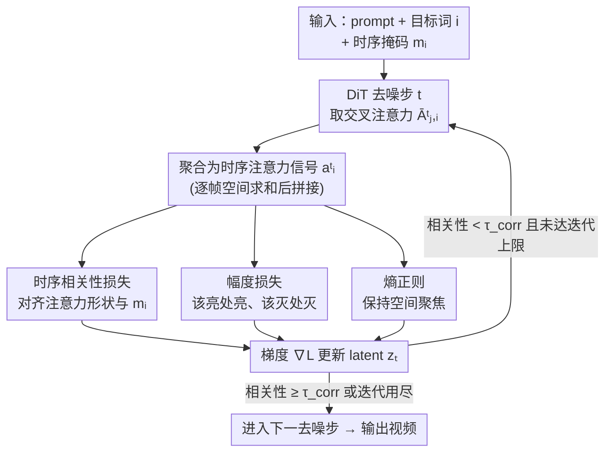

# TempoControl: Temporal Attention Guidance for Text-to-Video Models

**会议**: CVPR 2026  
**论文**: [CVF Open Access](https://openaccess.thecvf.com/content/CVPR2026/html/Schiber_TempoControl_Temporal_Attention_Guidance_for_Text-to-Video_Models_CVPR_2026_paper.html)  
**代码**: 无（仅有项目页 https://shiraschiber.github.io/TempoControl/）  
**领域**: 视频生成 / 扩散模型  
**关键词**: 文本到视频、时序控制、交叉注意力、推理时优化、训练无关

## 一句话总结
TempoControl 在文生视频扩散模型的去噪过程中，直接对交叉注意力图做几步梯度优化，用「相关性 + 幅度 + 熵」三项损失把某个词的注意力时序对齐到用户给定的掩码上，从而无需重训练、无需标注数据就实现「让某个物体/动作在第几秒出现」的细粒度时序控制。

## 研究背景与动机
**领域现状**：以 Wan 2.1、CogVideoX、LTX 为代表的文生视频扩散模型已经能从一句自然语言生成高质量、空间一致的视频，配套的可控生成研究也很活跃——相机轨迹、物体掩码、布局条件、运动迁移等空间/运动控制手段层出不穷。

**现有痛点**：但「**时序控制**」几乎是空白。用户想精确指定「狗在视频后半段才出现」「雷声响起的那一刻天空才亮起来」时，现有模型做不到。作者发现一个反直觉的事实：在 prompt 里写明确的时间提示词（"in the fourth second…"）不但没用，反而**拉低画质**——Wan 2.1 加上时间提示词后 Imaging Quality 从 59.99% 掉到 53.76%，时序准确率几乎没变。这说明**时序控制不是 prompt 工程问题**，模型内部根本没把时间信息正确表征出来。

**核心矛盾**：要做时序控制，常规思路是用「带时间标注的视频-文本对」去微调（如最相关的 MinT）。但视频数据本就稀缺，再给它标注「什么概念在第几帧出现」成本极高、难以规模化；合成这种时序精确的数据（尤其是抽象的「运动」概念）更是非常困难。于是「想要时序可控」和「不想付出标注/训练代价」之间存在矛盾。

**切入角度**：作者注意到，扩散模型里的**交叉注意力图本身就编码了「哪个词在哪一帧被实现」的强信号**——某个词对某一帧 latent 的注意力强度，天然反映了这个概念此刻是否「在场」。既然信号已经在那里，就不必再训练，只要在推理时**直接把这个注意力信号掰到想要的时序形状上**即可。

**核心 idea**：把「某个词的逐帧注意力强度」聚合成一个时序向量，在去噪的前几步用几次梯度下降，把它对齐到用户给的时序掩码上——纯推理时优化，不动模型参数，不需要任何额外数据。

## 方法详解

### 整体框架
TempoControl 是一个**叠加在冻结文生视频扩散模型之上的推理时优化器**。骨干用的是 Wan 2.1：视频先经 3D 因果 VAE 编码成 latent $z\in\mathbb{R}^{T'\times H'\times W'\times C}$，再展平成 $n_v=T'\cdot H'\cdot W'$ 个 video token，prompt 经文本编码器得到词 token，DiT 在 latent 空间逐步去噪。

控制信号是一个**二值时序掩码** $m_i=[m_{i,1},\dots,m_{i,T'}]$，$m_{i,j}\in\{0,1\}$ 表示词 $p_i$ 是否应该在第 $j$ 帧出现（例如「狗只在后半段出现」就是后半为 1）；掩码也可以取连续值表示出现强度（音频对齐时用声音强度）。

整个流程是一个带反馈的回环：在去噪的**前 $k$ 步**，每一步先正常跑一次 DiT 取出交叉注意力，把目标词 $i$ 的注意力**沿空间求和、沿帧拼接**成时序向量 $a^t_i$，再用三项损失衡量它和掩码 $m_i$ 的差距，把梯度 $\nabla_{z_t}\mathcal{L}_t$ 回传去更新当前 latent $z_t$（用 AdamW，每步最多 $l$ 次迭代，公式 $z'_t = z_t - \alpha\nabla_{z_t}\mathcal{L}_t$），直到对齐够好或迭代用尽，再进入下一去噪步。模型权重始终不变。

### 关键设计

**1. 时序相关性损失：把注意力的「时间形状」掰到掩码上**

这是方法的主损失，直击「概念出现的时机不对」这一核心痛点。作者先把词 $i$ 在去噪步 $t$、第 $j$ 帧的标量注意力定义为 $\hat{A}^t_{j,i}=\langle\bar{A}^t_{j,i}\rangle_{x,y}$（对空间坐标求和），再把各帧拼成时序向量 $a^t_i=[\hat{A}^t_{1,i},\dots,\hat{A}^t_{T',i}]$（首帧因注意力不稳定被丢弃）。然后用 **Pearson 相关系数**衡量它和目标掩码 $m_i$ 的时序波形是否一致：

$$\mathcal{L}^t_{corr} = -\frac{\mathrm{Cov}(m_i, \tilde{a}^t_i)}{\sigma_{m_i}\sigma_{\tilde{a}^t_i}}$$

其中 $\tilde{a}^t_i$ 是 $a^t_i$ 的 min–max 归一化版本。最小化负相关即鼓励注意力波形和掩码同涨同落——掩码后半为 1，就推动注意力在后半段升高。这一项对绝大多数情形已经足够，是时序对齐的主力。但它有个固有短板：Pearson 是**尺度无关**的，即使注意力整体数值低到物体根本不可见，只要波形对得上也能拿高分。这就需要后面的幅度项来补。（注：当掩码方差为 0，比如要求某物体全程出现时，相关项无定义，会被略去。）

**2. 幅度损失：恢复尺度敏感性，让该出现的真出现、该消失的真消失**

针对相关性损失「只看形状不看大小」的盲区，幅度项直接调节注意力的**绝对强度**。它分两部分：在掩码激活处（$m_{i,j}>\tau$）鼓励注意力变大 $\mathcal{L}^t_\oplus=\frac{1}{T'}\sum_j \mathbb{1}\{m_{i,j}>\tau\}\cdot a^t_{i,j}$，在非激活处压制注意力 $\mathcal{L}^t_\ominus=\frac{1}{T'}\sum_j \mathbb{1}\{m_{i,j}\le\tau\}\cdot a^t_{i,j}$，最终取净差 $\mathcal{L}^t_{mag}=\mathcal{L}^t_\ominus-\mathcal{L}^t_\oplus$。阈值 $\tau\in[0,1]$ 判定某帧是否算「激活」，掩码取连续值（如音频强度）时它就筛出足够强的时刻。作者观察到两个不靠这项就治不好的现象——初始就不可见的词往往一直不可见、想彻底抹掉某个词又很难，幅度项正是用来「点亮」或「熄灭」整体激活水平。

**3. 注意力熵正则：防止为对齐时序而把空间语义搞坏**

只优化前两项时序目标会有副作用：注意力在空间上被摊得过散，导致物体语义损坏（论文里举的例子是手机被优化成扭曲的双屏平板）。熵正则在「词该出现」的帧上约束**空间注意力图的香农熵**：

$$\mathcal{L}^t_{entropy} = \frac{1}{T'}\sum_{j=1}^{T'}\mathbb{1}\{m_{i,j}>\tau\}\cdot H(\bar{A}^t_{j,i})$$

降低熵就是逼注意力聚焦成一团而非弥散。有意思的是，作者发现这一项不仅救回了空间一致性，还**顺带提升了整体画质**——消融里只用熵项的 Imaging Quality（59.52%）甚至超过文本 baseline，说明「别让注意力乱摊」对视频生成本身就有普适好处。三项合成总损失 $\mathcal{L}^t=\mathcal{L}^t_{corr}+\lambda_1\mathcal{L}^t_{mag}+\lambda_2\mathcal{L}^t_{entropy}$，实验取 $\lambda_1=0.3$、$\lambda_2=10$。

**4. 基于相关性的早停：按需分配优化算力**

有些视频天生就比较贴合目标时序，没必要每步都把 $l$ 次迭代用满。作者用相关性损失 $\mathcal{L}^t_{corr}$ 当早停信号：每个去噪步最多优化 $l$ 次，一旦相关性超过阈值 $\tau_{corr}$ 就立刻停下进入下一步，否则继续精修到上限。这让推理时间随难度自适应，避免在「本来就对」的样本上空耗算力——也是把这套推理时优化做得轻量可用的关键一环。

### 损失函数 / 训练策略
不训练模型，只在推理时优化 latent。仅对**前 5 个去噪步**做优化，每步最多 10 次梯度更新，学习率 $5\times10^{-4}$（双物体设定提到 $1\times10^{-3}$），AdamW 优化。整套流程零额外数据、零微调。

## 实验关键数据

### 主实验
作者自建时序控制 benchmark（单物体用 80 个 YOLOv10 类、双物体 82 对、运动 100 类），并提出新指标 **Temporal Accuracy**（用 YOLOv10 检测词是否在指定帧出现，分 presence/absence 两个分量）。所有 baseline 都是「在 prompt 里加显式时间提示词」的同骨干模型。下表为 Wan2.1-S（1.3B）骨干上的对比（TempoControl 即 Ours）：

| 设定 | 方法 | Temporal Acc ↑ | Absence ↑ | Presence ↑ | Img Quality ↑ |
|------|------|----------------|-----------|------------|---------------|
| 单物体 | Wan2.1-S baseline | 63.94 | 67.38 | 60.50 | 53.76 |
| 单物体 | **Ours (Wan2.1-S)** | **83.56** | **87.38** | **79.75** | **56.92** |
| 双物体 | Wan2.1-S baseline | 37.50 | 45.85 | 29.15 | 68.56 |
| 双物体 | **Ours (Wan2.1-S)** | **53.17** | **57.32** | **49.02** | **70.82** |
| 运动 | Wan2.1-S baseline | 19.00 | – | – | 60.46 |
| 运动 | **Ours (Wan2.1-S)** | **54.00** | – | – | **63.24** |

单物体时序准确率 +19.62%、双物体 +15.67%、运动 +35%，且画质同时提升（不像 baseline 加时间提示词会掉画质）。值得注意的是，运动设定下所有 baseline（含 14B/19B 大模型）都只有 18–28%，说明「按文本控制动作时机」是大模型也搞不定的难题，而本方法在 1.3B 小模型上就把它拉到 54%。在 VBench 多物体 benchmark 上也有提升（Temporal 76.37% vs. 74.13%）。

### 消融实验
单物体 benchmark 上逐项拆解三个损失（C=Pearson 相关，E=熵）：

| 配置 | Temporal Acc ↑ | Absence ↑ | Presence ↑ | Img Quality ↑ | 说明 |
|------|----------------|-----------|------------|---------------|------|
| Text（baseline） | 63.94 | 67.38 | 60.50 | 53.76 | 仅文本时间提示词 |
| Only C | 81.19 | 91.50 | 70.88 | 50.96 | 时序对齐强，但画质掉、absence 虚高 |
| Only E | 72.94 | 66.88 | 79.00 | 59.52 | 提 presence + 画质，单项画质最高 |
| C + E | 78.38 | 77.38 | 79.38 | 57.60 | 二者折中 |
| Ours (C+E+幅度) | **82.50** | **83.25** | **81.75** | 56.51 | 完整模型，综合最佳 |

### 关键发现
- **相关性项是时序对齐主力**：单独用 C 就能把 Temporal Acc 拉到 81%，但它会让 absence 虚高（漏检也算「不在场」）、画质下滑——印证了「Pearson 尺度无关」的盲区，需要幅度项补救。
- **熵项有意外的普适增益**：只用熵正则时 Imaging Quality（59.52%）反超文本 baseline，说明「约束注意力别摊散」对视频画质本身就有帮助，而不只是为时序控制服务。
- **用户研究支持**：50 名研究生对 16 组视频对盲评，时序准确率上 61.51% 选 Ours、仅 16.94% 选 Wan2.1；视觉质量 62.66% vs. 25.99% 也偏向 Ours。
- **零样本音视频对齐有潜力**：把音频的 onset-strength 包络归一化后当连续掩码喂进去（公式 $\tilde{s}_t$ 对强峰阈值保留、其余高斯平滑），无需任何配对数据训练就能让视频运动对齐到雷声等音频事件，是一个有想象空间的延伸方向。

## 亮点与洞察
- **「时序控制不是 prompt 问题」这个观察很有力**：作者用「加时间提示词反而掉画质、时序也没变好」直接证伪了「写清楚时间就行」的朴素假设，把问题定位到模型内部表征，从而正当化了显式控制机制的必要性。
- **复用已有信号而非新增模块**：交叉注意力图本就编码「词-帧」对应关系，方法只是把这个现成信号「掰」到目标形状，因此天然零数据、零训练、可叠加到任意带交叉注意力的文生视频骨干上——迁移成本极低。
- **三项损失各司其职、互补设计干净**：相关性管形状、幅度管尺度、熵管空间聚焦，且每一项都对应一个具体观察到的失败模式（波形不对 / 物体不可见 / 语义被搞坏），不是拍脑袋堆 loss。
- **熵正则「副业」提画质**这个发现可迁移：在其他注意力引导的生成任务里，加一个轻量的空间注意力熵正则，或许能顺手改善输出质量。

## 局限与展望
- 作者承认会**增加推理时间**（虽仍是纯推理、不重训），早停只是缓解而非消除。
- 可能引入**轻微属性漂移**（如颜色变化），因为现有目标没有显式约束完整语义一致性。
- 评测依赖 YOLOv10 检测 + 光流这类**代理指标**，absence 分量对检测失败/画质退化敏感、可能被虚高；作者也坦言主要增益来自 presence 而非 absence，需谨慎解读 absence 数字（⚠️ 这点会影响对「彻底抹掉某物体」能力的判断）。
- 音视频对齐只在「单一清晰音频事件」的简单场景验证，复杂多事件音频能否对齐仍未知。
- 因算力受限主实验主要在 1.3B 小模型上做，大骨干（14B/19B）上的完整提升曲线未充分展开。

## 相关工作与启发
- **vs MinT（最相关）**: MinT 通过在带时间标注的人类活动 caption 数据上微调，学习「每条指令何时开始」，但只能做**粗粒度的事件排序**，且依赖特定标注数据、泛化受限；本文做**单个概念的细粒度时机控制**，纯推理时、跨设定零训练。
- **vs Attend-and-Excite / Prompt-to-Prompt 等注意力控制**: 它们在**文生图**上做推理时注意力优化，保证所有实体都被渲染或支持文本驱动编辑，但都是**空间/语义**维度；本文把注意力优化的思路扩展到**时序**维度，是这条线在视频时间轴上的延伸。
- **vs MotionClone / DiTFlow / MOFT 等训练无关运动控制**: 它们依赖参考视频的稠密运动轨迹来迁移/编辑运动，**无法指定某概念何时出现或消失**；本文用用户给的时序掩码直接定义「出现时机」，控制维度不同且更直接。

## 评分
- 新颖性: ⭐⭐⭐⭐⭐ 首个文生视频推理时细粒度时序控制方法，且把「时序控制不是 prompt 问题」论证得很扎实
- 实验充分度: ⭐⭐⭐⭐ 多骨干 + 自建 benchmark + 消融 + 用户研究较完整，但主实验偏小模型、absence 指标可靠性有保留
- 写作质量: ⭐⭐⭐⭐⭐ 动机推导清晰、三项损失对应三个失败模式、图文配合好读
- 价值: ⭐⭐⭐⭐ 训练无关、可叠加任意骨干，实用性强；音视频对齐延伸有想象空间

<!-- RELATED:START -->

## 相关论文

- [\[CVPR 2026\] TEAR: Temporal-aware Automated Red-teaming for Text-to-Video Models](tear_temporal-aware_automated_red-teaming_for_text-to-video_models.md)
- [\[CVPR 2026\] Improving Motion in Image-to-Video Models via Adaptive Low-Pass Guidance](improving_motion_in_image-to-video_models_via_adaptive_low-pass_guidance.md)
- [\[CVPR 2026\] When Numbers Speak: Aligning Textual Numerals and Visual Instances in Text-to-Video Diffusion Models](when_numbers_speak_aligning_textual_numerals_and_visual_instances_in_text-to-vid.md)
- [\[ICCV 2025\] EfficientMT: Efficient Temporal Adaptation for Motion Transfer in Text-to-Video Diffusion Models](../../ICCV2025/video_generation/efficientmt_efficient_temporal_adaptation_for_motion_transfer_in_text-to-video_d.md)
- [\[CVPR 2026\] Efficient Long-Context Modeling in Diffusion Language Models via Block Approximate Sparse Attention](efficient_long-context_modeling_in_diffusion_language_models_via_block_approxima.md)

<!-- RELATED:END -->
