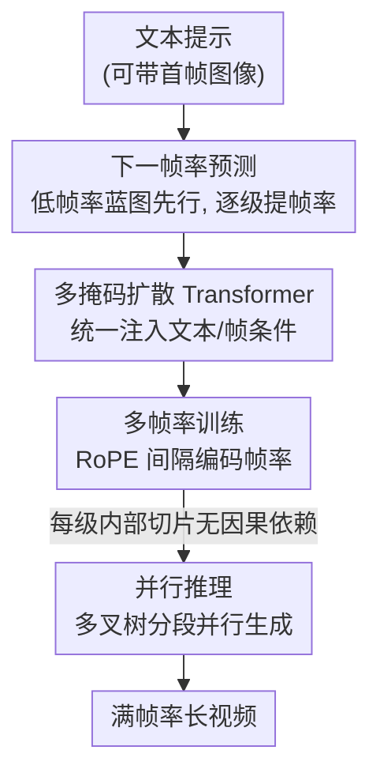

# TempoMaster: Efficient Long Video Generation via Next-Frame-Rate Prediction

**会议**: CVPR 2026  
**论文**: [CVF Open Access](https://openaccess.thecvf.com/content/CVPR2026/html/Ma_TempoMaster_Efficient_Long_Video_Generation_via_Next-Frame-Rate_Prediction_CVPR_2026_paper.html)  
**代码**: 无  
**领域**: 视频生成 / 扩散模型  
**关键词**: 长视频生成, 下一帧率预测, 扩散 Transformer, 并行推理, 多掩码条件

## 一句话总结
TempoMaster 把长视频生成重新表述为「下一帧率预测」——先用双向注意力一次性生成低帧率的全局蓝图，再逐级提高帧率补细节，每一级内部的片段可并行生成，从而在长程时序一致性和推理效率之间同时取胜，在 Vbench-Long 和人类评测上都刷到 SOTA。

## 研究背景与动机
**领域现状**：长视频生成目前有两条主流路线。一条是把整段视频当成一个时空体，对所有帧做双向注意力（DiT 类），能很好地建模长程一致性；另一条是自回归，按时间顺序一段段往后推（next-frame prediction），天然支持任意延长。

**现有痛点**：双向路线的计算/显存随序列长度**二次增长**，直接拉长视频代价高到不可接受；自回归路线则要维护一段不断变长的历史，为了不爆显存只能截断或压缩过去的帧——结果是模型「忘掉」早期内容，且每一步的微小预测误差会**逐步累积**，最终导致外观漂移（appearance drift）和运动不连贯。近期的 anchor-frame 方法（如 NUWA-XL）先生成稀疏关键帧再插帧，效果不错，但需要单独的参考帧生成器和专门的关键帧规划流程，训练和推理都更复杂。

**核心矛盾**：长程时序一致性和推理效率之间存在 trade-off——双向方法一致性好但贵，自回归方法便宜但会漂移、会遗忘。

**切入角度**：作者注意到视频在时间维度上有大量**冗余**——一段连贯的动态结构其实只用稀疏的若干关键帧就能确定，中间帧完全可以基于已学到的时序动态被高效地「填」出来。于是把高层时序语义的生成和低层视觉细节的生成**解耦**。

**核心 idea**：把长视频生成从「下一帧预测」改成「**下一帧率预测**」（next-frame-rate prediction）——先生成低帧率的全局蓝图确定整体动态，再逐级提高帧率细化局部细节；同一级内的片段因为内容已被父级确定、彼此无因果依赖，可以并行生成。

## 方法详解

### 整体框架
TempoMaster 的输入是一个文本提示（可带首帧图像），输出是一段长视频。它不再像自回归那样从左到右逐帧/逐段地生成，而是**从粗到细、按帧率分层**地生成：把同一段视频在时间轴上按步长 $m=2^i$ 下采样成 $K$ 个不同帧率的序列 $V^0, V^1, \dots, V^{K-1}$（$V^{K-1}$ 最稀疏、帧率最低，$V^0$ 是满帧率），生成时先出最低帧率的 $V^{K-1}$ 把全局动态一次性定下来，再以已生成帧为「锚点」逐级细化中间运动，直到满帧率。

整段视频的似然被重新分解为：

$$p(V) = p(V^{K-1}) \prod_{i=0}^{K-2} p(V^i \mid V^{i+1}, V^{i+2}, \dots, V^{K-2})$$

也就是说，每一帧率层都以**所有更稀疏的层**为条件。由于低帧率层已经把全局内容钉死，每个细化层可以把要生成的帧切成多个短 chunk **并行**喂给模型，从而在不损失质量的前提下处理不断增长的帧数。所有帧率层共享同一个 DiT，靠统一的「多掩码」条件接口和帧率位置编码来切换任务。

### 关键设计

**1. 下一帧率预测：用「先低帧率定全局、再逐级提帧率」替代「逐帧外推」**

这是全文的范式核心，针对的是自回归 next-frame prediction 的误差累积与遗忘问题。传统自回归把似然分解为 $p(V)=\prod_t p(x_t \mid x_0,\dots,x_{t-1})$，每一步都依赖上一步的输出，错误会沿时间传播。TempoMaster 把这个分解换成上面按帧率层的乘积：先生成最稀疏的 $V^{K-1}$（一次性、用双向注意力建立全局时序结构），再让每个更密的层以全部更稀疏层为条件去插中间帧。因为全局动态在第一步就被一次性确定，后续每一级只是「在已知骨架上补细节」，不是「在不确定的历史上继续猜」，于是时间冗余被用来**抵消**误差累积——更稀疏层的全局约束像一根定海神针，让密层不至于漂移。这也和 NUWA-XL 这类 anchor 方法不同：它不依赖固定尺度的稀疏关键帧 + 单独的参考帧生成器，而是在一个分层时序架构里用同一个模型捕捉**稠密的全局动态**，并解锁细粒度的并行。

**2. 多掩码扩散 Transformer（Multi-Mask DiT）：用一套接口吃下 T2V/I2V/续写等所有条件**

这个范式要求同一个模型既能处理初始层的「纯文本（+图像）」条件，又能处理细化层的「多帧（视频）」条件。常规做法是用 adapter 或 in-context 注入，但每种条件都要专门训练，不灵活也不高效。作者提出 **Multi-Mask**：把任意数量、任意时间位置的条件帧按其真实时序位置摆进一个**零填充**到目标长度的序列里，编码成 latent 后沿**通道维**和噪声 latent 拼接，从构造上保证 latent 级别的时序对齐；同时再拼一个**逐帧掩码**提供精确的 timestep 信息，缓解 VAE 压缩带来的时序歧义。它不引入额外参数、不增加上下文长度，却让单个模型把 T2V、I2V、FLF2V（首尾帧到视频）、视频续写都当成 Multi-Mask 条件的特例统一处理——细化层用上一层生成的帧当条件，本质上也是 Multi-Mask 的一种实例。

**3. 多帧率训练 + 随机化时序位置索引：让一个模型学会连续的帧率表示**

要让同一个 DiT 在不同帧率间自如切换，关键是怎么告诉模型「当前是什么帧率」。作者把帧率控制等价为**帧间间隔的操纵**，并通过改造的 RoPE 注入：对帧率层 $V^i$，把相邻帧的时序位置索引间隔设为 $2^i$，使位置索引序列与视频真实时间轴对齐，第 $j$ 帧的位置索引为

$$t_j = t_{\text{start}} + j \cdot 2^i, \quad t_{\text{start}} \sim \mathcal{U}[0, T_{max}]$$

这里的 $t_{\text{start}}$ 随机采样、位置编码从一个**连续宽区间**里取样，是为了防止模型过拟合到某组固定的时序索引，逼它学一个**连续**的位置函数，从而在时间维度上获得强外推能力（消融里这一项稳定带来涨点）。训练分两阶段：第一阶段在单一帧率下学会 Multi-Mask 条件下走完完整去噪轨迹（121 帧 @24fps，随机选 0%–15% 帧当条件）；第二阶段在 6/12/24 fps 多帧率数据上学下一帧率预测。两阶段都用 flow matching 损失 $\mathcal{L}_{\text{FM}}(\theta)=\mathbb{E}_{t,p_t(\mathbf{z}_0)}\big[\lVert \mathbf{v}_\theta(\mathbf{z}_t,t)-(\mathbf{z}_1-\mathbf{z}_0)\rVert_2^2\big]$，其中 $\mathbf{z}_t=(1-t)\mathbf{z}_0+t\mathbf{z}_1$。

**4. 并行推理：把分层生成组织成多叉树，同层片段并行出**

分层生成天然带来加速机会：作者把推理过程画成一棵多叉树，每个节点对应一个时间区间及其帧。由于某个区间的内容已被其**父节点**预先确定，同一层的子节点之间**没有因果依赖**，于是可以把父节点的帧切成多段、并行生成。设要生成 $N$ 帧、每个父节点分出 $W$ 个孩子（$W$ 叉树），第 $i$ 层在 $\frac{N}{2^{K-i}\cdot W^i}$ 帧的片段上操作，总复杂度构成等比级数

$$\frac{N^2}{4^K}\cdot \sum_{i=0}^{K-1}\Big(\frac{4}{W}\Big)^i$$

当 $W\ge 4$ 时级数收敛为常数，整体复杂度降到 $O(N^2/4^K)$，相对满序列双向注意力的 $O(N^2)$ 是指数级加速；若再计入层内并行，复杂度可改写为 $\frac{N^2}{4^K}\sum_i (4/W^2)^i$，把对 $W$ 的要求放宽到 $W\ge 2$ 仍能收敛。实验默认 $W=2$、分 6/12/24 fps 三级生成；还可以通过省略中间细化层（如直接从 $V^{K-1}$ 出 $V^0$）或减少后续层去噪步数进一步提速。

### 损失函数 / 训练策略
两阶段训练均用 flow matching 损失（见上式）。第一阶段单帧率 15000 步、学习率 5e-4，第二阶段多帧率 45000 步、学习率 2e-5，AdamW、weight decay 1e-4。基座模型基于 Wan2.2 的 MoE 架构（取高噪声专家），在约 300 万条高质量自采集片段（时长从数秒到数百秒）上训练。

## 实验关键数据

### 主实验
Vbench 自动评测（500 帧长视频）：TempoMaster 在与同/更大规模 SOTA 的对比中拿下最高总分。注意自回归类方法（MAGI、SkyReels-V2）在长视频上相比短视频明显掉分，正是迭代生成误差累积导致的时序漂移。

| 模型 | #Params | 总分 ↑ | 主体一致性 | 背景一致性 | 运动平滑 | 动态程度 | 成像质量 | 美学质量 |
|------|---------|--------|-----------|-----------|---------|---------|---------|---------|
| MAGI-1 | 24B | 78.50 | 98.26 | 97.29 | 99.41 | 21.38 | 66.36 | 55.91 |
| FramePack | 13B | 79.52 | 98.68 | 99.20 | 99.54 | 16.82 | 70.90 | 61.34 |
| SkyReels-V2 | 14B | 79.17 | 96.04 | 96.01 | 99.07 | 53.28 | 64.85 | 56.28 |
| MMPL | 14B | 78.80 | 96.25 | 95.36 | 98.82 | 49.26 | 66.48 | 55.80 |
| **Ours** | 14B | **80.30** | 97.41 | 97.87 | 98.94 | 41.10 | 70.20 | 59.62 |

人类评测（500 帧，1–5 分）：因为 Vbench 的一致性/平滑度指标偏好「运动少」的视频，作者把人类评测当作主要感知基准。TempoMaster 总分最高，语义对齐、运动质量、内容一致性优势明显。

| 模型 | 总分 ↑ | 美学 | 语义对齐 | 运动质量 | 内容一致性 |
|------|--------|------|---------|---------|-----------|
| FramePack | 3.39 | 3.73 | 3.28 | 2.88 | 3.67 |
| LongCat | 3.58 | 3.72 | 3.83 | 3.43 | 3.34 |
| SkyReels-V2 | 3.11 | 3.24 | 3.53 | 3.02 | 2.64 |
| MMPL | 2.93 | 3.19 | 3.43 | 2.65 | 2.44 |
| **Ours** | **3.69** | 3.71 | **3.92** | **3.45** | **3.68** |

### 消融实验
并行配置消融（短视频 121 帧，`f` 是帧率列表、`m` 是各级并行分段数，PFLOPs 越低越省）：三级 + 并行的 `f(6,12,24)m(1,2,4)` 在质量和算力间取得最佳平衡——总分最高且 FLOPs 远低于两级配置。

| 配置 | PFLOPs | 总分 ↑ | 说明 |
|------|--------|--------|------|
| f(6,24)m(1,4) | 74.05 | 80.55 | 两级，跳过 12fps |
| f(6,24)m(1,8) | 66.91 | 80.46 | 两级，并行度更高 |
| **f(6,12,24)m(1,2,4)** | 108.89 | **80.76** | 默认三级配置 |
| f(6,12,24)m(1,4,8) | 96.99 | 80.26 | 三级，并行度更高 |
| f(6,12,24)m(1,8,8) | 95.13 | 80.30 | 三级，并行度最高 |

随机化时序位置索引消融（500 帧长视频）：加随机化后各项 Vbench 指标在相同训练预算下一致优于不加。

| 配置 | 总分 ↑ | 动态程度 | 美学 |
|------|--------|---------|------|
| w/o random | 80.00 | 37.70 | 59.62 |
| w/ random | 80.19 | 39.09 | 59.74 |

### 关键发现
- **并行不掉质量**：不同并行配置下性能很稳健，说明把生成切片并行化几乎不带来质量退化——这是该范式相对自回归最有价值的工程红利。
- **指标与感知错位**：Vbench 的一致性/平滑度偏好「几乎不动」的视频（FramePack 动态程度仅 16.82 却拿高一致性分），所以作者特意用人类评测作主基准，避免被「静止即高分」误导。
- **长程稳定性**：用 Multi-Mask 续写策略（每步取前 5 秒、生成 480 帧），可在超过 1500 帧（分钟级）上保持时序连贯而无明显退化。

## 亮点与洞察
- **「下一帧率」而非「下一帧」是一次漂亮的维度切换**：把自回归的方向从「时间轴」搬到「帧率/时间分辨率轴」，既保留了双向注意力的全局一致性，又获得了自回归的可延展性，还顺带把误差累积转化为可被全局约束抑制的对象——一个公式分解的改动撬动三方面收益。
- **同层无因果依赖 ⇒ 天然并行**：「内容被父节点预先确定」这一观察直接把长视频生成的二次复杂度压成 $O(N^2/4^K)$，并行不是事后优化而是范式自带的性质，思路可迁移到任何「先粗后细」的序列生成。
- **Multi-Mask 把多任务统一成一个条件接口**：零填充 + 通道拼接 + 逐帧掩码，不加参数不加上下文就把 T2V/I2V/FLF2V/续写统一，这种「用掩码表达任意时间位置的条件」的做法对其他可控生成任务很有复用价值。

## 局限与展望
- 训练依赖约 300 万条自采集私有数据，且基座绑定 Wan2.2 MoE，复现门槛高、数据不公开。
- 全局蓝图一旦在最低帧率层定错（如全局运动语义有误），后续细化层难以纠正——范式把「先定全局」当优势，但也意味着全局错误会被放大，论文未深入分析这种失败模式。⚠️ 此为笔者推断，以原文为准。
- Vbench 与人类评测在多个维度上结论不一致，说明现有自动指标对「运动丰富但仍一致」的长视频评价能力有限，长视频评测本身仍是开放问题。
- $K$、$W$、各级去噪步数等是质量/算力的权衡旋钮，论文给了部分消融但未给出针对不同时长的自动选择策略。

## 相关工作与启发
- **vs 双向 DiT（Wan、CogVideoX 等）**：它们对全序列做双向注意力，一致性好但 $O(N^2)$ 复杂度难扩到长视频；TempoMaster 只在最稀疏层用一次全序列双向注意力，其余层在短片段上并行，复杂度降到指数级更优。
- **vs 自回归 / 续写方法（MAGI、SkyReels-V2、FramePack）**：它们逐段外推、靠截断或压缩历史，长视频上误差累积导致漂移、动态程度低；TempoMaster 用低帧率全局蓝图约束所有细化层，长视频指标不像自回归那样从短到长大幅掉分。
- **vs anchor-frame 方法（NUWA-XL）**：NUWA-XL 用固定尺度的稀疏关键帧 + 单独的参考帧生成器再插帧；TempoMaster 在统一分层架构里用同一个模型做稠密全局动态建模，无需额外的关键帧规划与参考帧生成器，并解锁细粒度并行。

## 评分
- 新颖性: ⭐⭐⭐⭐⭐ 「下一帧率预测」是对长视频生成范式的本质性重述，简洁且撬动一致性/效率/并行三重收益。
- 实验充分度: ⭐⭐⭐⭐ Vbench + 人类评测 + 并行/随机化消融 + 1500 帧压力测试较完整，但数据私有、缺对全局错误失败模式的分析。
- 写作质量: ⭐⭐⭐⭐⭐ 动机推导清晰，公式与图示（帧率层/多叉树/Multi-Mask）配合到位。
- 价值: ⭐⭐⭐⭐⭐ 范式简单可迁移，并行红利和全局一致性对实际长视频生成系统很有吸引力。

<!-- RELATED:START -->

## 相关论文

- [\[ICML 2026\] Enhancing Train-Free Infinite-Frame Generation for Consistent Long Videos](../../ICML2026/video_generation/enhancing_train-free_infinite-frame_generation_for_consistent_long_videos.md)
- [\[CVPR 2026\] A Frame is Worth One Token: Efficient Generative World Modeling with Delta Tokens](a_frame_is_worth_one_token_efficient_generative_world_modeling_with_delta_tokens.md)
- [\[CVPR 2026\] Free-Lunch Long Video Generation via Layer-Adaptive O.O.D Correction](free-lunch_long_video_generation_via_layer-adaptive_ood_correction.md)
- [\[CVPR 2026\] Video-as-Answer: Predict and Generate Next Video Event with Joint-GRPO](video-as-answer_predict_and_generate_next_video_event_with_joint-grpo.md)
- [\[CVPR 2026\] Endless World: Real-Time 3D-Aware Long Video Generation](endless_world_real-time_3d-aware_long_video_generation.md)

<!-- RELATED:END -->
