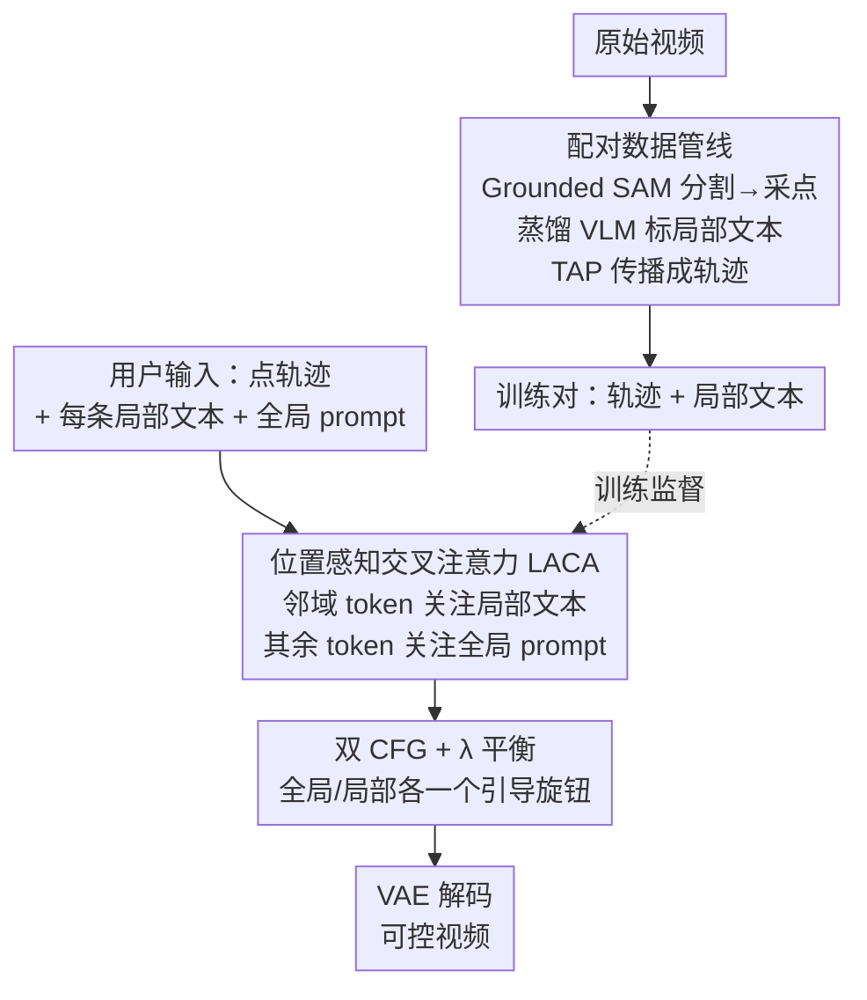

# TGT: Text-Grounded Trajectories for Locally Controlled Video Generation

**会议**: CVPR 2026  
**论文**: [CVF Open Access](https://openaccess.thecvf.com/content/CVPR2026/html/Zhang_TGT_Text-Grounded_Trajectories_for_Locally_Controlled_Video_Generation_CVPR_2026_paper.html)  
**代码**: 无  
**领域**: 视频生成  
**关键词**: 可控视频生成, 轨迹控制, 局部文本, 交叉注意力, 文生视频

## 一句话总结
TGT 给文生视频里的每条点轨迹绑定一段局部文本，用一个即插即用的「位置感知交叉注意力（LACA）」把"哪个物体、长什么样、怎么动"对齐到轨迹邻域，再配双 CFG 分别调控全局/局部引导，在保持基础模型画质的前提下把轨迹误差（EPE）相比最强基线几乎砍半。

## 研究背景与动机

**领域现状**：文生视频（T2V）的画质和文本贴合度近年大幅提升，但纯文本 prompt 是个"钝器"——它很难精确指定"什么物体出现在哪、以多快速度、沿什么路径运动"。为加入细粒度控制，已有两条路线：一是**结构化控制**（bounding box / blob / 边缘图），几何对齐准但信号刚性、要逐帧密集标注，对长序列几乎不可手工编辑；二是**点轨迹控制**，用户给几个随时间演化的稀疏 2D 点，轻量直观。

**现有痛点**：点轨迹在**图生视频（I2V）**里很好用，因为源图像已经把物体的身份和外观锁死了；但搬到 **T2V** 就出问题——每条轨迹该对应"哪个实体"事先并不确定，模型只能从全局 caption 里去猜。多物体场景下这就导致**接地模糊、身份串味（identity swap）、运动跑偏**：你画了一条想让"猫"走的轨迹，模型可能让"狗"沿着它走。

**核心矛盾**：随着可控物体数量增加，**单条轨迹 ↔ 单个视觉实体之间缺乏明确对应**。结构化方法靠重监督勉强维持对应但太贵，点轨迹方法轻量却在 T2V 里让对应"欠定"。两者各执一端。

**本文目标**：在保留点轨迹"轻量、可拖拽"优势的同时，把每条轨迹的实体身份和外观也固定下来，做到运动与外观的**解耦可控**，且不破坏预训练大模型的画质与时序连贯。

**切入角度**：既然 T2V 里轨迹的"实体归属"丢失了，那就**直接给每条轨迹配一段局部文本描述**（"红色：一只猫"），把语义重新接回轨迹。这个"轨迹+局部文本"的配对监督此前不存在，所以还得自己造数据。

**核心 idea**：用"文本接地的轨迹（Text-Grounded Trajectories）"——每条点轨迹配一段局部文本，通过位置感知的交叉注意力让轨迹邻域的视觉 token 只关注它自己的局部文本，其余 token 关注全局 prompt，再用双 CFG 分别调控两路引导强度。

## 方法详解

### 整体框架

TGT 建在预训练的 DiT 文生视频骨干（Wan2.1 14B）之上，整体由三块拼成：一条**离线数据管线**负责从原始视频里造出"轨迹 ↔ 局部文本"的配对监督；一个**插件式 LACA 分支**在每个 DiT block 里把局部文本按位置注入到轨迹邻域的视觉 token；一套**双 CFG + λ 平衡**的推理策略让全局语义和局部控制各有一个旋钮。训练时**只微调 LACA 分支**、冻结骨干其余全部参数，因此能无损地嫁接到现成大模型上。

输入是若干条点轨迹（每点带 2D 坐标和可见性标志）+ 每条轨迹的局部文本 + 一个全局 prompt；输出是一段既贴合全局描述、又让各实体沿各自轨迹运动的视频。

### 关键设计

**1. 配对数据管线：从原始视频里造出"轨迹↔局部文本"监督**

最大的拦路虎是**没有现成数据**——没人标过"这条轨迹对应的物体长什么样"。TGT 用一条两步管线自动生产。先解决"某个坐标点是什么实体"：拿 COCO 图像，在指定坐标 $(x,y)$ 画个小圈，让 GPT-4o 描述该点的实体（"一个骑车的男人"），得到 (图像, 点, 文本) 三元组；再用这些三元组**蒸馏微调 Qwen2.5VL-3B**，让这个小模型学会"给图+坐标，直接吐出该处实体的局部描述"，不再需要在图上画标记。有了这个轻量标注器，就能在原始视频帧上批量跑：先用 Grounded SAM 分割出实体掩码，按掩码大小在每个实体上采若干代表点，每个点喂给微调后的 Qwen2.5VL-3B 拿到局部文本；最后用 Tracking-Any-Point（TAP）把这些静态点沿后续帧传播成完整轨迹，并记录可见性标志（应对遮挡或移出画面）。全局 caption 则由 Qwen2.5-VL 生成。最终从 500 万素材里筛出 **240 万条**强运动片段作训练集。这条管线把"VLM 的强描述能力"蒸到小模型、再用 SAM+TAP 工业化铺开，正是补上了"局部文本接地到运动"这块此前缺失的监督。

**2. 位置感知交叉注意力 LACA：让每个视觉 token 只关注属于它的那段文本**

痛点是全局交叉注意力把整段 prompt 撒到所有视觉 token 上，细粒度的空间归属就糊了。LACA 在每个 DiT block 里额外加一条交叉注意力分支，做的是"按位置选源"的掩码注意力。一条轨迹记为 $T=\{(p_t,m)\}$，其中 $p_t=(x_t,y_t,v_t)$ 含坐标和可见性，$m$ 是这条轨迹的局部文本。局部文本特征 $F_m=\Phi(m)$ 会被广播到该点邻域 $B_r(x_t,y_t)$ 上，并按高斯核加权：$G_t(i,j)=\exp\!\big(-\frac{(i-x_t)^2+(j-y_t)^2}{2\sigma^2}\big)$，得到 $F_t(i,j)=G_t(i,j)\,F_m$。关键的"选源"规则是：

$$h_{t,ij}=\begin{cases}F_t(i,j), & v_t=1 \text{ 且 } (i,j)\in B_r(x_t,y_t)\\ F_{glob}, & \text{否则}\end{cases}$$

也就是说，当轨迹点可见、且 token 落在轨迹位置的高斯邻域内时，它去关注**这条轨迹的局部文本**；其余所有 token 仍关注**全局 prompt**。随后做标准注意力更新 $H(z_{t,ij})=\sigma\big(\frac{Q'(z_{t,ij})K'(h_{t,ij})^\top}{\sqrt D}\big)V'(h_{t,ij})$。高斯加权让"靠近轨迹中心的 token 受局部文本影响更强、远处平滑过渡"，避免硬边界伪影。LACA 是个轻量插件、不改骨干，因此既注入了空间定向的实体+运动，又不破坏对全局 prompt 的整体遵循。

**3. 双 CFG + λ 平衡：全局语义和局部控制各给一个旋钮**

如果全局和局部共用一个引导强度，就只能在"画面整体保真"和"局部精确控制"之间二选一。TGT 把两路解耦：训练时对全局 prompt 和局部文本**独立做 dropout**（全局 0.8、局部 0.1），从而推理时能用两个独立的 CFG 尺度。给定无条件、仅全局、仅局部、二者都给四种预测，引导输出为

$$\hat\epsilon=\epsilon_{none}+s_{glob}\big(\epsilon_{both}-\epsilon_{glob}\big)+s_{loc}\big(\epsilon_{both}-\epsilon_{loc}\big)$$

$s_{glob}$、$s_{loc}$ 分别调控全局语义遵循与局部轨迹控制的强度（实验取 5 和 4）。此外，由于全局交叉注意力和 LACA 是两条独立分支，还能在隐状态层面显式加权：$Z_{next}=(1-\lambda)\cdot\text{CrossAttn}+\lambda\cdot\text{LACA}$。$\lambda=0$ 时退化成标准 T2V 生成器，$\lambda>0$（实验取 0.5）则在全局与局部引导间显式平衡。两个旋钮一起，让"整体画质 ↔ 运动精度"成为可连续调节的 trade-off，而不是被锁死。

### 损失函数 / 训练策略
采用**流匹配（flow-matching）速度预测**目标，只优化 LACA、冻结骨干其余参数。设真值视频隐变量 $X_1$、高斯噪声 $X_0$，时刻 $t$ 处 $X_t=tX_1+(1-t)X_0$，模型 $v_\theta$ 预测速度 $V_t=X_1-X_0$，目标为 $L(\theta)=\mathbb{E}\big[\lVert V_t-v_\theta(X_t,t\mid C)\rVert_2^2\big]$，$C$ 是全局 prompt 与文本接地轨迹的并集。训练分两阶段：先用**稠密轨迹**（约 40 条/视频、不加高斯与邻域约束）粗调，再用**稀疏轨迹**（≤5 条、$\sigma=1$、$r=2$）精调 200K 步。48 张 H100、AdamW（lr $1\times10^{-5}$、weight decay 0.01、梯度裁剪 10.0），分辨率 832×480、81 帧、16 fps。

## 实验关键数据

### 主实验
DAVIS 数据集上评测，取首帧 + 真值分割掩码导出中心点轨迹/bbox（每视频约 2~3 条）。指标：全局/局部 CLIP-T（语义对齐）、EPE（端点误差，越低运动控制越准）。

| 方法 | CLIP-T(全局)↑ | CLIP-T(局部)↑ | EPE↓ |
|------|------|------|------|
| Wan2.2 14B（仅全局） | **0.3408** | 0.2308 | 265.03 |
| Wan2.2（全局+局部 prompt） | 0.3309 | 0.2394 | 180.36 |
| MotionCtrl | 0.3186 | 0.2291 | 74.33 |
| TrailBlazer（bbox） | 0.3145 | 0.2408 | 65.15 |
| Tora | 0.3288 | 0.2423 | 47.41 |
| **TGT（本文）** | 0.3314 | **0.2531** | **25.11** |

TGT 把 EPE 从最强基线 Tora 的 47.41 降到 25.11（近乎砍半），同时拿到最高局部 CLIP-T，全局 CLIP-T 与基础模型基本持平——即在不掉画质的前提下大幅提升运动可控性。用纯文本扩写运动描述的 Wan（全局+局部 prompt）EPE 仍高达 180.36，印证"光靠文本说不清运动"。

人评 GSB 偏好（正值=偏好 TGT，范围 [-100,100]）：

| 对比基线 | 视觉质量 | 运动控制 | prompt 控制 |
|------|------|------|------|
| Wan（全局+局部） | -35.0 | 65.0 | 51.7 |
| MotionCtrl | 96.7 | 61.7 | 68.3 |
| TrailBlazer | 98.3 | 78.3 | 81.7 |
| Tora | 73.3 | 38.3 | 38.3 |

对生成式专门方法（MotionCtrl/TrailBlazer/Tora）三项全面占优；唯一为负的是对 Wan 的视觉质量（-35.0），因为 Wan 是不加控制的基础大模型、画质天花板更高，但 TGT 在运动/prompt 控制上仍明显胜出。

### 消融实验

LACA 组件增量消融（Table 3）：

| 配置 | CLIP-T(全局)↑ | CLIP-T(局部)↑ | EPE↓ |
|------|------|------|------|
| 仅稠密轨迹 | 0.3307 | 0.2394 | 58.01 |
| + 稀疏轨迹微调 | 0.3312 | 0.2447 | 45.28 |
| + 高斯掩码 | 0.3314 | **0.2527** | **25.11** |

CFG 策略消融（Table 4）：

| 配置 | CLIP-T(全局)↑ | CLIP-T(局部)↑ | EPE↓ |
|------|------|------|------|
| 仅全局 CFG | 0.3297 | 0.2480 | 91.38 |
| 仅局部 CFG | 0.3117 | 0.2493 | 43.29 |
| 全局+局部合并条件 | 0.3307 | 0.2491 | 53.30 |
| **双 CFG（本文）** | **0.3314** | **0.2527** | **25.11** |

### 关键发现
- **高斯掩码贡献最大**：从"+稀疏轨迹"到"+高斯掩码"，EPE 从 45.28 骤降到 25.11、局部 CLIP-T 从 0.2447 升到 0.2527，是 LACA 三步里最大的一跳——平滑邻域加权对运动精度至关重要。
- **双 CFG 是"既要又要"的关键**：仅全局 CFG 画质好但 EPE 高达 91.38；仅局部 CFG 把 EPE 压到 43.29 却让全局 CLIP-T 掉到 0.3117（语义崩）；只有双 CFG 同时拿到最佳全局/局部 CLIP-T 和最低 EPE，证明"解耦引导"才能兼顾外观对齐与运动控制。
- **两阶段训练有效**：先稠密粗调再稀疏精调，稀疏阶段在三个指标上都稳步改善。
- TGT 还顺带支持两个应用：从参考视频抽稠密轨迹+局部文本做**视频到视频复刻**，以及小改局部文本做**文本驱动的局部编辑**（把"man"换成"werewolf"而保持原运动与布局）。

## 亮点与洞察
- **"给每条轨迹配一段文本"这一步直击 T2V 的痛点**：I2V 靠源图像锁身份，T2V 没有源图像，作者敏锐地用局部文本把丢失的"实体归属"重新接回轨迹，思路朴素却正中要害。
- **LACA 的"按位置选源"很巧**：不是给所有 token 灌同一段文本，而是用可见性+高斯邻域决定每个 token 该听全局还是听局部，天然解决多物体串味，且只加一条分支、冻结骨干，几乎零成本嫁接到任意预训练 DiT。
- **双 CFG 把"画质 vs 控制"从二选一变成可调旋钮**：解耦两路引导尺度这个设计可迁移到任何"全局条件+局部条件"的可控生成任务（如可控图像生成、布局到视频）。
- **数据管线的蒸馏思路可复用**：用强 VLM（GPT-4o）造三元组→蒸馏小 VLM→SAM+TAP 工业化铺开，是低成本造"点级语义标注"的通用配方。

## 局限与展望
- 训练集是 240 万条**内部数据**、48×H100，复现门槛高；公开评测只在 DAVIS 上、每视频仅 2~3 条轨迹，超密集/极多物体场景的可控性未充分验证。⚠️ 测试集规模与多样性以原文 appendix 为准。
- 数据质量被一串现成模型（Grounded SAM / Qwen2.5VL-3B / GPT-4o / TAP）的误差链式约束：分割漏检、VLM 描述错、点跟踪漂移都会污染监督，论文未量化这些噪声对最终效果的影响。
- 控制仍是 **2D 屏幕空间**轨迹，无法直接表达 3D 深度运动、相机与物体运动的解耦；高斯邻域是各向同性圆，对细长/形变物体的覆盖未必贴合。
- 改进方向：把可见性/遮挡建模做得更显式、引入 3D 或实例掩码轨迹、以及让 $\sigma/r/\lambda$ 随物体尺度自适应而非全局固定。

## 相关工作与启发
- **vs 结构化控制（TrailBlazer 等 bbox/blob/边缘图）**：它们几何对齐准但信号刚性、要逐帧密集标注，且"生成各局部再融合"易出时序伪影与物体断裂（Table 1 中其全局 CLIP-T 仅 0.3145、画质偏低）；TGT 用稀疏点+文本，轻量可拖拽、画质保住。
- **vs 点轨迹方法（MotionCtrl、Tora）**：它们在 I2V 强，但 T2V 里轨迹的实体归属欠定，导致接地模糊/身份串味（EPE 47~74）；TGT 给每条轨迹绑局部文本固定身份与外观，EPE 降到 25.11。
- **vs 纯文本扩写运动的 Wan（全局+局部 prompt）**：纯文本说不清"怎么动"，EPE 高达 180.36；TGT 证明显式轨迹+局部文本远胜把运动塞进 prompt。

## 评分
- 新颖性: ⭐⭐⭐⭐⭐ 首个把局部文本与点轨迹配对用于 T2V 的范式，LACA+双 CFG+配对数据管线三件套自洽。
- 实验充分度: ⭐⭐⭐⭐ 主实验+人评+两组消融+两个应用齐全，但仅 DAVIS、轨迹数偏少，缺多样基准。
- 写作质量: ⭐⭐⭐⭐ 动机层层递进、公式清晰、图示到位；部分实现细节压在 appendix。
- 价值: ⭐⭐⭐⭐⭐ 即插即用、冻结骨干、解耦运动与外观，对可控视频生成落地价值高。

<!-- RELATED:START -->

## 相关论文

- [\[CVPR 2026\] Yume1.5: A Text-Controlled Interactive World Generation Model](yume15_a_text-controlled_interactive_world_generation_model.md)
- [\[CVPR 2026\] Lighting-grounded Video Generation with Renderer-based Agent Reasoning](lighting-grounded_video_generation_with_renderer-based_agent_reasoning.md)
- [\[CVPR 2026\] Unified Camera Positional Encoding for Controlled Video Generation](unified_camera_positional_encoding_for_controlled_video_generation.md)
- [\[CVPR 2026\] M4V: Multimodal Mamba for Efficient Text-to-Video Generation](m4v_multimodal_mamba_for_efficient_text-to-video_generation.md)
- [\[CVPR 2026\] Less is More: Data-Efficient Adaptation for Controllable Text-to-Video Generation](less_is_more_data-efficient_adaptation_for_controllable_text-to-video_generation.md)

<!-- RELATED:END -->
