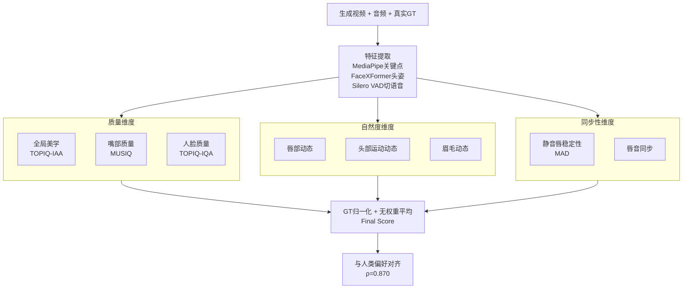

# THEval: Evaluation Framework for Talking Head Video Generation

**会议**: CVPR 2026  
**arXiv**: [2511.04520](https://arxiv.org/abs/2511.04520)  
**代码**: https://newbyl.github.io/theval_project_page/ (有，含数据集与 leaderboard)  
**领域**: 视频生成 / 评测基准  
**关键词**: Talking Head、视频生成评测、人类偏好对齐、细粒度动态指标、Spearman 相关性

## 一句话总结
针对"会说话的人头（talking head）视频生成"长期只能靠 FID/FVD/SyncNet 几个与人类感知脱节的指标来评的问题，本文提出 THEval：在质量、自然度、同步性三个维度下设计 8 个细粒度免训练指标，并用一个 GT 归一化的无权重平均聚合成 Final Score，在 17 个 SOTA 模型、85,000 段视频上做用户研究验证，Final Score 与人类偏好的 Spearman 相关系数高达 ρ=0.870，而现有指标几乎全部接近 0 甚至为负。

## 研究背景与动机
**领域现状**：talking head 生成（给一张人脸图，用一段音频或一段驱动视频去"驱动"它说话/做表情）这几年质量飙升，但评测还停留在两类指标：① 图像/视频质量类（FID、FVD、SSIM、PSNR），② 唇同步类（基于关键点欧氏距离的 LMD，或预训练网络 SyncNet 给出的 LSE-C 置信度 / LSE-D 距离）。剩下的全靠耗时耗力的用户研究兜底。

**现有痛点**：这些指标各有硬伤。FID/FVD 在样本量小（推理时常只取几百到几千段）时有偏，且对高质量视频的细微差异不敏感，更不衡量运动质量和时序连贯性。SyncNet 被证明不稳定——仅仅把音频编码从 mp4a 换成 mpga、视频从 H.264 换成 H.265，LSE-D/LSE-C 就能漂移 0.4 甚至 1.2，而人眼看不出区别；更糟的是用 SyncNet 当判别器训练出来的 Wav2Lip 能把 LSE 刷到最高，却是用户研究里最不被选中的方法之一。LMD 类指标则会对头部姿态、表情与 GT 的差异施加过重惩罚，可这些恰恰与音频只有弱相关，惩罚并不合理。

**核心矛盾**：现有指标要么只看"画质"、要么只看"唇形对不对齐"，把"一段视频看起来真不真实"这个本质上多线索（表情、眉毛、头动、嘴部清晰度……）的感知问题压缩进了一两个单点指标，导致过/欠表现无法被解释，更与人类偏好对不上。

**本文目标**：造一套"细粒度拆解 + 能聚合 + 对齐人类偏好 + 免训练高效"的评测框架，让研究者既能拿到单一可比较的总分，又能诊断模型到底差在质量、自然度还是同步性。

**切入角度**：心理学/感知研究指出，眉毛、嘴、头部的细微非对称动态会显著提升"可信度/自然度"，而静音时段嘴唇是否稳定、说话时嘴张开幅度是否随音量起伏，是人类判断真实感的强线索。作者据此把"自然度/同步性"拆成可由现成关键点 + VAD 直接算出的几何统计量。

**核心 idea**：用 8 个对准人类感知的细粒度免训练指标，分管质量/自然度/同步三维，再以"与真实视频的相对接近度"归一化后无权重平均成 Final Score——既透明又高度对齐人类打分。

## 方法详解

### 整体框架
THEval 不是一个生成模型，而是一条评测流水线：输入一段生成的 talking head 视频（+ 对应音频 + 真实参考视频 GT），先用现成工具（MediaPipe Face Mesh 抽眼/唇/眉关键点、FaceXFormer 估头部姿态、Silero VAD 切语音/静音段）做几何与感知特征提取；然后在三个维度下并行算出 8 个原始指标值；每个指标值用 GT 做相对归一化，最后无权重平均成一个 Final Score。整套指标全部免训练、可在 CPU/单卡上跑，定位是"用户研究的高效代理"。

三个维度与 8 个指标的对应关系：**质量**（① 全局美学、② 嘴部质量、③ 人脸质量）、**自然度**（④ 唇部动态、⑤ 头部运动动态、⑥ 眉毛动态）、**同步性**（⑦ 静音唇稳定性、⑧ 唇音同步）。

### 关键设计
作为评测框架，THEval 的"关键设计"就是三个维度的指标协议与最后的聚合协议。

**1. 质量维度：用区域感知 IQA 替代 FID/FVD，并把"嘴"单独拎出来**

针对 FID/FVD 小样本有偏、对高质量视频不敏感的痛点，质量维度全部改用单帧、与人类美学/质量评价对齐的免训练打分器，再对全部 $N$ 帧取平均。全局美学采用 TOPIQ 的图像美学评估分支（关注构图、光照、色彩协调）：$\textit{Global Aesthetics}=\frac{1}{N}\sum_{j=1}^{N}S_{aes,j}$。质量则做区域拆分——人脸整体用 TOPIQ 的 IQA、嘴部区域单独用 MUSIQ：$\textit{Face/Mouth Quality}=\frac{1}{N}\sum_{j=1}^{N}Q_{face/mouth,j}$。把嘴从脸里单拎出来，是因为合成逼真的嘴部运动本身是生成模型最难的部分，单独度量才能暴露这块短板（实验里 MCNet/DaGan/LIA/FOM 等早期视频驱动模型的人脸质量低至 0.47–0.51，正是嘴部和大幅头动时的撕裂/模糊所致）。

**2. 自然度维度：把"动得自不自然"量化成关键点几何的统计离散度**

针对现有指标完全不衡量表情/头动真实感的空白，自然度维度用三个"动态量"刻画脸真的有没有在自然地动。**唇部动态**：每帧从 $K=40$ 个唇部关键点取 $M$ 个两两欧氏距离 $d_{j,m}$ 描述唇形，指标是这些距离在全部 $N$ 帧上标准差的平均，$\textit{Lip Dynamics}=\frac{1}{M}\sum_{m=1}^{M}\sigma_m$，其中 $\sigma_m=\sqrt{\frac{1}{N-1}\sum_{j=1}^{N}(d_{j,m}-\bar d_m)^2}$——越动越大。**头部运动动态**：估出 pitch/yaw/roll 三个角度和人脸中心位移，综合角度标准差均值 $\overline{\sigma_{angle}}$、角度一阶时间差分方差均值 $\overline{V_{\Delta angle}}$ 与平移方差均值 $\overline{V_{trans}}$：$\textit{Head Motion Dyn.}=\sqrt{(\overline{\sigma_{angle}}\cdot\overline{V_{\Delta angle}})+\overline{V_{trans}}}$，太低说明头几乎不动、太高说明头动夸张。**眉毛动态**：取眉眼竖直距离 $d_{eb,j}$，用瞳距 $d_{io,j}$ 归一化抵消人脸尺度 $d'_{eb,j}=d_{eb,j}/d_{io,j}$，指标是该归一化距离在全帧上的标准差。这三者都是"和 GT 比相对接近度"而非"和 GT 逐帧对齐"，从而避开了 LMD 那种对弱相关量乱罚的毛病。

**3. 同步性维度：换掉 SyncNet，用"静音该闭嘴、说话嘴随音量"两条物理直觉**

针对 SyncNet 不稳定、可被刷分且与人类偏好负相关的硬伤，同步性改用两个可解释的几何-音频对齐量。**静音唇稳定性**：先用 VAD 找出 ≥300ms 的静音段 $S_{silent}$，每帧算瞳距归一化后的平均张嘴度 $d_{lip,j}=\frac{1}{P}\sum_{p=1}^{P}\frac{|y_{upper,p,j}-y_{lower,p,j}|}{d_{io,j}}$，再用对离群点鲁棒的中位绝对偏差度量稳定性：$\textit{Silent Lip Stability}=\text{median}(|d_{lip,j}-\tilde d_{lip}|)$——静音时嘴乱动会被惩罚。**唇音同步**：在语音帧 $S$ 上分别取张嘴度 $O_t$ 与音频 RMS 能量 $V_t$，各自 min-max 归一化到 $[0,1]$ 得 $O_t^*,V_t^*$，指标是两条信号的平均绝对差 $L_{sync}=\frac{1}{|S|}\sum_{t\in S}|O_t^*-V_t^*|$，直接度量"嘴张开幅度是否随音量起伏"，比 SyncNet 那种黑盒相关更贴近"viewers 偏好嘴动强度匹配音量"的感知结论，也无法靠把某个网络当判别器去刷。

**4. Final Score：以"与真实的相对偏差"做 GT 归一化后无权重平均**

8 个原始指标量纲、方向各异，无法直接相加。作者对每个指标用 GT 做相对归一化：$s=1-\frac{|\text{Model}_{Score}-\text{GT}_{Score}|}{\text{GT}_{Score}}$，$s=1$ 表示与真实视频完全一致，越偏离越低——这把所有指标统一成"越接近真人越好"的可比标量，同时天然处理了"头动/嘴动不是越大越好、而是越像真人越好"的非单调性。聚合刻意用**无权重平均**而非回归/相关加权：作者认为既然无权重版已经拿到 ρ=0.870 的强对齐，再去拟合权重只会过拟合到这批用户样本、牺牲透明性与鲁棒性，因此宁可保持三维等权、可解释。

### 损失函数 / 训练策略
本文不训练任何模型，所有指标均基于现成预训练组件（TOPIQ、MUSIQ、MediaPipe、FaceXFormer、Silero VAD）的零样本推理与几何统计，无训练目标与超参调优，这正是其"高效、可复现、无训练偏置"的卖点。

## 实验关键数据

### 主实验
在自建 THEval 数据集（5,011 段多语种 YouTube 真实视频、18 小时、1080p）上评测 17 个 SOTA 模型（9 个视频驱动 + 8 个音频驱动），统一相同音频与参考帧、默认权重，共生成 85,000 段视频。每个模型对每个维度给出指标值并算出 Final Score（节选）：

| 模型 | 类型 | 全局美学↑ | 嘴部质量↑ | 头部运动↑ | Final Score↑ |
|------|------|-----------|-----------|-----------|--------------|
| LivePortrait | 视频驱动 | 0.946 | 0.976 | 0.755 | **0.9345** |
| X-Portrait | 视频驱动 | 0.950 | 0.999 | 0.609 | 0.8999 |
| LIA-X | 视频驱动 | 0.947 | 0.920 | 0.623 | 0.8806 |
| Hallo2 | 音频驱动 | 0.962 | 0.925 | 0.240 | 0.8477 |
| Echomimic | 音频驱动 | 0.850 | 0.962 | 0.381 | 0.8207 |
| OmniAvatar | 音频驱动 | 0.977 | 0.992 | 0.604 | 0.8064 |
| Wav2Lip | 音频驱动 | 0.909 | 0.918 | 0.112 | 0.6502 |
| FOM | 视频驱动 | 0.752 | 0.757 | 0.327 | 0.6810 |

整体结论：视频驱动方法（有驱动视频的运动先验）在自然度/同步上更均衡、Final Score 普遍更高；音频驱动方法常擅长唇同步却在头动表情上吃力。Wav2Lip 虽对 SyncNet 友好，但 Final Score 仅 0.65，与其"用户最不爱选"一致。

### 指标 vs 人类偏好相关性（核心验证）
通过 Hugging Face Space 用户研究收集 3,519 条成对偏好（"哪个更真实"，Krippendorff's α=0.74 一致性良好），算各指标与人类偏好的 Spearman ρ：

| 指标 | ρ | p 值 | 与人类是否对齐 |
|------|-----|------|----------------|
| LSE-C (SyncNet) | -0.164 | 0.530 | 否（负相关、不显著）|
| LSE-D (SyncNet) | -0.269 | 0.297 | 否 |
| FID | 0.210 | 0.416 | 否 |
| FVD | 0.289 | 0.260 | 否 |
| LMD-F | 0.231 | 0.389 | 否 |
| (2) 嘴部质量 | 0.765 | <0.001 | 是 |
| (5) 头部运动动态 | 0.763 | <0.001 | 是 |
| (3) 人脸质量 | 0.699 | 0.001 | 是 |
| **Final Score** | **0.870** | **<0.0001** | **强对齐** |

### 关键发现
- **现有指标集体失效**：FID/FVD/LMD/SyncNet 与人类偏好的 ρ 全在 ±0.29 内且大多不显著，SyncNet 甚至为负——量化坐实了"刷这些指标≠更真实"。
- **嘴部质量与头部运动动态是最强单指标**（ρ≈0.76），印证"把嘴单独度量""把头动量化"这两个设计抓住了人类感知重点；而唇部动态(0.414)、唇音同步(0.404)单独相关较弱，说明真实感是多线索整合，需靠 8 指标互补聚合。
- **聚合战胜单点**：单指标最高 0.765，聚合后 Final Score 升到 0.870，证明无权重组合确实在做互补而非冗余。
- **诊断出具体失效模式**：OmniAvatar 因底座 WanVideo 产生夸张发音、长视频还出现身份漂移与橙色色偏（时序漂移），虽单项强但被 THEval 压住总分；早期视频驱动模型大幅头动时撕裂/模糊，被人脸质量维度精准捕捉。

## 消融实验
本文没有传统意义的模块消融（它评的是别人模型），其"消融"体现在对聚合协议与各维度贡献的拆解上：

| 配置 | ρ(与人类) | 说明 |
|------|-----------|------|
| 仅质量维度 | 0.713 | 三维之一，单维已显著对齐 |
| 仅自然度维度 | 0.702 | 头部运动是主要贡献者 |
| 仅同步性维度 | 0.603 | 三维中最弱，但仍远超旧指标 |
| 无权重平均（Full） | **0.870** | 三维等权聚合，最高 |
| 加权拟合（弃用） | — | 可在本集刷更高，但过拟合、不透明，作者拒用 |

要点：① 三个维度单独都比所有旧指标更对齐人类，聚合后进一步抬升，验证维度拆分的合理性；② 作者主动放弃"用回归/相关最大化权重"，宁可牺牲一点可能的相关性换取透明与抗过拟合——这是有意识的设计取舍而非疏漏。

## 亮点与洞察
- **把"真实感"做了可解释的解剖**：质量/自然度/同步三维 + 8 指标，既给单一总分又能逐项诊断模型短板，这是相对 FID/SyncNet"黑盒单点"最大的范式区别。
- **用物理/感知直觉替代易被刷的学习型指标**：唇音同步直接比"嘴张开幅度 vs 音量包络"，静音稳定性用鲁棒的 MAD，避开了 SyncNet 那种"训练判别器就能被反向优化"的可刷分陷阱——这个思路可迁移到任何"生成质量易被某个 proxy 网络刷分"的场景。
- **GT 相对归一化 $s=1-|\cdot|/GT$ 很巧**：一招同时解决了量纲统一和"动态量非越大越好"两个问题，让头动/嘴动这种 U 形偏好也能塞进"越高越好"的总分。
- **无权重换透明**：明知加权能刷更高相关，仍选等权——对评测基准而言，可复现、抗过拟合比刷榜更重要，是值得借鉴的基准设计哲学。

## 局限性 / 可改进方向
- **作者承认**：当前只覆盖单人、近正面视角的 RGB 视频；明确排除了 3DGS/NeRF（需多视角、固定身份）。未来计划扩展到多人、侧脸等场景。
- **依赖现成组件的天花板**：8 指标全建在 MediaPipe/FaceXFormer/VAD/TOPIQ/MUSIQ 之上，这些上游一旦在极端姿态/遮挡/低画质下失准，指标会跟着失真；框架本身没有为这些失败模式兜底。
- **人类验证规模有限**：3,519 条偏好、17 个模型上的 ρ=0.870 令人信服，但相关性是在这批模型/数据上估的；换一代差异更细的模型时是否仍线性对齐、置信区间会否变宽，仍需持续验证（部分单指标 95%CI 跨 0）。
- **自然度"越像 GT 越好"的隐含假设**：动态量都以 GT 为参照，但同一句话本可有多种同样自然的头动/表情，强行向单一 GT 靠拢可能低估"合理但不同于 GT"的生成结果。

## 相关工作与启发
- **vs SyncNet (LSE-C/LSE-D)**：旧法用预训练 CNN 黑盒度量唇音相关，本文改用可解释的"嘴张幅度 vs 音量"几何对齐 + 静音稳定性；优势是稳定、不可被当判别器刷分、与人类正相关（旧法 ρ 为负），代价是需要 VAD 切段且依赖关键点精度。
- **vs FID/FVD**：旧法比真假分布、小样本有偏且不衡量运动，本文用区域化单帧 IQA（TOPIQ/MUSIQ）+ 动态统计量，把质量与运动解耦；优势是细粒度、可诊断，劣势是不再是单一分布距离、解释性靠维度拆分。
- **vs LMD-F/LMD-M**：旧法对头动/表情与 GT 的逐帧差异重罚（而这与音频弱相关，惩罚不合理），本文改成"动态离散度的相对接近度"，避免误伤合理的自然变化。
- **vs VBench/EvalCrafter（通用视频评测）**：借鉴了"多维度细粒度 + 与人类对齐"的思路，但 THEval 专为 talking head 定制，把嘴、眉、头、静音/说话段这些 TH 特有线索单独建模，是通用视频基准覆盖不到的。

## 评分
- 新颖性: ⭐⭐⭐⭐ 不发明生成模型，但把 TH 评测从"几个易脱节单点"重构为可解释、对齐人类的三维 8 指标体系，范式贡献扎实。
- 实验充分度: ⭐⭐⭐⭐⭐ 17 模型 × 85,000 视频 + 5,011 段自建多语种数据集 + 3,519 条人类偏好，规模与对照都很到位。
- 写作质量: ⭐⭐⭐⭐ 每个指标都给出公式与动机、与旧指标对比清晰；少数符号（如 M、P 取值）略简。
- 价值: ⭐⭐⭐⭐⭐ 直接给社区一个免费、免训练、对齐人类、含数据集与 leaderboard 的标准评测工具，实用价值高。

<!-- RELATED:START -->

## 相关论文

- [\[CVPR 2026\] EmoDiffTalk: Emotion-aware Diffusion for Editable 3D Gaussian Talking Head](emodifftalk_emotion-aware_diffusion_for_editable_3d_gaussian_talking_head.md)
- [\[CVPR 2026\] VGA-Bench: A Unified Benchmark and Multi-Model Framework for Video Aesthetics and Generation Quality Evaluation](vga-bench_a_unified_benchmark_and_multi-model_framework_for_video_aesthetics_and.md)
- [\[CVPR 2026\] UniTalking: A Unified Audio-Video Framework for Talking Portrait Generation](unitalking_a_unified_audio-video_framework_for_talking_portrait_generation.md)
- [\[CVPR 2026\] Thinking with Frames: Generative Video Distortion Evaluation via Frame Reward Model](thinking_with_frames_generative_video_distortion_evaluation_via_frame_reward_mod.md)
- [\[CVPR 2026\] MultiShotMaster: A Controllable Multi-Shot Video Generation Framework](multishotmaster_a_controllable_multi-shot_video_generation_framework.md)

<!-- RELATED:END -->
