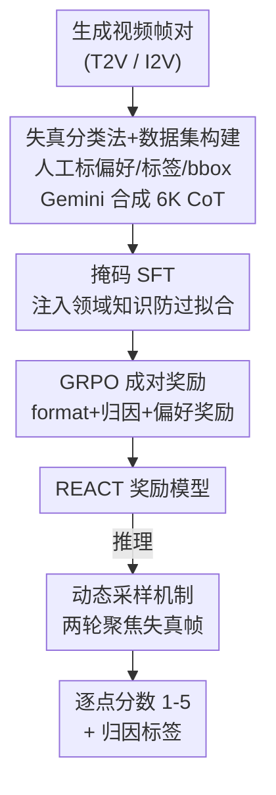

# Thinking with Frames: Generative Video Distortion Evaluation via Frame Reward Model

**会议**: CVPR 2026  
**论文**: [CVF Open Access](https://openaccess.thecvf.com/content/CVPR2026/html/Wang_Thinking_with_Frames_Generative_Video_Distortion_Evaluation_via_Frame_Reward_CVPR_2026_paper.html)  
**代码**: 无  
**领域**: 视频生成 / 生成视频评测 / 奖励模型  
**关键词**: 结构性失真, 帧级奖励模型, GRPO, 思维链推理, 人类偏好对齐

## 一句话总结
针对现有视频奖励模型只看画质/运动/文本对齐、却放过"手脚畸形、物体穿模"这类结构性失真的盲区，本文提出 **REACT**——一个基于 Qwen2.5-VL-7B 的**帧级**奖励模型，用一套结构性失真分类法 + 高效 CoT 数据合成 + "掩码 SFT → GRPO 成对奖励"两阶段训练，对每帧给出 1–5 分的失真打分和可解释的归因标签，并在自建 REACT-Bench 上把人类偏好对齐准确率从 0.701 提到 0.813。

## 研究背景与动机

**领域现状**：文生视频（T2V）的后训练越来越依赖视频奖励模型（VideoScore、VideoReward、UnifiedReward 等），用它们打分来引导生成模型对齐人类偏好。这些奖励模型通常评估三件事——视觉画质（VQ）、运动质量（MQ）、文本对齐（TA）。

**现有痛点**：它们几乎都漏掉了**结构性失真**（structural distortion）——即物体结构本身的异常，比如肢体畸形/缺失/多长一只手、躯干扭曲、人脸崩坏，以及物体之间的**穿模**（mesh penetration，两个实体不合物理地互相穿透）。结果是一个画面很美、时序很顺、但人物长了六根手指的视频，照样能拿高分。这种"高分劣质"会把后训练带偏。

**核心矛盾**：为什么不直接用现成的方案补这个洞？(1) **帧级 vs 视频级**：结构失真是空间局部的、在单帧里就能看见，而视频级奖励模型采样率很低（如 2 fps），容易整帧跳过出问题的瞬间；而且视频级标注昂贵，难以规模化。(2) **帧级 vs 图像级**：图像质量评估（IQA）领域确实研究过结构 artifact，但生成图像的瑕疵是锐利、边界清晰的，生成视频的失真却因时序不一致和运动而呈现**模糊、破碎**的形态，存在 domain gap，图像评估器直接迁移到视频帧上性能大幅下降。

**本文目标**：造一个专门评估生成视频结构性失真的奖励模型，既要给出可用于强化学习的**逐点分数**，又要给出可解释的**归因标签**（到底哪种失真）。

**核心 idea**：把评估搬到**帧级**并让模型"看着帧做思维链推理"——先用一套失真分类法构建大规模偏好数据 + 低成本合成 CoT，再用"掩码 SFT 注入领域知识 + GRPO 成对奖励对齐人类偏好"训练，推理时再用动态采样把算力集中到最可能出问题的帧上。

## 方法详解

### 整体框架

REACT 的全流程可以拆成三块：**(a) 数据准备** → **(b) 两阶段奖励模型训练** → **(c) 推理时动态采样**。

数据准备阶段：先用真实复杂运动视频做 caption 得到 prompt，喂给 Kling/HaiLuo/Sora 等多个 T2V/I2V 模型生成"容易翻车"的视频，抽取同一时间戳的帧组成偏好对；34 人专业团队标注偏好、失真归因标签和问题区域 bbox；再把"标 bbox"这种轻量 grounding 任务交给 Gemini-2.5-Pro 反推出思维链，低成本合成 6K 条 CoT 训练样本。训练阶段以 Qwen2.5-VL-7B 为底座，先做**掩码 SFT** 注入领域知识，再用 **GRPO + 成对奖励**强化推理与打分。推理阶段用**动态采样**自适应地把帧预算花在最可能失真的帧上，最后对采到的帧分数取平均得到整段视频分。

### 关键设计

**1. 结构性失真分类法 + 高效 CoT 合成数据集：把"什么算失真"定义清楚，再低成本造推理数据**

最大的痛点是现有奖励模型连"结构失真"都没有系统定义，更别说有标注数据。本文先建一套分类法，把失真分两大类：**异常外观**（物体形状/结构异常）和**异常交互**（物理上不合理的空间关系）。异常外观细分到动物的肢体/躯干/脸三个部位 × 形变/缺失/重复三种类型——由于缺失和重复几乎只发生在肢体上，最终定为五类（肢体形变、多肢体、肢体缺失、躯干形变、面部形变）外加运动模糊；异常交互主要是穿模。合计 **8 类失真**。所有数据都按这 8 类标注。

数据上，从社媒收集复杂运动真实视频→caption→用多个 SOTA 模型生成易出错的视频，取同时间戳帧凑成偏好对，共 **15K 帧对（约 30K 帧）**。难点在于 MLLM 需要大量思维链（CoT）数据才能学会"看出失真"，但人工写 CoT 极贵。本文的巧招是把标注**重述为 grounding 任务**：标注员只需在失真区域画框，然后把"图 + bbox + 标签"喂给 Gemini-2.5-Pro，让它**反推出**对应的推理过程（假装不知道标签，仅凭视觉证据 step-by-step 推断），再按标签/区域准确率过滤，得到 **6K 条高质量 CoT**。由于数据是成对偏好、没有逐点分数，作者还按失真标签个数给**伪分数**：无失真帧取 $[4.0,5.0]$、一个标签 $[3.0,4.0]$、两个 $[2.0,3.0]$、三个及以上 $[1.0,2.0]$，虽是近似但保持了人类排序一致性、为 SFT 提供分数多样性，剩下的量化对齐交给 GRPO。

**2. 掩码 SFT + GRPO 成对奖励的两阶段训练：先注入知识又不死记，再用成对偏好对齐打分**

SFT 阶段有个两难：训太多步，模型会**死记** CoT 模式、推理轨迹失去多样性，导致后续 GRPO（高度依赖 rollout 轨迹质量）失效；训太少步，领域知识又注入不够。本文的**掩码 SFT**两全：第一个 epoch 用完整 CoT（推理过程 + 归因标签 + 分数全可见）教模型怎么推断失真；第二个 epoch 只对**最终的归因标签和分数**算 loss、把推理轨迹 mask 掉，从而精修标注/打分准确度、又不过度依赖固定推理路径。

RL 阶段用 GRPO：对输入 $q=\{c,f\}$ 采一组 $G$ 个回答，优势用组内奖励归一化 $A_i=\frac{R(o_i)-\mathrm{mean}(\{R(o_j)\})}{\mathrm{std}(\{R(o_j)\})}$，再用带 clip 和 KL 惩罚的目标更新策略。关键难点是训练集只有成对偏好、没有逐点分数 ground truth，无法直接按"预测分−真值分"算奖励。作者据此设计**成对奖励**，每个 rollout 的奖励由三部分加权组成 $R(o_i^j)=\lambda_1 R_{\text{fmt}}+\lambda_2 R_{\text{attr}}+\lambda_3 R_{\text{pref}}$：

- **格式奖励** $R_{\text{fmt}}$：推理须在 `<think>` 内、标签和分数须在 `<answer>` 内，满足则 1 否则 0。
- **归因准确奖励**：$R_{\text{attr}}=0.6\cdot a_{\text{right}}-0.2\cdot(a_{\text{wrong}}+a_{\text{missing}})$，奖励答对的标签、惩罚答错和漏标的。
- **偏好奖励**：对一对帧 $\{f^A,f^B\}$ 各自采样 rollout，用各自预测的逐点分数 $s_i^A,s_i^B$ 算偏好概率（受 VideoReward 启发，带控制"平局倾向"的超参 $\theta=5$），如 $P(o_i^A\succ o_i^B|c)=\frac{e^{s_i^A}}{\theta e^{s_i^A}+e^{s_i^B}}$，再按真值偏好取对应对数概率作为 $R_{\text{pref}}$（⚠️ 公式细节以原文为准）。这样即使没有逐点真值，也能用成对偏好把分数校准到人类排序上。

**3. 动态采样机制：在固定帧预算下，把采样集中到最可能失真的帧**

固定间隔采样在采样 fps 远低于视频 fps 时，容易**整帧跳过**出问题的瞬间；而生成视频时序一致性强，相邻帧的失真往往相关。本文的动态采样分两轮：**第一轮**以一半 fps 均匀采样并用 REACT 打分，按分数分布分三种情况——(1) 全部高于高阈值→大概率无失真，第二轮就在已采帧**之间**稀疏补采；(2) 有分数低于低阈值→存在失真，第二轮在这些帧附近以 1/4 fps 间隔**加密**采样；(3) 既不全高也不全低→混合情况，优先围绕低于均值的低分帧、在 1/4 fps 邻域内随机补两帧。最终视频分由两轮所有采样帧的分数取平均。这样在**不增加总采样数**的前提下，提高了"采到问题帧"的概率。

### 损失函数 / 训练策略
底座 Qwen2.5-VL-7B。SFT 用 LoRA（rank 32）、学习率 5e-4、AdamW（weight decay 0.01）、batch 64，第一 epoch 用完整响应算 loss、第二 epoch 掩码推理轨迹。GRPO 学习率 1e-6、rollout 组大小 $G=8$、训练 300 步、rollout batch 256、mini-batch 64。推理在 2 fps 下配合动态采样。

## 实验关键数据

### 主实验

**人类偏好对齐**（REACT-Video，500 个视频对，结构失真严重度排序）。指标为含平局/不含平局两种准确率，结构失真主要关联 VQ 与 MQ，故取二者均值为 Overall：

| 模型 | Acc w/ Tie (Overall) | Acc w/o Tie (Overall) |
|------|------|------|
| VideoScore2 | 0.342 | 0.521 |
| VideoReward | 0.415 | 0.551 |
| UnifiedReward（视频评估最强 baseline） | 0.416 | 0.701 |
| Q-Insight（图像评估器） | 0.384 | 0.559 |
| VisualQuality-R1（图像评估器） | 0.376 | 0.610 |
| Gemini-2.5-Pro | 0.370 | 0.534 |
| **REACT（本文）** | **0.610** | **0.813** |

**失真识别**（REACT-Frame，2.1K 帧，判断帧是否含结构失真，看 F1）：

| 模型 | 失真帧 F1 | 正常帧 F1 |
|------|------|------|
| Gemini-2.5-Pro | 0.650 | 0.335 |
| GPT-o3 | 0.641 | 0.379 |
| MagicAccessor（SOTA 图像评估器） | 0.554 | 0.285 |
| Q-Insight | 0.334 | 0.300 |
| **REACT（本文）** | **0.845** | **0.671** |

REACT 在两项任务上都明显领先：偏好对齐相对现有评估器有 20–40% 的相对提升；失真识别上，通用 MLLM 和图像评估器虽然失真帧 precision 高、正常帧 recall 高，但 F1 低，说明它们倾向于把失真帧误判为正常——印证了"看不出视频结构失真"这一核心盲区。

### 消融实验

人类偏好对齐（REACT-Video）：

| 配置 | Acc w/ Tie | Acc w/o Tie |
|------|------|------|
| RL w/o SFT（直接从 Qwen 起 RL） | 0.387 | 0.513 |
| RL w/o $R_{\text{pref}}$（改用二值奖励） | 0.352 | 0.514 |
| REACT w/o DS（去掉动态采样） | 0.519 | 0.725 |
| **REACT（默认全配置）** | **0.610** | **0.813** |

失真识别（REACT-Frame，失真帧 F1）：

| 配置 | 失真帧 F1 | 正常帧 F1 |
|------|------|------|
| SFT (1 Epoch) | 0.557 | 0.367 |
| SFT (2 Epoch w/o 掩码) | 0.690 | 0.385 |
| SFT (2 Epoch w/ 掩码) | 0.764 | 0.413 |
| RL w/o SFT | 0.467 | 0.319 |
| **REACT（SFT+GRPO 全配置）** | **0.845** | **0.671** |

### 关键发现
- **SFT 是 GRPO 的地基**：直接从 Qwen2.5-VL-7B 起做 RL（RL w/o SFT），偏好对齐掉到 0.387/0.513，失真 F1 仅 0.467。原因是底座模型打分多样性差，GRPO 高度依赖 rollout 轨迹质量，没有伪分数 SFT 预热就学不动——说明 SFT 阶段注入"会打多样分数"这件事至关重要。
- **成对偏好奖励 > 二值奖励**：把 $R_{\text{pref}}$ 换成"预测对错给 0/1"的二值奖励后，准确率显著下降（0.352/0.514），连续概率形式的偏好奖励能提供更细腻的梯度信号。
- **掩码 loss 真有用**：第二个 epoch 加掩码后失真帧 F1 从 0.690 升到 0.764，验证了"只对标签/分数算 loss、mask 推理轨迹"能防过拟合、保住推理多样性。
- **动态采样锦上添花**：去掉后偏好对齐从 0.610/0.813 掉到 0.519/0.725，固定预算下把采样聚焦到疑似失真帧确实更准。

## 亮点与洞察
- **把昂贵的 CoT 标注重述成画框 + LLM 反推**：标注员只画 bbox，再让 Gemini 在"假装不知标签"的前提下反推推理链，既省钱又保证推理对得上标签——这个"用强模型把弱标注扩成推理数据"的思路可迁移到任何需要 CoT 监督但人工写解释太贵的评测任务。
- **没有逐点真值也能训打分模型**：成对偏好 + 伪分数 + GRPO 的组合绕开了"必须有逐点 ground-truth 分数"的硬约束，为偏好数据驱动的奖励建模提供了范式。
- **指出"高分劣质"这个被忽视的评测盲区**：现有奖励模型对结构失真的系统性失明，是一个被画质/时序一致性掩盖的真问题，REACT 是对现有视频奖励体系的**补充**而非替代。

## 局限与展望
- 伪分数是按"失真标签个数"机械映射的近似值，并非真实的人类逐点评分，可能在标签数相同但严重度不同的帧上失准（作者也承认其为 approximate）。
- 分类法以"动物（尤其人）相关失真"为主，对非动物物体只有"collapse/distortion"一个粗类，对复杂场景几何失真的覆盖度有限。
- 动态采样的高/低阈值是人为设定的，论文未给阈值敏感性分析，跨数据集迁移时可能需要重新调。⚠️
- 评测主要在自建 REACT-Bench 上，虽附录补了 GenAI-Bench/VideoGenReward-Bench，但作为奖励模型在真实 T2V 后训练闭环里的增益（VBench）只在附录给出，正文证据相对薄。

## 相关工作与启发
- **vs VideoReward / VideoScore2 / UnifiedReward**：它们是视频级、评 VQ/MQ/TA，对结构失真不敏感（UnifiedReward 0.701 vs REACT 0.813）；REACT 转到帧级 + 显式建模 8 类结构失真，定位为对它们的补充。本文还沿用了 VideoReward 的成对偏好概率建模（$\theta$ 控平局）。
- **vs MagicAccessor / Q-Insight / VisualQuality-R1（图像评估器）**：它们擅长识别生成图像的锐利 artifact，但因 domain gap 迁到视频帧（模糊、破碎的失真）上性能骤降（失真帧 F1 0.215–0.554 vs REACT 0.845）；REACT 用视频帧偏好数据专门弥合这一 gap。
- **vs 通用 MLLM（Gemini-2.5-Pro / GPT-o3 / Qwen2.5-VL）**：直接 prompt 通用 MLLM 看失真，普遍把失真帧误判为正常（F1 偏低），印证结构失真需要专门的领域知识注入。

## 评分
- 新颖性: ⭐⭐⭐⭐ 首个面向生成视频结构性失真的帧级奖励模型，分类法 + grounding 反推 CoT + 成对奖励三处都有巧思。
- 实验充分度: ⭐⭐⭐⭐ 两任务、多类 baseline、消融拆到 SFT/掩码/奖励/采样各部件；但 T2V 后训练闭环增益放在附录稍弱。
- 写作质量: ⭐⭐⭐⭐ 动机递进清晰（帧级 vs 视频级/图像级两组对比有说服力），公式排版略乱。
- 价值: ⭐⭐⭐⭐ 揭示并补上"高分劣质"评测盲区，对生成视频奖励体系是实用补充，REACT-Bench 可复用。

<!-- RELATED:START -->

## 相关论文

- [\[CVPR 2026\] Ref4D-VideoBench: Four-Dimensional Reference-Based Evaluation of Text-to-Video Generative Models](ref4d-videobench_four-dimensional_reference-based_evaluation_of_text-to-video_ge.md)
- [\[CVPR 2026\] A Frame is Worth One Token: Efficient Generative World Modeling with Delta Tokens](a_frame_is_worth_one_token_efficient_generative_world_modeling_with_delta_tokens.md)
- [\[CVPR 2026\] GT-SVJ: Generative-Transformer-Based Self-Supervised Video Judge For Efficient Video Reward Modeling](gt-svj_generative-transformer-based_self-supervised_video_judge.md)
- [\[CVPR 2026\] VGA-Bench: A Unified Benchmark and Multi-Model Framework for Video Aesthetics and Generation Quality Evaluation](vga-bench_a_unified_benchmark_and_multi-model_framework_for_video_aesthetics_and.md)
- [\[CVPR 2026\] Thinking with Video: Video Generation as a Promising Multimodal Reasoning Paradigm](thinking_with_video_video_generation_as_a_promising_multimodal_reasoning_paradig.md)

<!-- RELATED:END -->
