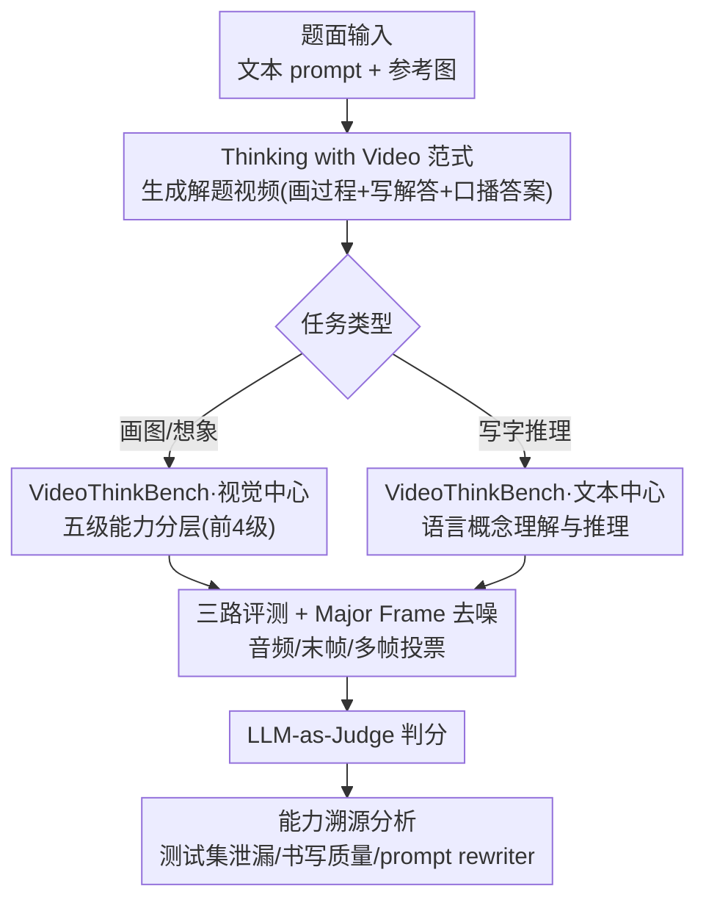

# Thinking with Video: Video Generation as a Promising Multimodal Reasoning Paradigm

**会议**: CVPR 2026  
**论文**: [CVF Open Access](https://openaccess.thecvf.com/content/CVPR2026/html/Tong_Thinking_with_Video_Video_Generation_as_a_Promising_Multimodal_Reasoning_CVPR_2026_paper.html)  
**代码**: https://github.com/tongjingqi/Thinking-with-Video  
**领域**: 视频生成 / 多模态推理  
**关键词**: 视频生成推理, Sora-2, 多模态统一, VideoThinkBench, 测试时扩展

## 一句话总结
本文提出"Thinking with Video"（用视频思考）这一新的多模态推理范式，主张让 Sora-2 这类视频生成模型把推理过程画进视频帧里，并构建了覆盖"几何直觉→视觉归纳→抽象规则→空间规划→语言推理"五级能力的 VideoThinkBench 来系统评测——发现 Sora-2 在 eyeballing 几何题上反超 GPT-5 约 10%，在 MATH 上拿到 92% 音频准确率，证明视频生成模型有望成为统一理解与生成的推理载体。

## 研究背景与动机
**领域现状**：当前提升大模型推理能力的两大主流范式是"Thinking with Text"（用文字思考，即 CoT 链式思维）和"Thinking with Images"（用图像思考，如 OpenAI o3 在思维链里插入图像、Nano Banana 在图中嵌字）。前者让 LLM 一步步写出文字推理，后者让 VLM 借助生成/编辑图像来辅助视觉推理。

**现有痛点**：这两种范式都有结构性短板。① **静态约束**——图像只能捕捉单个瞬间，无法表达动态过程、时间演化或连续变换（比如"光线如何一路反射"这种过程，单张图画不出来）；② **模态割裂**——文字和视觉被当成两套独立模态，缺乏一个能在统一时间结构里自然融合"文字推理"和"视觉推理"的框架。

**核心矛盾**：人类做空间/几何推理时其实是"边画边想、脑内模拟"的动态过程，而现有范式要么只有静态画面、要么文字视觉两张皮，没有一个连贯的时序媒介把二者统一起来。

**本文目标**：找一个天然能表达"动态过程 + 文字视觉融合"的媒介来承载推理，并系统验证它到底能不能推理、能推到什么程度。

**切入角度**：作者注意到视频生成模型（Sora-2）天生就在生成连续帧，既能画出动态过程（画线、变换），又能把文字直接嵌进画面里。那么——能不能把"生成一段解题视频"本身当作一次推理？

**核心 idea**：用"生成视频"代替"写文字/画单图"来做推理——让模型把解题过程一帧帧画出来（含写在画面上的文字与口播的答案），从而把动态推理和多模态融合统一在视频这一载体里。

## 方法详解
本文严格说不是一个"训练新模型"的方法论文，而是**提出一个推理范式 + 配套一个评测体系 + 一套针对视频输出的评测方法学**，并围绕它做了大量分析实验。所以"方法"主要落在三块：范式定义、VideoThinkBench 怎么搭、视频答案怎么评。

### 整体框架
整条 pipeline 是：把一道题（文本 prompt + 一张展示题面的参考图）喂给视频生成模型 → 模型生成一段"解题视频"（画面里画出推理过程/写出解答步骤，音轨口播最终答案）→ 从视频里抽取答案做评测。评测同时覆盖**视觉中心任务**（靠画图和想象解）和**文本中心任务**（靠写字推理解），并用三条评测路径（音频转写 / 末帧 / 多帧投票）把"视频里的答案"提取出来交给 LLM-as-Judge 判分。

### 关键设计

**1. Thinking with Video 范式：把"生成一段解题视频"当作一次多模态推理**

针对"图像静态 + 文字视觉割裂"这两个痛点，本文不再让模型输出文字 CoT 或单张图，而是让它**生成一段连续视频**：画面里实时画出推理过程（如给光线一路画反射轨迹、给三条线延长画出交点并标红）、同时把文字解答写进帧里、音轨再口播一遍最终答案。视频天然是"带时间轴的多帧序列"，因此一举解决两个问题——动态过程能被逐帧展开（连续变换不再被压成一张静态图），文字与视觉也被统一进同一个时序载体（写在画面上的字和画出来的图共享同一帧空间），更贴近人类"边画边想、脑内模拟"的认知过程。这是全文的核心主张：视频生成模型可能是统一"理解 + 生成"的多模态推理基座。

**2. VideoThinkBench 五级能力分层：用递进难度系统拆解"视频到底能推什么"**

要验证范式不能只挑好做的题，作者构建了 VideoThinkBench，按推理能力从易到难排了一条递进链：① 几何直觉（eyeballing puzzles，判断简单空间关系）→ ② 视觉模式归纳（visual puzzles，从形状/颜色/布局找规律）→ ③ 抽象规则归纳（ARC-AGI-2，从输入输出对推变换规则）→ ④ 空间规划与搜索（迷宫，多步动作规划）→ ⑤ 语言概念理解与推理（GSM8K/MATH/MMMU 等文本题）。前四级是视觉中心任务、第五级是文本中心任务。其中 eyeballing puzzles（21 类、共 1050 样本，分 Point/Line/Shape 三大类）和迷宫是作者**自建且可自动验证**的，visual puzzles 改编自 PuzzleVQA，ARC-AGI-2 改编自原 benchmark。这套分层的价值在于：它不是简单刷分，而是提供了一把"视频模型能力边界"的尺子——能看出模型在几何直觉上很强、却在抽象规则归纳上很弱。

**3. 三路评测 + Major Frame 去噪：解决"视频末尾会坏掉导致答案抽不准"**

视频输出比文字/单图难评——答案藏在某些帧里，而视频结尾常被 SMPTE 彩条或黑屏污染，直接取末帧很容易抽错。作者设计三条评测路径：**Audio**（转写口播答案）、**Last Frame**（看末帧哪个选项被标红）、**Major Frame**（在视频时长上采样多帧、对结果取多数投票）。Major Frame 本质是把"沿时间轴采样 + 投票"当成一个去噪滤波器——避开被污染的结尾，捕捉模型在整段视频里最一致的"信念"。实验里这一招效果显著：Arc Connect 单次评测下，Last Frame 56% → Major Frame 68%；再叠加 5 次重试的多数投票，Major Frame 进一步从 68% 飙到 90%。这其实揭示了一个少有人探索的方向——**视频生成推理任务上的测试时扩展（test-time scaling）**：同一题多生成几段视频、再聚合，就能稳定涨点。

**4. 文本推理能力溯源：用 Wan 2.5 的可控 rewriter 拆穿"是谁在真正解题"**

Sora-2 在文本题上表现意外地好（GSM8K 音频 98.9%、MATH 92%），但这能力到底来自视频生成本身、还是来自背后某个看不见的文本模型？作者做了三层归因。① **排除测试集泄漏**：用 Qwen3-235B / Gemini 2.5 Pro 把 GSM8K、MATH-500 题目换数值生成"派生题"，Sora-2 在派生题上成绩与原题几乎一致（GSM8K 派生题音频 100%），说明不是背答案。② **书写过程质量分析**：人工标注 115 个 Sora-2 视频音频都答对的样本，发现只有 13.91% 的画面书写过程"完全正确"，43.48% 不可读或逻辑错——说明它常常"答案对、但视频里写的过程是糊的"。③ **关键反证**：换用提供"是否启用 prompt 改写"开关的 Wan 2.5，关掉 rewriter 后文本推理准确率几乎归零（GSM8K 末帧从 78.4% → 0.0%），开启才恢复。由此推断 Sora-2 的文本推理能力**很可能也来自内部的 prompt rewriter（一个文本模型先把题解好、再指导视频生成）**，而非视频生成组件自己在推理。这一节是全文最诚实、也最有价值的地方——没有把高分包装成"视频会算数学"，而是把功劳的真正来源挖了出来。

## 实验关键数据

### 主实验：与 SOTA VLM 全面对比（准确率 %）
下表为各二级任务汇总（视觉中心 Sora-2 取 Major Frame，文本中心取音频评测）：

| 任务 | Sora-2 | Gemini 2.5 Pro | GPT-5 high | Claude Sonnet 4.5 |
|------|--------|----------------|-----------|-------------------|
| Eyeballing-Point | **44.7** | 27.8 | 33.6 | 36.2 |
| Eyeballing-Line | **38.0** | 21.0 | 24.0 | 26.3 |
| Maze | **13.3** | 0.0 | 0.0 | 0.0 |
| Visual-Symmetry | 81.9 | 94.9 | **98.5** | 80.1 |
| ARC-AGI-2 | 1.3 | 1.9 | 0.5 | **5.3** |
| 视觉中心平均 | 40.4 | 41.4 | 42.6 | **43.8** |
| 文本中心平均 | 68.6 | 82.3 | 83.2 | **86.2** |
| **总平均** | 49.8 | 55.0 | 56.1 | **56.2** |

关键看点：Sora-2 在 **eyeballing 几何题（Point/Line）和迷宫上明显反超**所有 VLM——迷宫上其它模型几乎全 0，Sora-2 拿到 13.3%；但在抽象规则归纳（ARC-AGI-2）和文本通识上落后。

### 文本中心任务细分（部分数据集，准确率 %）

| 数据集 | Sora-2 末帧 | Sora-2 音频 | Gemini 2.5 Pro | GPT-5 high | Claude 4.5 |
|--------|------------|------------|----------------|-----------|-----------|
| GSM8K | 75.7 | **98.9** | 98.9 | 100.0 | 100.0 |
| MATH-500 | 67.0 | 92.0 | 99.0 | 99.0 | 98.0 |
| MathVista | 67.6 | **75.7** | 70.0 | 67.5 | 72.5 |
| MMMU | 38.3 | 69.2 | 79.0 | 77.0 | 82.0 |
| AIME24 | 38.3 | 46.7 | 93.3 | 95.0 | 75.0 |

发现：Sora-2 **音频准确率普遍高于末帧准确率**（因为画面里写字容易出错，而口播答案更准），在 GSM8K、MathVista 上能追平 SOTA，但在 AIME、MMMU 这类硬题上差距明显。

### 消融/分析实验

| 分析项 | 配置 | 关键指标 | 说明 |
|--------|------|---------|------|
| 测试时扩展 | Arc Connect 单次 | 末帧 56% / Major Frame 68% | 多帧采样即去噪 |
| 测试时扩展 | Arc Connect 5 次投票 | Major Frame 90% | self-consistency 大幅涨点 |
| In-context 学习 | ARC-AGI-2 few-shot vs 1-shot | 高准确区[0.65,1] 样本 130 vs 95 | 多示例 → 更强 ICL |
| 测试集泄漏 | GSM8K 原题 vs 派生题（音频） | 98.9% vs 100.0% | 成绩稳定，排除泄漏 |
| 能力溯源 | Wan 2.5 关/开 rewriter（GSM8K 末帧） | 0.0% vs 78.4% | 文本推理几乎全靠 rewriter |
| 书写质量 | 115 个答对样本人工标注 | 完全正确仅 13.91% | 答案对但过程常不可读 |

### 关键发现
- **Major Frame + 多次投票贡献最大**：把视频推理从"勉强能用"拉到 90%，证明"在时间轴和多次生成上聚合"是视频推理涨点的主路径，也指向一个新方向——视频生成的 test-time scaling。
- **去掉 prompt rewriter 文本推理直接归零**：这是最反直觉也最重要的发现——Sora-2 文本题的高分大概率不是视频生成在算数学，而是背后的文本改写模型先解好了题。
- **几何强、抽象弱**：Sora-2 在需要"画出来"的几何/空间任务上反超 VLM，但在 ARC-AGI-2 这种纯抽象规则归纳上只有 1.3%，能"抓到规则大意却执行不出精确网格"。

## 亮点与洞察
- **把"生成视频"重新定义成"一次推理"**：最让人"啊哈"的是视角转换——视频生成模型一直被当作生成工具，本文把它当作推理器，且用画线/画反射轨迹这种"可验证的视觉解题"证明它确实在做空间推理，而不只是渲染。
- **Major Frame 去噪是个可复用 trick**：任何"答案藏在视频某帧、但结尾会被彩条/黑屏污染"的视频评测场景，都可以用"沿时间轴多帧采样 + 投票"来稳健抽取答案，思路可迁移到视频 QA、视频 agent 的输出解析。
- **诚实的能力溯源方法学**：用一个"能开关 rewriter"的对照模型（Wan 2.5）来拆穿"是谁真正在解题"，这种归因设计可以推广到任何"黑箱里疑似有隐藏文本模型"的多模态系统评测。

## 局限与展望
- 作者承认 Sora-2 的文本中心推理能力很可能来自内部 prompt rewriter，而非视频生成本身——这意味着"视频会做数学"这个结论需要打折扣，视频组件真正的语言推理能力仍存疑。
- 视频里**书写过程质量很差**（完全正确仅 13.91%，43.48% 不可读/逻辑错），说明当前模型"答案蒙对"和"过程讲清"之间差距很大，离真正的可解释推理还远。
- ⚠️ 评测严重依赖闭源 Sora-2，且部分任务（visual puzzles）是人工挑"最佳帧"评分，复现性和客观性受限；本文更像是一份"潜力探针 + benchmark"，而非可直接训练/优化的方法，离落地推理系统还有距离。
- 抽象规则归纳（ARC-AGI-2）几乎做不动，提示视频范式当前只在"可视化、可画出来"的任务上有优势。

## 相关工作与启发
- **vs Thinking with Text（CoT）**：CoT 用纯文字一步步推理，本文用视频把过程"画"出来；区别在于视频能表达动态过程和文字视觉融合，劣势是当前文本推理的真实能力可能来自隐藏的文本 rewriter。
- **vs Thinking with Images（o3 / Nano Banana）**：它们在思维链里插入/生成静态图像辅助推理，本文用连续视频帧表达"连续变换"，优势是动态过程和时序统一，但代价是输出更难评测、书写过程更易出错。
- **vs PuzzleVQA / ARC-AGI-2 等原 benchmark**：本文把这些静态多选题改编成"让模型画视频解题"的形式，并自建 eyeballing puzzles 与迷宫，扩展出一条覆盖五级能力的视频推理评测尺。

## 评分
- 新颖性: ⭐⭐⭐⭐⭐ 首次把视频生成正式当作统一多模态推理范式并系统评测，视角开创性强
- 实验充分度: ⭐⭐⭐⭐⭐ 五级能力 benchmark + 4 大类分析（泄漏/书写/ICL/溯源），证据链完整
- 写作质量: ⭐⭐⭐⭐ 主张清晰、findings 编号明确，但部分评测细节散落在附录
- 价值: ⭐⭐⭐⭐ 开辟"视频推理 + 视频 test-time scaling"新方向，并诚实揭示了能力来源的 caveat

<!-- RELATED:START -->

## 相关论文

- [\[CVPR 2026\] Lighting-grounded Video Generation with Renderer-based Agent Reasoning](lighting-grounded_video_generation_with_renderer-based_agent_reasoning.md)
- [\[CVPR 2026\] M4V: Multimodal Mamba for Efficient Text-to-Video Generation](m4v_multimodal_mamba_for_efficient_text-to-video_generation.md)
- [\[CVPR 2026\] Thinking with Frames: Generative Video Distortion Evaluation via Frame Reward Model](thinking_with_frames_generative_video_distortion_evaluation_via_frame_reward_mod.md)
- [\[CVPR 2026\] Reasoning Diffusion for Unpaired Test Time Out-of-distribution Text-Image to Video Generation](reasoning_diffusion_for_unpaired_test_time_out-of-distribution_text-image_to_vid.md)
- [\[CVPR 2026\] Archon: A Unified Multimodal Model for Holistic Digital Human Generation](archon_a_unified_multimodal_model_for_holistic_digital_human_generation.md)

<!-- RELATED:END -->
