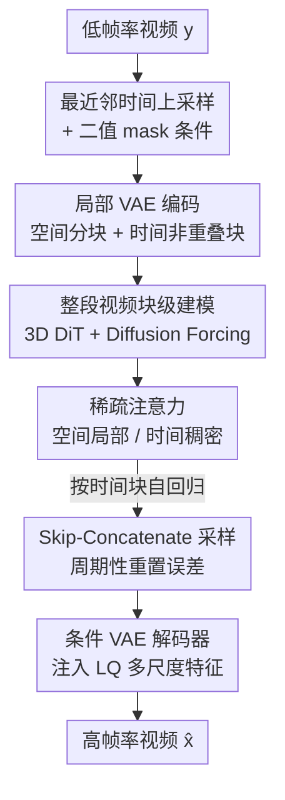

# Towards Holistic Modeling for Video Frame Interpolation with Auto-regressive Diffusion Transformers

**会议**: CVPR 2026  
**论文**: [CVF Open Access](https://openaccess.thecvf.com/content/CVPR2026/html/Peng_Towards_Holistic_Modeling_for_Video_Frame_Interpolation_with_Auto-regressive_Diffusion_CVPR_2026_paper.html)  
**代码**: https://github.com/xypeng9903/LDF-VFI  
**领域**: 视频生成 / 视频帧插值 / 扩散模型  
**关键词**: 视频帧插值、自回归扩散、Diffusion Forcing、稀疏注意力、4K 可扩展

## 一句话总结
LDF-VFI 把视频帧插值（VFI）从"逐三元组各算各的"改成"整段视频统一建模"——用自回归扩散 Transformer 一次合成一个时间块内的全部帧，配合 skip-concatenate 采样压住自回归误差累积、稀疏注意力 + 分块 VAE 实现免训练泛化到 4K，在长视频时序一致性上拿到 SOTA。

## 研究背景与动机

**领域现状**：视频帧插值（在已有帧之间合成中间帧，用于慢动作、新视角合成、视频生成等）长期由两类方法主导：基于光流/核的方法（RIFE、AMT、EMA-VFI、BiM-VFI）估计中间运动并 warp 输入帧；近年扩散类方法（LDMVFI、EDEN、MA-DIFF）兴起，在复杂非线性运动上更鲁棒。

**现有痛点**：无论光流还是扩散，绝大多数方法都是 **frame-centric（以帧为中心）**——把 VFI 拆成一堆相互独立的三元组：从相邻两帧 $y_0, y_1$ 合成中间帧 $\hat{x}_1$，再独立地合成 $\hat{x}_2, \hat{x}_3, \dots$。这带来两个硬伤：一是各三元组互不通气，新生成的帧之间缺乏时序关联，长序列上抖动、运动伪影明显；二是 vanilla DiT 的全注意力是平方复杂度，根本撑不起 4K 这种高分辨率视频。

**核心矛盾**：理想做法是"一次推理把整段高帧率视频全合成出来"以保证时序一致，但整段视频的内存和算力开销不可承受；而为了省算力退化成逐三元组，又丢掉了时序上下文。一致性与可扩展性在现有范式里成了对立面。

**本文目标**：拆成三个子问题——① 块内一致：把视频切成定长时间块，每块一次推理合成块内全部帧；② 块间一致：把各块的输出自回归地串起来，维持长程跨块连贯；③ 分辨率可扩展：高效扩展到 4K。

**切入角度**：作者主张 **video-centric（以视频为中心）** 的整体建模视角——不预测单帧，而是建模"整段高帧率视频在整段稀疏输入条件下"的联合条件分布 $q(x \mid y)$。关键观察是：VFI 是一个**强条件任务**，输入低帧率视频已经把全局结构定死了，所以即便某个时间块脱离最近上下文独立生成，也不会引入明显的不连贯——这恰好是后面"重置误差"得以成立的前提。

**核心 idea**：用自回归扩散 Transformer 对整段视频做块级建模（块内整体合成 + 块间自回归），并用 skip-concatenate 采样把自回归固有的误差累积"周期性清零"，再叠加稀疏注意力 + 分块 VAE 把整套方案推到 4K。

## 方法详解

### 整体框架

LDF-VFI（Local Diffusion Forcing for VFI）的输入是低帧率视频 $y \in \mathbb{R}^{T\times H\times W\times 3}$，输出是高帧率视频 $x \in \mathbb{R}^{(sT)\times H\times W\times 3}$（$s$ 为时间上采样倍率）。整套流程在隐空间里跑：先把 LQ 视频用最近邻时间上采样对齐到目标帧数、配一张二值 mask 标记哪些是真实观测帧，再用空间分块 + 时间非重叠分块的 3D VAE 编码成隐变量；隐空间里是一个改过的 3D DiT（来自 Wan2.1），用 flow matching / diffusion forcing 训练，配稀疏注意力；推理时按时间块自回归生成，用 skip-concatenate 顺序压误差；最后由一个条件 VAE 解码器（注入 LQ 多尺度特征）重建出清晰的高帧率视频。

形式上，作者把目标分布扩展到隐空间联合分布并定义生成模型：

$$q(x, z \mid y) := \underbrace{q(x \mid y)}_{\text{目标}}\;\underbrace{q(z \mid x)}_{\text{VAE 编码}}, \qquad p_\theta(x, z \mid y) := \underbrace{p_\theta(z \mid y)}_{\text{隐扩散}}\;\underbrace{p_\theta(x \mid z, y)}_{\text{VAE 解码}}$$

即生成模型由两部分组成：拟合隐分布 $q(z \mid y)$ 的隐扩散（flow-matching）模型 $p_\theta(z \mid y)$，和从隐变量 $z$ 在 $y$ 条件下重建视频的条件 VAE 解码器 $p_\theta(x \mid z, y)$。

### 关键设计

**1. 整段视频的块级整体建模：用 Diffusion Forcing 把"块内一次合成"和"块间自回归"统一起来**

针对 frame-centric 范式丢时序上下文的痛点，作者不再预测单帧，而是建模整段视频的联合条件分布。但整段一次推理内存不可承受，于是把视频沿时间切成定长块（实现里块长 20 帧），每块一次推理合成块内全部帧——块内一致天然由"同一次去噪"保证。块间则靠**自回归**串起来，从而以"每步常数内存/算力"处理任意长视频。

把"块内整体 + 块间自回归"缝合到一个模型里的关键是 **diffusion forcing** 训练：不像普通扩散给整段序列一个统一噪声水平，而是给每个 GT 块的 VAE 隐变量**独立采样一个噪声水平** $\sigma_1, \sigma_2, \sigma_3, \dots$，让模型学会"在其它块处于任意噪声水平的条件下预测当前块的速度场"。这样推理时就能把已经生成干净的前序块当条件、对当前块去噪，自然实现自回归采样。底层目标用 flow matching：沿线性插值路径 $x_t = (1-t)x_0 + t x_1$ 学速度场，损失 $\mathcal{L}_{FM} = \mathbb{E}\big[\lVert v_\theta(x_t, t) - (x_1 - x_0)\rVert^2\big]$，推理时用 Euler ODE 从 $t=1$ 积分到 $t=0$。

此外，视频条件采用**通道拼接**而非 cross-attention，因为它显式保留低帧率输入和目标高帧率序列之间的时空对应。但缺帧若直接零填充，预训练 VAE 对这种不规则输入不鲁棒、需重训。作者的轻量替代是：先用**最近邻时间上采样**把 LQ 对齐到目标帧数，再配一张二值 mask 标出真实观测帧位置（mask 经最近邻空间下采样 + pixel shuffle 做时间下采样后编码）。把 mask 和输出视频一致地分块，模型就能天然支持**任意甚至非整数的下采样比例**做 VFI。消融（表 6）显示最近邻上采样把关键帧重建 PSNR 从零填充的 28.40 提到 30.87，LPIPS 0.011→0.006。

**2. Skip-concatenate 采样：把自回归固有的误差累积周期性"清零"**

自回归生成的通病是 **exposure bias（暴露偏差）**：训练时用 GT 上下文，推理时却只能 condition 在模型自己不完美的输出上，误差代代相传、长序列质量持续退化。传统因果自回归里每个新块都依赖紧邻的（可能已经带误差的）前一块，误差只增不减。

作者的关键洞察前面已铺垫：VFI 是强条件任务，全局结构早被输入定死，所以"脱离最近上下文独立生成一个块"并不会引入明显不连贯。据此设计 skip-concatenate 顺序：先生成一个 **skip chunk**——它**不依赖最近上下文**、独立生成，从而"打断依赖链、把累积误差重置"；再生成一个 **concatenate chunk**，它同时 condition 在前一个 skip chunk 和新的 skip chunk 上，把两者之间的时间缺口无缝桥接。如此周期性地用独立 skip chunk 重置生成状态，误差累积被压在**恒定水平**，与生成视频时长无关。消融（表 3）很直接：在因果顺序基础上换成 skip-concatenate，平均 FVD 从 22.67 降到 17.05（↓24.8%），LPIPS 也略降，证明它主要改善时序稳定性。

**3. 稀疏注意力 + 分块 VAE：空间局部、时间稠密，免训练泛化到 4K**

为了把整套方案推到 4K 而不被全注意力的平方复杂度卡死，作者让 DiT 用一种**混合稀疏注意力**：空间维上做**基于块的滑窗注意力**（attention 限制在局部块内，感受野随层数高效增长，避开全注意力的平方开销）；时间维上因为序列长度固定且较短，做**全注意力**，从而无瓶颈地捕捉复杂的非局部时序关联。一句话——稀疏在空间、稠密在时间，专为视频运动建模量身定制。

这套稀疏性的"地基"来自 **tiled VAE 编码**：每帧切成带重叠的空间 tile（实现里 tile $256\times256$、stride 192），各 tile 独立编码后在隐空间用线性 ramp 混合重叠区、只保留 stride 区域拼成规整隐网格；时间维则用**非重叠分块**。这既带来常数内存、无缝边界，又给出一个规整的时空块网格，正好被上面的稀疏注意力利用。因为编码和注意力都是局部的，模型能**无缝泛化到训练时没见过的分辨率**（推理时配合 Ulysses 序列并行 USP，2 张 80GB GPU 就够跑 4K）。消融（表 5）很说明问题：在 4K 上全注意力直接失效（X4K-16× FVD 高达 772.32、RT 22.6s），换成稀疏注意力 FVD 降到 120.40、RT 仅 4.0s。

**4. 条件 VAE 解码器：把 LQ 视频的多尺度特征注回解码过程，补回细节**

标准 VAE 从隐空间重建时常丢失细粒度细节。作者受 ControlNet 启发设计**条件 VAE 解码器**：用一个结构镜像主解码器的专用条件编码器，从低帧率输入视频里抽多尺度时空特征，再经**零初始化卷积 + 残差连接**注入主解码器对应层。零初始化保证训练初期不破坏原解码器、稳定收敛；多尺度注入则在整个重建过程中提供细粒度引导，把输入视频的全局与局部细节都用上，从而显著提升每帧清晰度和时序连贯。消融（表 3）显示，在 skip-concatenate 基础上再加条件 VAE，平均 LPIPS 从 0.060 降到 0.051（↓17.8%），FVD 16.49，主要吃在感知质量上——和 skip-concatenate（主吃时序）正好互补。

### 损失函数 / 训练策略
DiT 在大规模 LAVIB 数据集上、从 Wan2.1 T2V 预训练初始化，训练 16,000 步、总 batch 256，用 flow matching 损失（timestep shift = 5），固定时空分辨率 $60\times512\times512$（随机空间裁剪），LQ 视频的时间下采样倍率在 2–16 间均匀采样。VAE 解码器在 LAVIB 上微调、编码器冻结，复合损失 = L1 + LPIPS + 对抗损失 + KL 正则（权重 1.0 / 1.0 / 0.5 / 1e-6，判别器 5000 步后激活）。推理统一用 16 步 Euler ODE（timestep shift = 8）。

## 实验关键数据

### 主实验

作者指出常规 frame-centric benchmark 只给相邻帧对，无法评测整段视频建模，于是自建两个 **video-centric benchmark**：SNU-FILM-entire 和 X4K-entire（对整段视频按 4×/8×/16× 下采样造低帧率输入），并允许各方法访问整段低帧率视频。指标用 LPIPS / FVD / VFIPS / FloLPIPS（联合衡量每帧保真和时序一致），刻意不用 PSNR/SSIM（与人类感知相关性差）。

SNU-FILM-entire 上的对比（节选关键列，越低越好）：

| 方法 | 4× FVD↓ | 8× FVD↓ | 16× FVD↓ | 16× LPIPS↓ | 16× FloLPIPS↓ |
|------|---------|---------|----------|-----------|---------------|
| RIFE [ECCV'22] | 9.02 | 25.30 | 69.76 | 0.110 | 0.182 |
| EMA-VFI [CVPR'23] | 15.28 | 38.16 | 101.67 | 0.115 | 0.209 |
| BiM-VFI [CVPR'25] | 10.78 | 21.52 | 38.26 | 0.074 | 0.118 |
| EDEN [CVPR'25] | 10.64 | 26.03 | 58.83 | 0.078 | 0.128 |
| **LDF-VFI (ours)** | **8.21** | **15.01** | **26.26** | 0.078 | **0.117** |

LDF-VFI 在**所有设置上拿下最优 FVD**（运动感知指标），16× 这种大运动设置优势尤其明显（FVD 26.26 vs 次优 BiM-VFI 38.26），而每帧 LPIPS 与最强 baseline 持平。X4K-entire（仅 16×，更难）上同样领先 FVD：

| 方法 | X4K-16× FVD↓ | LPIPS↓ | FloLPIPS↓ |
|------|--------------|--------|-----------|
| BiM-VFI | 69.83 | **0.055** | **0.065** |
| EDEN | 1586.99 | 0.454 | 0.491 |
| **LDF-VFI (ours)** | **51.41** | 0.071 | 0.082 |

注意 EDEN（frame-centric 扩散 baseline）在 X4K 上递归推理彻底崩盘（FVD 1586.99），凸显逐三元组范式在大运动 4K 场景的脆弱；LDF-VFI 的 video-centric 范式在运动感知指标上的稳定优势正是其卖点。

### 消融实验

| 配置 (AR 顺序 / VAE) | 平均 LPIPS↓ | 平均 FVD↓ | 说明 |
|----------------------|-------------|-----------|------|
| Causal + Uncond. | 0.062 | 22.67 | 传统因果自回归 + 原 Wan2.1 解码器 |
| Skip-concat + Uncond. | 0.060 (↓3.2%) | 17.05 (↓24.8%) | 换 skip-concatenate，时序大涨 |
| Skip-concat + Cond. | 0.051 (↓17.8%) | 16.49 (↓27.2%) | 再加条件 VAE，每帧质量大涨 |

| 注意力 (X4K-16×) | FVD↓ | RT(s)↓ | 说明 |
|------------------|------|--------|------|
| Full | 772.32 | 22.6 ×4 | 4K 下泛化失败、又慢 |
| Sparse | **120.40** | **4.0 ×4** | 6K 步 / 4 采样步下对比 |

### 关键发现
- **两大组件分工互补**：skip-concatenate 主要救时序一致性（FVD ↓24.8%），条件 VAE 主要救每帧感知质量（LPIPS 进一步 ↓），两者叠加才同时拿到时序连贯 + 高保真。
- **稀疏注意力是 4K 可扩展的必要条件**：全注意力在 4K 上直接失效（FVD 772 vs 120）且 RT 慢 5 倍以上，稀疏注意力既快又能泛化到训练未见分辨率。
- **采样步数可灵活权衡**：从 16 步降到 2 步，SNU-FILM-8× 上 FVD 仅从 15.01 升到 21.25、RT 从 3.36s 降到 0.42s，质量退化温和，部署时可按算力预算调。
- **最近邻上采样优于零填充**：避免了预训练 VAE 对不规则零填充输入的分布漂移，关键帧重建 PSNR +2.47dB。

## 亮点与洞察
- **"强条件任务可以重置误差"这一洞察很巧**：正因为 VFI 被低帧率输入强约束、全局结构已定，才敢让 skip chunk 脱离上下文独立生成来打断误差链——这是把自回归暴露偏差问题转化成 VFI 特有解法的关键，换到弱条件的纯文生视频未必成立。
- **把"分块 VAE 的局部性"和"稀疏注意力的局部性"对齐复用**：tiled VAE 编出的规整时空块网格，正好成为稀疏注意力的天然划分单元，一套局部性同时服务了内存可扩展和注意力可扩展，设计上很省。
- **diffusion forcing 让一个模型既能块内整体合成又能块间自回归**：给每块独立噪声水平这一招，把"一次性整段建模"的一致性和"自回归"的可扩展性缝在了一起，是整个 video-centric 范式能落地的枢纽。
- **免训练泛化到 4K**：局部编码 + 局部注意力让模型在推理时直接吃任意分辨率，无需为 4K 重训，工程价值高。

## 局限与展望
- **新建 benchmark 带来的可比性 caveat**：SNU-FILM-entire / X4K-entire 是作者自建的 video-centric 评测，baseline 是逐帧跑的 frame-centric 方法，二者范式不同，"允许访问整段视频"对 LDF-VFI 天然有利；与既有 VFI 文献的横向数字不能直接照搬比较。
- **每帧 LPIPS 并非全面领先**：在 X4K 上 LDF-VFI 的 LPIPS（0.071）与 FloLPIPS（0.082）都不如 BiM-VFI（0.055 / 0.065），优势集中在 FVD 这类时序/分布指标；对追求逐帧像素保真的场景未必最优。
- **推理成本与依赖较重**：4K 需要 USP 多卡（2–4 张 80GB GPU），单帧生成时间在秒级（16 步 3.36s/帧），且整套依赖 Wan2.1 预训练权重与 LAVIB 训练数据，复现门槛不低。
- **skip chunk 独立生成的隐患**：洞察成立的前提是"输入条件足够强"，若在弱条件或极稀疏输入（超大插值倍率）下，独立 skip chunk 可能反而引入跳变，论文未深入探讨这一边界。

## 相关工作与启发
- **vs 光流/核方法（RIFE、AMT、EMA-VFI、BiM-VFI）**：它们估计中间运动并 warp，简单近线性运动下又快又准，但非线性运动、遮挡、大位移时显著退化；LDF-VFI 用扩散生成 + 整段建模换取大运动鲁棒性，代价是更重的算力。
- **vs frame-centric 扩散 VFI（LDMVFI、EDEN、MA-DIFF）**：同样用扩散，但它们逐三元组/逐对插值、忽略新生成帧之间的依赖，长序列大运动下时序不一致（EDEN 在 X4K 递归推理直接崩）；LDF-VFI 的 video-centric 块级自回归正是冲着这个时序连贯短板去的。
- **vs 自回归 + 扩散的视频生成混合模型（如各类 AR 视频扩散）**：它们也面临暴露偏差，常用 scheduled sampling、反向 KL、在带噪条件上训练等缓解；本文给出 VFI 特定解 skip-concatenate，利用 VFI 强条件性把误差稳在恒定水平，思路更轻、更针对任务。
- **可迁移启发**：「用强条件任务的全局确定性来周期性重置自回归误差」这一思想，或可迁移到其它强条件的长序列生成（如条件视频修复、可控视频编辑）；"分块编码 + 局部注意力共享同一局部性"的设计也可推广到任意需要高分辨率可扩展的视频扩散框架。

## 评分
- 新颖性: ⭐⭐⭐⭐ video-centric 整段建模 + skip-concatenate 重置误差的组合在 VFI 里是清晰的范式转换，洞察具体而非套话。
- 实验充分度: ⭐⭐⭐⭐ 自建两个 video-centric benchmark、四指标 + 充分消融（AR 顺序 / VAE / 注意力 / 上采样 / 步数），但 baseline 跨范式对比与自建评测存在可比性 caveat。
- 写作质量: ⭐⭐⭐⭐ 动机—矛盾—方案推导清楚，图 1/2/5 把范式差异讲得直观，公式与符号规范。
- 价值: ⭐⭐⭐⭐ 给长视频大运动 VFI 提供了可扩展到 4K 的实用范式，代码开源，但算力门槛偏高限制了即时落地面。

<!-- RELATED:START -->

## 相关论文

- [\[ICML 2026\] Quant VideoGen: Auto-Regressive Long Video Generation via 2-Bit KV-Cache Quantization](../../ICML2026/video_generation/quant_videogen_auto-regressive_long_video_generation_via_2-bit_kv-cache_quantiza.md)
- [\[CVPR 2026\] A Frame is Worth One Token: Efficient Generative World Modeling with Delta Tokens](a_frame_is_worth_one_token_efficient_generative_world_modeling_with_delta_tokens.md)
- [\[CVPR 2026\] Efficient Long-Context Modeling in Diffusion Language Models via Block Approximate Sparse Attention](efficient_long-context_modeling_in_diffusion_language_models_via_block_approxima.md)
- [\[CVPR 2026\] VMonarch: Efficient Video Diffusion Transformers with Structured Attention](vmonarch_efficient_video_diffusion_transformers_with_structured_attention.md)
- [\[CVPR 2026\] Archon: A Unified Multimodal Model for Holistic Digital Human Generation](archon_a_unified_multimodal_model_for_holistic_digital_human_generation.md)

<!-- RELATED:END -->
