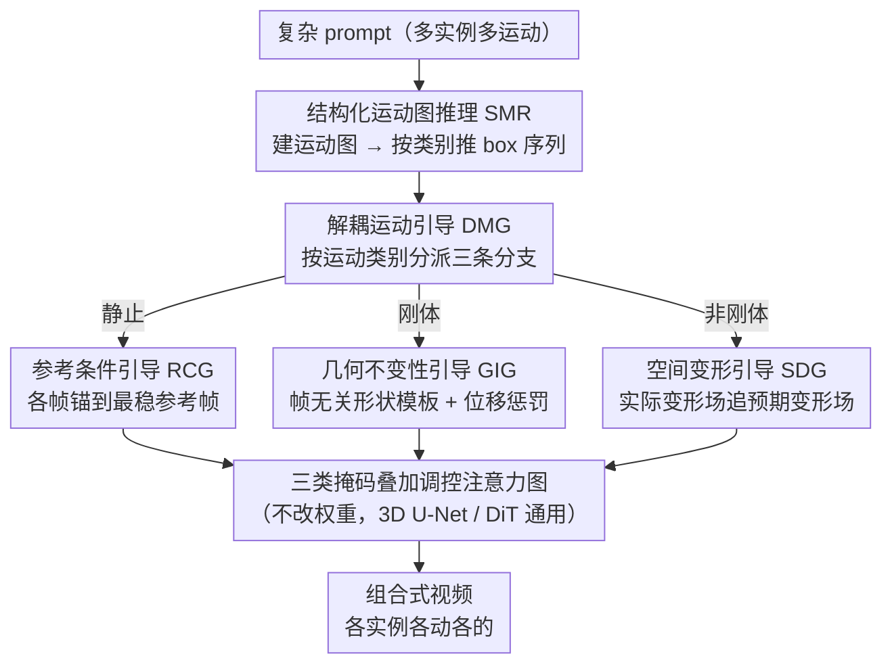

# Training-free Motion Factorization for Compositional Video Generation

**会议**: CVPR 2026  
**arXiv**: [2603.09104](https://arxiv.org/abs/2603.09104)  
**代码**: 待发布  
**领域**: 扩散模型 / 视频生成 / 运动控制  
**关键词**: 组合式视频生成, 运动分解, 结构化推理, 解耦引导, 免训练

## 一句话总结

提出一个运动分解框架，将场景中多实例的运动分解为静止、刚体运动和非刚体运动三类，通过结构化运动图推理（SMR）解决 prompt 的语义歧义，通过解耦运动引导（DMG）在扩散过程中针对性地调控三类运动的生成，无需额外训练即可在 VideoCrafter-v2.0 和 CogVideoX-2B 上显著提升运动多样性和保真度。

## 研究背景与动机

1. **领域现状**：组合式视频生成（CVG）旨在从复杂 prompt 生成多实例、多运动的场景。现有方法（LVD、VideoDirectorGPT 等）通常用 LLM 生成 bounding box 序列来引导实例运动。
2. **现有痛点**：(1) 运动语义歧义——从文本直接生成 box 序列会导致断裂的运动路径和异常尺寸变化；(2) 运动引导粗糙——统一的扩散引导无法区分不同运动类别，导致运动趋同、不自然。
3. **核心矛盾**：现有方法对所有实例的运动一视同仁，缺乏对运动类别多样性的建模。静止物体、直线运动的车辆、跳舞的人需要完全不同的生成策略。
4. **本文目标** 如何在不训练的前提下，让视频生成模型为每个实例生成符合其运动类别的多样化运动？
5. **切入角度**：将运动分解为三个基本类别——静止、刚体运动、非刚体运动，分别设计针对性的推理和引导策略。
6. **核心 idea**：运动分解 + 先规划后生成——用结构化运动图推理出每个实例的运动表示，再用解耦引导分支针对性地合成三类运动。

## 方法详解

### 整体框架

这篇论文要解决的是：从一段描述多个物体、多种运动的复杂 prompt 出发，让视频生成模型给每个物体生成符合它运动类别的、彼此不同的运动，而不是让所有物体动得千篇一律。核心观察是——静止的路灯、直线行驶的车、跳舞的人，本来就需要三套完全不同的生成策略，但现有方法对它们一视同仁。

框架走的是"先规划、后生成"两步。规划阶段（SMR）先把文本 prompt 翻译成一张结构化的运动图，再从图里为每个实例推导出逐帧的 bounding box 序列，作为该实例的运动表示。生成阶段（DMG）拿到这些 box 后，按实例的运动类别分别走三条专用引导分支——静止走外观一致性、刚体走几何不变性、非刚体走空间变形——各自去调控扩散模型的注意力图。整套流程不改模型权重，只在注意力层面动手，因此 3D U-Net（VideoCrafter）和 DiT（CogVideoX）两种骨干都能直接套用。

### 关键设计

**1. 结构化运动图推理（SMR）：把"文本→运动"的歧义拆成"文本→图→运动"两步**

直接让 LLM 从 prompt 一步生成 box 序列，常因语义歧义产出断裂的轨迹和异常的尺寸跳变。SMR 的做法是先让 LLM 建一张运动图 $\mathcal{R} = (\mathcal{V}, \mathcal{E})$：每个实例是一个节点，节点上标注它的运动属性和类别标签，有向边则编码实例间的空间关系与动态交互。有了这张图作为中间表示，box 序列的推导就退化成按类别套公式：静止实例直接锁死第一帧 $\mathcal{B}_f(v_n) = \mathcal{B}_1(v_n)$；刚体实例按估计的速度 $\vec{u}$ 和加速度 $\vec{a}$ 做运动方程外推 $\mathcal{B}_f = \mathcal{B}_{f-1} + \vec{u} + \frac{1}{2}\vec{a}$；非刚体实例则用边界位移向量 $\Delta_f(v_n)$ 来刻画非对称形变。先理解关系和类别、再算具体参数，这种分步推理把 LLM 容易出错的"凭空想运动"换成了"填结构化的空"，歧义自然小很多。

**2. 参考条件引导（RCG，针对静止实例）：把所有帧锚到一帧上，掐掉伪闪烁**

视频扩散模型在本该不动的区域常会自己抖出一层伪闪烁。RCG 先在实例区域内挑出一帧"最稳的帧"作参考——即与其它帧特征差异最小的那帧 $f^* = \arg\min_f \sum_{f'} D(\varphi(\mathbf{z}_f^t), \varphi(\mathbf{z}_{f'}^t))$，然后用一张掩码强制该实例的所有帧只能和参考帧做注意力交互：

$$\mathcal{G}_m[x,y,f,f'](v_n) = \mathbb{1}(f'=f^* \,\&\, (x,y) \in \mathcal{B}(v_n))$$

这等于在注意力层面把每一帧的静止区域都"复制粘贴"自同一张参考帧，跨帧的无谓变化被直接堵死，外观一致性得以保持。

**3. 几何不变性引导（GIG，针对刚体实例）：给物体造一个帧无关的形状模板**

刚体运动里物体只该平移/位移、不该变形，但无约束的视频模型常让车在开动时顺带"扭一下"。GIG 先用 k-means 从 box 区域里把前景抠出来，再把多帧的粗掩码做像素投票聚合，得到一张与帧无关的形状模板，最后把模板反投影回每一帧得到对齐掩码 $\mathcal{M}_f$——所有帧共享同一套几何，形变就被压住了。为了让运动平滑，它再叠一个位移惩罚因子按帧间中心距离调交互强度：

$$\Gamma[f,f'] = \exp(-\alpha \cdot \|\mathbf{C}_f - \mathbf{C}_{f'}\|_2) + 1, \qquad \mathcal{G}_r = \mathcal{M} \cdot \mathcal{M}^\top \odot \Gamma$$

距离越近的两帧交互越强，相当于鼓励相邻帧渐变、抑制远帧硬跳，过渡因此更顺。

**4. 空间变形引导（SDG，针对非刚体实例）：让实际变形去追预期变形**

跳舞的人各关节速度方向都不同，靠整体平移没法描述，必须落到像素级的变形场。SDG 一边用最近邻搜索从扩散特征里提取出"模型实际生成的"感知变形场 $\mathcal{D}_{\text{perc}}$，一边对 box 角点位移做双线性插值得到"我们期望的"box 变形场 $\mathcal{D}_{\text{box}}$，然后用一个变形惩罚因子去拉近两者：

$$\Lambda[i,j] = \exp(-\alpha \cdot (\mathcal{D}_{\text{perc}}[i,j] - \mathcal{D}_{\text{box}}[i,j])) + 1, \qquad \mathcal{G}_{\text{nr}} = (\mathcal{M} \cdot \mathcal{M}^\top) \odot \Lambda$$

实际变形偏离预期越多，惩罚越大，于是模型生成的像素级运动会被一步步引导着跟上 SMR 规划的变形方向。

### 一个完整示例

设 prompt 是"一辆车驶过一座静止的雕像，路边有人在跳舞"。SMR 先建运动图：三个节点——雕像（静止）、车（刚体）、人（非刚体），边记下"车从雕像旁经过""人在路边"的空间关系。接着按类别出 box：雕像每帧锁同一个 box；车按速度+加速度逐帧外推，box 平移；人用边界位移向量让 box 逐帧非对称地伸缩。

进入生成阶段，DMG 给三个实例分派不同分支：雕像走 RCG，挑出最稳的一帧把其余帧都锚上去，雕像纹理帧帧不抖；车走 GIG，用形状模板锁住车身几何、位移惩罚让它平滑驶过；人走 SDG，让生成出的肢体变形去追 box 角点规划的变形场。三条分支产生的掩码 $\mathcal{G}_m, \mathcal{G}_r, \mathcal{G}_{nr}$ 叠加进同一次注意力调控，最终一帧里三个物体各动各的、互不串味。

### 损失函数 / 训练策略

整套方法不需要任何额外训练。对 3D U-Net 架构，通过梯度更新噪声嵌入 $\mathbf{z}^{t-1} \leftarrow \mathbf{z}^t - \nabla\mathcal{L}$，其中 $\mathcal{L} = 1 - \frac{\beta}{P}\sum(\mathbf{A} \odot (\mathcal{G}_m + \mathcal{G}_r + \mathcal{G}_{nr}))$，即让注意力图 $\mathbf{A}$ 往三类引导掩码的方向走。对 DiT 架构则更直接，把掩码当偏置加到注意力分数上 $\mathbf{A} = \text{Softmax}(\frac{\mathbf{Q}\mathbf{K}^\top (1 + \beta \odot (\mathcal{G}_m + \mathcal{G}_r + \mathcal{G}_{nr}))}{\sqrt{d}})$。超参上，VideoCrafter-v2.0 用 $\beta=10$、引导步 1-25；CogVideoX-2B 用 $\beta=0.15$、引导步 1-10。

## 实验关键数据

### 主实验

在自建 CVGBench-m（1665 样本自 MSR-VTT）和 CVGBench-p（994 样本自 Panda-70M）上评估：

| 模型设置 | Subject Consis. | Background Consis. | Temporal Flicker. | Motion Smooth. | Dynamic Degree |
|---------|----------------|-------------------|-------------------|---------------|----------------|
| VideoCrafter-v2.0 (基线) | 97.68% | 97.28% | 96.28% | 98.16% | 33.11% |
| + A&R | 97.48% | 97.05% | 96.43% | 98.27% | 38.40% |
| + **Ours** | **98.40%** | **98.11%** | **97.39%** | **98.63%** | **82.21%** |
| CogVideoX-2B (基线) | 91.33% | 92.78% | 95.01% | 96.88% | 87.80% |
| + R&P | 91.00% | 90.85% | 95.07% | 96.96% | 91.02% |
| + **Ours** | **98.27%** | **97.73%** | **98.25%** | **98.74%** | **96.00%** |

### 消融实验

引导分支消融（VideoCrafter-v2.0 基线）：

| RCG | GIG | SDG | Subject Consis. | Dynamic Degree | 说明 |
|-----|-----|-----|----------------|---------------|------|
| ✗ | ✗ | ✗ | 97.48% | 38.40% | 仅语义引导 |
| ✓ | ✗ | ✗ | 98.11% | 51.60% | 静止引导 |
| ✗ | ✓ | ✗ | 98.07% | 53.60% | 刚体引导 |
| ✗ | ✗ | ✓ | 97.71% | 74.85% | 非刚体引导 |
| ✓ | ✓ | ✓ | **98.40%** | **82.21%** | 完整模型 |

运动推理模块消融（CogVideoX-2B 基线）：

| 配置 | Subject Consis. | Dynamic Degree | 说明 |
|------|----------------|---------------|------|
| w/o SMR | 93.16% | 88.21% | 直接文本到运动 |
| w/ SMR (Ours) | **98.27%** | **96.00%** | 运动图推理 |

### 关键发现

- **Dynamic Degree 提升最为显著**：在 VideoCrafter-v2.0 上从 33.11% 提升到 82.21%（+49.1 pp），说明基线模型生成的运动过于保守，本框架有效激发了大幅运动。
- **非刚体引导对动态度贡献最大**：单独使用 SDG 即可将 Dynamic Degree 从 38.40% 提至 74.85%（+36.45 pp）。
- **SMR 模块是关键**：去掉 SMR 后 Subject Consistency 掉 5.11%、Dynamic Degree 掉 7.79%，证明结构化推理对消解语义歧义至关重要。
- **模型规模影响推理质量**：LLaMA-70B 比 8B 在 Dynamic Degree 上提升 6.87%（VideoCrafter）和 1.23%（CogVideoX）。
- **跨架构泛化**：框架在 3D U-Net 和 DiT 上均有效，验证了架构无关性。

## 亮点与洞察

- **运动三分类的简洁抽象**：将复杂运动分解为静止/刚体/非刚体三个基本类别，每类有明确的数学建模方式（常数/运动方程/位移场），简洁而有效。这种分类思路可迁移到运动估计、视频编辑等任务。
- **运动图作为中间表示**：将文本→运动的歧义问题转化为文本→结构化图→运动的两步推理，利用图结构编码实例间关系，是应对 LLM 运动推理不可靠的聪明策略。
- **注意力级调控的架构无关性**：通过直接操作注意力图/分数实现运动引导，无需修改模型权重或架构，天然适配不同骨干。

## 局限与展望

- 无法处理罕见语义概念（如 "Dendroid"），受限于基线模型的生成能力
- 对情感线索（如"悲伤"表情）生成效果差，因为视频模型倾向忽略形容词/副词
- 仅支持平面运动（bounding box），不处理深度方向的运动和 3D 旋转
- 未探索相机运动的建模，所有运动都在固定视角下进行
- 改进方向：引入参考图像提供罕见概念先验；建模相机位姿变化；扩展到 3D bounding box

## 相关工作与启发

- **vs VideoTetris/Vico**: 关注语义绑定和 token 重要性，但忽略运动类别多样性；本文互补地解决了运动问题
- **vs LVD/VideoDirectorGPT**: 用 LLM 生成 box 序列但统一引导，运动趋同；本文通过运动图和解耦引导显著提升多样性
- **vs FreeTraj/TrailBlazer**: 用稀疏运动场做引导，但不区分运动类别；本文的分类引导更精细
- **vs MotionPrompting**: 用鼠标拖拽提供运动信号，需要用户交互；本文完全自动化

## 评分

- 新颖性: ⭐⭐⭐⭐ 运动三分类和运动图推理的抽象有创意，但各组件（attention guidance/LLM reasoning）相对成熟
- 实验充分度: ⭐⭐⭐⭐ 自建 benchmark 覆盖多种语言模式，消融详尽，但缺少与 SOTA 商业模型的对比
- 写作质量: ⭐⭐⭐⭐ 框架清晰，公式完整，但符号定义较多
- 价值: ⭐⭐⭐⭐ 免训练+架构无关的特性使其实用性强，运动分解思路有普适性

<!-- RELATED:START -->

## 相关论文

- [\[CVPR 2026\] FlowMotion: Training-Free Flow Guidance for Video Motion Transfer](flowmotion_training-free_flow_guidance_for_video_motion_transfer.md)
- [\[CVPR 2026\] SWIFT: Sliding Window Reconstruction for Few-Shot Training-Free Generated Video Attribution](swift_sliding_window_reconstruction_for_few-shot_training-free_generated_video_a.md)
- [\[CVPR 2026\] SwitchCraft: Training-Free Multi-Event Video Generation with Attention Controls](switchcraft_training-free_multi-event_video_generation_with_attention_controls.md)
- [\[CVPR 2026\] FlowDirector: Training-Free Flow Steering for Precise Text-to-Video Editing](flowdirector_training-free_flow_steering_for_precise_text-to-video_editing.md)
- [\[AAAI 2026\] DreamRunner: Fine-Grained Compositional Story-to-Video Generation with Retrieval-Augmented Motion Adaptation](../../AAAI2026/video_generation/dreamrunner_fine-grained_compositional_story-to-video_genera.md)

<!-- RELATED:END -->
