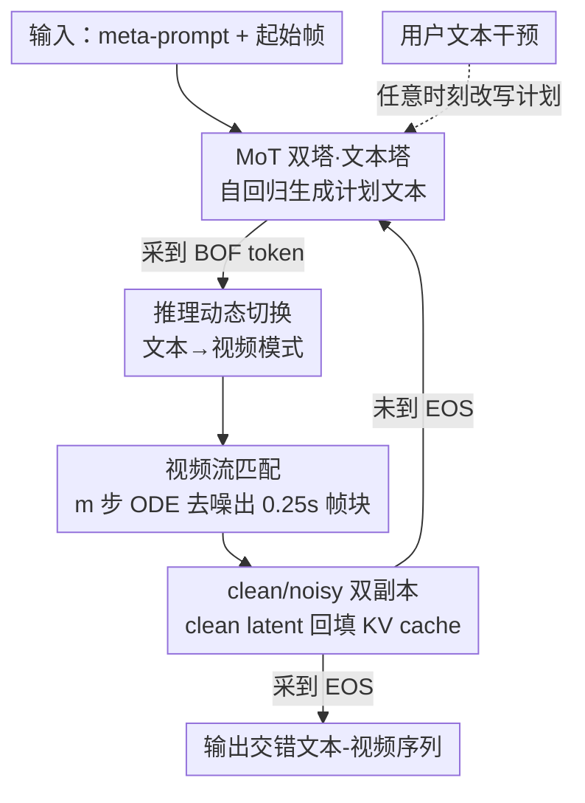

# TV2TV: A Unified Framework for Interleaved Language and Video Generation

**会议**: CVPR 2026  
**论文**: [CVF Open Access](https://openaccess.thecvf.com/content/CVPR2026/html/Han_TV2TV_A_Unified_Framework_for_Interleaved_Language_and_Video_Generation_CVPR_2026_paper.html)  
**领域**: 视频生成 / 多模态  
**关键词**: 交错生成, 视频流匹配, Mixture-of-Transformers, 可控视频生成, 视觉规划

## 一句话总结
TV2TV 用一个 Transfusion 风格的统一模型，把视频生成拆成「先用文字想清楚下一段画面要发生什么、再用像素把它画出来」的交错过程，让语言塔承担语义决策、视频塔负责渲染，从而在画质（人评 91% 胜率）和细粒度可控性（指令跟随准确率 +19 分）上同时超越「直接文生视频」和「先想完再生成」的基线。

## 研究背景与动机
**领域现状**：视频生成模型（扩散 / 流匹配 / 自回归）这几年在画质上突飞猛进，但生成时基本是「一段文本 prompt → 一整段视频」，文本只作为开头的条件注入，之后整个时序演化全靠视频模型自己脑补。

**现有痛点**：当目标视频需要明显的语义分叉（surfer 接下来是继续滑还是急转）或反复的高层推理（球员先突破、再射门、再庆祝）时，纯视频模型很难一次性把「接下来该发生什么」想清楚——它要在像素空间里同时承担「编剧」和「画师」两份工作，导致复杂动作序列容易跑偏、物理不合理（穿墙、瞬移、动作过慢）。同时这种「一锤子」生成几乎无法中途干预：用户没有抓手去改变剧情走向。

**核心矛盾**：决定「下一步发生什么」是一个低维、强语义的离散决策问题，更适合语言模型；而把它渲染成像素是高维连续问题，适合视频模型。现有 T2V 把这两件事都压进视频塔，既浪费了 LLM 的推理能力，又抬高了视频生成的熵。

**本文目标**：(1) 让模型自动地把视频生成分解成「文字规划 + 视频渲染」的交错过程；(2) 让这种规划是可读、可编辑、可在任意时刻干预的。

**切入角度**：游戏里手柄动作和后续画面天然时间对齐——动作序列就是一份现成的「文字剧本」。作者由此假设：如果让模型在生成每一小段画面之前先「用文字想一下」，把语义负担甩给语言塔，视频塔只需照着这一小段计划渲染，质量和可控性都会变好。

**核心 idea**：用一个 MoT 双塔模型联合学「下一 token 预测（文本）」和「下一帧预测（视频流匹配）」，推理时由一个特殊 BOF token 控制在「文字思考」和「像素行动」之间动态来回切换——即 think in words, act in pixels。

## 方法详解

### 整体框架
TV2TV 把一条训练样本组织成**时间顺序交错**的「文本段 + 视频帧块」序列：文本写在它要描述的那段画面之前，于是视频生成可以条件在刚写出来的计划文本上。全局上模型是自回归的，严格遵守时间因果（每个 token / 帧块只能看更早的内容）；但在单个帧块内部（4 帧打包成一个 0.25 秒的 latent chunk）是非自回归的，用流匹配（flow matching）一次性去噪出整块。架构上用 Mixture-of-Transformers（MoT）双塔——文本塔、视频塔各有自己的注意力和 FFN 参数，但共享一个跨全序列的自注意力，文本塔从预训练 Llama 初始化。推理时模型默认在文本模式自回归生成，一旦采到 BOF（beginning-of-frame）token 就切到视频模式跑若干步 ODE 去噪生成一块画面，画完再切回文本——如此往复直到 EOS。

### 关键设计

**1. 交错文本-视频序列与 BOF/EOF 自动模式切换：把「想」和「画」编进同一条序列**

痛点是纯 T2V 把语义决策和渲染混在一起。TV2TV 的做法是把数据表示成一条按时间戳排序的交错序列：文本段在前、它对应的帧块在后，使视频生成显式地条件在「刚想好的那句计划」上。形式上每个视频帧的位置都展开成 $[x^{txt}_i, x^{noisy\text{-}vid}_i, x^{clean\text{-}vid}_i]$ 三元组，整条序列为

$$[x^{txt}_1, x^{noisy\text{-}vid}_1, x^{clean\text{-}vid}_1, \dots, x^{txt}_N, x^{noisy\text{-}vid}_N, x^{clean\text{-}vid}_N]$$

为了让模型自己学会「什么时候停下文字、开始画画」，作者引入两个特殊离散 token：BOF（beginning-of-frame）和 EOF（end-of-frame），用来界定一块连续视频 token 的起止。这样模式切换不再靠外部脚本硬性规定（不像 Genie 那种每步都要用户给输入），而是模型在自回归时自然采样出 BOF 就进入视频模式——这正是它区别于「交互式世界模型」的关键：切换时机由模型自主决定。

**2. clean/noisy 双副本 latent：化解 teacher-forcing 与流匹配的天然冲突**

这是全文最巧的一点。流匹配训练需要**带噪的插值表示**作为输入（去噪目标），但自回归 teacher-forcing 又要求历史位置提供**干净表示**作为后续生成的条件上下文——同一个帧 latent 不可能既干净又带噪。MAGI-1 的解法是强制噪声单调（越早的块越干净），但这在「文本-视频交错」场景下不好用，因为它限制了模型与文本成分有效交互的能力。TV2TV 直接在输入序列里**给每个视频帧保留两份拷贝**：先放带噪块 $x^{noisy\text{-}vid}_i$，紧跟一份干净块 $x^{clean\text{-}vid}_i$。于是模型既能对当前帧做去噪学习（看带噪副本），又能用干净的历史副本维持正确的条件上下文，两个目标不再打架。

**3. MoT 双塔架构与 Transfusion 式联合训练：让语言塔和视频塔各司其职又共享上下文**

为同时建模离散文本和连续视频，TV2TV 采用 MoT：文本和视频各有一套模态专属的 $Q/K/V$、$O$ 投影和 FFN，但自注意力是**跨整条交错序列计算的**，从而既保留模态特异处理、又维持全局多模态上下文。文本塔参数从预训练 Llama 初始化（实验里 3B 用 Llama-3.2-3B、8B 用 Llama-3.1-8B），直接继承 LLM 的推理能力。视频侧用 Cosmos VAE tokenizer（4× 时间压缩）得到连续 latent，经 U-Net 下采样器投影（顺带注入 timestep 时间嵌入和 2D 位置嵌入），帧内用双向注意力、帧间用因果注意力。训练目标是文本交叉熵和视频流损失的加权和：

$$\mathcal{L} = \lambda_{txt}\,\mathcal{L}_{txt} + \lambda_{vid}\,\mathcal{L}_{vid}$$

两个损失联合优化。带噪 latent 由 rectified flow 插值得到：$x^{noisy\text{-}vid} = t\,x^{clean\text{-}vid} + (1-t)\,\epsilon$，其中 $t$ 采自 logit-normal 分布（$\mu=0,\ \sigma=1.4$），$\epsilon\sim\mathcal{N}(0,I)$。此外为支持文本 CFG，训练时以小概率 dropout 文本 $x^{txt}_i$；为缓解 teacher-forcing 的曝光偏差，还以小概率把干净副本 soft-dropout 成带噪副本（clean-vid-flip）。

**4. 推理期动态文本↔视频交替：BOF 触发的 think-act 循环**

推理时 TV2TV 默认在文本模式像普通 LLM 一样自回归。在第 $i{-}1$ 步采到下一个 token $x^{txt}_i$ 后：若它是普通词表 token，继续生成文本；若它是 BOF token，则 (1) 用 $\mathcal{N}(0,I)$ 初始化一块帧的 noisy token，(2) 复用前文 KV cache 跑 $m$ 步 ODE 求解器（如 Euler，可选叠加 CFG）去噪得到干净帧块，(3) 用求解结果 $x^{clean\text{-}vid}_i$ 再做一次前向、更新 KV cache，然后回到文本模式；若采到 EOS 或超出上下文则结束。这套循环让「文字规划」和「像素渲染」交替推进，每段画面都由它前面那句刚生成的计划文本来引导。

**5. VLM 交错描述数据增强：把这套范式从游戏迁到真实视频**

游戏数据天然有时间对齐的「动作文本」，但真实视频普遍缺乏带时间戳的密集字幕。作者搭了一条 VLM 增强流水线把范式扩展到开放域：① 从 YT-Temporal-1B 用关键词等过滤采体育数据；② 场景检测切成 6–16 秒片段、再按关键帧细分；③ 用基于模型的运动/语义/质量过滤器筛高质量片段；④ 用 VLM 做**多层级交错字幕**——每个场景一个整体 meta-caption，加上描述相邻短片段间「变化」的细粒度交错字幕。最终得到 8K 小时体育交错语料，使 TV2TV 能从头训练并泛化到真实复杂动作。

## 实验关键数据

### 主实验：CS:GO 游戏数据上的画质与可控性
在 95 小时 CS:GO 游戏录像（手柄动作转文本）上训练 3B-MoT（文本塔 + 视频塔各 3B），与两个共享同一自回归框架的受控基线对比：**T2V**（不含交错文本，只条件 meta-prompt + 起始帧）、**Think2V**（先一次性把全部动作计划想完，再生成所有视频，即 think-then-act）。人评做成对比较。

| 对比维度 | 对手 | TV2TV 胜 vs 对手胜 | 说明 |
|----------|------|--------------------|------|
| 整体画质（成对人评） | T2V | 91% vs 1% | 交错规划带来巨大画质提升 |
| 整体画质（成对人评） | Think2V | 48% vs 38% | 仍优于「先想完再画」 |
| 细粒度可控性 | Think2V | +19 分（指令跟随准确率） | 中途文本干预能可靠改变画面 |

长视频（64 秒，滑窗生成）上的优势比短视频（约 6 秒）更明显，说明交错规划对长时序生成尤其重要。可控性测了四种中途干预（后退、左键开枪、换弹、跳跃）在 1s / 3s 两个时刻插入：TV2TV 对 left-click 和 jump 的控制显著强于 Think2V，reload 和 backward 上差距较小；且干预后 TV2TV 的画质也明显更高。

### 扩展实验：真实体育视频（8K 小时）
用 VLM 增强流水线造出 8K 小时体育交错数据，训练 8B-MoT（文本塔 Llama-3.1-8B），250K 步、batch 512。与外部通用视频模型及同数据训练的受控基线对比（专业标注者成对评测）。

| 对比对象 | prompt 对齐 / 真实感 / 总体偏好 | 画质 |
|----------|-------------------------------|------|
| 同数据 T2V | 54.0% vs 34.7%（胜） | 强于 |
| 同数据 Think2V | 53.3% vs 41.3%（胜） | 强于 |
| Cosmos-Predict2（2B/14B） | 胜 | 超过 |
| MAGI-1（4.5B/24B） | 胜 | 持平 |
| WAN-2.2 TI2V 5B | 胜（对齐/真实感/偏好） | 略逊 |

外部模型未针对体育域调优，作为 out-of-domain 基线参考。结论是 TV2TV 在 prompt 对齐、真实感、总体偏好上全面胜出；画质上超过 Cosmos2、与 MAGI-1 相当、略低于 WAN-2.2 5B——在「快速运动 + 复杂语义」的体育这个硬骨头上已属强表现。

### 关键发现
- **「先想完再画」远不如「边想边画」**：Think2V（一次性 roll-out 全部计划）相比 TV2TV 在可控性上落后 19 分，说明把规划**交错**地穿插进生成、让每段画面紧跟刚生成的计划，比一次性给完计划更能让视频真正听话。
- **交错规划对长视频增益更大**：把语义决策甩给文本塔，等价于降低了视频生成过程的熵，长时序下累积优势更明显。
- **不同干预动作难度不一**：left-click / jump 这类视觉变化显著的动作更易被控制，reload / backward 这类细微动作控制收益较小——可控性上限部分受动作本身的可视性约束。
- **clean/noisy 双副本是交错场景的关键使能项**：MAGI-1 的单副本+噪声单调方案虽省内存，但会削弱与文本成分的交互，不适合本文设定。

## 亮点与洞察
- **把「编剧」和「画师」分工到两座塔**：核心洞察是「下一步该发生什么」是个低维语义决策，更该交给继承自 LLM 的文本塔，而非让视频塔在像素空间里硬猜——这直接降低了视频生成的熵。这个「用语言当主动推理机制、而非被动条件」的视角很有迁移价值。
- **clean/noisy 双副本**：一招化解「流匹配要带噪输入 vs 自回归要干净上下文」的根本冲突，且比 MAGI-1 的噪声单调方案更适配文本-视频交错，是可复用的工程 trick。
- **BOF token 让模式切换自学习**：不靠外部调度器，模型自己采样决定何时从文字转到画面，把「何时该想、何时该画」也变成可学习的部分。
- **游戏数据当试验场的设计很聪明**：手柄动作天然是时间对齐的「文字剧本」，让作者能在受控条件下、只改文本表示而固定视频数据，干净地验证「think then act」假设。
- **文本计划即可控接口**：用户能 inspect / edit / steer 中间的文字计划，在任意时刻改写剧情走向——这是纯像素模型给不了的可解释可控性。

## 局限与展望
- **数据对齐依赖强**：游戏靠手柄动作天然对齐，真实域靠 VLM 合成交错字幕；VLM 字幕的质量、时间对齐精度和偏差会直接传导到生成质量，作者未深入分析字幕错误的影响。
- **画质未全面登顶**：体育域画质仍略低于 WAN-2.2 5B，说明把语义负担外包给文本塔主要换来的是可控性和对齐，纯像素保真度还有差距。
- **双副本带来序列变长**：每个视频帧保留 noisy + clean 两份拷贝，会拉长序列、增加显存与计算开销，论文未量化这部分代价。
- **可控性受动作可视性限制**：backward / reload 等细微动作干预收益有限，对「视觉上不显眼但语义重要」的控制仍是开放问题。
- **评测以人评为主**：画质 / 可控性都靠 in-house 或外包成对人评，缺乏自动化指标的交叉验证，可复现性和规模化评估受限。

## 相关工作与启发
- **vs Transfusion / BAGEL / LMFusion**：这些统一多模态模型主攻文本+图像，用模态专属损失或 MoT 做早融合 AR-扩散混合。TV2TV 把这条路线**扩展到视频和交错多模态序列**，并把文本从「条件」升级为「主动规划机制」。
- **vs Genie 类交互式世界模型**：Genie 学潜在动作但不可解释、且需用户每步给输入。TV2TV 生成并条件在**开放式、文本接地的动作**上，切换时机由模型自决，可读可编辑。
- **vs MAGI-1**：单块视频自回归部分与 MAGI-1 类似，但 MAGI-1 用噪声单调维持单副本，TV2TV 用 clean/noisy 双副本，更适配文本-视频交错。
- **vs Think2V（本文消融基线）**：同样让模型「想」，但 Think2V 是 think-then-act（一次性 roll-out 全部计划再生成），TV2TV 是 interleaved（边想边画），后者在可控性上 +19 分，验证了「交错」本身的价值。
- **vs 多 prompt 视频扩展工作**：TV2TV 的交错设计通过滑窗天然支持任意时刻插入 prompt，无需额外机制。

## 评分
- 新颖性: ⭐⭐⭐⭐⭐ 把 LLM 交错推理范式系统地引入视频生成，「think in words, act in pixels」+ clean/noisy 双副本是真正的新点。
- 实验充分度: ⭐⭐⭐⭐ 受控游戏实验干净、扩展到 8K 小时真实体育且对比多个强外部模型，但以人评为主、缺自动指标交叉验证。
- 写作质量: ⭐⭐⭐⭐⭐ 动机—方法—实验逻辑清晰，受控基线（T2V / Think2V）设计精准地隔离了「交错」这一变量。
- 价值: ⭐⭐⭐⭐⭐ 给出一条把语言推理与可控视频生成统一进单一框架的可扩展配方，对世界模型和可控生成方向有启发。

<!-- RELATED:START -->

## 相关论文

- [\[CVPR 2026\] DreamStyle: A Unified Framework for Video Stylization](dreamstyle_a_unified_framework_for_video_stylization.md)
- [\[CVPR 2026\] UniTalking: A Unified Audio-Video Framework for Talking Portrait Generation](unitalking_a_unified_audio-video_framework_for_talking_portrait_generation.md)
- [\[CVPR 2026\] U-Mind: A Unified Framework for Real-Time Multimodal Interaction with Audiovisual Generation](u-mind_a_unified_framework_for_real-time_multimodal_interaction_with_audiovisual.md)
- [\[CVPR 2026\] VGA-Bench: A Unified Benchmark and Multi-Model Framework for Video Aesthetics and Generation Quality Evaluation](vga-bench_a_unified_benchmark_and_multi-model_framework_for_video_aesthetics_and.md)
- [\[CVPR 2026\] Unified Camera Positional Encoding for Controlled Video Generation](unified_camera_positional_encoding_for_controlled_video_generation.md)

<!-- RELATED:END -->
