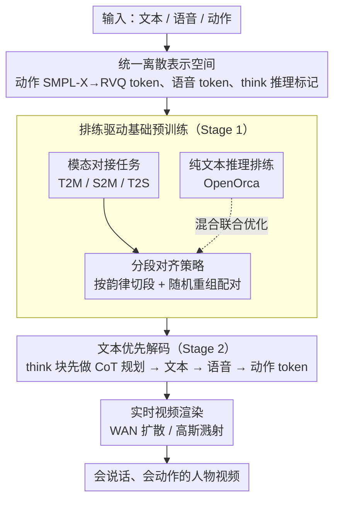

# U-Mind: A Unified Framework for Real-Time Multimodal Interaction with Audiovisual Generation

**会议**: CVPR 2026  
**arXiv**: [2602.23739](https://arxiv.org/abs/2602.23739)  
**代码**: 无  
**领域**: 视频生成  
**关键词**: 多模态交互, 实时生成, 数字人, 语音-动作同步, 思维链推理

## 一句话总结
提出 U-Mind，首个统一实时全栈多模态交互系统，支持高层推理对话和指令跟随，在单一交互循环中联合生成文本、语音、动作，并渲染为逼真视频，通过排练驱动学习和文本优先解码策略兼顾推理保持与跨模态对齐。

## 研究背景与动机
构建能够进行实时、多模态、闭环交互的数字人是具身智能的核心目标。现有系统存在以下不足：

**问题拆解**：

**单一模态限制**：多数对话系统仅支持文本/语音输出，缺乏视觉交互能力（动作、视频）

**推理能力退化**：直接在 LLM 上多模态微调会引起灾难性遗忘，模型失去推理和规划能力

**跨模态同步不足**：语音和动作的时序对齐困难，现有系统缺乏统一的 token 级对齐

**现有系统的不足**：
- SOLAMI：支持文本+动作多模态对话，但文本中心的对齐策略忽略推理保持，语音-动作同步差
- LOM：SOTA 的 T2M 和 S2M 模型，但缺乏推理和对话能力
- 扩散模型方法：动作质量高但不支持实时交互和高层推理

**核心 idea**：设计统一对齐与推理框架（Unified Alignment and Reasoning Framework），通过三个核心机制解决上述矛盾：
- 排练驱动学习（Rehearsal-Driven Learning）→ 防止推理退化
- 分段对齐策略（Segment-wise Alignment）→ 提升跨模态同步
- 文本优先解码（Text-first Decoding）→ 确保推理引导生成

## 方法详解

### 整体框架
U-Mind 想做的事，是让一个数字人在一轮对话里把「想清楚→说出来→配上声音→摆出动作→渲成视频」全部走完，而且要实时、要保住 LLM 原本的推理脑子。它以 LLaMA2-7B 为底座，把语音、动作都压成离散 token，塞进 LLM 的词表，于是整条 pipeline 退化成一个统一的 next-token 自回归过程：模型先在 `<think>...</think>` 里用纯文本想一遍，再把文本回复、语音 token、动作 token 一段段吐出来，最后由渲染器把动作和语音变成会说话的人物视频。

训练分两阶段：Stage 1 是排练驱动的基础预训练，把多模态对齐任务和纯文本推理数据混在一起练，让模型学会新模态的同时不忘推理；Stage 2 是 CoT 风格的指令微调，明确教它「先想后做」。下面五个设计依次解决：模态怎么统一进 token 空间、怎么学新模态而不遗忘、怎么让语音和动作在时序上对齐、怎么让推理引导生成、以及怎么把 token 变回视频。

### 关键设计

**1. 统一离散表示空间：把三种异质模态压进同一套 token，才能用一个自回归模型全包**

文本、语音、动作天生是三种数据，直接拼在一起 LLM 无从下手。U-Mind 的做法是把后两者都离散化成 token，再扩充 LLM 的词表和嵌入矩阵把它们纳进来。动作侧先用 SMPL-X 体模型把人体姿态参数化成连续的 6D 关节旋转，再过一个 RVQ-VAE 量化成动作 token；语音侧用 SpeechTokenizer 的编码器抽出离散声学 token，同时保留语义和副语言（语调、停顿）信息；推理侧则引入 `<think>` / `</think>` 一对特殊标记，把 CoT 段从普通文本里界定出来。这样一来，生成文本、生成语音、生成动作在模型眼里都是同一件事——预测下一个 token，无需为每种模态单独挂一个解码头。

**2. 排练驱动基础预训练：边学新模态边「复习」推理，避免灾难性遗忘**

直接拿多模态数据去 SFT 一个 LLM，低层的模态适配（学会发声、摆姿势）会和高层的推理规划抢容量，结果往往是模型学会了动嘴动手却忘了怎么想——典型的灾难性遗忘。U-Mind 不是「先训模态再补推理」，而是在 Stage 1 预训练时就把两类任务拌在一起联合优化：一类是模态对接任务 T2M（文本→动作）、S2M（语音→动作）、T2S（文本→语音），教模型学会发声和摆姿势；另一类是穿插进来的高质量纯文本推理数据（OpenOrca）作为「排练」，让推理这条核心能力在整个训练过程中始终被反复唤醒。消融显示去掉排练后回复相关性（Relevance）下降约 2.1 分，印证了「边学边复习」对保住推理脑子的必要性。

**3. 分段对齐策略：按韵律切段再随机重组，逼模型学到细粒度的语音-动作时序对应**

即便三种模态都进了同一套 token，语音和动作的逐帧时序对齐仍然难——整句整段地学，模型容易把「这句话配这套动作」当成整体死记，换个说法就对不齐。U-Mind 在 Stage 1 训练里按语音的韵律和停顿边界把输入切成小段，再随机重组这些分段配对来训练，逼模型学到的不是整句死记，而是词段级别的语音-动作对应关系。这样语音落到某个词时对应动作刚好到位，跨模态同步因此更稳；消融里去掉分段对齐，动作质量 FGD 从 11.12 恶化到 16.89，是动作质量的关键来源。

**4. 文本优先解码：让符号推理跑在连续模态生成前面，既保住脑子又当生成蓝图**

如果模型一上来就直接吐语音和动作 token，语言层面的理解和规划就被绕过了——消融里这会让回复的相关性几乎归零（Relevance 暴跌到 1.24）。文本优先解码强制每个回复都以一段纯文本的 `<think>...</think>` 内部推理开头，想清楚要表达什么、怎么组织，之后才依次生成文本回复、语音、动作。它和普通 CoT 的区别在于：这里的思维链不只是为了答对，更是后续多模态生成的规划蓝图——动作和语音是顺着这段文本规划长出来的，而不是各自为政，跨模态语义因此天然对齐。

**5. 实时视频渲染：把 token 化的动作和语音落地成逼真的说话人视频**

最后一步要把抽象的动作/语音 token 变回能看的人。U-Mind 给了两条渲染路径：一条是基于 WAN 的扩散渲染器，先把 SMPL-X 转成 DWPose 的 2D 关键点，再扩散出照片级的 2D 视频，画面更真但开销大；另一条是高斯溅射渲染器，直接从 SMPL-X 渲染出 3D 人体，几何一致性好、更轻量。两条路径覆盖了「追求画质」和「追求实时/三维」两种需求。

### 一个完整示例
设想用户语音问数字人「帮我指一下菜单上的招牌菜」。模型先在 `<think>` 块里用纯文本推理：识别这是一条带空间指代的指令，规划出「先口头回应 + 用手指向目标」的回复结构，然后闭合 `</think>`。接着按文本优先的顺序：先生成文本回复「好的，招牌菜在这一栏」；再把这句话转成语音 token，韵律里带上自然的停顿；同步生成与语音对齐的动作 token——抬手、伸出食指、指向画面右侧。由于分段对齐在预训练里已把「这一栏」这个词段和指向动作绑在了相近时刻，语音落到「这一栏」时手刚好指到位，不会出现说完了手才动的错位。最后动作 token 解回 SMPL-X，走 WAN 扩散渲染器输出一段会说话、会指物的人物视频。整条链路从推理到成片在一次自回归里跑完，这正是「统一交互循环」的含义。

### 损失函数 / 训练策略
- Stage 1：8 × H100，AdamW，peak LR $1 \times 10^{-4}$，cosine decay
- Stage 2：同样设置，LR 降至 $2 \times 10^{-5}$ 保持稳定对齐
- 视频渲染模块：16 × H100，LR $1 \times 10^{-5}$
- 数据：BEAT v2（S2M）+ HumanML3D（T2M）+ QA 增强 + OpenOrca（推理排练）+ Common Voice（TTS）

## 实验关键数据

### 多模态对话

| 方法 | FGD↓ | Diversity↑ | Relevance↑ | Naturalness↑ |
|------|------|-----------|-----------|-------------|
| Dataset GT | 0 | 11.37 | 8.32 | 8.57 |
| LLM+TTS+LOM | 17.87 | 11.02 | **8.72** | 3.95 |
| SOLAMI | 18.43 | 9.29 | 1.23 | 5.62 |
| **U-Mind** | **7.67** | **11.18** | 8.23 | **8.11** |

### 指令跟随

| 方法 | FGD↓ | Diversity↑ | Relevance↑ | Naturalness↑ |
|------|------|-----------|-----------|-------------|
| LLM+TTS+LOM | 10.73 | 7.96 | **9.00** | 6.26 |
| SOLAMI | 18.51 | 10.01 | 7.56 | 7.92 |
| **U-Mind** | **5.12** | **10.19** | 8.50 | **8.26** |

### 基础生成任务 — S2M 和 T2M

| 方法 | S2M FGD↓ | S2M Angle Error↓ | T2M FGD↓ | T2M Angle Error↓ |
|------|----------|------------------|----------|------------------|
| LOM | 16.47 | 0.251 | 14.22 | 0.331 |
| SOLAMI | — | — | 8.64 | 0.336 |
| EMAGE | 17.85 | 0.248 | — | — |
| **U-Mind** | **11.12** | **0.188** | 12.69 | **0.109** |

### 消融实验

| 配置 | Relevance↑ | Naturalness↑ |
|------|-----------|-------------|
| w/o 数据排练 | 6.13 | 7.18 |
| w/o 文本优先解码 | 1.24 | 5.18 |
| w/o CoT | 5.54 | 7.23 |
| **Full U-Mind** | **8.23** | **8.11** |

| 配置 | FGD↓ | Angle Error↓ | Diversity↑ |
|------|------|-------------|-----------|
| w/o 分段对齐 | 16.89 | 0.219 | 10.46 |
| **Full** | **11.12** | **0.188** | **11.48** |

### 关键发现
- FGD 大幅领先：对话任务 7.67（SOLAMI 18.43），说明动作质量远超现有交互系统
- **文本优先解码是最关键组件**：移除后 Relevance 从 8.23 暴跌至 1.24——直接生成语音/动作会完全丧失语义理解
- 数据排练对推理保持重要：移除后 Relevance 下降 2.1 分
- 分段对齐显著改善动作质量：FGD 从 16.89 降至 11.12
- U-Mind 在 T2M 的 Angle Error（0.109）上大幅领先 LOM（0.331）和 SOLAMI（0.336），说明运动精度极高

## 亮点与洞察
- **系统级贡献**：首个将推理→文本→语音→动作→视频完整闭环的实时系统
- **排练驱动学习**的思路优雅：不是先训后忘再补，而是训练过程中持续"排练"核心能力
- **文本优先解码**验证了"推理先于生成"的范式在多模态系统中的关键性
- 消融实验设计出色：每个组件的贡献都被清晰量化

## 局限与展望
- 动作表达力受 RVQ-VAE 离散词表限制，面部表情和手部细动作精度不足
- 预训练数据比例靠经验确定，缺乏理论指导的平衡框架
- 基于 LLaMA2-7B，模型规模限制了推理复杂度上限
- 视频渲染使用 WAN 模型，计算开销大，"实时"性需评估
- 社会影响：数字人技术有 deepfake 滥用风险

## 相关工作与启发
- SOLAMI：最接近的前工作，但缺乏推理和精细同步
- AnyGPT：统一多模态 token 的范式基础
- 对具身智能的启发：高层推理 + 低层运动生成必须在同一框架中解决，分离的 pipeline 无法达到自然交互

## 评分
- 新颖性: ⭐⭐⭐⭐⭐ 首个完整的实时多模态交互系统，排练驱动学习和文本优先解码都是实用创新
- 实验充分度: ⭐⭐⭐⭐ 多维度评估（对话、指令、S2M、T2M）+ 完整消融，但缺少人类评估
- 写作质量: ⭐⭐⭐⭐ 系统性强、层次清晰
- 价值: ⭐⭐⭐⭐⭐ 对数字人和具身智能领域有重要推动，开创了统一推理+多模态生成的范式

<!-- RELATED:START -->

## 相关论文

- [\[CVPR 2026\] DreamStyle: A Unified Framework for Video Stylization](dreamstyle_a_unified_framework_for_video_stylization.md)
- [\[CVPR 2026\] TV2TV: A Unified Framework for Interleaved Language and Video Generation](tv2tv_a_unified_framework_for_interleaved_language_and_video_generation.md)
- [\[CVPR 2026\] Archon: A Unified Multimodal Model for Holistic Digital Human Generation](archon_a_unified_multimodal_model_for_holistic_digital_human_generation.md)
- [\[CVPR 2026\] StreamDiT: Real-Time Streaming Text-to-Video Generation](streamdit_real-time_streaming_text-to-video_generation.md)
- [\[CVPR 2026\] Real-Time Generation of Streamable Talking Portrait Video with Reference-Guided Deep Compression VAEs](real-time_generation_of_streamable_talking_portrait_video_with_reference-guided_.md)

<!-- RELATED:END -->
