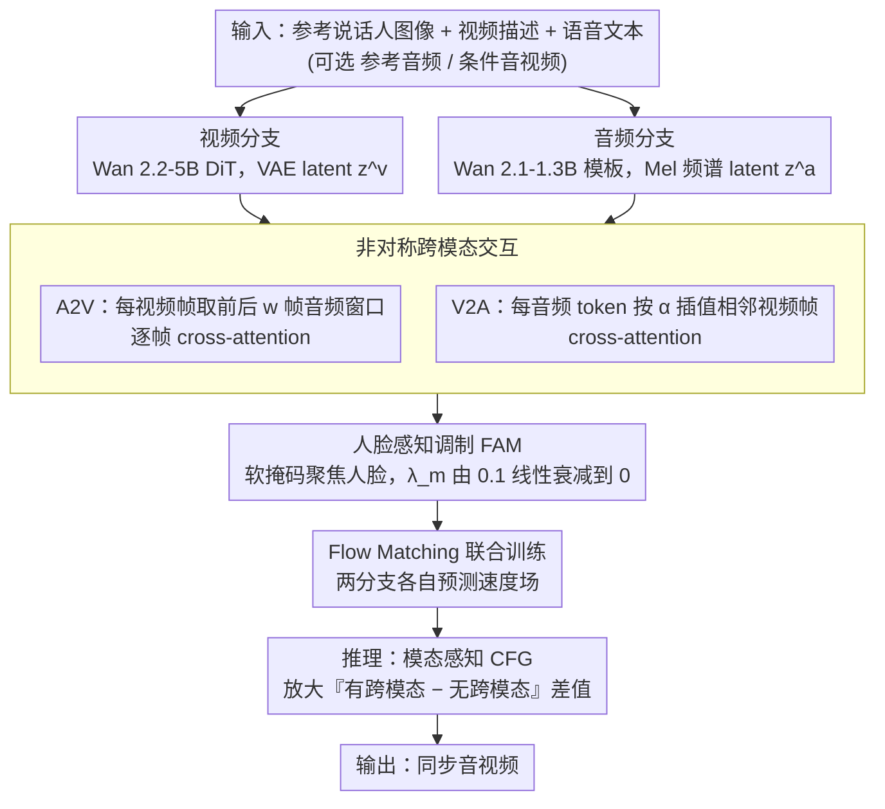

# UniAVGen: Unified Audio and Video Generation with Asymmetric Cross-Modal Interactions

**会议**: CVPR 2026  
**arXiv**: [2511.03334](https://arxiv.org/abs/2511.03334)  
**代码**: [https://mcg-nju.github.io/UniAVGen/](https://mcg-nju.github.io/UniAVGen/) (项目页)  
**领域**: 视频生成  
**关键词**: 音视频联合生成, 跨模态交互, 扩散模型, 唇音同步, 人脸感知调制

## 一句话总结
UniAVGen 提出了一个基于对称双分支 DiT 的音视频联合生成框架，通过**非对称跨模态交互机制**和**人脸感知调制模块**实现精确的时空同步，仅用 1.3M 训练样本就在唇音同步、音色一致性和情感一致性上全面超越使用 30M 数据的竞品。

## 研究背景与动机

1. **领域现状**：音视频联合生成是生成式 AI 的重要方向。商业系统（Veo3、Sora2、Wan2.5）已展现出色效果，但开源方法仍主要依赖解耦的两阶段管线——先生成无声视频再配音，或先生成音频再驱动视频合成。

2. **现有痛点**：两阶段方法的根本问题在于**模态解耦**——生成过程中音频和视频无法交互，导致语义一致性差、情感对齐弱、唇音同步不精确。现有的端到端联合生成方法（JavisDiT、UniVerse-1、Ovi）虽尝试解决该问题，但要么只支持环境声不支持人类语音，要么跨模态对齐效果有限。

3. **核心矛盾**：音频和视频在时间粒度、语义空间上存在天然的**不对称性**——视频的每个 latent 帧对应多个音频 token，反之亦然。现有方法忽略了这种不对称性，要么全局交互（收敛慢），要么对称时间对齐交互（上下文利用不足）。

4. **本文目标**（a）如何设计既收敛快又性能好的跨模态交互；（b）如何让交互聚焦在人脸等关键区域；（c）推理时如何增强跨模态关联信号。

5. **切入角度**：视频中的唇部运动受前后音素影响，而音频需要感知更精确的视频时间位置信息——两个方向的需求完全不同，应采用不对称设计。

6. **核心 idea**：用模态感知的非对称跨模态注意力 + 人脸感知软掩码 + 模态感知 CFG，在远少于竞品的训练数据上实现 SOTA 的音视频同步生成。

## 方法详解

### 整体框架
UniAVGen 采用**对称双分支联合合成架构**：视频分支使用 Wan 2.2-5B DiT 骨干，音频分支使用 Wan 2.1-1.3B 的架构模板（结构相同，仅通道数不同）。输入包括参考说话人图像、视频描述文本和语音文本内容，可选地接受参考音频和条件音视频。两个分支通过 Flow Matching 范式训练，各自预测速度场。

视频分支：视频以 16fps 处理，经 VAE 编码为 latent $z^v$，将参考图像和条件视频的 latent 拼接作为输入，文本通过 umT5 编码后经 cross-attention 注入。

音频分支：音频以 24kHz 采样后转为 Mel 频谱图作为 latent $z^a$，参考音频和条件音频同样拼接输入，语音文本通过 ConvNeXt blocks 提取特征后注入。

两个分支在每个交互层通过**非对称跨模态交互**互通信息，其中**人脸感知调制**把交互按到人脸区域；训练用 Flow Matching 各自预测速度场，推理时再用**模态感知 CFG** 放大跨模态信号。整体数据流如下：

### 关键设计

**1. 非对称跨模态交互：让音频和视频按各自的时间需求互相"看"对方**

两阶段方法最大的毛病是音视频在生成时完全不交互，而最直接的补救——让两个分支做全局 cross-attention——又收敛极慢。问题的根子在于：视频和音频对"时间上下文"的需求方向是相反的。一个视频帧的唇形不只取决于当下的音素，还受前后音素的协同发音影响，所以它需要的是一段**音频窗口**；而一个音频 token 要发得准，得知道自己落在视频时间轴上的**精确连续位置**，单看某一帧不够。UniAVGen 干脆把这两个方向拆成两个专用对齐器。A2V 方向给每个视频帧 $i$ 截取一个前后各 $w$ 帧的音频上下文窗口 $C_i^a$，再做逐帧 cross-attention，让视频"听"到周围的语义。V2A 方向则用时间邻域插值：每 $k$ 个音频 token 对应一个视频帧，对第 $j$ 个音频 token 算出它在相邻两视频帧之间的相对位置 $\alpha = (j \bmod k)/k$，按 $\alpha$ 对这两帧做加权插值得到平滑的视频上下文 $C_j^v$，再做 cross-attention。所有跨模态输出投影都零初始化，保证训练初期这条新通路不破坏两个分支各自已经具备的生成能力。举个直观的例子：若 $k=2$，第 5 个音频 token 落在第 2、3 视频帧之间、$\alpha=0.5$，它看到的就是这两帧各取一半的混合特征——既不会被生硬地对齐到某一帧，也不会被整段视频淹没。消融里这套非对称设计（ATI/ATI）在唇音同步上把全局交互的 3.46 拉到 4.09，差距来自"窗口 vs 插值"恰好匹配了两个方向的真实需求。

**2. 人脸感知调制（FAM）：早期把跨模态注意力按到人脸上，后期再松手**

即便方向对了，跨模态交互一上来在整帧上乱铺也会拖慢收敛——人体音视频真正的语义耦合几乎全集中在面部，背景的草木墙面对唇音同步毫无贡献。FAM 在每个交互层挂一个轻量掩码头：对视频特征 $H^{v_l}$ 做 LayerNorm + 仿射变换 + 线性投影 + Sigmoid，输出一张软掩码 $M^l \in (0,1)^{T \times N_v}$。A2V 方向用它做选择性更新 $H^{v_l} = H^{v_l} + M^l \odot \bar{H}^{v_l}$，V2A 方向用它放大显著区域往音频传的信息 $\hat{H}^{v_l} = M^l \odot \hat{H}^{v_l}$。这张掩码由 ground-truth 人脸 mask 监督，但监督权重 $\lambda^m$ 会从 0.1 线性衰减到 0：训练初期强约束让模型先把注意力锁死在脸上、快速学会唇音对齐；越往后约束越松，模型可以自行学到更灵活的交互范围（比如带上一点表情相关的颈部、肩部动作）。消融证实这一"先收紧后放开"比固定权重在音色（TC 0.725 vs 0.719）和情感一致性（EC 0.504 vs 0.497）上都更好，而完全不加监督则几乎等于没有 FAM。

**3. 模态感知 CFG（MA-CFG）：把无分类器引导从"放大文本"推广到"放大跨模态信号"**

传统 CFG 只在文本条件上做引导，对"音频该如何驱动视频、视频该如何反过来影响音频"这层依赖完全无能为力，于是生成结果常常情感平淡、动态偏弱。MA-CFG 的观察是：只要在一次前向里**抹掉跨模态交互的条件信号**，模型就退化成各自独立的单模态推理，得到 $u_{\theta_v}$ 和 $u_{\theta_a}$；再拿带跨模态交互的完整估计 $u_{\theta_{a,v}}$ 与之相减，就分离出"跨模态那一项"并放大它：

$$\hat{u}_v = u_{\theta_v} + s_v\,(u_{\theta_{a,v}} - u_{\theta_v})$$

音频侧同理。这等于把 CFG 里"有条件 − 无条件"的差值，替换成"有跨模态 − 无跨模态"的差值，引导强度 $s_v$ 越大、音视频之间的耦合就被推得越强，实测显著增强了情感强度和运动动态性，且不需要额外训练。

### 损失函数 / 训练策略

三阶段训练：Stage 1 仅训练音频分支（$\mathcal{L}^a$, 160k steps, batch=256）；Stage 2 联合训练两分支（$\mathcal{L}^{joint} = \mathcal{L}^v + \mathcal{L}^a + \lambda_m \mathcal{L}^m$, 30k steps, batch=32, lr=5e-6）；Stage 3 多任务学习（5种任务比例 4:1:1:2:2, 10k steps）。$\lambda_m$ 从 0.1 线性衰减至 0。

## 实验关键数据

### 主实验

| 方法 | 联合训练 | 训练样本 | PQ↑ | CU↑ | WER↓ | SC↑ | DD↑ | LS↑ | TC↑ | EC↑ |
|------|---------|---------|-----|-----|------|-----|-----|-----|-----|-----|
| OmniAvatar (两阶段) | ✗ | 21.1B | 8.15 | 7.41 | 0.152 | 0.987 | 0.000 | 6.34 | 0.454 | 0.349 |
| Ovi (联合) | ✓ | 30.7M | 6.03 | 6.01 | 0.216 | 0.972 | 0.360 | 6.48 | 0.828 | 0.558 |
| **UniAVGen** | ✓ | **1.3M** | **7.00** | **6.62** | **0.151** | 0.973 | **0.410** | 5.95 | **0.832** | **0.573** |

UniAVGen 用 23 倍少的数据超越 Ovi（30.7M vs 1.3M），在音频质量和音视频一致性上全面领先。

### 消融实验

| 交互设计 (A2V / V2A) | LS↑ | TC↑ | EC↑ |
|----------------------|-----|-----|-----|
| SGI / SGI (全局) | 3.46 | 0.667 | 0.459 |
| STI / STI (对称时间) | 3.73 | 0.685 | 0.472 |
| **ATI / ATI (非对称)** | **4.09** | **0.725** | **0.504** |

| FAM 配置 | LS↑ | TC↑ | EC↑ |
|----------|-----|-----|-----|
| 无 FAM | 3.89 | 0.705 | 0.489 |
| 无监督 FAM | 3.92 | 0.701 | 0.492 |
| 固定 $\lambda_m$ | 4.11 | 0.719 | 0.497 |
| **衰减 $\lambda_m$** | **4.09** | **0.725** | **0.504** |

### 关键发现
- **非对称交互贡献最大**：ATI 在所有指标上显著优于 SGI 和 STI，验证了模态专用设计的必要性
- **FAM 的监督信号很重要**：有监督 FAM 比无监督大幅提升一致性，说明约束掩码到人脸区域有效加速训练收敛
- **衰减策略优于固定权重**：逐步放松约束让模型学习更灵活的交互，TC 和 EC 进一步提升
- **多任务训练增强联合生成**：先联合训练再多任务（JFML）效果最好，多任务从一开始训练（MTO）收敛更慢
- 在 OOD 动漫图像上，UniAVGen 展现出强泛化能力，而 Ovi 唇部运动失败、UniVerse-1 几乎静止

## 亮点与洞察
- **非对称设计巧妙精准**：A2V 用窗口上下文考虑前后音素影响、V2A 用时间插值感知连续视频位置，完美匹配了两个方向的不同需求
- **FAM 的渐进放松策略**：用衰减的监督信号初期约束后期释放，是一种兼顾训练效率和模型灵活性的优雅方案，可迁移到其他需要区域聚焦的多模态任务
- **MA-CFG 将 CFG 推广到跨模态**：思路简洁（用单模态推理作为无条件基线），但效果显著，可直接应用于任何双模态生成系统

## 局限与展望
- 仅专注于**人体中心**的音视频生成，未覆盖通用场景（环境声、音乐等）
- 音频分支仅支持**英文语音**，多语言能力未验证
- 视频时长受限（训练数据据推测为短视频片段），长视频的一致性维持未探讨
- 评估中 TC 和 EC 使用 Gemini-2.5-Pro 打分，缺乏标准化的开源评测方法

## 相关工作与启发
- **vs Ovi**: 同为对称双塔架构，但 Ovi 使用对称全局交互缺乏模态专用设计，OOD 泛化差；UniAVGen 通过非对称交互和 FAM 在 23 倍少的数据上超越
- **vs UniVerse-1**: 拼接两个预训练模型，架构不对称导致拼接复杂性能有限；UniAVGen 从设计之初就统一架构
- **vs 两阶段方法**: 两阶段方法唇音同步好但动态性几乎为零（DD≈0），说明视频生成时完全不感知音频

## 评分
- 新颖性: ⭐⭐⭐⭐ 非对称交互和 FAM 衰减策略有新意，MA-CFG 是 CFG 的自然推广
- 实验充分度: ⭐⭐⭐⭐ 主实验+5组消融+多任务分析+OOD定性比较，但评测指标部分依赖闭源模型
- 写作质量: ⭐⭐⭐⭐⭐ 结构清晰、图表丰富、动机推导逻辑性强
- 价值: ⭐⭐⭐⭐ 开源音视频联合生成的 SOTA，数据效率极高，但限于人体场景

<!-- RELATED:START -->

## 相关论文

- [\[CVPR 2026\] UniTalking: A Unified Audio-Video Framework for Talking Portrait Generation](unitalking_a_unified_audio-video_framework_for_talking_portrait_generation.md)
- [\[ICLR 2026\] BindWeave: Subject-Consistent Video Generation via Cross-Modal Integration](../../ICLR2026/video_generation/bindweave_subject-consistent_video_generation_via_cross-modal_integration.md)
- [\[ICLR 2026\] JavisDiT++: Unified Modeling and Optimization for Joint Audio-Video Generation](../../ICLR2026/video_generation/javisdit_unified_modeling_and_optimization_for_joint_audio-video_generation.md)
- [\[ICML 2026\] T2AV-Compass: Towards Unified Evaluation for Text-to-Audio-Video Generation](../../ICML2026/video_generation/t2av-compass_towards_unified_evaluation_for_text-to-audio-video_generation.md)
- [\[CVPR 2026\] VGA-Bench: A Unified Benchmark for Video Aesthetics and Generation Quality Evaluation](vga_bench_unified_benchmark_for_video_aesthetics_and_generation_quality.md)

<!-- RELATED:END -->
