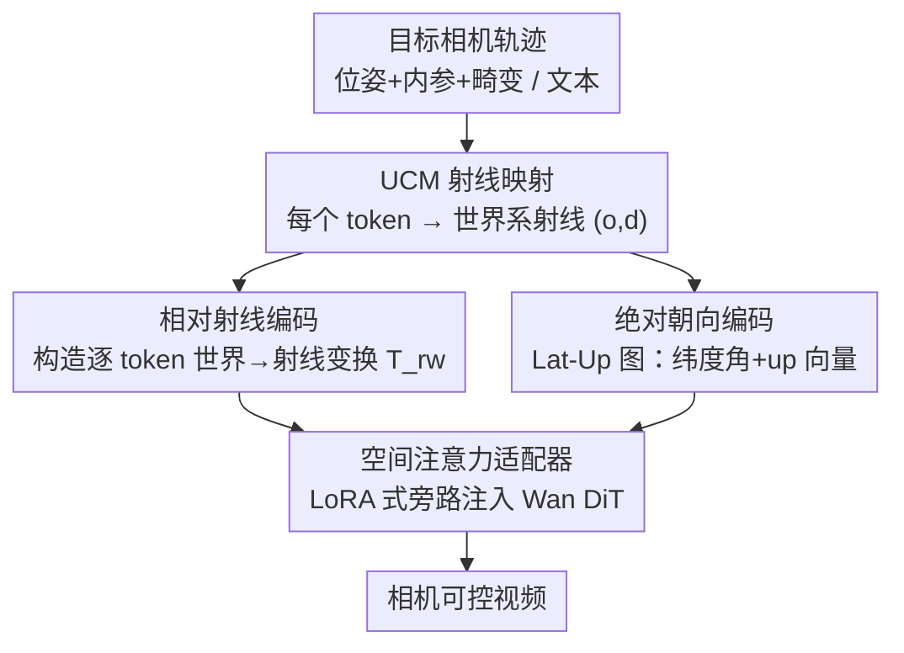

# Unified Camera Positional Encoding for Controlled Video Generation

**会议**: CVPR 2026  
**arXiv**: [2512.07237](https://arxiv.org/abs/2512.07237)  
**代码**: [https://github.com/chengzhag/UCPE](https://github.com/chengzhag/UCPE)  
**领域**: 视频生成  
**关键词**: 相机位置编码, 射线编码, 镜头畸变, 绝对朝向, 扩散 Transformer

## 一句话总结

本文提出 UCPE，把相机的完整几何（6-DoF 位姿 + 内参 + 镜头畸变）统一编码进 Transformer 注意力：用「相对射线编码」把位置编码从相机级降到射线级以兼容鱼眼/广角等非线性镜头，再用「绝对朝向编码」补上 pitch/roll 的全局参考，最后用一个 <1% 参数的空间注意力适配器注入预训练视频 DiT，在相机可控文生视频上同时刷新可控性与画质。

## 研究背景与动机

**领域现状**：相机可控视频生成（尤其文生视频）的核心是「怎么把相机几何喂给网络」。主流做法有两类——绝对编码把每帧相机的原始参数或 Plücker 射线（方向+力矩 6 维向量）直接拼进网络；相对编码（CaPE / GTA / PRoPE）则在注意力里注入相机两两之间的相对 SE(3) 变换，去掉对全局世界坐标系的依赖，提升多视角一致性。

**现有痛点**：几乎所有方法都建立在**针孔（pinhole）假设**上。绝对编码（Plücker）依赖预定义世界坐标系，跨场景泛化差；相对编码（PRoPE 用投影矩阵 $\mathbf{P}_i=\mathbf{K}_i\mathbf{T}^{\text{cw}}_i$ 把内参也编进去）虽更完整，但仍只能描述线性针孔投影，无法表达自动驾驶/全景/机器人里大量用到的鱼眼、折反射、等距柱状这类强畸变非线性镜头。此外文生视频里相机位姿都是相对第一帧定义的，pitch 和 roll 这两个自由度无法唯一确定，导致**初始视角的绝对朝向不可指定、不可复现**。

**核心矛盾**：相机级编码假设「同一张图所有 token 共享一个线性投影函数」，把整张图当成刚体——这在针孔下成立，但真实镜头的投影几何是**逐像素空间变化**的（畸变、超广角 FoV），相机级编码天然表达不了这种 intra-camera 差异。

**本文目标**：(1) 设计一种与相机模型无关、能统一位姿+内参+畸变的几何一致表示；(2) 在文生视频里补回绝对 pitch/roll 控制；(3) 以极小代价注入预训练视频扩散模型而不破坏其先验。

**切入角度**：任何相机（不管什么投影类型）本质都是一个「像素 → 三维射线」的映射 $\Phi_\psi:(u,v)\mapsto(\mathbf{o}^{\text{cam}}_{u,v},\mathbf{d}^{\text{cam}}_{u,v})$。既然射线是所有镜头的公共语言，那就别在相机层面做相对变换，而是**下沉到射线层面**——让每个 token 对应它自己那条观察射线。

**核心 idea**：用「相对射线编码」代替「相对相机编码」，把注意力的几何推理从相机坐标系搬到逐 token 的局部射线坐标系，从而天然兼容任意镜头；再用重力对齐的 Lat-Up 图补上绝对朝向。

## 方法详解

### 整体框架

UCPE 解决的是「如何把完整相机几何注入预训练视频 DiT 并实现细粒度可控生成」。整条管线是：给定目标相机轨迹（位姿+内参+畸变）和文本，先把每个 latent token 通过统一相机模型 UCM 转成一条世界系射线 $(\mathbf{o}_t,\mathbf{d}_t)$；这条射线一路喂给两个互补的编码分支——**相对射线编码**构造逐 token 的世界→射线变换 $\mathbf{T}^{\text{rw}}_t$ 用于注意力级的几何变换（管相对几何与镜头畸变），**绝对朝向编码**算出 Lat-Up 图（管 pitch/roll 全局朝向）；两者由**空间注意力适配器**以一个 LoRA 式旁路并行接在 Wan DiT 的自注意力上，把相机条件注入而不动预训练主干，最后零初始化线性层融回。整个适配器只加 <1% 可训练参数。

### 关键设计

**1. 相对射线编码（Relative Ray Encoding）：把位置编码从相机级降到射线级，兼容任意非线性镜头**

针对「相机级编码把整图当刚体、表达不了逐像素畸变」的痛点。作者不再为整张图共享一个投影变换，而是为**每个 token $t$ 单独构造**一个局部射线坐标系。具体地，把该 token 的世界系射线方向 $\mathbf{d}_t$ 取作局部 $z$ 轴，再借相机的向下方向 $\mathbf{y}^{\text{cam}}_{i(t)}$ 叉乘补出正交基：

$$\bm{z}_t=\bm{d}_t,\quad \bm{x}_t=\bm{y}^{\text{cam}}_{i(t)}\times\bm{z}_t,\quad \bm{y}_t=\bm{z}_t\times\bm{x}_t.$$

正交基 $\mathbf{R}^{\text{wr}}_t=[\mathbf{x}_t,\mathbf{y}_t,\mathbf{z}_t]$ 加上平移 $\mathbf{t}^{\text{wr}}_t=\mathbf{o}_t$ 组成「射线→世界」变换 $\mathbf{T}^{\text{wr}}_t$，取逆得到 $\mathbf{T}^{\text{rw}}_t=(\mathbf{T}^{\text{wr}}_t)^{-1}$ 作为注意力级的几何算子。在注意力里，按 GTA 式同时变换 Q/K/V：$O=\mathbf{D}\odot\text{Attn}(\mathbf{D}^\top\odot Q,\mathbf{D}^{-1}\odot K,\mathbf{D}^{-1}\odot V)$，其中 $\mathbf{D}^{\text{Ray}}_t=\mathbf{I}_{d/8}\otimes\mathbf{T}^{\text{rw}}_t$。和 PRoPE 用 $\mathbf{P}_i=\mathbf{K}_i\mathbf{T}^{\text{cw}}_i$ 把整个相机视锥编进去的相机级做法不同，这里每个 token 携带的是它自己那条射线的几何——因为射线是 UCM 直接从畸变镜头模型里采出来的，非线性投影、超广角 FoV 这些空间变化的几何被天然包含进去，注意力得以**在射线空间而非相机框架里**做几何一致推理。

**2. 绝对朝向编码（Absolute Orientation Encoding）：用重力对齐的 Lat-Up 图补回 pitch/roll 全局参考**

针对「文生视频相机相对第一帧定义、pitch/roll 不可唯一确定」的痛点。相对射线编码只管相机间的相对几何，没有任何绝对朝向概念。作者注意到真实视频几乎都在重力对齐的「向上」方向下拍摄，于是引入 latitude-up 图（Lat-Up map）把全局朝向锚到重力上方向。纬度图编码每条射线相对水平面的仰角：

$$\text{Lat}_t=\arctan 2\big(-d_{t,y},\,\sqrt{d_{t,x}^2+d_{t,z}^2}\big),$$

正值对应向上看的射线。Up 图则把世界系射线 $\mathbf{d}_t$ 绕局部轴 $\bm{k}_t=\bm{d}_t\times\bm{u}^{\text{wld}}$ 旋转一个小角 $\delta$ 后投回图像平面，用归一化像素位移 $\text{Up}_t=[\Delta u_t,\Delta v_t]/\|[\Delta u_t,\Delta v_t]\|$ 表示向上方向。最终 $[\text{Lat}_t,\text{Up}_t]$ 给每个 token 提供全局朝向上下文——它通过天空/地面分割、物体竖直对齐这类外观线索来捕捉相机旋转，对广角镜头还自带一些畸变感知，从而让 pitch 和 roll 可被显式、可复现地控制。

**3. 空间注意力适配器（Spatial Attention Adapter）：LoRA 式旁路注入，<1% 参数且不破坏预训练先验**

针对「直接替换 Wan 原有 3D RoPE 会扰乱大规模预训练先验」的痛点。作者不动原自注意力，而是并行挂一个相机条件分支 $\text{UCPEAttn}(\cdot)$。编码上做 hybrid：把相对射线编码和 RoPE 拼成块对角算子 $\mathbf{D}^{\text{UCPE}}_t=\text{blkdiag}(\mathbf{D}^{\text{Ray}}_t,\mathbf{D}^{\text{RoPE}}_t)$，各占一半特征维度，同时兼顾射线空间与图像空间推理；Lat-Up 特征则经线性层投到 token 维后作为 bias 加进去。参数上，用 $\mathcal{P}_Q,\mathcal{P}_K,\mathcal{P}_V$ 把输入 token 投影到原维度的 $1/C$、并按比例减少注意力头数，正得益于 UCPE 的几何先验强，旁路只需很少参数就能建模相机相关性；输出再经**零初始化**线性层映回，保证初始化时预训练模型完全不被改动。最终适配器只加 35.5M 可训练参数（不到主干 1%），却比 354M 的 ReCamMaster 还省 90% 参数。

### 损失函数 / 训练策略

基座为 Wan 视频 Diffusion Transformer，沿标准扩散去噪目标在自建数据集上微调，仅训练适配器分支（主干冻结，零初始化保证起点等价于原模型）。对比基线 Wan CameraCtrl 因全参数优化用更小学习率 $1\mathrm{e}{-5}$；UCPE 默认配置为 $1/8$-dim 压缩（192×1，35.6M 参数），在可控性与画质间最平衡。

## 实验关键数据

### 主实验

自建数据集（约 48k 段，从野外 360° 视频用 UCM 渲染，随机化 xFoV 与畸变 ξ，覆盖针孔/广角/鱼眼）上的定量对比：

| 设置 | 方法 | 参数 | FoV(°)↓ | k1↓ | RotErr(°)↓ | TransErr↓ | CamMC↓ | FVD↓ |
|------|------|------|---------|------|-----------|----------|--------|------|
| w/o 绝对朝向 | ReCamMaster | 354M | 10.25 | 0.210 | 10.89 | 31.44 | 37.38 | 555.5 |
| w/o 绝对朝向 | Wan CameraCtrl | 1.5B | 10.05 | 0.222 | 17.04 | 35.09 | 46.10 | 593.1 |
| w/o 绝对朝向 | **UCPE** | **35.5M** | **9.62** | **0.174** | **4.29** | **13.46** | **15.94** | 569.3 |
| w/ 绝对朝向 | ReCamMaster | 354M | 10.04 | 0.183 | 9.23 | 28.95 | 33.88 | 605.8 |
| w/ 绝对朝向 | **UCPE** | **35.6M** | **8.22** | **0.129** | **4.12** | **15.21** | **17.59** | **495.1** |

相对位姿控制是最大亮点：RotErr/TransErr/CamMC 三项相比次优基线**减半甚至更低**（RotErr 4.29 vs 10.89，约 2.5×；CamMC 15.94 vs 37.38），且参数比 ReCamMaster 少 90%、比 Wan CameraCtrl 少约 40×。镜头与朝向控制同样全面领先。

绝对朝向控制（w/ 绝对朝向设置）：

| 方法 | Pitch(°)↓ | Roll(°)↓ |
|------|-----------|----------|
| ReCamMaster | 6.62 | 5.29 |
| Wan CameraCtrl | 6.25 | 6.01 |
| **UCPE** | **4.35** | **3.74** |

RealEstate10K（100 段、固定 100° 针孔、零微调跨域）：UCPE 在不针对该集训练的情况下取得最低的旋转/平移/运动误差，Q-Align 用户感知质量甚至高于在 RealEstate10K 上训练过的 CameraCtrl 与 AC3D，验证了射线统一表示的跨域泛化。

### 消融实验

| 配置 | 参数 | FoV(°)↓ | Pitch(°)↓ | RotErr(°)↓ | FVD↓ | 说明 |
|------|------|---------|-----------|-----------|------|------|
| 1/2-dim (128×6) | 141M | 8.39 | 4.11 | 3.69 | 534.4 | 压缩最弱、参数最多 |
| 1/4-dim (128×3) | 71.0M | 8.47 | 3.94 | 3.43 | 512.9 | RotErr 最低 |
| **1/8-dim (192×1)** | **35.6M** | **8.22** | 4.35 | 4.12 | 495.1 | 默认，控制/画质最平衡 |
| 1/12-dim (128×1) | 23.8M | 8.96 | 3.91 | 5.13 | 487.5 | 压缩过头，RotErr 变差 |
| Pre-Attn | 35.6M | 8.47 | 4.26 | 4.03 | 502.7 | 注意力前注入，逊于 in-attn |
| Post-Attn | 35.6M | 8.91 | 3.95 | 4.68 | 515.3 | 注意力后注入，更差 |
| PRoPE | 35.6M | 8.84 | 4.18 | 5.35 | 516.6 | 用 PRoPE 代替射线编码 |
| GTA | 35.6M | 8.80 | 4.21 | 5.27 | 497.2 | 用 GTA 代替射线编码 |

### 关键发现

- **相对射线编码是控制精度的主来源**：在同等 35.6M 参数下，把它换成相机级的 PRoPE/GTA，RotErr 从 4.12 涨到 5.35/5.27、FoV 与畸变误差也变差——说明射线级几何推理对镜头与位姿控制确实更有效。
- **注入位置很关键**：in-attention（默认）显著优于 Pre-Attn / Post-Attn，把几何算子作用在 Q/K/V 内部比在注意力外做加法更能传递相机条件。
- **压缩比存在甜点**：1/8-dim 在仅 35.6M 参数下取得控制与画质的最佳平衡；压到 1/12-dim（23.8M）虽 FVD 更低但 RotErr 明显恶化（5.13），说明旁路容量不能无限砍。
- **绝对朝向编码同时提升画质**：w/ 绝对朝向设置下 UCPE 的 FVD 从 569.3 降到 495.1，说明重力对齐的全局参考不仅让 pitch/roll 可控，也减轻了朝向歧义带来的生成退化。

## 亮点与洞察

- **「射线是所有镜头的公共语言」这个视角很漂亮**：把位置编码从相机级下沉到射线级，一举把鱼眼/广角/折反射等非线性镜头纳入同一框架，而以前的相对编码（PRoPE）被针孔假设卡死。这是把 3D 几何先验注入注意力的更彻底做法。
- **几何先验强 → 参数可以极省**：因为 $\mathbf{T}^{\text{rw}}_t$ 已经把相机几何「算好」喂给注意力，旁路适配器只需 35.5M（<1%）就能拿到 SOTA 控制，比 1.5B 的 Wan CameraCtrl 省约 40×。这印证了「把可解析的几何外置、网络只学残差」的效率优势。
- **重力对齐补绝对朝向是个被忽视但实用的点**：文生视频长期只有相对第一帧的位姿，pitch/roll 不可复现；用 Lat-Up 图借天空/地面线索锚定全局上方向，几乎零成本地补回了可复现的绝对朝向控制。
- **可迁移性**：相对射线编码 + 注意力级几何算子的范式不止用于视频生成，作者明确指向多视角合成、3D 重建、世界模型等任意需要相机几何的 Transformer 任务——它本质是一种通用相机表示。

## 局限与展望

- **依赖统一相机模型 UCM 与已知内参/畸变**：射线由 UCM 解析采出，意味着训练/推理都需较准确的相机标定参数；对内参未知或标定误差大的真实场景，射线构造的可靠性存疑。
- **非中心相机仅作记号化处理**：推导默认中心相机（所有射线共原点），折反射/全景等非中心系统虽提到逐像素原点，但正文未给出充分实验，泛化到真正非中心镜头还需验证。
- **数据集为合成**：48k 段由 360° 视频经 UCM 渲染随机化 FoV/畸变而来，真实鱼眼/广角拍摄的域差异（噪声、运动模糊、真实畸变分布）未充分覆盖。
- **画质指标并非全面领先**：UCPE 在 FVD/FID 上有时不是最低（如 w/o 绝对朝向下 FVD 569.3 略高于 ReCamMaster 555.5），控制精度的大幅提升主要体现在位姿/镜头/朝向，纯保真度上仍与基座相当而非碾压。

## 相关工作与启发

- **vs Plücker 编码（CameraCtrl / AC3D）**: 它们把每条射线表示为方向+力矩的绝对 6 维向量注入网络，物理可解释但依赖预定义世界坐标系、跨场景泛化差且只建模针孔；UCPE 改成相对射线变换、去掉全局坐标依赖并兼容非线性镜头。
- **vs PRoPE / GTA（相对相机编码）**: 它们在注意力里注入相对 SE(3)/投影变换提升多视角一致性，但停留在相机级、被针孔投影限制；UCPE 把同样的注意力级几何算子从相机级细化到逐 token 射线级，消融显示这直接带来更低的位姿与镜头误差。
- **vs ReCamMaster（直接注入外参）**: 它把 [R,t] 甚至 FoV/ξ 拼进扩散模型，但本质仍是相机级参数条件、参数量大（354M）；UCPE 用几何一致的射线表示，以 1/10 参数取得更优的相对位姿控制。

## 评分

- 新颖性: ⭐⭐⭐⭐⭐ 把位置编码从相机级下沉到射线级、统一位姿+内参+畸变，是相机条件生成里少见的彻底几何视角。
- 实验充分度: ⭐⭐⭐⭐ 主结果+跨域+消融（压缩比/注入位置/编码替换）较完整，但真实镜头与非中心相机验证偏弱。
- 写作质量: ⭐⭐⭐⭐ 几何推导清晰、图 2 对四类编码的对比很到位，公式与动机衔接顺畅。
- 价值: ⭐⭐⭐⭐⭐ <1% 参数即插即用、且自我定位为通用相机表示，对多视角/3D/世界模型有外溢价值。

<!-- RELATED:START -->

## 相关论文

- [\[CVPR 2026\] TV2TV: A Unified Framework for Interleaved Language and Video Generation](tv2tv_a_unified_framework_for_interleaved_language_and_video_generation.md)
- [\[CVPR 2026\] Yume1.5: A Text-Controlled Interactive World Generation Model](yume15_a_text-controlled_interactive_world_generation_model.md)
- [\[CVPR 2026\] TGT: Text-Grounded Trajectories for Locally Controlled Video Generation](tgt_text-grounded_trajectories_for_locally_controlled_video_generation.md)
- [\[CVPR 2026\] UnityVideo: Unified Multi-Modal Multi-Task Learning for Enhancing World-Aware Video Generation](unityvideo_unified_multi-modal_multi-task_learning_for_enhancing_world-aware_vid.md)
- [\[ICCV 2025\] ReCamMaster: Camera-Controlled Generative Rendering from A Single Video](../../ICCV2025/video_generation/recammaster_camera-controlled_generative_rendering_from_a_single_video.md)

<!-- RELATED:END -->
