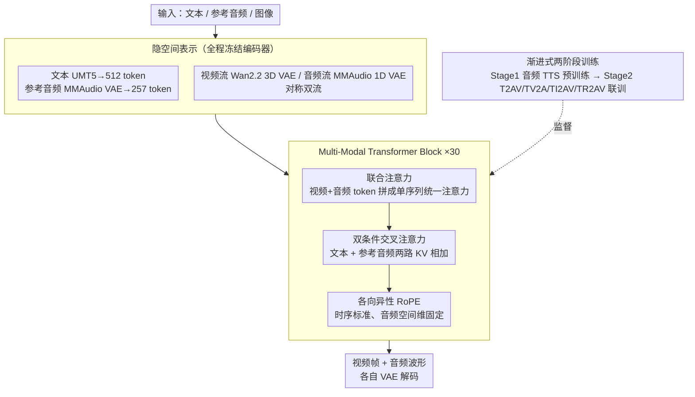

# UniTalking: A Unified Audio-Video Framework for Talking Portrait Generation

**会议**: CVPR 2026 Findings  
**arXiv**: [2603.01418](https://arxiv.org/abs/2603.01418)  
**代码**: 无  
**领域**: 视频生成  
**关键词**: 说话人生成, 音视频联合生成, 扩散Transformer, 唇音同步, 语音克隆

## 一句话总结
提出 UniTalking，一个基于 MM-DiT 的端到端说话人肖像生成框架，通过双流对称架构中的联合注意力机制显式建模音视频 token 的细粒度时序对应关系，实现 SOTA 的唇音同步精度，同时支持个性化语音克隆。

## 研究背景与动机
说话人肖像生成（Talking Portrait Generation）要求同时生成视觉上逼真、唇型精确同步的视频和自然语音——真实世界中音视频是同步的、不可分割的感知整体。

**核心矛盾**：

**闭源 vs 开源**：Veo3、Sora2 等闭源模型已展示惊人的音视频一致性，但架构和训练方法完全不可访问，学术界无法复现

**级联 vs 端到端**：开源方法分两类——级联方法（先生成音频再驱动视频）存在时序错位和误差累积；端到端方法目前主要解决 Foley 音效同步（如浪花声），对语音级别的精确唇音同步远远不够

**现有端到端方法的问题**：
- JavisDiT：双分支 DiT + 双向交叉注意力，但音视频分支的交互深度不足
- Universe-1：拼接预训练单模态模型，但不同模型间的对齐不够精细
- OVI/OmniTalker：双流+专用融合块，但未针对说话人场景优化

**本文切入角度**：设计对称双流架构（视频流继承 Wan2.2 预训练权重，音频流作为"同卵双胞胎"），核心创新在 Multi-Modal Transformer Block 中用联合注意力直接建模音视频 token 的时序对应，并通过多任务训练策略（T2AV + TV2A + TI2AV + TR2AV）从多个角度约束音视频对齐。

## 方法详解

### 整体框架
UniTalking 想解决的是端到端、语音级别精确同步的说话人肖像生成：不再先生成音频再驱动画面，而是让视频和语音在一个模型里同时长出来。它整体是一个 10B 参数的 MM-DiT，用连续归一化流（Flow Matching）训练、CFG 引导推理。最关键的结构选择是把视频和音频做成一对**对称的双流**——视频流直接继承 Wan2.2-5B 的架构与预训练权重，音频流被设计成视频流的"同卵双胞胎"：层数、维度、模块完全对称，只是参数随机初始化。运行时，文本、参考音频、图像等条件先各自编码成隐 token，再和视频、音频两路主流 token 一起送进 N=30 个 MM-DiT Block（dim=3072，24 个注意力头）逐层处理，最后由各自的 VAE 解码回视频帧和音频波形。

### 关键设计

**1. 隐空间表示：把音视频和条件都压到同一套冻结编码器给出的语义隐空间里**

要在一个模型里联合生成两种模态，前提是它们各自有稳定、语义丰富的隐空间表示。视频走 Wan2.2 的 3D causal VAE，做 16×16×4 的时空压缩；音频走 MMAudio 的 1D VAE，把梅尔频谱压成隐 token，推理时再解码回梅尔频谱、过 BigVGAN vocoder 合成 44.1kHz 波形。条件侧，文本由 UMT5 编码成固定 512 token，参考音频由 MMAudio VAE 编码成固定 257 token。所有编码器全程冻结，既省训练成本，也保证两路主流面对的是稳定一致的隐空间，融合时不会被编码器漂移干扰。

**2. Multi-Modal Transformer Block：让音视频 token 在每个 Block 内部直接"看见"对方，而不是隔着 KV 投影遥相呼应**

这是全文的核心创新，针对的是 JavisDiT、OVI 这类双流方法交互深度不够的痛点——它们多用交叉注意力，音视频之间只能间接对齐。UniTalking 在每个 DiT Block 里做了三处改动。其一是**联合注意力（Joint Attention）**：把视频和音频隐 token 拼接成一条长序列后做**单一**注意力操作，于是模态内依赖和模态间依赖在同一个注意力矩阵里被同时学习，音视频 token 直接交互，而非经各自 KV 投影间接关联。其二是**双条件交叉注意力**：在原有文本条件之外再加一组参考音频的 KV 投影，主流 token 分别去注意文本条件和参考音频条件，两路输出逐元素相加，从而让生成同时忠实于文本语义和参考音频的音色风格。其三是**各向异性 RoPE**：时序轴用标准 RoPE，而音频 token 的空间维度改用固定位置的 RoPE，目的是把模型的注意力"逼"向时序动态、削弱空间维度的干扰，进一步强化音视频在时间轴上的逐帧对齐。

**3. 渐进式两阶段训练：先单独把随机初始化的音频分支喂饱，再全模型多任务联调**

双流虽然对称，初始化却严重不平衡——视频分支带着 Wan2.2 的强预训练权重，音频分支却是从零开始，直接全模型联训会让音频拖后腿。于是训练分两步走。Stage 1 是音频分支的 TTS 预训练：只训练音频相关参数（音频输入投影、音频分支的 FFN 和注意力投影），冻结全部视频/文本分支，Batch 256、LR $1\times10^{-5}$、100K 步，同时训练有参考音频和无参考音频两种 TTS 任务；作者发现仅微调这一小撮参数就足以生成高质量语音。Stage 2 才放开全模型端到端联训，Batch 64、LR $1\times10^{-5}$、100K 步，四个任务轮替施加多面约束：T2AV（文本→音视频）是核心联合生成任务、建立粗粒度对齐；TV2A（视频→音频）加注意力掩码挡住音频对视频分支的影响，提供严格的单向时序监督，迫使音频分支学逐帧的 viseme→phoneme 映射——这是**最关键的唇音同步训练信号**；TI2AV（图像+文本→音视频）支持身份保持的个性化生成；TR2AV（参考音频+文本→音视频）支持语音风格克隆。四任务轮替形成多角度约束，堵住模型走"只对粗粒度、放弃精确同步"这类捷径的可能。

### 损失函数 / 训练策略
- Flow Matching 条件流匹配目标：$\mathcal{L}_{CFM} = \mathbb{E}[\|v_\theta(x_t, t) - (x_1 - x_0)\|^2]$
- 纯音频任务：$L_{total} = L_{CFM}^a$
- 联合任务：$L_{total} = L_{CFM}^a + L_{CFM}^v$
- CFG guidance scale $\omega > 1$ 控制条件强度，条件包括 $c_{text}$, $c_{image}$, $c_{audio}$ 的组合
- AdamW，$\beta_1=0.9, \beta_2=0.999$，bf16 精度，FSDP 并行

### 数据准备
- 从 OpenHumanVid + 内部数据出发，经三阶段过滤（视频→音频→音视频跨模态）
- 三级标注：详细视频+音频描述、简短视频+音频描述、融合音视频描述（Qwen3-Omni 生成）
- 参考音频生成：用 IndexTTS2 为每个视频合成 3 条参考音频
- 最终数据集：230 万对齐音视频样本

## 实验关键数据

### T2AV 联合生成 — 盲测偏好研究

| 维度 | UniTalking vs OVI | UniTalking vs Universe-1 |
|------|-------------------|-------------------------|
| 视频质量 | ~100%（持平） | 优势 |
| 音频质量 | 116% | 优势 |
| 音视频同步 | 107% | 优势 |

### 唇音同步客观评估

| 方法 | Sync-C↑ | Sync-D↓ |
|------|---------|---------|
| Universe-1 | 1.85 | 11.97 |
| OVI | 6.56 | 8.60 |
| Sora2 | 5.35 | 7.78 |
| **UniTalking** | **4.87** | **8.05** |

### 语音相似度（TR2AV）

| 方法 | 英语↑ | 中文↑ |
|------|-------|-------|
| ElevenLabs | 0.613 | 0.677 |
| MiniMax | 0.756 | 0.780 |
| Qwen3-Omni | 0.773 | 0.772 |
| **UniTalking** | **0.703** | **0.662** |

### TTS 评估

| 方法 | WER↓ |
|------|------|
| Fish Speech | 0.008 |
| F5-TTS | 0.018 |
| OVI-Aud | 0.035 |
| **UniTalking** | **0.038** |

### 关键发现
- 音频质量和音视频同步优于 OVI（分别 116% 和 107%），视频质量持平（两者都用 Wan2.2 预训练）
- Sync-D 8.05 接近闭源 Sora2（7.78），大幅优于 Universe-1（11.97）
- OVI 的 Sync-C 异常高（6.56），作者推测是因为 Sync-C 偏好嘴巴动作夸张的生成结果
- 语音克隆能力与 ElevenLabs 可比，但不及专用大模型（MiniMax、Qwen3-Omni）
- Stage 1 TTS 预训练被证明对最终音视频生成的音频质量至关重要——跳过会导致显著退化
- 注意力可视化证实了学到的跨模态关联：音频→视频注意力聚焦面部和身体，视频→音频注意力**仅聚焦唇部**

## 亮点与洞察
- **对称双流设计**直觉优雅：音频流作为视频流的"同卵双胞胎"，利用架构对称性促进隐空间融合
- **TV2A 任务**对唇音同步的贡献是核心洞察——通过单向监督迫使音频分支学习精确的 viseme→phoneme 映射
- **Joint attention**（拼接后统一注意力）vs 交叉注意力的设计选择值得关注——前者允许更直接的模态间信息流
- 注意力可视化（音频关注面部，视频的音频注意力仅关注唇部）提供了模型确实学会了有意义对齐的强证据

## 局限与展望
- 受训练资源和数据规模限制，与闭源模型仍有差距
- 不支持多人参考生成（如 Sora2 的 "Cameo" 功能）
- 语音克隆能力弱于专用语音模型（MiniMax、Qwen3-Omni），可能因为联合训练分散了音频分支的容量
- 10B 参数的推理成本较高，实时部署需要优化
- 注意力图中存在部分不匹配的高亮区域，推测源于训练策略或数据噪声

## 相关工作与启发
- Hallo3、HunyuanVideo-Avatar：音频驱动视频生成（单向），UniTalking 做联合生成
- MMAudio：V2A 中的 MM-DiT 方案，本文将其扩展到说话人场景
- OVI：最直接的竞争者，也是双流架构，但用交叉注意力而非联合注意力
- 启发：在联合生成中，TV2A（视频到音频）任务作为辅助训练目标的价值被低估

## 评分
- 新颖性: ⭐⭐⭐⭐ Joint attention + 对称双流架构 + 多任务约束策略的组合有明确技术贡献
- 实验充分度: ⭐⭐⭐⭐ 盲测+客观指标+消融+注意力可视化，全面；与 Sora2 的对比增加说服力
- 写作质量: ⭐⭐⭐⭐ 技术描述清晰、数据管线和训练策略的document很完整
- 价值: ⭐⭐⭐⭐⭐ 开源统一音视频生成的重要里程碑，缩小了与闭源模型的差距

<!-- RELATED:START -->

## 相关论文

- [\[CVPR 2026\] UniAVGen: Unified Audio and Video Generation with Asymmetric Cross-Modal Interactions](uniavgen_unified_audio_and_video_generation_with_asymmetric_cross-modal_interact.md)
- [\[CVPR 2026\] THEval: Evaluation Framework for Talking Head Video Generation](theval_evaluation_framework_for_talking_head_video_generation.md)
- [\[CVPR 2026\] TV2TV: A Unified Framework for Interleaved Language and Video Generation](tv2tv_a_unified_framework_for_interleaved_language_and_video_generation.md)
- [\[CVPR 2026\] DreamStyle: A Unified Framework for Video Stylization](dreamstyle_a_unified_framework_for_video_stylization.md)
- [\[CVPR 2026\] Real-Time Generation of Streamable Talking Portrait Video with Reference-Guided Deep Compression VAEs](real-time_generation_of_streamable_talking_portrait_video_with_reference-guided_.md)

<!-- RELATED:END -->
