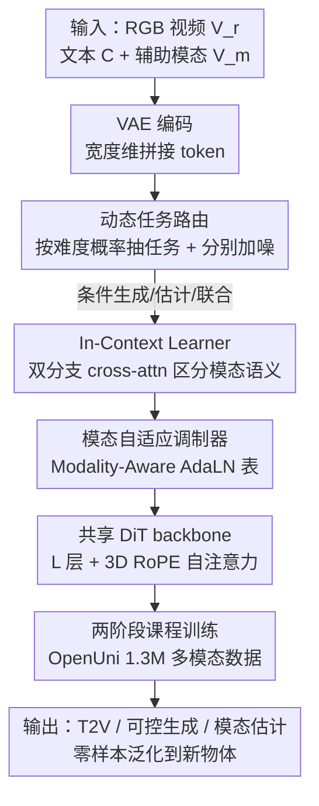

# UnityVideo: Unified Multi-Modal Multi-Task Learning for Enhancing World-Aware Video Generation

**会议**: CVPR 2026  
**论文**: [CVF Open Access](https://openaccess.thecvf.com/content/CVPR2026/html/Huang_UnityVideo_Unified_Multi-Modal_Multi-Task_Learning_for_Enhancing_World-Aware_Video_Generation_CVPR_2026_paper.html)  
**代码**: https://github.com/JIA-Lab-research/UnityVideo （项目页 https://jackailab.github.io/Projects/UnityVideo）  
**领域**: 视频生成  
**关键词**: 统一多模态、多任务联合训练、视频生成、世界感知、扩散 Transformer

## 一句话总结
UnityVideo 把"文生视频 / 可控生成 / 模态估计"三类任务和"深度、光流、DensePose、骨架、分割"五种辅助模态全部塞进一个 10B 的扩散 Transformer，靠动态噪声调度统一任务、靠 Modality-Aware AdaLN 表 + In-Context Learner 统一模态，在 1.3M 多模态数据上联合训练后既加速收敛又显著提升零样本泛化，多任务上同时打过或追平各自的专用 SOTA。

## 研究背景与动机

**领域现状**：大语言模型靠把自然语言、代码、数学公式等"文本子模态"塞进同一套训练范式，换来了强泛化和涌现式推理。视频生成这边虽然也在猛涨规模，但绝大多数模型只在 RGB 视频上 scaling——这就好比只用纯文本去训 LLM，丢掉了深度、光流、分割这些天然能描述物理世界的"视觉子模态"。

**现有痛点**：已有工作确实发现给视频生成加一路辅助信号（深度图、光流、骨架、分割掩码）有好处，但大多是**单向交互**：要么拿辅助模态去条件控制 RGB 生成（可控合成），要么从 RGB 反推出某个辅助模态（逆向估计）。少数双向框架也往往只耦合一两种模态、绑死在某个固定架构上，没有把多模态 + 多任务真正"拧成一股"。

**核心矛盾**：单模态/单任务训练会逼着模型去**拟合分布而不是推理物理规律**。而不同模态恰恰互补——实例分割区分类别、DensePose 区分身体部位、骨架编码细粒度运动。问题在于：用同一套共享参数同时吃多种异构模态、同时做多种训练目标，模型根本分不清"现在该按哪种分布去生成、这堆 token 是哪种模态"，naive 地混训只会收敛慢、互相打架。

**本文目标**：在**单一架构**里同时支持三种训练范式（条件生成、模态估计、联合生成）和五种模态，并且要让它们互相增益、加速收敛、涌现出零样本泛化，而不是彼此干扰。

**切入角度**：作者把 LLM 的"统一文本子模态"类比迁移过来——既然统一文本能让 LLM 涌现推理，那统一视觉子模态也应该能强化模型的世界感知。关键是要给"任务"和"模态"各设计一套显式的区分机制，让共享参数知道当前在干什么。

**核心 idea**：用**动态噪声调度统一任务** + **模态自适应调制（AdaLN 表 + In-Context Learner）统一模态**，在一个 DiT 里把多任务多模态联合优化，让跨任务跨模态的知识相互迁移。

## 方法详解

### 整体框架
UnityVideo 的输入是 RGB 视频 $V_r$、文本条件 $C$、辅助模态视频 $V_m$（深度/光流/DensePose/骨架/分割之一），全部经 VAE 编码成 token，沿宽度维度拼接后送进共享的 DiT backbone $u(\cdot)$，通过自注意力交互。整套设计要回答两个"怎么统一"：

- **怎么统一任务**：训练时每一步**随机抽**一种任务，对 RGB token 和模态 token 施加不同的加噪策略（动态噪声），从而在同一次优化里覆盖条件生成、模态估计、联合生成三种目标。
- **怎么统一模态**：在 DiT block 内部用一张"模态感知 AdaLN 表"为每种模态产出专属的调制参数，再配一个 In-Context Learner 在语义层面用文本提示区分模态类型，并通过两阶段课程训练把五种模态逐步喂进来。

### 关键设计

**1. 动态任务路由：用一套加噪策略把三种训练范式塞进一次优化**

传统视频生成模型一个任务训一个，跨任务知识用不上。UnityVideo 把 flow matching 扩展成三种范式共存：从辅助模态生成 RGB（条件生成 $u(V_r|V_m,C)$）、从 RGB 估计模态（$u(V_m|V_r)$）、从噪声联合生成两者（$u(V_r,V_m|C)$）。统一的技巧在于**对 RGB token 和模态 token 施加不同的噪声时刻**：条件生成时 RGB token 从噪声逐步去噪（$t\sim[0,1]$）而模态 token 保持干净（$t=0$）；模态估计时反过来 RGB 干净、模态加噪；联合生成时两者各自独立加噪。三种 mode 对应的损失就是三条 flow matching 项：

$$L_{cond}=\mathbb{E}\,\|u_\theta(r_t,[m_0,c_{txt}],t)-v_r\|^2,\quad L_{est}=\mathbb{E}\,\|u_\theta(m_t,r_0,t)-v_m\|^2,\quad L_{joint}=\mathbb{E}\,\|u_\theta([r_t,m_t],c_{txt},t)-[v_r,v_m]\|^2$$

其中 $r_t=(1-t)r_0+tr_1$、$m_t=(1-t)m_0+tm_1$ 是插值 latent，速度场 $v_r=r_1-r_0$、$v_m=m_1-m_0$。每步用概率 $p_{cond}、p_{est}、p_{joint}$（和为 1）抽一种任务，且**概率与学习难度成反比**：$p_{cond}<p_{est}<p_{joint}$——越难的任务给越高的采样概率多练。这种"每个 batch 内随机分配 mode"的做法让三种分布在单次优化里同时贡献梯度，避免了 stage-wise 顺序训练常见的灾难性遗忘。

**2. In-Context Learner：用"模态类型提示"换来组合式零样本泛化**

光靠加噪能区分任务，却分不清当前 token 是哪种模态、也不会泛化到没见过的物体。作者注入**描述模态类型的文本提示** $C_m$（如 "depth map"、"human skeleton"），它和描述视频内容的 caption $C_r$ 本质不同。具体做法是**双分支分别做 cross-attention**：RGB 特征配内容 caption $V'_r=\text{CrossAttn}(V_r,C_r)$，模态特征配类型描述 $V'_m=\text{CrossAttn}(V_m,C_m)$，再重新合并送入后续处理。这一步几乎零额外开销，却带来组合泛化能力：训练时见过 "two persons"，推理分割任务时就能泛化到 "two objects"——因为模型学到的是"模态级语义"而不是死记内容模式。这正是它能在只用人体数据训练后零样本迁移到一般物体的关键。

**3. 模态自适应调制器：用 Modality-Aware AdaLN 表做架构级区分**

文本区分在模态数变多后会"不够用"，所以作者在架构层再加一道显式调制。常规 AdaLN-Zero 只根据时刻 embedding $t_{emb}$ 为 RGB 特征产出调制参数（scale $\gamma$、shift $\beta$、gate $\alpha$）。UnityVideo 引入一张可学习的模态 embedding 表 $L_m=\{L_1,\dots,L_k\}$（$k$ 种模态各一项），把调制参数改成模态专属：$\gamma_m,\beta_m,\alpha_m=\text{MLP}(L_m+t_{emb})$。这样推理时换个 $L_m$ 就能**即插即用地切换模态**。为进一步降低模态混淆、稳住输出，作者还给每种模态配了**专属的输入/输出 expert 层**作为独立的编解码头。它和 In-Context Learner 是互补的：前者管语义层面"这是什么模态"，后者管架构层面"用哪套调制权重处理它"。

**4. 两阶段课程 + OpenUni 数据集：让五种模态稳步喂进来**

把五种模态从零一起混训会收敛慢、效果差。作者按**空间对齐性**把模态分两组：像素对齐的（光流、深度、DensePose）能和 RGB 帧逐像素对应；像素不对齐的（分割、骨架）需要额外渲染步骤。于是采用两阶段课程——**Stage 1** 只在精选的单人数据上训像素对齐模态，先打牢空间对应基础；**Stage 2** 再纳入全部模态和多样场景（人体 + 通用）。配套的 OpenUni 数据集有 1.3M 视频片段：370K 单人 + 97K 双人 + 489K 来自 Koala36M + 343K 来自 OpenS2V，标注由 RAFT（光流）、Depth Anything V2（深度）、SAM（分割）、DensePose、DWPose（骨架）等预训练模型抽取。为防过拟合到某个数据集/模态，每个 batch 被切成四个均衡组，保证各模态/来源采样均匀。

### 损失函数 / 训练策略
训练目标就是上面三条 flow matching 损失 $L_{cond}/L_{est}/L_{joint}$ 的动态切换，每个样本随机分到一种 mode。backbone 是内部 10B 参数 DiT，self-attention 里加 3D RoPE 区分跨模态时空位置。两阶段训练：Stage 1 在 500K 人体数据上训 16K 步；Stage 2 扩到 1.3M 数据再训 40K 步。batch size 32，学习率 $5\times10^{-5}$，推理用 50 步 DDIM、CFG scale 7.5。

## 实验关键数据

### 主实验
评测在公开的 VBench 和新建的 UniBench 上进行。UniBench 含 200 个 Unreal Engine 渲染的高质量样本（带 GT 深度/光流，用于精确估计）+ 200 个真实视频人工样本（用于可控生成和分割）。由于没有直接可比的统一模型，作者分三类对比：文生视频（Kling1.6、OpenSora2、HunyuanVideo-13B、Wan2.1-14B、Aether）、可控生成（VACE、Full-DiT）、深度估计（DepthCrafter、Geo4D、Aether）、视频分割（SAMWISE、SeC）。

| 任务 / 指标 | 最强对手 | UnityVideo | 说明 |
|------|------|------|------|
| T2V 美学质量 (Aesthetic↑) | 63.66 (Wan2.1) | **64.12** | 深度-RGB 联合生成结果，全指标最佳 |
| T2V 整体一致性 (Overall↑) | 22.61 (Hunyuan) | **23.57** | 多模态联合训练带来更强世界感知 |
| 分割 mIoU↑ | 65.52 (SeC) | **68.82** | 打过专用分割模型 |
| 分割 mAP↑ | 22.23 (SeC) | **23.25** | 同上 |
| 深度 Abs Rel↓ | 0.025 (Aether) | **0.022** | 打过专用深度估计模型 |
| 深度 δ<1.25↑ | 97.95 (Aether) | **98.98** | 同上 |

一个泛化模型在生成、可控、分割、深度估计四类任务上同时压过各自的专用 SOTA，是这篇最有说服力的结果——印证了"统一训练强化感知与推理"。

### 消融实验

**模态维度（Table 2，基线为 RGB 微调）**：

| 配置 | Subject Cons. | Imaging Quality | Overall Cons. | 说明 |
|------|------|------|------|------|
| Baseline | 96.51 | 64.99 | 23.17 | RGB 微调基线 |
| Only Flow | 97.82 | 67.34 | 23.70 | 单加光流 |
| Only Depth | 98.13 | 69.09 | 23.48 | 单加深度 |
| Ours-Flow | 97.97 (+1.46) | 69.36 (+4.37) | 23.74 (+0.57) | 多模态统一后光流分支 |
| Ours-Depth | 98.01 (+1.50) | 69.18 (+4.19) | 23.75 (+0.58) | 多模态统一后深度分支 |

**任务维度（Table 3）**：只训 ControlGen 任务反而比基线掉点（背景一致性 96.06→95.58），但统一多任务训练能**恢复并反超**（Ours-ControlGen 全指标 ≥ 基线，Ours-JointGen 主体一致性 +1.43）——说明任务间是互助而非互斥。

**架构维度（Table 4）**：In-Context Learner 单独用主体一致性 96.51→97.92、Modality Switcher 单独用→97.94，两者**叠加**再涨到 98.31，证明语义级和架构级区分互补。

### 关键发现
- **统一训练能加速收敛且降低最终 loss**（Fig. 2）：在 RGB 视频生成上，统一多模态多任务的最终训练 loss 低于任意单模态联合训练和 RGB 微调基线。
- **模态贡献的方向不同**：深度更利于"imaging quality"，光流更利于运动相关一致性；统一全部模态能在两个方向都吃到互补监督。
- **In-Context Learner 是零样本泛化的关键开关**：只用 Modality Switcher 无法把"双人分割"泛化到"双物体"，加上 In-Context Learner 才行（Fig. 7）。
- **世界感知用户研究（Table 5）**：物理质量人评 38.50%、整体偏好 31.80%，均显著高于 Kling1.6 / Hunyuan / Wan2.1，自动指标动态度/美学也最高。

## 亮点与洞察
- **"统一视觉子模态 ≈ 统一文本子模态"的类比很到位**：把 LLM 靠混合文本子模态涌现推理的经验迁移到视频，给"为什么要联合多模态"提供了一个干净的 first-principle 动机，而不是简单堆数据。
- **动态噪声调度是个优雅的统一开关**：不改架构、不加分支，仅靠"给哪部分 token 在什么时刻加噪"就把条件生成/估计/联合生成三种范式编码进同一次前向，且按难度反比采样自动平衡训练——这个 trick 可以直接迁移到任何想做多任务的扩散模型。
- **语义级 + 架构级双重模态区分**：In-Context Learner（文本提示，便宜且带组合泛化）配 Modality-Aware AdaLN 表（可学习 embedding，可扩展到更多模态），一软一硬互补，解决了"共享参数分不清模态"的核心难题。
- **课程训练按"像素对齐性"分组**很有工程洞察：先学好像素对齐模态打空间对应基础，再引入需渲染的模态，避免一上来就混乱。

## 局限性 / 可改进方向
- **作者承认**：当前 VAE 偶尔引入重建伪影，可用微调或更好的自编码器缓解；进一步 scaling backbone、纳入更多视觉模态有望增强涌现的世界理解。
- **没有直接可比的统一基线**：作者只能和各类单任务/单模态 SOTA 横比，缺一个同样"统一"的对照组，因此"统一带来的增益"有多少来自范式、多少来自 10B 大模型 + 1.3M 数据，难以完全拆清。
- **依赖预训练标注器**：五种模态标注全靠 RAFT/Depth Anything/SAM/DensePose/DWPose 抽取，这些 teacher 的误差会以伪标签形式注入，估计任务的天花板某种程度上被它们框住。
- **代价不透明**：10B backbone + 50 步 DDIM 推理的实际开销、相比单任务模型的训练成本，文中未给量化对比；"即插即用切模态"在显存/吞吐上的代价也没展开。

## 相关工作与启发
- **vs 单向交互方法（VACE / Full-DiT 等可控生成、DepthCrafter / Geo4D 等逆向估计）**：它们只做"模态→RGB"或"RGB→模态"的一个方向，UnityVideo 用动态噪声把双向 + 联合三种范式统一进单模型，因此能在可控生成上更懂控制信号、在估计上反超专用模型。
- **vs 双向耦合框架（Aether / GeoVideo / 4DNex / EgoTwin）**：这些工作往往只耦合一两种模态（深度+相机、骨架+视频），UnityVideo 一次统一五种模态并系统研究其协同，且靠 In-Context Learner 激活了它们缺失的强零样本泛化能力。
- **启发**：动态噪声调度 + 模态感知 AdaLN 表这套"统一任务/模态"机制，对任何想把"生成 + 理解"塞进单一扩散 Transformer 的方向（如多模态世界模型、统一感知-生成大模型）都有直接借鉴价值。

## 评分
- 新颖性: ⭐⭐⭐⭐ 动态噪声统一三范式 + 双重模态区分机制组合新颖，但各组件（flow matching、AdaLN、in-context）多为已有技术的巧妙拼装。
- 实验充分度: ⭐⭐⭐⭐ 四类任务横扫 SOTA + 三维度消融 + 用户研究较扎实，但缺统一基线对照、未拆清增益来源。
- 写作质量: ⭐⭐⭐⭐ 动机类比清晰、方法层次分明、图表完整；部分指标命名和数据组织略显密集。
- 价值: ⭐⭐⭐⭐ 开源 1.3M OpenUni + UniBench，统一范式对"世界模型"方向有实在推动价值。

<!-- RELATED:START -->

## 相关论文

- [\[CVPR 2026\] MoVieDrive: Urban Scene Synthesis with Multi-Modal Multi-View Video Diffusion Transformer](moviedrive_urban_scene_synthesis_with_multi-modal_multi-view_video_diffusion_tra.md)
- [\[CVPR 2026\] CineBrain: A Large-Scale Multi-Modal Audiovisual Brain Dataset for Brain-Conditioned Video Generation](cinebrain_a_large-scale_multi-modal_audiovisual_brain_dataset_for_brain-conditio.md)
- [\[CVPR 2026\] Open-world Hand-Object Interaction Video Generation Based on Structure and Contact-aware Representation](open-world_hand-object_interaction_video_generation_based_on_structure_and_conta.md)
- [\[CVPR 2026\] Rethinking Position Embedding as a Context Controller for Multi-Reference and Multi-Shot Video Generation](rethinking_position_embedding_as_a_context_controller_for_multi-reference_and_mu.md)
- [\[CVPR 2026\] VGA-Bench: A Unified Benchmark and Multi-Model Framework for Video Aesthetics and Generation Quality Evaluation](vga-bench_a_unified_benchmark_and_multi-model_framework_for_video_aesthetics_and.md)

<!-- RELATED:END -->
