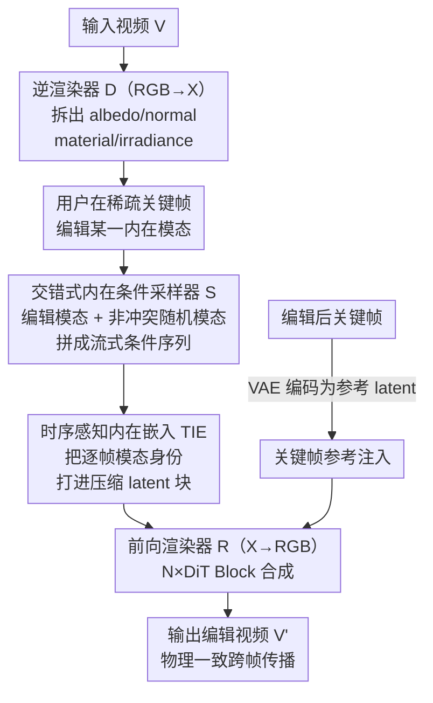

# V-RGBX: Video Editing with Accurate Controls over Intrinsic Properties

**会议**: CVPR 2026  
**论文**: [CVF Open Access](https://openaccess.thecvf.com/content/CVPR2026/html/Fang_V-RGBX_Video_Editing_with_Accurate_Controls_over_Intrinsic_Properties_CVPR_2026_paper.html)  
**代码**: 项目页 https://aleafy.github.io/vrgbx/ （未见开源代码）  
**领域**: 视频生成 / 视频编辑 / 扩散模型  
**关键词**: 内在属性编辑, 逆渲染, 视频扩散, 关键帧传播, 重光照

## 一句话总结
V-RGBX 把视频先逆渲染成 albedo / normal / material / irradiance 等内在通道，再用一个交错式条件注入的视频 DiT 把它们重新合成回 RGB，从而让用户只在稀疏关键帧上改某一种内在属性（如换材质、重打光），就能把这个物理一致的编辑稳定传播到整段视频。

## 研究背景与动机
**领域现状**：随着 text-to-video / image-to-video 扩散模型的成熟，用户已经能用语言或参考图编辑物体外观、场景布局和运动。但这些编辑都停留在 RGB 像素层，控制的是"看起来怎样"，而不是"物理上是什么"。

**现有痛点**：对真正决定物理真实感的内在属性——反照率（albedo）、辐照度（irradiance）、材质（material）、法线（normal）——几乎没有直接、解耦的控制手段。像 GenProp、VACE、DaS、AnyV2V 这些可控视频编辑方法，要么做的是外观/风格层面的迁移，要么用隐式 latent 条件把光照和材质纠缠在一起。它们把条件信号（外观、深度、光流、语义）直接注入像素空间，没有在内在域里解耦，结果就是改完一帧后，关键内在属性在后续帧里"漂移"（property drifting），无法跨帧保持一致。

**核心矛盾**：视频编辑需要"只改我想改的那一个属性、别的别动"，而现有方法在 RGB 域里训练，光照、纹理、几何天然纠缠，改 A 会顺带改了 B；同时这些方法多是全局条件（一句 prompt 或单张参考帧），无法应对"不同时间段、不同内在模态各做一处局部编辑"的真实需求。

**本文目标**：构建一个闭环框架，同时具备三件事——把视频逆渲染成内在通道（RGB→X）、从内在通道前向合成逼真视频（X→RGB）、以及基于内在通道做关键帧级别的视频编辑与传播。

**切入角度**：与其在 RGB 域里做隐式条件，不如显式建立一个**内在条件表示空间**。用户在这个空间里选某一种模态改一改，模型只在该模态上施加变化、其余模态原样保留，物理解耦天然成立。

**核心 idea**：先 RGB→X 拆出可解释的内在通道，让用户在稀疏关键帧上编辑任意模态，再用一个带"交错式条件注入"的 DiT 做 X→RGB，把关键帧的内在编辑物理一致地传播到整段序列。

## 方法详解

### 整体框架
给定输入视频 $V=\{v_1,\dots,v_T\}$，用户挑出若干关键帧，用 Photoshop 或 text-to-image 工具改其外观（如换个 albedo 颜色、调一下光照）。V-RGBX 由三块串成一条闭环管线：

1. **逆渲染器 $D(\cdot)$（RGB→X）**：把每帧 RGB 拆成内在通道 $D(V)=\{V_A,V_N,V_M,V_I\}\in\mathbb{R}^{T\times3\times H\times W}$，分别是反照率、法线、材质、辐照度（材质通道又含粗糙度、金属度、环境光遮蔽等表面属性）。
2. **内在条件采样器 $S$**：关键帧编辑后，邻近帧未编辑的内在模态会与编辑结果冲突，不能直接拿来当条件。$S$ 把关键帧上的编辑模态与其它帧"非冲突"的随机模态交错拼成一条统一的流式条件序列 $V'_X=\text{Sample}(D(V))$。
3. **前向渲染器 $R(\cdot)$（X→RGB）**：以交错内在条件 $V'_X$ 和编辑后的关键帧为条件，合成输出视频 $V'=R(\{v'_{i_1},\dots,v'_{i_k}\},V'_X)$，把关键帧编辑跨帧传播、同时保住未触碰的内在属性。

逆渲染器和前向渲染器都基于 WAN 2.1 T2V-1.3B 的 DiT 主干，整条管线既能拆（RGB→X）又能合（X→RGB），形成可做循环一致性自检的闭环。

### 关键设计

**1. 逆渲染器 RGB→X：把视频拆成可编辑的物理通道**

要在内在域里编辑，前提是先有内在域。逆渲染器 $D(\cdot)$ 复用 WAN 的 DiT 主干，把去噪过程条件在 $h_t=[x^z_t\,\Vert\,E(V)]$ 上——$x^z_t$ 是初始噪声 latent，$E(\cdot)$ 是冻结的 Wan-VAE 编码器，$\Vert$ 表示沿通道拼接。它一次只预测一种目标模态，目标模态名（"albedo"/"normal"/"material"/"irradiance"）被当作文本 prompt 用 CLIP 编码送进去，靠这个文本开关切换要拆哪一路。训练用 velocity-prediction（v-prediction）目标以提升稳定性，最后由冻结的 Wan-VAE 解码器把 latent 还原成对应模态的三通道图。相比逐帧独立做逆渲染的图像方法（如 RGB↔X），它直接在视频 DiT 上跑，时序一致性更好；相比不估光照的 DiffusionRenderer，它把 irradiance 也一起拆了出来，为后续重光照编辑铺好路。

**2. 交错式内在条件采样：用时间复用绕开冲突与显存爆炸**

关键帧一旦被编辑，邻近帧那些"还是旧内容"的内在模态就成了污染源——直接拿来当条件会和编辑结果打架。GenProp、VACE 的常规做法是在条件序列里塞空 token 来补齐缺帧，但在本文这种要同时建模四路内在通道的设定下，空 token 会带来巨大的显存开销，也限制了往更多模态扩展。作者的解法是**时间复用（temporal multiplexing）**：把分解出的内在通道交错进一条单一条件序列

$$V'_X=\text{Sample}(\{V_A,V_N,V_M,V_I\})=\{v^x_1,v^x_2,\dots,v^x_T\}$$

采样规则是——若第 $t$ 帧是被编辑过的关键帧，就从该帧被修改的模态集合 $M_t$ 里随机抽；否则从该帧"非冲突"的模态里随机抽：

$$v^x_t=\begin{cases}\text{RandomSample}(M_t), & t\in\{v'_{i_1},\dots,v'_{i_k}\}\\ \text{RandomSample}(\{A,N,M,I\}\setminus K_t), & \text{otherwise}\end{cases}$$

这里"冲突"指某模态在任意关键帧被用户编辑过，它的改动内容若再被当条件就会引入不一致（公式中 $K_t$ 即该帧的冲突模态集合，⚠️ 记号以原文为准）。这样每帧只占一个模态的位置（而非四路全塞），既省显存又天然鼓励跨模态传播，还能优雅适配任意属性组合和不完整输入，是个轻量、可扩展的条件机制。

**3. 时序感知内在嵌入 TIE：在压缩 latent 里保住"这一帧是哪种模态"**

交错采样带来一个新麻烦：Wan-VAE 会把连续四帧压成一个 latent chunk，可这四帧很可能分属不同内在模态，压完就分不清谁是谁了。TIE（Temporal-aware Intrinsic Embedding）把逐帧的模态身份打包进 chunk 维度，既保时序顺序又保模态身份。每帧 $i$ 分一个模态索引 $m_i$，其嵌入为 $e_i=W\varphi(m_i)$，$\varphi(\cdot)$ 是 one-hot 模态指示、$W$ 是可学习的类型编码矩阵（从头训练）。再经时序适配器把一个 chunk 的四帧嵌入打包：

$$\tilde e_k=\begin{cases}[e_1\Vert e_1\Vert e_1\Vert e_1], & k=1\\ [e_{4k-3}\Vert e_{4k-2}\Vert e_{4k-1}\Vert e_{4k}], & k>1\end{cases}$$

patchify 后每个 latent chunk $z^k_t$ 被对应打包嵌入调制：$\tilde z^k_t=z^k_t+\gamma\,\tilde e^*_k$，其中 $\tilde e^*_k$ 是模态嵌入的空间广播，缩放系数 $\gamma$ 经验取 1。这样每个 chunk 都显式携带模态信息又保住 chunk 内时序，模型在每个时间步都能区分当前处理的是哪一类内在属性，从而在跨帧一致的同时做到精确编辑。

**4. 关键帧参考注入：补上内在通道里没编码的视觉信息**

内在通道再全也不等于完整 RGB（比如具体纹理细节、整体视觉风格未必被四路通道完全覆盖）。当关键帧在 RGB 域被编辑后，编辑后的关键帧本身就是一份很好的视觉指引。做法是先把关键帧用空 token 补齐到与原视频等长得到序列 $\Sigma$，经 Wan-VAE 编码成参考 latent，再把噪声 latent、交错内在条件嵌入、参考序列嵌入沿通道拼起来送进扩散模型：

$$z_t=[x^z_t\,\Vert\,E_{\text{VAE}}(V'_X)\,\Vert\,E_{\text{VAE}}(\Sigma)]$$

把关键帧作为参考信号与内在条件联合注入，模型既学到了场景整体视觉内容，又补上了内在通道没显式表示的信息。训练时关键帧参考以 $p_{\text{drop}}=0.3$ 的概率随机丢弃，推理时对参考条件施加 classifier-free guidance，在保真度和编辑一致性之间取平衡。消融显示：加了参考帧，PSNR 从 21.48 提到 22.42、FVD 从 401.62 降到 367.89，确实补足了风格与细节。

### 损失函数 / 训练策略
逆渲染与前向渲染均采用 v-prediction 目标。前向渲染阶段为简化省去文本条件。两个网络都从 Wan 2.1 T2V-1.3B DiT 初始化，分别训练 27K 与 12K 次迭代，学习率 $2\times10^{-4}$，类型编码 $W$ 从头训练；分辨率 832×480，用 32 块 A100(80GB) 训练。

## 实验关键数据

### 主实验
训练数据是基于 127 个 Evermotion 室内场景渲染的内部合成集，含 171K 帧、RGB 与四路内在通道配对监督。评测在 85 个未见 Evermotion 场景（合成）和 85 个 RealEstate10K 视频（真实）上做；默认只用每段视频第一帧当关键帧。指标用 PSNR/SSIM/LPIPS 评渲染精度，FVD 评生成质量，VBench 的 smoothness 评时序平滑。

RGB→X 逆渲染（PSNR↑ / LPIPS↓，部分模态）：

| 方法 | Albedo PSNR | Albedo LPIPS | Normal PSNR | Irradiance PSNR |
|------|------|------|------|------|
| RGBX（逐帧） | 14.04 | 0.2872 | 19.44 | 11.92 |
| DiffusionRenderer | 17.40 | 0.3002 | 21.04 | 不估光照 |
| **V-RGBX (ours)** | **17.73** | **0.2406** | **21.59** | **19.94** |

X→RGB 内在感知合成（合成集）：

| 方法 | PSNR↑ | SSIM↑ | LPIPS↓ | FVD↓ | Smoothness↑ |
|------|------|------|------|------|------|
| RGBX | 16.53 | 0.7154 | 0.2417 | 1037.15 | 0.9469 |
| DiffusionRenderer* | 12.66 | 0.6475 | 0.3376 | 1015.09 | 0.9883 |
| V-RGBX (w/o ref) | 21.48 | 0.7908 | 0.2064 | 401.62 | 0.9814 |
| **V-RGBX (ours)** | **22.42** | **0.7952** | **0.1930** | **367.89** | 0.9805 |

注：DiffusionRenderer 的 smoothness 偏高是"虚高"——其前向输出在定性上明显褪色/反射不真实，平滑分高反而是失真的副作用，FVD 才更能反映质量。

RGB→X→RGB 循环一致性（端到端拆了再合，比对原视频）：

| 数据集 | 方法 | PSNR↑ | SSIM↑ | FVD↓ |
|------|------|------|------|------|
| Evermotion | RGBX | 15.29 | 0.7539 | 1099.04 |
| Evermotion | **V-RGBX** | **22.57** | **0.7985** | **367.61** |
| RealEstate10K | RGBX | 14.40 | 0.6411 | 2082.81 |
| RealEstate10K | **V-RGBX** | **17.88** | **0.7533** | **633.76** |

### 消融实验
| 配置 | 关键指标 | 说明 |
|------|---------|------|
| V-RGBX (ours) | X→RGB PSNR 22.42 / FVD 367.89 | 完整模型，含关键帧参考 |
| w/o 关键帧参考 | PSNR 21.48 / FVD 401.62 | 去掉参考帧，掉 0.94 PSNR、FVD 升 34 |
| Drop albedo 通道 (w/o ref) | PSNR 17.18 / FVD 907.63 | 整段不给 albedo 条件 |
| Drop albedo + 1st-frame 引导 (ours) | PSNR 21.65 / FVD 427.56 | albedo 只在首帧给，被有效传播到全程 |
| Drop irradiance 通道 (w/o ref) | PSNR 17.43 / FVD 702.16 | 整段不给 irradiance 条件 |
| Drop irradiance + 1st-frame 引导 (ours) | PSNR 21.82 / FVD 396.40 | irradiance 只在首帧给，效果接近全程供给 |

### 关键发现
- **关键帧参考是质量主力之一**：加上参考帧让 X→RGB 的 PSNR +0.94、FVD 降 34，说明内在通道确实不能完全覆盖视觉风格与细节，参考帧补的是这块。
- **首帧引导即可跨帧传播**：某模态即使整段缺失，只要在第一帧给一次（1st-Frame X-Guided），PSNR 就能从 ~17 拉回 ~21、FVD 大幅下降，直接验证了交错条件机制确实把稀疏关键帧的引导传播到了全序列——这正是"稀疏编辑、整段生效"卖点的量化证据。
- **基线普遍存在属性漂移**：定性比较中 AnyV2V 随生成推进出现几何/外观漂移，VACE 无法解耦光照、会误改其它通道甚至凭空生成新物体；V-RGBX 在解纠缠和跨帧一致上明显更稳。
- **smoothness 需谨慎解读**：DiffusionRenderer 多次报出虚高 smoothness，但输出褪色，提醒该指标高不等于质量好，要结合 FVD/PSNR 一起看。

## 亮点与洞察
- **把"在哪个域编辑"当成核心问题**：与其在纠缠的 RGB 域硬解耦，不如先建一个显式内在域，编辑天然解耦——这个"换战场"的视角比堆条件信号更治本。
- **交错采样一招解两题**：时间复用既绕开了"编辑帧旧模态冲突"，又把"四路通道全塞导致显存爆炸"一起解决，还顺带支持任意模态组合，工程上很巧。
- **首帧引导跨帧传播的设计可迁移**：用稀疏的少量帧条件 + 模型自身的时序传播能力来覆盖整段，这套思路在其它"稀疏标注/稀疏控制 → 稠密视频"的任务（如视频分割传播、稀疏深度补全）上都值得借鉴。
- **TIE 解决了"压缩 latent 丢模态身份"的隐患**：把 one-hot 模态嵌入打包进 chunk 维度，是个简单但必要的细节，否则交错采样会在 4 帧压 1 块时失效。

## 局限与展望
- **只在室内合成数据上训练**：作者承认对 out-of-distribution 场景（如室外）泛化存疑，真实数据上的循环一致性指标（RealEstate10K PSNR 17.88）也明显低于合成集（22.57）。
- **每帧只采一个模态**：当前交错条件每帧只放一种内在模态，限制了在同一关键帧上做复杂、多属性联合编辑的能力。
- **受限于预训练视频主干**：依赖 WAN 主干，在视频长度和实时性上都受其约束；作者提到可结合长程生成方法扩展。
- **依赖外部逆渲染识别编辑模态**：管线需要图像逆渲染工具来判断关键帧改了哪些内在模态，这一步的误差会传导进后续条件构建（自己发现的局限）。

## 相关工作与启发
- **vs RGB↔X / IntrinsicEdit（图像级内在编辑）**：它们在单图上拆内在通道并重组编辑，但纯图像级，扩展到视频时无法保证逐帧传播的时序一致；V-RGBX 直接在视频 DiT 上做拆-合，且用交错条件实现跨帧传播。
- **vs DiffusionRenderer**：能做视频分解与重组，但不估光照、也不支持逐像素编辑的传播；V-RGBX 把 irradiance 一并拆出并支持关键帧编辑传播，循环一致性 FVD 远低（367 vs 1073）。
- **vs X2Video**：同为视频级 X→RGB，但需要一整段已编辑的内在序列才能渲染，无法只靠稀疏关键帧逐帧传播编辑；V-RGBX 的交错采样 + 首帧引导让稀疏编辑就能生效。
- **vs GenProp / VACE / DaS / AnyV2V（可控视频编辑）**：它们把外观/深度/光流/语义直接注入像素空间、全局条件，不在内在域解耦，导致属性漂移、误改其它通道；V-RGBX 在显式内在域做局部、模态级控制，解纠缠更彻底。

## 评分
- 新颖性: ⭐⭐⭐⭐⭐ 首个端到端内在感知视频编辑框架，把"内在域编辑"和交错条件传播这条路走通了，视角和机制都新。
- 实验充分度: ⭐⭐⭐⭐ RGB→X、X→RGB、循环一致性、控制策略消融都覆盖了，但训练只在室内合成集、真实数据评测偏少，泛化证据不足。
- 写作质量: ⭐⭐⭐⭐ 三件套结构清晰、公式与采样规则交代到位；个别记号（如 $K_t$ 与 $M_t$）略有跳跃。
- 价值: ⭐⭐⭐⭐ 重光照、换材质、几何感知插入等下游应用价值明确，是物理一致视频编辑的一块扎实基座。

<!-- RELATED:START -->

## 相关论文

- [\[CVPR 2026\] LightMover: Generative Light Movement with Color and Intensity Controls](lightmover_generative_light_movement_with_color_and_intensity_controls.md)
- [\[CVPR 2026\] SwitchCraft: Training-Free Multi-Event Video Generation with Attention Controls](switchcraft_training-free_multi-event_video_generation_with_attention_controls.md)
- [\[CVPR 2026\] Generative Video Motion Editing with 3D Point Tracks](generative_video_motion_editing_with_3d_point_tracks.md)
- [\[CVPR 2026\] VideoCoF: Unified Video Editing with Temporal Reasoner](videocof_unified_video_editing_with_temporal_reasoner.md)
- [\[ICLR 2026\] MotionStream: Real-Time Video Generation with Interactive Motion Controls](../../ICLR2026/video_generation/motionstream_real-time_video_generation_with_interactive_motion_controls.md)

<!-- RELATED:END -->
