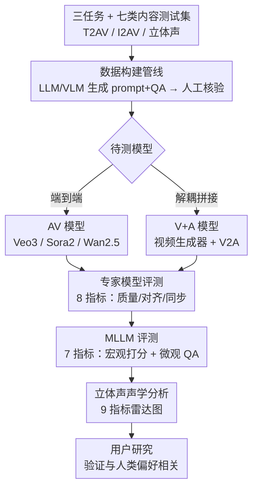

# VABench: A Comprehensive Benchmark for Audio-Video Generation

**会议**: CVPR 2026  
**论文**: [CVF Open Access](https://openaccess.thecvf.com/content/CVPR2026/html/Hua_VABench_A_Comprehensive_Benchmark_for_Audio-Video_Generation_CVPR_2026_paper.html)  
**代码**: 待确认  
**领域**: 视频生成 / 音视频生成 / 评测基准  
**关键词**: 音视频生成, 同步评测, 多模态基准, 立体声评测, MLLM 评判

## 一句话总结
VABench 是面向「同步音视频生成」的综合评测基准，覆盖文本→音视频（T2AV）、图像→音视频（I2AV）和立体声三类任务、七大内容类别，用「专家模型 + 多模态大模型」双轨共 15 个细粒度指标（外加 9 个立体声声学指标）对 Veo3 / Sora2 / Wan2.5 等端到端模型与「视频生成器 + V2A」解耦组合做无参考评测，并用用户研究验证打分与人类偏好高度相关。

## 研究背景与动机
**领域现状**：视频生成已从纯视觉合成走向「带同步音频」的统一生成，Veo3、Sora2、Wan2.5 这类模型能在生成画面的同时给出与动作对齐的声音。但现有评测体系（VBench、VBench2.0、Evaluation Agent）几乎都只盯着画面质量、时序一致性和物理合理性，对「声音」这一半基本失语。

**现有痛点**：少数探索性的联合音视频基准（如 JavisBench）评测维度有限、场景受限，更关键的是它们**忽略了音视频联合生成特有的多模态耦合现象**——运动带来的多普勒效应、角色情绪在视听两个模态上的协同表达、背景音乐与画面节奏的配合。同时，当前同步音视频模型大多输出立体声，可没有基准去评测它的空间声学属性（左右声道、声场宽度）。

**核心矛盾**：T2AV 这类任务**没有真实音视频可作参考**，传统 V2A 评测依赖 ground-truth 音轨做参考式打分（reference-based）的范式直接失效；而要换成无参考（reference-free）评测，又必须同时刻画「文本—视频—音频」三角一致性、时序同步、物理可信度、情绪表现力等多个彼此牵扯的维度，单一指标根本撑不起来。

**本文目标**：建立一个无参考、可自动化、多维度、且与人类感知对齐的同步音视频生成评测框架，能区分端到端联合模型和解耦式拼接方案的真实差距。

**切入角度**：把评测拆成「该用专精模型量化的客观维度」和「该靠类人理解判断的高阶语义维度」两条轨道，分别用专家小模型和多模态大模型来打分，再辅以专门的立体声声学分析。

**核心 idea**：用「专家模型 + MLLM」双轨 15 指标 + 七类内容 taxonomy + 立体声声学评测，把同步音视频生成的质量拆成可计算、可解释、可与人类偏好对齐的多维分数。

## 方法详解

### 整体框架
VABench 不是一个生成模型，而是一整套「测试数据 + 评测协议」。它先按七大内容类别（动物、人声、音乐、环境声、同步物理声、复杂场景、虚拟世界）规划并构建测试集，对 T2AV 走文本条件、对 I2AV 走图像条件两条数据管线，全程用 LLM/VLM 批量生成结构化 prompt 和问答对、再由人工核验；待测模型（端到端 AV 模型或「视频生成器 + 音频模型」的 V+A 组合）据此生成音视频后，进入双轨评测：一轨用 8 个专家模型指标量化单模态质量、跨模态对齐与时序同步，另一轨用 7 个 MLLM 指标在宏观（1–5 分）和微观（QA 准确率）两个层次模拟人类判断；立体声任务再单独走 9 个声学指标的雷达分析。最后用一项用户研究验证基准打分与人类偏好的皮尔逊相关性。

### 关键设计

**1. 三任务 + 七类内容的测试集 taxonomy：把「音视频该考什么」结构化**

VABench 把同步音视频生成切成三个任务：T2AV（文本→音视频，难在高保真运动一致性与跨模态语义对齐）、I2AV（静态图→音视频，难在动作合理性、时序连贯和视听对齐）、立体声生成（文本→带明确空间线索的立体声，用 116 条指定左右声源的 prompt 测试声道分离）。内容上则建了一套**扎根于人类听觉感知**的七类 taxonomy：动物、人声（再分语言性/非语言性）、音乐、环境声（自然/城市/室内）、同步物理声、复杂场景、虚拟世界。这套分类不是随手切的——它覆盖了 Kling-Foley-Eval 的声学类别、又补上 VBench 2.0 强调的物理可信度，从「基本声源 → 物理交互 → 复杂语义 → 非现实内容」层层递进。其中复杂场景专门考五个高阶维度（复杂声景、主观感受、世界知识、符号联想、不可见声源），逼模型做视听协同推理；虚拟世界因为脱离物理定律、只考内部逻辑与风格自洽，所以**只在 T2AV 任务里出现**。这样设计让评测越过「感知层面连不连贯」，去考模型对真实世界动态、物理逻辑和人类情绪语境的把握。

**2. 双路数据构建管线：无 ground-truth 下怎么造出可评测的测试样本**

既然 T2AV/I2AV 没有真实音视频可参考，测试样本必须自带「评测锚点」。VABench 用双路策略（T2AV 文本路 + I2AV 图像路）构建了共 778 条 T2AV + 521 条 I2AV 样本。T2AV 路用专家模板 + LLM 批量生成原始 prompt，再据此造出视觉问答对（VQA）和音频问答对（AQA），同时让 LLM 把 prompt **结构化解耦**成视觉子 prompt 和听觉子 prompt，最后人工核验类别正确性、元素可观测性以及物理/常识约束。I2AV 路则先采集并人工分类高质量图片（剔除隐私内容），由 MLLM 生成统一的音视频描述（客观视觉 + 常识推断出的音频），同样用来构造 VQA/AQA 并由 LLM 解耦成子 prompt，再人工复核听觉推断与问题区分度。整条管线的关键在于「LLM/VLM 批量产 + 人工把关」的组合：QA 对成为后续微观评测的判分依据，解耦子 prompt 让文本—视频、文本—音频的对齐可以分轨计算。

**3. 专家模型 + MLLM 双轨评测：客观量化与类人判断各司其职**

这是 VABench 的核心评测引擎，15 个指标分成两轨。**专家模型轨（8 个）**用专精小模型做精确量化，分三类维度：单模态音频质量——SpeechClarity（用 DNSMOS 的 OVRL）、SpeechQual&Nat（用 NISQAv2 的 MOS）、AudioAesthetic（用 Audiobox，按公式 $S_{audioaesthetic}=\frac{CE+CU+PQ-PC}{4}$ 聚合，其中制作复杂度 PC 与感知质量负相关所以取负）；跨模态语义对齐——文本-视频用 ViCLIP、文本-音频用 CLAP、音视频用 ImageBind 算嵌入相似度；时序同步——Desync（用 Synchformer 估计错位偏移，取首尾各 4.8s 分析）和 Lip-Sync（仅对检测到说话头的人声语言子集，借 LatentSync 思路算对齐置信度）。**MLLM 轨（7 个）**用全模态大模型在两个层次模拟人类判断：宏观层 1–5 分打 Alignment、Artistry、Expressiveness、Audio Realism、Visual Realism（后两者排除虚拟世界类别，因为它本不遵循物理定律）；微观层则用每样本 3–7 个细节问题算准确率，对含 $N$ 个样本、第 $i$ 个样本有 $K_i$ 个问题、其中 $C_i$ 个被 LLM 判为满足要求时，最终细粒度分数为

$$S = \frac{1}{N}\sum_{i=1}^{N}\frac{C_i}{K_i}$$

两轨互补：专家模型给出可复现的硬指标，MLLM 覆盖艺术性、表现力这类难以用小模型量化的高阶语义，避免传统人工 MOS 那种「费力、不可扩展、主观」的老问题。

**4. 立体声九维声学评测：把被忽视的空间听觉补进基准**

针对现有基准对立体声空间属性的空白，VABench 单设一套基于人工检查 + 九个核心声学指标的立体声分析，分两个维度。空间成像质量：声场宽度（Mid/Side 能量比）、成像稳定性（ITD 波动）、电平稳定性（ILD 波动）、声道间时序一致性（包络相关 + 瞬态同步）。信号完整性与兼容性：低/中/高频的相位相干、单声道下混保真度（mono loss percent，及其反向的 Mono Compat = 1 − 归一化 mono loss）。为了让「越高越好」统一，对 Mono Compat、成像稳定性、电平稳定性做逆归一化，最终用九维雷达图可视化各模型在空间成像与信号完整性上的表现。这一设计让基准第一次能量化「左右声道是否真有空间分离」，而实验恰恰揭示当前模型基本做不到从文本生成可靠立体声。

## 实验关键数据

待测系统分两类：端到端 AV 模型（Veo3-fast、Wan2.5 Preview、Sora2）和解耦 V+A 模型（视频生成器 Seedance-1.0-lite / Wan2.2-TI2V / Kling2.5-Turbo × 音频模型 ThinkSound light / MMAudio）。视频统一 720P、音频 48kHz 立体声。

### 主实验：T2AV 评测（节选关键指标）

| 模型 | Audio Aes | T-V Align | T-A Align | A-V Align | Lip-Sync | Desync↓ | Alignment | Visual Realism |
|------|-----------|-----------|-----------|-----------|----------|---------|-----------|----------------|
| Sora2 (AV) | 2.867 | 0.2256 | 0.3465 | 0.2376 | 2.655 | 0.7167 | 4.546 | 4.805 |
| Veo3 (AV) | 3.543 | 0.2304 | 0.3582 | 0.3164 | 3.294 | 0.5184 | 4.553 | 4.773 |
| Wan2.5 (AV) | 3.061 | 0.2275 | 0.3033 | 0.2099 | 3.671 | 0.4622 | 4.465 | 4.674 |
| Kling+MMAudio (V+A) | 2.954 | 0.2304 | 0.2929 | — | 1.740 | 0.5617 | 4.440 | 4.720* |
| Wan2.2+ThinkSound (V+A) | 2.825 | 0.2128 | 0.2735 | 0.2090 | 1.559 | 0.6049 | 4.279 | 4.649 |

（*Visual Realism 由对应视频生成器决定；带 mm 后缀的部分音视频对齐类指标因音频独立生成而缺失。Desync 越低越好。）

- **结论**：AV 模型里 Veo3 综合最强（音频质量、跨模态对齐领先），Sora2 真实感强但音频美学与同步偏弱，Wan2.5 同步（尤其 Lip-Sync）最好但语义对齐略低——印证「语义一致、同步、真实感三者难以兼得」。
- V+A 组合里 Kling+MMAudio（最强视频 + 最强音频）是最强解耦方案，说明更高质量的视频生成能反过来促进音频生成。

### I2AV 评测（节选关键指标）

| 模型 | Audio Aes | T-V Align | A-V Align | Desync↓ | Alignment | Audio QA | Visual QA |
|------|-----------|-----------|-----------|---------|-----------|----------|-----------|
| Sora2 (AV) | 2.974 | 0.2188 | 0.2623 | 0.9171 | 4.885 | 0.8287 | 0.7611 |
| Veo3 (AV) | 3.574 | 0.2334 | 0.3215 | 0.6136 | 4.906 | 0.8584 | 0.7982 |
| Wan2.5 (AV) | 3.455 | 0.2374 | 0.2112 | 0.3539 | 4.812 | 0.8084 | 0.7889 |
| Seed+MMAudio (V+A) | 2.974 | — | — | 0.5885 | 4.918 | 0.8020 | — |

- I2AV 因输入图像提供更强视觉约束，模型间差距缩小；个别 V+A 组合（Seed+MMAudio）在 Alignment 上甚至反超 AV 模型，但 AV 模型在 T2AV 上仍保持明显优势。

### 关键发现
- **端到端 > 解耦**：跨 T2AV/I2AV，集成式 AV 模型整体优于 V+A 拼接，说明端到端联合训练更能捕捉跨模态协同、形成统一语义空间；细粒度 QA 上「即便最强 V+A 组合也打不过最弱的 AV 模型」。
- **类别难度分化**：模型在音乐、动物这类弱相关音频上表现好，在人声上吃力；虚拟世界类别得分最高，复杂场景最低（多源动态交互仍是难点）。AV 对 V+A 优势最大的类别是人声和虚拟世界。
- **立体声基本不及格**：九维雷达显示空间宽度与信号保真存在权衡——Wan2.5 保真最好但声场最窄、近乎单声道，Sora2 声场最宽但靠相位偏移、定位不稳，Veo3 最均衡。人工评测确认没有模型能可靠地从文本生成立体声分离，只有 Veo3/Sora2 在自然场景偶有局部空间化。
- **与人类对齐**：用户研究（6 名专业评测员、按语义/同步/真实感三维 1–5 打分）显示 VABench 各维度打分与人类胜率呈强皮尔逊相关，佐证基准的有效性。

## 亮点与洞察
- **双轨评测的分工很务实**：把能用专精小模型精确量化的（同步、相似度、语音质量）交给专家模型，把艺术性/表现力这类「只可意会」的交给 MLLM 宏观打分，再用 QA 准确率把微观细节落到可计算的 $C_i/K_i$，避免了纯 MLLM 打分的飘和纯小模型的覆盖不全。
- **立体声评测是真正的差异点**：第一次把九个声学指标（ITD/ILD 波动、相位相干、mono 下混保真等）搬进音视频生成基准，并直接得出「当前模型都做不出可靠立体声分离」这一有指导价值的负面结论，给后续空间音频研究指了方向。
- **QA 锚点设计可迁移**：在构建数据时就让 LLM 生成细粒度 VQA/AQA 并人工核验，把无参考评测转成「问答命中率」，这套「造测试样本时同步造评判锚点」的思路可迁移到其它无 ground-truth 的生成评测。
- **「视频强则音频强」的观察**：V+A 组合里更强的视频生成器能带动配对音频模型表现，提示解耦方案的瓶颈往往在视觉侧而非音频侧。

## 局限与展望
- **依赖 MLLM 评判**：7 个 MLLM 指标的可靠性受全模态大模型自身能力与偏置影响，宏观 1–5 分打分仍有主观性；Artistry、SpeechClarity 等多个指标的实现细节被放进补充材料，正文不可完全复核。
- **样本规模偏小**：T2AV 778 + I2AV 521 + 立体声 116 条，相对七类内容 × 多模型的组合空间仍偏少，某些子类别统计可能不够稳。
- **用户研究规模有限**：仅 6 名评测员、三模型子集，作者自称「pilot」，相关性结论的稳健性有待更大规模验证。
- **横向比较需谨慎**：T2AV 与 I2AV 任务难度不同（图像约束强弱不一），不同任务/类别下的分数不宜直接比大小；表中部分 V+A 模型的音视频对齐类指标因音频独立生成而缺失，对比时要注意 caveat。
- **改进方向**：可扩充样本与类别覆盖、增加多评判模型交叉校验降低单一 MLLM 偏置、并把立体声评测从「检测有无分离」推进到「空间定位精度」的定量刻画。

## 相关工作与启发
- **vs VBench / VBench2.0**: 它们做纯视觉评测（帧质量、时序一致、物理可信），本文做的是音视频联合评测，补上了跨模态一致性与音频维度这一整块空白。
- **vs JavisBench**: 同为联合音视频基准，但 JavisBench 维度有限、缺少物理/情绪等高阶耦合的定量度量；VABench 用 15 细粒度指标 + 七类 taxonomy + 立体声分析做更全面的自动化评测。
- **vs 参考式 V2A 基准（如基于真实音视频 ground-truth 的评测）**: 那类范式需要真实音视频作参考，不适用于 T2AV 这种无参考生成；VABench 改走无参考的「文本—视频—音频」三角一致性 + QA 命中率评测。
- **vs Movie Gen 式人工评测**: 依赖人工 MOS 难以扩展，VABench 用专家模型 + MLLM 把大部分评测自动化，再用小规模用户研究校准对齐。

## 评分
- 新颖性: ⭐⭐⭐⭐ 首个系统性同步音视频生成基准，立体声九维声学评测是实打实的差异点，但「专家模型 + MLLM」双轨思路在生成评测里已有先例。
- 实验充分度: ⭐⭐⭐⭐ 覆盖 3 端到端 + 6 解耦组合、两大任务 + 立体声、七类内容并做用户研究对齐；扣分在样本与评测员规模偏小、多指标实现细节藏在补充材料。
- 写作质量: ⭐⭐⭐⭐ 任务/类别/指标分层清晰，公式与表格规范；部分表格存在缺失项需读者自行注意 caveat。
- 价值: ⭐⭐⭐⭐ 为快速升温的「带音频视频生成」提供了急需的标准化、可解释评测工具，立体声负面结论对后续研究有明确指导意义。

<!-- RELATED:START -->

## 相关论文

- [\[CVPR 2026\] ActivityForensics: A Comprehensive Benchmark for Localizing Manipulated Activity in Videos](activityforensics_a_comprehensive_benchmark_for_localizing_manipulated_activity_.md)
- [\[ICLR 2026\] DrivingGen: A Comprehensive Benchmark for Generative Video World Models in Autonomous Driving](../../ICLR2026/video_generation/drivinggen_a_comprehensive_benchmark_for_generative_video_world_models_in_autono.md)
- [\[ACL 2025\] VidCapBench: A Comprehensive Benchmark of Video Captioning for Controllable Text-to-Video Generation](../../ACL2025/video_generation/vidcapbench_a_comprehensive_benchmark_of_video_captioning_for_controllable_text-.md)
- [\[CVPR 2026\] Harmony: Harmonizing Audio and Video Generation through Cross-Task Synergy](harmony_harmonizing_audio_and_video_generation_through_cross-task_synergy.md)
- [\[CVPR 2026\] UniAVGen: Unified Audio and Video Generation with Asymmetric Cross-Modal Interactions](uniavgen_unified_audio_and_video_generation_with_asymmetric_cross-modal_interact.md)

<!-- RELATED:END -->
