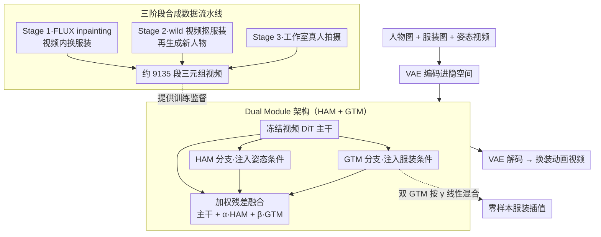

# Vanast: Virtual Try-On with Human Image Animation via Synthetic Triplet Supervision

**会议**: CVPR 2026  
**arXiv**: [2604.04934](https://arxiv.org/abs/2604.04934)  
**代码**: [https://hyunsoocha.github.io/vanast/](https://hyunsoocha.github.io/vanast/)  
**领域**: 视频生成  
**关键词**: 虚拟试穿、人体动画、合成三元组、Dual Module、视频扩散

## 一句话总结

Vanast 提出一种统一框架，通过 Dual Module 架构（HAM + GTM）和三阶段合成数据构建流水线，在单阶段内同时完成服装迁移和人体动画生成，在 Internet 数据集上 PSNR 达到 17.95dB（+5.5dB vs 最佳两阶段方案），LPIPS 仅 0.237。

## 研究背景与动机

1. **领域现状**：虚拟试穿（VTON）和人体动画是电商和社交媒体的核心需求。现有方案将两者分两阶段处理——先用 CatVTON/OmniTry 换装生成静态图，再用 StableAnimator 做动画。
2. **现有痛点**：两阶段方法存在严重的误差累积：(1) 身份漂移——动画阶段丢失换装阶段的身份信息；(2) 服装扭曲——动画过程中服装细节变形；(3) 前后不一致——正反面服装外观断裂。
3. **核心矛盾**：单阶段统一模型需要同时学习"换装"和"动画"两种不同性质的变换，但缺乏配对的三元组训练数据（人物+服装+动作序列）。
4. **本文目标**：构建大规模三元组数据集并训练单阶段统一模型。
5. **切入角度**：用合成数据弥补真实三元组数据的稀缺——通过扩散inpainting、视频服装提取、工作室拍摄三种策略构建数据。
6. **核心 idea**：Dual Module 架构在冻结的视频 DiT 骨干上并行添加人体动画模块（HAM）和服装迁移模块（GTM），通过加权残差连接实现统一生成。

## 方法详解

### 整体框架

Vanast 想做的事是把"换装"和"动画"塞进同一次前向里：给定一张人物图、一张目标服装图、一段姿态引导视频，直接输出这个人穿着新衣服、按引导动作运动的视频，而不是先换装成静态图再单独驱动。三个输入先各自被 VAE 编码进隐空间，主干是一个**完全冻结**的视频 DiT。换装和动画两类条件不去碰主干，而是交给两个并行的轻量模块——处理姿态的 HAM 和处理服装的 GTM——每个模块算出自己的残差，再加权叠回主干的特征流：

$$h_{l+1} = B^{T2V}_l(h_l) + \alpha \cdot B^{HAM}_l(h_l) + \beta \cdot B^{GTM}_l(h_l)$$

默认 $\alpha=\beta=0.5$。融合后的隐变量经 DiT 逐层处理、最后由 VAE 解码成视频。整套设计的两个支柱，一是怎么造出训练它的三元组数据，二是这个 Dual Module 怎么把两类条件解耦开。

### 关键设计

**1. 三阶段合成数据流水线：用合成手段补上几乎不存在的三元组监督**

训练这种统一模型需要"同一个人、穿不同衣服、做同一套动作"的配对视频，而这种数据在自然场景里基本不存在——没人会为了凑数据集去换十件衣服重拍同一段舞蹈。Vanast 干脆全部合成，分三路互补地造：Stage 1 用 FLUX 做扩散 inpainting，把一段视频里人物身上的服装替换成目标服装，得到"换装图–服装–视频"的对应；Stage 2 反过来从 wild 视频里把服装抠出来，再用扩散生成穿着它的新人物，覆盖更杂的服装来源；Stage 3 直接进工作室，让真人换多套衣服拍同一组动作，补上前两路合成噪声大的短板。三路汇总最终得到约 9135 段视频（3–10 秒），这才让单阶段模型有了可学的监督信号。

**2. Dual Module 架构（HAM + GTM）：把两类性质迥异的条件拆进互不干扰的分支**

换装是"贴对纹理、对齐版型"的外观活，动画是"跟住姿态、保持时序连贯"的运动活，两者性质差很远，硬塞进同一组参数容易互相拖累。Vanast 的做法是冻死预训练好的 DiT 主干，只在旁边挂两个轻量适配模块：HAM 吃姿态引导、GTM 吃服装图，各自独立算完之后按上面的加权残差叠回主干。这样视频先验被原样保住，模型只需学"怎么注入这两类条件"而非重学生成本身。消融很直接地证明了解耦的价值——把两个条件合到一个模块（Single Module）时 FID 是 108.84，拆成 Dual Module 后降到 91.05，差了近 18 个点；而去微调主干的 Backbone-LoRA 反而更差（FID 120.97），说明动主干会破坏原有视频先验。

**3. 零样本服装插值：模块化结构顺带换来的免训练混搭能力**

因为服装条件被单独封装在 GTM 里，想在两件衣服 $G_A$、$G_B$ 之间做渐变，不必重新训练，只要同时跑两个 GTM 分支、再用一个系数 $\gamma$ 线性混合它们的残差：

$$h_{l+1} = B^{T2V}_l(h_l) + \alpha \cdot B^{HAM}_l(h_l) + \gamma \cdot B^{GTM}_l(h_l; G_A) + (1-\gamma) \cdot B^{GTM}_l(h_l; G_B)$$

$\gamma \in [0,1]$ 控制混合比例——$\gamma=1$ 是纯 A、$\gamma=0$ 是纯 B、中间值给出两者的过渡外观。这是 Dual Module 解耦设计白送的能力：条件既然是可加的独立分支，多条件加权就是自然的线性组合，零额外成本。

### 损失函数 / 训练策略

训练目标就是标准的扩散去噪损失（v-prediction），关键在于**只优化 HAM 和 GTM 的参数、DiT 骨干全程冻结**——这既保住了预训练视频先验，也大幅压低了训练开销。数据用前述 9135 段视频（3–10 秒），评测在 80 个 Internet 样本和 50 个 ViViD 样本上进行。

## 实验关键数据

### 主实验

| 方法 | L1↓ | PSNR↑ | SSIM↑ | LPIPS↓ | FID↓ |
|------|-----|-------|-------|--------|------|
| CatVTON+StableAnimator | 0.1242 | 14.56 | 0.765 | 0.327 | 132.09 |
| OmniTry+StableAnimator | 0.1227 | 14.53 | 0.767 | 0.318 | 121.04 |
| VACE (1-stage) | 0.1453 | 13.09 | 0.689 | 0.405 | 115.40 |
| **Vanast** | **0.0719** | **17.95** | **0.755** | **0.237** | **91.05** |

### 消融实验

| 配置 | L1↓ | PSNR↑ | FID↓ | VFID↓ | 说明 |
|------|-----|-------|------|-------|------|
| Single Module | 0.1162 | 14.28 | 108.84 | 39.64 | 单模块性能差 |
| Backbone-LoRA | 0.1359 | 13.17 | 120.97 | 42.47 | 微调骨干反而差 |
| w/o SynthHuman | 0.1163 | 14.62 | 110.76 | 38.89 | 合成数据关键 |
| **Full model** | **0.1069** | **14.74** | **104.59** | **35.60** | 完整模型 |

### 关键发现

- Dual Module vs Single Module：FID 从 108.84 降到 91.05，验证了条件解耦的必要性
- 冻结骨干 vs LoRA 微调：冻结更好（FID 91.05 vs 120.97），可能因为 LoRA 破坏了预训练视频先验
- SynthHuman 数据贡献 6 点 FID 提升，合成数据策略有效
- VFID_ResNeXt 仅 0.39（vs 基线 1.69-5.86），时序一致性大幅领先

## 亮点与洞察

- **单阶段统一的工程优雅性**：消除了两阶段流水线的误差累积，一步到位生成换装动画视频
- **合成数据弥补真实数据空白**：三阶段数据构建策略可迁移到其他缺乏配对数据的视频生成任务
- **零样本插值能力**：模块化设计自然获得了服装混搭的零样本能力，商业应用价值极高

## 局限与展望

- 训练数据仅 9135 段视频，服装类型覆盖面有限
- 对不常见服装类型（如连体衣、和服）效果可能退化
- 合成数据的质量瓶颈取决于 FLUX inpainting 和 VLM 的能力
- 后续可扩展到多人场景和配饰（帽子、包等）的统一迁移

## 相关工作与启发

- **vs CatVTON/OmniTry+StableAnimator**: 两阶段方案 FID 121-132，Vanast 91.05。差距主要来自误差累积
- **vs VACE**: 虽然也是单阶段，但 VFID_ResNeXt=5.86 远高于 Vanast 的 0.39，时序一致性差距悬殊

## 评分

- 新颖性: ⭐⭐⭐⭐ Dual Module和合成三元组数据策略有新意
- 实验充分度: ⭐⭐⭐⭐ 两数据集+多基线+消融，但测试规模偏小
- 写作质量: ⭐⭐⭐⭐ 方法描述清晰
- 价值: ⭐⭐⭐⭐ 电商虚拟试穿的直接应用价值

<!-- RELATED:START -->

## 相关论文

- [\[CVPR 2026\] The Devil is in the Details: Enhancing Video Virtual Try-On via Keyframe-Driven Details Injection](the_devil_is_in_the_details_enhancing_video_virtual_try-on_via_keyframe-driven_d.md)
- [\[ICML 2026\] iTryOn: Mastering Interactive Video Virtual Try-On with Spatial-Semantic Guidance](../../ICML2026/video_generation/itryon_mastering_interactive_video_virtual_try-on_with_spatial-semantic_guidance.md)
- [\[ICCV 2025\] Multi-identity Human Image Animation with Structural Video Diffusion](../../ICCV2025/video_generation/multi-identity_human_image_animation_with_structural_video_diffusion.md)
- [\[CVPR 2026\] SLVMEval: Synthetic Meta Evaluation Benchmark for Text-to-Long Video Generation](slvmeval_synthetic_meta_evaluation_benchmark_for_text-to-long_video_generation.md)
- [\[CVPR 2026\] LottieGPT: Tokenizing Vector Animation for Autoregressive Generation](lottiegpt_vector_animation_generation.md)

<!-- RELATED:END -->
