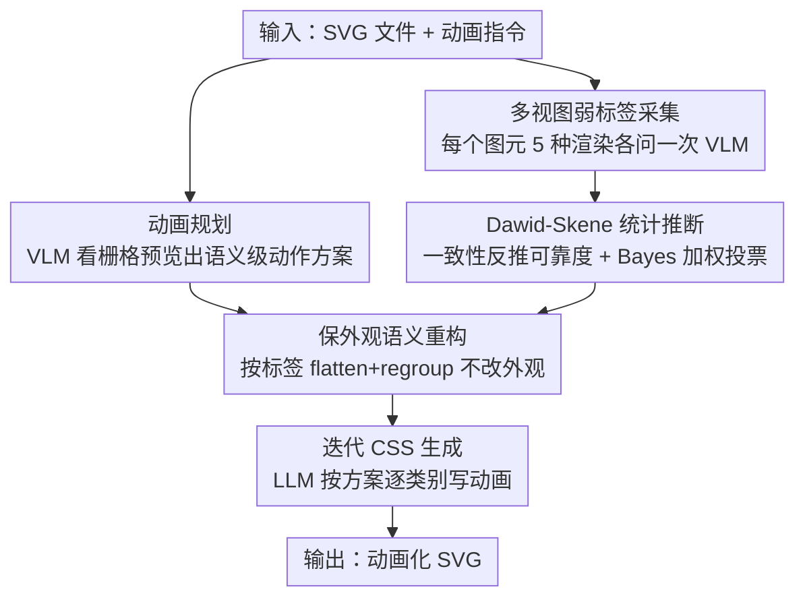

# Vector Prism: Animating Vector Graphics by Stratifying Semantic Structure

**会议**: CVPR 2026  
**论文**: [CVF Open Access](https://openaccess.thecvf.com/content/CVPR2026/html/Yun_Vector_Prism_Animating_Vector_Graphics_by_Stratifying_Semantic_Structure_CVPR_2026_paper.html)  
**领域**: 视频生成 / 矢量图动画 / VLM 应用  
**关键词**: SVG 动画, 语义结构恢复, Dawid-Skene, 多视图推断, VLM

## 一句话总结
针对 VLM 直接给 SVG 写动画常常"乱动"的问题，Vector Prism 先用多种渲染视图让 VLM 给每个图元弱标注，再用 Dawid-Skene 统计推断把这些噪声标签聚成可靠的语义分组并重构出"可动画"的 SVG 层级，从而让 VLM 在有意义的部件粒度上生成动画，指令贴合度和视觉质量全面超过 AniClipart、GPT-5 乃至 Sora 2 等商业视频生成模型。

## 研究背景与动机
**领域现状**：SVG（可缩放矢量图）是现代网页的核心素材，无限缩放不失真、文件体积小。随着网页越来越动态化，给 SVG 加动画的需求暴涨。一个很诱人的想法是：直接把 SVG 文件丢给 VLM，让它"看懂图、规划动作、写出动画代码"——现代 VLM 既能做运动规划也能写代码，听起来顺理成章。

**现有痛点**：实践中 VLM 生成的 SVG 动画几乎总是"视觉崩坏"。问题不在规划能力或写代码能力，而在 **SVG 的组织方式**：SVG 是为渲染效率而非语义清晰度设计的。一个视觉上连贯的部件（比如兔子的耳朵、鼻子）在 SVG 里往往被拆成一堆低级几何图元（`<path>`、`<rect>` 等），或者按"绘制顺序"而非"语义"分组。VLM 根本看不出"哪些图元应该一起动"，于是把整个图当成一块僵硬地晃动，或者让本该一起动的部件各自乱飞。

**核心矛盾**：动画规划发生在**语义层**（VLM 理解"太阳该升起、天空该变亮"），而动画执行发生在**语法层**（SVG 代码里一堆没有语义标签的图元）。这两层之间缺了一座桥——VLM 没法把语义计划落到正确的语法层级上。原生 SVG 层级几乎从不提供这种结构。

**本文目标**：恢复 SVG 中"动画所需的语义部件结构"，让 VLM 能引用有意义的部件并把运动挂到正确的语义单元上。难点在于：单个图元渲染出来给 VLM 看，VLM 的语义判断本身很不可靠（同一个图元换个渲染方式可能给出完全不同的答案）。

**切入角度**：与其追求"一次问对"，不如承认 VLM 的判断是**弱标签**，然后用统计的方法从一堆噪声弱标签里推断真实语义。作者把每个图元用多种"聚焦视图"渲染（高亮、隔离、放大、描边、包围框），每种视图问一次 VLM，得到一组弱标签，再用经典的 Dawid-Skene 众包推断模型把它们融合成可靠决策。

**核心 idea**：像棱镜（prism）把光分层一样，把"嘈杂的多视图弱预测"统计性地分层聚合成连贯的语义分组——用 Dawid-Skene 模型 + Bayes 决策从噪声里恢复每个图元的真实语义标签，再据此把 SVG 重构成"可动画"的层级，无需微调 VLM。

## 方法详解

### 整体框架
Vector Prism 是一条三阶段流水线，输入是「一个 SVG 文件 + 一句动画指令」，输出是「一个动画化的 SVG 文件」。三个阶段分别工作在语义层和语法层，由中间的"语义重构"把两者缝起来：

1. **动画规划（语义层）**：把 SVG 栅格化成图片喂给 VLM，让它结合用户指令产出"哪些语义部件该动、怎么动"的高层方案。
2. **语义梳理 / Vector Prism（核心贡献）**：把 SVG 重构成"语义上有意义、可动画"的形式。这一步先对每个图元做多视图弱标注，再用统计推断把噪声标签聚合成可靠语义标签。
3. **动画生成（语法层）**：LLM 按动画方案给重构后的 SVG 写 CSS 动画代码。

核心贡献集中在第二阶段：它往 SVG 里"注入语义"，用可解释的标签把视觉推理和代码级表示连起来。

### 关键设计

**1. 动画规划：先让 VLM 在语义层想清楚"谁动、怎么动"**

VLM 直接读 SVG 代码很吃力，所以这一步先把 SVG 栅格化成图片——图片给 VLM 的视觉信号比裸 SVG 代码强得多。然后让 VLM 结合渲染图和用户的动画描述，产出高层动画方案：识别出哪些语义部件该动、它们之间什么关系。比如指令"让太阳升起"，VLM 会把黄色圆形区域识别成太阳、蓝色背景识别成天空，提出"太阳上移、天空渐亮"。注意这一步只产出**语义层面的计划**：VLM 不懂 SVG 语法，没法直接把计划落到 SVG 的语法层级上——这正是后面重构阶段要补的桥。规划阶段还顺便固定了语义类别集合 $Y = \{1, \dots, k\}$，后面给图元打标签就在这 $k$ 类里选。

**2. 多视图弱标签采集：一个图元渲染成多种视图，各问一次 VLM**

要让 VLM 判断一个图元 $x$ 的语义，得先把它渲染成栅格图，但"怎么渲染"非常关键且没有标准答案——单独看一个孤立的小图元，VLM 经常猜不准。作者的做法是用 $M$ 种不同的渲染方式（高亮 highlight、紧贴包围框 bounding box、放大裁剪 zoom-in、隔离到空白背景 isolation、描边 outline），每种视图给 VLM 一个互补的观察角度。用第 $i$ 种方式渲染图元 $x$，VLM 返回一个标签 $s_i(x) \in Y$。

关键假设是每种渲染方式服从 Dawid-Skene 模型：第 $i$ 种方式有自己的准确率 $p_i$，答对时给真标签 $y$，答错时在其余 $k-1$ 个标签上均匀出错：

$$\Pr[s_i = \ell] = \begin{cases} p_i, & \ell = y \\ \dfrac{1-p_i}{k-1}, & \ell \neq y \end{cases}$$

这样每个图元就有了一组"弱、试探性"的语义标签。不同视图的可靠度差别很大（实测高亮和描边可能很准、放大可能只有 0.5），所以下一步不能简单多数投票。

**3. Dawid-Skene 统计推断：从两两一致性反推可靠度，再用 Bayes 加权投票**

这是全文的核心。难点是：我们既不知道每个图元的真标签 $y$，也不知道每种视图的可靠度 $p_i$——典型的鸡生蛋问题。Vector Prism 的巧思是**绕过真标签，直接从"两种视图给出相同答案的频率"反推可靠度**。

两种视图 $i,j$ 会"答案一致"，要么因为都答对、要么因为都犯了同一个错，所以一致概率是

$$A_{ij} = \Pr[s_i = s_j] = p_i p_j + \frac{(1-p_i)(1-p_j)}{k-1}$$

令 $\delta_i = p_i - \tfrac{1}{k}$（把"纯瞎猜命中率 $1/k$"剥掉后剩下的"真本事"），可化简为 $A_{ij} = \tfrac{1}{k} + \tfrac{k}{k-1}\,\delta_i \delta_j$。再减去随机项构造中心化一致性矩阵 $B$（$B_{ij} = A_{ij} - \tfrac{1}{k}$，对角置 0），其期望恰好是一个**秩一外积**：

$$\mathbb{E}[B] = \frac{k}{k-1}\,\boldsymbol{\delta}\boldsymbol{\delta}^\top$$

于是取 $B$ 的最大特征值 $\lambda$ 和特征向量 $v$，就能恢复 $\boldsymbol{\delta} = \sqrt{\tfrac{\lambda(k-1)}{k}}\,v$、进而 $p_i = \tfrac{1}{k} + \delta_i$（符号取使 $\sum_i \hat\delta_i \ge 0$）。而 $A$ 本身可以在一个"预热（burn-in）"全量扫描里经验估计：$\hat A_{ij} = \tfrac{1}{|X|}\sum_{x \in X} \mathbf{1}[s_i(x) = s_j(x)]$。整个过程**完全不需要真标签**，就估出了每种渲染方式的可靠度 $\hat p_i$。

拿到 $\hat p_i$ 后，对每个图元用均匀先验的 Bayes 决策规则给每个候选标签 $y$ 打分：$\log P(y \mid s) = \mathrm{const} + \sum_{i: s_i = y}\log \hat p_i + \sum_{i: s_i \neq y}\log\tfrac{1-\hat p_i}{k-1}$。等价于一个**加权投票**——每个视图的票权按其可靠度的对数似然比加权：

$$w_i = \log\frac{(k-1)\hat p_i}{1 - \hat p_i}, \qquad \hat y = \arg\max_y \sum_{i: s_i = y} w_i$$

当所有视图可靠度相等时 $w_i$ 全相等，规则退化为普通多数投票；只要可靠度有差异，它就严格优于多数投票。直观说：当某个不靠谱的视图（如 $p=0.1$）成了多数投票里的"摇摆票"，加权投票会把它的票权压到 $\log\tfrac{1}{9}$，从而不让噪声翻盘可靠预测。

**4. 保外观的 SVG 语义重构 + 迭代 CSS 生成**

有了可靠语义标签后，重构 SVG 是"把含义变成组织、但不改外观"的直接操作。算法把每个标签作为 `class` 属性挂到图元上，并**展平（flatten）层级**——把所有视觉属性直接施加到每个图元，保证渲染外观不变；然后**按标签重新分组**，同时保持原始绘制顺序（paint order），并检查不同标签间的重叠以防渲染变化。结果是一个"长得一模一样、但已按有意义部件组织好"的 SVG，随时可动画。最后 LLM 按动画方案给重构后的 SVG 写 CSS：由于动画代码常超出模型的 token 上限，作者采用**迭代生成**策略——按语义类别分别生成 CSS，并把已完成的动画保留在上下文里，同时用严格的互斥规则防止不同效果冲突。CSS 只是默认选择（图简单），方法也能扩展到 JavaScript 或专用库做复杂动画。

## 实验关键数据

测试集为 114 对精心挑选的「动画指令 + SVG」，SVG 取自 SVGRepo，涵盖动物、logo、建筑、火、云、水等多样素材，指令从简单平移到 3D 旋转、同步过渡等复杂动作。规划与语义标注用 GPT-5-nano（比 GPT-5 便宜 25×），动画生成用 GPT-5，图元统一渲染到 512×512。评测用两个指令贴合度指标（CLIP-T2V、作者新引入的 GPT-T2V）和一个感知质量指标（DOVER）。

### 主实验

| 方法 | CLIP-T2V | GPT-T2V | DOVER | 矢量输出 |
|------|----------|---------|-------|---------|
| AniClipart（SDS 优化） | 15.66 | 23.96 | 3.35 | ✓ |
| GPT-5（同款规划+生成管线） | 20.67 | 40.92 | 4.92 | ✓ |
| Wan 2.2 14B（视频生成） | 21.14 | 65.21 | 3.72 | ✗ |
| Sora 2（商业视频生成） | 20.29 | 69.08 | 4.19 | ✗ |
| **Ours（Vector Prism）** | **21.55** | **76.14** | **4.97** | ✓ |

Vector Prism 在三项指标上全部最优。值得注意的是：矢量动画在指令贴合度上通常打不过视频生成模型（后者在海量视频-文本对上训练过），但本文表明这个劣势不是矢量格式本身的，而是"缺语义理解"导致的——补上语义理解后，它在不训练任何大规模视频数据的情况下反超了 Sora 2 和 Wan 2.2。

### 消融 / 分析实验

| 分析维度 | 配置 | 关键数值 | 说明 |
|---------|------|---------|------|
| 语义分组质量（DBI↓，DINOv3 特征空间） | 原始 SVG 分组 | 33.8 | 仅按绘制效率分组，语义混乱 |
| | 多数投票 + 多视图 | 12.6 | 多视图聚合有帮助但仍噪声大 |
| | **Vector Prism** | **0.82** | 近乎完美的语义聚类 |
| 编码效率（相对 Sora 2 的压缩比↑） | Sora 2 720p / Wan 2.2 480p | 1.0× / 4.9× | 栅格视频逐像素生成，体积大 |
| | AniClipart / GPT-5 | 2.6× / 33.7× | 矢量但语义弱 |
| | **Ours** | **54.8×** | 紧凑 CSS keyframes，体积只随 SVG 复杂度变 |
| 人类偏好（760 对比较，19 人） | Ours vs AniClipart | 79.2% : 16.7% | 大幅领先 |
| | Ours vs GPT-5 | 66.9% : 25.1% | 领先 |
| | Ours vs Wan 2.2 | 76.5% : 19.1% | 领先 |
| | Ours vs Sora 2 | 63.3% : 31.5% | 仍领先商业视频模型 |

### 关键发现
- **语义恢复是解锁点**：DBI 从原始 33.8 →（多数投票）12.6 →（Vector Prism）0.82，说明"多视图聚合"只解决一半问题，真正把聚类质量打到近乎完美的是 Dawid-Skene 统计推断；而动画质量对"全部图元都分对组"高度敏感，少量误标就会破坏运动逻辑，所以这种稳定性至关重要。
- **加权投票 vs 多数投票**：当某个低可靠度视图（$p=0.5$ 的放大视图）在多数投票里成了摇摆票时，多数投票会被它带翻；Bayes 加权按对数似然比把噪声票压低（$p=0.1$ 的票权降到 $\log\tfrac{1}{9}$），从而在全图元集合上保持决策一致性。
- **矢量格式的隐藏优势**：体积只随 SVG 结构复杂度和动画代码长度变，与输出分辨率/帧率无关，故比 Sora 2 小约 54×，分辨率越高时差距越大，非常契合网页"轻量素材、快加载"的需求。
- **失败场景**：方法以原始 SVG 图元为原子单位、不再细分。若指令要求"闪电碎裂成片"，而闪电在 SVG 里是单个 `<path>`，碎片本身不作为独立图元存在，方法就无能为力——受限于输入 SVG 的粒度。

## 亮点与洞察
- **把"VLM 不可靠"从 bug 变成可建模的统计对象**：不去强求 VLM 一次答对，而是承认它给的是弱标签，用经典众包推断（Dawid-Skene）把噪声变成可靠决策——这是把一个工程难题转成有理论保证的数学问题的漂亮范式。
- **无监督估可靠度的秩一技巧很优雅**：在没有任何真标签的情况下，仅凭"两两视图答案吻合的频率"就能反推每种视图的准确率（中心化一致性矩阵的最大特征向量），且自然导出"按对数似然比加权投票"，可直接迁移到任何"多个不可靠标注器投票"的场景（数据标注、模型集成、多 prompt 自洽）。
- **指出了被忽视的"语义-语法鸿沟"**：作者把"SVG 为渲染效率而非语义清晰度设计"这一直觉问题形式化为"语义 SVG 重构"任务，这个洞察可推广到 3D 资产、场景图等其他符号化领域——凡是"机器可读结构"和"人类语义意图"错位的地方都适用。
- **多视图作为"互补观察"**：用高亮/隔离/放大/描边/包围框五种渲染给同一图元不同侧写，本质是用渲染多样性对冲 VLM 单视图的脆弱性，思路简单但有效。

## 局限与展望
- **受限于输入 SVG 粒度**（作者承认）：图元被当作原子单位，不细分。单 `<path>` 的闪电没法"碎裂"，需用户先用 VTracer 或 image-to-SVG 模型把 SVG 重新矢量化到更细粒度；未来可探索按动画需求自动细分过粗图元。
- **依赖商业闭源模型**：规划用 GPT-5-nano、生成用 GPT-5，复现成本和可控性受第三方 API 制约；换成开源 VLM/LLM 时各视图可靠度分布是否仍稳定，文中未充分验证。
- **类别集合由规划阶段固定**：语义类别 $Y$ 在规划时就定死，若规划阶段漏识别了某个部件类别，后续统计推断再准也无法补回——规划与标注两阶段的误差耦合未被分析。
- **Dawid-Skene 假设的边界**：模型假设"答错时在其余 $k-1$ 类上均匀出错"，但 VLM 的错误往往有系统性偏向（易混的相似部件），这个均匀假设在某些图上可能不成立，文中未讨论其影响。

## 相关工作与启发
- **vs AniClipart（SDS 优化类）**：AniClipart 用预训练图像/视频扩散先验的梯度（Score Distillation Sampling）优化关键点运动等动画参数。但 SDS 作用在栅格化渲染而非矢量结构上，倾向"保外观的小改动"、抗拒动画常需的大幅部件重排，且无显式时序正则，容易陷入短促重复的抖动。本文不做优化，而是恢复元素级语义让下游 LLM 直接规划运动，指令贴合度（GPT-T2V 76.1 vs 24.0）和人类偏好（79.2% vs 16.7%）都大幅领先。
- **vs GPT-5（直接 prompt LLM 写动画）**：GPT-5 被认为对符号表示理解最好，但裸 prompt 它写动画几乎产不出有意义的运动；即便配上和本文相同的规划+生成管线，它仍因缺乏显式部件标签/层级而对整图施加均匀运动（整体晃动）。本文的语义重构正是补上了这缺失的一层（GPT-T2V 76.1 vs 40.9）。
- **vs 视频生成模型（Wan 2.2 / Sora 2）**：视频模型运动更丰富，但面对"开场动画"这类动态指令常崩成静帧或扭曲画面，且输出是栅格视频（.mp4），不适合需轻量渲染的网页场景。本文在语言域里完成"指令→运动"，避开多模态训练和数据依赖，既反超其指令贴合度（76.1 vs 69.1）又把文件体积压小约 54×。
- **vs 微调 LLM 直出矢量参数的工作（InternSVG 等）**：那类方法靠百万级配对数据扩展性能，因 LLM 对矢量几何/场景层级理解弱、性能主要随数据增长。本文正交地聚焦"恢复输入 SVG 的元素级语义"，让下游模型能稳健规划运动并泛化到野外多样图形，无需大规模微调。

## 评分
- 新颖性: ⭐⭐⭐⭐⭐ 把"VLM 弱标注 + Dawid-Skene 统计推断"引入 SVG 语义恢复，并形式化"语义-语法鸿沟"这一被忽视的问题，角度新且有理论支撑。
- 实验充分度: ⭐⭐⭐⭐ 三项自动指标 + DBI 聚类质量 + 压缩比 + 760 对人类偏好，对比覆盖优化/LLM/商业视频四类基线；但测试集仅 114 对、且关键超参与开源模型替换鲁棒性验证略少。
- 写作质量: ⭐⭐⭐⭐⭐ 动机层层递进、"棱镜分层"比喻贴切，统计推导（秩一恢复→加权投票）清晰自洽，失败案例诚实。
- 价值: ⭐⭐⭐⭐ 直击网页 SVG 动画痛点，免微调、体积超小、效果反超商业视频模型，实用性强；统计推断框架还可迁移到其他符号化资产。

<!-- RELATED:START -->

## 相关论文

- [\[ICML 2026\] VAnim: Rendering-Aware Sparse State Modeling for Structure-Preserving Vector Animation](../../ICML2026/video_generation/vanim_rendering-aware_sparse_state_modeling_for_structure-preserving_vector_anim.md)
- [\[CVPR 2026\] LottieGPT: Tokenizing Vector Animation for Autoregressive Generation](lottiegpt_vector_animation_generation.md)
- [\[CVPR 2026\] OmniLottie: Generating Vector Animations via Parameterized Lottie Tokens](omnilottie_generating_vector_animations_via_parameterized_lottie_tokens.md)
- [\[CVPR 2026\] SynMotion: Semantic-Visual Adaptation for Motion Customized Video Generation](synmotion_semantic-visual_adaptation_for_motion_customized_video_generation.md)
- [\[CVPR 2026\] Open-world Hand-Object Interaction Video Generation Based on Structure and Contact-aware Representation](open-world_hand-object_interaction_video_generation_based_on_structure_and_conta.md)

<!-- RELATED:END -->
