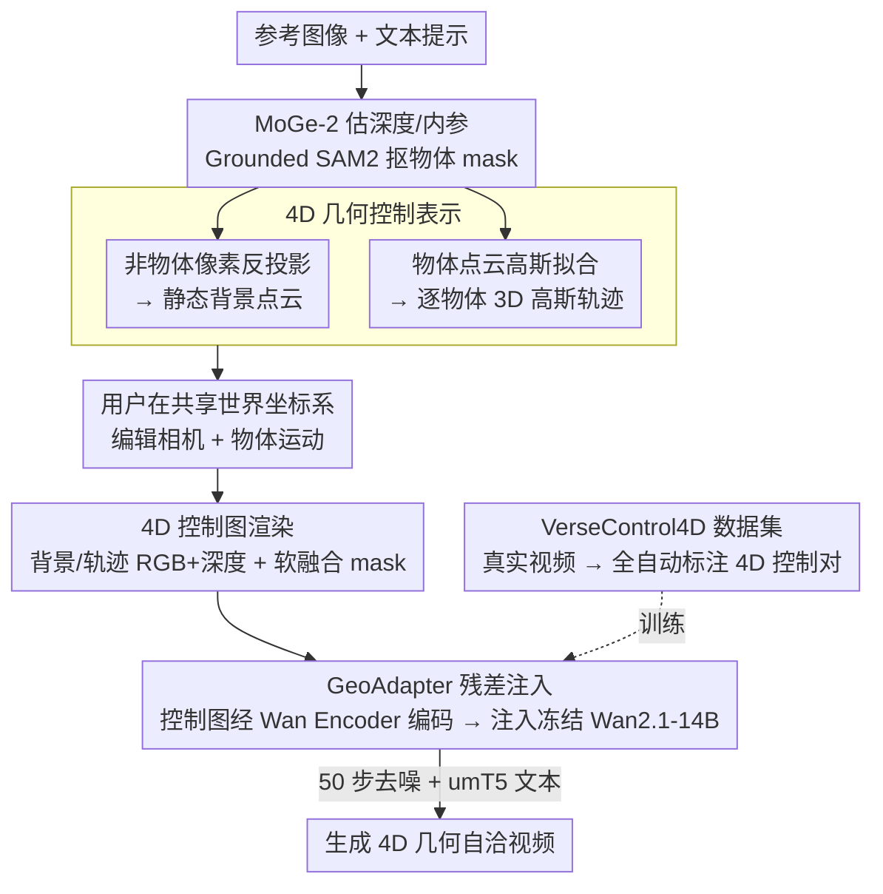

# VerseCrafter: Dynamic Realistic Video World Model with 4D Geometric Control

**会议**: CVPR 2026  
**arXiv**: [2601.05138](https://arxiv.org/abs/2601.05138)  
**代码**: [https://sixiaozheng.github.io/VerseCrafter_page/](https://sixiaozheng.github.io/VerseCrafter_page/)  
**领域**:视频生成
**关键词**: 视频世界模型、4D几何控制、3D高斯轨迹、相机与物体运动、视频扩散模型

## 一句话总结
提出 VerseCrafter，一个基于4D几何控制表示（静态背景点云 + 逐物体3D高斯轨迹）的视频世界模型，通过轻量 GeoAdapter 将4D控制信号注入冻结的 Wan2.1-14B 视频扩散模型，实现了对相机和多物体运动的精确、解耦控制，同时构建了包含 35K 样本的真实世界数据集 VerseControl4D。

## 研究背景与动机

1. **领域现状**：视频世界模型旨在模拟动态真实世界环境，近期方法通过文本、动作或相机轨迹调节视频生成。相机控制方面已有 CameraCtrl、MotionCtrl 等工作通过 Plücker 编码或 3D 先验注入实现视点控制。物体运动控制主要依赖 2D 线索（轨迹点、光流、mask、2D bbox）。

2. **现有痛点**：(a) 2D 控制信号在大视角变化下不鲁棒，缺乏 3D 感知；(b) 更先进的 3D 信号如 3D bbox 过于刚性、SMPL-X 只适用于人体、稀疏3D轨迹常有噪声和不完整；(c) 现有方法的控制空间是碎片化的，相机和物体运动不在统一坐标系下，无法协调控制。

3. **核心矛盾**：理想的世界模型应模拟完整的 4D 时空空间，但视频只捕捉 2D 投影。需要一种紧凑、可编辑且类别无关的 4D 几何状态表示来统一相机和多物体运动控制。

4. **本文目标**：(a) 设计统一的 4D 几何控制表示；(b) 在共享世界坐标系下实现相机与多物体运动的解耦控制；(c) 构建大规模训练数据。

5. **切入角度**：用 3D 高斯分布描述物体的概率性 3D 占据——均值定义运动路径，协方差捕捉空间范围和朝向，天然支持软性、灵活、类别无关的物体建模。

6. **核心 idea**：用静态背景点云 + 逐物体 3D 高斯轨迹在共享世界坐标系下构成统一 4D 几何状态，渲染为多通道控制图后通过 GeoAdapter 驱动冻结视频扩散模型生成。

## 方法详解

### 整体框架
VerseCrafter 要解决的是：让用户在一个统一的 3D 世界坐标系里同时、且互不干扰地指挥"相机怎么动"和"画面里每个物体怎么动"，再生成一段几何上自洽的真实视频。它的整条链路是把一张静态参考图"撑"成一个可编辑的 4D 几何状态，再把这个状态渲染成扩散模型看得懂的控制图。

具体地，给定一张参考图像和文本提示，系统先用 MoGe-2 估出深度和相机内参，用 Grounded SAM2 抠出用户想控制的物体 mask；非物体区域的像素被反投影成静态**背景点云**，每个物体则被拟合成一条随时间演化的 **3D 高斯轨迹**。用户在共享世界坐标系里指定相机怎么走、物体怎么动，系统把整个 4D 状态逐帧渲染成多通道**控制图**（背景 RGB/深度、轨迹 RGB/深度、软融合 mask）。这些控制图经 Wan Encoder 编码后送进 GeoAdapter，以残差方式调制一个被冻结的 Wan2.1-14B DiT 骨干，结合 umT5 文本嵌入去噪生成最终视频。

### 关键设计

**1. 4D 几何控制表示：用概率高斯而非刚性几何体来描述物体占据**

理想的世界模型要模拟完整的 4D 时空，但视频只是它的 2D 投影，所以需要一种紧凑、可编辑、又不挑物体类别的几何状态。本文把场景拆成两部分放进同一个世界坐标系：静态背景用点云 $P^{\text{bg}}$ 表示，由输入图像中非物体区域的像素反投影到 3D 得到；每个动态物体用一条 3D 高斯轨迹 $\{\mathcal{G}_o^t\}_{t=1}^T$ 表示，每个时刻的高斯由均值 $\boldsymbol{\mu}_o^t$（物体位置）和协方差 $\mathbf{\Sigma}_o^t$（物体的空间范围与朝向）刻画，初始化时对物体点云做一次全协方差高斯拟合。

之所以选高斯而不是别的，是因为前人用的几种 3D 信号各有硬伤：3D bbox 太刚性、SMPL-X 只能描述人体、稀疏轨迹点只有位置没有形状。高斯用一个概率椭球"软"地描述物体在空间里占了多大、朝哪个方向，天然类别无关，而且维度低、好编辑——用户可以直接在 Blender 里把高斯可视化成椭球，靠拖拽和打关键帧来指定整条运动轨迹。

**2. 4D 控制图渲染：把背景和物体拆到独立通道，让相机运动和物体运动互不串扰**

有了 4D 几何状态，还得把它翻译成扩散模型能消费的逐帧信号。每一帧渲染三类图：背景 RGB/深度，是把 $P^{\text{bg}}$ 在目标相机视角下投影出来；轨迹 RGB/深度，是把每个物体的高斯投影成一块软椭圆足迹；软融合 mask，则通过反转背景可见性、再并上各高斯足迹得到，用来告诉扩散模型哪些区域需要它自己去合成/覆盖。第一帧直接保留原始输入图像作为锚点。

关键在于背景和轨迹走的是**解耦的通道**：背景图只随相机视角变化，轨迹图只随物体运动变化。这样两路控制信号不会互相污染——模型看到背景在动就知道是相机在动，看到足迹在挪就知道是物体在动，从而能分别学习这两种运动模式，同时还保持了整体的几何一致性。

**3. GeoAdapter：用零初始化的旁路分支把控制信号注入冻结骨干**

为了既精确注入 4D 控制、又不破坏 Wan2.1 本身强大的视频先验，本文不去微调骨干，而是挂一个轻量旁路。四组 RGB/深度控制图先经冻结的 Wan Encoder 编码，软融合 mask 被重塑到潜在分辨率，所有几何潜在量按通道拼接成一个时空几何张量。GeoAdapter 本身是一个 DiT 分支，隐藏维度和 Wan-DiT 一致但层数少得多；每隔 $k=5$ 个 DiT block 配一个 GeoAdapter block，后者的输出经一个零初始化的线性投影，作为残差加回对应的 DiT block。

两个细节让训练既稳又快：GeoAdapter block 的权重从它所配对的 DiT block 拷贝来初始化，等于一开始就站在骨干的"肩膀"上；输出投影零初始化，保证训练第一步旁路对骨干毫无扰动，再逐步学会注入控制——这正是 ControlNet 式 adapter 在 4D 时空控制上的延伸。

**4. VerseControl4D 数据集：全自动流水线把真实视频标注成 4D 控制对**

4D 控制信号的训练数据本来几乎不存在，本文用一条全自动流水线从真实视频里"挖"出来。它从 Sekai-Real-HQ 和 SpatialVID-HQ 取 81 帧片段，先用 Grounded SAM2 做物体过滤（保留含 1–6 个可控物体的片段），再用美学/亮度评分做质量过滤；然后用 Qwen2.5-VL-72B 生成文本描述，用 MoGe-2 + UniDepth V2 + MegaSAM 估计深度和相机轨迹，重建 3D 点云、拟合高斯轨迹并渲染出控制图。最终得到 35K 训练 + 1K 验证样本，正是大规模训练得以成立的基础。

### 一个完整示例

以一张城市街景参考图为例，画面里有一辆汽车和一个行人是用户想控制的对象。系统先用 MoGe-2 估出整张图的深度与相机内参，用 Grounded SAM2 抠出汽车和行人两个 mask；剩下的建筑、马路、灯柱等像素被反投影成背景点云 $P^{\text{bg}}$，汽车和行人则各自拟合成一个 3D 高斯。

接下来用户进 Blender：把代表汽车的椭球沿马路往前拖、在几个时间点打上关键帧，让它从近驶向远；把代表行人的椭球横向挪过斑马线；同时指定相机绕到侧前方做一个环绕运镜。系统据此把整段 4D 状态渲染成 81 帧控制图——每帧里背景图随环绕镜头平滑换视角，汽车足迹逐帧缩小并后退、行人足迹横向平移，软融合 mask 标出这两块需要重新合成的区域。最后这些控制图经 Wan Encoder 编码、由 GeoAdapter 以残差注入冻结的 Wan2.1-14B，去噪 50 步后生成一段相机在环绕、车在远去、人在过街且三者几何一致的视频。

### 损失函数 / 训练策略
- 使用 Adam 优化器，学习率 2e-5，恒定学习率 + 100 步预热
- 分阶段训练：先在 480P 上训练 2,500 步，再在 720P 上微调 2,500 步
- Classifier-free guidance（CFG）训练：以 0.1 概率随机丢弃文本条件
- 推理时使用 50 步去噪，CFG 尺度 5.0
- 16 张 96GB GPU，总训练时间约 380 小时

## 实验关键数据

### 主实验（联合相机+物体运动控制）

| 方法 | Overall Score↑ | Imaging Quality↑ | RotErr↓ | TransErr↓ | ObjMC↓ |
|------|---------------|-----------------|---------|-----------|--------|
| Perception-as-Control | 83.66 | 66.81 | 5.006 | 8.767 | 6.556 |
| Yume | 85.47 | 71.16 | 7.560 | 8.735 | 7.959 |
| Uni3C | 83.55 | 68.06 | 1.361 | 7.731 | 5.883 |
| **VerseCrafter** | **88.10** | **72.70** | **0.890** | **3.103** | **2.507** |

### 消融实验（3D 表示与控制设计）

| 配置 | Overall Score | RotErr | TransErr | ObjMC |
|------|-------------|--------|----------|-------|
| Full (3D Gaussian) | **88.10** | **0.890** | **3.103** | **2.507** |
| 3D Bounding Box | 85.45 | 1.350 | 3.805 | 4.520 |
| 3D Point Trajectory | 85.57 | 1.298 | 3.281 | 6.896 |
| w/o depth | 85.64 | 1.177 | 3.900 | 4.929 |
| BG & FG Merged | 85.72 | 1.080 | 3.803 | 3.726 |

### 关键发现
- **3D 高斯轨迹全面优于 3D bbox 和点轨迹**：ObjMC 分别从 4.520、6.896 降到 2.507，因为高斯提供了形状和朝向信息。点轨迹的 ObjMC 最差（6.896），因为无法编码物体大小。
- **深度信息至关重要**：去掉深度后前后景排序错误（灯柱被拉到建筑物前方），TransErr 从 3.103 升到 3.900。
- **解耦控制优于合并控制**：合并背景和前景控制后物体运动精度显著下降（ObjMC 从 2.507 升到 3.726），因为模型无法区分相机运动和物体运动。
- **静态场景相机控制**：VerseCrafter 的 RotErr（0.650）和 TransErr（2.587）远低于 FlashWorld（1.792/3.257）和 ViewCrafter（2.101/9.868），体现了 4D 几何控制的精确性。

## 亮点与洞察
- **3D 高斯轨迹作为通用物体运动表示**：用概率分布替代刚性几何体，兼顾形状编码和灵活性，可自然处理任意类别的物体。这种表示可迁移到自动驾驶、机器人等需要物体运动预测的场景。
- **解耦渲染思想精巧**：将相机运动（背景变化）和物体运动（前景变化）通过独立控制通道分离，使模型可以分别学习两种运动模式而不混淆。这一思路对任何多信号控制的生成模型都有参考价值。
- **零初始化 + 权重继承的 adapter 训练策略**：GeoAdapter 从配对 DiT block 权重初始化，输出经零初始化线性层注入，既确保训练稳定又让 adapter 快速适应新任务。

## 局限与展望
- **推理成本高**：生成一个 81 帧 720P 视频需要 8 张 96GB GPU 约 1152 秒，离实时应用还很远。
- **依赖单视图深度估计**：背景点云和初始高斯从单张图像重建，大基线视角变化时会出现遮挡区域的缺失。
- **数据集主要是户外/城市场景**：VerseControl4D 来源于 Sekai-Real-HQ 和 SpatialVID-HQ，室内复杂场景的覆盖可能不足。
- **物体交互未建模**：多物体间的碰撞、遮挡等物理交互没有显式约束，可能产生不真实的穿透效果。

## 相关工作与启发
- **vs Yume**: Yume 通过文本/动作 token 控制4D生成，但缺乏精确的相机和物体运动控制（RotErr=7.560 远高于本文的 0.890）。VerseCrafter 用显式几何状态替代隐式控制，精度大幅提升。
- **vs Uni3C**: Uni3C 使用 SMPL-X 控制物体运动，受限于人体类别，且只能控制单人。VerseCrafter 的 3D 高斯轨迹是类别无关的，支持多物体。
- **vs ControlNet**: GeoAdapter 的设计灵感来自 ControlNet 的 adapter 式注入，但扩展到 4D 时空控制，且使用解耦的多通道控制图。

## 评分
- 新颖性: ⭐⭐⭐⭐⭐ 4D 几何控制表示和 3D 高斯轨迹作为运动控制信号是全新的设计
- 实验充分度: ⭐⭐⭐⭐⭐ 联合控制/相机控制/消融实验全面，定量定性比较充分
- 写作质量: ⭐⭐⭐⭐ 方法描述清晰，但公式密度较高
- 价值: ⭐⭐⭐⭐⭐ 为视频世界模型提供了统一的 4D 控制接口，数据集和方法都有很高的复用价值

<!-- RELATED:START -->

## 相关论文

- [\[CVPR 2026\] SeeU: Seeing the Unseen World via 4D Dynamics-aware Generation](seeu_seeing_the_unseen_world_via_4d_dynamics-aware_generation.md)
- [\[AAAI 2026\] 3D4D: An Interactive Editable 4D World Model via 3D Video Generation](../../AAAI2026/video_generation/3d4d_an_interactive_editable_4d_world_model_via_3d_video_generation.md)
- [\[CVPR 2026\] Diff4Splat: Repurposing Video Diffusion Models for Dynamic Scene Generation](diff4splat_controllable_4d_scene_generation_with_latent_dynamic_reconstruction_m.md)
- [\[CVPR 2026\] Towards Realistic and Consistent Orbital Video Generation via 3D Foundation Priors](orbital_video_3d_foundation_priors.md)
- [\[CVPR 2026\] FaceCam: Portrait Video Camera Control via Scale-Aware Conditioning](facecam_portrait_video_camera_control_via_scale-aware_conditioning.md)

<!-- RELATED:END -->
