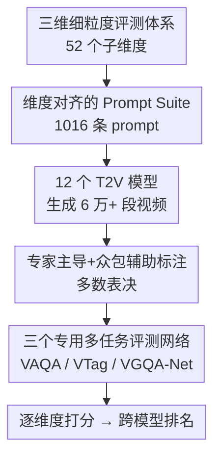

# VGA-Bench: A Unified Benchmark and Multi-Model Framework for Video Aesthetics and Generation Quality Evaluation

**会议**: CVPR 2026  
**论文**: [CVF Open Access](https://openaccess.thecvf.com/content/CVPR2026/html/Jiang_VGA-Bench_A_Unified_Benchmark_and_Multi-Model_Framework_for_Video_Aesthetics_CVPR_2026_paper.html)  
**代码**: 待确认（论文承诺发布 benchmark、评测模型 API 与全部生成视频）  
**领域**: 视频生成 / AIGC 评测 / 视频美学  
**关键词**: 视频生成评测, 视频美学, AIGC benchmark, 多任务评测网络, T2V

## 一句话总结
VGA-Bench 把文生视频（T2V）的评测从"真不真"扩展到"美不美"，用「美学质量 / 美学标签 / 生成质量」三维 52 个细粒度子维度、1016 条维度对齐的 prompt、12 个模型生成的 6 万段视频，并训练 VAQA-Net / VTag-Net / VGQA-Net 三个专用网络做端到端自动打分，摆脱对外部模型的依赖，给出与人类判断对齐的跨模型横评。

## 研究背景与动机
**领域现状**：扩散模型与 DiT 架构（Sora 之后）让 T2V 能从文本生成时序连贯、画质细腻的视频，应用场景从数字艺术到影视制作不断扩张。随之而来，社区需要一套能可靠、可解释地衡量这些模型好坏的评测框架。

**现有痛点**：传统指标（FVD、CLIP Score 及其升级版）只盯"技术保真度"——时序一致性、文本对齐、画面失真程度，捕捉不到更高层的感知质量，尤其是真正影响观感的"美学表现力"。即便是开创性的 V-Bench，也把"视频美学"压缩成一个单一分数，且重度依赖外部打分模型（MUSIQ、DINO），导致粒度不足、偏差显著、可控性差。

**核心矛盾**：用户期待早已越过"没有伪影、动作合理"这种底线，转向"构图是否赏心悦目、光影是否讲究、色彩是否和谐、表情是否到位"这类艺术性诉求；但现有 benchmark 既没有对构图/色彩/光影做细粒度建模，又因依赖通用预训练模型间接推断，难以对齐真实人类感知。

**本文目标**：构建一个能"联合评估生成质量 + 美学质量 + 视觉形式要素（tags）"的统一、细粒度 benchmark，并配套可规模化、自动化的评测器。

**切入角度**：作者认为"美"是可拆解、可标注、可量化的——把摄影/影视的专业美学语言（构图、光源、景深、色温……）系统化成一套维度体系，就能让评测从"看着好不好"走向"美在哪、为什么美"。

**核心 idea**：用一套三维细粒度 taxonomy 取代单一美学分数，并训练专门看 AIGC 视频的多任务评测网络取代外部通用打分模型，实现端到端、一致、可扩展的自动评测。

## 方法详解

### 整体框架
VGA-Bench 是一条"先定标尺、再造数据、最后训练评测器"的完整流水线。先用一套三层 taxonomy（美学质量 / 美学标签 / 生成质量，共 52 个子维度）确定要量什么；据此设计 1016 条"维度对齐"的 prompt，用 12 个主流 T2V 模型生成 6 万多段视频构成最大的横评底座；对其中一个子集做"专家主导 + 众包辅助"的人工标注；再用这些标注训练 VAQA-Net（美学质量打分）、VTag-Net（美学标签分类）、VGQA-Net（生成质量打分）三个专用网络，最终对 12 个模型做逐维度自动打分与排名，全程不再调用外部打分模型。

### 关键设计

**1. 三维细粒度评测体系：把"美"拆成 52 个可量化子维度**

针对"现有 benchmark 把美学塌缩成单一分数"的痛点，作者把评测拆成三大层、共 52 个子维度。**美学质量（10 维）** 改编自 VADB 数据集，包括 Overall、构图（Com）、景别（SS）、光照（Lig）、影调（VT）、色彩（Col）、景深（DoF）、表情（Exp）、服装（Cos）、妆容（Mak）——并且专门讨论这些维度在生成视频里的"病态表现"（如构图常见"漂浮构图 / 视觉中心偏移"、光照出现"均匀打光 / 非物理光源"、表情"机械僵硬"）。**美学标签（11 维，展开成 21 类标签）** 把摄影理论结构化成可分类的离散标签，如构图类型（三分法/对称/居中/框架式……）、光源数量、光源位置、光质（硬光/软光/漫射）、光色、景别、景深、饱和度、亮度、色温、对比度。**生成质量（31 维）** 在 V-Bench 基础上细化为三类：视频-文本一致性（11 项，如角色/动作/场景/物体属性与文本对齐）、真实性与合理性（15 项，如刚体碰撞、流体运动、天气表现的物理合理性）、基础质量（5 项，如清晰度、无噪声、静态内容不畸变/不漂移）。如 Table 1 所示，这套体系的总维度数（52）和美学维度数（21）都远超 V-Bench（16/1）、V-Bench2.0（18/2）等。

**2. 维度对齐的 Prompt Suite：prompt 必须显式点名要考的维度**

核心设计原则是——**待考的美学或生成质量维度必须在 prompt 里被明确写出**，模型才能感知并响应该属性，评测才有意义。例如只有 prompt 显式包含"用三分法构图"，这段视频才会被用于构图评估；否则该维度不纳入评测。这条原则直接规避了"凭空猜测未提及属性"的主观偏差。在此之上强调多样性：prompt 长短不一、覆盖单维与多维场景、横跨各类主题。最终构建 1016 条 prompt（美学质量 200 + 美学标签 220 + 生成质量 596），每个维度至少 50 条以保证统计有效性，每条支持 1–5 个维度组合，并额外提供 508 / 127 两个轻量子集做高效评测。prompt 由 LLM 辅助生成：美学维度喂入 VADB 中高分真实视频评论里强调特定美学属性的描述句（如"balanced composition""soft lighting"）引导风格；标签维度直接喂入类别标签（如 Back Light、Shallow DOF）让 LLM 生成显式含该关键词的自然语句；生成质量维度先把子维度归纳成代表性关键词再驱动 LLM 生成。

**3. 专家主导 + 众包辅助的标注协议：保证 6 万级数据的标注一致性**

为训练三个评测网络，作者采用"专家示范 → 众包跟标 → 专家批量抽检"的范式：影视行业专家按预定义维度与评分细则先做示范标注，众包团队照例完成其余数据，专家再做批量抽样审计——一旦发现标注错误，整批驳回重标，以此保证一致性。所有标注严格遵循 prompt 设计原则：标注者只给 prompt 里显式提到的维度打分。美学质量与标签沿用 VADB 的标准化打分细则，每个美学子维度按 0–10 打分、取三人平均；美学标签作为多标签分类任务，每样本三人独立标注、采用"多数表决"（至少两人一致才保留）。生成质量为每个维度设计带结构化选项的评估问题，选项本质是有序等级分（如物体-文本对齐分 -1 无效 / 1 完全不一致 / 2 部分一致 / 3 完全一致），其中 -1（无效问题）用于丢弃"一致性维度缺目标"或"真实性维度故意描述非现实场景"的样本，结果同样用多数表决确定。

**4. 三个专用多任务评测网络：摆脱外部打分模型，端到端自动评测**

针对"现有指标依赖外部通用模型、引入偏差"的痛点，作者训练三个专门看视频的评测器（结构见原文 Figure 4）。**VAQA-Net（美学质量）** 与 **VTag-Net（美学标签）** 用 VADB 第一阶段在真实视频打分/打标签任务上预训练的视频编码器初始化（该编码器用双文本编码器 + 动态融合模块），本工作中冻结这些编码器——目的是让模型继承从专业影视数据中学到的"美学理解力"，因为真实（尤其专业制作的）视频在构图、光影、叙事节奏上体现了刻意的艺术决策，是教模型识别"有意义的美"的不可替代资源；第二阶段在 12 个生成模型产出的 1300 段生成视频上微调。**VGQA-Net（生成质量）** 则完全聚焦生成视频，相比前两者在输入 MLP 前多了一条 CLIP 分支；为验证跨模型泛化，从三年里每年选两个代表模型共六个（HunyuanVideo、LTXVideo、Mochi、Latte-1、CogVideoX、Show-1），用其中三个模型的视频训练、另外三个测试，保证训练/测试在模型来源上零重叠。三者协同后整条评测无需再调用 MUSIQ、DINO 等外部打分模型。

## 实验关键数据

### 主实验：12 个 T2V 模型横评
在三个训练好的评测网络上对 12 个按发布时间排序的模型打分（各子维度归一化后求平均），得到三维总分（Table 5）。

| 模型 | 美学分 Aes. | 标签分类 Tag | 生成等级 Gen. |
|------|------|------|------|
| SVD | 0.20 | 0.32 | 0.55 |
| AnimateDiff | 0.36 | 0.30 | 0.49 |
| LaVie | 0.34 | 0.31 | 0.47 |
| Show-1 | 0.29 | 0.32 | 0.28 |
| ModelScope | 0.31 | 0.30 | 0.49 |
| CogVideoX | 0.41 | 0.39 | 0.55 |
| Latte-1 | 0.35 | 0.31 | 0.45 |
| Mochi | 0.21 | 0.34 | 0.54 |
| LTXVideo | 0.22 | 0.34 | 0.47 |
| Hunyuan | 0.45 | 0.36 | 0.55 |
| Wan2.1 | 0.46 | 0.38 | 0.53 |
| **Sora2** | **0.50** | 0.18 | 0.54 |

### benchmark 规模对比（Table 1）
| Benchmark | 总维度 | 美学维度 | 评测模型数 | prompt 数 |
|------|------|------|------|------|
| V-Bench | 16 | 1 | 4 | ~1600 |
| V-Bench2.0 | 18 | 2 | 4 | ~1600 |
| T2V-CompBench | 7 | 0 | 23 | 1400 |
| ChronoMagic-Bench | 4 | 0 | 13 | 1649 |
| StoryEval | 8 | 0 | 11 | 423 |
| **VGA-Bench（本文）** | **52** | **21** | 12 | 1016 |

### 评测网络自身精度
- **VAQA-Net（5 类美学打分准确率，Table 2）**：Overall 76.9%、构图 73.6%、服装最高 77.4%、影调最低 67.9%，整体在 67–77% 区间。
- **VTag-Net（Top-2 标签命中，Table 3）**：跨度较大——对比度 Con 90%、饱和度 Sat 89%、景深 DoF 82% 表现好；而构图类型 CT 仅 45%、景别 ST 57% 偏弱，说明构图/景别这类需要全局语义的标签更难自动判别。
- **VGQA-Net（31 维准确率，Table 4）**：多数维度 70–92%，场景真实性（14）92.6%、动作真实性（13）91% 最高，气体运动真实性（17 之后的运动类，如 18/19/20）在 70–72% 偏低。

### 关键发现
- **Sora2 美学最强但标签分类异常低（0.18）**：美学分 0.50 居首、生成等级也靠前，但标签分类只有 0.18，远低于其它模型——提示其风格化输出可能与标准摄影标签体系对不齐，或评测器在该模型分布上泛化吃力，是个值得追的反常点。
- **"真实"与"美"不强相关**：Mochi 生成等级 0.54 不低，但美学分仅 0.21；说明把美学单独拆出来量是必要的，单一保真度指标会漏判艺术表现力。
- **与人类排名的一致性（Table 6，40 份问卷）**：生成质量维度 Recall@1 达 0.50、Recall@3 0.80、Recall@5 0.83；美学维度 Recall@1 仅 0.10 但 Recall@3/5 升到 0.70/0.80——说明美学排序细到 Top-1 仍难与人对齐（美学本就更主观），但 Top-3/5 粗排已相当可靠。

## 亮点与洞察
- **把"美"工程化**：将摄影/影视专业语言（构图类型、光源位置、光质、色温、景深……）拆成 21 类可分类标签 + 10 维可打分维度，让"美在哪、为什么美"变成可标注、可训练的监督信号，这套 taxonomy 本身就能复用为生成模型的训练优化目标。
- **prompt 显式点名维度的评测协议**：只评 prompt 里写明的维度，从源头消除"未提及属性靠主观脑补"的标注噪声，这条原则简单但对评测可信度极关键，可迁移到任何细粒度可控生成的评测。
- **冻结美学预训练编码器迁移到生成视频**：用真实专业视频学到的美学理解力初始化评测器、再在生成视频上微调，避开"直接在 AIGC 视频上从零学美学"的数据稀缺问题，是个务实的迁移思路。
- **跨模型留出测试**：VGQA-Net 训练/测试在模型来源上零重叠，比同分布评测更能反映"换个没见过的生成器还准不准"。

## 局限与展望
- **评测器精度还有限**：VTag-Net 对构图类型（45%）、景别（57%）这类全局语义标签准确率偏低，会直接影响相关维度的横评可信度；用它给模型排名时这些维度的结论需谨慎。
- **Sora2 标签分类 0.18 的反常未被解释**：论文没深入分析这是评测器泛化失败还是 Sora2 真的不"守"标准摄影规则，给读者留下解读空隙。
- **美学 Recall@1 仅 0.10**：自动评测在最细的美学排序上仍远未对齐人类，"哪个模型最美"这种 Top-1 结论暂不可全信。
- **用户研究规模小**：仅 40 份非专家问卷、每维 5 组 prompt，统计力有限；且非专家与专家审美可能本就有系统性差异。
- **数据/代码尚待开放**：论文承诺发布 benchmark、模型 API 与 6 万段视频，但缓存中未给出可用链接，复现性以最终发布为准。

## 相关工作与启发
- **vs V-Bench / V-Bench2.0**：二者首次把视频评测拆成多子任务并引入人工标注，但把"美学"压成 1–2 维、且重度依赖 MUSIQ/DINO 等外部打分模型。本文在其基础上把美学细化到 21 维、生成质量细化到 31 维，并用自训练的专用网络替换外部模型，粒度与可控性都更高。
- **vs T2V-CompBench / ChronoMagic-Bench / StoryEval**：它们各自从组合性、时序连贯、叙事一致等单一视角切入，美学维度为 0。本文的差异在于把"美学"作为与生成质量并列的一等公民系统建模。
- **vs 传统指标（FVD / CLIP Score）**：传统指标只量技术保真度，无法捕捉构图/光影/色彩等感知美学；本文用人类标注 + 多任务网络直接对齐人类对"美"的判断。

## 评分
- 新颖性: ⭐⭐⭐⭐ 首个把视频美学细化到 21 维并配专用评测网络的统一 benchmark，从"how real"转向"how beautiful"。
- 实验充分度: ⭐⭐⭐⭐ 12 模型横评 + 三网络精度 + 跨模型留出 + 用户研究齐全，但用户研究规模偏小、部分维度精度低。
- 写作质量: ⭐⭐⭐⭐ taxonomy 与协议讲得清晰，但 Sora2 标签异常等反常结果缺少分析。
- 价值: ⭐⭐⭐⭐ 提供可复用的细粒度美学 taxonomy、维度对齐评测协议与端到端评测器，对 AIGC 视频评测与模型优化有实际基础设施价值。

<!-- RELATED:START -->

## 相关论文

- [\[CVPR 2026\] VGA-Bench: A Unified Benchmark for Video Aesthetics and Generation Quality Evaluation](vga_bench_unified_benchmark_for_video_aesthetics_and_generation_quality.md)
- [\[CVPR 2026\] THEval: Evaluation Framework for Talking Head Video Generation](theval_evaluation_framework_for_talking_head_video_generation.md)
- [\[CVPR 2026\] DreamStyle: A Unified Framework for Video Stylization](dreamstyle_a_unified_framework_for_video_stylization.md)
- [\[CVPR 2026\] TV2TV: A Unified Framework for Interleaved Language and Video Generation](tv2tv_a_unified_framework_for_interleaved_language_and_video_generation.md)
- [\[CVPR 2026\] MultiShotMaster: A Controllable Multi-Shot Video Generation Framework](multishotmaster_a_controllable_multi-shot_video_generation_framework.md)

<!-- RELATED:END -->
