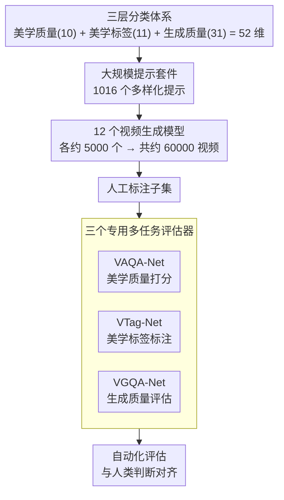

# VGA-Bench: A Unified Benchmark for Video Aesthetics and Generation Quality Evaluation

**会议**: CVPR 2026  
**arXiv**: [2604.10127](https://arxiv.org/abs/2604.10127)  
**代码**: 有  
**领域**: 视频生成  
**关键词**: 视频质量评估, 美学评估, AIGC评估, 多任务评估器, 视频生成

## 一句话总结

VGA-Bench提出了一个统一的AIGC视频评估基准，包含三层分类体系（美学质量、美学标签、生成质量）、1016个提示词、60000个视频和三个专用评估模型，实现了与人类判断对齐的自动化评估。

## 研究背景与动机

**领域现状**：AIGC视频生成技术飞速发展（扩散模型、Transformer等），但评估框架仍聚焦于技术保真度（FVD、CLIP Score），忽视了美学吸引力等高层感知质量。

**现有痛点**：V-Bench等基准将"视频美学"简化为单一分数，严重依赖外部评分模型（MUSIQ/DINO），粒度不足、偏差显著、可控性差。

**核心矛盾**：视频生成模型日益强大，但缺乏综合、细粒度、可解释的评估体系来同时衡量技术质量和美学质量。

**本文目标**：建立涵盖生成质量、美学质量和视觉形式元素的三维统一评估体系。

**切入角度**：设计分层分类法，为每个维度分解出细粒度子属性（构图、色彩和谐、光照、运动美学等），并训练专用评估模型。

**核心idea**：用三个专用神经评估器替代外部评分模型的拼凑，实现端到端、一致且可扩展的自动化评估。

## 方法详解

### 整体框架

VGA-Bench 的核心是一套**三层正交分类体系**，并以此为纲构建数据、训练评估器：

- **美学质量（Aesthetic Quality）**：整体美感及构图、镜别、光照、影调、色彩、景深、表情、服装、妆容等 10 个细粒度维度（改编自 VADB 数据集）；
- **美学标签（Aesthetic Tagging）**：构图类型、光源数量/位置/质感/色彩、镜别、景深、饱和度、亮度、色温、对比度等 11 类可量化的摄影形式元素，回答"这段视频在视觉语言上长什么样"；
- **生成质量（Generation Quality）**：在 V-Bench 基础上细化为视频-文本一致性、真实性/合理性、基础质量三大类共 31 个子维度。

三层合计 52 个维度（其中美学相关 21 个）。构建流程是一条数据生产到评估器训练的串行管线：分类体系 → 1016 个多样化提示 → 12 个视频生成模型各生成约 5000 个、合计约 60000 个视频 → 人工标注子集 → 训练 VAQA-Net、VTag-Net、VGQA-Net 三个多任务评估器 → 替代外部模型做自动化评估。

### 关键设计

**1. 三层分类评估体系：把"视频好不好"拆成三个互不替代的维度**

以往基准（如 V-Bench）把"美学"压成单一分数，等于把构图、色彩、光照这些彼此独立的因素揉成一团，既看不出问题出在哪，也无法解释打分依据。VGA-Bench 把评估正交地拆成三层：**美学质量**衡量整体美感及构图、镜别、光照、影调、色彩、景深等 10 个细粒度维度；**美学标签**自动识别构图类型、光源、镜别、色温、对比度等 11 类可量化的摄影形式元素，回答"这段视频的视觉语言长什么样"；**生成质量**则盯住技术保真度，在 V-Bench 框架上细化为视频-文本一致性、真实性/合理性、基础质量三大类共 31 个子维度。对比 V-Bench 的 16 个维度（仅 1 个美学维度），VGA-Bench 三层合计 52 个维度、其中 21 个直接刻画美学，覆盖范围和粒度都明显更细，问题因此能定位到具体属性而非一个笼统的分数。

**2. 大规模多样化提示套件与数据集：让跨模型比较站在公平且有挑战性的测试集上**

要公平地比较不同生成模型，测试输入必须既多样又有足够规模，否则结论容易被少数简单提示带偏。VGA-Bench 依据上述分类体系精心设计 1016 个提示，覆盖各类场景、动作、风格以及刻意设计的挑战性情形；再用 12 个最新视频生成模型，每个生成约 5000 个视频，合计约 60000 个视频，构成迄今规模最大的集成测试平台。规模和多样性到位后，配合人工标注子集，三个评估器既有足够数据训练，跨模型的优劣对比也才有统计意义上的可信度。

**3. 三个专用多任务评估模型：用为 AIGC 视频训练的评估器替掉外部评分模型的拼凑**

旧基准的美学分往往直接借用 MUSIQ、DINO 这类外部模型，但它们并不是为 AIGC 视频设计的——训练分布、标注口径都对不上，套用过来会引入系统性偏差。VGA-Bench 对应三层各训一个评估器：VAQA-Net 预测美学质量分数，VTag-Net 做美学标签的自动标注，VGQA-Net 评估生成与基础质量属性。三者都基于专业人工标注子集训练，每个模型在多任务框架下同时处理自己那一层下的多个子属性，从而把打分口径直接对齐到人类判断，而不是绕道一个口径不明的外部模型。这样评估链路从"外部模型拼凑"变成端到端、口径一致、可随基准一起扩展的自有组件。

### 损失函数 / 训练策略

三个评估模型分别使用人工标注数据训练。多任务学习框架内每个模型处理各自维度下的多个子属性。

## 实验关键数据

### 主实验

| 评估模型 | 与人类对齐 | 覆盖维度 |
|---------|-----------|---------|
| VAQA-Net | 高对齐 | 美学质量多维度 |
| VTag-Net | 高准确率 | 美学标签自动化 |
| VGQA-Net | 高对齐 | 生成质量多维度 |

### 与现有基准对比（Table 1）

| 维度 | V-Bench | VGA-Bench |
|------|---------|-----------|
| 总维度数 | 16 | 52 |
| 美学维度 | 1 | 21 |
| 被评测生成模型数 | 4 | 12 |
| 提示数 | ~1600 | 1016(精选) |

### 关键发现

- 专用评估模型在与人类判断对齐上显著优于通用外部模型
- 不同视频生成模型在美学和技术质量上存在明显的优劣势分化
- 美学质量与生成质量并不总是正相关——有些模型技术保真度高但美学表现差

## 亮点与洞察

- **从技术保真度扩展到美学智能**：VGA-Bench将AIGC评估从"看起来真不真"提升到"看起来美不美"
- **评估基础设施的价值**：60000个视频+人工标注+三个评估模型构成了完整的评估生态
- **全开源承诺**：包括分类法、提示模板、标注数据、API和视频数据集

## 局限与展望

- 美学评估本身具有主观性，人工标注可能存在偏差
- 1016个提示虽精选但覆盖范围仍有限
- 评估模型可能随视频生成技术进步而需要持续更新

## 相关工作与启发

- **vs V-Bench**: V-Bench是首次系统化尝试但美学维度过于简化（1个分数），VGA-Bench大幅扩展
- **vs FVD/CLIP Score**: 传统指标仅衡量技术保真度，VGA-Bench同时覆盖美学和生成质量

## 评分

- 新颖性: ⭐⭐⭐⭐ 美学质量细粒度分类法和专用评估器
- 实验充分度: ⭐⭐⭐⭐⭐ 12个模型×60000视频×人工标注
- 写作质量: ⭐⭐⭐⭐ 体系完整
- 价值: ⭐⭐⭐⭐ AIGC评估基础设施贡献

<!-- RELATED:START -->

## 相关论文

- [\[CVPR 2026\] SLVMEval: Synthetic Meta Evaluation Benchmark for Text-to-Long Video Generation](slvmeval_synthetic_meta_evaluation_benchmark_for_text-to-long_video_generation.md)
- [\[ICCV 2025\] WorldScore: A Unified Evaluation Benchmark for World Generation](../../ICCV2025/video_generation/worldscore_a_unified_evaluation_benchmark_for_world_generation.md)
- [\[CVPR 2026\] UniTalking: A Unified Audio-Video Framework for Talking Portrait Generation](unitalking_a_unified_audio-video_framework_for_talking_portrait_generation.md)
- [\[ICML 2026\] T2AV-Compass: Towards Unified Evaluation for Text-to-Audio-Video Generation](../../ICML2026/video_generation/t2av-compass_towards_unified_evaluation_for_text-to-audio-video_generation.md)
- [\[CVPR 2026\] UniAVGen: Unified Audio and Video Generation with Asymmetric Cross-Modal Interactions](uniavgen_unified_audio_and_video_generation_with_asymmetric_cross-modal_interact.md)

<!-- RELATED:END -->
