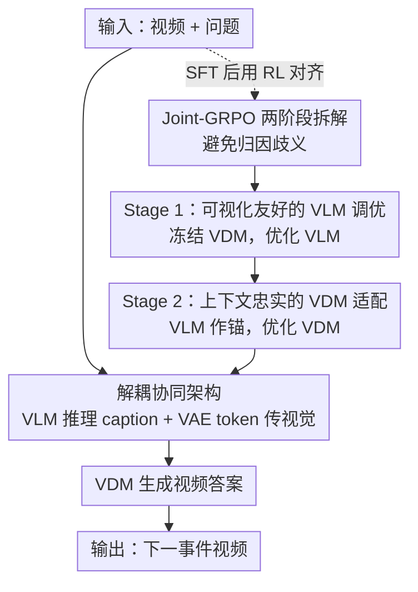

# Video-as-Answer: Predict and Generate Next Video Event with Joint-GRPO

**会议**: CVPR 2026  
**论文**: [CVF Open Access](https://openaccess.thecvf.com/content/CVPR2026/html/Cheng_Video-as-Answer_Predict_and_Generate_Next_Video_Event_with_Joint-GRPO_CVPR_2026_paper.html)  
**代码**: https://github.com/KlingTeam/VANS  
**领域**: 视频生成 / 多模态推理 / 强化学习对齐  
**关键词**: 视频下一事件预测, 视频生成, GRPO, VLM-VDM 对齐, 多模型协同

## 一句话总结
把"下一事件预测"的答案从文字升级成视频：用 VLM 先推理出下一步该发生什么、再用视频扩散模型把它演出来，并提出 Joint-GRPO 两阶段强化学习把推理与生成两个独立模型用一个共享奖励拧成一股绳，在程序性与预测性两类基准上同时拿下文本预测和视频生成的 SOTA。

## 研究背景与动机
**领域现状**：Next-Event Prediction（NEP）让模型看一段视频 + 一个程序性问题（"接下来怎么做？"）或预测性问题（"接下来会发生什么？"），推断出下一个事件。但已有工作（VLEP、MVP、TEMPURA 等）清一色把答案落在**文字**上——预测一句话描述。

**现有痛点**：很多物理世界的信息用文字根本讲不清。教人打温莎结、教人和肉馅，光靠一段文字描述既不直观也无法贴合用户当前的状态（领带颜色、松紧、已完成到哪一步）。"telling"（告知）远不如"showing"（演示）。

**核心矛盾**：要把答案变成视频（作者命名为 Video-Next-Event Prediction, VNEP），最自然的两条路都不通。
- **级联路线**：VLM 推理出文字 → VDM 照文字生成视频。问题是 VLM 的文字虽然语言上正确，但可能视觉上不现实、VDM 根本画不出来，导致语义与视觉两张皮（semantic-to-visual misalignment）。
- **统一模型路线**：一个模型同时管理解和生成，但存在能力此消彼长的 trade-off，往往一边强一边弱，两头都做不到最优。

**本文目标**：在保留 VLM（擅长语义推理）和 VDM（擅长视觉合成）各自专长的前提下，解决二者"互不知道对方能力边界"的协同问题，让它们像一个整体一样为 VNEP 服务。

**切入角度**：与其牺牲专长去做统一模型，不如**保留两个专才、用强化学习后训练把它们对齐**——让 VLM 学会"说 VDM 画得出的话"，让 VDM 学会"忠实地把 VLM 的话画出来且保持输入视觉一致"。

**核心 idea**：提出 **Joint-GRPO**——用一个跨两个模型的共享奖励、分两阶段把 VLM 与 VDM 协同优化，把级联管线里的语义-视觉鸿沟在 RL 阶段补上。

## 方法详解

### 整体框架
VANS 由两个专职模型串成：输入视频经 ViT 编码出高层视觉特征、问题经 tokenizer 编码，一起喂给 **VLM**，VLM 做指令对齐的推理（reason-then-answer 模板），输出一段描述"下一事件"的 caption 作为语义指挥棒；这段 caption 连同从 $n$ 帧输入抽出的低层 VAE token，一起作为条件喂给 **VDM**，由它生成既符合 caption 语义、又与输入视频视觉连续的新视频。

但若只做监督微调（SFT），VLM 和 VDM 是**各自孤立优化**的：VLM 只为文字准确性训练，拿不到"我的描述能不能被画成合理视频"的反馈；VDM 则要同时协调"VLM 的具体 caption"和"输入的视觉上下文"两路条件，SFT 只给了基础能力、远没对齐。Joint-GRPO 就是在 SFT 之后用强化学习把这道缝补上。配套地，作者构建了 **VANS-Data-100K**（30K 程序性 + 70K 预测性三元组），并从中精选 1K 高质量样本供 RL 阶段使用。

### 关键设计

**1. 解耦而非统一：VLM 推理 + VDM 生成的双模型架构**

针对"统一模型能力此消彼长、级联模型两张皮"的两难，VANS 选择保留两个专才再做对齐。VLM（Qwen2.5-VL-3B）只负责把"看视频 + 读问题 → 推断下一事件"这件事做到极致，产出一段文字 caption；VDM（Wan-2.1-1.3B）只负责把 caption 画成视频。关键的协同细节在于 VDM 同时吃**两路条件**：一路是 caption（决定"画什么事件"），另一路是输入视频经 VAE 编码的低层 token（决定"保持谁的 ID、背景、外观"），这些 token 被拼接进 VDM 的条件 latent 空间，让生成的新场景与输入视觉细粒度对应。这样既不放弃专长，又给后续 RL 对齐留出了把两路信号拧紧的接口。

**2. Joint-GRPO 的两阶段拆解：避免一阶段联合训练的归因歧义**

标准 GRPO 一次只优化一个模型，对 VNEP 这种多模型场景天生使不上劲——分别对 VLM 和 VDM 各跑一次 GRPO，并不会鼓励两者的输出互相成就，鸿沟照旧。但若反过来一阶段同时联合训练两者，又会陷入**归因难题**：当生成视频质量差时，到底是 VLM 的 caption 不行还是 VDM 的生成不行说不清，梯度信号互相打架，训练不稳还容易 reward hacking。作者的破法是把协同拆成**有先后的两阶段**：先在 VDM 冻结的前提下把 VLM 调成"说画得出的话"，再在 VLM 当锚的前提下把 VDM 调成"忠实作画"。GRPO 的优势函数与目标沿用标准形式——对每个输入采 $G$ 条轨迹，按组内均值归一化算优势

$$\tilde{A}_i = \frac{r_i - \bar{r}}{\sigma_r}, \quad \bar{r} = \frac{1}{G}\sum_{j=1}^{G} r_j$$

再用带 clip 和 KL 正则的目标更新策略，保证更新稳定。两阶段的精髓全在下面两个 reward 的设计上。

**3. Stage 1 — 可视化友好的 VLM 调优**

冻结 VDM、只优化 VLM 策略 $\pi_{\text{VLM}}$。对输入视频 $v_{in}$ 和问题 $Q$，从 VLM 采 $G$ 条 caption $\{s_i\}$，每条都让冻结的 VDM 真的生成一段视频 $v^i_{out}$，再用一个**联合奖励**评分：

$$r_1(s_i, v^i_{out}) = \lambda_f\, r_f(s_i) + \lambda_{t1}\, r_{t1}(s_i, s_{gt}) + \lambda_{v1}\, r_{v1}(v^i_{out}, v_{gt})$$

三项分别是：格式奖励 $r_f$（遵守 reason-then-answer 模板给 1 否则 0）、文本保真 $r_{t1}$（caption 与 GT 的 ROUGE-L 相似度）、视频保真 $r_{v1}$（生成视频与 GT 的 CLIP 相似度）。为什么三项缺一不可？只用 $r_{t1}$，VLM 会写出语言正确但 VDM 画不出来的 caption；只用 $r_{v1}$，奖励又太远、太模糊，没法有效指导 VLM 的推理过程。三项合力**逼 VLM 把 VDM 的能力和约束内化进自己的推理**——既要说得对，还要说得 VDM 画得出、可执行。

**4. Stage 2 — 上下文忠实的 VDM 适配**

接着用 Stage 1 已经"可视化友好"的 VLM 当**冻结的锚模型**，优化 VDM 策略 $\pi_{\text{VDM}}$。先让升级后的 VLM 生成锚 caption $s_{anchor}$（与 GT 语义相似度太低的样本丢弃重采，保证质量），再用它条件化 VDM 采 $G$ 段视频，奖励为：

$$r_2(v^i_{out}, s_{anchor}) = \lambda_{v2}\, r_{v2}(v^i_{out}, v_{gt}) + \lambda_{c2}\, r_{c2}(v^i_{out}, s_{anchor})$$

视频保真 $r_{v2}$ 沿用 Stage 1 的视觉度量，保证输出连续、视觉合理；语义对齐 $r_{c2}$ 用 CLIPScore 衡量输出视频与锚 caption 的一致性。$r_{c2}$ 的关键作用是**逼 VDM 严格照 caption 描述的事件去画**，防止它偷懒——忽略 caption、只是把输入视频原样重建或微调一下就交差（即 reward hacking 的静态帧问题）。两项合力让 VDM 在"忠实于 caption"和"延续输入视觉上下文"之间同时达标。

### 损失函数 / 训练策略
SFT 给两个模型打底，再跑 Joint-GRPO 两阶段。VLM 初始化为 Qwen2.5-VL-3B，VDM 初始化为 Wan-2.1-1.3B。RL 用从 100K 数据精选的 1K 高质量样本。优化沿用 GRPO 目标（组内归一化优势 + clip + KL 正则）。

## 实验关键数据

### 主实验
评测从数据集采样 400 程序性 + 400 预测性样本，与训练集严格无重叠。文本侧用 BLEU@1-4、ROUGE-L；视频侧用 FVD（越低越好）、CLIP-V、CLIP-T。

**程序性基准（Procedural）**：

| 模型 | ROUGE-L↑ | FVD↓ | CLIP-V↑ | CLIP-T↑ |
|------|---------|------|---------|---------|
| Omni-Video（统一模型） | 0.1075 | 236.38 | 0.6293 | 0.2323 |
| Gemini-FilmWeaver（最强级联） | 0.2802 | 110.54 | 0.7102 | 0.2773 |
| VANS (SFT) | 0.2812 | 85.34 | 0.7655 | 0.3202 |
| **VANS (Joint-GRPO)** | **0.3631** | **78.32** | **0.8021** | **0.3824** |

**预测性基准（Predictive）**：

| 模型 | ROUGE-L↑ | FVD↓ | CLIP-V↑ | CLIP-T↑ |
|------|---------|------|---------|---------|
| Gemini-FilmWeaver（最强级联） | 0.2298 | 118.27 | 0.6874 | 0.2663 |
| VANS (SFT) | 0.2435 | 94.12 | 0.7512 | 0.3038 |
| **VANS (Joint-GRPO)** | **0.3058** | **86.85** | **0.7872** | **0.3759** |

Joint-GRPO 相比 SFT 在程序性基准上 ROUGE-L 从 0.2812 → 0.3631、CLIP-V 从 0.7655 → 0.8021，文本预测与视频生成同步大涨，说明 RL 对齐确实补上了语义-视觉鸿沟。纯视频扩展模型 Video-GPT 因为不做事件推理，CLIP-T 最低（0.1997）。

### 消融实验

| 配置 | ROUGE-L↑ | FVD↓ | CLIP-V↑ | CLIP-T↑ | 说明 |
|------|---------|------|---------|---------|------|
| SFT | 0.2812 | 85.34 | 0.7655 | 0.3202 | 仅监督微调 |
| GRPO (VLM) | 0.3190 | 83.88 | 0.7798 | 0.3224 | 只对 VLM 跑标准 GRPO |
| GRPO (VDM) | 0.2812 | 84.76 | 0.7671 | 0.3013 | 只对 VDM，几乎无提升 |
| GRPO (VLM+VDM) | 0.2894 | 83.14 | 0.7703 | 0.3398 | 各自孤立优化后级联 |
| Stage 1 (w/o $r_{t1}$) | 0.3498 | 83.31 | 0.7762 | 0.3454 | 去文本保真，caption 准确度掉 |
| Stage 1 (w/o $r_{v1}$) | 0.3625 | 82.34 | 0.7668 | 0.3403 | 去视频保真，视觉一致性掉 |
| Stage 1+2 (w/o $r_{c2}$) | 0.3631 | 78.55 | 0.7921 | 0.3673 | 去语义对齐，易 reward hacking 出静态帧 |
| Stage 1+2 (w/o $r_{v2}$) | 0.3631 | 79.76 | 0.7887 | 0.3806 | 去视频保真，输出连贯性下降 |
| Joint-GRPO (all-in-one) | 0.3012 | — | — | — | 一阶段联合，优化不稳 |
| **Joint-GRPO (完整)** | **0.3631** | **78.32** | **0.8021** | **0.3824** | 完整两阶段 |

### 关键发现
- **联合 > 孤立**：只对 VLM 或 VDM 单独跑 GRPO、或把各自优化好的版本级联，都不如 Joint-GRPO——验证了"两模型必须协同对齐才能跨越语义-视觉鸿沟"的核心论点；其中只优化 VDM 几乎无提升，说明瓶颈主要在 VLM 的推理是否"可视化友好"。
- **分阶段是必需**：all-in-one 一阶段联合因为奖励归因歧义导致优化不稳，ROUGE-L 反而掉到 0.3012；两阶段先稳住 VLM 再调 VDM 才稳定收敛。
- **每项奖励都在干活**：Stage 1 去 $r_{t1}$ 伤 caption 准确（如预测不出"摘口罩"），去 $r_{v1}$ 伤视觉一致；Stage 2 去 $r_{c2}$ 触发 reward hacking 生成静态帧，去 $r_{v2}$ 降连贯性。
- **定性上**，SFT 版仍有 VLM 幻觉（凭空生成"inreview"文字）和动作错位（"加奶酪"画成了倒的动作）；Joint-GRPO 把 caption 校准成"sprinkle cheese"并忠实画出 GT 的"shower"动作。

## 亮点与洞察
- **把"答案模态"从文字升级到视频**，是个真正开新坑的 reframing：很多程序性/物理知识天然适合"演给你看"，VNEP 这个任务定义本身就有价值，配套的 VANS-Data-100K（程序 + 预测两类，30K/70K）也补了数据空白。
- **Joint-GRPO 用"共享奖励 + 分阶段冻结对方"解决多模型 RL 的归因难题**，是可迁移的范式：凡是"推理模块 + 生成模块"级联、又苦于两张皮的系统（如文生图 agent、代码-执行链），都能借鉴"先把上游调成下游友好、再把下游调成忠实上游"的两阶段思路。
- **奖励设计的洞察很实在**：只奖文本相似会出"画不出的对的话"，只奖视频相似又太远带不动推理——必须让上游模型把下游的能力边界内化进自己的输出，这一点对所有 LLM-as-planner 类系统都成立。

## 局限与展望
- **依赖 CLIP 类相似度当奖励**：$r_{v1}/r_{v2}/r_{c2}$ 都基于 CLIP/CLIPScore，对细粒度物理正确性、时序因果一致性其实不敏感，奖励上限受 CLIP 表征能力封顶；论文也观察到 Stage 2 去掉 $r_{c2}$ 就会 reward hacking 出静态帧，说明奖励信号本身还比较脆。
- **模型规模偏小**：VLM 3B + VDM 1.3B，对长链条程序推理和复杂场景生成的天花板有限；更大模型上 Joint-GRPO 的增益是否保持未验证。
- **RL 只用了 1K 精选样本**：高质量样本靠 Gemini-2.5-Flash 自动筛 + 自检，数据质量和多样性受筛选器能力约束；评测也都在自建基准上，缺少外部第三方基准的横向对照。
- **两阶段顺序固定**（先 VLM 后 VDM），是否存在需要交替迭代或反向顺序的场景没探讨。

## 相关工作与启发
- **vs 文本 NEP（VLEP / MVP / TEMPURA / V1-33K）**：他们把下一事件预测当纯文本生成问题，答案止于一句描述；本文把答案模态推进到动态视频，从 telling 走向 showing，并保留文本预测能力作为中间产物。
- **vs 视频扩展模型（Video-GPT）**：视频扩展只按时空模式续帧（如预测球的轨迹），不做事件级推理；VNEP 要求先理解+因果/程序推理再生成，Video-GPT 在 CLIP-T 上最低印证了"没推理就答非所问"。
- **vs 统一理解-生成模型（Omni-Video）**：统一模型在单模型内对齐理解与生成但能力此消彼长；VANS 保留两个专才再用 RL 对齐，定性上避免了 Omni-Video 把"争吵"误判成"打架"、人物外观漂移等问题。
- **vs 标准 GRPO（DeepSeek-Math 起源，后用于视频理解/生成对齐）**：以往 GRPO 都只优化单个模型、单一目标（如对齐生成视频与 prompt）；Joint-GRPO 首次用共享奖励同时协同两个异构模型（推理 VLM + 生成 VDM）。

## 评分
- 新颖性: ⭐⭐⭐⭐⭐ 提出 VNEP 新任务 + Joint-GRPO 多模型协同 RL 范式，双双开新坑
- 实验充分度: ⭐⭐⭐⭐ 主实验 + 细致的奖励分量/阶段消融完整，但全在自建基准、模型规模小，缺第三方对照
- 写作质量: ⭐⭐⭐⭐⭐ 动机推导清晰，把"为什么级联和统一都不行、为什么分两阶段"讲得很顺
- 价值: ⭐⭐⭐⭐⭐ 任务定义、数据集、协同 RL 方法三重贡献，对"推理+生成"级联系统有普适借鉴意义

<!-- RELATED:START -->

## 相关论文

- [\[CVPR 2026\] TempoMaster: Efficient Long Video Generation via Next-Frame-Rate Prediction](tempomaster_efficient_long_video_generation_via_next-frame-rate_prediction.md)
- [\[CVPR 2026\] Chain of Event-Centric Causal Thought for Physically Plausible Video Generation](chain_of_event-centric_causal_thought_for_physically_plausible_video_generation.md)
- [\[CVPR 2026\] SwitchCraft: Training-Free Multi-Event Video Generation with Attention Controls](switchcraft_training-free_multi-event_video_generation_with_attention_controls.md)
- [\[CVPR 2026\] SymphoMotion: Joint Control of Camera Motion and Object Dynamics for Coherent Video Generation](symphomotion_joint_control_of_camera_motion_and_object_dynamics_for_coherent_vid.md)
- [\[CVPR 2026\] Phantom: Physics-Infused Video Generation via Joint Modeling of Visual and Latent Physical Dynamics](phantom_physics-infused_video_generation_via_joint_modeling_of_visual_and_latent.md)

<!-- RELATED:END -->
