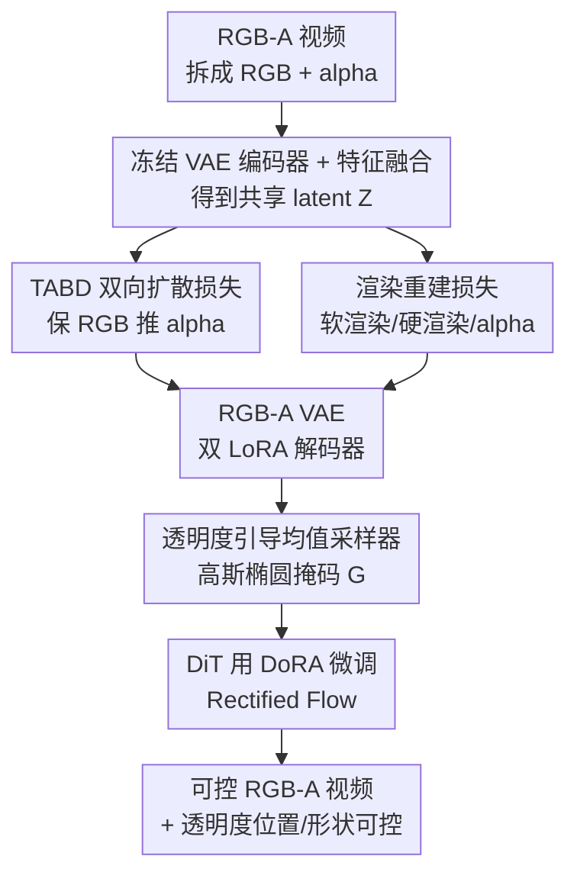

# Video Generation with Stable Transparency via Shiftable RGB-A Distribution Learner

**会议**: CVPR 2026  
**论文**: [CVF Open Access](https://openaccess.thecvf.com/content/CVPR2026/html/Dong_Video_Generation_with_Stable_Transparency_via_Shiftable_RGB-A_Distribution_Learner_CVPR_2026_paper.html)  
**代码**: https://donghaotian123.github.io/Wan-Alpha/ (项目页，承诺开源)  
**领域**: 视频生成 / 透明视频 / 扩散模型  
**关键词**: RGB-A 视频生成, 透明度, 分布偏移, VAE, Rectified Flow

## 一句话总结
针对带 alpha 通道的透明视频（RGB-A）生成中 RGB 与 alpha 分布纠缠导致质量差、透明度不稳的问题，本文提出"可偏移 RGB-A 分布学习器"——在 latent 空间用透明度感知的双向扩散损失把 alpha 分布推开、保留 RGB 分布，在 noise 空间用高斯椭圆掩码偏移噪声均值提供透明度引导与可控性，配合自建高质量数据集，在视觉质量、透明度渲染和推理速度（比 SOTA 快 15 倍）上全面领先。

## 研究背景与动机

**领域现状**：RGB-A 视频（在 RGB 之外多一个 alpha 透明通道）在游戏、影视、UI 设计里需求很大，但自动生成研究很少。早期做法是把图像域的 RGB-A 方案（如 LayerDiffuse 的 2D RGB-A VAE）直接搬到 AnimateDiff 这类视频框架上；当前 SOTA 是 TransPixeler，它引入 alpha token、复制一份 backbone、用 cross-RGB-A attention 在 RGB 和 alpha 之间交换信息。

**现有痛点**：搬图像 VAE 到视频上时序建模差、RGB 与 alpha 在 latent 里纠缠，需要海量数据去适配，结果透明度不准、运动受限。TransPixeler 复制 backbone 让推理开销翻倍（生成 49 帧要 32 分钟），而且它只在以不透明人像为主的 matting 数据上训练，遇到面纱、烟雾这类半透明物体就泛化失败；仅靠 attention 也没能真正学到 RGB–alpha 的关系，视觉质量和透明度都不稳。

**核心矛盾**：RGB-A 生成的根本难点是**如何把 RGB 与 alpha 两个分布既学好又分开**。以往方法对这两个分布不做任何处理，任由它们在 latent 里混在一起；而最直接的"显式拉大 RGB 与 alpha 之间距离"又会破坏训练稳定性——latent 空间里把两者统计上分开，并不等于让 DiT 在生成时能更好地区分它们，甚至可能损害生成能力。

**本文目标**：在不牺牲 RGB 质量的前提下，实现稳定且可控的 alpha 生成，并尽量复用预训练 RGB 视频模型的能力。

**切入角度**：扩散过程有两个端点——开始端的 noise 空间和结束端的 latent 空间。作者主张在这两个空间同时引导"可偏移分布"，从头到尾贯穿生成过程；而"偏移"的实现不靠显式拉距离，而靠更聪明、更可学的隐式策略。

**核心 idea**：保留 RGB 分布、只把 alpha 分布"推出去"——latent 空间借一个冻结 DiT 的似然来隐式偏移分布，noise 空间用基于 alpha 的高斯椭圆掩码偏移噪声均值，从而清晰分离不透明区与透明区，同时让用户可控透明度的形状和位置。

## 方法详解

### 整体框架

整套方法是**两阶段训练**：先训一个能区分 RGB-A 的 VAE，再在它的 latent 上训视频生成的 DiT。第一阶段，把 RGB-A 视频拆成 RGB 视频和 alpha 视频，喂进冻结的 VAE 编码器，用一个特征融合块把两路特征合成共享 latent $Z$，再由带 RGB LoRA 和 alpha LoRA 的两个解码器分别重建 RGB 和 alpha；训练时用透明度感知双向扩散损失（TABD）借冻结 DiT 隐式偏移 alpha 分布，再叠加一组渲染重建损失。第二阶段，在这个 VAE 的 latent 上用 DoRA 微调 DiT，并在 Rectified Flow 的噪声采样里注入透明度引导的均值偏移采样器（高斯椭圆掩码）。两个阶段分别对应"在 latent 空间偏移分布"和"在 noise 空间偏移分布"。整个框架几乎不改基模型推理架构，LoRA/DoRA 可完全合并进基模型，因此能复用基模型的加速工具。

### 关键设计

**1. 透明度感知双向扩散损失 TABD：让 latent 对 DiT 更"可分"，而不是统计上更远**

直接把 RGB 和 alpha 的 latent 在统计上拉开，并不能保证 DiT 在生成时更会区分它们，反而可能拉垮生成能力——latent 距离和 DiT 生成能力之间存在鸿沟。本文的破法是**把一个冻结的 DiT 拉进 VAE 训练里**：从 DiT 的视角看，"保留 RGB 分布、推开 alpha 分布"等价于"提高 RGB 的似然、降低 alpha 的似然"。于是用一个掩码把透明区的扩散损失符号翻转。具体地，把 alpha 视频缩放到 latent 尺寸，定义掩码

$$M(p) = \begin{cases} 1, & p \in O \\ -1, & p \in S \cup T \end{cases}$$

其中 $O, S, T$ 分别是不透明、半透明、透明区。原始 Rectified Flow 目标为 $Z_t = t\epsilon + (1-t)Z$、$v_t = \epsilon - Z$、$L_{RF} = \|\hat v_t - v_t\|^2$，最终的双向损失就是 $L_{bidiff} = M \cdot L_{RF}$。也就是说，不透明区正常降扩散损失（增大似然），透明区反向（减小似然），VAE 因此学到对 DiT 更可分的 RGB-A latent。消融里没有 TABD 时不透明区会出现"空洞"，正是因为 VAE 把 RGB 和 alpha 缠在一起、DiT 难以分辨。

**2. 渲染重建损失与 VAE 架构：用多色硬/软渲染把"背景色"和"透明度"解耦**

为了让 VAE 不把"RGB 背景颜色"误当成"透明度"，本文先把 RGB 视频用随机颜色 $\bar c$（取自 8 色集合 black/blue/.../white）做硬渲染 $\bar V_{rgb} = R_h(V_{rgb}, V_\alpha, \bar c)$ 再送编码器。软渲染和硬渲染定义为 $R_s(V_{rgb}, V_\alpha, c) = V_{rgb}\cdot V_\alpha + c\cdot(1 - V_\alpha)$ 和 $R_h(V_{rgb}, V_\alpha, c) = V_{rgb}\cdot\mathbb 1_{V_\alpha>0} + c\cdot(1 - \mathbb 1_{V_\alpha>0})$，前者按连续 alpha 混合、后者按 alpha 是否大于 0 做二值合成。重建时对三个模态（alpha 视频 $\hat V_\alpha$、软渲染 $\hat V^s_{rgb}$、硬渲染 $\hat V^h_{rgb}$）都施加复合损失，每个损失 $L_{recon}(\hat V, V) = \|\hat V - V\| + L_\Phi + L_s$ 同时含像素项、VGG 感知项 $\Phi(\cdot)$ 和 Sobel 边缘项 $S(\cdot)$。VAE 总损失为 $L_{vae} = L_\alpha + L^s_{rgb} + L^h_{rgb} + L_{bidiff}$。随机背景色加上对三个模态的差异化监督，迫使模型对不透明、半透明、透明区分别关注，从而把背景色与透明度彻底分离。架构上 latent 由 $Z = M(E(\bar V_{rgb}), E(V_\alpha))$ 给出（$M$ 是因果残差块+注意力的融合块），两路解码器分别挂 RGB LoRA 和 alpha LoRA。

**3. 透明度引导均值采样器：在 noise 空间偏移噪声均值，既提稳定性又给可控性**

把 RGB 模型适配到 RGB-A 时，保留基模型生成力能提升质量，但也会带来用户不想要的背景；而 TABD 让不透明 latent 接近基模型、透明 latent 更难学，导致 DiT 倾向少生成透明区、给不出干净的透明背景。本文在 noise 空间补上引导：把 Rectified Flow 的噪声均值按 alpha 偏移，定义 $\tilde\epsilon \sim N(\mu(Z), I)$、$Z_t = t\tilde\epsilon + (1-t)Z$、$\tilde v_t = Z_t - \tilde\epsilon$，训练目标改为 $L_{RF} = \|\hat v_t - \tilde v_t\|^2$。均值函数 $\mu(\cdot)$ 的设计是**从 alpha 帧拟合一个高斯椭圆掩码**：把 alpha 缩放并二值化 $B = \mathbb 1(A>0.5)$ 得到点集 $P$，算其均值 $\mu$ 和协方差 $\Sigma$，对 $\Sigma$ 做特征值分解得到主/次方向和轴长 $(a,b)$、朝向角 $\theta = \arctan2(v_{1y}, v_{1x})$，据此构造与几何对齐的高斯掩码

$$G(x, y) = \exp\!\left(-\frac{1}{2}\left[\left(\frac{x'}{a/2}\right)^2 + \left(\frac{y'}{b/2}\right)^2\right]\right)$$

再用强度因子 $\mu$ 得到 $\tilde\epsilon \sim N(G\cdot\mu, I)$。这个椭圆只传达透明区的大致形状和位置，把细结构和运动的自由度留给模型。推理时 $G$ 默认放中心，但用户可自定义 $G$ 来控制透明区域的形状、位置、大小，模型还会自动调整物体朝向以保持构图协调。实验中通常取 $\mu = 0.05$，太小则几乎不起控制作用，太大（如 0.5）会引入轻微红色偏色。

**4. 高质量 RGB-A 视频数据集：补足这一任务最稀缺的训练资源**

RGB-A 视频数据极度稀缺，是任务质量差的根源之一。作者从 10 个图像 matting 数据集和 3 个视频 matting 数据集采集：图像转成静态视频后沿时间轴随机滑窗模拟运动，共得到 77,237 训练视频和 4,066 验证视频用于训 VAE。用于 DiT 生成训练的数据则精挑细选——侧重清晰运动、半透明物体、光照特效，用 Qwen2.5-VL-72B 给 429 个样本生成长短两版 caption，并打上运动速度、艺术风格、镜头景别、画质问题等属性标签，最终含 301 个视频 matting 片段 + 43 张图像 matting + 85 个网络特效视频。数据集强调复杂边缘（如发丝）、清晰运动和多样半透明效果（薄纱、烟、水、辉光）。

### 损失函数 / 训练策略
VAE 总损失 $L_{vae} = L_\alpha + L^s_{rgb} + L^h_{rgb} + L_{bidiff}$；DiT 用改造后的 Rectified Flow 目标 $L_{RF} = \|\hat v_t - \tilde v_t\|^2$ 训练。基模型为 Wan2.1-T2V-14B，文本用 umT5 编码，DiT 用 DoRA（rank 32，作者发现比 LoRA 语义对齐更好），VAE 解码器 LoRA rank 128。VAE 训 75k 步（batch 2），DiT 仅训 1,750 步（batch 8）。推理只需改初始噪声、复制 VAE 解码器、加载 RGB/alpha 解码器 LoRA 与 DiT DoRA，且这些都能合并进基模型零额外开销；配合 LightX2V 加速，仅 4 步采样、无需 CFG。

## 实验关键数据

### 主实验

用 VBench 评美学/运动平滑/时序一致，用 GPT-4o 评文本对齐和自然度（渲染到白底）；因现有指标无法评透明度，额外做用户研究对透明度正确性和整体质量排名。

| 方法 | 文本对齐↑ | 美学质量↑ | 自然度↑ | 运动平滑↑ | 时序闪烁↑ |
|------|----------|----------|--------|----------|----------|
| LayerFlow (Single) | 2.67 | 0.535 | 2.35 | 0.9837 | 0.9788 |
| LayerDiffuse + AnimateDiff | 3.15 | 0.617 | 3.03 | 0.9893 | 0.9853 |
| TransPixeler (Open) | 3.16 | 0.570 | 2.97 | 0.9821 | 0.9872 |
| TransPixeler (Close) | 3.45 | 0.573 | 3.07 | 0.9907 | 0.9822 |
| **本文** | **4.00** | **0.649** | **3.19** | **0.9949** | **0.9941** |

| 方法 | 透明度排名↓ | 整体排名↓ |
|------|------------|----------|
| LayerFlow (Single) | 4.29 | 3.57 |
| LayerDiffuse + AnimateDiff | 3.40 | 4.23 |
| TransPixeler (Open) | 2.51 | 2.71 |
| TransPixeler (Close) | 2.57 | 3.37 |
| **本文** | **1.23** | **1.11** |

本文在所有客观指标上均最高，用户研究里透明度（1.23）和整体（1.11）排名都接近最优，明显甩开 TransPixeler。定性上：LayerDiffuse+AnimateDiff 运动差、文本对齐弱（第三例没生成出玻璃杯）；TransPixeler 开源版把玻璃透明度搞错、闭源版把本应不透明的玻璃错误地透明化；本文能生成清晰发丝边缘、自然人体运动、真实火焰烟雾以及正确的透明玻璃。

### 消融实验

| 配置 | PSNR(RGB/α)↑ | SSIM(RGB/α)↑ | LPIPS(RGB/α)↓ | 说明 |
|------|-------------|-------------|--------------|------|
| 无 Rendering 无 TABD | 40.12 / 39.98 | 0.97 / 0.97 | 0.043 / 0.025 | 朴素 RGB-A VAE |
| 仅 Rendering | 40.88 / 41.22 | 0.97 / 0.98 | 0.040 / 0.023 | 加渲染预处理与重建损失 |
| Rendering + TABD（Full） | **41.47 / 42.22** | 0.97 / 0.98 | **0.037 / 0.022** | 完整 VAE 设计 |

### 关键发现
- **TABD 是质量关键**：加上 TABD 后 RGB/alpha 重建全面提升；生成阶段没有 TABD 时不透明区会出"空洞"，正是 VAE 把 RGB 与 alpha 缠在一起、DiT 难分辨所致。
- **均值采样器 MS 管可控性与干净背景**：去掉 MS 后无法控制透明度位置，且 DiT 倾向少生成透明区、给不出干净透明背景；MS 能在不损 RGB 质量下稳定安排透明度、抑制多余背景。
- **$\mu$ 敏感性**：$\mu=0.05$ 较优；过小几乎不控制，过大（0.5）会带来轻微红色偏色。
- **效率优势显著**：TransPixeler 生成 49 帧（480×720, 8 FPS）需 32 分钟，本文生成 81 帧（480×832, 16 FPS）仅 128 秒，约**快 15 倍**。

## 亮点与洞察
- **"保 RGB、推 alpha"的非对称分布偏移**：不平等对待两个分布——保留 DiT 熟悉的 RGB 分布以守住基模型能力，只推开难学的 alpha，这个非对称设计是兼顾质量与透明度的关键，比"显式拉大距离"稳得多。
- **借冻结 DiT 的似然把"latent 可分"翻译成"DiT 可分"**：很巧地用一个掩码翻转扩散损失符号，把 VAE latent 学习和 RGB-A 生成目标对齐，绕开了"统计距离≠生成可分"的鸿沟，这个思路可迁移到其他"VAE latent 与下游生成模型目标不一致"的场景。
- **几何驱动的可控性**：从 alpha 拟合高斯椭圆（均值+协方差特征分解）来偏移噪声均值，既给透明度引导又顺带得到形状/位置/大小可控，且只约束粗略几何、保留细节自由度，是一个轻量又实用的可控生成接口。
- **零额外推理成本 + 可复用加速**：LoRA/DoRA 全可合并进基模型，几乎不改推理架构，因此能直接套用 LightX2V 4 步加速，工程落地友好。

## 局限与展望
- 透明度评估**只能靠用户研究**——现有客观指标都不支持 alpha，缺乏可复现的自动透明度度量，比较可信度受限。
- 可控性接口建模成**单个高斯椭圆**，对多个分散透明物体、非椭圆/镂空复杂形状的精细控制能力存疑。
- 数据规模仍小：DiT 生成训练仅 429 个精选样本、训 1,750 步，对罕见材质/极端光照的泛化有待验证；caption 由 Qwen2.5-VL-72B 自动生成，标注噪声未评估。
- $\mu$ 偏大引入红色偏色，说明 noise 空间偏移与色彩之间存在耦合，强控制下可能牺牲色彩保真。
- 方法绑定 Wan 系基模型与 Rectified Flow，迁移到其他扩散框架（如 EDM/DDPM 范式）是否同样有效未验证。

## 相关工作与启发
- **vs TransPixeler（SOTA）**：TransPixeler 复制 backbone + cross-RGB-A attention，推理翻倍且在以不透明人像为主的数据上训练、对半透明泛化差；本文不改架构、只在 latent/noise 两端偏移分布，质量、透明度和速度（15×）全面更优。
- **vs LayerDiffuse + AnimateDiff**：把图像 RGB-A VAE 搬到视频上时序差、RGB-alpha 纠缠、需大数据适配；本文专门用 TABD 解决 latent 纠缠，并自建视频数据集。
- **vs LayerFlow**：LayerFlow 做多层视频生成、聚焦前景层，但物体易扭曲；本文专注单层 RGB-A 但透明度与质量更稳。
- **vs Wan + MatAnyone（生成+抠图级联）**：级联方案需用户给 mask、非端到端，白底残留且处理不了半透明光照；本文端到端生成且能正确处理半透明。

## 评分
- 新颖性: ⭐⭐⭐⭐⭐ "在 latent + noise 两端做非对称分布偏移、借冻结 DiT 似然隐式分离 RGB/alpha"是对 RGB-A 生成核心难点的原创解法。
- 实验充分度: ⭐⭐⭐⭐ 客观指标+用户研究+逐设计消融+效率对比都齐，但受限于无透明度自动指标、生成训练样本偏少。
- 写作质量: ⭐⭐⭐⭐⭐ 动机—矛盾—解法链条清晰，公式与图示完整，可控性与应用扩展（I2V）讲得明白。
- 价值: ⭐⭐⭐⭐⭐ 面向游戏/影视/UI 的实用刚需，零额外推理成本、可复用加速、承诺开源模型与数据集，落地价值高。

<!-- RELATED:START -->

## 相关论文

- [\[CVPR 2026\] Reward Forcing: Efficient Streaming Video Generation with Rewarded Distribution Matching Distillation](reward_forcing_efficient_streaming_video_generation_with_rewarded_distribution_m.md)
- [\[CVPR 2026\] Reasoning Diffusion for Unpaired Test Time Out-of-distribution Text-Image to Video Generation](reasoning_diffusion_for_unpaired_test_time_out-of-distribution_text-image_to_vid.md)
- [\[CVPR 2025\] TransPixeler: Advancing Text-to-Video Generation with Transparency](../../CVPR2025/video_generation/transpixeler_advancing_text-to-video_generation_with_transparency.md)
- [\[NeurIPS 2025\] Stable Cinemetrics: Structured Taxonomy and Evaluation for Professional Video Generation](../../NeurIPS2025/video_generation/stable_cinemetrics_structured_taxonomy_and_evaluation_for_professional_video_gen.md)
- [\[ICML 2026\] Rays as Pixels: Learning A Joint Distribution of Videos and Camera Trajectories](../../ICML2026/video_generation/rays_as_pixels_learning_a_joint_distribution_of_videos_and_camera_trajectories.md)

<!-- RELATED:END -->
