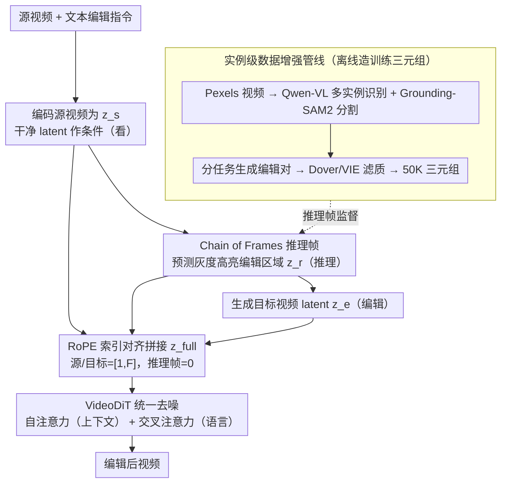

# VideoCoF: Unified Video Editing with Temporal Reasoner

**会议**: CVPR 2026  
**arXiv**: [2512.07469](https://arxiv.org/abs/2512.07469)  
**代码**: [https://github.com/knightyxp/VideoCoF](https://github.com/knightyxp/VideoCoF)  
**领域**: 扩散模型 / 视频编辑  
**关键词**: 视频编辑, Chain-of-Frames, 视频扩散模型, 推理帧, 长度外推

## 一句话总结

提出 VideoCoF，一种受 Chain-of-Thought 启发的"看→推理→编辑"视频编辑框架，通过让视频扩散模型先预测编辑区域的推理 token（灰度高亮 latent），再生成目标视频 token，在无需用户提供 mask 的前提下实现精确的指令-区域对齐，仅用 50K 视频对训练即达到 SOTA 性能，且支持 16 倍训练长度的视频外推。

## 研究背景与动机

1. **领域现状**：当前视频编辑方法主要分两类——专家模型（adapter+外部 mask，精确但依赖额外输入且任务特定）和统一时序上下文学习模型（将源视频 token 与噪声编辑 token 沿时间轴拼接，无需 mask 但缺乏显式空间线索）。

2. **现有痛点**：统一模型因缺乏显式空间引导而存在指令-区域映射弱的问题，在多实例识别或空间推理场景中精度差。专家模型虽精确，但需要用户提供 mask 或按任务单独训练，无法统一处理多种编辑任务。

3. **核心矛盾**：精确性和统一性之间的权衡——能否同时保持专家模型的定位精度和统一模型的免 mask 便利性？

4. **本文目标**（1）如何在无 mask 输入下实现精确的编辑区域定位；（2）如何在统一框架下处理多实例编辑任务；（3）如何让模型在推理时推广到超出训练长度的视频。

5. **切入角度**：类比 LLM 中 Chain-of-Thought 的多步推理思想——让视频生成模型也进行"视觉链式推理"，先预测编辑区域再执行编辑。观察到视频扩散模型本身具有推理能力（已有工作证明 VDM 能解视觉谜题），可以通过显式建模推理 token 来激发这种能力。

6. **核心 idea**：通过在源视频和编辑视频之间插入"推理帧"（灰度高亮的编辑区域 latent），强制扩散模型先"看再想再做"，实现免 mask 精确视频编辑。

## 方法详解

### 整体框架

VideoCoF 基于 VideoDiT（如 WAN-14B）构建统一视频编辑框架。输入为源视频、文本编辑指令；输出为编辑后的视频。中间过程分三阶段：首先将源视频编码为 latent 作为"看"的依据，然后模型预测推理 latent（标注编辑区域的灰度高亮帧）作为"推理"步骤，最后基于推理结果生成编辑后的视频 latent。三组 latent 沿时间维度拼接为统一序列 $\mathbf{z}_{full}$，由 VideoDiT 通过自注意力（上下文学习）和交叉注意力（语言控制）统一处理；拼接时由 RoPE 索引对齐策略给三组 token 分配时间位置编码。训练时仅对推理帧和目标帧施加噪声并监督速度场预测，而训练所需的"源-推理帧-目标"三元组由实例级数据增强管线离线造出。

### 关键设计

**1. Chain of Frames（CoF）推理帧：在没有 mask 输入时，逼模型先把编辑区域"想"出来再动手**

之前的时序上下文学习方法（ICVE、UNIC 等）直接把源视频 latent 和加噪的目标 latent 沿时间轴拼起来，中间没有任何约束告诉模型"指令对应画面里哪一块"，于是碰到多实例或需要空间推理的场景，编辑常常落在错的物体上。CoF 的做法是在源视频和目标视频之间硬插一段"推理帧"：把源视频-推理帧-目标视频写成三元组 $\{\mathbf{s}, \mathbf{r}, \mathbf{e}\}$，分别编码成 $z_s, z_r, z_e$ 再沿时间维拼接；训练时源视频 latent 保持干净（timestep=0）只当条件，推理帧和目标帧一起加噪并作为去噪目标。关键在于推理帧的 ground truth 不是普通画面，而是用灰度半透明高亮把编辑区域标出来的帧——模型必须先把这一帧重建出来，等于被强制先学会"指令→编辑区域"的映射，再据此生成目标视频。高亮的透明度也不是固定值，而是从 0% 渐变到 75% 的渐进灰度，这种平滑过渡比纯黑、纯红或固定灰度都好（消融里 Success Ratio 从黑色 mask 的 52% 一路涨到渐进灰度的 76%），原因是扩散模型对纯黑纯白这类极端像素不敏感，灰度高亮在 latent 空间里反而更"看得见"。

**2. RoPE 索引对齐：用一个错位的时间索引，同时治好"长度外推不了"和"推理帧污染首帧"两个病**

VideoDiT 靠 3D 分解 RoPE 给每个 token 提供时空位置编码，所以拼接方式直接决定了模型能不能外推。最直觉的拼法是源视频占 $[0, F-1]$、目标占 $[F, 2F-1]$，但这样模型会死记训练时的固定映射，一旦推理时视频变长就崩；退一步把索引重复成 $[0, F-1]$ 又会撞车——源的第 0 帧、推理帧、目标的第 0 帧共享 temporal index=0，叠在同一个位置上产生伪影。VideoCoF 的终版把源和目标视频都设成 $[1, F]$，单独把推理帧塞进索引 $0$：推理帧被隔离在一个谁都不占的时间位置上，不再干扰首帧的编辑结果；源和目标共享同一段索引区间，保证编辑前后的运动对齐；而 $F$ 是个可以在推理时自由放大的变量，于是 33 帧训练出来的模型能外推到 141 帧（4×）甚至 513 帧（16×），朴素方案则在 81 帧就已经模糊、运动错位。

**3. 实例级数据增强管线：为"多物体、讲空间关系"的复杂编辑造训练对**

现有视频编辑数据集大多是单实例的简单增删，撑不起"把左边那个人换掉""给右数第二个物体加特效"这类需要空间推理的任务，而这种数据恰恰是训练模型空间定位能力的关键。VideoCoF 自己搭了一条管线来造数据：从 Pexels 收集多样视频，用 Qwen-VL 72B 做多实例识别、Grounding-SAM2 把每个实例精确分割出来，再按编辑类型分工生成编辑对——删除/添加交给 Minimaxremover，替换/局部风格变换走 VACE-14B 的 inpainting 模式，创意编辑指令则由 GPT-4o 生成；最后用 Dover Score 和 VIE Score 滤掉低质样本，并从 Señorita 2M 里蒸馏出一个高质量子集，合起来 50K 训练样本。正是这 50K 结构化数据，让模型在所有 GPT-4o 评分项上压过了用 1M+ 数据训练的 ICVE，说明结构化的学习信号比暴力堆量更管用。

### 损失函数 / 训练策略

训练采用 Flow Matching 目标：速度场 $\mathbf{v} = \boldsymbol{\varepsilon} - \mathbf{z}_{full}^{(0)}$，仅监督推理帧和目标帧的 MSE 损失 $\mathcal{L} = \frac{1}{L+F}\sum_{i=F}^{2F+L-1}\|\mathbf{v}_i - \hat{\mathbf{v}}_i\|_2^2$。推理时用 ODE solver 从高斯噪声演化到干净 latent，源 latent 始终保持不变。配合 DMD-LoRA 仅需 4 步推理，单 H100 约 10 秒编辑 33 帧。

## 实验关键数据

### 主实验

在 VideoCoF-Bench（200 视频，4 类编辑任务，含实例级编辑）上与 SOTA 方法对比：

| 方法 | Instruct Follow↑ | Preservation↑ | Quality↑ | Success Ratio↑ | CLIP-T↑ |
|------|-------------------|---------------|----------|----------------|---------|
| ICVE (1M预训练+150K微调) | 7.79 | 8.06 | 8.14 | 57.76% | 27.49 |
| VACE-14B | 7.47 | 5.82 | 7.61 | 26.60% | 27.02 |
| Lucy Edit | 5.24 | 6.50 | 6.37 | 29.64% | 26.98 |
| **VideoCoF (50K)** | **8.97** | **8.20** | **7.77** | **76.36%** | **28.00** |

仅用 50K 训练数据就在所有 GPT-4o 评分指标上超越了使用 1M+ 数据的 ICVE，Success Ratio 提升 18.6%。

### 消融实验

| 配置 | Instruct Follow | Success Ratio | CLIP-T |
|------|----------------|---------------|--------|
| Naive temporal [0,2F-1] 无 CoF | 8.11 | 72.41% | 26.88 |
| 索引重复 [0,F-1] 无 CoF | 8.06 | 65.52% | 27.09 |
| **VideoCoF [1-F,0,1-F] + CoF** | **8.97** | **76.36%** | **28.00** |

推理帧格式消融：

| 格式 | Instruct Follow | Success Ratio |
|------|----------------|---------------|
| 黑色 mask (0%) | 7.51 | 52.17% |
| 红色 mask (50%) | 7.81 | 60.33% |
| 灰色 mask (50%) | 8.15 | 68.45% |
| **渐进灰色 (0-75%)** | **8.97** | **76.36%** |

### 关键发现

- CoF 推理帧的引入带来 Instruct Follow +10.65% 和 Success Ratio +5.46% 的提升，证明显式推理步骤对编辑精度至关重要
- RoPE 对齐设计使模型从 33 帧训练外推到 513 帧（16x），朴素方案在 81 帧即严重退化（模糊、运动不对齐）
- 推理帧格式中渐进灰色 mask 大幅优于黑色/红色，因为扩散模型对纯黑/纯白像素不敏感，灰色高亮更适合 latent 空间表示
- 仅 50K 数据量即超越 1M+ 数据的方法，说明数据质量和框架设计远比数据量重要

## 亮点与洞察

- **Chain-of-Frames 推理范式**：将 CoT 从语言领域迁移到视觉生成领域的巧妙设计。视频编辑的"看→推理→编辑"过程天然符合人类编辑视频的思维模式——先确定编辑区域再执行操作。这一思路可推广到图像编辑甚至 3D 场景编辑。
- **RoPE 索引隔离策略**：用一个简单的索引偏移（推理帧=0，视频=[1,F]）同时解决索引碰撞和长度外推两个问题，设计极为简洁优雅。可作为通用技巧用于任何需要拼接异构 token 序列的扩散模型。
- **数据效率**：50K 数据超越 1M+ 的事实说明，结构化的学习信号（推理帧提供的编辑区域监督）比暴力数据堆量更有效。

## 局限与展望

- 推理帧的 ground truth 依赖 Grounding-SAM2 的分割质量，对分割失败的场景可能引入噪声
- 当前推理帧为静态灰度高亮，无法很好表达需要跨帧变化的编辑区域（如运动轨迹修改）
- 训练数据 50K 虽然效率高但多样性有限，复杂自然场景覆盖可能不足
- 未探索注意力可视化来验证推理帧是否真正驱动了模型的区域关注

## 相关工作与启发

- **vs ICVE**: ICVE 用朴素时序拼接做统一视频编辑，1M 预训练+150K 微调但缺乏显式空间引导。VideoCoF 通过 CoF 推理帧弥补了空间精度的短板，50K 数据即超越 ICVE。
- **vs VACE**: VACE 是强大的视频编辑基础模型，但用 inpainting 模式需 mask 输入。VideoCoF 在 VACE 的 mask-free 统一框架基础上通过推理帧提升了编辑精度。
- **vs EditVerse**: EditVerse 也探索了统一上下文学习，但基于 LLaMA-style DiT。VideoCoF 在标准视频扩散模型上实现类似功能，更通用。

## 评分

- 新颖性: ⭐⭐⭐⭐⭐ Chain-of-Frames 是将 CoT 推理迁移到视频扩散模型的首次探索，开辟了新范式
- 实验充分度: ⭐⭐⭐⭐ 消融全面（CoF、RoPE、推理帧格式），但主要在自建 benchmark 上评估
- 写作质量: ⭐⭐⭐⭐⭐ 方法阐述清晰，类比 CoT 的叙事引人入胜，图示直观
- 价值: ⭐⭐⭐⭐⭐ 推理帧+RoPE 对齐的设计思路可广泛迁移到其他视觉生成任务

<!-- RELATED:START -->

## 相关论文

- [\[ICML 2026\] Lightning Unified Video Editing via In-Context Sparse Attention](../../ICML2026/video_generation/lightning_unified_video_editing_via_in-context_sparse_attention.md)
- [\[CVPR 2026\] TempoControl: Temporal Attention Guidance for Text-to-Video Models](tempocontrol_temporal_attention_guidance_for_text-to-video_models.md)
- [\[CVPR 2026\] DreamStyle: A Unified Framework for Video Stylization](dreamstyle_a_unified_framework_for_video_stylization.md)
- [\[CVPR 2026\] FFP-300K: Scaling First-Frame Propagation for Generalizable Video Editing](ffp-300k_scaling_first-frame_propagation_for_generalizable_video_editing.md)
- [\[CVPR 2026\] TEAR: Temporal-aware Automated Red-teaming for Text-to-Video Models](tear_temporal-aware_automated_red-teaming_for_text-to-video_models.md)

<!-- RELATED:END -->
