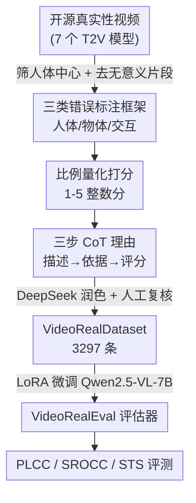

# VideoRealBench: A Chain-of-Thought Realism Evaluation Benchmark for Generated Human-Centric Videos

**会议**: CVPR 2026  
**论文**: [CVF Open Access](https://openaccess.thecvf.com/content/CVPR2026/html/Yang_VideoRealBench_A_Chain-of-Thought_Realism_Evaluation_Benchmark_for_Generated_Human-Centric_Videos_CVPR_2026_paper.html)  
**代码**: https://github.com/MCGNJU/VideoRealBench (有)  
**领域**: 视频生成 / 评测基准  
**关键词**: 视频真实性评估、人体中心视频、思维链评测、MLLM 评估器、人类偏好对齐

## 一句话总结
针对生成视频"真实性"无法被现有评测器可靠打分这一问题，作者重新人工标注了一个 3,297 条人体中心生成视频的数据集 VideoRealDataset（含三步思维链理由），并用它 LoRA 微调出评估器 VideoRealEval，在与人类偏好的相关性上（PLCC 57.07% / SROCC 56.78%）显著超过 Gemini-2.5-pro、InternVL3.5-241B 等通用大模型和此前的专用评测器。

## 研究背景与动机
**领域现状**：Sora、Gen-3、CogVideoX 这类文生视频模型已经能产出视觉质量很高、语义连贯的人体中心视频，越来越多创作者和研究者用它们批量生成内容或定制训练数据。但模型对"视频真实性"（generated video 是否遵守现实物理规律、生物力学约束、因果逻辑）理解不足，经常生成不真实的视频——尤其在人体动作、姿态、人物-物体交互上违反常识。

**现有痛点**：已有的视频评测器大多盯着"语义是否对齐文本提示"，对真实性的系统评估缺位。少数意识到真实性问题的 benchmark（如 VideoPhy-2、VMBench）又有三个硬伤：① **标注质量低**——视频本身是低质量生成结果且未经仔细筛选，文本评语主要由 LLM 生成、人工只做核验，看似合理实则可能不准；② **真实性定义和打分标准含糊**——用一堆相互重叠、彼此不独立的维度去描述误差，评分边界划不清，导致分数和人类偏好不对齐；③ **只给不透明的分数、没有可解释的理由**——通用 MLLM 虽有潜力看懂视频，但没专门为视频真实性评测训练过，给不出准确且全面的评估。

**核心矛盾**：要让自动评测器的分数贴近人类偏好，就得有高质量、定义清晰、带推理过程的标注；但现有数据要么靠 LLM 廉价标注牺牲质量，要么让标注员凭直觉记忆复杂多维定义打分，主观漂移大。质量与可扩展性之间一直没调和好。

**本文目标**：构造一个标注质量高、打分标准明确、且自带可解释思维链理由的人体中心生成视频真实性评测基准，并据此训练一个分数对齐人类偏好、能给出理由的自动评估器。

**切入角度**：作者的关键观察是——与其让标注员去背诵复杂的多维真实性定义再给"直觉分"，不如让他们**先用自然语言把看到的错误描述出来**，再把错误**按其在画面中占的空间比例和时长比例量化**成一个严格定义的 1–5 整数分。这样打分有客观锚点，跨标注员一致性更好。

**核心 idea**：把"真实性评测"重新拆成三步思维链——先描述错误（Problem Description）→ 再对照标准给出评分依据（Standard Adherence）→ 最后给整数分（Answer），用人工精标的 CoT 数据 LoRA 微调一个 MLLM，使它"真的看懂错误并映射到明确评分标准"，而非只拟合分数分布。

## 方法详解

### 整体框架
VideoRealBench 由三块拼成：一个重标注的数据集 **VideoRealDataset**、一套**评测指标**、以及一个微调出来的评估器 **VideoRealEval**。流程上，先从开源真实性数据集里筛人体中心视频 → 由标注员按三类错误（人体状态 / 物体状态 / 人物-物体交互）描述问题、按比例量化给出 1–5 分、并写出三步 CoT 理由 → 用 DeepSeek 润色 CoT 并人工复核 → 用这套数据 LoRA 微调 Qwen2.5-VL-7B 得到 VideoRealEval → 推理时模型依次输出 Problem Description、Standard Adherence、Answer 三段。最终用 PLCC / SROCC 衡量分数与人类的相关性、用语义文本相似度（STS）衡量理由质量。

### 关键设计

**1. 三类错误标注框架：把含糊的"真实性"落到可描述的具体错误上**

针对现有 benchmark"真实性定义重叠、标注员要背复杂多维度"的痛点，作者不让标注员去记抽象维度，而是要求他们边看视频边用自然语言描述错误，并把错误归到三个互斥类别：**人体状态**（动作是否自然、身体结构是否合理、是否遵守物理规律，如"头部旋转超过 180°""多出肢体""人体悬浮空中"）、**物体状态**（物体状态/属性是否合理、是否遵守物理，如"篮球发生形变""钢材表现出柔软属性""球的轨迹出现运动学异常"）、**人物-物体交互**（交互中是否有视觉穿模、是否有因果逻辑问题，如"手臂与书本视觉穿透""在黑板上书写却没有留下痕迹"）。每类都配了典型示例（Table 1）供标注员对照，把"评什么"具体化，降低主观漂移。

**2. 比例量化的 5 分制：给打分一个客观锚点而非凭直觉**

这是对"评分标准含糊、分数偏离人类偏好"最直接的回应。作者抛开复杂评测维度和文本对齐度，直接基于视觉内容本身，按**错误内容占画面的空间比例**和**含错帧占视频总时长的比例**严格定义 1–5 分（Table 2）：1 分（Bad）= 难以忍受的错误占画面 >40% 或错帧 >80% 时长；2 分（Poor）= 显著错误占 >20% 或错帧 >40%；3 分（Normal）= 明显错误占 >10% 或错帧 >20%，部分真实但有不一致；4 分（Good）= 只有一两个占画面 <10%、仅几帧的轻微错误；5 分（Excellent）= 找不到任何问题、几乎与真实素材无异。由于"用比例去定量描述错误"对标注员反直觉、不实用，作者让标注员仍用自然语言按错误发生顺序描述异常（即 Standard Adherence），而把比例→分数的映射作为客观标尺，使分数更贴合人类共识。

**3. 三步思维链标注与多标注员聚合：把"为什么是这个分"显式写出来**

为了让评估器具备可解释性，作者把评测过程定义成三步 CoT：`<Problem Description>`（描述视频里的真实性错误）→ `<Standard Adherence>`（依据评分标准给出推理）→ `<Answer>`（最终整数分）。为保证标注准确，每条视频派 **3 名标注员**各自独立给出评分及对应的问题描述、标准依据；最终分数按多数票确定——若存在多数分则直接采用，并汇编给出该分的标注员的描述与依据；若三人评分各异，则取平均四舍五入，并选用评分最接近最终分的那位标注员的理由。聚合后再用 **DeepSeek** 润色 Problem Description 与 Standard Adherence、去重并整合成连贯 CoT，最后人工核验其推理步骤是否符合人类逻辑，不符则重新生成。

**4. VideoRealEval：用 LoRA 微调把通用 MLLM 改造成真实性评估器**

通用 MLLM 虽能识别视频中的问题，但给出的分数严重偏离人类偏好——它们检测得到"真实性异常"，却无法把异常映射到可量化、对齐人类偏好的评分。作者以 **Qwen2.5-VL-7B** 为底座，用 **LoRA** 微调（学习率 1e-4，每 GPU batch size 1，4 张 V100 训 10 epoch）以尽量保留原模型的指令跟随和推理能力。推理时模型严格按三段输出：Problem Description 给出与人工标注风格一致的错误描述，Standard Adherence 模拟人类按评分标准给出依据，Answer 给出 1–5 的整数分。轻量微调即让模型"真正理解真实性问题并正确映射到明确评测标准"，从而成为可扩展、贴近人类偏好的自动评估器。

### 评测指标
除了用 5 分制做直观量化，作者额外评测评估器生成的**理由**，以验证它是真懂问题而非只拟合分数分布：
- **SROCC（斯皮尔曼秩相关）**：衡量模型按真实性正确排序视频样本的能力。
- **PLCC（皮尔逊线性相关）**：衡量模型评分与人类直觉的线性一致性，越高越贴近人类。
- **STS（语义文本相似度）**：传统文本指标（BLEU/ROUGE/METEOR/CIDEr）只比词面相似，当 CoT 用不同词表达相同含义时会严重低估。作者改用 Sentence-BERT 生成语义嵌入、算句子间余弦相似度来衡量理由的语义贴近度。

## 实验关键数据

### 数据集规模
VideoRealDataset 共 3,297 条标注视频，划分为 2,309 训练 / 988 测试；为避免评估器预测分数因分布失衡而偏向某个值，训练集与测试集的分数分布保持高度一致。重标注后的分数普遍**低于**原始评分，说明已有数据集的分数总体高估了真实的人类偏好。

### 主实验：与各模型在 VideoRealDataset 上的相关性

| 模型 | PLCC(%) | SROCC(%) | STS(%) |
|------|---------|----------|--------|
| Qwen2.5-VL-7B（底座） | 18.93 | 18.59 | 47.22 |
| InternVL3.5-241B-A28B | 21.32 | 22.99 | 49.68 |
| VideoScore-v1.1 | 23.47 | 22.64 | - |
| VideoCon-Physics | 33.72 | 33.25 | - |
| Gemini-2.5-pro | 33.79 | 33.93 | 47.81 |
| UnifiedReward-Think | 34.99 | 33.44 | 49.29 |
| VideoPhy-2-AutoEval | 38.31 | 38.56 | - |
| VideoPhy-2-AutoEval*（用本文数据重训） | 50.89 | 50.69 | - |
| **VideoRealEval（本文）** | **57.07** | **56.78** | **56.17** |

VideoRealEval 在相关性上大幅领先：比通用闭源 Gemini-2.5-pro 高出约 23 个百分点 PLCC，比强基线 VideoPhy-2-AutoEval 高约 18.8 个点。值得注意的是 VideoPhy-2-AutoEval 用本文 VideoRealDataset 重训后（带 *）从 38.31 跃升到 50.89，既证明本文数据集质量高，也说明本文评估器在公平对比下仍更优。

### 消融实验

| 消融 | 配置 | PLCC(%) | SROCC(%) |
|------|------|---------|----------|
| 打分形式 | 整数分 (1–5) | 57.07 | 56.78 |
| 打分形式 | 词语分 (Bad…Excellent) | 56.89 | 56.56 |
| CoT | 无描述 / 无依据 | 53.89 | 54.07 |
| CoT | 仅 Problem Description | 55.99 | 55.97 |
| CoT | 描述 + Standard Adherence（完整） | 57.07 | 56.78 |

### 关键发现
- **思维链确实有用**：从"无理由 → 加错误描述 → 再加标准依据"，PLCC/SROCC 逐级上升（53.89→55.99→57.07），说明让模型先学会识别错误、再对照标准推理，有助于得到更客观、更对齐人类偏好的分数；理由不仅服务可解释性，也实质提升了打分质量。
- **整数分略优于词语分**：用 Bad/Poor/Normal/Good/Excellent 这类词语描述严重程度虽语言更流畅，但相关性略低于整数分（56.89 vs 57.07），说明用词语衡量真实性问题的严重度并不比纯数值更可靠，故最终采用整数打分。
- **通用大模型的瓶颈在"映射"而非"识别"**：多数 MLLM 能识别视频里的问题，但分数严重偏离人类偏好——它们缺的是把检测到的真实性异常映射到量化评分的能力，而这正是本文 LoRA 微调补上的。

### 与既有 benchmark 的特性对比

| 特性 | PhyGenBench | VideoPhy-2 | VideoRealBench |
|------|-------------|------------|----------------|
| 带定量评分的人工标注 | 部分 | 部分 | ✓ |
| 真实性错误描述 | ✗ | 部分 | ✓ |
| CoT 推理理由 | ✗ | ✗ | ✓ |

## 亮点与洞察
- **"先描述错误、再按比例量化打分"的标注范式很巧妙**：把"评什么"（三类具体错误 + 典型示例）和"怎么给分"（按空间/时间占比的硬性 5 档）解耦，既避免标注员背抽象维度，又给打分一个客观锚点，明显比"凭直觉给多维分"更可复现。这套思路可迁移到任意需要主观打分但又想要一致性的评测任务。
- **重标注本身就是强有力的证据**：用本文数据集重训竞品 VideoPhy-2-AutoEval，相关性从 38 飙到 51，直接量化了"数据质量"的价值，说明在生成视频评测这个方向，标注质量比模型规模更关键（241B 的 InternVL3.5 也只有 21 PLCC）。
- **三步 CoT 把可解释性和分数对齐统一起来**：消融显示理由不是装饰，加上后分数也更准——这给"评测器到底懂不懂"提供了可验证抓手，并用 STS（语义相似度而非词面）来公平衡量理由质量，是值得借鉴的细节。

## 局限与展望
- **数据来源单一**：视频全部取自单一开源真实性数据集 [7]，由 7 个 T2V 模型生成；随着更新的生成模型出现，这套"已筛已标"的视频分布可能很快过时，泛化到未见模型的真实性错误类型上待验证。
- **绝对相关性仍不高**：最佳 PLCC/SROCC 约 57%，离"与人类高度一致"还有距离，说明自动真实性评测远未解决；STS 仅 56% 也意味着理由质量有提升空间，且作者自承微调后 STS 提升不明显（主要收益在分数对齐）。
- **范围限定人体中心**：聚焦人体状态 / 物体状态 / 人物-物体交互，对纯场景、纯物理仿真（无人）类视频的真实性评测未覆盖；"按比例量化"对错误空间/时间占比的估计本身也带主观性。
- **底座与算力受限**：评估器基于 7B Qwen2.5-VL、4×V100，未探索更大底座或更强视频编码是否能进一步拉高相关性。

## 相关工作与启发
- **vs VideoPhy-2 / PhyGenBench**：它们是最接近的真实性评测前作，但 VideoPhy-2 的错误描述由 LLM 生成、存在虚构不存在元素 / 描述不全 / 漏标问题，且都不提供 CoT 理由、缺定量评分标准。本文用人工三步 CoT 标注 + 比例量化打分把这三项特性补齐（Table 3 全 ✓），并证明用本文数据重训 VideoPhy-2 评估器即可大幅涨点。
- **vs VMBench / EvalCrafter / Video-Bench**：这些聚焦运动感知、多维通用评测或文本-视频语义对齐，本文专攻"真实性"且要求评估器输出可解释理由，是更细粒度的诊断式评测。
- **vs 通用 MLLM 评估器（Gemini-2.5-pro / InternVL3.5 / Qwen2.5-VL）**：直接拿通用大模型当评测器，分数与人类偏好相差甚远；本文用轻量 LoRA 微调即把同底座 Qwen2.5-VL 从 18.93 PLCC 提到 57.07，说明"专门对齐人类真实性偏好"比单纯堆参数更有效。

## 评分
- 新颖性: ⭐⭐⭐⭐ 把"先描述错误、再按比例量化、再三步 CoT 打分"组合成可复现的真实性标注范式，思路清晰但更偏数据/范式工程而非全新技术
- 实验充分度: ⭐⭐⭐⭐ 覆盖 10+ 主流开闭源模型对比 + 打分形式/CoT 消融，并用重训竞品佐证数据质量；缺跨数据集泛化验证
- 写作质量: ⭐⭐⭐⭐ 动机与标注流程交代清楚，图表充分；部分指标绝对值偏低需读者自行权衡
- 价值: ⭐⭐⭐⭐ 为人体中心生成视频真实性评测提供了高质量数据集 + 开源评估器，对生成模型迭代有实际指导意义

<!-- RELATED:START -->

## 相关论文

- [\[CVPR 2026\] Chain of Event-Centric Causal Thought for Physically Plausible Video Generation](chain_of_event-centric_causal_thought_for_physically_plausible_video_generation.md)
- [\[CVPR 2026\] ActivityForensics: A Comprehensive Benchmark for Localizing Manipulated Activity in Videos](activityforensics_a_comprehensive_benchmark_for_localizing_manipulated_activity_.md)
- [\[CVPR 2026\] Ego-InBetween: Generating Object State Transitions in Ego-Centric Videos](ego-inbetween_generating_object_state_transitions_in_ego-centric_videos.md)
- [\[CVPR 2026\] VGA-Bench: A Unified Benchmark for Video Aesthetics and Generation Quality Evaluation](vga_bench_unified_benchmark_for_video_aesthetics_and_generation_quality.md)
- [\[CVPR 2026\] SLVMEval: Synthetic Meta Evaluation Benchmark for Text-to-Long Video Generation](slvmeval_synthetic_meta_evaluation_benchmark_for_text-to-long_video_generation.md)

<!-- RELATED:END -->
