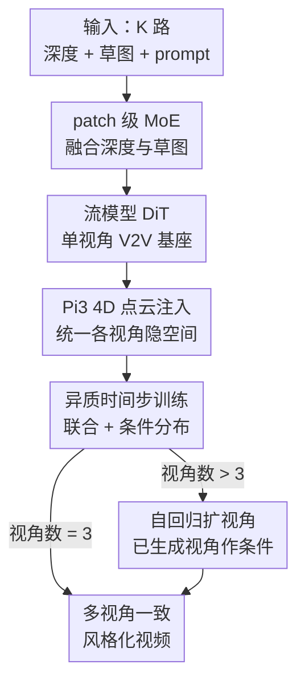

# VideoWeaver: Multimodal Multi-View Video-to-Video Transfer for Embodied Agents

**会议**: CVPR 2026  
**论文**: [CVF Open Access](https://openaccess.thecvf.com/content/CVPR2026/html/Eskandar_VideoWeaver_Multimodal_Multi-View_Video-to-Video_Transfer_for_Embodied_Agents_CVPR_2026_paper.html)  
**领域**: 视频生成 / 具身智能 / 视频到视频迁移  
**关键词**: 多视角 V2V、流模型、4D 点云、异质时间步、域随机化

## 一句话总结
VideoWeaver 把单视角的视频到视频（V2V）风格迁移扩展到多个同步相机，靠把 Pi3 预测的 4D 点云坐标注入流模型隐空间来统一各视角的外观，再用「各视角不同噪声时间步」的训练让模型同时学会联合分布和条件分布，从而能在保持机器人动作轨迹不变的前提下，对一整套多机位的具身演示视频做风格一致的批量重渲染。

## 研究背景与动机
**领域现状**：训练具身智能体（机器人策略）需要海量真实演示数据，采集昂贵。一个比直接用视频生成模型更「接地气」的做法是 V2V 迁移——给定深度图、草图（sketch）这类结构控制信号，把仿真或历史真实演示「重渲染」成新风格，同时保住底层的机器人动作轨迹不变，这正是策略训练里所谓的「域随机化（domain randomization）」。

**现有痛点**：所有已有的 V2V 方法（VACE、Cosmos-Transfer-1、ControlVideo 等）都只能一次处理**单个视角**。但现代机器人平台（机械臂、人形机器人）普遍用**多个同步相机**采集——左手腕、右手腕、头部、第一人称在手相机等。把单视角模型独立套到每路相机上，会出现各视角外观（颜色、纹理）不一致、3D 结构断裂的问题，对多视角数据增广毫无价值。

**核心矛盾**：要跨视角一致，最直接的想法是加 cross-view attention，但标准 transformer 的跨视角注意力是**视角数的平方复杂度**，超过 3-4 个相机就跑不动；而且机器人相机是**异质且宽基线**的——动态第一人称、静态头戴、静态第三人称往往重叠极少甚至不重叠，传统的极线/对应假设直接失效。作者实测发现，仅靠加 view-attention 层和相机射线嵌入（camera ray embedding）这类「拿来主义」的改造，根本撑不住跨视角风格一致（见 Tab. 2）。

**切入角度与核心 idea**：作者的关键观察是——与其在 **2D 图像空间**里硬维持一致性，不如**保住背后那个共享的 3D 世界**，时空一致性自然从中涌现。具体做法是用前馈式空间基座模型 Pi3 把所有视角的所有帧重建到一个统一的 4D（空间+视角+时间）坐标系，再把这套全局 4D 坐标注入流模型隐空间，让各视角共享同一份几何表征。配合「异质时间步训练」，模型还能自回归地在已生成视角之上扩出新视角，突破固定相机数的限制。

## 方法详解

### 整体框架
VideoWeaver 是一个基于**流模型（rectified flow）的 DiT**，分三阶段递进训练。先把一个文生视频基座模型微调成**单视角 V2V 模型**：在 3D VAE 隐空间里，用一个 patch 级 MoE 模块自适应融合深度和草图两路控制，加到带噪隐变量上去引导生成。然后扩到**多视角**：在每个 DiT block 里做「视角内 joint attention + 跨视角 attention」的因子化 4D 注意力，并把 Pi3 重建出的 4D 点云坐标注入隐空间，强行把各视角的隐特征拽到同一套几何上。最后用**异质时间步训练**——让不同视角处在不同扩散时间步——使模型既学会所有视角的联合分布，也学会「给定若干已生成视角、再补其余视角」的条件分布，从而在推理时自回归地把视角数从 3 扩到更多。输入是每路相机的 (sketch, depth) 序列 + 文本 prompt，输出是一套跨视角几何一致、且各自对齐自身控制信号的 RGB 视频。

整套生成建立在 rectified flow 之上：样本状态 $x_\tau = (1-\tau)x_0 + \tau x_1$ 在时间步 $\tau \in [0,1]$ 上从高斯噪声 $x_0$ 线性插值到目标视频 $x_1$，模型学一个速度场 $v_\theta$ 去对齐位移方向，损失为 $L(\theta)=\mathbb{E}_{x,y,\tau}\lVert v_\theta(x_\tau,y,\tau)-(x-x_0)\rVert^2$。下面的关键设计都挂在这个框架的不同节点上。

### 关键设计

**1. patch 级 MoE 融合深度与草图：让每个时空块自己挑该信任哪路控制**

单视角阶段要同时吃深度和草图两路控制，但这两路信号**在 patch 粒度上是互补且不对称**的：深度给出可靠的几何结构，却在细小/薄物体上失灵；草图给出稳定的形状轮廓，却在边缘重叠、前后景外观相近时含糊。以往做法（VideoComposer、Cosmos-Transfer-1）直接把两路相加或拼接，逼模型对两路信号一视同仁。VideoWeaver 改用一个 patch-wise MoE：两个轻量卷积专家 $E_s(\cdot)$、$E_d(\cdot)$ 分别处理草图、深度隐特征，再用帧级多头交叉注意力交换互补信息；一个 gating 网络以当前隐状态 $x_\tau$、两路特征 $f_d,f_s$ 和时间步 $\tau$ 为条件，预测 patch 级混合权重 $\alpha_\tau$，融合控制信号为

$$c_\tau = \alpha_\tau \cdot E_s(f_s) + (1-\alpha_\tau)\cdot E_d(f_d).$$

$c_\tau$ 加到带噪隐变量 $x_\tau$ 上送入 DiT。这样模型能在每个时空位置、每个时间步动态决定信任哪路信号——实验里这正是它在杂乱实验室场景（深度歧义大）下仍能对齐的关键，而且因为训练时偶尔随机丢一路模态，推理时**砍掉任一路模态都几乎不掉点**。

**2. Pi3 4D 点云注入：用共享几何取代 2D 跨视角注意力**

多视角扩展时，作者先按 CameraCtrl 给每帧加相机射线嵌入、并在每个 joint attention 后插一层跨视角 attention，构成因子化 4D 注意力（视角内对 $T\times H\times W$ 个 token 做注意力，再在每帧对 $V\times H\times W$ 个跨视角空间 token 做注意力）。但作者发现这套「射线嵌入 + 跨视角注意力」的标配**远不够**：宽基线下小物体或部分可见物体很容易让跨视角注意力对错，射线嵌入只给出粗几何线索，各视角隐特征仍只是弱耦合，同一物体常被染成不同颜色。

解法是注入一个**强 4D 先验**。作者用前馈空间基座 Pi3（相比 VGGT 把所有预测锚到第一视角、不支持动态序列，Pi3 对视角是置换不变的、在单一仿射不变全局坐标系里重建所有观测）一次性回归出相机内参、位姿和**逐像素稠密点云** $\hat P_{k,t}$：$F_{\text{Pi3}}(x_{k,t}) \rightarrow (\hat K_k, \hat T_{k,t}, \hat p_{k,t})$。由于点云已经和视频帧逐像素对齐，作者把每帧切成与 VAE 下采样因子匹配的 $8\times 8$ patch，每个 patch 只保留**离相机最近的那个点**（深度感知池化，保住前景与接触区），时间上每 8 帧取 1 帧对齐隐变量步长，得到一个低分辨率 4D 网格，经轻量 MLP 后**加性注入**对应带噪隐变量。这等于给所有视角发了一张共享的「坐标地图」，几何一致性从 3D 世界本身涌现，而不是靠 2D 注意力硬猜——Met3R 在 Droid 上因此提升约 10%。

**3. 异质时间步训练：一套权重同时学联合分布与条件分布，支撑自回归扩视角**

模型默认只生成 3 个视角，且只估计了联合分布 $p_\theta(x_1,x_2,x_3\mid y,c_1,c_2,c_3)$，并没学到 $p_\theta(x_3\mid y,c_3,x_1,x_2)$ 这种**条件分布**——而后者正是「在已生成视角之上再补一个视角」所必需的。作者的巧思是把多视角训练重新解释成噪声-时间步空间里的多任务：常规训练只走 $\tau:(0,0,0)\to(1,1,1)$ 这一条「所有视角同步去噪」的路径，他们则**偶尔把一个或多个视角冻结在时间步 1**（即保持干净、当作已生成的条件），只对其余视角去噪，引入 $\tau:(1,0,0)\to(1,1,1)$ 这类路径。第二阶段训练具体地：(1) 随机选一部分视角索引设为「已给定」、时间步置 1；(2) 给其余视角采一个公共时间步并加噪；(3) 对时间步为 1 的视角**屏蔽 loss**，使梯度不从带噪特征流向干净特征。推理时当 $K>3$，先生成标准 3 个视角，再用其子集 + 目标视角的 prompt 和控制，自回归地补出更多视角。这套设计让模型在固定 3 视角架构下突破了相机数上限。

**4. 小波一致性损失 + 均匀时间步采样：补强早期时间步的全局结构**

流模型通常过采样中段时间步，使得**对建立场景布局至关重要的早期时间步曝光不足**，多视角生成因此不稳。作者两处对症下药：其一改用**均匀时间步采样**——在有空间控制的 V2V 设定下早期去噪本就更容易，均匀采样能稳定多视角生成；其二加一个**小波一致性损失**，对预测隐变量 $\hat x_1 = x_0 + v_\theta(x_\tau,y,c_\tau,\tau)$ 和真值视频各做 3D 小波变换，最小化二者系数距离，专门在早期时间步强化高频/几何对齐。此外训练数据刻意增大相机位姿多样性，缓解第一人称视角下常见的物体闪烁/消失。

### 损失函数 / 训练策略
基座是一个内部 11B 参数的文生视频模型（MMDiT 架构）。训练分三阶段递进：(i) 单视角微调适配 V2V；(ii) 多视角联合微调（所有视角同步生成）；(iii) 异质时间步多视角训练（学联合+条件分布）。每阶段全参数微调，AdamW，学习率 1e-4，8 张昇腾 910B（64GB）训练约一周。推理用线性 flow scheduler + 离散 Euler 解算器，30 步积分；生成 3 路同步、各 81 帧（480×640）的视频约需 10 分钟。

## 实验关键数据

数据集覆盖 Droid（140K，左/右/在手三视角，在手相机运动）、Agibot（75K，左手/右手/头部，两路运动）、Bridgev2（22K，仅单视角阶段）与 5K 内部数据。测试集含 310 个单视角样本与 90 个多视角样本。评估维度：对齐（Edge-F1↑、Depth-siRMSE↓）、质量（VBench↑、Dover↑）、真实感（JEDi↓），多视角额外用 Met3R↑ 量化跨视角一致性。

### 主实验（Tab. 1，对比单视角 SOTA V2V）

| 数据集 | 指标 | Cosmos-Transfer1 | VACE | Ours 单视角 | Ours 多视角 |
|--------|------|------------------|------|-------------|-------------|
| Droid | Edge-F1↑ / Depth↓ | 0.277 / 0.460 | 0.121 / 0.511 | 0.359 / 0.362 | **0.376 / 0.347** |
| Droid | JEDi↓ | 0.640 | 1.29 | 0.384 | 0.509 |
| Agibot | Edge-F1↑ / Depth↓ | 0.323 / 0.364 | 0.122 / 0.389 | 0.373 / 0.468 | **0.378 / 0.394** |
| Bridge | Edge-F1↑ / Depth↓ | 0.345 / 0.223 | 0.135 / 0.258 | **0.393 / 0.158** | N/A |
| Bridge | JEDi↓ | 2.51 | 4.39 | **1.67** | N/A |

VideoWeaver 在**对齐与真实感**上全面领先（Edge-F1、Depth、JEDi 均最优），即便对手 VACE（14B）、Cosmos-Transfer-1（在更大 Physical-AI 数据上训）参数/数据更多。值得注意的是在 Droid/Agibot 上**多视角变体反而比单视角更好**——额外的跨视角一致性学习带来了正收益。短板是 Dover 和 VBench 美学分略低，作者归因于 VAE 在时间维 8 倍下采样带来的轻微模糊（代价是能训更长片段）。

### 多视角消融（Tab. 2，Met3R↑）

| 配置 | Agibot Met3R↑ | Droid Met3R↑ |
|------|---------------|--------------|
| 多视角基线（相机射线嵌入 + view attention） | 0.597 | 0.481 |
| + 4D 点云注入 | 0.612 | 0.533 |
| 条件多视角 + 4D 点云（1 视角作条件） | **0.624** | **0.578** |

### 单视角消融（Tab. 3，Bridge 测试集）

| 配置 | Edge-F1↑ | Depth↓ | 说明 |
|------|----------|--------|------|
| 仅草图 (Sketch-to-Video) | 0.394 | 0.245 | 草图在机器人数据上更好 |
| 仅深度 (Depth-to-Video) | 0.250 | 0.199 | 深度在杂乱场景易歧义 |
| Ours with MoE | 0.393 | **0.158** | 兼得两者优势 |
| MoE - 推理丢深度 | 0.393 | 0.159 | 几乎不掉点 |
| MoE - 推理丢草图 | 0.171 | 0.226 | 草图更关键，丢了掉得多 |

### 关键发现
- **几何先验 > 2D 注意力**：把跨视角一致从「2D 注意力硬对」换成「4D 点云统一隐空间」，Met3R 在 Droid 上提升约 10%，定性上同一物体不再被染成不同颜色——这是全文最核心的增益来源。
- **异质时间步训练带来条件一致性**：用 1 个视角作条件去生成另两个时，Met3R 进一步提升（Droid 0.533→0.578），说明模型真的学到了「在已生成视角上扩视角」的条件分布。
- **MoE 让模态可丢弃**：推理时丢深度几乎不掉点（Depth-F1 0.393→0.393），丢草图则明显变差（Edge-F1 0.393→0.171）——既验证了草图在机器人数据上的主导地位，也说明 MoE + 随机丢模态训练带来了推理时的灵活性。

## 亮点与洞察
- **「保住 3D 世界而非 2D 一致」的视角很有迁移性**：核心洞察是跨视角一致性应当从共享几何里涌现，而不是在像素空间里硬维持。把一个前馈 4D 重建模型（Pi3）当成通用条件骨干注入生成模型，这个套路可以迁移到多机位感知、4D 场景生成等任意「受益于多视角推理」的任务。
- **用时间步当「条件开关」很优雅**：把「某视角已生成」编码成「该视角时间步=1（干净）」，于是联合分布和条件分布共享同一套权重、同一套架构，无需额外的条件分支或第二个模型，就解锁了自回归扩视角。这种「在噪声-时间步空间里设计多任务路径」的思路值得借鉴。
- **patch 级 MoE + 训练时随机丢模态**带来推理时模态可插拔，对实际部署（某些场景只有深度或只有草图）非常实用。
- **深度感知池化点云**：把逐像素稠密点云压到隐分辨率时，每个 patch 只留最近点而非平均，刻意保住前景与接触区——一个小但讲究的工程选择。

## 局限与展望
- **小物体仍有不一致**：点云要下采样到隐分辨率，细小物体的跨视角一致性会受损，这是 4D 点云注入的精度上限。
- **帧数固定、无法长 rollout**：虽然能自回归扩视角，但帧数固定，缺乏**时间维**的自回归机制，没法原生生成任意长序列。作者建议引入时间自条件（复用已生成帧作上下文）来扩展。
- **依赖 Pi3 的重建质量**：整个一致性建立在 Pi3 对宽基线、动态相机、运动模糊场景的重建之上；这类稀疏视角 4D 重建本身是病态问题，Pi3 失准时一致性也会跟着退化（论文未量化这一敏感性）。
- 评测偏机器人操作场景，跨更广泛具身/环境的泛化虽在附录有展示，但主表未充分覆盖。

## 相关工作与启发
- **vs 单视角 V2V（VACE / Cosmos-Transfer-1 / ControlVideo / Control-A-Video）**：它们都基于 ControlNet 思路做单视角结构控制视频编辑，独立套到每路相机会破坏跨视角一致。VideoWeaver 是首个**多视角** V2V，且在单视角对齐指标上也超过这些更大模型，并额外用 MoE 在 patch 级融合深度+草图。
- **vs 多视角生成 / 新视角合成（CameraCtrl 等）**：这些方法做的是「从已有观测合成未见视角」，常把单视角深度反投影到其他视角来稳定。本文任务不同——不合成新视角，而是**联合迁移一组已采集视角**，且风格只由文本 prompt 定义、每个视角自带控制，因此不做 3D-to-2D 反投影，而是直接注入 Pi3 的 4D 坐标。
- **vs 4D 编辑（4D Gaussian Splatting）**：4DGS 编辑要求重建良好的稠密场景（>15 相机）、单场景编辑要 40 分钟到数小时，且对稀疏宽基线、运动模糊场景是病态的。VideoWeaver 是流式 V2V 模型，几分钟生成 81 帧多视角视频，不在 Splat 空间操作。

## 评分
- 新颖性: ⭐⭐⭐⭐⭐ 首个多模态多视角 V2V，「4D 点云统一隐空间 + 异质时间步学条件分布」两个 idea 都很有原创性。
- 实验充分度: ⭐⭐⭐⭐ 三大具身基准 + 多视角/单视角双消融 + 泛化测试，较扎实；但 Met3R 仅两数据集、Pi3 失准敏感性未量化。
- 写作质量: ⭐⭐⭐⭐ 动机与方法链条清晰，时间步路径的解释直观；公式与图配合到位。
- 价值: ⭐⭐⭐⭐⭐ 直击具身策略训练的多机位数据增广刚需，且 4D 条件骨干思路可迁移到更广的多视角生成任务。

<!-- RELATED:START -->

## 相关论文

- [\[CVPR 2026\] Let Your Image Move with Your Motion! – Implicit Multi-Object Multi-Motion Transfer](let_your_image_move_with_your_motion_--_implicit_multi-object_multi-motion_trans.md)
- [\[CVPR 2026\] MoVieDrive: Urban Scene Synthesis with Multi-Modal Multi-View Video Diffusion Transformer](moviedrive_urban_scene_synthesis_with_multi-modal_multi-view_video_diffusion_tra.md)
- [\[CVPR 2026\] M4V: Multimodal Mamba for Efficient Text-to-Video Generation](m4v_multimodal_mamba_for_efficient_text-to-video_generation.md)
- [\[CVPR 2026\] Thinking with Video: Video Generation as a Promising Multimodal Reasoning Paradigm](thinking_with_video_video_generation_as_a_promising_multimodal_reasoning_paradig.md)
- [\[CVPR 2026\] ConsID-Gen: View-Consistent and Identity-Preserving Image-to-Video Generation](consid-gen_view-consistent_and_identity-preserving_image-to-video_generation.md)

<!-- RELATED:END -->
