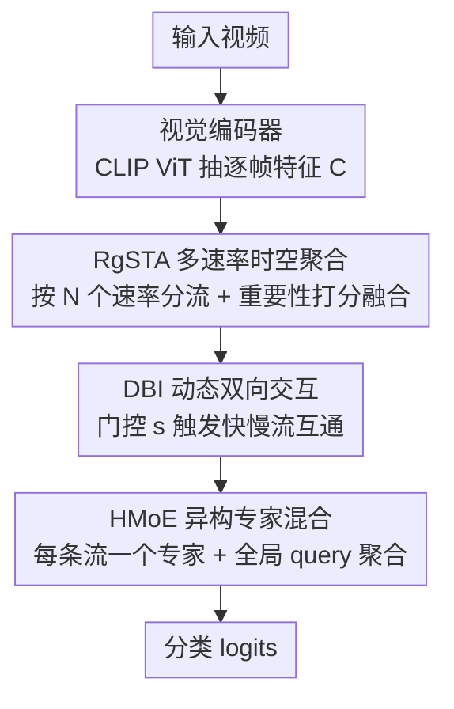

# VidPrism: Heterogeneous Mixture of Experts for Image-to-Video Transfer

**会议**: CVPR 2026  
**论文**: [CVF Open Access](https://openaccess.thecvf.com/content/CVPR2026/html/Lin_VidPrism_Heterogeneous_Mixture_of_Experts_for_Image-to-Video_Transfer_CVPR_2026_paper.html)  
**代码**: https://github.com/Lrrrr549/VidPrism.git  
**领域**: 视频理解 / 图像到视频迁移  
**关键词**: 图像到视频迁移, 异构专家混合, 多速率采样, 时序建模, CLIP 适配

## 一句话总结
VidPrism 把图像-视频迁移里的 Mixture-of-Experts 从"一群同质通才专家"改造成"按时间分辨率分工的异构专家"：用内容感知的多速率采样给每个专家喂不同节奏的视频流、用动态双向交互让快慢通路互通信息，在 K400/UCF-101/HMDB-51/SSv2 上以更低算力刷新 SOTA。

## 研究背景与动机
**领域现状**：把大规模视觉-语言模型（VLM，如 CLIP）适配到视频理解，即"图像到视频迁移（I2V transfer）"，已是主流范式。CLIP 这类模型在图文对上预训练、有强大的零样本/少样本能力，但因为是图像预训练，天然缺时序建模能力。近期一条有效路线是在冻结的图像编码器上加可训练的时序模块，而最新的工作（如 MoTE）开始用 Mixture-of-Experts 当这个时序模块，靠条件路由增强时序专精度。

**现有痛点**：传统 MoE 用在视频上有个内在缺陷——**专家同质化（expert homogenization）**。标准 MoE 里所有专家吃的是同一份未分化的输入流，于是每个专家都被逼成"通才"，冗余地学重叠特征。论文用一张注意力可视化把问题摆出来（Figure 1）：同质的 MoTE 基线在一段灌篮视频里的帧间注意力是平的、弥散的，根本认不出"起跳—扣篮—完成"这些关键时刻；而理想模型应该在这些瞬间出现明显的注意力峰值。

**核心矛盾**：视频里"静态场景内容"和"时序演化"本就是两类不同性质的信息，需要不同的计算路径来建模。同质 MoE 用一份输入硬塞给所有专家，无法构造出这种专门化的路径，导致算力浪费在重复学习上。

**切入角度**：作者借了神经科学"双流假说（two-stream hypothesis）"——大脑里存在并行的"what（空间）"和"how（时序）"通路来理解复杂视频。论文把这个固定双通路的思想推广成更灵活的**多通路**框架：不再是 2 条，而是 N 条不同时间尺度的通路，每条绑一组功能专精的异构专家。

**核心 idea**：构造一个异构时序 MoE——用内容感知机制把视频拆成多条"从语义丰富的慢流到运动密集的快流"的多速率输入，分别喂给专精空间推理或运动建模的异构专家，再用双向交互让通路间协作，最后聚合成统一的视频表示。要落地这个想法需回答两个问题：① 怎么给每个专家最相关的输入？② 这些专家怎么有效协作与共享信息？

## 方法详解

### 整体框架
VidPrism 的输入是一段视频，输出是分类 logits，中间走四步：① 视觉编码器（CLIP ViT）抽出逐帧特征 $C \in \mathbb{R}^{T \times B \times D}$；② **多个 RgSTA 模块**把这串帧特征按不同速率 $r_i$ 切成 $N$ 条并行流，每条有独立的时空分辨率（慢流帧少、语义稠；快流帧多、运动密）；③ **DBI 模块**在这些多速率流之间做选择性的双向信息融合；④ **HMoE 模块**给每条流配一个专属专家做内部时序建模，再用一个全局可学习 query 把所有专家的输出聚成一个视频级向量送分类器。

核心思路一句话：把"一份输入喂所有专家"换成"多速率分流 + 异构专家分工 + 通路互通"，让不同专家各管一个时间尺度、又不彼此孤立。

### 关键设计

**1. RgSTA 速率引导的时空聚合：给每个专家"量身定制"输入流，而不是丢帧**

传统做法按固定速率采样帧特征，容易漏掉重要时序信息。RgSTA（Rate-guided Spatio-Temporal Aggregation）要解决的是"challenge 1：怎么给每个专家最相关的输入"。它先把帧特征 $C$ 按速率 $r_i$ 切成 $c_i \in \mathbb{R}^{T_i \times B \times D}$（$T_i = T/r_i$，速率越大、流越短），然后在每个分组里做"重要性感知的合并而非丢弃"。

重要性打分用了**混合机制**：一路是可学习的预测分 $s_{pred}$，把特征投影到度量空间再过一个 ScoreHead 标量打分，$s_{pred,i} = \text{ScoreHead}(\text{LN}(\text{MetricProj}(c_i)))$；另一路是特征的内在属性 $s_{norm,i} = \|c_i\|_2$（L2 范数越大、信号越富）。两者加权融合：

$$s_{mix,i} = \alpha \cdot s_{pred,i} + (1-\alpha) \cdot s_{norm,i}$$

每组里选最高分的特征进 kept set，其余进 rest set。关键是**不丢 rest set**：算 rest 与 kept 的余弦相似度矩阵 $S_{rest \to kept} = Z_{rest} Z_{kept}^T$，Softmax（带温度 $\tau$）成注意力权重 $A_{norm}$，再把 rest 的信息按权重加权累加回 kept：$C'_{kept} = C_{kept} + \delta (A_{norm})^T C_{rest}$。这样既让序列更紧凑（只留最重要的帧），又把被丢帧的信息融进了保留的关键帧——所谓"合并而非丢弃"，保证不丢有价值信息的同时让表示更高效。

**2. DBI 动态双向交互：让快慢通路按需互通，而不是各自为政**

多速率分流后，不同通路捕捉的是不同时间分辨率的动态信息，如果各自孤立处理就失去了协作。DBI（Dynamic Bidirectional Interaction）解决"challenge 2：专家间怎么协作"。它的精髓是**先判断该不该通信、再决定怎么通**：对任意两条通路 $(i,j)$，先各自时间维全局平均池化得全局摘要向量 $g_k = \frac{1}{T_k}\sum_t F_{k,t}$，拼接后过一个专属 MLP 加 Sigmoid，得到交互分数：

$$s_{i \leftrightarrow j} = \sigma(\text{MLP}_{i \leftrightarrow j}([g_i; g_j]))$$

这个 $s_{i \leftrightarrow j} \in [0,1]$ 当门控用，并设阈值——只有分数达标才真正触发双向交互，从而稀疏连接、省算力。真要交互时分两条互补的流：**Slow-to-Fast** 把慢流的高层上下文注入快流，先线性插值对齐时间维再过 $1\times1$ 卷积，按门控分数残差加入快流 $F_j^{fast} = F_j + s_{i \leftrightarrow j} \cdot \text{Conv}_{1\times1}(I(F_i))$；**Fast-to-Slow** 把快流的细粒度运动注入慢流，用步长 $S = R_j/R_i$ 的时序卷积做下采样再注入 $F_j^{slow} = F_j + s_{i \leftrightarrow j} \cdot \text{T-Conv}(F_i)$。一对多交互时并行处理所有源通路、按门控加权累加进目标通路。这样慢流补到了运动细节、快流补到了全局结构，两者协同而非冗余。

**3. HMoE 异构专家混合：专家按时间尺度分工，全局 query 统一聚合**

这是把"异构"落到实处的模块，对应方法名里的核心。前两步产出的多速率流长度和语义侧重各不相同，HMoE（Heterogeneous Mixture-of-Experts）给**每条输入流配一个专属专家**——每个专家是标准 Transformer 层（MHSA + FFN，带残差和 LN），且**只在单一特定速率上训练**，从而强制功能异构：rate=2 的专家专攻细粒度运动、rate=16 的专家专攻全局语义。

各专家独立处理完后用 **Combination 机制**聚合：引入一个可学习的**全局 query 向量** $q_{global} \in \mathbb{R}^{1 \times D}$，把所有专家输出在时间维拼成 $F_{concat}$，以 $q_{global}$ 为 Query、$F_{concat}$ 为 Key/Value 做多头交叉注意力 $V_{fused} = \text{MHA}(q_{global}, F_{concat})$，得到单个聚合向量送分类器出 logits。这个 query 学的是"如何从所有专家里高效汇总对任务最重要的信息"，权重由 query 与各特征的相似度动态决定——比起简单池化或局部注意力，它能建模跨专家的全局长程依赖（消融里 GlobalAttn 明显优于 LocalAttn/池化/MLP）。

### 损失函数 / 训练策略
总损失是四项加权和：$L_{total} = L_{cls} + \lambda_{rank}L_{rank} + \lambda_{div}L_{div} + \lambda_{gate}L_{gate}$。

- **分类损失 $L_{cls}$**：标准交叉熵，作用在融合向量 $V_{fused}$ 上，是主监督。
- **排序损失 $L_{rank}$**：监督 RgSTA 里的 ScoreHead 学到更可靠的重要性排序。目标分由范数加窗内平均相似度构成 $s_{tgt,i} = \|c_i\|_2 + \frac{1}{N}\sum_j S_{ij}$，用 KL 散度让预测分布逼近目标分布 $L_{rank} = \text{KL}(\text{Softmax}(s_{tgt}/T_s) \| \text{Softmax}(s_{pred}/T_s))$。
- **多样性损失 $L_{div}$**：最大化不同专家输出特征间的距离（最小化两两余弦相似度），逼专家学互补特征、各守自己的时间尺度。
- **门控平衡损失 $L_{gate}$**：防止 Combination 的注意力只依赖少数专家。$C_i$ 是专家 $i$ 在 batch 内的平均贡献，$L_{gate} = N \sum_i C_i^2$ 惩罚贡献失衡，逼所有专家都被用上。

训练设置：CLIP ViT-B/16 与 ViT-L/14 当视觉骨干；8 帧时用速率 2/4/8 的三专家，32 帧时用速率 2/4/8/16 的四专家；2 张 A100。

## 实验关键数据

### 主实验
Kinetics-400 闭集识别（Per-view GFLOPs，输入为 帧×crops×clips）：

| 方法 | 输入 | Top-1(%) | GFLOPs | 备注 |
|------|------|----------|--------|------|
| MoTE-B/16（基线） | 8×4×3 | 83.0 | 141 | 同质 MoE |
| FocusVideo-B/16 | 8×4×3 | 84.1 | 204 | 之前强基线 |
| **VidPrism-B/16** | 8×4×3 | **84.0** | 162 | 比 MoTE +1.0%，算力远低于 FocusVideo |
| **VidPrism-B/16** | 32×4×3 | **85.1** | 721 | 超过 MoTE/FocusVideo |
| MoTE-L/14 | 8×4×3 | 86.8 | 649 | |
| **VidPrism-L/14** | 8×4×3 | **87.4** | 632 | 比 MoTE +0.6%，算力相当 |
| **VidPrism-L/14** | 32×4×3 | **88.6** | 2594 | L/14 上进一步提升 |

少样本识别（HMDB51 / UCF101 / SSv2，VidPrism-C 用 CLIP、VidPrism-M 用 VideoMAEv2）：

| 数据集 | 设置 | MoTE | 本文最优 | 说明 |
|--------|------|------|----------|------|
| HMDB51 | K=16 | 68.2 | **74.1** (VidPrism-C) | 新 SOTA |
| UCF101 | K=16 | 93.6 | **96.6** (VidPrism-M) | 全设置横扫 |
| SSv2 | K=16 | 12.2 | **18.3** (VidPrism-M) | 刷新记录 |

### 消融实验
| 维度 | 配置 | UCF-101 | HMDB-51 | 说明 |
|------|------|---------|---------|------|
| 专家数 | 1 个 (rate 4) | 94.8 | 74.3 | 单尺度基线 |
| 专家数 | 2 个 (2,8) | 95.3 | 73.9 | 双尺度提升 |
| 专家数 | 3 个 (2,4,8) | 94.6 | 74.2 | 反而略降（冗余/优化难） |
| 专家数 | **4 个 (2,4,8,16)** | **95.9** | **76.3** | 最优，最终配置 |
| 聚合 | Hard Sampling / Avg / Max | 94.7~95.2 | 75.0~75.5 | 直接采样/池化 |
| 聚合 | **RgSTA** | **95.9** | **76.3** | 合并而非丢弃 |
| 交互 | None / Slow2Fast / Fast2Slow | 95.0~95.3 | 73.6~74.9 | 单向或不交互 |
| 交互 | **DBI（双向）** | **95.9** | **76.3** | 双向最佳 |
| 聚合头 | Avg/Linear/MLP/LocalAttn | 94.5~95.1 | 73.9~75.6 | 局部/无上下文 |
| 聚合头 | **GlobalAttn** | **95.9** | **76.3** | 全局长程依赖 |

监督消融（逐项叠加，UCF-101 / HMDB-51）：仅 $L_{cls}$ 为 94.5/75.1 → 加 $L_{rank}$ 提到 95.2/75.6 → 加 $L_{div}$ 到 95.4/75.5 → 加 $L_{gate}$ 到 **95.9/76.3**，门控平衡损失带来最大单项增益。

### 关键发现
- **专家数不是越多越好**：从 1 增到 2 有提升，但 3 个反而略降（引入冗余/优化困难），4 个（2,4,8,16）才达最优——说明"覆盖多样时间分辨率"比"堆专家数量"更重要，时间尺度的多样性是关键。
- **门控平衡损失贡献最突出**：四项损失里 $L_{gate}$ 带来最大单项提升，印证了"防止聚合时只用少数专家"是异构 MoE 能真正分工的前提。
- **双向交互不可省**：单向（Slow2Fast 或 Fast2Slow）都不如双向，单向会限制特征的完整性、甚至有害。
- **专家用量可视化**：训练集与正确分类样本的专家激活模式高度一致（学到了稳定可泛化的分配策略），不同动作类别用不同专家（证明确有功能分工）；而误分类样本的热图明显偏离，例如类别 16 的错误与专家 3 过度激活相关——错误往往源于没选对最合适的专家。

## 亮点与洞察
- **把 MoE 的"异构"从口号做成机制**：不是靠路由让同质专家偶尔不同，而是从输入侧（多速率分流）+ 训练侧（每专家只训一个速率 + 多样性损失）双管齐下硬性绑定异构，思路干净且可验证（专家用量可视化）。
- **"合并而非丢弃"的采样观**：RgSTA 把传统"丢帧降冗余"换成"把被丢帧的信息加权融回保留帧"，在压缩序列的同时保信息——这个 trick 可迁移到任何需要 token/帧裁剪的视频/长序列任务。
- **门控决定"要不要通信"再决定"怎么通信"**：DBI 用轻量 filter 网络先算交互分数 + 阈值，把跨通路交互做成稀疏、按需触发，既省算力又避免无意义信息污染——这种"先判断必要性"的设计比无脑全连接交互优雅。
- **效率-性能平衡漂亮**：B/16 8 帧只用 162 GFLOPs 就追平 204 GFLOPs 的 FocusVideo，L/14 上还能用更低算力超过 MoTE，说明异构分工本身就是更高效的表示学习策略。

## 局限性 / 可改进方向
- **专家数与速率组合靠手工网格搜**：3 专家反而掉点、4 专家最优，这种非单调关系目前只能靠消融试出来，没有自适应决定专家数/速率的机制，换数据集可能要重搜。
- **任务局限在视频分类/识别**：方法只在 recognition 上验证，全局 query 聚成单向量 + 分类器的设计天然偏分类；能否迁移到时序定位、视频问答、密集预测等需要保留时序结构的任务存疑。
- **SSv2 绝对精度仍低**：在强时序依赖的 SSv2 上 K=16 也才 18.3%，说明 I2V 迁移范式对"必须理解动作顺序"的细粒度时序推理仍有根本短板，多速率分流缓解但没解决。
- **可改进方向**：让交互阈值/专家速率随内容自适应（如用 gating 分数动态增删专家）；把全局 query 换成多 query 以保留时序结构、支持密集任务。

## 相关工作与启发
- **vs MoTE**：MoTE 同样用 MoE 做时序模块，但专家同质、吃同一份输入，导致注意力平弥散；VidPrism 用多速率分流 + 异构专家把专家按时间尺度分工，注意力能对齐关键动作瞬间，在 K400 上 +0.6~1.0%、少样本全面超越。本文本质是对 MoTE"同质化"问题的针对性修复。
- **vs SlowFast / 多通路方法**：经典多通路（如 SlowFast）用固定的双速率慢/快通路，VidPrism 把它从固定双通路推广到内容自适应的多通路，且通路绑专家 + 双向门控交互，比固定预设帧率的静态设计更灵活。
- **vs ST-Adapter / AIM / FocusVideo 等 I2V 适配**：这些工作靠加时序 adapter/embedding/可学习 query 给冻结图像编码器补时序，VidPrism 的差异是把时序模块做成"异构 MoE + 多速率输入"，在相近或更低算力下取得更优精度，强调"分工"而非"单一通用模块"。

## 评分
- 新颖性: ⭐⭐⭐⭐ 把双流假说推广成多速率异构 MoE，从输入和训练两侧硬性制造专家异构，是对同质 MoE 的有针对性创新；但底层组件（多速率、交叉注意力聚合、辅助损失）多为已有思想的组合。
- 实验充分度: ⭐⭐⭐⭐ 覆盖 4 个 benchmark、闭集+少样本、两种骨干，消融把专家数/聚合/交互/聚合头/损失逐项拆开，还有专家用量可视化佐证分工；但缺与更大规模视频模型的横向比较。
- 写作质量: ⭐⭐⭐⭐ 动机用 Figure 1 立住、双流假说串起全文逻辑清晰，公式与模块对应明确；个别符号（如 $R_i$ 与 $r_i$、STAM 与 RgSTA 命名）略有混用。
- 价值: ⭐⭐⭐⭐ 在 I2V 迁移这一主流范式上提供了高效的异构 MoE 方案，"合并而非丢弃""按需稀疏交互"等 trick 可复用；开源代码加分。

<!-- RELATED:START -->

## 相关论文

- [\[CVPR 2026\] From Static to Dynamic: Exploring Self-supervised Image-to-Video Representation Transfer Learning](from_static_to_dynamic_exploring_self-supervised_image-to-video_representation_t.md)
- [\[CVPR 2026\] One-to-All Animation: Alignment-Free Character Animation and Image Pose Transfer](one-to-all_animation_alignment-free_character_animation_and_image_pose_transfer.md)
- [\[CVPR 2026\] Let Your Image Move with Your Motion! – Implicit Multi-Object Multi-Motion Transfer](let_your_image_move_with_your_motion_--_implicit_multi-object_multi-motion_trans.md)
- [\[CVPR 2026\] Accelerating Diffusion-based Video Editing via Heterogeneous Caching: Beyond Full Computing at Sampled Denoising Timestep](accelerating_diffusion-based_video_editing_via_heterogeneous_caching_beyond_full.md)
- [\[CVPR 2026\] Are Image-to-Video Models Good Zero-Shot Image Editors?](are_image-to-video_models_good_zero-shot_image_editors.md)

<!-- RELATED:END -->
