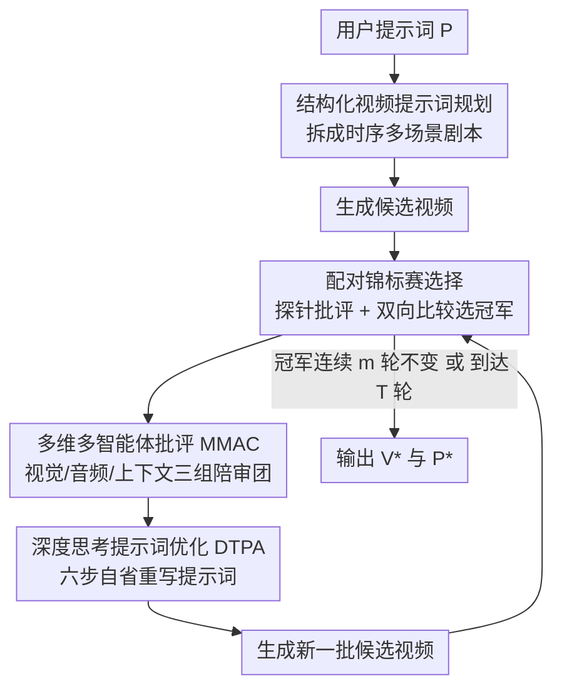

# VISTA: A Test-Time Self-Improving Video Generation Agent

**会议**: CVPR 2026  
**论文**: [CVF Open Access](https://openaccess.thecvf.com/content/CVPR2026/html/Long_VISTA_A_Test-Time_Self-Improving_Video_Generation_Agent_CVPR_2026_paper.html)  
**领域**: 视频生成 / Agent  
**关键词**: 文生视频, 测试时优化, 多智能体, 提示词优化, 自改进

## 一句话总结
VISTA 是一个不碰模型权重、纯靠"反复改提示词 + 自我评判"在测试时迭代提升文生视频质量的多智能体系统，把用户想法拆成结构化时序剧本、用配对锦标赛选出最佳视频、再由视觉/音频/上下文三组陪审团式 agent 挑刺并由推理 agent 重写提示词，对 Veo 3 这类 SOTA 模型仍能拿到最高 60% 配对胜率、人类评测也有 66.4% 偏好。

## 研究背景与动机

**领域现状**：Veo 3、Sora 2 这类文生视频（T2V）模型已经能从文字生成高质量、带音频的连贯视频，但它们对提示词的措辞极度敏感——同一个想法换个说法，输出质量可能天差地别。用户因此被迫陷入"改措辞→生成→筛选→再改"的手工试错循环。

**现有痛点**：测试时优化（test-time optimization）在文本、图像领域已经能自动提升生成质量并对齐偏好，但搬到视频上几乎全面失灵。视频不像文本/图像那样是单一模态、单一维度的对象——它跨越多个场景、多个模态（画面+声音）、还要承载高层语义和常识，评估和优化的复杂度陡增。已有工作只盯着视频的某一个侧面：有的只管物体一致性，有的只优化无害-准确-有用，有的只追视觉奖励，没人把视觉、音频、上下文这三大决定用户满意度的维度放进同一个优化框架里。

**核心矛盾**：要在测试时自改进视频，必须解决两个相互纠缠的难题——一是"怎么评"：没有 ground truth，单纯让 MLLM 打分既主观又不可靠，而且面对 Veo 3 这种本就很强的模型，评判者往往只会说"挺好的"，挑不出深层毛病；二是"怎么改"：直接让 MLLM 根据反馈重写提示词，常常把提示词改得过度复杂、对批评的理解又很肤浅。评得不准、改得不对，迭代就会原地打转甚至倒退。

**本文目标**：构建一个黑盒（不需要模型权重/微调）、可配置、能在测试时持续自改进的系统，同时联合优化视觉、音频、上下文三个维度。

**切入角度**：模仿人类优化视频的流程——人会先把想法拆成有时间线的分镜，生成几版后两两比较挑最好的一版，然后从不同角度找毛病，最后想清楚问题根源再针对性地改提示词。把这套"人类怎么调视频"翻译成多 agent 协作。

**核心 idea**：用"结构化时序规划 + 配对锦标赛选择 + 多维多智能体陪审挑刺 + 深度思考式提示词重写"组成的迭代闭环，在测试时只改提示词、不改模型，把单一维度的视频评估变成失败导向（failure-focused）的多维联合优化。

## 方法详解

### 整体框架
VISTA 接收用户的视频提示词 $P$，输出一段优化后的视频 $V^{*}$ 及其对应的精炼提示词 $P^{*}$，整个过程分两个阶段闭环迭代：**初始化阶段**和**自改进阶段**。

初始化阶段做两件事：先把 $P$ 解析成多个时序分镜的候选提示词并各自生成候选视频（Step 1 结构化规划），再用配对锦标赛从这批候选里选出当前最佳的"视频-提示词"对 $(V^{*}, P^{*})$（Step 2 锦标赛选择）。自改进阶段是一个循环：对当前冠军视频做多维多智能体批评得到反馈 $F$（Step 3），由推理 agent 根据 $F$ 重写提示词并采样出新一批候选（Step 4），重新生成视频后再跑一次锦标赛选出新冠军（回到 Step 2）。这个循环跑到达到最大迭代数 $T$、或冠军连续 $m$ 轮不变（早停）为止。默认配置是 1 轮初始化 + 4 轮自改进共 5 轮，每轮采样 5 个提示词 × 3 个变体 × 每个生成 2 段视频 = 每轮 30 段视频。

### 关键设计

**1. 结构化视频提示词规划：把一句话想法拆成有时间线的多场景剧本**

针对"用户一句话提示词信息稀疏、模型只能猜"的痛点，VISTA 先用一个多模态 LLM（MLLM）把 $P$ 解析成 $m$ 个带时间顺序的场景序列，每个候选 $P_i := [S_{i,1}, S_{i,2}, \dots]$。每个场景 $S_{i,j}$ 默认由九个属性刻画，横跨上下文、视觉、音频三个维度：时长、场景类型、人物/实体、动作、对白、视觉环境、镜头语言、声音、情绪氛围。MLLM 会在用户没说清时推断缺失属性，同时默认强制三条规划约束——真实性（除非提示词指明是动画/奇幻，否则要符合现实物理）、相关性（只放进明确提到或隐含的元素，不乱发明）、创造性（在有益时鼓励环境音和转场）。

它相比此前工作有两个新意：一是**时序场景级分解**，把提示词组织成语义连贯的片段，让系统能对复杂内容做推理；二是**细粒度多模态视频提示**，正是这种逐属性、逐场景的结构化表示，才让后面的多维批评和自改进"有抓手"——批评 agent 能精确指出"第二个场景的镜头焦点不对"而不是泛泛说"画面不好"。值得一提的是，系统还在候选集里保留一个未分解的残差 $P$，照顾那些不吃分解这套的模型。

**2. 配对锦标赛选择 + 探针批评：用两两 PK 而非绝对打分挑出最佳视频**

针对"无 ground truth 时给视频绝对打分既贵又不可靠"的痛点，VISTA 不用传统的多指标打分系统，而是把 MLLM 当裁判做**配对比较**——这更贴合人类偏好、也避开了模型自身的打分偏置。具体用二叉锦标赛（Binary Tournament，见 Alg. 2）逐轮淘汰：每轮把视频两两配对，每对都**双向比较**（交换 $V_i, V_j$ 的输入顺序各判一次，规避 token 位置偏置），两次判定一致才确定胜负、不一致则随机判，只有赢家进入下一轮。

但作者发现，让模型一边分析视频一边比较，"双重负担"会导致判断不够苛刻。于是引入**两步分解**：先对每个视频单独生成"探针批评"（probing critiques，Alg. 2 的 $Q$），再拿这些批评去支撑比较。评判跨多条标准 $M^{S}_{\text{user}}$（默认含视觉保真、物理常识、文-视对齐、音-视对齐、吸引力），赢得更多标准的视频胜出。最终还叠了一层失败惩罚，候选 $V_i$ 的得分为：

$$s_i = \frac{1}{k}\sum_{C \in M^{S}_{\text{user}}}\left[\omega(C, V_i, V_j) - \epsilon\,\mathbb{1}(C, V_i)\right]$$

其中 $\omega(C, V_i, V_j) \in \{0, 0.5, 1\}$ 表示 $V_i$ 在标准 $C$ 上对 $V_j$ 的输/平/赢，$\mathbb{1}(C, V) \in \{0, 1\}$ 表示 $V$ 是否违反该标准，$\epsilon$ 是违反时施加的惩罚项。这样既保留配对比较的可靠性，又能主动对 T2V 常见失败（如违反物理常识）扣分，把这些"硬伤视频"挡在冠军门外。

**3. 多维多智能体批评（MMAC）：仿陪审团给 SOTA 视频挑出深层毛病**

针对"Veo 3 输出已经很好、直接让 MLLM 批评只会给出肤浅无用意见"的痛点，VISTA 把评估拆成三个维度 $D = \{$视觉, 音频, 上下文$\}$，每个维度独立配一套系统，评估标准由 $M^{C}_{\text{user}}$ 配置（比 Step 2 更细更全，因为这一步追求深度诊断）——视觉含视觉保真/运动动态/时序一致/镜头焦点/视觉安全，音频含音频保真/音视对齐/音频安全，上下文含情境适配/语义连贯/文视对齐/物理常识/吸引力/视频格式（开头-结尾-转场）。

关键在于借鉴**陪审团决策过程**，每个维度 $D$ 都构建一个三方法庭：**普通法官** $J^{+}_D$ 既看好的一面也看坏的一面给出批评和分数，**对抗法官** $J^{-}_D$ 专门提出质疑、反论点来暴露视频缺陷，**元法官** $J^{*}_D$ 综合正反双方意见拍板：

$$\{C^{*}_D, S^{*}_D\} \leftarrow J^{*}_D\left(P, C^{+}_D, S^{+}_D, C^{-}_D, S^{-}_D\right)$$

最终反馈 $F := \{C^{*}_D, S^{*}_D \mid D \in D\}$，其中分数按 1-10 打分。这种"正方+反方+裁决"的对抗结构，逼着系统从"找明显失败"升级到"诊断那些隐蔽而复杂的缺陷"——消融实验显示，只留对抗法官在多场景上会停滞，只留普通法官则很快崩溃，两者缺一不可，正是三方互补才稳。

**4. 深度思考提示词优化 agent（DTPA）：六步自省把批评翻译成精准改写**

针对"直接让 MLLM 根据批评改提示词会过度复杂化、且对批评理解肤浅"的痛点，VISTA 用一个深度思考提示词 agent（DTPA），在一条思维链里做六步自省式推理：(1) 通过元分数低（$\leq 8$）的指标定位视频问题；(2) 厘清期望结果和成功标准；(3) 评估当前提示词上下文是否充分；(4) 判断失败到底来自模型能力还是提示词本身；(5) 检测提示词内部是否有冲突或含糊；基于这套内省分析提出一组修改动作 $M := \{M_1, \dots\} \leftarrow \text{DTPA}((P, P^{*}, F))$，最后 (6) 回查并精修这些动作确保真正覆盖了第(1)步识别的失败。

这些修改动作 $M$ 随后被用来采样出改进的提示词 $P := \{P_1, \dots, P_n, P^{*}\} \leftarrow \text{MLLM}(P, P^{*}, M)$，进入下一轮生成。第 (4) 步"判断锅在模型还是提示词"尤其关键——它避免了系统徒劳地去改一个模型本身就做不到的事情，把优化预算花在提示词真能撬动的地方。消融显示去掉 DTPA 后改进虽更平滑但整体更低，印证了复杂多场景生成确实需要"推理驱动"而非"照搬反馈"的改写。

## 实验关键数据

### 主实验
评测在两个场景上展开：单场景（沿用 MovieGenVideo benchmark 随机抽 100 个提示词）和多场景（内部数据集 161 个至少含两场景的提示词）。MLLM 用 Gemini 2.5 Flash，T2V 生成器用 Veo 3。基线包括直接提示（DP）、视觉自精炼（VSR/VSR++）、Rewrite、VPO。评估用 Gemini 2.5 Flash 做双向配对比较，记 Win/Tie/Loss，$\Delta = \text{Win} - \text{Loss}$。VISTA 跑 5 轮。

下表为各方法相对直接提示（DP）的胜率与 $\Delta$（取第 5 轮，†表示规模放大版基线）：

| 场景 | 方法 | Win(%) | Loss(%) | Δ(%) |
|------|------|--------|---------|------|
| 单场景 | VSR | 24.6 | 27.7 | -3.1 |
| 单场景 | VSR++† | 33.3 | 13.3 | 20.0 |
| 单场景 | Rewrite† | 27.0 | 8.0 | 19.0 |
| 单场景 | VPO† | 36.0 | 8.0 | 28.0 |
| 单场景 | **VISTA** | **45.9** | **13.9** | **32.0** |
| 多场景 | VSR | 35.3 | 18.8 | 16.5 |
| 多场景 | VPO† | 27.0 | 12.4 | 14.6 |
| 多场景 | **VISTA** | **46.3** | **11.2** | **35.1** |

VISTA 对各基线的直接配对胜率在单场景 27.8–60.0%、多场景 18.5–53.2%。常规指标上，VISTA 单场景动态质量（Dynamic Quality）89.87% 远超最佳基线 77.22%，CLIP-Score 比最佳基线高 +3%（绝对），并降低了音频噪声（+0.1/5）和不连续（+0.11/5）。

人类评测（5 名有提示词优化经验的标注者）：VISTA 对最强基线胜率 **66.4% vs 33.6%**；自改进轨迹打分 VISTA 平均 3.78/5 高于 VSR(++) 的 3.33；视觉质量从 DP 的 3.36 提到 3.77，音频质量 3.47 vs DP 3.21。

### 消融实验
下表为各模块消融相对 DP 的胜率（取首轮 Init 与第 5 轮，单场景）：

| 配置 | Init(%) | 第5轮(%) | 说明 |
|------|---------|---------|------|
| VISTA（完整） | 35.5 | 45.9 | 完整系统 |
| w/o 结构化规划(Step 1) | 25.2 | 35.1 | 初始化变弱（Init 25.2 vs 35.5） |
| w/o 锦标赛选择(Step 2) | 24.5 | 33.3 | 改用简单双向比较，过程不稳定 |
| w/ 仅对抗法官 | 35.0 | 42.0 | 单场景强但多场景停滞(18.8%) |
| w/ 仅普通法官 | 35.0 | 17.2 | 第5轮快速崩溃 |
| w/o DTPA(Step 4) | 35.0 | 37.8 | 改进更平滑但整体更低 |

### 关键发现
- **每个模块都不可省**：去掉任意一步都掉点，且失效方式各异——去掉结构化规划主要伤初始化；去掉锦标赛选择会让性能"早期还行、后期崩盘"；只留普通法官第 5 轮直接崩到 17.2%，说明对抗法官提供的"挑刺压力"是稳定改进的关键。
- **能随测试时算力稳定 scaling**：基线放大视频数后改进噪声大、无持续提升，而 VISTA 单场景可一路跑到 20 轮仍稳步上升，平均胜率最终约 46.1%；每轮约消耗 0.7M token、28 段视频，主要开销来自锦标赛选择中密集帧输入的 token 消耗（每次视频评估 >2K token），作者视其为 MLLM 暂时的低效而非根本限制。
- **跨 T2V 模型可迁移**：换 Veo 2 时单场景胜率从 15.0%→23.8%、多场景 27.6%→33.3%；换 Wan2.2-T2V-A14B 时单场景 30.3%→40.8%、多场景 17.4%→30.7%。增益不如 Veo 3 明显，作者归因于较弱模型难以充分利用 VISTA 优化出的细粒度细节。
- **增益不与"基线相对 DP 的强弱"相关**：例如 VSR 对 DP 表现最好，但 VISTA 反而对它领先最多，作者认为这反映了 VISTA 对多个视频维度的 Pareto 优化，而基线只覆盖较窄的少数侧面。

## 亮点与洞察
- **把"配对比较 + 失败惩罚"做进选择环节**：在没有 ground truth 的视频评估里，用双向配对锦标赛替代绝对打分规避位置/token 偏置，再叠一层对常见 T2V 失败的惩罚项，等于把"硬伤过滤"内建进选择——这套"先探针批评、再配对比较"的两步分解可直接迁移到任何 LLM-as-Judge 的无参考评估场景。
- **陪审团式的"对抗法官"是挑出深层毛病的关键**：当被评对象本身已经很强（Veo 3），普通批评会失效，引入一个专门"找茬"的对抗 agent 提供反方压力，再用元法官裁决，是让批评从"表面好评"变成"深度诊断"的巧妙机制，消融数据强力支撑了这一点。
- **DTPA 的"判断锅在模型还是提示词"这一步很有迁移价值**：自改进系统最容易浪费算力在"改一个本就做不到的事"上，显式让 agent 先归因失败来源，把优化预算引导到真正可撬动的地方——这个思路对任何提示词优化/agentic 自改进框架都适用。
- **全程黑盒、不动权重**：纯靠改提示词就对 SOTA 闭源模型实现测试时质量提升，意味着这套方法对任何只开放 API 的视频/多模态生成服务都即插即用。

## 局限与展望
- **成本不低**：每轮约 0.7M token + 28 段视频，主要来自锦标赛选择中密集帧输入的 token 开销（每次评估 >2K token）。作者称这是 MLLM 当前低效的暂时性约束，但在实际部署中迭代 5 轮的真实开销（API 费用 + 视频生成时延）相当可观，文中未给出端到端的钱/时间成本核算。
- **依赖一个足够强的 MLLM 当裁判兼优化器**：整套评判、批评、重写都压在 MLLM（Gemini 2.5 Flash）身上，裁判本身的偏置/盲区会直接传导到优化方向；换更弱的评判模型时效果是否还成立，文中只在附录提了 Gemini 2.5 Pro / Qwen2.5-VL 趋势相似，但没系统量化裁判强弱对结果的影响。
- **多场景内部 benchmark 不可复现**：多场景评测用的是 161 条内部数据集，外部无法对齐复现，且部分结果是在半个 benchmark 上评的（表中下划线标注），削弱了多场景结论的说服力。
- **增益高度依赖底层 T2V 模型的"可调性"**：在较弱模型（Veo 2、Wan2.2）上增益明显缩水，说明 VISTA 更像是"帮强模型把已有能力榨出来"，对能力本身有短板的模型帮助有限——这限制了它在开源弱模型上的实用价值。

## 相关工作与启发
- **vs VideoAgent / MotionPrompt / RAPO**: 它们要么需要在线执行轨迹微调生成模型（白盒）、要么学 token 嵌入、要么训练时依赖目标提示词；VISTA 是纯黑盒、测试时、不微调，且是首个联合优化视觉+音频+上下文三维度的。
- **vs Video-T1**: Video-T1 把视频测试时扩展形式化为对去噪轨迹的搜索，但不进一步改进视频本身；VISTA 在提示词空间做迭代自改进，关注点不同且互补。
- **vs VPO**: VPO 优化用户输入的无害/准确/有用三原则，但不是在测试时做；VISTA 把它推进到测试时黑盒提示词优化。
- **vs Mora / FilmAgent 等多 agent 系统**: 它们做剧本写作、镜头调度等 agentic 工作流，但不做测试时质量优化；VISTA 提供的是正交且互补的"自动质量提升"能力。
- **vs VideoScore / Evaluation Agent**: 这俩是最接近 MMAC 的评估器，但都不是失败导向、且忽略音频维度；VISTA 强调对 SOTA 模型也敏感的"失败导向"视觉+音频指标。

## 评分
- 新颖性: ⭐⭐⭐⭐⭐ 首个黑盒、测试时、联合视觉+音频+上下文三维度自改进视频生成的多智能体框架，陪审团式对抗批评 + 配对锦标赛选择的组合很有想法。
- 实验充分度: ⭐⭐⭐⭐ 单/多场景双 benchmark + MLLM 与人类双评测 + 完整消融 + 跨 3 个 T2V 模型 + scaling 分析，很扎实；但多场景用内部数据集、部分结果只评半个 benchmark，复现性打折。
- 写作质量: ⭐⭐⭐⭐ 动机清晰、四组件分工讲得明白、算法伪代码完整；公式符号略密，部分细节（成本核算、裁判强弱影响）留在附录。
- 价值: ⭐⭐⭐⭐⭐ 对任何只开放 API 的 SOTA 视频生成服务即插即用，把"手工调提示词"自动化，实用价值和后续 scaling 潜力都高。

<!-- RELATED:START -->

## 相关论文

- [\[CVPR 2026\] Reasoning Diffusion for Unpaired Test Time Out-of-distribution Text-Image to Video Generation](reasoning_diffusion_for_unpaired_test_time_out-of-distribution_text-image_to_vid.md)
- [\[ICLR 2026\] TTOM: Test-Time Optimization and Memorization for Compositional Video Generation](../../ICLR2026/video_generation/ttom_test-time_optimization_and_memorization_for_compositional_video_generation.md)
- [\[CVPR 2026\] Lighting-grounded Video Generation with Renderer-based Agent Reasoning](lighting-grounded_video_generation_with_renderer-based_agent_reasoning.md)
- [\[CVPR 2025\] One-Minute Video Generation with Test-Time Training](../../CVPR2025/video_generation/one-minute_video_generation_with_test-time_training.md)
- [\[CVPR 2026\] Improving Motion in Image-to-Video Models via Adaptive Low-Pass Guidance](improving_motion_in_image-to-video_models_via_adaptive_low-pass_guidance.md)

<!-- RELATED:END -->
