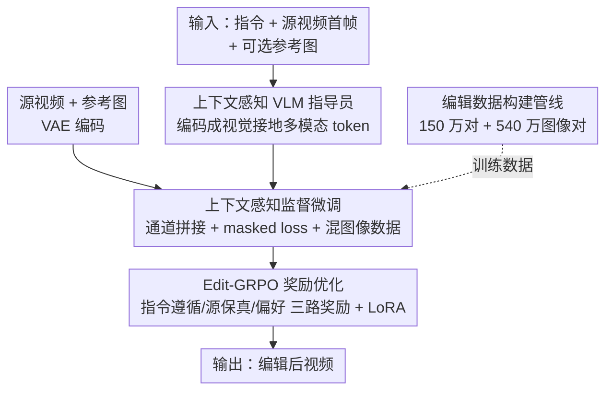

# VIVA: VLM-Guided Instruction-Based Video Editing with Reward Optimization

**会议**: CVPR 2026  
**论文**: [CVF Open Access](https://openaccess.thecvf.com/content/CVPR2026/html/Cong_VIVA_VLM-Guided_Instruction-Based_Video_Editing_with_Reward_Optimization_CVPR_2026_paper.html)  
**代码**: 项目页 https://vivapaper.github.io/ （代码待确认）  
**领域**: 视频生成 / 指令视频编辑 / 扩散模型 / 强化学习  
**关键词**: 指令视频编辑, VLM 条件编码, GRPO, 奖励优化, 数据合成

## 一句话总结
VIVA 用一个 VLM「指导员」把指令+首帧+可选参考图编码成视觉接地的多模态条件喂给视频 DiT，再用专为编辑设计的 Edit-GRPO 后训练（指令遵循/源保真/人类偏好三路奖励）做对齐，配合自建 150 万对合成数据，在 VIE-Bench 上指令遵循与编辑质量全面超过开源 SOTA、逼近商用 Runway Gen-4 Aleph。

## 研究背景与动机
**领域现状**：指令式视频编辑（instruction-based video editing）希望用户只给一句自然语言指令，模型就把输入视频按要求改掉，同时保持没被改的区域不变、时序连贯。主流做法是把它当成「输入视频 + 指令 → 编辑后视频」的有监督翻译问题，用扩散模型在「源视频—目标视频—指令」配对数据上训练。

**现有痛点**：这套范式卡在数据上。现有合成管线只能造出高度简化的编辑对——单物体增/删、在预定义 mask 内做物体替换。一旦遇到「多任务组合」「mask 外的物体替换」「改全局环境（天气、季节）」这类复杂指令，根本造不出训练对，模型也就泛化不动，真实开放域场景一上来性能就垮。同时，编辑模型的条件信号通常是 T5 这类纯文本编码，指令本身语义稀疏，模型搞不清「要改哪个区域、改成什么」，容易过度编辑（如让删香烟变成连手一起删掉）。

**核心矛盾**：编辑是高度依赖上下文的任务——要在文本指令、源视频、（可选）参考图三者之间理清复杂关系，但纯语言空间的编码器给不出足够的空间与语义接地，监督数据又只覆盖简单操作，于是「条件不够明确」和「数据不够多样」两个瓶颈叠加，把泛化能力死死压住。

**本文目标**：在只能拿到有限、简单的编辑配对数据的前提下，让模型也能在复杂编辑任务上表现好；分解为两件事——(1) 把指令表示做得更视觉接地、更不歧义；(2) 把编辑模型的优化目标从「像素级重建」拉回到「语义层面编辑是否成功」。

**切入角度**：现代大型 VLM 在「把视觉内容和细粒度自然语言对齐」上能力很强，那就用 VLM 当多模态指令编码器，把首帧塞进去做视觉接地；再借鉴 GRPO 在 LLM 上用「组内相对奖励」提升指令遵循的成功经验，把它搬到视频编辑。

**核心 idea**：用「VLM 指导员做视觉接地的条件编码」+「Edit-GRPO 用编辑专属相对奖励做后训练」，从更有限的配对数据里榨出更强的编辑能力。

## 方法详解

### 整体框架
VIVA 由两个分支构成：生成分支是一个预训练的 Diffusion Transformer（DiT，选用 HunyuanVideo-T2V-13B），理解分支是一个 VLM 指导员（LLaVA-LLaMA-3-8B）。一次编辑的数据流是：VLM 指导员吃下系统提示 + 文本指令 + 源视频首帧 + 可选参考图，吐出一串视觉接地的多模态条件 token；一个可训练的 Token Refiner 把这些 token 对齐到 DiT 的潜空间；同时源视频（和可选参考图）经 VAE 编码后与噪声潜变量在通道维拼接、投影，形成「上下文感知的噪声 token」；最后 DiT 在 VLM 条件指导下去噪，生成编辑后视频。

训练分三层：先在自建的 150 万对合成数据上做有监督微调（SFT，带 masked loss、混入图像编辑数据），再用 Edit-GRPO 做后训练对齐（三路奖励 + LoRA），而所有这些都依赖一条专门的数据构建管线提供配对样本。

### 关键设计

**1. 上下文感知的 VLM 指导员：把首帧塞进编码器，给稀疏指令补上视觉接地**

针对「纯文本编码（T5）语义稀疏、模型搞不清改哪、改成什么」这个痛点，VIVA 不再用语言空间编码器，而是让 VLM 充当多模态指令编码器。它的输入除了文本指令 $t_{ins}$，还加上从源视频采样的首帧 $I_{src}$ 和可选参考图 $I_{ref}$，取 VLM 最后一层隐状态作为条件 token：

$$x_{vlm} = \mathrm{VLM}(t_{ins}, I_{src}, I_{ref}).$$

首帧的引入让条件 token 带上了接地的、细粒度的语义偏置——VLM 能隐式分辨「要编辑的区域」和「具体的编辑实体」，从而消解 instruction-only 设计里那种因条件稀疏带来的歧义。参考图则进一步把控制从「该做什么变换（指令决定）」扩展到「编辑后内容长什么样（参考图决定）」。一个工程上很关键的取舍：作者特意选 HunyuanVideo-T2V-13B 当 backbone，因为它预训练时已经和 LLaVA-LLaMA-3-8B 的 VLM 空间对齐了——如果像别的工作那样把 Qwen2.5-VL 接到 T5 空间的 Wan 上，就得额外烧一个重型的特征空间对齐预训练，VIVA 直接绕开了这笔开销。

**2. 上下文感知的监督微调：源视频通道拼接 + masked loss + 混入图像数据**

VLM 给出了语义条件，但模型还得「看着源视频改」、保住没改区域的保真度。VIVA 把源视频的 VAE 潜变量 $z_{src}$ 和噪声潜变量 $z_{noise}$ 在通道维拼接，再 patchify、用可训练投影器 $P$ 聚合，形成上下文感知的视频 token：

$$x_{video} = P(\mathrm{Concat}(P(z_{src}), P(z_{noise}))_c).$$

这种通道拼接给去噪过程注入了一个空间与时间都对齐的归纳偏置，让生成始终锚定在源视频的结构与运动上。训练时冻结 VLM（保住它的泛化与推理能力），只训练 patchify 模块、投影器、Token Refiner 和整个 DiT，用 Flow Matching 优化。为了让损失更聚焦在编辑区域，作者把普通 Rectified Flow 损失改成带 mask 加权的版本：

$$L_{mask} = (1 + w_m M) L_{FM},$$

其中 $M$ 是数据准备阶段生成的编辑区域 mask，$w_m$ 是 mask 权重——这等于告诉模型「编辑区域算错了罚得更重」，既加速收敛又让改动更准。此外，针对配对视频数据天然稀缺、编辑类型有限的问题，VIVA 把图像当成「只有一帧的视频」，混入大规模图像编辑数据联合训练；实验发现图像域的编辑能力（如全局风格化，这在配对视频数据里根本不存在）被有效迁移到了视频域。

**3. Edit-GRPO：为视频编辑量身设计的三路相对奖励后训练**

SFT 学到的是「拟合配对样本」，但编辑成功与否是个语义判断，单靠像素重建对不齐。VIVA 把 GRPO 搬到视频编辑：对每条输入，模型采样多个候选编辑视频，用编辑专属奖励打分，再用组内相对得分更新策略。它设计了三路奖励：

*指令遵循* $R_{IF}$：理想情况下编辑后视频 $V_{edit}$ 应该更贴合编辑后描述 $t_{edit}$、而源视频 $V_{src}$ 更贴合源描述 $t_{src}$。原始目标写成 $(C(V_{edit},t_{edit})-C(V_{src},t_{edit}))+(C(V_{src},t_{src})-C(V_{edit},t_{src}))$，其中 $C(V,t)$ 是视频与文本的 CLIP 相似度。由于组内 $C(V_{src},\cdot)$ 项对所有样本相同、在组相对偏好下不贡献梯度，可化简为：

$$R_{IF} = C(V_{edit}, t_{edit}) - C(V_{edit}, t_{src}).$$

*源视频保真* $R_{SP} = C(V_{src}, V_{edit})$，要求编辑区外保持对源视频的高保真、编辑内容与源视频连贯。*人类偏好* $R_{PS} = \mathrm{Pickscore}(V_{edit}, t_{edit})$，综合评估对齐度与画质。总奖励为三者加权 $R = w_{IF}R_{IF} + w_{SP}R_{SP} + w_{PS}R_{PS}$。实现上通过 Flow-SDE 采样注入随机性来生成多样候选，并且只训练一个 LoRA 而非全量微调以省算力。作者强调，相比图像编辑里常见的「训练→造对→筛好对→回填」式拒绝重采样（RWR）离线范式，在线的 GRPO 能从每条有限的配对样本里更高效地榨取监督，这正切中「数据有限」的核心矛盾。

**4. 编辑数据构建管线：用「修复模型 + 检测追踪 + VLM 质检」造 150 万高保真配对**

复杂编辑训不动的根源是没有大规模高质量配对数据，现有数据集靠 inpainting 或首帧迁移+稠密控制信号，常有伪影、背景不一致、指令不对齐。VIVA 自建了 150 万对、覆盖多种局部编辑类型的数据集。生成思路按编辑类型分工：*物体替换*——从视频 caption 抽主要物体名，用 Grounding-DINO 在首帧检测、SAM 2 全程追踪 mask 训练局部 inpainting 模型，再让 LLM 改写 caption 描述新物体、用新 caption inpaint 出编辑对；*物体增删*——往视频随机加 mask 训练 inpainting 模型，改写 caption 去掉被遮物体并把该物体名加入负向提示，防止又填回类似物体；*全局内容编辑*——从源视频抽稠密涂鸦（scribble），训练模型在结构引导 + 改写 caption（如把背景从「白天」改「黑夜」）下合成新视频。合成天然带伪影，作者用两阶段 VLM 质控：先用 VLM 重写指令，再让 VLM 标注合成视频是否无伪影，只把无伪影样本当 target、主要用合成视频当 source/真实视频当 target，避免在劣质视频上训练（最终选 Gemini 2.5 Pro 写详细编辑指令）。此外还收集了 540 万图像编辑对联合训练。值得一提的是，造数据用的视频对生成模型是在 MMDiT 上加一条视频输入分支微调得到的——作者发现这条专用分支明显优于常用的 ControlNet。

### 损失函数 / 训练策略
SFT 阶段用带 mask 加权的 Rectified Flow / Flow Matching 损失（式 3），训练 patchify、投影器、Token Refiner 与整个 DiT，冻结 VLM；Edit-GRPO 阶段用三路加权奖励（式 7）+ Flow-SDE 采样 + LoRA。实现细节：backbone 为 HunyuanVideo-T2V-13B，微调 12,000 步，学习率 $2\times10^{-5}$，全局 batch size 128；视频/图像数据按 0.4/0.6 概率采样混合。

## 实验关键数据

### 主实验
基准用 VIE-Bench（140 个高质量实例，涵盖 reference-free 与 reference-based 编辑），对比五个 SOTA：开源的 ICVE、Lucy-Edit-Dev、Ditto、InsV2V，以及商用 Runway Gen-4 Aleph。评测用 Gemini-2.5-pro 当 VLM 评判员，在指令遵循 / 源保真 / 编辑质量 / 主体相似（参考图编辑）四维打 0–10 分，并辅以 VBench 类视频质量指标。下表节选 instruction-only 几类任务的 VLM 平均分（越高越好）：

| 任务 | 指标(Avg) | VIVA(本文) | 最优开源基线 | Runway(商用) |
|------|-----------|-----------|--------------|--------------|
| Add（增加） | VLM Avg | **8.86** | 7.22 (ICVE) | 8.44 |
| Replace（替换） | VLM Avg | **8.86** | 7.02 (ICVE) | 9.04 |
| Remove（删除） | VLM Avg | **9.44** | 7.04 (ICVE) | 9.79 |
| Hybrid（组合） | VLM Avg | **5.88** | 4.92 (ICVE) | 7.85 |

参考图编辑（开源模型均不支持，仅与 Runway 比）上，VIVA 在 Add 任务 Avg 8.96 ≈ Runway 8.95、Replace 任务 Avg 8.74 反超 Runway 8.07。整体上 VIVA 在全部 VLM 评测维度上超过所有开源基线，并与商用 Runway 持平。另有 14 位领域专家、30 条 instruction-only + 10 条参考图编辑的用户研究：在指令遵循、源保真、编辑质量三个维度上，VIVA 对五个基线的一对一偏好全部胜出。

### 消融实验
消融在 VIE-Bench 上逐步加组件（V=VLM 指导员，M=masked loss，I=混图像数据，E=Edit-GRPO），下表为 VLM 平均分：

| 配置 | Add | Replace | Remove | 说明 |
|------|-----|---------|--------|------|
| Vanilla | 4.57 | 4.02 | 2.62 | 纯文本条件 baseline |
| + V | 6.86 | 6.50 | 7.65 | 加 VLM 指导员，指令遵循暴涨 |
| + V + M | 8.14 | 6.51 | 8.26 | 加 masked loss，编辑区更准、收敛更快 |
| + V + M + I | 7.91 | 8.82 | 9.17 | 混图像数据，复杂/全局编辑能力涌现 |
| + V + M + I + E | **8.86** | **8.86** | **9.44** | 全模型，Edit-GRPO 全面提升 |

### 关键发现
- **VLM 指导员是最大功臣**：从 Vanilla 到 +V，三类任务 Avg 分别从 4.57/4.02/2.62 跳到 6.86/6.50/7.65，Remove 任务近乎翻三倍——证明把视觉信息喂进 VLM 得到的富语义条件，是指令遵循的关键来源。
- **混图像数据让复杂编辑「涌现」**：+I 在 Replace（6.51→8.82）、Remove（8.26→9.17）上提升尤为明显，且带来配对视频数据里没有的编辑类型（如全局风格化），靠的是图像数据更大规模、更广的编辑类别覆盖。
- **Edit-GRPO 末段全面收尾**：作为后训练，E 在三类任务上都进一步抬分，尤其拉高 PickScore（人类偏好对齐），说明相对奖励确实把模型推向「语义上编辑成功」。
- **Hybrid 组合编辑仍是短板**：VIVA 5.88 虽超开源最优 4.92，但明显落后 Runway 7.85——多任务组合指令仍是最难场景。

## 亮点与洞察
- **「选对 backbone 省掉一整个对齐预训练」很务实**：别人把 Qwen2.5-VL 硬接 T5 空间的 Wan 需要重型对齐预训练，VIVA 直接选用预训练时已和 LLaVA-LLaMA-3-8B 对齐的 HunyuanVideo-T2V-13B，把「VLM↔DiT 特征空间对齐」的成本一笔勾销，是工程选型上的巧劲。
- **把图像当单帧视频混训**，让图像域的编辑能力（尤其全局风格化）迁移到视频域，绕开了配对视频数据稀缺的死结——这个 trick 可直接迁移到其他视频生成/编辑任务。
- **首次把 GRPO 适配到视频编辑**，且三路奖励都用现成 CLIP/PickScore 拼出来（无需训练专门 reward model），其中指令遵循奖励用「组内相对」性质把恒定项消掉化简成 $R_{IF}=C(V_{edit},t_{edit})-C(V_{edit},t_{src})$，思路干净。
- **数据管线按编辑类型分治** + 两阶段 VLM 质控「只用无伪影样本当 target」，比无脑筛选更可靠，这套合成+质检流程对任何缺配对数据的生成任务都有借鉴价值。

## 局限与展望
- **组合/复杂编辑仍弱**：Hybrid Edit 上 VLM Avg 仅 5.88，与商用 Runway（7.85）差距明显，作者也把「扩展到更丰富、更组合化的编辑行为」列为未来工作。
- **依赖大量闭源/重型组件**：13B DiT + 多个外部模型（Grounding-DINO、SAM 2、Gemini 2.5 Pro、PickScore），训练与数据构建成本高，复现门槛不低。
- **奖励是拼装的代理指标**：指令遵循/源保真都靠 CLIP 相似度近似，CLIP 本身对细粒度编辑的判别力有限，作者也承认「开发更通用、统一的视频编辑奖励模型」是值得探索的方向。
- **评测重度依赖 VLM 评判员**：主指标由 Gemini-2.5-pro 打分，可能与训练/数据里用到的 VLM 存在同源偏好；虽有 14 人用户研究佐证，规模仍偏小。
- 当前在固定分辨率/时长下工作，作者把任意分辨率与时长、交互式编辑列为后续目标。

## 相关工作与启发
- **vs InsV2V**：InsV2V 用 InstructPix2Pix 合成配对数据开创 instruction-only 视频编辑，但受限于数据质量与 backbone 能力；VIVA 用 VLM 接地条件 + 自建高质量大规模数据 + 强 DiT backbone，在所有任务上大幅领先（如 Add 任务 8.86 vs 4.89）。
- **vs Ditto**：Ditto 给预训练 backbone 加可训练 context-block；VIVA 走「VLM 指导员做条件 + RL 后训练」路线，更强调条件的视觉接地与语义层对齐，分数全面更高。
- **vs Runway Gen-4 Aleph（商用）**：Runway 强但会过度编辑（删香烟连手一起删、参考图身份保不住）；VIVA 作为开源方案在多数任务上逼近甚至局部反超 Runway，唯组合编辑仍落后。
- **vs 图像编辑里的 RWR/拒绝重采样**：图像编辑常用「训练→造对→筛好对→回填」的离线迭代；VIVA 改用在线 GRPO，从每条有限样本里更高效地榨取监督，是把 LLM 的 RL 后训练经验迁移到视频编辑的一次成功落地。

## 评分
- 新颖性: ⭐⭐⭐⭐ 首次把 GRPO 适配视频编辑 + VLM 接地条件，组合新颖；单个组件多为已有技术的巧妙整合。
- 实验充分度: ⭐⭐⭐⭐ VIE-Bench 全任务对比 + 逐组件消融 + 14 人用户研究，但 Hybrid 短板与评测同源偏好未充分剖析。
- 写作质量: ⭐⭐⭐⭐ 动机—方法—实验逻辑清晰，公式与 pipeline 图到位；部分实现细节推给补充材料。
- 价值: ⭐⭐⭐⭐ 开源方案逼近商用 Runway，数据管线与混图像训练 trick 可复用，对指令视频编辑社区有实用价值。

<!-- RELATED:START -->

## 相关论文

- [\[CVPR 2026\] Identity-Preserving Image-to-Video Generation via Reward-Guided Optimization](identity-preserving_image-to-video_generation_via_reward-guided_optimization.md)
- [\[CVPR 2026\] CoT-Edit: Let CoT Guide Instruction Video Editing](cot-edit_let_cot_guide_instruction_video_editing.md)
- [\[CVPR 2026\] Diverse Video Generation with Determinantal Point Process-Guided Policy Optimization](diverse_video_generation_with_determinantal_point_process-guided_policy_optimiza.md)
- [\[CVPR 2026\] Thinking with Frames: Generative Video Distortion Evaluation via Frame Reward Model](thinking_with_frames_generative_video_distortion_evaluation_via_frame_reward_mod.md)
- [\[CVPR 2026\] RecEdit-Drive: 3D Reconstruction-Guided Spatiotemporal Video Editing for Autonomous Driving Scenes](recedit-drive_3d_reconstruction-guided_spatiotemporal_video_editing_for_autonomo.md)

<!-- RELATED:END -->
