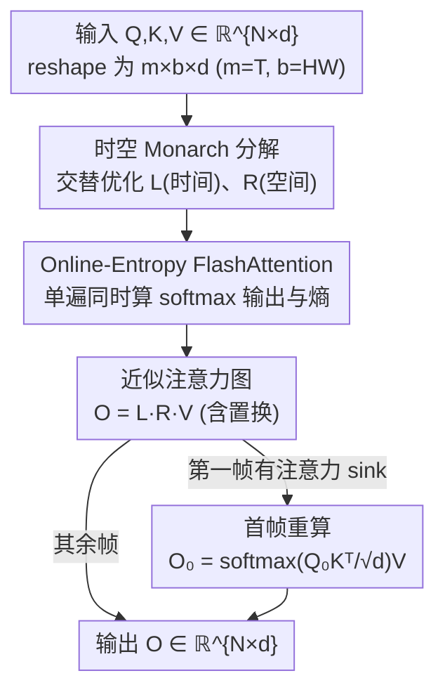

# VMonarch: Efficient Video Diffusion Transformers with Structured Attention

**会议**: CVPR 2026  
**论文**: [CVF Open Access](https://openaccess.thecvf.com/content/CVPR2026/html/Liang_VMonarch_Efficient_Video_Diffusion_Transformers_with_Structured_Attention_CVPR_2026_paper.html)  
**代码**: 待确认  
**领域**: 视频生成 / 扩散模型 / 高效注意力  
**关键词**: 视频扩散Transformer, Monarch矩阵, 结构化稀疏注意力, FlashAttention, 长视频

## 一句话总结
VMonarch 发现视频 DiT 的注意力图天然呈高秩、块对角的稀疏结构，可以用 Monarch 结构化矩阵来逼近，于是把空间-时间维度对齐到 Monarch 因子上做次二次复杂度注意力，再配合首帧重算和融合熵计算的 FlashAttention 内核，在 VBench 上几乎不掉点的前提下把注意力 FLOPs 砍掉 17.5×、长视频加速 5× 以上。

## 研究背景与动机
**领域现状**：视频扩散 Transformer（Video DiT）是当前生成长视频的主流骨架，但它的算力几乎全砸在注意力上——按 Wan-2.1 的统计，当序列长到一百万 token 时，注意力占了总计算量的 95%。注意力对序列长度 $N$ 是 $O(N^2)$ 复杂度，这直接卡死了视频的时长和分辨率上限。

**现有痛点**：业界主要有两条降复杂度的路，但都各有硬伤。**稀疏注意力**（VSA、VMoBA 等）只让每个 query 关注一部分 token，复杂度降到 $O(\tau N^2)$，但固定模式不够灵活、动态模式又因为非结构化导致内存访问不规则、实际加速远不及理论值，且稀疏率一激进就掉质量。**线性注意力**用核方法把复杂度压到 $O(N)$，可它的低秩近似限制了表达力，和标准注意力存在明显性能差距。

**核心矛盾**：视频 DiT 的注意力矩阵其实是**高秩且稀疏**的——因为视频天然有时空局部性，同一帧内、相邻像素之间交互强，形成强块对角结构。这意味着低秩的线性注意力本就不对路，而朴素稀疏注意力又抓不住这种结构、还难硬件友好地稠密计算。

**切入角度**：作者注意到 Monarch 矩阵正好能同时满足"稀疏、高表达、硬件友好"——它被参数化为块对角矩阵与置换的乘积，能表示卷积、Toeplitz、Butterfly 等一大类变换，复杂度可在 $O(N\log N)$ 到 $O(N^{3/2})$ 之间灵活调。前作 MonarchAttention 已经证明用交替最小化把注意力图近似成 Monarch 矩阵是可行的，复杂度可达 $O(N\sqrt{N})$。

**核心 idea**：第一个把视频 DiT 的稀疏注意力图用 Monarch 矩阵来表示，并专门设计**时空块结构**让 Monarch 因子对齐视频的"帧 × 帧内空间"布局，再补上首帧重算和定制 GPU 内核两块工程拼图，把 MonarchAttention 真正用进长视频。

## 方法详解

### 整体框架
VMonarch 的目标是把视频 DiT 里那块 $N\times N$ 的全注意力（$N=THW$，$T$ 帧、每帧 $H\times W$ 空间 token）替换成一个能次二次计算的结构化近似。核心做法是：不直接算 $\mathrm{softmax}(QK^\top)$，而是用两个交替优化出来的小 Monarch 因子 $L$、$R$ 来逼近这张注意力图，最后输出 $O=LRV$。

整条前向分三块协同：(a) **时空 Monarch 分解**——把 $Q,K,V$ 从 $\mathbb{R}^{N\times d}$ reshape 成 $\mathbb{R}^{m\times b\times d}$，令 $m=T$、$b=HW$，让 $L$ 抓帧间（时间）依赖、$R$ 抓帧内（空间）依赖，迭代闭式更新 $t=2$ 步得到近似矩阵；(b) **首帧重算**——视频 DiT 第一帧有"注意力 sink"，会让 Monarch 的温度项 $c_R$ 异常增大、首帧被过度平滑，于是单独用全注意力把第一帧重算回来；(c) **Online-Entropy FlashAttention**——更新 $R$ 时熵项 $c_L$ 是计算瓶颈（$b\gg m$ 时 $b^2$ 项主导），用一个仿 online softmax 的单遍内核把 softmax 输出和熵一起算出来，省掉 HBM↔SRAM 的反复搬运。

### 关键设计

**1. 时空 Monarch 分解：让结构化矩阵对齐视频的帧×空间布局**

朴素套用 MonarchAttention 会把 Monarch 因子尺寸设成 $\sqrt{N}$ 以求最优复杂度，但这个尺寸切法和视频固有的时空结构对不上，反而会破坏块对角先验。VMonarch 的关键一步是把 Monarch 的两个维度参数直接锚到视频语义上：$m=T$（帧数）、$b=H\times W$（每帧空间 token 数）。

Monarch 矩阵定义为 $M=P_{(b,N)}\,L\,P_{(b,N)}^\top R$，其中 $L=\mathrm{diag}(L_0,\dots,L_{b-1})$、$R=\mathrm{diag}(R_0,\dots,R_{m-1})$ 是两个块对角因子，$P$ 是置换。注意力被改写成带熵正则的优化问题 $\mathrm{softmax}(QK^\top)=\arg\max_{A}\langle A,QK^\top\rangle+H(A)$，当 $A$ 限定为 Monarch 矩阵时，目标在固定一个因子后对另一个是凹的，于是能交替求闭式解：

$$R=\mathrm{softmax}_l\Big(\sum_v \alpha_{R,kiv}K_{klv}/c_{R,ki}\Big),\quad L=\mathrm{softmax}_j\Big(\sum_v \alpha_{L,ikv}Q_{ijv}-c_{L,ik}\Big)$$

迭代 $t$ 步后输出 $O=L^{(t)}R^{(t)}V$。在视频设定下，$L\in\mathbb{R}^{m^2\times b}$ 负责跨帧的时间依赖、$R\in\mathbb{R}^{b^2\times m}$ 负责帧内空间依赖，相当于把整张注意力图分解成"专门管空间"和"专门管时间"两部分。复杂度从 $O(N^2d)$ 降到 $O(tN(T+HW)d)$，由于 $T\ll HW$，理论加速约 $\frac{THW}{t(T+HW)}\approx \frac{T}{t}$。这种"块结构=视频结构"的对齐既保住了全局时空先验（这正是它比 VSA/VMoBA 在高稀疏下更稳的原因），又能用块对角矩阵稠密、硬件友好地算。

**2. 首帧重算：堵住注意力 sink 把第一帧搞糊的漏洞**

视频 DiT 有个公认的"注意力 sink"现象：第一帧是整段序列的上下文锚点，会从后续帧吸走过量注意力。这个现象碰上 Monarch 迭代优化就出问题——首帧 token 累积的注意力分数过高，使得温度调节项 $c_R$ 变得异常大，softmax 分布被过度平滑，第一帧的细粒度细节就丢了。

作者的应对很直接：把第一帧单拎出来用全注意力重算

$$O_0=\mathrm{softmax}\Big(\frac{Q_0K^\top}{\sqrt{d}}\Big)V$$

用首帧的 query $Q_0$ 配全部 $K,V$ 恢复保真度。代价只是 $O(bNd)$，约占 VMonarch 总开销的 $\frac{b}{t(m+b)}$，几乎可忽略。消融显示：去掉首帧重算后 PSNR/SSIM 和几乎所有 VBench 指标都明显下滑，单看第一帧的话 PSNR 从 12.43 掉到 10.42、SSIM 从 0.42 掉到更低——说明这个小补丁恰好补在了 Monarch 近似最脆弱的位置。

**3. Online-Entropy FlashAttention：把熵计算融进单遍内核解掉 $b^2$ 瓶颈**

profiling 发现更新 $R$ 矩阵和它的熵项 $c_L$ 是真正的计算瓶颈，复杂度 $O(mb^2d)$。视频里空间维远大于时间维（$b\gg m$），$b^2$ 项直接主导，朴素实现非常低效。

VMonarch 仿照 FlashAttention 的 online softmax，设计了一个 online-entropy 算法：在分块遍历 $K,V$ 时，一边维护运行最大值 $m_i$、归一化项 $\ell_i$，一边**同步**累积熵项 $h_i$，最后一遍就同时吐出注意力输出 $O_i$、log-sum $L_i$ 和熵 $H_i=\log(\ell_i)-h_i/\ell_i$。关键在于熵原本需要单独再扫一遍数据，现在被融进同一遍 SRAM 计算里，HBM↔SRAM 的搬运大幅减少。实测这个内核相比朴素实现带来约 8× 加速，是 VMonarch 能在长序列上跑得动的工程基石。

## 实验关键数据

### 主实验
在 Wan2.1-1.3B / Wan2.1-14B / Wan2.2-5B 三个底座、不同分辨率上对比 FullAttention(FA2)、VSA、VMoBA，VBench 取 AQ/BC/DD/IQ/SC 五项，外加稀疏率、TFLOPs、推理时间。

| 模型 / 分辨率 | 方法 | AQ↑ | SC↑ | TFLOPs↓ | 时间(s)↓ |
|--------|------|------|------|---------|---------|
| Wan2.1-1.3B / 61×448×832 | FullAttn | 66.07% | 94.15% | 159.7 | 63.4 |
| | VSA | 64.46% | 92.99% | 69.5 | 49.9 |
| | VMoBA | 65.58% | 93.00% | 75.8 | 71.7 |
| | **VMonarch** | 65.58% | 93.23% | 75.4 | **47.7** |
| Wan2.1-14B / 93×704×1280 | FullAttn | 67.49% | 95.23% | 7903.8 | 2222.2 |
| | VSA | 66.40% | 94.05% | 2642.7 | 970.9 |
| | **VMonarch** | 65.91% | **95.68%** | 2670.5 | 969.2 |

微调 1500 步后，VMonarch 在 61×448×832 上把 TFLOPs 砍 53%、推理时间降 25%，质量和全注意力相当；时间维外推到 141×448×832 时达到 2.1× 加速、比 VSA 还快 9%。内核级测试中，34k token 时 >2× 加速、62k token 时 >5× 加速，全面超过 90% 稀疏的 VSA/VMoBA。

### 消融实验
训练自由设定下（VM-Tn-Fk：T=迭代数，F=Monarch 因子覆盖的帧数，†=去掉首帧重算）：

| 配置 | PSNR↑ | DD | SC | 说明 |
|------|-------|------|------|------|
| Softmax(全注意力) | - | 69.44 | 91.77 | 参考上界 |
| VM-T1-F1 | 11.18 | 16.67 | 93.17 | 单次迭代，DD 崩塌 |
| VM-T2-F1† | 11.65 | 29.17 | 88.46 | 去首帧重算，PSNR/SC 掉 |
| VM-T2-F1 | **12.59** | 54.17 | 92.43 | 默认配置 |
| VM-T3-F1 | 12.21 | 50.00 | 93.55 | 多迭代收益递减 |
| VM-T1-F2 | 11.21 | 20.83 | 93.09 | b=2HW，时间不一致伪影 |

### 关键发现
- **首帧重算贡献显著**：VM-T2-F1† 相比 VM-T2-F1，PSNR 从 12.59 掉到 11.65、SC 从 92.43 掉到 88.46，单看第一帧 PSNR 从 12.43 掉到 10.42，证明注意力 sink 必须专门处理。
- **迭代数 2 是甜点**：1 次迭代时 Dynamic Degree 直接崩到 16.67；迭代加到 3~7 后验证 loss 略降但 DD 反而下滑、计算变贵，2 次在效果/效率间最优。
- **块结构必须对齐视频**：把 $b$ 设成 $2HW$（跨两帧）训练自由下指标略升，但会每两帧出现突变的时间不一致伪影，且微调也修不掉、验证 loss 更高——印证了"Monarch 块结构要和视频时空结构一致"这个核心假设。
- **高稀疏下更稳**：训练自由设定里其它稀疏方法在 90% 稀疏下大幅掉点（如 VSA 的 AQ 仅 42.86%），VMonarch 因保住全局时空结构仍有 63.65% AQ。

## 亮点与洞察
- **把"视频结构"翻译成"矩阵结构"**：最漂亮的一步是 $m=T,\,b=HW$ 这个对齐——它让抽象的 Monarch 因子直接承载"时间因子 $L$ + 空间因子 $R$"的物理含义，既保留全局时空先验又拿到次二次复杂度，这是它在高稀疏下不崩的根因。
- **小补丁打在刀刃上**：首帧重算只花总开销的零头，却补住了 Monarch 近似最致命的注意力 sink 失效点，是"诊断准 → 修得轻"的范例。
- **熵计算可被 flash 化**：online-entropy 把原本要额外扫一遍的熵融进 FlashAttention 单遍流程，这个 trick 对任何需要在注意力里算熵正则的方法都可迁移。
- **高秩+稀疏的判断**：论文把稀疏注意力和线性注意力归纳成"利用稀疏 vs 利用低秩"两种压缩，并据此论证视频 DiT 该走稀疏路线，这个分析框架本身很有启发。

## 局限与展望
- **仍需微调**：训练自由设定下 Monarch 近似会让 Dynamic Degree 明显下降，必须微调 1500 步左右才能恢复甚至反超全注意力，纯即插即用场景受限。
- **依赖时空可分先验**：方法强假设视频注意力是块对角、时空可分的；对运镜剧烈、强全局长程交互的内容，块结构对齐的红利可能缩水。
- **超参敏感**：需要把 $c_R$ clamp 到 0.1 保数值稳定、固定 2 次迭代，这些经验值在更大模型或更长序列上是否仍最优需进一步验证。
- **比较口径**：不同方法的稀疏率定义不完全可比（VSA top-k 固定 90%、VMoBA top-p 近似 90%、VMonarch 用 $1-t\frac{T+HW}{THW}$ 估算约 87.5%~94.4%），横向 TFLOPs 对照需带 caveat。

## 相关工作与启发
- **vs MonarchAttention**：前作首次用 Monarch 矩阵近似注意力图、给出交替最小化框架，但面向通用 Transformer、未考虑视频时空结构与长序列工程问题。VMonarch 的增量是时空块对齐 + 首帧重算 + online-entropy 内核三件套，把它真正落到视频 DiT。
- **vs VSA / VMoBA（稀疏注意力）**：它们用动态 blockwise 稀疏，在 90% 稀疏下容易掉点或产生不连贯内容；VMonarch 用结构化 Monarch 矩阵稠密计算稀疏图，保住全局时空先验，质量和实际加速都更好。
- **vs SANA-Video（线性注意力）**：线性注意力靠低秩核近似拿 $O(N)$，但表达力受限、需混合架构补偿；VMonarch 走的是"高秩稀疏"路线，论文论证这更契合视频注意力矩阵的本质结构。

## 评分
- 新颖性: ⭐⭐⭐⭐⭐ 首次把 Monarch 结构化矩阵引入视频 DiT，并设计时空对齐分解，视角新颖。
- 实验充分度: ⭐⭐⭐⭐ 覆盖三个底座、多分辨率、时空外推与内核级 benchmark，消融到位；纯训练自由场景偏弱。
- 写作质量: ⭐⭐⭐⭐ 动机—瓶颈—对策三块逻辑清晰，公式与图配合好；部分内核细节放附录略简。
- 价值: ⭐⭐⭐⭐⭐ 注意力占视频 DiT 95% 算力，17.5× FLOPs 降、5× 加速且几乎不掉质量，对长视频生成有直接落地价值。

<!-- RELATED:START -->

## 相关论文

- [\[CVPR 2026\] FrameDiT: Diffusion Transformer with Matrix Attention for Efficient Video Generation](framedit_diffusion_transformer_with_matrix_attention_for_efficient_video_generat.md)
- [\[CVPR 2026\] Efficient Long-Context Modeling in Diffusion Language Models via Block Approximate Sparse Attention](efficient_long-context_modeling_in_diffusion_language_models_via_block_approxima.md)
- [\[CVPR 2026\] Attention Surgery: An Efficient Recipe to Linearize Your Video Diffusion Transformer](attention_surgery_an_efficient_recipe_to_linearize_your_video_diffusion_transfor.md)
- [\[CVPR 2026\] RAPID: Reusing Attention Sparsity with Inter-step Adaptation for Efficient Video Diffusion](rapid_reusing_attention_sparsity_with_inter-step_adaptation_for_efficient_video_.md)
- [\[CVPR 2026\] LinVideo: A Post-Training Framework towards O(n) Attention in Efficient Video Generation](linvideo_a_post-training_framework_towards_on_attention_in_efficient_video_gener.md)

<!-- RELATED:END -->
