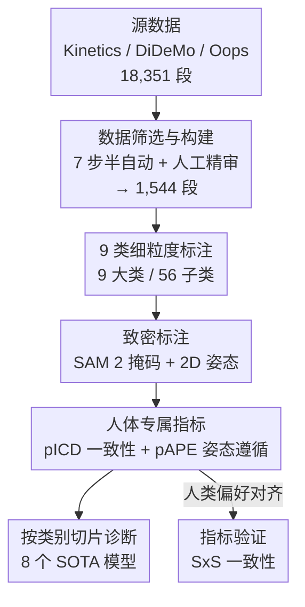

# What Are You Doing? A Closer Look at Controllable Human Video Generation

**会议**: CVPR 2026  
**论文**: [CVF Open Access](https://openaccess.thecvf.com/content/CVPR2026/html/Bugliarello_What_Are_You_Doing_A_Closer_Look_at_Controllable_Human_CVPR_2026_paper.html)  
**代码**: https://github.com/google-deepmind/wyd-benchmark  
**领域**: 视频生成  
**关键词**: 可控人体视频生成, 评测基准, 细粒度标注, 人体一致性, 姿态遵循

## 一句话总结
作者发现现有的可控人体视频生成基准（TikTok、TED-Talks、HumanVid）都太小太窄，于是构建了 1,544 段精细标注的 WYD 基准（9 大类 56 子类），并改造出 pICD / pAPE 两个人体专属指标，系统评测 8 个 SOTA 开源模型，首次量化暴露了它们在多人、人物交互、复杂场景、剧烈运动上的系统性短板。

## 研究背景与动机
**领域现状**：可控人体视频生成（给一张首帧 + 姿态/深度/边缘等驱动信号，让人物按指定动作动起来）近两年进展迅猛，但社区评测几乎只靠 TikTok（16 段）和 TED-Talks（128 段）两个数据集。

**现有痛点**：这两个数据集不仅极小，而且场景极窄——基本就是"单人在静止镜头里原地跳舞 / 站着讲话"。它们既不能反映真实世界里人体动作、交互、镜头运动的丰富性，也无法暴露模型在难样本上的失败。HumanVid 虽然更多样，但验证集只有 71 段，统计意义不足。

**核心矛盾**：模型能力的进步速度，已经超过了现有评测能"看见"的范围。在单人特写这种简单分布上，几个模型分数都很高、彼此难分高下，但谁也不知道它们在多人互动、人和动物交互、运动剧烈的真实视频上到底行不行——这些维度现有基准根本没有样本去测。

**本文目标**：(1) 造一个大且多样、覆盖真实人体活动的可控生成基准；(2) 设计能真正衡量"生成的人是否一致、是否遵循驱动姿态"的指标；(3) 用它把现有模型的能力边界系统性地测出来。

**切入角度**：人脑天生擅长识别生物运动与外观，所以人体生成质量是生成模型的关键能力；既然文字难以精确描述人体动作，作者聚焦于**姿态可控**的 image-to-video 设定（首帧里人物清晰可见），并坚持**细粒度分类**——只有把视频切成不同类别的切片去测，才能定位模型究竟弱在哪一维。

**核心 idea**：与其再刷一个聚合大分，不如造一个"按 9 个维度切片"的多样化基准 + 人体专属指标，让评测从"一个分数"升级为"一张能诊断病灶的体检表"。

## 方法详解
这是一篇**基准（benchmark）与分析型**论文，没有提出新的生成模型，"方法"对应的是**研究设计**：如何从海量公开视频里筛出高质量、强多样的人体视频，如何用 9 类标注组织它们，如何改造出对得上人类偏好的人体专属指标，以及如何用这套协议去诊断现有模型。

### 整体框架
整条管线可以理解为"采集 → 筛选 → 细粒度标注 → 致密标注 → 指标 → 诊断"：从 Kinetics / DiDeMo / Oops 三个公开授权数据集出发，经过 7 步半自动筛选（从 18,351 段砍到 1,544 段），对每段视频手工打上 9 大类标签，再用 SAM 2 + 人工修正得到逐人物分割掩码、并为 100 段视频标注 2D 姿态关键点；在此之上定义视频级（FVD、OFE）与人体级（pICD、pAPE）四个指标；最后把评测协议套到 8 个 SOTA 开源模型上，按 9 个维度切片做诊断，并用人类偏好反过来验证指标可信。整个标注过程耗费 2500+ rater 小时，评测耗费 6,000+ A100 GPU 小时。

### 关键设计

**1. 数据筛选与构建：从 18,351 段半自动砍到 1,544 段高质量视频**

痛点是现有基准要么太小（16/128 段），要么是为别的任务采集、并非针对"可控人体生成"设计。作者从 Kinetics、DiDeMo、Oops（包含 YouTube/Flickr 的真实视频，涵盖不同体态、衣着、年龄、背景，甚至含"意外动作"这类反常运动的好测例）出发，跑一条 7 步半自动管线：(1) 过滤主角非人类的视频；(2) 用 shot detector 去掉镜头切换；(3) 用姿态估计器确认人物在首帧及大部分帧可见；(4) 限制时长在 1.5–15 秒；(5) 用细粒度 VLM 过滤视频-描述相似度低的样本；(6) 去掉低分辨率；(7) 人工精审去掉明显模糊、光照差、镜头抖、运动太少、首帧没拍到主角的片段。光是筛选 + 分类就反复迭代了 500+ 小时。之所以要这么狠地筛，是因为基准的价值取决于"难且真实"——最终保留的 1,544 段（1,393 个独立片段）既要够多样以支撑按类切片分析，又要在可控的评测耗时内跑得动。它在规模和多样性上比现有基准高一个数量级（见下表）。

**2. 九类细粒度标注：让评测从"一个聚合分"变成"按维度诊断"**

这是 WYD 区别于旧基准的核心。单一聚合分掩盖了模型在不同情形下的强弱，作者因此为每段视频手工标注 9 大类、56 子类，每个子类至少 →100 个样本以保证统计意义。标注维度包括：人物数量、人物平均占画面面积、动作类型、肢体运动方式、与环境的交互方式、所处场景、镜头是否跟随；此外用光流模型估计视频运动量、用姿态检测器估计遮挡程度。这些类别不只是"展示多样性"，更是**诊断工具**——把同一套指标分别套到"多人 vs 单人""人和动物交互 vs 普通动作""居家 vs 户外""静止镜头 vs 剧烈运动"等切片上，就能精确定位模型在哪一维掉链子（第 5 节的全部发现都依赖这套切片）。作者还验证了各类别之间重叠很小（仅"动作-动物交互""视频运动-镜头运动"两对相关），说明这 9 维确实在测不同的能力。

**3. 人体专属指标 pICD + pAPE：把通用指标改造成"只盯人物"的细粒度度量**

痛点是 FID/FVD/SSIM/LPIPS 这类像素级指标度量整帧分布，无法回答"生成的人是否和参考人物一致、是否真的按驱动姿态在动"——而人物恰恰是可控人体生成的核心。作者借助第 1/3 步采集的分割掩码，把两个通用指标改造为只作用于人物区域：

- **pICD（person image cosine distance，人物一致性）**：对每一帧，取属于人物的图像块，计算其 DINOv2 特征的平均余弦相似度，再取余弦距离作为误差，即 $\text{pICD} = 1 - \text{avg}(\text{patch\_cos\_sim})$。它在 Ren 等人用 DINO 测主体一致性的基础上，用掩码把"人"从背景里抠出来单独评，从而支持多人、复杂场景。
- **pAPE（person AP error，姿态遵循误差）**：先用 DWPose 在生成视频里检测姿态，再用分割掩码把检测到的姿态映射回参考视频里的**显著人物**（避免背景路人干扰），对参考姿态做匈牙利匹配后逐视频算 AP，最后取平均 AP 的补作为误差，即 $\text{pAPE} = 1 - \text{mAP}$。

这两个指标的关键在于"用掩码把人物从整帧里隔离出来再评"，因此天然支持多人视频——这正是旧的全帧指标做不到的。

**4. 评估协议验证：用人类偏好证明指标可信**

很多自动指标被前人证明与人类判断相关性很弱，所以作者没有默认自己选的指标就对，而是用两种方式与人类判断对齐：(1) side-by-side（SxS）模型两两对比，用 4 个模板分别评视频质量、视频运动、人物质量、人物运动；(2) 人工核对指标给出的模型排序是否合理。结果（Tab. 2）显示所选指标确实更贴近人类偏好：pICD 在人物一致性上达 72.67%、优于 ICD（67.33%）/RMSE/SSIM；pAPE 在人物运动上达 71.95%、优于 pOFE（61.45%）。验证过程还顺带发现 MimicMotion 和 ControlNeXt 总会对生成人物做缩放和居中——这源自它们的预处理代码，反映出对"单人大居中"简单数据的过度依赖，进一步佐证了更多样基准的必要。

## 实验关键数据

### 基准规模对比

| 数据集 | 视频数(独立片段) | 时长[s] | 画幅 | 人数 | 细粒度类别 | 额外标注 |
|--------|------------------|---------|------|------|-----------|----------|
| TikTok | 16 (14) | 8.3–23.0 | 竖屏 | 1 | 无 | dense poses |
| TED-Talks | 128 (40) | 4.3–23.1 | 横屏 | 1 | 无 | 无 |
| HumanVid | 71 (71) | 2.7–87.2 | 横/竖 | 1, 2 | 无 | 无 |
| **WYD** | **1,544 (1,393)** | 1.5–15.0 | 横/竖 | 1, 2, 3–8 | **9 类/56 子类** | 分割掩码 + 2D 姿态 |

### 指标与人类偏好一致性（SxS，Tab. 2，越高越对齐）

| 评测维度 | 本文选用指标 | 一致性[%] | 对比指标 | 一致性[%] |
|----------|--------------|-----------|----------|-----------|
| 视频质量 | FVD | 96.36 | FID | 22.24 |
| 视频运动 | OFE | 82.10 | DPT | 67.37 |
| 人物一致性 | **pICD** | **72.67** | ICD / RMSE / SSIM | 67.33 / 38.55 / 62.65 |
| 人物运动 | **pAPE** | **71.95** | pOFE | 61.45 |

### 关键发现
- **WYD 显著更难**：在 image+pose 条件下，WYD 的人体指标误差全面高于 TikTok/TED-Talks——pICD 高 1.8–4.6 倍、pAPE 高 1.8–12.3 倍；且瓶颈来自生成本身的难度（模型自编码器能更好地重建这些视频）。
- **没有模型全能**：姿态条件模型里 VACE 总体最好（人体指标 pICD/pAPE 与 MagicPose 持平、视频指标 FVD/OFE 与 MimicMotion/ControlNeXt 有竞争力），MagicPose 则因闪烁伪影导致 FVD 偏高。人体生成是多面的，没有模型在所有指标上称王。
- **多模态互补**：给唯一的多任务模型 VACE 同时加姿态 + 文本都能涨——姿态主要改善运动遵循，LLM 生成的细描述主要改善人物一致性。
- **按维度的系统性短板**：人数从 1 增到 2、3+ 时 FVD 与 pAPE 都恶化（模型会把多人外观"糊"在一起）；MimicMotion 在"人和动物交互"上常直接丢掉动物，生成超现实画面；所有模型在"居家"场景表现最好，健身房/沙地/雪地等场景差距大；镜头非静止、光流幅度大、全身运动或剧烈动作（滑板、跑步、骑车）都会让生成变差；人物占画面越大姿态越好控（pAPE 低）但视频质量越差（FVD 高）。
- **结论稳健**：把 MagicPose 的 OpenPose 换成更准的 DWPose 后它仍落后；全部模型统一用 OpenPose 时排序不变；手工标注 100 段（184 个人物）的 2D 姿态后模型相对表现不变——说明发现不依赖姿态检测器的误差。

## 亮点与洞察
- **把"评测"重新定义为"诊断"**：9 类细粒度切片让基准不再只给一个聚合分，而能精确回答"模型弱在多人 / 动物交互 / 户外 / 剧烈运动哪一维"，这套思路可直接迁移到任何生成任务的评测设计上。
- **用掩码把通用指标"人体化"**是低成本高回报的 trick：不重新训练任何度量网络，只用 SAM 2 掩码把人物抠出来，就把 DINO 一致性和姿态 AP 变成支持多人、抗背景干扰的人体专属指标，且经人类偏好验证确实更准。
- **基准本身成了"显微镜"**：pAPE 反向暴露了 MimicMotion/ControlNeXt 预处理里"强制缩放居中人物"这种隐藏行为——这说明一个足够难、足够多样的基准能照出模型在简单数据上养成的坏习惯。
- **诚实的负面结果取向**：论文不追求"我们的模型最好"，而是系统性地把 8 个现有模型的失败摆出来，对社区推动作用更实。

## 局限与展望
- **只评开源模型**：为可复现，作者只测开源模型；闭源模型（且当前没有闭源模型支持直接的姿态/深度/边缘条件）未纳入，结论对工业级最强系统的覆盖有限。
- **分布偏移的双刃**：被测模型大多在"单人特写"内部数据上训练，在 WYD 上的低分部分源自分布偏移而非纯粹能力差；作者认为可控人体生成本就应超越简单情形，但横向比较时需记住这一 caveat。
- **致密姿态标注规模有限**：2D 姿态关键点只人工标了 100 段（184 个人物）用于验证，分割掩码虽覆盖全集但 SAM 2 + 人工修正仍可能有残差。
- **聚焦姿态可控的 I2V**：基准主要面向首帧 + 姿态/深度/边缘的可控生成，text-to-video、纯 image-to-video、dense-pose 等只在附录评测，主结论的适用边界即在此。

## 相关工作与启发
- **vs TikTok / TED-Talks**：它们各 16 / 128 段、单人静止特写、无细粒度类别；WYD 大一个数量级、覆盖 1–8 人和真实交互/场景/镜头运动，并自带分割掩码与姿态标注，能测它们根本无法触及的难样本。
- **vs HumanVid**：HumanVid 朝多样性迈了一步但验证集仅 71 段、统计意义弱；WYD 用 9 类 ×56 子类（每子类 →100 样本）支撑切片诊断。
- **vs VBench / EvalCrafter / Movie Gen Bench / T2V-CompBench**：这些是 text-to-video 的 prompt 集，缺少参考视频，无法提取控制信号、也无法做可控生成的对照评测；WYD 专门面向"有参考视频驱动信号"的可控人体生成。
- **vs 像素级指标（FID/FVD/SSIM/LPIPS）**：前人多用整帧像素指标；本文论证可控人体生成需要"只盯人物"的细粒度度量，并用掩码把 ICD/AP 改造成 pICD/pAPE，经人类偏好验证更对齐。

## 评分
- 新颖性: ⭐⭐⭐⭐ 不是新模型，但"细粒度切片诊断 + 掩码化人体指标"对可控人体生成评测是实打实的新基建。
- 实验充分度: ⭐⭐⭐⭐⭐ 8 个模型 × 9 维切片 + 指标人类偏好验证 + 姿态检测器/人工标注鲁棒性检查，6,000 A100 小时投入扎实。
- 写作质量: ⭐⭐⭐⭐ 动机清晰、用"按失败定位发现"的叙述组织结果，但关键数据多藏在图里、正文部分论证依赖附录。
- 价值: ⭐⭐⭐⭐⭐ 开源数据 + 代码，补上了可控人体生成长期缺失的高质量难基准，能直接驱动后续模型改进。

<!-- RELATED:START -->

## 相关论文

- [\[CVPR 2026\] SemVideo: Reconstructs What You Watch from Brain Activity via Hierarchical Semantic Guidance](semvideo_reconstructs_what_you_watch_from_brain_activity_via_hierarchical_semant.md)
- [\[AAAI 2026\] MotionCharacter: Fine-Grained Motion Controllable Human Video Generation](../../AAAI2026/video_generation/motioncharacter_fine-grained_motion_controllable_human_video_generation.md)
- [\[CVPR 2026\] YOSE: You Only Select Essential Tokens for Efficient DiT-based Video Object Removal](yose_you_only_select_essential_tokens_for_efficient_dit-based_video_object_remov.md)
- [\[CVPR 2026\] MultiShotMaster: A Controllable Multi-Shot Video Generation Framework](multishotmaster_a_controllable_multi-shot_video_generation_framework.md)
- [\[CVPR 2026\] LAMP: Language-Assisted Motion Planning for Controllable Video Generation](lamp_language-assisted_motion_planning_for_controllable_video_generation.md)

<!-- RELATED:END -->
