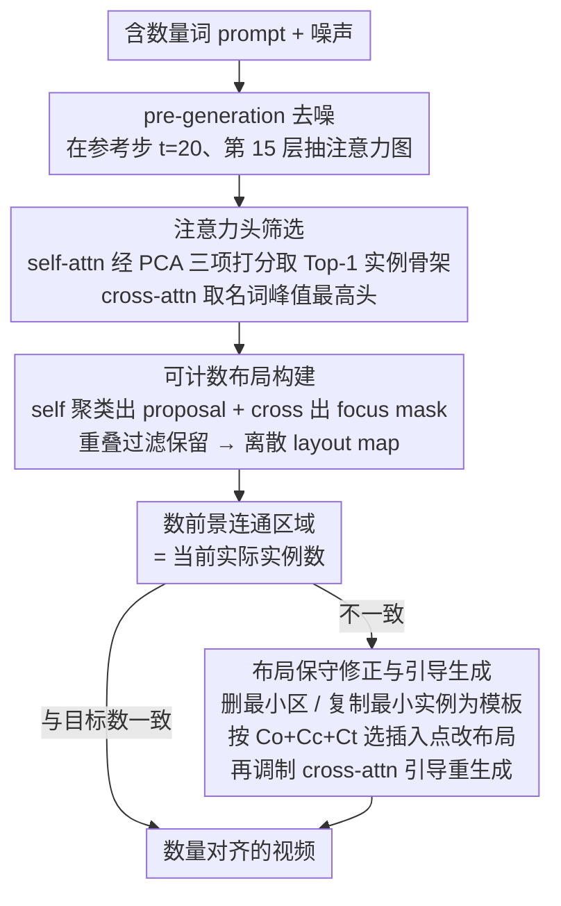

# When Numbers Speak: Aligning Textual Numerals and Visual Instances in Text-to-Video Diffusion Models

**会议**: CVPR 2026  
**arXiv**: [2604.08546](https://arxiv.org/abs/2604.08546)  
**代码**: [https://github.com/H-EmbodVis/NUMINA](https://github.com/H-EmbodVis/NUMINA)  
**领域**: 视频生成  
**关键词**: 数量对齐、文本到视频、训练免费、注意力头选择、布局引导生成

## 一句话总结

NUMINA 的核心思想是，不去重训视频扩散模型，而是在推理时先从 DiT 的注意力中提取一个“可计数的实例布局”，判断数量词和当前布局是否不一致，再对布局做保守的增删修改，并用该布局回头引导重生成，从而显著提升文本到视频模型对“两个苹果、八只鸭子”这类数量约束的遵从能力。

## 研究背景与动机

当前文本到视频模型在画质、时序和动作上已经很强，但数量控制仍然是软肋。模型往往能理解“红色”“奔跑”“海边”这类属性，却无法稳定生成和 prompt 中一致的对象个数。数量错一两个，在娱乐型场景里还能容忍，但在教学视频、仿真演示、需要严格步骤数量的内容里会直接影响可用性。

为什么数量词这么难？作者给出了两个很具体的根因。第一是**numeral semantic weakness**。数量词在 cross-attention 中的激活比名词、形容词和动词更分散、更不聚焦，说明模型并没有把“three”这类 token 真正 grounding 到空间布局上。第二是**instance ambiguity**。DiT 运行在强下采样的时空 latent 上，多个实例之间在 latent 空间里很容易粘连，导致模型难以分清“这是两个物体还是一个大块区域”。

重训模型当然可能改善这个问题，但代价太高，而且需要构造带精确数量标注的视频数据集。作者因此选择一条更现实的路：不试图从根上重塑模型，而是利用现有模型在注意力里已经暴露出来的潜在实例结构，在推理阶段做轻量干预。

这也决定了本文的方法必须满足两个条件：

- 一方面，它要足够强，能把隐式注意力变成显式布局，并据此纠正数量错误。
- 另一方面，它要足够保守，不能为了加一个物体而破坏视频整体布局、风格或时序一致性。

NUMINA 的 identify-then-guide 范式正是围绕这两个目标设计的。

## 方法详解

### 整体框架

NUMINA 想解决的是：在不重训视频扩散模型的前提下，让生成结果忠实遵从 prompt 里的数量词。它把这件事拆成 identify 和 guide 两个阶段，串成一条 pre-generation → 校正 → 重生成的流水线。第一阶段先正常跑一次去噪，在早期步里从 DiT 的注意力中抽取出当前视频隐含的“可计数实例布局”，并据此数出模型现在实际画了几个对象；第二阶段把这个数字和 prompt 里的目标数字一比，如果对不上，就在布局层面做最小幅度的增删，再用修正后的布局回头调制 cross-attention，引导模型重新生成。

整条流程的关键，是干预既不发生在最终像素上，也不靠外部检测器逐帧编辑，而是落在中早期 latent 阶段——此时生成仍可塑、但实例雏形已能从注意力里看出来，改动既来得及生效、又不至于推倒整段视频。

### 关键设计

**1. 注意力头筛选：把“能数清实例”的极少数头挑出来**

朴素做法是把所有注意力头平均起来当布局，但作者的分析表明，真正能分离实例的信息只稀疏地存在于极少数头里，一平均就被噪声冲淡了。于是 NUMINA 对 self-attention 和 cross-attention 分别挑头：对 self-attention，把每个头的注意力图做 PCA 投影，再从前景背景分离度、结构丰富度、边缘清晰度三个角度打分汇成 $S(SA^h)$，取 Top-1 头作为实例骨架；对每个目标名词 token，则选 cross-attention 峰值最大的那个头，因为峰值越高往往意味着该名词被聚焦到越集中的区域。后面消融也印证了这一点——Top-1 反而比 Top-2/Top-3 略强，多挑几个头只会把稀疏信号又掺进噪声。

**2. 可计数布局构建：让 self-attention 分实例、cross-attention 指名词**

挑出头之后，要把仍然模糊的注意力分布变成“若干个可以一个个数的实例区域”。NUMINA 先对选中的 self-attention 图做区域聚类，得到一批空间 proposal（负责把粘连的实例切开）；再对 cross-attention 图做阈值过滤加密度聚类得到 focus mask（负责标出哪些区域对应当前名词）；只有与 focus mask 充分重叠的 proposal 才被保留为该类实例。两者结合后得到一张离散的 layout map，其中前景连通区域的个数，就是模型当前隐式布局下实际画出的实例计数。这种分工让布局既能把实例分开、又能指向 prompt 语义，单靠任一种注意力都做不到。

**3. 布局保守修正与引导生成：只在实例级局部动手，不打碎全局**

很多控制方法的通病是改得太猛，加一个物体就把整段视频的构图、风格、时序全带歪。NUMINA 刻意把修改限制在实例级：要删时优先删掉面积最小的区域，把视觉扰动压到最低；要加时优先复制当前已有实例中最小的那个当模板，一个都没有才退化成圆形模板。新模板插到哪里，由一个三项代价函数决定——与现有布局的重叠惩罚 $C_o$、与现有实例中心的距离 $C_c$、与前一帧插入位置的时间平滑项 $C_t$：

$$C = C_o + C_c + C_t$$

得到修正布局后，重生成时再对 cross-attention 的 pre-softmax score（或 bias）做局部增减：新增区域被抬高、更容易长出目标对象，删除区域被显式压制。$C_t$ 这一项专门服务于视频——它让同一个新增对象在相邻帧落在接近的位置，从而保证数量对了之后，跨帧位置也不会乱跳。

### 一个完整示例

以 prompt “eight ducks swimming”为例走一遍：先正常跑一次 pre-generation，在参考时刻 $t^*=20$、中间层 $l^*=15$ 抽出注意力，挑出 Top-1 的 self-attention 头和 “duck” 对应峰值最高的 cross-attention 头；聚类后得到的 layout map 只数出 5 个前景连通区域，说明模型实际只画了 5 只鸭子。校正阶段发现差 3 只，于是复制当前最小的那只鸭子作为模板，按 $C_o+C_c+C_t$ 三项代价依次找到 3 个既不和已有鸭子重叠、又贴近群体中心、还和相邻帧位置平滑衔接的插入点，把布局从 5 改到 8。最后在重生成中，对这 3 个新增区域的 cross-attention 做局部增强，引导模型在那里真正长出鸭子——最终输出 8 只、且时序稳定的视频。

### 损失函数 / 训练策略

本文是训练免费方法，没有新增训练损失。作者只需要在推理中设置参考 timestep `t*=20` 和中间层 `l*=15` 提取注意力，随后在 50 步采样中进行局部引导。

这点很实用，因为它意味着方法可以直接插在现有 Wan 系列视频生成模型上使用，不依赖任何额外标注数据，也不需要额外蒸馏网络或 layout predictor。

## 实验关键数据

### 主实验

作者构建了 CountBench，共 210 条 prompt，覆盖 1 到 8 个实例、1 到 3 个对象类别，专门评估计数精度。实验比较三种现实中的训练免费策略：原始模型、seed search、prompt enhancement，以及本文的 NUMINA。

| 模型 | 设置 | CountAcc (%) | TC (%) | CLIP Score |
|---|---|---:|---:|---:|
| Wan2.1-1.3B | baseline | 42.3 | 81.2 | 33.9 |
| Wan2.1-1.3B | + seed search | 45.5 | 82.3 | 34.6 |
| Wan2.1-1.3B | + prompt enhancement | 47.2 | 82.1 | 33.7 |
| Wan2.1-1.3B | **+ NUMINA** | **49.7** | **83.4** | **35.6** |
| Wan2.2-5B | baseline | 47.8 | 85.0 | 34.3 |
| Wan2.2-5B | **+ NUMINA** | **52.7** | **85.0** | **34.7** |
| Wan2.1-14B | baseline | 53.6 | 83.3 | 34.2 |
| Wan2.1-14B | **+ NUMINA** | **59.1** | **84.0** | **34.4** |

这张表里最强的结论是：NUMINA 让 1.3B 模型的 CountAcc 达到 49.7%，甚至超过了原始 5B 模型的 47.8%。也就是说，它改善的不是边角误差，而是模型数量控制能力的主矛盾。

### 消融实验

作者对布局来源、布局修正代价和注意力头选择都做了比较充分的分析。

| 消融项 | 配置 | CountAcc (%) | TC (%) |
|---|---|---:|---:|
| 布局来源 | baseline | 42.3 | 81.2 |
| 布局来源 | GroundingDINO layout | 47.5 | 82.8 |
| 布局来源 | **Attention layout (ours)** | **49.7** | **83.4** |
| 插入代价 | 仅 `C_o` | 45.1 | 82.1 |
| 插入代价 | `C_o + C_c` | 46.9 | 82.3 |
| 插入代价 | `C_o + C_t` | 48.9 | 83.1 |
| 插入代价 | **`C_o + C_c + C_t`** | **49.7** | **83.4** |
| 头选择 | random single head | 44.1 | 82.6 |
| 头选择 | all-average | 43.0 | 82.4 |
| 头选择 | Top-3 | 48.2 | 82.5 |
| 头选择 | Top-2 | 49.4 | 83.3 |
| 头选择 | **Top-1** | **49.7** | **83.4** |

### 关键发现

- 用 attention 自己构造的布局比 GroundingDINO 检测结果还更好，说明对于生成中的“尚未完全成形实例”，模型内部注意力比外部检测器更贴近真实 latent 结构。
- 时间代价 `C_t` 的收益比中心代价 `C_c` 更大，说明视频任务里数量正确之外，跨帧稳定位置同样关键。
- Top-1 比 Top-2/Top-3 还略强，说明实例可分离信息确实是稀疏的，盲目平均会引入噪声。
- 参考时刻 `t*=20` 是一个很好的精度-效率折中点。继续往后虽然局部可见性更强，但注意力开始碎裂或过融合，反而伤害计数。
- 对高计数 prompt，NUMINA 的优势更明显。论文特别指出，当需要 8 个对象时，baseline 只有 11.3% 准确率，而 NUMINA 能把它提升到 20.7%。

## 亮点与洞察

- 这篇论文的亮点是找到了一个非常合适的干预层次。它没有直接用硬 mask 在像素域编辑视频，也没有暴力重写 prompt，而是在布局层动手，这个抽象层正好足够强、又足够稳。
- 作者用自注意力做实例骨架、用交叉注意力做语义对齐，这种职责拆分很清楚。很多注意力控制方法把二者混着用，NUMINA 则把“分实例”和“指名词”两个问题分开处理。
- 方法完全训练免费，却不只是一个 heuristic 拼凑。三个模块之间是闭环的：头选择决定布局质量，布局质量决定修正是否可信，修正布局再反馈到生成控制。
- CountBench 也很有价值。过去视频生成 benchmark 往往只关注画质或时序，这篇论文把“数量词是否被忠实执行”单独拿出来衡量，是很必要的补充。

## 局限与展望

- 当前方法主要覆盖 1 到 8 个对象的场景，更高密度的群体对象还没有被验证。几十个甚至上百个实例时，区域分离和插入代价函数可能都要重做。
- NUMINA 假定 prompt 中的数字与目标名词能明确配对。对于更复杂的多从句、多数量词 prompt，名词-数字绑定可能会成为瓶颈。
- 该方法仍然需要一次 pre-generation，因此会增加推理时间。虽然可与 EasyCache 结合，但与原始生成相比仍有额外开销。
- 作者目前的布局修正是启发式的，特别是新增实例时模板复制与网格搜索位置。未来可考虑把这一步变成更连续的、可优化的布局编辑。
- 一个很自然的后续方向是把 NUMINA 扩展到图像、视频共同统一的 numeracy control 框架，甚至进一步控制“数量 + 空间关系 + 动作分工”这类更强结构约束。

## 相关工作与启发

- **vs seed search**：seed search 本质上是重复抽卡，成本高且不可控；NUMINA 则直接指出哪错了、怎么改，因而更稳定。
- **vs prompt enhancement**：增强 prompt 可以略微提醒模型关注数量，但无法真正解决 latent 空间中实例分不开的问题；NUMINA 正是补上这一步。
- **vs CountGen 等图像计数控制方法**：CountGen 主要针对 T2I，且需要额外学习布局补全网络；NUMINA 则完全训练免费，并专门考虑了视频时序稳定性。
- 对研究上的启发是，很多生成错误并不一定要通过重训模型修复。只要能找到模型内部已经出现、但尚未被显式利用的中间结构，就可能用更轻量的方式获得很可观的收益。

## 评分

- 新颖性: ⭐⭐⭐⭐ 训练免费数量对齐不是全新问题，但将注意力布局提取、保守布局修正和视频引导生成整合得非常完整。
- 实验充分度: ⭐⭐⭐⭐⭐ 多尺度 Wan 模型、主流训练免费基线、细致消融和新 benchmark 都做得很扎实。
- 写作质量: ⭐⭐⭐⭐ 方法描述清晰，实验结论和设计动机对应关系强。
- 价值: ⭐⭐⭐⭐⭐ 对实用型视频生成非常有价值，尤其适合不想重训大模型但又需要数量可靠性的场景。

<!-- RELATED:START -->

## 相关论文

- [\[CVPR 2026\] TempoControl: Temporal Attention Guidance for Text-to-Video Models](tempocontrol_temporal_attention_guidance_for_text-to-video_models.md)
- [\[ICCV 2025\] VPO: Aligning Text-to-Video Generation Models with Prompt Optimization](../../ICCV2025/video_generation/vpo_aligning_text-to-video_generation_models_with_prompt_optimization.md)
- [\[CVPR 2026\] When to Lock Attention: Training-Free KV Control in Video Diffusion](when_to_lock_attention_training-free_kv_control_in_video_diffusion.md)
- [\[CVPR 2026\] P-Flow: Prompting Visual Effects Generation](p-flow_prompting_visual_effects_generation.md)
- [\[CVPR 2026\] TEAR: Temporal-aware Automated Red-teaming for Text-to-Video Models](tear_temporal-aware_automated_red-teaming_for_text-to-video_models.md)

<!-- RELATED:END -->
