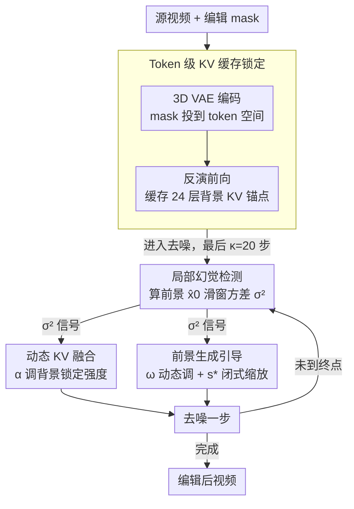

# When to Lock Attention: Training-Free KV Control in Video Diffusion

## 基本信息

- **会议**: CVPR2026
- **arXiv**: [2603.09657](https://arxiv.org/abs/2603.09657)
- **代码**: 未开源
- **领域**: 图像生成 / 视频编辑
- **关键词**: Training-Free Video Editing, KV Cache, Classifier-Free Guidance, Diffusion Hallucination Detection, DiT

## 一句话总结

提出 KV-Lock，基于扩散模型幻觉检测动态调度背景 KV 缓存融合比例和 CFG 引导强度，在无需训练的前提下同时保证视频编辑的背景一致性和前景生成质量。

## 研究背景与动机

视频编辑的核心挑战在于：编辑前景目标的同时保持背景场景的高保真。现有方法存在两个极端：

**全图信息注入**（如 cross-attention 操纵、latent 空间插值）：编辑效果容易泄漏到背景区域，导致背景伪影，尤其在颜色、姿态等属性上产生局部幻觉。

**刚性背景锁定**（固定 KV 缓存权重）：过度约束模型的表达能力，导致前景生成质量下降。

近期工作（ProEdit、Follow-Your-Shape）虽然利用了 DiT 架构中的 KV 缓存来保持背景，但采用固定的融合权重或简单启发式调度，无法自适应地平衡前景质量与背景一致性。这引出了一个核心问题：**何时应该将注意力锁定到缓存的 KV 上，何时应该允许模型重新计算注意力模式？**

KV-Lock 的核心洞察：扩散模型的幻觉检测指标（$\hat{x}_0$ 轨迹方差）与 CFG 引导尺度的多样性调节功能天然对应——可以用方差作为统一的调度信号，将启发式调参转为基于方差的原理性决策。

## 方法详解

### 整体框架

KV-Lock 是一个即插即用的 training-free 框架，适用于任意预训练 DiT 模型。整体流程分为三个阶段：

1. **编码阶段**：3D VAE 将源视频编码为 latent 表示，同时将编辑 mask 映射到 token 空间
2. **反演阶段（Inversion）**：对源视频进行前向扩散，在每个时间步和每层 Transformer 中缓存源视频的 KV 对
3. **去噪阶段（Denoising）**：基于幻觉检测的调度器动态融合新生成的 KV 与缓存的 KV（保背景），同时动态调节 CFG 引导强度（优前景）

整个去噪阶段是一个反馈回环：每一步先由幻觉检测算出方差信号，再用这个信号同时驱动「背景锁多紧」和「前景顶多狠」两个旋钮。

### 关键设计

**1. Token 级 KV 缓存锁定：把"哪些 token 算背景"精确传到注意力层**

要保住背景，先得知道哪些 token 属于背景。KV-Lock 从一张编辑 mask 出发，把它一路对齐到 DiT 内部的 token 粒度。源视频 $\mathcal{V}_{\text{src}} \in \mathbb{R}^{3 \times F \times H \times W}$ 先经 3D VAE 编码（压缩比 $s = (4, 8, 8)$），编辑 mask $\mathcal{M}$ 在时间维做 max-pooling 与 VAE 的时间压缩对齐：

$$m_0^{\text{latent},t} = \begin{cases} \max(\mathcal{M}_0), & t=0 \\ \max(\mathcal{M}_{[1+(t-1)s_t : 1+ts_t]}), & t \geq 1 \end{cases}$$

用 max 而非平均，是为了让一个时间窗口里只要有一帧需要编辑，对应 latent 位置就被标成前景，宁可多标也不漏标。接着 DiT 把 latent 做 patchify（patch size $p = (1, 2, 2)$）得到 $N = T \cdot (h/p_h) \cdot (w/p_w)$ 个 token，mask 再经一次 3D MaxPool 投到 token 空间：

$$m_{\text{token}} = \text{Flatten}(\text{MaxPool3D}(m_0^{\text{latent}}, \text{kernel}=p, \text{stride}=p)) \in \{0,1\}^N$$

于是一个 token 只要感受野里压到任何被编辑的像素，就被算作前景。有了这张 token mask，再去缓存背景的"内容锚点"：每个去噪步 $t_k$ 用源 latent 构造带噪输入 $z_{t_k}^{\text{src}} = \sqrt{\bar{\alpha}_{t_k}} \mathcal{E}(\mathcal{V}_{\text{src}}) + \sqrt{1 - \bar{\alpha}_{t_k}} \epsilon$，前向一遍把全部 $L=24$ 层的 KV 对 $\mathcal{K}_k^\ell = W_K^{(\ell)} h_{t_k}^{(\ell)}$、$\mathcal{V}_k^\ell = W_V^{(\ell)} h_{t_k}^{(\ell)}$ 存下来。注意力本质是一次可微检索——query 与所有 key 算相似度再加权聚合 value；当背景 token 的 KV 被换成源视频缓存，注意力输出就被钉在源内容的流形上，等于给背景一条确定性的重建路径。

**2. 局部幻觉检测：为后续调度提供统一的方差信号**

去噪阶段要回答的核心问题是「何时该锁紧背景、何时该松手让模型重算」，KV-Lock 把它统一交给一个信号——前景区域 $\hat{x}_0$ 的波动方差，后面的动态 KV 融合与前景引导都据此决策。KV-Lock 用滑动窗口只盯前景区域的 $\hat{x}_0$ 波动作为幻觉代理：先把每步预测的 $\hat{x}_0$ 在 mask 区域内拍平、按 batch 平均，

$$\hat{x}_0^{\text{masked},(k)} = \frac{1}{B} \sum_{b=1}^{B} \text{Flatten}(\hat{x}_0^{(k,b)} \odot m_0^{\text{latent}})$$

再在窗口内算方差：

$$\sigma_{\hat{x}_0^{(k)}}^2 = \frac{1}{W-1} \sum_{i=t_k-W+1}^{t_k} (\hat{x}_0^{\text{masked},(i)} - \bar{\hat{x}}_0^{\text{masked}})^2$$

超过 $\tau = 0.01$ 就判为幻觉风险。背后的依据是：in-support 的样本在后期去噪会收敛到一致表示（方差低），而 hallucinated 样本因为在多个模式间插值，$\hat{x}_0$ 一直抖（方差高）。关键在于只算 mask 区域而非全图——全局方差会被大片稳定的背景稀释、漏掉局部幻觉信号，消融里全局检测 Ave. 84.05% 对局部检测 84.87% 就是这个差距。

**3. 幻觉感知的动态 KV 融合：用方差决定"锁多紧"，而不是一刀切**

把背景 KV 完全锁死虽然保真，却也压住了模型在前景上的发挥。KV-Lock 改成可调的融合率 $\alpha_k \in [0,1]$，让锁定强度跟着去噪方差走：

$$\alpha_k = \text{clamp}\left(\frac{\sigma_{\hat{x}_0^{(k)}}^2}{\tau}, 0, 1\right)$$

阈值 $\tau = 0.01$，且只在最后 $\kappa = 20$ 个采样步对背景 token 做加权插值：

$$K_k^{\text{mix}} = m_{\text{token}} \odot K_k^{\text{new}} + (1 - m_{\text{token}}) \odot (\alpha_k \cdot \tilde{\mathcal{K}}_k^\ell + (1 - \alpha_k) \cdot K_k^{\text{new}})$$

$$V_k^{\text{mix}} = m_{\text{token}} \odot V_k^{\text{new}} + (1 - m_{\text{token}}) \odot (\alpha_k \cdot \tilde{\mathcal{V}}_k^\ell + (1 - \alpha_k) \cdot V_k^{\text{new}})$$

前景 token（$m_{\text{token}} = 1$）一律走新算出来的 KV，保留完全自由度；背景 token（$m_{\text{token}} = 0$）则在缓存 KV 与新 KV 之间插值，$\alpha_k$ 越大越偏向缓存、锁得越紧。之所以挂在方差上：方差高说明模型对当前区域没把握、幻觉正要往背景蔓延，这时候就该把背景锁得更死；方差低就松手，让模型自己重算注意力。

**4. 前景生成引导：在背景被锁住的同时，反过来把前景质量顶上去**

光锁背景还不够，前景本身也要生成得好，KV-Lock 因此从两处改 CFG。其一是给无条件分支加一个可优化缩放因子 $s$——标准 CFG 用固定 $\omega$ 线性插值条件/无条件噪声预测，却补不了模型欠拟合带来的噪声估计偏差（早期去噪尤其明显）：

$$\tilde{\epsilon}_\theta(x_t, t | y) = (1 - \omega) \cdot s \cdot \epsilon_\theta(x_t, t | \emptyset) + \omega \cdot \epsilon_\theta(x_t, t | y)$$

目标是最小化 $\|\tilde{\epsilon}_\theta - \epsilon_t\|_2^2$，但真实噪声 $\epsilon_t$ 不可观测；论文用三角不等式取上界消掉 $\epsilon_t$，得到闭式解：

$$s^* = \frac{\langle \epsilon_\theta(x_t, t | y), \epsilon_\theta(x_t, t | \emptyset) \rangle}{\|\epsilon_\theta(x_t, t | \emptyset)\|_2^2 + \varepsilon}$$

几何上 $s^*$ 就是条件噪声预测在无条件方向上的正交投影，把两个噪声估计对齐以削掉欠拟合偏差，代价只是一次内积加一次范数。其二是让引导强度 $\omega$ 也随方差动起来——在窗口 $W = 10$ 内，一旦检测到幻觉风险就调大 $\omega$：

$$\omega = \omega_0 \cdot \text{clamp}\left(\frac{\sigma_{\hat{x}_0^{(k)}}^2}{\tau}, 0, b\right)$$

clamp 上界 $b = 2$。这一步用的正是 CFG 本身的性质：$\omega$ 越大、样本多样性越被压、越强制对齐条件，而方差高恰恰意味着多样性失控、幻觉风险大，于是"方差 → $\omega$"形成了一条天然的负反馈。由于扩散早期所有样本方差都偏高，这套动态调度同样只在最后 $\kappa = 20$ 步激活。

## 实验

### 实验设置

- **基座模型**: Wan 2.1（用于 CFG-Zero*、APG、ProEdit、KV-Lock），SD 2.1（用于 FateZero、FLATTEN、TokenFlow）
- **测试数据**: 52 个样本（22 个 VACE-Benchmark + 30 个网络视频），80-210 帧，分辨率 480×832
- **硬件**: A100 80GB GPU
- **评估指标**: VBench 5项（SC/BC/MS/AQ/IQ）、背景指标（SSIM/PSNR）、用户研究 3 维度（PF/FC/VQ，54 份有效问卷）

### 主实验结果

| 方法 | SC↑ | BC↑ | AQ↑ | IQ↑ | Ave.↑ | SSIM↑ | PSNR↑ | User↑ | Time(s)↓ |
|------|------|------|------|------|-------|-------|-------|-------|---------|
| FateZero | 87.17 | 92.89 | 53.84 | 57.53 | 77.23 | 0.715 | 17.57 | 1.74 | 3.98 |
| FLATTEN | 92.90 | 95.54 | 53.24 | 59.41 | 79.71 | 0.772 | 19.30 | 2.60 | **1.14** |
| TokenFlow | 93.64 | 96.17 | 57.22 | 69.67 | 83.03 | 0.805 | 20.07 | 2.51 | 11.92 |
| CFG-Zero* | 93.80 | 95.99 | 61.22 | 71.04 | 84.16 | 0.911 | 26.65 | 4.01 | 5.58 |
| APG | 93.39 | 96.25 | 60.09 | 71.53 | 84.02 | 0.921 | 26.04 | 3.95 | 5.80 |
| ProEdit | 93.96 | 96.23 | 61.62 | **72.23** | 84.52 | 0.912 | 27.57 | 4.06 | 7.20 |
| VACE | 93.82 | 95.85 | 61.25 | 71.01 | 84.13 | 0.922 | **31.20** | 4.10 | 5.25 |
| **KV-Lock** | **94.56** | **96.92** | **62.15** | 72.18 | **84.87** | **0.931** | 31.04 | **4.21** | 7.39 |

### 消融实验

| 配置 | SC↑ | BC↑ | MS↑ | Ave.↑ | SSIM↑ | PSNR↑ |
|------|------|------|------|-------|-------|-------|
| 仅方差 KV 调度 | 93.01 | 95.89 | 98.10 | 83.69 | 0.913 | 31.01 |
| 仅 CFG ω 调度 | 93.32 | 93.89 | 97.72 | 83.46 | 0.922 | 29.84 |
| 仅 CFG s* 调度 | 91.76 | 92.18 | 96.92 | 82.24 | 0.914 | 29.59 |
| CFG s* + ω 调度 | 93.28 | 95.71 | **98.63** | 84.05 | 0.913 | 30.55 |
| 固定融合 α=0.5 | 90.33 | 93.97 | 97.51 | 82.58 | 0.918 | 30.90 |
| 全局幻觉检测 | 93.14 | 95.85 | 98.28 | 84.05 | 0.925 | 30.96 |
| **完整模型** | **94.56** | **96.92** | 98.57 | **84.87** | **0.931** | **31.04** |

### 关键发现

1. **三模块协同不可或缺**：KV 调度、CFG ω 调度、CFG s* 优化三者组合才达最优，单独使用均有明显差距（Ave. 82.24~83.69 vs 84.87）
2. **动态调度远优于固定策略**：固定 α=0.5 的 SC 仅 90.33%，远低于动态调度的 94.56%（↓4.23%），证明自适应调度的核心价值
3. **局部幻觉检测优于全局**：全局检测稀释信号导致漏检，SSIM 从 0.925 提升至 0.931
4. **超越训练方法 VACE**：在 VBench Ave.（84.87 vs 84.13）和用户研究（4.21 vs 4.10）上均优于训练式 VACE
5. **推理时间代价**：每次迭代 7.39s，主要开销来自 KV 缓存和滑动窗口计算，额外显存约 10GB

## 亮点

- **理论驱动的统一调度**：方差 → 幻觉风险 → 同时驱动 KV 融合率和 CFG 强度，一个信号解决两个问题，设计简洁优雅
- **闭式 CFG 缩放因子 $s^*$**：通过上界推导消去不可观测的真实噪声，得到正交投影的解析解，无需迭代优化
- **即插即用**：training-free，可无缝集成到任意预训练 DiT 模型（Wan 2.1 验证）
- **全面评估体系**：52 样本 × 5 VBench 指标 + 2 背景指标 + 3 用户研究维度 + 54 份有效问卷 + 详尽消融

## 局限

- 推理速度偏慢（7.39s/iter），KV 缓存需预跑一遍源视频
- 额外 GPU 显存开销约 10GB
- 依赖外部 mask 输入区隔前背景，未实现自动分割
- 扩散幻觉定义模糊，方差检测可能遗漏非方差型幻觉
- 部分基线（FateZero/FLATTEN/TokenFlow）使用 SD 2.1 而非 Wan 2.1，存在基座差异

## 评分

⭐⭐⭐⭐ (4/5)

- **创新性** ⭐⭐⭐⭐：幻觉检测驱动动态调度的思路新颖，方差-CFG-KV 三者的理论联系论证充分
- **实验** ⭐⭐⭐⭐：指标全面、消融详尽，但 52 样本偏少且部分基线基座不统一
- **写作** ⭐⭐⭐⭐：数学推导严谨，框架图直观，动机阐述清晰
- **实用性** ⭐⭐⭐：training-free 且即插即用是优势，但推理慢和依赖 mask 限制实际场景

<!-- RELATED:START -->

## 相关论文

- [\[ICCV 2025\] LeanVAE: An Ultra-Efficient Reconstruction VAE for Video Diffusion Models](../../ICCV2025/video_generation/leanvae_an_ultra-efficient_reconstruction_vae_for_video_diffusion_models.md)
- [\[ICCV 2025\] V.I.P.: Iterative Online Preference Distillation for Efficient Video Diffusion Models](../../ICCV2025/video_generation/vip_iterative_online_preference_distillation_for_efficient_video_diffusion_model.md)
- [\[ICCV 2025\] Prompt-A-Video: Prompt Your Video Diffusion Model via Preference-Aligned LLM](../../ICCV2025/video_generation/prompt-a-video_prompt_your_video_diffusion_model_via_preference-aligned_llm.md)
- [\[ICCV 2025\] EfficientMT: Efficient Temporal Adaptation for Motion Transfer in Text-to-Video Diffusion Models](../../ICCV2025/video_generation/efficientmt_efficient_temporal_adaptation_for_motion_transfer_in_text-to-video_d.md)
- [\[CVPR 2025\] DynamicScaler: Seamless and Scalable Video Generation for Panoramic Scenes](../../CVPR2025/video_generation/dynamicscaler_seamless_and_scalable_video_generation_for_panoramic_scenes.md)

<!-- RELATED:END -->
