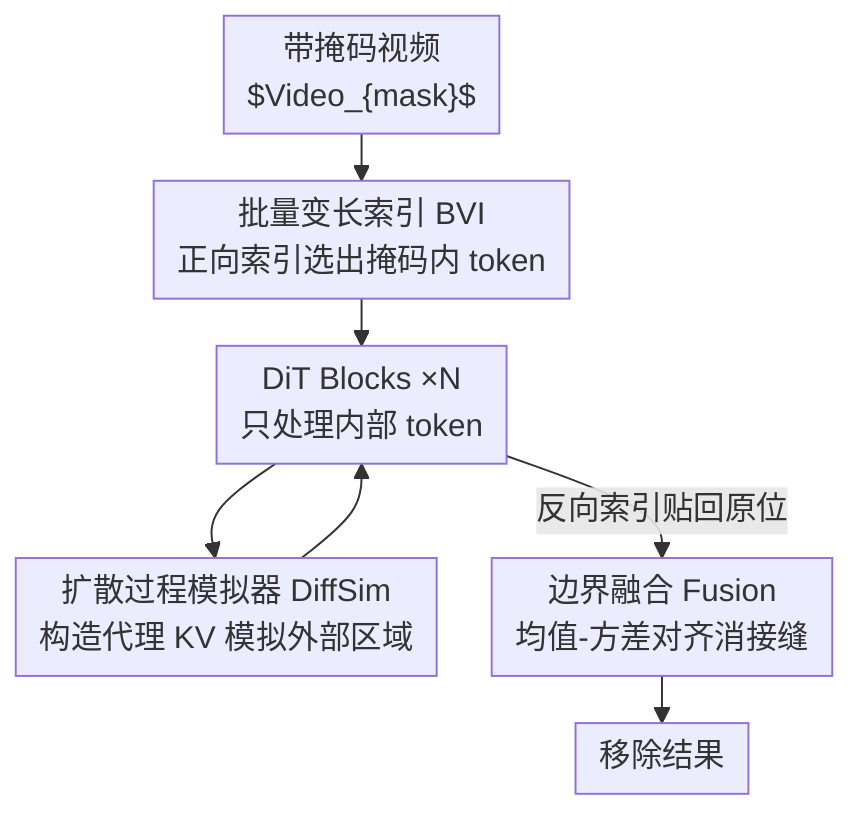

# YOSE: You Only Select Essential Tokens for Efficient DiT-based Video Object Removal

**会议**: CVPR 2026  
**论文**: [CVF Open Access](https://openaccess.thecvf.com/content/CVPR2026/html/Wu_YOSE_You_Only_Select_Essential_Tokens_for_Efficient_DiT-based_Video_CVPR_2026_paper.html)  
**代码**: https://github.com/Wucy0519/YOSE-CVPR26 (有)  
**领域**: 视频生成 / 扩散模型 / 视频物体移除 / DiT 高效化  
**关键词**: Diffusion Transformer, 视频物体移除, token 稀疏化, 掩码感知加速, 微调框架  

## 一句话总结
YOSE 是一个即插即用的微调框架：它把基于 DiT 的视频物体移除（如 MiniMax Remover）从"对整段时空 token 做密集计算"改造成"只处理掩码区域内的 token、并用一个轻量模块模拟外部区域对自注意力的影响"，让推理耗时随掩码面积近似线性下降，在 70% 的真实场景中实现 2.5× 加速且画质几乎不掉。

## 研究背景与动机
**领域现状**：DiT（Diffusion Transformer）凭借全局建模能力，在视频生成上取得了远超 UNet 扩散模型的时空一致性与可扩展性。视频物体移除（Video Object Removal, VOR）受益于此，代表方法 MiniMax Remover、ROSE、VACE 都把"擦除物体 + 重建背景"统一在 DiT 生成框架里完成，画质已达 SOTA。

**现有痛点**：这些方法推理太慢。MiniMax Remover 在 480p 下只有约 10FPS，根因是它继承了 DiT 的"全 token 计算"范式——无论掩码多小，去噪和注意力都要在**整段时空 token 空间**上跑一遍。但 VOR 本质是一个**局部**生成任务：只有掩码区域需要重建，未掩码区域应当原样保留。作者在 DAVIS 和 YouTube-VOS 上统计发现，约 70% 的样本掩码占比低于 20%，只有极少数超过 40%。

**核心矛盾**：现有方法的计算量与掩码大小**无关**（恒定），而真实任务里掩码通常很小——这意味着绝大多数算力浪费在了根本不需要改动的背景 token 上。掩码越小，浪费越严重。

**本文目标**：让计算量随掩码面积**线性**缩放，且不重新设计模型架构、不牺牲画质。这要解决两个子问题：（1）如何只把掩码 token 送进 DiT，同时保持可微和可批量训练；（2）只算内部 token 后，如何让它仍"感知"到外部区域的上下文，避免边界处语义/运动断裂。

**核心 idea**：只选必要的 token（You Only Select Essential Tokens）——用一个可微的动态索引算子把掩码区域 token 抽出来单独过 DiT，再用一个轻量模块**模拟**外部 token 在自注意力里的影响，从而在不实际计算外部 token 的前提下保住全局一致性。

## 方法详解

### 整体框架
给定一段带掩码的视频 $Video_{mask}$，YOSE 的处理链路是：先用 **BVI（批量变长索引）** 根据掩码动态选出"内部"（inner，即掩码区域）token 序列 $St_{in}$，丢弃冗余的外部 token；这串 token 进入每个 DiT block 时，**DiffSim（扩散过程模拟器）** 不去真算外部 token，而是用噪声潜变量与掩码视频潜变量构造出代理的 Key/Value 来模拟外部区域对自注意力的贡献，让内部 token 仍能"注意到"全局语义；DiT 处理完后用 BVI 的**反向索引** $Ind_B$ 把结果贴回原始时空位置；最后用 **Fusion（边界融合）** 对内外重叠带做均值-方差对齐，消除接缝。整个框架只训练 DiffSim 里的 3 组参数，其余权重冻结，所以是个"挂在 MiniMax Remover 上的"轻量微调插件。

### 关键设计

**1. 批量变长索引 BVI：用可微采样替代硬索引，让"只取掩码 token"既能反传又能批量化**

最朴素的做法是 $St_{in} = Video_{mask}[mask]$ 把掩码处 token 抠出来、算完再 $Video_{mask}[mask] = St_{in}^{out}$ 贴回去。但这种硬索引有两个致命问题：一是 `Tensor[mask]` 这种离散取址**切断梯度**，没法端到端训练；二是 batch 内每个样本掩码 token 数不同，张量长度对不齐，**无法批量并行**。BVI 的解法是把"离散的按掩码采样"重写成"连续的坐标映射"——用 `grid_sample`（记作 $GSample$）做基于插值的可微选择：正向取 token 写成 $St_{in} = GSample(Video_{mask}, Ind_F)$，处理完用反向索引还原 $Video_{out} = GSample(St_{in}^{out}, Ind_B)$，梯度可以同时沿视频特征和采样坐标回传。对于变长问题，BVI 逐样本统计 token 数，再 pad 到 batch 内最大长度 $L_{max}$（伪代码 Alg.1 用 `Linspace` 在 $[1/2L-1, 1-1/2L]$ 上铺归一化坐标，正向收集掩码命中的坐标、反向构造还原坐标并补 1 做 padding）。这样总计算复杂度正比于**掩码 token 数**而非视频总 token 数，YOSE 由此获得相对掩码面积的线性复杂度，同时还把训练从单样本变成了可批量。

**2. 扩散过程模拟器 DiffSim：不算外部 token，却让内部 token 在自注意力里"看到"外部上下文**

只处理内部 token 会丢掉一个对 VOR 至关重要的东西——内外区域间的上下文依赖（边界处的语义连续和运动一致）。如果内部 token 在自注意力里只能彼此 attend，重建出的区域就会和周围背景脱节。DiffSim 的思路是：既然全 token DiT 处理外部 token 时，输入是加噪视频潜变量 $Lat_{Nis}$、预测目标是噪声，二者推理时都已知，那就可以**直接近似**出外部 token 的中间状态，而不必真把它们送进 DiT。具体地，DiffSim 受 flow-matching loss 启发构造残差潜变量

$$Res_{Nis} = Lat_{Nis} - Lat_{mask}$$

它刻画了噪声在学到的流场下朝目标潜状态演化的方向。把 $Res_{Nis}$ 和掩码视频潜变量 $Lat_{mask}$ 组合，就能模拟外部 token 的中间状态，进而生成代理的 Key/Value 让内部 token 去 attend。组合由每个 DiT block 内的三组可学习参数控制：组合参数 $G$ 决定重建潜变量与残差分量的插值比例

$$KV = G[i] \cdot Lat_{mask} + (1 - G[i]) \cdot Res_{Nis}$$

再由缩放参数 $S$ 和偏置参数 $Bias$ 调制 KV 的分布

$$KV = (1 + S[i]) \cdot KV + Bias[i]$$

这样模拟出的 K/V 模仿了外部区域的响应，使 DiT 内部的注意力在不增加任何 token 级计算的前提下仍"全局有感知"，内外 token 处于统一潜空间、能跨掩码边界保持一致。整个框架里只有 $G, S, Bias$ 这三组参数可训练。

**3. 边界融合 Fusion：用局部均值-方差对齐抹掉内外接缝**

即便内部重建得不错，由于内外缺乏共享的上下文统计量，掩码边界仍可能出现轻微不一致。Fusion 用一招简单的"局部均值-方差对齐"来收尾：先把原掩码 $mask$ 膨胀成 $mask_{dilate}$，二者之差定义重叠带 $mask_{overlap} = mask_{dilate} - mask$；在这条带子里取出预测部分 $Pred_{overlap}$ 和原始未掩码部分 $Orig_{overlap}$，计算各自的均值方差 $(\mu_{pred}, \sigma_{pred})$、$(\mu_{orig}, \sigma_{orig})$，把预测区域归一化后重缩放到周围区域的统计分布

$$St_{in} = \frac{\sigma_{orig} \cdot (St_{in} - \mu_{pred})}{\sigma_{pred}} + \mu_{orig}$$

最后用加权掩码 $M_{fus} = (mask + mask_{dilate})/2$ 把重建结果与原视频混合，使边界平滑过渡，消除可见的接缝。

### 损失函数 / 训练策略
YOSE 用 flow-matching 范式训练，并把损失约束在掩码区域内——掩码感知的 flow matching loss 为

$$L_{FM}^{mask} = \frac{\|mask \odot (out - Noise\text{-}GT)\|_2^2}{\|mask\|_1}$$

其中 $\odot$ 是逐元素乘。它只惩罚掩码区域内的扩散预测，保证擦除精确高效、且与学到的扩散轨迹一致。训练上只放开 DiffSim 的 $G, S, Bias$ 三组参数（保住原模型能力），batch 总量 32（8 卡）、输入 17 帧、分辨率 480×832，AdamW、学习率 5e-5、仅 2K 步、用 VPData 中约 7 万样本训 1 个 epoch，总耗时约 4 小时——成本极低。

## 实验关键数据

### 主实验
在 YouTube-VOS 和 DAVIS 上，把 YOSE 分别挂到 MiniMax Remover 和 VACE 两个 DiT 基座上评测。结论是画质基本持平甚至略升，但效率大幅提升；尤其挂到背景保真较弱的 VACE 上时，YOSE 能显著改善背景指标（因为它根本不动未掩码区域）。

| 数据集 | 方法 | PSNR↑ | SSIM↑ | LPIPS↓ | Aes.Qua.↑ |
|--------|------|-------|-------|--------|-----------|
| YouTube-VOS | MiniMax Remover | 30.33 | 0.9116 | 0.0615 | 0.3920 |
| YouTube-VOS | **YOSE (MiniMax)** | 31.01 (+0.68) | 0.9120 | 0.0642 | 0.3927 |
| YouTube-VOS | VACE | 23.72 | 0.8322 | 0.1322 | 0.4127 |
| YouTube-VOS | **YOSE (VACE)** | 29.19 (+5.47) | 0.8994 (+0.07) | 0.0746 | 0.3898 |
| DAVIS | MiniMax Remover | 29.37 | 0.8723 | 0.0836 | 0.4404 |
| DAVIS | **YOSE (MiniMax)** | 29.59 (+0.22) | 0.8703 | 0.0826 | 0.4432 |
| DAVIS | VACE | 25.09 | 0.8221 | 0.1228 | 0.4481 |
| DAVIS | **YOSE (VACE)** | 28.28 (+3.19) | 0.8604 (+0.04) | 0.0896 | 0.4399 |

效率方面，YOSE 的 FLOPs 满足 $G(\gamma) = \gamma \times (49 + 12c + 4n + 4hn/c + 9f)\beta\eta + \dots$（$\gamma$ 为掩码比例），与 $\gamma$ 呈线性关系。实测延迟：掩码比例 5% 时相对全 token DiT 基线加速 3.3×，20%（多数真实场景）时仍有 2.5× 加速；掩码涨到 80% 覆盖几乎全部 token 时退化到与全 token 推理相当——即最坏情况不会比基线更慢。

### 消融实验
在 DAVIS 上、以 MiniMax Remover 为基座做消融（Tab.2）。DiffSim 的两个输入分量 $Lat_{Nis}$（Nis.）和 $Lat_{mask}$（Ma.）缺一不可，融合策略（Fus.）负责边界平滑。

| 配置 | Dyn.Deg.↑ | Aes.Qua.↑ | PSNR↑ | SSIM↑ | 说明 |
|------|-----------|-----------|-------|-------|------|
| Nis + Ma + Fus（完整） | 0.5778 | 0.4432 | 29.59 | 0.8703 | 完整 YOSE |
| 仅 Ma（去 $Lat_{Nis}$） | 0.5444 | 0.4316 | 27.62 | 0.8559 | 扩散过程模拟不足，PSNR 掉 ~2dB |
| 仅 Nis（去 $Lat_{mask}$） | 0.5778 | 0.4382 | 27.67 | 0.8559 | 同样明显掉点 |
| Ma + Nis，去 Fusion | 0.5667 | 0.4320 | 28.42 | 0.8606 | 边界出现可见接缝 |

### 关键发现
- **DiffSim 的两个潜变量分量必须联合使用**：只用 $Lat_{Nis}$ 或只用 $Lat_{mask}$ 都会让 PSNR 从 29.59 掉到约 27.6，说明残差项与掩码潜变量分别承载了外部上下文模拟的不同信息，靠可学习的 $G/S/Bias$ 把两者融合才达到最优。
- **BVI 不只是省推理，更省训练**：得益于变长批量化，YOSE 在 8 卡上 batch=4 训练约 4 小时即可；而无法处理变长 token 的传统单样本方案在相同设置下要约 11 小时——近 3× 训练加速。
- **掩码越小收益越大**：因为复杂度随掩码线性缩放，5% 掩码时 3.3×、20% 时 2.5×，而真实 VOR 场景约 70% 掩码占比低于 20%，正好落在 YOSE 的高收益区间。
- **YOSE 能反向修正基座的背景"误改"**：由于完全不处理未掩码 token，挂到背景保真差的 VACE 上时背景 PSNR 暴涨 5.47 dB，说明"不动该不动的地方"本身就是一种质量增益。

## 亮点与洞察
- **把"硬索引"重写成"可微坐标采样"是核心巧思**：用 `grid_sample` 替代 `Tensor[mask]`，一举解决了梯度阻断和变长批量两个工程难题，让"稀疏 token 处理"第一次能端到端训练——这个 trick 可迁移到任何需要按掩码/区域稀疏化 token 的 Transformer 任务。
- **"模拟而非计算"外部上下文**：DiffSim 不真算外部 token，而是用已知的噪声潜变量与掩码潜变量构造代理 KV，让内部 token 仍能 attend 到全局语义。这把"稀疏计算导致上下文丢失"的老问题用一个极轻量（每 block 仅 3 标量组）的模块补上了。
- **即插即用、几乎零成本**：只训 3 组参数、1 个 epoch、4 小时，就能给已有 SOTA 模型挂上掩码感知加速，且最坏情况不比原模型慢——这种"纯加速插件"的定位很实用。

## 局限与展望
- **依赖固定掩码输入**：作者明确指出 ROSE 这类不依赖固定掩码的方法无法直接套用 YOSE，所以主实验只验证了 MiniMax 和 VACE 两个需要掩码的基座，泛化边界受限于"必须有显式掩码"。
- **大掩码场景无加速**：当掩码比例升到 ~80%，因 VAE 的块编码约束计算覆盖几乎全部 token，YOSE 退化为全 token 推理，对"大面积移除/大目标"任务没有收益。
- **DiffSim 是近似而非精确**：用残差 $Res_{Nis} = Lat_{Nis} - Lat_{mask}$ 模拟外部扩散过程是一个基于 flow-matching 的假设性近似，论文未给出该近似与真实全 token 注意力之间的误差界，极端运动/复杂遮挡下是否仍成立值得进一步验证。
- **评测画质几乎持平、提升主要在效率**：在 MiniMax 基座上 VBench/背景指标多为 ±1e-2 级别波动，YOSE 的价值定位更偏"等质提速"而非"提质"，对追求画质上限的场景吸引力有限。

## 相关工作与启发
- **vs MiniMax Remover**: MiniMax 是两阶段 DiT VOR、用 minimax 蒸馏做到 6 步无 CFG 的 SOTA 移除，但继承了全 token 密集计算。YOSE 把它当基座，在不改架构、不掉画质的前提下挂上掩码感知加速，定位是"给 MiniMax 提速的插件"而非竞争者。
- **vs ROSE**: ROSE 显式建模物体引起的阴影/反光/半透明等环境副作用、靠 3D 渲染合成配对数据做"副作用感知"的彻底擦除，但不依赖固定掩码，因此 YOSE 无法直接套用——二者在"擦得干净" vs "擦得快"上是正交方向。
- **vs VACE**: VACE 是 ControlNet 式的通用 DiT 视频编辑模型，YOSE 把它当第二个基座验证泛化性，并意外发现 YOSE 能修正 VACE 对背景的误改（背景 PSNR +5.47 dB），说明"区域稀疏化"对通用编辑模型也有"保护非编辑区"的额外价值。

## 评分
- 新颖性: ⭐⭐⭐⭐ 把可微 grid_sample 索引 + 外部上下文模拟组合起来解决"DiT 稀疏 token 处理"，思路清晰且实用，但每个组件都建立在成熟构件之上。
- 实验充分度: ⭐⭐⭐⭐ 两个基座 × 两个数据集 + FLOPs/延迟曲线 + 组件消融完整；略缺与近似误差、大掩码极端场景的深入分析。
- 写作质量: ⭐⭐⭐⭐ 动机统计（70% 掩码 < 20%）很有说服力，框架图与公式清晰；部分符号（$Res_{Nis}$ 近似假设）稍欠严格论证。
- 价值: ⭐⭐⭐⭐ 即插即用、4 小时训练、2.5× 提速且画质不掉，对落地 DiT 视频物体移除很有吸引力。

<!-- RELATED:START -->

## 相关论文

- [\[CVPR 2026\] A Frame is Worth One Token: Efficient Generative World Modeling with Delta Tokens](a_frame_is_worth_one_token_efficient_generative_world_modeling_with_delta_tokens.md)
- [\[CVPR 2026\] OmniLottie: Generating Vector Animations via Parameterized Lottie Tokens](omnilottie_generating_vector_animations_via_parameterized_lottie_tokens.md)
- [\[CVPR 2026\] What Are You Doing? A Closer Look at Controllable Human Video Generation](what_are_you_doing_a_closer_look_at_controllable_human_video_generation.md)
- [\[CVPR 2026\] Open-world Hand-Object Interaction Video Generation Based on Structure and Contact-aware Representation](open-world_hand-object_interaction_video_generation_based_on_structure_and_conta.md)
- [\[CVPR 2026\] SemVideo: Reconstructs What You Watch from Brain Activity via Hierarchical Semantic Guidance](semvideo_reconstructs_what_you_watch_from_brain_activity_via_hierarchical_semant.md)

<!-- RELATED:END -->
