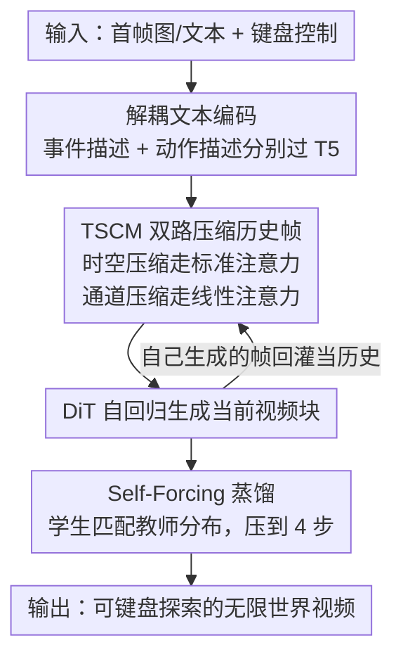

# Yume1.5: A Text-Controlled Interactive World Generation Model

**会议**: CVPR 2026  
**论文**: [CVF Open Access](https://openaccess.thecvf.com/content/CVPR2026/html/Mao_Yume1.5_A_Text-Controlled_Interactive_World_Generation_Model_CVPR_2026_paper.html)  
**代码**: https://github.com/stdstu12/YUME  
**领域**: 视频生成 / 交互式世界模型  
**关键词**: 交互式世界生成、长视频生成、自回归扩散、键盘控制、文本控制事件

## 一句话总结
Yume1.5 把一张图或一段文字变成可用键盘自由探索的无限世界视频，靠「时空-通道联合压缩历史帧」省显存、靠「Self-Forcing 蒸馏」把推理压到 4 步 8 秒，还能用文字临时往世界里塞事件，指令跟随分数从前作 0.657 拉到 0.836。

## 研究背景与动机

**领域现状**：用视频扩散模型生成「可交互、可探索、能持续延伸」的虚拟世界是近两年的热点。给定一张首帧图，模型自回归地一帧帧往下生成，同时接受键盘（WASD 控制人物移动、方向键控制相机）作为条件，让用户像玩第一人称游戏一样在生成的世界里走动。代表工作有 Matrix-Game（游戏世界）、WorldMem（记忆增强一致性）以及本文前作 Yume。

**现有痛点**：这类方法卡在三处。一是**泛化差**——多数模型在游戏数据集上训练，搬到真实城市街景就有明显 domain gap；二是**延迟高**——扩散模型推理步数多，前作 Yume 生成一段要 572 秒，根本撑不起「无限探索」需要的实时性；三是**只能键鼠控制、不能文本控制**——你没法让世界里突然「下一场暴雨」或者「飘过一个 UFO」。

**核心矛盾**：要支持无限长探索，历史上下文会无限增长。Sliding Window 直接截断会丢历史信息；FramePack/Yume 式的「近处轻压、远处重压」仍然随时长增加而吃显存、且远端历史损失越来越大；WorldMem 式按相机轨迹找重叠帧的做法在键盘控制下根本拿不到精确轨迹。**上下文增长 vs 推理速度/显存** 之间无法两全，是长视频世界生成的根本瓶颈。

**本文目标**：在单张 A100 上做到真实场景的实时（12 fps@540p）、可无限探索、且支持文本事件的交互式世界生成。

**切入角度**：作者观察到历史帧里其实大量是冗余的、还携带误差的 token。与其精挑细选保留哪些帧，不如**激进压缩历史帧、让模型只能依赖最鲁棒的历史特征**——压缩本身就成了一个「时序滤波器」，顺手把累积误差也滤掉了。

**核心 idea**：用「时空压缩 + 通道压缩」两条并行路径处理历史帧（TSCM），让推理时间不随上下文增长；再把 Self-Forcing 自回归蒸馏接在 TSCM 上，做到 4 步快速推理且不崩；最后把 caption 拆成「事件描述 + 动作描述」分别编码，解锁文本控事件。

## 方法详解

### 整体框架
Yume1.5 以 Wan2.2-5B 视频扩散模型为底座，做联合 T2V/I2V 训练。生成时按「块」自回归：每次拿历史帧 $z_c$ 和待预测帧 $z_p$ 一起喂进 DiT，吐出一段新视频块，再把自己生成的块当作下一轮历史，循环延伸。三个关键创新分别管住「长上下文不爆显存」「少步推理不崩」「文本能控事件」。

整条管线分两段训练：先在真实+合成+事件三类混合数据上交替做 T2V/I2V 训练，得到 foundation model；再以它初始化生成器/学生/教师三个模型，做 Self-Forcing + 蒸馏，得到 4 步可推理的最终模型。下图是推理时的数据流：

### 关键设计

**1. TSCM 时空-通道联合建模：让推理时间不随上下文增长**

痛点很直接——视频越生越长，历史帧数 $f_i$ 不断增加，全塞进注意力计算量爆炸，但简单截断又丢信息。作者的解法是把历史帧 $z_c$ 拆成**两条互补的压缩路径**，分别避开标准注意力和线性注意力各自的计算瓶颈。

第一条是**时空压缩**：对历史帧先按 1/32 随机抽帧，再用「离当前帧越远、压得越狠」的可变 Patchify。具体下采样率随时序距离递增：

$$
\text{帧 } t{-}1 \sim t{-}2:(1,2,2)\quad t{-}3\sim t{-}6:(1,4,4)\quad t{-}7\sim t{-}23:(1,8,8)\ \cdots
$$

其中 $(1,2,2)$ 表示在时间/高/宽三维上分别下采样 $1\times/2\times/2\times$。这些不同采样率是通过**插值 DiT 里 Patchify 的权重**实现的，相比前作还顺手减少了 Patchify 的参数量。压完得到 $\hat z_c$，和按 $(1,2,2)$ 正常处理的预测帧 $\hat z_p$ 拼接后进标准注意力。因为标准注意力对 token 数敏感，时空压缩正好砍掉 token 数。

第二条是**通道压缩**：把同一批历史帧用 $(8,4,4)$ 的 Patchify 压、并把通道降到 96，得到 $z_{\text{linear}}$，专门喂给 DiT block 里的线性注意力分支。因为线性注意力对通道维敏感，所以这条路压通道而非 token。在 block 内部，预测帧 $z_p^l$ 过 FC 后与 $z_{\text{linear}}$ 拼接、经线性注意力融合、再过 FC 做通道还原，并用**残差连接**把还原结果加回压缩前的 $z_p^l$，避免 FC 压缩丢信息；历史 token $z_c^l$ 则绕过融合直达 block 末端，保证未压缩特征用于高保真。两条路一个保真度、一个高效率，合起来就是「时空-通道联合压缩」。

线性注意力本身把标准注意力的指数核 $\exp((k^l)^T q^l)$ 替换成 ReLU 点积核 $\varphi(k^l)^T\varphi(q^l)$：

$$
o^l=\frac{\sum_{i=1}^{N} v_i^l\,\varphi(k_i^l)^T\big(\varphi(q^l)\big)}{\sum_{j=1}^{N}\varphi(k_j^l)^T\big(\varphi(q^l)\big)}
$$

并在 ROPE 之前先算分母、对 $q,k$ 做 Norm 防梯度爆炸。效果是当视频块数超过 8 后，每步推理时间基本恒定（见 Figure 7），而全上下文输入法时间持续飙升。

**2. Self-Forcing + TSCM 实时加速：用「喂自己的错帧」对抗少步推理的误差累积**

痛点是扩散步数少了误差会快速累积——步数越少，自回归生成越往后画质崩得越厉害。作者借鉴 Self-Forcing：训练时**强迫模型用自己之前生成的帧（已带误差）当历史**，而不是用 ground-truth 帧，从而在训练阶段就让模型学会在「脏历史」上继续生成，弥合 train-inference gap。

与原版 Self-Forcing 的关键区别有两点：一是**丢掉 KV cache、换成 TSCM**，从而能利用长得多的上下文；二是 TSCM 在这里额外扮演**时序滤波器**——激进压缩会自然丢掉冗余、易错的 token 表示，逼着生成只依赖最鲁棒的历史特征，于是误差累积被进一步抑制。加速本身用分布匹配蒸馏（DMD 思路）：以 foundation model 初始化生成器 $G_\theta$、假模型 $G_s$、真模型 $G_t$，把多步扩散蒸馏成少步生成器，最小化生成分布与真实数据分布在各噪声层的 KL 散度。与 DMD 的差异是**用模型预测的帧而非真实帧作为视频条件**，这正好和 Self-Forcing 的「喂自己的错帧」一致，进一步缓解误差累积。最终只用 4 步推理就把单段生成从前作 572 秒压到 8 秒。

**3. 事件/动作解耦文本编码：以极小数据解锁文本控事件**

痛点是前作只能键鼠控制、没法用文字往世界里加事件。作者把 caption 拆成两部分分别过 T5 再拼接：**事件描述**（Event Description，指定要生成的场景/事件，如「出现一个幽灵」）和**动作描述**（Action Description，描述键鼠控制，如「人物前进 W、相机左转 ←」）。这个拆分不只是为了可控，还省算力——动作描述集合是有限的，可以**预计算并缓存**；事件描述只在初始生成阶段处理一次，于是后续每步推理几乎免去 T5 开销。

要让文本控事件真正生效，关键在数据。作者构建三类数据混合训练：真实数据集 Sekai-Real-HQ（用 InternVL3-78B 把 caption 重标成「聚焦动态事件」而非静态场景，专供 I2V）、合成数据集（用 Wan2.1-14B 从 Openvid 8 万 caption 合成视频、VBench 过滤留 5 万，防止灾难性遗忘）、以及专门的事件数据集（招募志愿者写城市日常/科幻/奇幻/天气四类描述，合成后人工筛出 4000 条精确匹配的视频）。靠这套「极小但精准」的事件数据，模型用很少的额外数据就拿到了文本驱动事件生成能力。

### 损失函数 / 训练策略
foundation model 用 Rectified Flow loss，在 704×1280、16 FPS、batch 40、Adam lr=1e-5 下训 10000 步，T2V/I2V 数据**逐步交替**切换。之后接 Self-Forcing + TSCM 训练，超参相同但只训 600 步。蒸馏目标是跨噪声层的 KL 散度（分布匹配），推理用 4 步。

## 实验关键数据

评测用 Yume-Bench（前作的 benchmark），含指令跟随（IF，相机/行走方向是否正确）+ VBench 五项画质指标：主体一致性 SC、背景一致性 BC、运动平滑 MS、美学质量 AQ、成像质量 IQ。测试分辨率 544×960，16 FPS，96 帧。

### 主实验（I2V，Table 1）

| 模型 | 时间(s)↓ | IF↑ | SC↑ | BC↑ | MS↑ | AQ↑ | IQ↑ |
|------|---------|-----|-----|-----|-----|-----|-----|
| Wan-2.1-I2V-14B | 611 | 0.057 | 0.859 | 0.899 | 0.961 | 0.494 | 0.695 |
| Wan-2.2-5B | 107 | 0.243 | 0.889 | 0.915 | 0.958 | 0.502 | 0.659 |
| MatrixGame | 971 | 0.271 | 0.911 | 0.932 | 0.983 | 0.435 | 0.750 |
| Yume（前作） | 572 | 0.657 | 0.932 | 0.941 | 0.986 | 0.518 | 0.739 |
| **Yume1.5** | **8** | **0.836** | 0.932 | **0.945** | 0.985 | 0.506 | 0.728 |

指令跟随 0.836 大幅领先（前作 0.657、MatrixGame 仅 0.271），同时推理时间从前作 572 秒压到 8 秒（约 71×），画质指标基本持平或略升。AQ/IQ 比前作略低，是少步推理换速度的合理代价。

### 消融实验（TSCM，Table 2）

| 配置 | IF↑ | SC↑ | BC↑ | MS↑ | AQ↑ | IQ↑ |
|------|-----|-----|-----|-----|-----|-----|
| TSCM（完整） | **0.836** | 0.932 | 0.945 | **0.985** | 0.506 | 0.728 |
| Spatial Compression（换前作空间压缩） | 0.767 | 0.935 | 0.945 | 0.973 | 0.504 | 0.733 |

把 TSCM 换成前作的纯空间压缩后，IF 从 0.836 掉到 0.767，其余指标几乎不变。作者解释 TSCM 削弱了历史帧里固有运动方向对预测帧的干扰，所以指令跟随更准。

### 关键发现
- **TSCM 主要贡献在指令跟随而非画质**：换掉它 IF 掉约 0.07，但 SC/BC/MS/AQ/IQ 几乎不动，说明它的价值是「让相机/行走控制更听话」，而非提升单帧美观。
- **长视频稳定性靠 Self-Forcing+TSCM**：30 秒视频切 6 段算分，第 6 段美学分 0.523 vs 不用的 0.442、成像质量 0.601 vs 0.542——后段不崩是核心优势（Figure 5/6）。
- **推理时间随上下文饱和**：视频块数超过 8 后每步时间恒定（Figure 7），而全上下文输入法第 3 步就出现最大差距、时间持续上涨。

## 亮点与洞察
- **把「压缩」当成「滤波」用**：通常压缩历史是为省显存（被动妥协），这里反过来论证激进压缩能主动滤掉易错 token、提升长程一致性——一个手段服务两个目的，思路很巧。
- **按注意力类型分配压缩维度**：标准注意力对 token 数敏感就压时空、线性注意力对通道敏感就压通道，两条路各打各的痛点再融合，是很干净的工程洞察。
- **事件/动作解耦不止为可控，还为加速**：动作描述有限可缓存、事件描述只算一次，把「可控性」和「省 T5 算力」一并解决，这种「拆分带来双红利」的设计可迁移到其他需要重复条件注入的自回归生成任务。

## 局限与展望
- **AQ/IQ 相对前作有轻微回退**：4 步推理换来 71× 提速，但单帧美学/成像略降，对画质极致敏感的场景仍有差距。
- **依赖大量外部大模型搭数据**：InternVL3-78B 重标注、Wan2.1/2.2 合成视频、VBench 过滤，复现门槛高，数据管线本身是隐性成本。
- **事件控制评测偏弱**：文本控事件是主打卖点之一，但正文主要用 IF + VBench 量化，缺少对「事件是否被正确触发/语义对齐」的专门定量指标，主要靠定性图展示。
- **键盘控制空间被离散化**：把相机位姿空间离散成键盘输入虽直观，但相比连续轨迹控制（CameraCtrl 系）精细度受限，复杂运镜可能表达不出。

## 相关工作与启发
- **vs Yume（前作）**: 前作用「近轻远重」的历史帧压缩，仍随时长吃显存、远端损失大、且只能键鼠控制；Yume1.5 用 TSCM 双路压缩让推理时间饱和、加 Self-Forcing 蒸馏把 572s→8s、再解锁文本控事件，IF 0.657→0.836。
- **vs Self-Forcing**: 原版用 KV cache 缓存历史、靠喂自己生成帧抗误差累积；本文丢掉 KV cache 换成 TSCM，既能用更长上下文，又让压缩充当时序滤波器进一步抑制误差。
- **vs WorldMem**: 它按相机轨迹找视野重叠帧来保持一致性，但需要精确轨迹，在键盘控制/动态视角下轨迹估计误差大；本文不依赖轨迹，直接压缩全历史。
- **vs MatrixGame**: 它训练在游戏数据、用原生键鼠方案，真实城市场景泛化差（IF 仅 0.271、971s）；本文混合真实+合成+事件数据，真实场景 IF 0.836、8s。

## 评分
- 新颖性: ⭐⭐⭐⭐ 「按注意力类型分维度压缩 + 压缩即滤波」的视角新颖，事件/动作解耦也巧，但整体是把 TSCM/Self-Forcing/DMD 几条现成线索组合到世界生成上。
- 实验充分度: ⭐⭐⭐⭐ I2V 主表 + TSCM 消融 + 长视频稳定性 + 速度曲线都有，但文本控事件这一主打能力缺专门定量评测。
- 写作质量: ⭐⭐⭐⭐ 三大创新动机清晰、图文对照充分；个别句子重复、部分公式符号偏密。
- 价值: ⭐⭐⭐⭐⭐ 单 A100 实时（12fps@540p）+ 无限探索 + 文本控事件，且开源，对交互式世界生成落地很有参考价值。

<!-- RELATED:START -->

## 相关论文

- [\[CVPR 2026\] TGT: Text-Grounded Trajectories for Locally Controlled Video Generation](tgt_text-grounded_trajectories_for_locally_controlled_video_generation.md)
- [\[AAAI 2026\] 3D4D: An Interactive Editable 4D World Model via 3D Video Generation](../../AAAI2026/video_generation/3d4d_an_interactive_editable_4d_world_model_via_3d_video_generation.md)
- [\[CVPR 2026\] Endless World: Real-Time 3D-Aware Long Video Generation](endless_world_real-time_3d-aware_long_video_generation.md)
- [\[CVPR 2026\] Physical Object Understanding with a Physically Controllable World Model](physical_object_understanding_with_a_physically_controllable_world_model.md)
- [\[CVPR 2026\] VerseCrafter: Dynamic Realistic Video World Model with 4D Geometric Control](versecrafter_dynamic_realistic_video_world_model_with_4d_geometric_control.md)

<!-- RELATED:END -->
