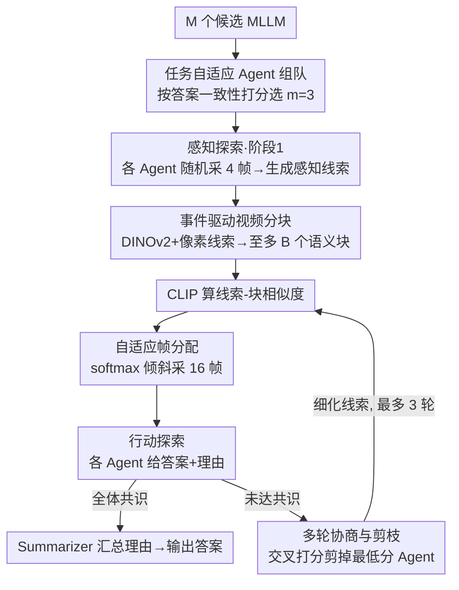

# A Multi-Agent Perception-Action Alliance for Efficient Long Video Reasoning

**会议**: CVPR2026  
**arXiv**: [2603.14052](https://arxiv.org/abs/2603.14052)  
**代码**: [git-disl/A4VL](https://github.com/git-disl/A4VL)  
**领域**: 视频理解  
**关键词**: 长视频推理, 多智能体协作, 视频问答, 感知-行动探索, 无训练框架

## 一句话总结

提出 A4VL，一个无训练的多智能体感知-行动联盟框架，通过事件驱动视频分块、线索引导的关键帧选择和多轮智能体协商剪枝机制，在五个视频问答基准上以显著更低的推理延迟全面超越 28 个基线方法。

## 研究背景与动机

**长视频推理计算瓶颈**：多模态大语言模型(MLLM)处理长视频时，帧数增大导致显存和时间开销呈二次增长，GPT-4o 在 Video-MME 上平均每题需 150 秒以上。

**冗余帧引入噪声**：已有研究表明简单增加帧采样密度反而可能损害性能，冗余帧分散注意力，使模型难以对准真正有信息量的关键帧。

**现有 Agent 方法速度慢**：VideoAgent 处理一小时视频需超过 10 分钟；多数方法依赖单一 MLLM 做决策，缺乏多智能体间的有效协作。

**关键帧定位困难**：当问题涉及长视频中少量帧覆盖的事件时，精确定位相关帧极具挑战；MoReVQA 在长视频数据集上精度显著下降。

**单模型局限性**：不同 MLLM 各有优势与盲区，单模型在复杂推理场景中容易犯错且无法自我纠正，协作机制能互补提升。

**缺乏高效的多智能体协同机制**：现有多 Agent 方法要么没有迭代修正能力，要么缺少剪枝策略导致低效，需要设计既准确又高效的协作框架。

## 方法详解

### 整体框架

A4VL 把长视频问答拆成「感知」和「行动」两件事，让一支由 3 个互补 MLLM 组成的小队在多轮循环里边看边答。开局是可选的 Agent 组队：从 M 个候选模型里，按「与多数答案一致的频率」给每个模型打分，选出最互补的 $m=3$ 个。每一轮先做感知探索——各 Agent 先随机采 $N_1=4$ 帧生成与问题相关的感知线索，再用事件驱动方法把视频切成至多 $B$ 个块、用 CLIP 算线索与各块相似度，按 softmax 从高相关块里采 $N_2=16$ 帧；随后做行动探索——各 Agent 基于自己采到的帧给出答案和理由，若全体共识就收工，否则互相打分、剪掉最差的 Agent，剩下的细化线索进入下一轮。

### 关键设计

**1. 任务自适应 Agent 组队：无标签投票选出最互补的 MLLM 小队**

不同 MLLM 各有盲区，把哪几个凑成一队直接决定推理上限。A4VL 在每个任务上先做一次无监督组队：从 $M$ 个候选模型里随机抽 $K$ 个无标签的视频-问题对让所有模型作答，统计每道题各选项被选中的比例 $f_{qr}$，再给每个模型按「它选的选项有多少同伴附和」打分 $\frac{1}{K}\sum_{q=1}^{K} f_{q,r_q}$，取分最高的 $m=3$ 个组成该任务的固定小队。整个过程不依赖真值标签、只跑一次就被该任务所有问题复用；实验显示不同基准选出的组合确实不同（如 MLVU 选 LLaVA-72B 而非 QwenVL-72B），印证了「按任务挑队友」而非用一套固定模型的价值。

**2. 事件驱动视频分块：让每个块语义同质，相似度匹配才可靠**

按固定窗口切块会把一个事件切碎，CLIP 相似度也就不准。A4VL 用 DINOv2 嵌入加像素级线索（HSV/运动/锐度）检测场景变化，经 KTS、PELT 和 SSM 新颖度检测生成候选边界点，再用 NMS 合并、保留 top-$(B{-}1)$ 个边界。这样切出的块内部语义一致，后续「线索 vs 块」的匹配才有意义；实测大多数视频能在 2 秒内完成分块。

**3. 自适应帧分配：相关时按需倾斜、不相关时聚焦单块**

固定给每块均分帧数会浪费预算。当所有块相似度都低于阈值 $\rho=0.8$ 时，每个 Agent 只从最匹配的块采 $N_2$ 帧；一旦存在高相似块，就对相似度做 softmax 归一化、按比例分配 $\mathbf{c}^{(i)} = \lfloor N_2 \cdot \text{SoftMax}(\mathbf{s}^{(i)}) \rfloor$，不足的部分随机补齐。于是帧预算总往最可能含答案的事件块倾斜。

**4. 多轮协商与剪枝：交叉评分淘汰弱 Agent，而非简单投票**

组好队、采好帧后，三方答案仍可能打架，单模型错了又无法自纠。A4VL 用全一致（Full Consensus）作终止条件——所有 Agent 答案相同才停；没达成时，每个 Agent 对所有答案（含自己）打分，总分最低者被剪掉，剩下的 Agent 拿着上一轮的答案集、理由和被剪者信息细化线索 $P_{i,j+1} = A_{i,refine}(P_{i,j}, S_{a,j}, S_{r,j}, A_{min}, Q, O)$ 进入新一轮，最多跑 3 轮（由 Agent 数定上限）。剪枝既剔除了拖后腿的判断、又缩短了后续轮次，准确率和速度一起改善。

### 一个完整示例

给一道长视频问答：3 个 Agent 各自随机采 4 帧，生成各自的查询线索；事件驱动分块把视频切成 $B$ 个语义块，CLIP 算出某几块明显相关（相似度高于 $\rho=0.8$），于是按 softmax 把 16 帧的预算倾斜到这几块、各 Agent 重新采样。第一轮三方给出 A/A/B 三个答案，未达全一致——交叉打分后持 B 的 Agent 总分最低被剪掉，剩下两个 Agent 结合彼此理由细化线索、重采关键帧；第二轮两方都收敛到 A，达成共识即输出。整个过程只用 4+16 帧、最多 3 轮就锁定答案，必要时还能靠多轮协商把个别 Agent 的错误纠回来。

### 损失/训练

A4VL 是完全无训练(training-free)的框架，不涉及梯度更新或损失函数。所有组件(线索生成、答案推理、交叉评分、线索细化)均通过 prompt 驱动各 MLLM 完成。

## 实验

### 主实验结果

在五个 VideoQA 基准上与 2 个闭源 MLLM、16 个开源 MLLM 和 10 个 Agent/长视频方法对比：

| 方法 | NeXT-QA | EgoSchema | LongVideoBench | MLVU | Video-MME (avg, w/o sub) |
|------|---------|-----------|----------------|------|--------------------------|
| GPT-4o | - | 72.2 | 66.7 | 54.9 | 71.9 |
| Gemini 1.5 Pro | - | 71.1 | 64.0 | - | 75.0 |
| InternVL3-78B | 84.0 | 76.8 | 56.4 | 55.3 | 66.9 |
| LVAgent | 83.0 | 78.4 | 66.9 | 50.0 | 73.9 |
| **A4VL** | **85.1** | **82.2** | **72.2** | **58.0** | **77.2** |

A4VL 在全部五个基准上均取得最优。EgoSchema 上是唯一超过 80% 的方法；LongVideoBench 上比 GPT-4o 高 5.5 个点，且仅使用开源模型。

### 推理效率

| 方法 | NeXT-QA | EgoSchema | MLVU |
|------|---------|-----------|------|
| GPT-4o | 23s | 54s | 127s |
| InternVL3-78B | 15s | 50s | 204s |
| VideoAgent | 20s | 83s | 175s |
| TraveLER | 101s | 94s | 450s |
| **A4VL** | **18s** | **37s** | **74s** |

A4VL 在 MLVU 长视频上仅需 74 秒/样本，比 GPT-4o 快 42%，比 TraveLER 快 83%。

### 消融实验

- **轮数影响**：准确率随最大轮数增加稳步提升。在难度更大的数据集上，Agent 倾向于使用更多轮协商。
- **采样策略**：RESampling(感知阶段随机采样 + 行动阶段事件块采样)以 82.2% 最优，说明感知需要全局覆盖而行动需要聚焦事件。
- **共识标准**：Full Consensus(82.2%)优于 Majority Consensus(81.4%)，代价是略增延迟(37s vs 26s)。
- **剪枝必要性**：去掉剪枝(NoPruneSum 80.8%, NoPruneMaj 79.4%)不仅精度下降，延迟还从 37s 升至 60s，证明剪枝对效果和效率都至关重要。

### 关键发现

1. 不同基准上 Agent 组队选出的模型组合不同(如 MLVU 选了 LLaVA-72B 而非 QwenVL-72B)，验证了任务自适应组队的价值。
2. 即使初始轮所有 Agent 答错，经过多轮协商和线索细化后仍可纠正到正确答案(EgoSchema 示例)。

## 亮点

- **无训练、即插即用**：完全基于 prompt 驱动，可灵活组合任意 VLM，不需重训或微调。
- **感知-行动解耦设计精妙**：先粗后细的两阶段帧选择在少量帧(4+16)下实现精准定位。
- **剪枝共识机制高效**：通过交叉评分剪枝弱 Agent 而非简单投票，同时改善准确率和速度。
- **全面的实验设计**：覆盖短/中/长视频五个基准，28 个对比方法，消融充分。

## 局限性

- Agent 池限于 8 个特定 VLM，泛化到其他模型(如 Gemini、GPT 系列)未验证。
- 需要 6 块 H200 GPU 同时部署多个大模型(含 78B)，硬件门槛较高。
- 仅处理视觉+文本(字幕)输入，未利用音频模态信息。
- CLIP 相似度作为块匹配的唯一信号，对抽象/因果类问题可能不够。
- 最多 3 轮协商由 Agent 数硬性决定，缺乏动态调整机制。

## 相关工作

- **Token 优化**：DYTO(动态二分 token 合并)、AuroraLong(线性 RNN + token 合并)降低处理开销。
- **Agent 方法**：VideoAgent(记忆增强单 Agent)、TraveLER(多步规划)、MoReVQA(模块化推理)、LVAgent(多 Agent 动态协作)——A4VL 在所有对比中均胜出。
- **记忆检索**：VideoRAG 利用检索增强生成处理长视频，在 Video-MME 上有竞争力但无 EgoSchema/NeXT-QA 结果。
- **架构改进**：DynFocus(动态聚焦)、BOLT(高效采样)从模型结构角度优化，与 Agent 方法正交。

## 评分

- 新颖性: ⭐⭐⭐⭐ (多智能体感知-行动联盟+事件驱动分块+交叉评分剪枝的组合设计新颖)
- 实验充分度: ⭐⭐⭐⭐⭐ (5个基准、28个对比、多维消融，非常全面)
- 写作质量: ⭐⭐⭐⭐ (结构清晰，图示丰富，公式表述规范)
- 价值: ⭐⭐⭐⭐ (无训练框架实用性强，但高硬件需求限制了部分应用场景)

<!-- RELATED:START -->

## 相关论文

- [\[CVPR 2026\] SVAgent: Storyline-Guided Long Video Understanding via Cross-Modal Multi-Agent Collaboration](svagent_storyline_guided_long_video_understanding_via_cross_modal_multi_agent_collaboration.md)
- [\[CVPR 2026\] Thinking with Drafts: Speculative Temporal Reasoning for Efficient Long Video Understanding](thinking_with_drafts_speculative_temporal_reasoning_for_efficient_long_video_und.md)
- [\[CVPR 2026\] VideoSeek: Long-Horizon Video Agent with Tool-Guided Seeking](videoseek_long-horizon_video_agent_with_tool-guided_seeking.md)
- [\[CVPR 2026\] MINERVA-Cultural: A Benchmark for Cultural and Multilingual Long Video Reasoning](minerva-cultural_a_benchmark_for_cultural_and_multilingual_long_video_reasoning.md)
- [\[ICML 2026\] Video-MTR: Reinforced Multi-Turn Reasoning for Long Video Understanding](../../ICML2026/video_understanding/video-mtr_reinforced_multi-turn_reasoning_for_long_video_understanding.md)

<!-- RELATED:END -->
