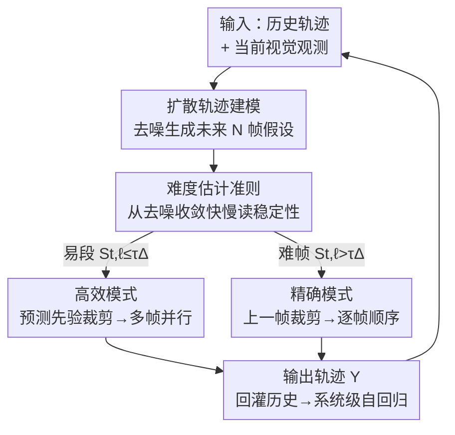

# Adaptive Capacity Autoregressive Visual Tracking

**会议**: CVPR 2026  
**论文**: [CVF Open Access](https://openaccess.thecvf.com/content/CVPR2026/html/Lin_Adaptive_Capacity_Autoregressive_Visual_Tracking_CVPR_2026_paper.html)  
**代码**: https://github.com/MIVXJTU/ARTrackAC  
**领域**: 视频理解 / 视觉目标跟踪  
**关键词**: 自回归跟踪, 自适应算力, 扩散轨迹预测, 难度感知调度, 并行推理

## 一句话总结
ARTrack-AC 把自回归跟踪从"固定算力逐帧预测"扩展成"系统级自回归"——用一个轻量扩散轨迹估计器预判未来一小段视频的稳定性，再让控制器在简单段切到低算力并行模式、在困难帧切到高算力顺序模式，从而在 LaSOT 上达到 66.7% AUC 的同时比前作快 2.9 倍。

## 研究背景与动机
**领域现状**：自回归（AR）跟踪近年成为强范式，它把跟踪建模成序列生成——每一帧的预测都依赖模型自己上一帧的输出，而不是只看当前帧。ARTrack 用历史状态顺序生成目标坐标实现时序一致性，ARTrackV2 进一步让轨迹和外观联合演化，让跟踪器既能"读出"目标在哪、又能"复述"目标长什么样。这一系列工作证明 AR 建模是鲁棒跟踪的一条有原则的路径。

**现有痛点**：但这些 AR 跟踪器都隐含一个假设——**推理算力是固定的**，即每一帧投入的计算深度和推理强度都一样。真实视频的时序难度却是高度动态的：平滑运动的稳定段几乎不需要推理，而突然运动、严重遮挡、杂乱背景则需要更强的时序建模。固定算力的跟踪器要么在简单段浪费算力，要么在突发挑战时算力不够顶不住。

**核心矛盾**：跟踪面临"精度 vs 速度"的根本权衡，而这个权衡在一条视频内部是随时间剧烈波动的。已有的启发式补丁（周期性更新模板、跳帧）忽略了底层的时序不确定性，而且很容易破坏 AR 一致性——一旦跳过的帧预测漂移，污染的历史上下文会顺着自回归链条传播下去。

**本文目标**：让跟踪器不仅在"预测目标状态"上是自回归的，还在"调节自身推理算力"上也是自回归的，把范式从"预测什么（what to predict）"推进到"怎么预测（how to predict）"。

**切入角度**：作者观察到，未来一小段轨迹的**不确定性**本身就是难度信号——如果一个轻量扩散模型对未来 N 帧轨迹的去噪很快收敛，说明运动平稳、可以省算力并行；如果迟迟不收敛，说明前方有突变、需要高算力顶上。这个信号是前瞻性的（看未来而非反应当前帧），且不依赖额外监督。

**核心 idea**：用扩散轨迹估计器预判未来稳定性，驱动一个双模式（高算力顺序 / 低算力并行）控制器，让推理成本随时序复杂度自我调节，同时保持自回归一致性。

## 方法详解

### 整体框架
ARTrack-AC 要解决的是"一条视频内算力该怎么动态分配"。它把整个跟踪过程组织成**系统级自回归**：在每个时间步 $t$，跟踪器既根据历史状态和当前观测预测下一个目标状态，又同时根据"从自己最近推理中推断出的难度"调整下一步的推理算力，两件事都条件于同一段因果历史，因此模式切换不会打破时序连贯性。

整个系统由三个协同组件构成：**精确模式**（高算力 AR 跟踪器，困难帧上逐帧顺序推理保鲁棒）、**高效模式**（低算力 AR 跟踪器，稳定段上多帧并行推理保速度）、**难度感知控制器**（轻量扩散估计器，预判下一段的难度、决定下一步用哪个模式、并为裁剪提供轨迹先验）。

流程是这样转的：控制器先用当前视觉观测 + 历史轨迹，让扩散模型生成未来 $N$ 帧的轨迹假设，并从去噪的收敛行为里读出每帧的稳定性分数；据此把未来这一小段切成"易段"和"难帧"。对于易段，用扩散预测的轨迹先验去裁剪搜索区域，从而把多帧打包成一个 batch 在高效模式里**并行**跑；对于难帧，则退回用上一帧状态裁剪、在精确模式里逐帧顺序跑。三个组件共享同一个轨迹空间，所以切换是无缝的。

### 关键设计

**1. 系统级自回归：把"算力选择"也纳入自回归链条**

痛点是传统 AR 跟踪器只对"预测什么状态"自回归，算力却是定死的，与波动的时序难度错配。本文把推理过程写成条件概率 $p(Y^t \mid Y^{t-N:t-1}, (C, Z, X^t))$，其中 $Z$ 是模板、$X^t$ 是当前搜索图、$C$ 是命令 token、$Y$ 是目标序列；关键在于精确模式、高效模式、难度控制器都在**同一个轨迹空间**里运作，因此状态预测和算力选择都条件于同一段因果历史。这样做的意义在于：模式切换不再是外挂的启发式开关（那会破坏 AR 一致性），而是和状态预测一样受历史约束的、有时序因果的决策——既对齐了训练与测试目标，又让算力随难度走时不会割裂时序连贯。

**2. 扩散轨迹建模：用多模态运动假设当前瞻难度探针**

痛点是要在事情发生**之前**就判断前方难不难，而单一回归预测会把多种可能的运动模式平均掉、在急转/突变时缺乏校准的不确定性。本文用一个条件扩散过程建模短期未来运动：给定 $N$ 帧观测窗，把视觉观测和历史轨迹段投影拼接成条件 $C_t = [\phi_v(V^t); \phi_h(H^t)]$，从高斯噪声 $x_K \sim \mathcal{N}(0, I)$ 出发反向去噪 $p_\theta(x_{k-1} \mid x_k, C_t) = \mathcal{N}(\mu_\theta(x_k, k, C_t), \sigma_k^2 I)$，每个去噪步都解码出一条未来轨迹假设 $Y_k^{t+1:t+N} = \psi(x_k, C_t)$，最终样本即短期未来轨迹。扩散之所以比回归好（消融里 56.9 vs 53.9 AUC），是因为它能捕捉多模态运动、对高频突变有响应，而不是把所有可能性糊成一条平均轨迹——这正是难度探针需要的"对突变敏感"。

**3. 难度估计准则：从去噪收敛快慢免监督地读出稳定性**

痛点是判断难度通常要么靠额外监督头、要么靠 appearance-only 的反应式信号，既贵又滞后。本文直接从扩散去噪的**收敛行为**里榨出难度，不加任何监督头。对未来第 $t+\ell$ 帧，先量相邻去噪步之间的变化 $\Delta_{t,\ell}^{(k)} = \lVert y_{t+\ell}^{(k)} - y_{t+\ell}^{(k-1)} \rVert_\infty$，再取早期窗口内的最大变化作为稳定性分数 $S_{t,\ell} = \max_{k=1,\dots,s_{thr}} \Delta_{t,\ell}^{(k)}$（$s_{thr}$ 是为效率设的小截断步数）。若 $S_{t,\ell} \le \tau_\Delta$ 则该帧判为"易"，否则为"难"；从 $t+1$ 起连续易帧的个数就定义了易段长度，段外的帧统统调度给精确模式。直觉是：去噪收敛得越慢，说明模型对前方越没把握、情况越复杂。这个 training-free 信号在消融里（66.5 AUC / 81.1% 高效占比）优于有监督的 cosine-distance 信号（65.9 / 80.7%），因为后者只反映局部轨迹质量、预判不了即将到来的挑战。

**4. 难度感知双模式调度 + 预测裁剪并行：让算力真正贴合难度**

痛点是固定周期切换（每 $n$ 帧切一次精确模式）是盲调度，当高效模式占主导时，困难段的漂移预测会污染历史上下文、拖垮自回归一致性。本文用难度感知切换（DAS）替代固定周期切换（FCS）：只在预测稳定性低时才选择性启用精确模式。配套的关键工程是**预测裁剪（Predicted Crop）**——稳定段直接用扩散预测的轨迹先验去裁剪未来若干帧的搜索区域，这样就解除了"下一帧裁剪必须等上一帧结果"的强时序依赖，把多帧打包成一个 batch 并行送进高效模式跑，充分吃满 GPU 带宽。消融显示混合裁剪 PC@5/5（全部用预测裁剪）相比 PC@0/5（全顺序）几乎不掉精度（66.7 vs 66.5 AUC）却把 GPU 速度从 134 提到 198 FPS。一个可调阈值 $\tau_\Delta$ 就能连续控制精度-速度权衡，便于在不同延迟预算下部署。

### 损失函数 / 训练策略
训练时**只优化扩散模型**，精确跟踪器（高算力）被冻结，仅用来提供视觉观测作为条件信息。总损失为：

$$L = L_{\text{MSE}} + \lambda_1 L_{\text{L1}} + \lambda_2 L_{\text{SIoU}}$$

其中 $L_{\text{MSE}}$ 是扩散去噪损失，$L_{\text{L1}}$ 和 $L_{\text{SIoU}}$ 施加几何约束，$\lambda_1, \lambda_2$ 是权重超参。扩散模型采用速度预测（velocity-prediction）形式，在 GOT-10k / TrackingNet / LaSOT 上训练 300 epoch（每 epoch 随机采样 76,800 个帧-轨迹对），AdamW 优化器、学习率 $1\times10^{-4}$、权重衰减 $1\times10^{-4}$，4 块 A6000 约 15 小时训完。扩散模型配置：观测窗口 5、嵌入维度 96、单层 transformer、4 步 DDIM 采样。

## 实验关键数据

### 主实验
精确跟踪器用 ARTrackV2 的单模板版（记为 ARTrackOT），高效跟踪器用 FARTrack 的 10 层 pico 变体。报告三个变体：`para10`（窗口 10、并行）、`para`（窗口 5、并行）、`seq`（窗口 5、顺序）。

| 数据集 | 指标 | ARTrack-ACpara | AsymTrack-B | HiT-Base |
|--------|------|------|------|------|
| LaSOT | AUC(%) | **66.7** | 64.7 | 64.6 |
| LaSOT | GPU FPS | 191 | 135 | 116 |
| TrackingNet | AUC(%) | **81.8** | 80.0 | 80.0 |
| GOT-10k | AO(%) | **72.3** | 67.7 | 64.0 |
| LaSOText | AUC(%) | **47.5** | 44.6 | 44.1 |

`para` 在保持与 `seq` 几乎同等精度（66.7 vs 66.5 AUC）的同时快 1.5 倍，191 FPS 刷新精度-速度权衡 SOTA；相比前作 ARTrackOT（65 FPS）实测约 2.9 倍加速。`para10` 在 10 FPS 低帧率的 GOT-10k 上掉点明显（AO 62.6），因为 10 帧 batch 跨越的时序间隔太大、削弱了轨迹引导裁剪的可靠性。

### 消融实验

| 配置 | LaSOT AUC | 说明 |
|------|-----------|------|
| 难度信号：fixed-cycle | 65.8 | 盲周期切换基线，高效占比 80.0% |
| 难度信号：cosine-distance（有监督） | 65.9 | 加监督加算力，只微弱提升，高效占比 80.7% |
| 难度信号：stability-signal（免训练） | **66.5** | 本文，高效占比 81.1% |
| 轨迹预测器：regression | 53.9 | 平均掉运动模式、缺校准不确定性 |
| 轨迹预测器：diffusion | **56.9** | 捕捉多模态运动，先验更可靠 |
| 扩散角色：self-conditioned（直接当输出） | 38.5 | 段间误差累积、漂移严重 |
| 扩散角色：refined-conditioned | 56.9 | 逐帧 refine 缓解漂移但仍有差距 |
| 扩散角色：作先验（ARTrack-ACpara） | **66.7** | 扩散只当轨迹先验最有效 |

### 关键发现
- **扩散应当"作先验"而非"作预测器"**：直接拿扩散轨迹当最终输出（self-conditioned）只有 38.5 AUC，段间误差会复利式累积；扩散更适合提供保证覆盖的轨迹先验、维持时序连贯，最终定位仍交给定位式跟踪器（66.7 AUC）。
- **难度信号免训练反而更强**：从扩散收敛行为读出的 stability-signal（66.5）优于有监督的 cosine-distance（65.9），因为前者预判未来波动、后者只反映局部轨迹质量。
- **增益来自"自适应协调"而非"绝对算力"**：跨跟踪器泛化实验显示，提高精确模式算力收益甚微，而降低高效模式算力仍能带来基线级提升——说明好处源于难度对齐的调度本身。
- **观测窗口是粗调旋钮**：窗口 5–6 偏精度（198 FPS / 66.7 AUC），9–10 偏速度（291 FPS / 63.5 AUC），因为大窗口放大不确定性和裁剪偏差、推高高效模式占比。

## 亮点与洞察
- **把"难度"藏在扩散去噪的收敛速度里**：不另起监督头、不加 appearance 分类器，直接用相邻去噪步的轨迹变化量当难度探针——"模型自己越纠结，说明前方越难"，这是非常巧妙的免监督前瞻信号。
- **预测裁剪解除时序依赖换来并行**：跟踪本是严格逐帧串行的，本文用扩散轨迹先验提前裁剪好稳定段的搜索区域，把串行链拆成可并行 batch，实测几乎不掉精度却大幅吃满 GPU 带宽——这个"用预测换并行度"的思路可迁移到任何带强时序依赖的序列推理任务。
- **从"预测什么"到"怎么预测"的范式抬升**：把算力调度本身纳入自回归，使其受同一段因果历史约束，避免了启发式跳帧/换模板破坏 AR 一致性的老问题，是对自回归跟踪家族的一个干净扩展。

## 局限与展望
- **低帧率 + 大窗口会失灵**：`para10` 在 10 FPS 的 GOT-10k 上掉点，作者也承认大窗口跨越时序间隔过宽时轨迹先验不再可靠；窗口大小和数据帧率强耦合，缺乏自适应窗口机制。
- **依赖一个高算力 AR 跟踪器作精确模式**：精确模式约占 20% 推理、负责纠正轨迹保一致性，整体性能上限仍受这个"骨干"约束；扩散只是调度器而非真正的定位器。
- **难度阈值 $\tau_\Delta$ 需手调**：虽然单阈值便于权衡部署，但不同数据集/场景的最优阈值未必一致，缺少在线自适应阈值的探讨。⚠️ 论文给出了阈值扫描范围（$6\times10^{-2}$ 到 $12\times10^{-2}$）但未提供自动选阈方案。
- **可改进方向**：让观测窗口随帧率/难度在线伸缩；把"作先验"的扩散与定位式精确模式更紧地耦合（如让扩散直接输出可微的裁剪框）。

## 相关工作与启发
- **vs ARTrack / ARTrackV2**：它们确立了帧间自回归的坐标/轨迹-外观联合生成，但算力固定；本文保留自回归完整性的同时，把算力选择也条件于同一因果历史，从"what to predict"推进到"how to predict"。
- **vs FARTrack**：FARTrack 走轨迹感知自蒸馏的固定低算力路线（快但欠鲁棒）；本文把它的 pico 变体直接当高效模式复用，靠难度调度在稳定段用它、困难帧切回高算力。
- **vs 早退/跳层类自适应跟踪（EAST / ABTrack / SGLATrack / ACFN）**：这些方法的控制信号大多是 appearance-driven、逐帧反应式的；本文引入运动动力学构造**前瞻性**的难度调度信号，在视频级而非帧级分配算力。
- **vs 轻量化效率跟踪（MixFormerV2 / LightTrack / AsymTrack / FEAR）**：它们靠蒸馏/NAS/非对称结构压缩单一固定算力，无法在推理时吃满 GPU 带宽；本文从推理范式角度重构效率跟踪，用多帧并行利用 GPU 带宽。

## 评分
- 新颖性: ⭐⭐⭐⭐⭐ 把算力调度纳入自回归、用扩散去噪收敛当免监督难度信号，是干净且有原则的范式创新
- 实验充分度: ⭐⭐⭐⭐ 四个标准 benchmark + 切换策略/扩散角色/难度信号/裁剪/窗口/跨跟踪器六组消融，覆盖充分；缺在线自适应阈值/窗口的分析
- 写作质量: ⭐⭐⭐⭐⭐ 动机推导清晰，"what→how"叙事统领全文，图表配合到位
- 价值: ⭐⭐⭐⭐⭐ 66.7% AUC + 2.9× 加速的精度-速度权衡 SOTA，且"预测换并行"思路可迁移到其他时序序列推理

<!-- RELATED:START -->

## 相关论文

- [\[CVPR 2026\] Drift-Resilient Temporal Priors for Visual Tracking](drift-resilient_temporal_priors_for_visual_tracking.md)
- [\[CVPR 2026\] SpikeTrack: A Spike-driven Framework for Efficient Visual Tracking](spiketrack_a_spike-driven_framework_for_efficient_visual_tracking.md)
- [\[CVPR 2026\] An Efficient Token Compression Framework for Visual Object Tracking](an_efficient_token_compression_framework_for_visual_object_tracking.md)
- [\[CVPR 2026\] Attend Before Attention: Efficient and Scalable Video Understanding via Autoregressive Gazing](autogaze_attend_before_attention_efficient_video.md)
- [\[CVPR 2026\] Dual-Agent Reinforcement Learning for Adaptive and Cost-Aware Visual-Inertial Odometry](dual-agent_reinforcement_learning_for_adaptive_and_cost-aware_visual-inertial_od.md)

<!-- RELATED:END -->
