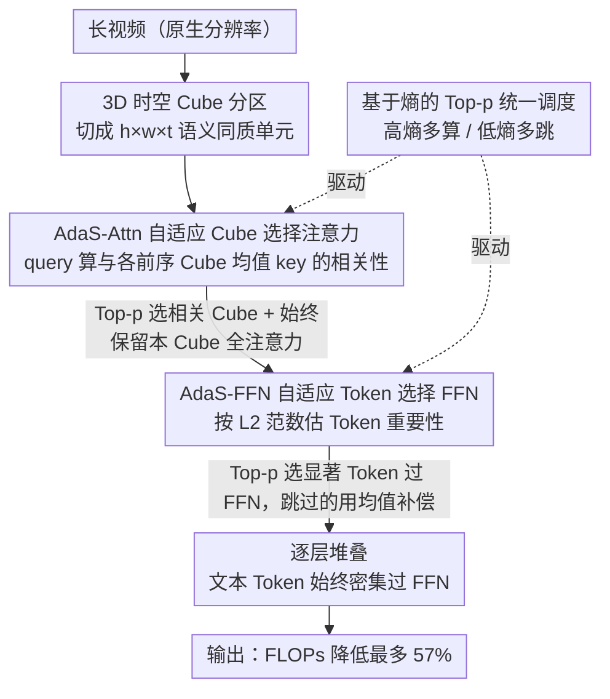

# AdaSpark: Adaptive Sparsity for Efficient Long-Video Understanding

**会议**: CVPR 2026 Highlight  
**arXiv**: [2604.08077](https://arxiv.org/abs/2604.08077)  
**代码**: 无  
**领域**: 视频理解 / 高效推理  
**关键词**: long video, adaptive sparsity, Video-LLM, efficient inference, 3D cube

## 一句话总结

提出 AdaSpark，通过 3D 时空 cube 分区和两个协同的自适应稀疏机制（cube 级注意力选择 + token 级 FFN 选择），将长视频处理 FLOPs 降低最多 57% 同时保持性能。

## 研究背景与动机

长视频可产生数十万甚至百万级 token 序列，标准 Video-LLM 的二次注意力复杂度和 FFN 激活成本使其不可行。现有效率方法存在两大缺陷：(1) 帧采样/token 剪枝等不可逆信息丢弃损害细粒度感知；(2) 局部注意力等刚性预定义模式限制长程时序建模。

预备分析发现两个关键现象：(1) 视频注意力具有高内在稀疏性，少量 token 集中了大部分注意力概率，且不同层所需 token 数差异显著；(2) FFN 层对视觉 token 表现出"计算惰性"——文本 token 经 FFN 后变换显著（高方差），而视觉 token 变化稳定。

## 方法详解

### 整体框架

AdaSpark 的出发点是两个预备观察：视频注意力天然高度稀疏（少量 token 吃掉大部分注意力概率，且不同层需要的 token 数差异很大），而 FFN 对视觉 token 又有「计算惰性」（文本 token 过 FFN 后变化剧烈、视觉 token 却很稳定）。于是它把视频 token 切成 3D 时空 cube（$h\times w\times t$），在 attention 层和 FFN 层各放一个基于熵的自适应稀疏机制，按输入复杂度动态决定算多少、跳多少。

### 关键设计

**1. 3D 时空 Cube 分区：给稀疏选择立一个语义同质的原子单元**

视频在 3D 时空里有强局部性——相邻 token 大概率相关。AdaSpark 先按 $h\times w\times t$ 的窗口，把送进 LLM 的视频 token 切成一个个 cube，并要求每个 cube 内部尽量语义同质（高语义内聚）。这一步本身不省算力，却是后面两个稀疏机制的地基：cube 成为注意力选择和 FFN 选择的最小原子单位，cube 内 token 越同质，「选哪个 cube、选哪个 token」就越准、越稳。

**2. 自适应 Cube 选择注意力（AdaS-Attn）：让每个 query 只看该看的那几个 cube**

帧采样或 token 剪枝是不可逆的信息丢弃，局部注意力等刚性模式又限制长程建模。AdaS-Attn 改成让每个 query token 先算它与所有前序 cube 的相关性（与 cube 均值 key $\bar{k}_j$ 的相似度），再用 Top-p（nucleus）选出要注意的 cube 集合：

$$P_i = \text{Softmax}([q \cdot \bar{k}_1/\sqrt{d_k}, ..., q \cdot \bar{k}_{i-1}/\sqrt{d_k}]^T),\quad \mathcal{S}_i = \{j \mid p_j \in \text{Top-p}(P_i, p)\}$$

注意力分散（高熵）就多选几个 cube、注意力集中（低熵）就只挑少量，且始终保留对自身 cube 的全注意力——稀疏度因此随内容自适应，而非一刀切固定比例。

**3. 自适应 Token 选择 FFN（AdaS-FFN）：放过「惰性」视觉 token，但用均值补偿**

既然 FFN 对多数视觉 token 几乎不改变其表示，全量过 FFN 就是浪费。AdaS-FFN 按 token 的 L2 范数估重要性，同样用 Top-p 选出真正过 FFN 的 token；被跳过的 token 不是原样不动，而是用活跃 token 的 FFN 变换均值补偿 $y_k = x_k + \bar{m}_i$，其中 $\bar{m}_i = \frac{1}{|\mathcal{M}_i|}\sum_{j \in \mathcal{M}_i} FFN(x_j)$，保住信息流。文本 token 则始终密集过 FFN，不动其指令和语义内容。

**4. 基于熵的 Top-p 选择：两个模块共用的统一调度旋钮**

AdaS-Attn 和 AdaS-FFN 都用同一套基于熵的 Top-p 选择来决定稀疏度——信息密度高时自动多分配计算、信息稀疏时大幅跳过。一个阈值 $p$ 同时控制两个模块的计算预算，既统一又便于按算力预算调档。

### 损失函数 / 训练策略

在 Qwen2.5-VL 基础上应用稀疏策略，通过少量微调适配。稀疏阈值 $p$ 统一控制两个模块的计算预算。

## 实验关键数据

### 主实验

| 基准 | AdaSpark | Dense Baseline | FLOPs 降低 |
|------|---------|---------------|-----------|
| MLVU Dev | 可比性能 | baseline | 最高 57% |
| VideoMME | 可比性能 | baseline | 最高 57% |
| VideoNIAH (超长视频) | 可比性能 | baseline | 显著 |

### 关键发现

- FLOPs 降低 57% 的同时在多个基准上保持可比性能
- Top-p 选择比固定稀疏比例更好——不同层和不同输入需要不同稀疏度
- 均值补偿对保持被跳过 token 的信息流至关重要
- cube 分区的语义同质性是稀疏选择准确性的基础
- AdaS-FFN 中被跳过的 token 通过 $y_k = x_k + \bar{m}_i$ 更新，$\bar{m}_i = \frac{1}{|\mathcal{M}_i|}\sum_{j \in \mathcal{M}_i} FFN(x_j)$
- 预备分析发现 FFN 对视觉 token 表现出"计算惰性"：L2-norm 比值方差远低于文本 token
- 在 Qwen2.5-VL 基础上应用稀疏策略，通过少量微调适配

## 亮点与洞察

- Cube-Token 两级层次化稀疏设计系统全面
- 基于熵的自适应机制优雅避免了固定稀疏比例的次优性
- 预备分析中 FFN 对视觉 token "惰性"的发现为 token 选择 FFN 提供了坚实动机
- 均值补偿策略简单但有效

## 局限与展望

- Top-p 阈值仍需手动设定
- 稀疏模式的硬件实现效率取决于底层框架支持
- 对精细粒度时序推理（如精确时间定位）的影响需更多评估
- 视频 cube 分区使用固定窗口 $h \times w \times t$，自适应分区可能进一步提升效果
- 文本 token 始终密集通过 FFN，保留其丰富的指令和语义内容
- 在 MLVU Dev、VideoMME、VideoNIAH 等基准上均保持可比性能，包括小时级超长视频

## 评分

- 新颖性：⭐⭐⭐⭐ — 统一的cube-token两级稀疏框架
- 技术深度：⭐⭐⭐⭐ — 预备分析→方法设计逻辑严密
- 实验充分度：⭐⭐⭐⭐ — 多基准验证包含超长视频
- 实用价值：⭐⭐⭐⭐⭐ — 57% FLOPs 降低实用性强

<!-- RELATED:START -->

## 相关论文

- [\[CVPR 2026\] Efficient Frame Selection for Long Video Understanding via Reinforcement Learning](efficient_frame_selection_for_long_video_understanding_via_reinforcement_learnin.md)
- [\[CVPR 2026\] Thinking with Drafts: Speculative Temporal Reasoning for Efficient Long Video Understanding](thinking_with_drafts_speculative_temporal_reasoning_for_efficient_long_video_und.md)
- [\[NeurIPS 2025\] AdaVideoRAG: Omni-Contextual Adaptive Retrieval-Augmented Efficient Long Video Understanding](../../NeurIPS2025/video_understanding/adavideorag_omnicontextual_adaptive_retrievalaugmented_effic.md)
- [\[CVPR 2026\] FluxMem: Adaptive Hierarchical Memory for Streaming Video Understanding](fluxmem_adaptive_hierarchical_memory_for_streaming_video_understanding.md)
- [\[CVPR 2026\] Video Panels for Long Video Understanding](video_panels_for_long_video_understanding.md)

<!-- RELATED:END -->
