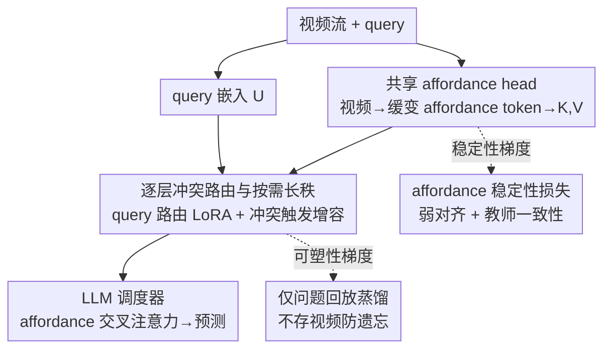

# Affordance-First Decomposition for Continual Learning in Video–Language Understanding

**会议**: CVPR 2026  
**论文**: [CVF Open Access](https://openaccess.thecvf.com/content/CVPR2026/html/xu_Affordance-First_Decomposition_for_Continual_Learning_in_Video-Language_Understanding_CVPR_2026_paper.html)  
**代码**: 无  
**领域**: 视频理解  
**关键词**: 持续学习, 视频问答, affordance, 参数高效路由, 防遗忘  

## 一句话总结
针对视频-语言持续学习中"什么该稳定、什么该可塑"边界模糊的问题，本文提出 Affordance-First Decomposition（AFD）：把视频映射成缓变的 affordance token 作为跨任务共享、稳定的"证据底座"，把可塑性集中到一个按 query 路由、按冲突长秩的 LoRA 调度器里，并用仅存储问题（不存视频）的回放蒸馏来防遗忘，在 ViLCo-Bench、domain/time-incremental VideoQA 上同时拿到更高准确率与更低遗忘。

## 研究背景与动机

**领域现状**：视频-语言理解（VideoQA、时序定位、步骤推理）正越来越多地部署在数据/领域/提问风格不断变化的非平稳流式场景里，因此持续学习成为刚需。主流做法分两类：一类用 prompt/adapter 给冻结的大模型挂可塑模块（ColPro、DAM、L2P 等），另一类用蒸馏/拓扑约束保护已学几何（防遗忘）。

**现有痛点**：这些方法存在两个反复出现的缺陷。其一，**稳定 vs 可塑的目标没被显式说清**——到底哪些结构应当跨任务不变、哪些应当随流更新，往往是含混的，稳定性更像是副产品，既难诊断也难控制。其二，**可塑性是靠拍脑袋分配的**：容量（prompt 数、LoRA rank）和路由通常固定或按任务索引死板设定，干扰只能事后用合并或全局正则去缓解，很少有方法用在线信号决定"何时、何处"该改。再加上重回放策略要存旧视频，带来存储和隐私成本。

**核心矛盾**：稳定性（保住旧技能）和可塑性（学新任务）之间的 trade-off 被隐式地塞进了同一套参数里，没有结构上的分工，导致一改就漂、一稳就僵。

**本文目标**：在现实的内存/隐私约束下，**显式指定稳定性住在哪里、可塑性聚焦在哪里**。

**切入角度**：作者的观察是——affordance（物体-动作规律，如"可抓取""可倾倒"）是一种跨领域跨任务缓慢变化的量。如果把视频先解析成 affordance 证据，这层证据天然时间对齐、可复用、稳定，可以充当一块"地基"，让上层推理在它之上做任务特化，从而把稳定性和可塑性物理隔开。

**核心 idea**：用"缓变的 affordance 底座 + 按 query 路由/按冲突长秩的可塑调度器"代替"一锅烩的 prompt/adapter + 事后稳定"，把稳定性焊在共享 head 上、把可塑性关进路由调度器里。

## 方法详解

### 整体框架
AFD 把模型拆成两半，让稳定性和可塑性各管一摊。给定视频 $V=\{F_t\}_{t=1}^T$ 和自由文本 query $q$，目标 $y$ 可以是开放答案、时间区间或步骤序列。**共享 affordance head** $h_\psi$ 把视频编码并映射成时间对齐的 affordance token，再线性投影进 LLM 隐空间作为键值 $(K,V)$；**LLM-backbone 调度器** $g_\phi^{\text{LLM}}$ 用同一个 LLM 把 query 嵌成 $U$，通过逐层路由的低秩 adapter 对 $(K,V)$ 做事件级推理：

$$f_\Theta(V,q) = g_\phi^{\text{LLM}}\big(U, K, V\big),\quad U = E_{\text{LLM}}[\text{Tok}(q)],\ (K,V)=\Pi(h_\psi(V)).$$

关键的分工是：**稳定性约束只作用在共享 head $h_\psi$ 上，任务可塑性全部被调度器 $g_\phi$ 吸收**。两块小内存只用于训练——$M_Q$ 存历史"问题"（不存视频）做回放蒸馏，$M_A$ 存 affordance 原型做诊断。训练时三项 loss 各打各的：affordance 稳定损失 $\mathcal{L}_{\text{aff}}$ 只更新 head，task 损失和 replay 损失只更新路由 adapter。

### 关键设计

**1. 共享 affordance head：把视频压成一层缓变、可复用的"证据底座"**

要解决的痛点是"稳定性该住哪里"没有答案。AFD 的回答是：让稳定性住在一个专门的 affordance 空间里。head 先用时空编码器得到逐帧特征 $X_t$，再算 affordance 分布 $P_t(a)=\text{softmax}_{a\in\mathcal{V}_A}(s_t(a)/\tau)$，其中 $s_t(a)=\langle w_a, z_t\rangle$ 是第 $t$ 帧对 affordance 类别 $a$ 的打分。为了抑噪只保留 Top-$L$ 类并重新归一化得到稀疏分布 $q_t(a)$，再用嵌入表 $E_A$ 把它变成连续 token $A_t=\sum_a q_t(a)\,E_A[a]$，最后投影成 $K_t=W_K A_t,\ V_t=W_V A_t$ 喂给 LLM。之所以有效：affordance 是物体-动作的规律，跨领域跨任务变化缓慢，把它作为下游推理的共享底座能显著降低梯度冲突——消融里去掉 affordance token、直接把帧 token 喂 LLM（变体❶）掉点最多（平均准确率 −2.9，遗忘 +1.5），印证这层底座是稳定性的核心来源。

**2. 逐层冲突路由与按需长秩：把可塑容量精准投到"真有冲突"的地方**

针对"可塑性靠拍脑袋分配"的痛点，AFD 不再固定容量或按任务索引路由，而是用在线信号决定何时何处改。在每个被 adapter 化的 LLM 层 $\ell$，路由器先用 pooled query 状态 $u$ 算混合权重 $\alpha^{(\ell)}=\text{softmax}(W_r^{(\ell)}u)$，再把多个 LoRA 专家按权重注入线性映射：$\widetilde{W}^{(\ell)}=W^{(\ell)}+\sum_{j}\alpha_j^{(\ell)}\frac{B_j^{(\ell)}A_j^{(\ell)}}{s_j^{(\ell)}}$。容量不是预设死的，而是按"冲突"动态增长：冲突用裁剪后的负余弦度量 $c_j^{(k)}=\big[-\cos(g_j^{(k)},\bar g_j^{(1:k-1)})\big]_+$（当前任务梯度与历史平均梯度方向越相反、冲突越大），rank 按超过阈值的部分离散增长且封顶 $\Delta r_j^{(k)}=\min\{r_{\max}-r_j^{(k-1)},\lfloor\gamma(c_j^{(k)}-\tau_c)_+\rfloor\}$。这样可塑性被关进路由 adapter、且只在冲突大时才扩容，既集中干扰又有界。消融显示去掉路由（❷，均匀混合）和固定 rank=8（❸）都掉点，说明实例级路由和冲突触发增容缺一不可。

**3. affordance 稳定性损失：用弱监督对齐 + 教师一致性给底座"上锁"**

光有结构分工还不够，得有 loss 真正把 affordance head 钉稳。$\mathcal{L}_{\text{aff}}$ 混合两项：一是**弱对齐**项，用 ASR 转录里出现的动词候选 $\mathcal{C}_\ell$ 当弱标签，最大化对应 affordance 类别的概率 $-\sum_\ell\log(\sum_{t\in S_\ell}\sum_{a\in\mathcal{C}_\ell}P_t(a))$（不需要逐帧人工标注，靠语音里的动词把 affordance 语义校准住）；二是**教师一致性**项，用上一任务冻结的 affordance 分布 $\bar P_t$ 做 KL 约束 $\text{KL}(\bar P_t\|P_t)$，防止新任务把底座推漂。$\beta$ 平衡两项，且该 loss 的梯度**只更新 $\psi$**。消融里分别去掉弱对齐（❺）和教师一致性（❻）都会掉点，二者共同保证底座"既学得对、又不漂"。

**4. 仅问题回放蒸馏：不存视频也能防遗忘、还省隐私**

重回放要存旧视频，带来存储和隐私成本。AFD 只在 $M_Q$ 里存"多样的历史问题"，回放时把这些旧问题配到**当前任务的视频**上做蒸馏：$\mathcal{L}_{\text{replay}}=\mathbb{E}_{q^{(u)},V}\,\text{KL}(\bar p_T(\cdot|V,q)\|p_T(\cdot|V,q))$，其中 $p_T=\text{softmax}(z/T_{\text{kd}})$ 是温度软化分布，并用置信度阈值 $\rho$ 只保留教师最大概率超过 $\rho$ 的样本以抑制噪声监督。梯度只更新调度器 $\phi$。这样无需保留任何旧视频帧，既隐私友好又省内存——去掉它（❹，$\lambda_{\text{rep}}=0$）平均准确率掉 1.4、遗忘恶化。

### 损失函数 / 训练策略
任务 $k$ 上最小化三项目标 $\mathcal{L}^{(k)}=\mathcal{L}_{\text{task}}^{(k)}+\lambda_{\text{aff}}\mathcal{L}_{\text{aff}}^{(k)}+\lambda_{\text{rep}}\mathcal{L}_{\text{replay}}^{(k)}$。其中 $\mathcal{L}_{\text{task}}$ 用统一监督支持三种 query 格式：生成式答案用逐 token 交叉熵；时间区间用起止帧分类 + $\lambda_u(1-\text{tIoU})$ 的对齐项；步骤序列用自回归交叉熵；每个样本由选择器 $\mathbb{I}_{\text{gen}}/\mathbb{I}_{\text{span}}/\mathbb{I}_{\text{step}}$ 激活恰好一个 head。关键约束是**梯度路由**：$\mathcal{L}_{\text{aff}}$ 只更新 affordance head $\psi$，$\mathcal{L}_{\text{task}}$ 与 $\mathcal{L}_{\text{replay}}$ 只更新带路由 adapter 与长秩的调度器 $\phi$，从而在优化层面也落实了"稳定/可塑"的物理隔离。

## 实验关键数据

### 主实验

Domain-Incremental VideoQA（6 数据集顺序训练，top-1 准确率 %）：

| 方法 | Avg.↑ | Forget↓ |
|------|-------|---------|
| Seq-FT | 39.8 | – |
| ColPro | 45.5 | −3.9 |
| Bisecle | 49.4 | −2.7 |
| DAM（前 SOTA） | 50.2 | −2.3 |
| **AFD（本文）** | **51.6** | **−1.8** |

ViLCo-Bench（Ego4D，query-incremental）：

| 方法 | MQ R@1@0.5↑ | NLQ R@1@0.5↑ | VQ stAP@0.25↑ |
|------|-------------|--------------|---------------|
| ViLCo | 21.2 | 12.6 | 13.4 |
| DAM | 27.1 | 16.9 | 16.5 |
| Bisecle | 26.8 | 18.2 | 16.1 |
| **AFD（本文）** | **29.6** | **20.7** | **18.4** |

AFD 在三种 query 上分别比最强基线 +2.5 R@1（MQ）、+2.5 R@1（NLQ）、+1.9 stAP（VQ）。Time-incremental iVQA（4 时间切片）上 AFD 拿到 39.5% 平均准确率、−1.6 遗忘，比 DAM +1.4、比 Bisecle +1.9，且 S1–S4 逐切片都更好。非持续设置下，复杂推理（CVQA EM 62.8、11-VideoQA 67.4）与长视频压力测试（VideoMME 61.7、MLVU 57.9）也略胜专用系统。

### 消融实验

| 配置 | Domain Avg.↑ | Forget↓ | 说明 |
|------|--------------|---------|------|
| Full AFD | 51.6 | −1.8 | 完整模型 |
| ❶ w/o affordance token | 48.7 (−2.9) | −3.3 (+1.5) | 直接喂帧 token，掉点最多 |
| ❷ w/o router（均匀混合） | 49.8 (−1.8) | −2.6 (+0.8) | 去实例级路由 |
| ❸ 固定 LoRA rank=8 | 50.5 (−1.1) | −2.3 (+0.5) | 去冲突触发增容 |
| ❹ w/o 仅问题回放 | 50.2 (−1.4) | −2.8 (+1.0) | $\lambda_{\text{rep}}=0$ |

### 关键发现
- **affordance 底座贡献最大**：去掉它（❶）平均掉 2.9 分、遗忘恶化 1.5，是全模型里最关键的稳定性来源，直接验证"稳定性住在 affordance 空间"这一核心假设。
- **路由与长秩互补**：去掉实例级路由（❷）或固定 rank（❸）都掉点，说明"在哪改"（query 路由）和"改多少"（冲突触发增容）是两个独立有效的杠杆。
- **底座是真稳的**：原型漂移（相邻任务原型的余弦距离）小且分布集中，相邻任务 CKA 高；动词/动作覆盖随 Top-$L$ 单调上升并在 $L\approx8$ 饱和，给"稀疏 Top-$L$"的取值提供了依据。

## 亮点与洞察
- **用 affordance 当"稳定性锚点"很巧**：affordance 这种物体-动作规律天然跨任务缓变，把它显式抽出来当共享底座，相当于给"什么该稳定"找到了一个有语义、可诊断的载体，而不是靠隐式正则去碰运气。
- **冲突触发的离散长秩**：用当前梯度与历史平均梯度的负余弦量化冲突、只在冲突超阈值时按比例扩 rank，把"何时扩容"做成了在线、有界、可解释的决策，值得迁移到其他参数高效持续学习任务。
- **仅存问题的回放**：把回放对象从"视频"换成"问题 + 当前视频"，在隐私/存储敏感场景下是一个很实用的 trick，可直接迁移到任何 VLM 持续学习管线。

## 局限与展望
- affordance 词表 $\mathcal{V}_A$ 与弱对齐依赖 ASR 转录里的动词候选，对**没有语音/语音质量差**的视频，弱对齐项可能失效，affordance 校准会打折扣（⚠️ 原文未充分讨论这一边界）。
- 冲突阈值 $\tau_c$、增益 $\gamma$、$\beta$、$\rho$ 等超参较多，跨数据集是否稳健、敏感性如何，正文给的分析有限。
- 仅问题回放假设"旧问题 + 新视频"能近似覆盖旧分布；当新旧视频域差异极大时，这种跨视频蒸馏的有效性存疑，值得进一步验证。

## 相关工作与启发
- **vs ColPro / DAM**：它们都靠 prompt/adapter 给冻结骨干挂可塑模块（ColPro 注入协作 prompt，DAM 在推理时按数据集合并 adapter），但稳定结构是隐式的、容量是固定的；AFD 把稳定性显式焊在 affordance head、把可塑性做成按冲突动态长秩，因而遗忘更低（−1.8 vs DAM −2.3）。
- **vs Bisecle**：Bisecle 用 binding+separation 隐式减干扰；AFD 直接在结构上把稳定底座和可塑调度器隔开，并用梯度路由保证两者互不污染，可解释性更强。
- **vs 几何保持类 CL（拓扑/相似度对齐）**：那类方法在参数空间约束几何来防遗忘，但仍模糊了"共享什么、可塑放哪"；AFD 给出一个缓变、可复用的 affordance 底座作为明确的共享层。

## 评分
- 新颖性: ⭐⭐⭐⭐ 把 affordance 作为持续学习的稳定锚点 + 冲突触发长秩，是有辨识度的结构化分工。
- 实验充分度: ⭐⭐⭐⭐ 覆盖 domain/time/query 三种增量协议 + 复杂推理/长视频，消融到位；超参敏感性分析略弱。
- 写作质量: ⭐⭐⭐⭐ 稳定/可塑的分工讲得清楚，公式完整；部分模块（rank 初始化）甩给补充材料。
- 价值: ⭐⭐⭐⭐ 仅问题回放 + 冲突触发长秩两个 trick 实用且可迁移，对隐私敏感的视频 CL 场景有参考价值。

<!-- RELATED:START -->

## 相关论文

- [\[ICCV 2025\] RainbowPrompt: Diversity-Enhanced Prompt-Evolving for Continual Learning](../../ICCV2025/video_understanding/rainbowprompt_diversity-enhanced_prompt-evolving_for_continual_learning.md)
- [\[CVPR 2026\] SkillSight: Efficient First-Person Skill Assessment with Gaze](skillsight_efficient_first-person_skill_assessment_with_gaze.md)
- [\[CVPR 2026\] Efficient Frame Selection for Long Video Understanding via Reinforcement Learning](efficient_frame_selection_for_long_video_understanding_via_reinforcement_learnin.md)
- [\[CVPR 2026\] EthoCLIP: Ontology-Enhanced Video-Language Pretraining for Animal Behavior Understanding](ethoclip_ontology-enhanced_video-language_pretraining_for_animal_behavior_unders.md)
- [\[CVPR 2026\] Video Panels for Long Video Understanding](video_panels_for_long_video_understanding.md)

<!-- RELATED:END -->
