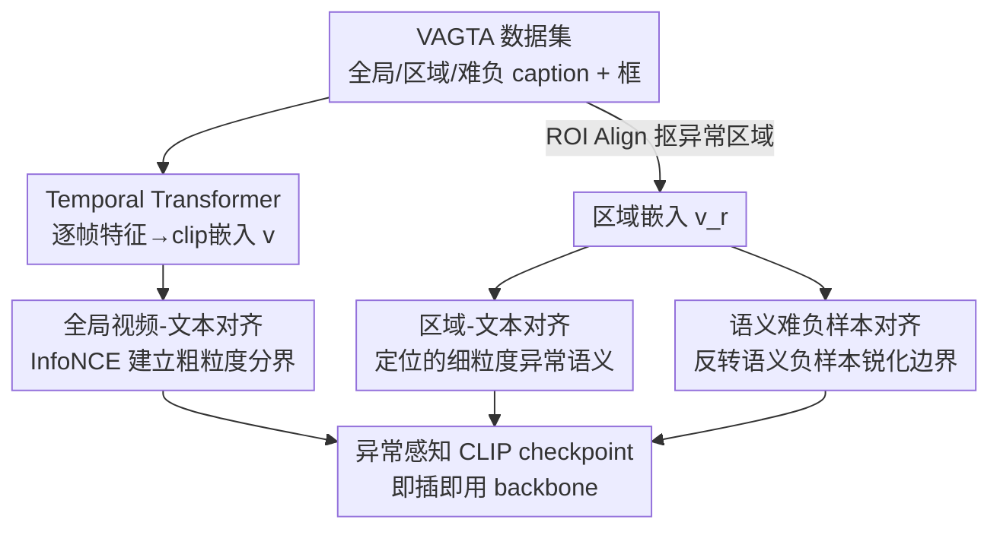

# Alert-CLIP: Abnormality-aware Latent-Enhanced Representation Tuning of CLIP for Video Anomaly Detection

**会议**: CVPR 2026  
**论文**: [CVF Open Access](https://openaccess.thecvf.com/content/CVPR2026/html/Zhu_Alert-CLIP_Abnormality-aware_Latent-Enhanced_Representation_Tuning_of_CLIP_for_Video_Anomaly_CVPR_2026_paper.html)  
**代码**: https://github.com/ClarkZhu216/Alert-CLIP_dataset （数据集 VAGTA，有）  
**领域**: 视频理解 / 多模态VLM  
**关键词**: 视频异常检测, CLIP微调, 跨模态对齐, 难负样本, 异常感知

## 一句话总结
针对 CLIP 在文本空间里把"正常"和"异常"描述高度纠缠、导致视频对两类 prompt 给出几乎一样相似度的问题，本文用全局/区域/难负样本三级跨模态对比训练（配套自建的带框标注数据集 VAGTA）重塑 CLIP 的嵌入几何，让它成为异常感知更强的 backbone，在弱监督、零样本、开放词表三种 VAD 设定下都稳定超过原始 CLIP。

## 研究背景与动机

**领域现状**：视频异常检测（VAD）的目标是自动识别偏离正常模式的事件。由于异常样本极其稀缺，主流做法是半监督（只学正常模式）或弱监督（用视频级标签 + 多示例学习 MIL）。近两年随着 CLIP 这类视觉-语言模型崛起，用文本嵌入给视觉建模提供语义引导（VadCLIP、AnomalyCLIP、STPrompt、OVVAD 等）成为新趋势。

**现有痛点**：这些 CLIP-based 方法几乎都**冻结 CLIP backbone**，只在抽出来的特征上加任务模块。问题是它们继承了 CLIP 本身"异常感知薄弱"的表征——本文通过文本空间探针和视频-文本相似度实验给出了直接证据：CLIP 对同一段异常视频，配正常 prompt 和配异常 prompt 算出来的余弦相似度差距极小（图 1 里 Δ < 0.16、甚至 < 0.04），有时还更偏向错误的正常描述。

**核心矛盾**：异常的本质是"对常态的偏离"，而不是一个独立的语义类别或物体属性，识别它需要**理解上下文语义和细粒度变化**。但 CLIP 的预训练是把整张图和粗粒度 prompt（"a photo of [category]"）做对比对齐，天生不擅长捕捉上下文与局部细节，于是在文本空间里正常/异常描述高度纠缠（图 2 显示 Normal 与多个异常描述余弦相似度都在 0.7 上下）。这个纠缠会一路传导到视频-文本对齐，最终在真实视频上判别不可靠。

**量化诊断（MeanSignScore, MSS）**：为把这种纠缠量化，作者定义了一个诊断指标 MSS。设正常/异常 prompt 集合为 $P_N$、$P_A$，视频 $x$ 对两组 prompt 的平均相似度为 $S_N(x)$、$S_A(x)$；样本的带符号分数定义为 $SS(x)=S_A(x)-S_N(x)$（若 $x$ 异常）或 $S_N(x)-S_A(x)$（若 $x$ 正常），MSS 即对全数据集取平均 $\text{MSS}=\frac{1}{|D|}\sum_x SS(x)$。MSS 越大说明模型越稳定地偏向语义正确的那组 prompt，接近 0 说明几乎无区分力，负值则说明经常选错方向。表 1 里 CLIP/LongCLIP/SigLIP/BLIP 的 MSS **全为负**（CLIP 平均 -0.0564），定量坐实了上述纠缠。

**本文目标 / 核心 idea**：与其在冻结特征上打补丁，不如直接对 CLIP 做"异常感知导向"的表征调优——在保留 CLIP 语义先验的前提下，用三个互补的对齐信号（全局场景语义、空间定位的异常语义、细粒度语义对比）逐级重塑其决策几何，把正常/异常在嵌入空间拉开。调优后的 checkpoint 与标准 CLIP 推理完全兼容，可直接当 backbone 即插即用，且测试时**不需要任何定位标注**。

## 方法详解

### 整体框架
Alert-CLIP 保持 CLIP 的视觉编码器和文本编码器结构不变，在其上加一个轻量 **temporal transformer**：把 $T$ 帧的逐帧视觉特征聚合成一个 $\ell_2$ 归一化的 clip 级嵌入 $v\in\mathbb{R}^D$。对带框标注的异常区域，先用 **ROI Align** 从帧级特征里抠出区域特征，再用同一个 temporal transformer 聚合成区域嵌入 $v_r$。整个训练就是用三个互补的对比信号去重塑这个共享空间的几何：全局视频描述、绑定标注框的区域描述、以及语义相近但反转正常/异常含义的难负样本。这一切都建立在自建数据集 **VAGTA**（带全局 caption、区域 caption、难负 caption 和 bounding box）之上。训练采用**两阶段**课程：先只做全局对齐建立稳定的正常/异常分界，再联合三路注入细粒度线索。

### 关键设计

**1. VAGTA：带框标注 + 多级 caption 的异常数据集**

三级对齐训练需要的是"全局描述 + 区域定位 + 语义负样本"三套监督，而现有 VAD 数据集质量参差、且几乎没有区域级标注，所以作者重新标注 UCF-Crime 和 MSAD 构建了 VAGTA。流程分三步：① 用 ChatGPT 初筛 + 人工复核（看标签一致性、异常清晰度、重复、损坏帧），剔除四类低质异常视频（类别不符、异常语义弱、内容重复、信号严重损坏），并给每段配一个全局 caption（粗粒度，喂给 video-label 级）；② 给异常区域标精确 bounding box 并写区域级 caption 描述事件（喂给 region-text 级）；对正常 clip，把整段当作单一区域配一个与全局不同的区域 caption；长的正常视频再切成三段语义连贯的子 clip，各自继承正常标签并独立标注；③ 用 Qwen-VL 给每条区域 caption 生成 **3 条难负 caption**——视觉上仍然相似但把正常/异常语义反转（喂给 region-semantic 级）。最终得到 4,212 段高质量 clip（训练 3,726：2,585 正常 + 1,141 异常；测试 486），严格沿用官方 split 避免泄漏。数据集质量直接决定了后面三级对齐能不能学到东西，这是整套方法的地基。

**2. 全局视频-文本对齐：建立粗粒度正常/异常分界**

针对"CLIP 文本空间里正常/异常纠缠"这个最根本的痛点，第一级用全局描述把语义空间先拉开。给一个 batch 的 $B$ 个视频及其全局描述 $\{(v_i,t_i)\}$，算相似度 $s_{ij}=\langle v_i,t_j\rangle$，优化 InfoNCE：

$$\mathcal{L}_{\text{global}}=-\frac{1}{B}\sum_{i=1}^{B}\log\frac{\exp(s_{ii}/\tau)}{\sum_{j=1}^{B}\exp(s_{ij}/\tau)}$$

其中 $\tau$ 为温度。这一步在描述层面建立起正常与异常的全局语义分离，是后续细粒度对齐的稳定基底。实验显示光这一级（Stage 1）就能把 MSS 从负翻正（UCF-Crime 0.1733），并在弱监督 AUC 上超过冻结 CLIP，说明粗粒度语言监督已经足够建立更清晰的分界。

**3. 区域-文本对齐：注入空间定位的细粒度异常语义**

全局对齐只能给整段视频一个粗语义，无法把"画面里哪块在出事"和文字对上。第二级用标注框抠出的区域特征 $v_r^n$ 与对应区域描述 $t_r^n$ 组成 $R$ 对正样本，优化区域级 InfoNCE：

$$\mathcal{L}_{\text{region}}=-\frac{1}{R}\sum_{n=1}^{R}\log\frac{\exp(s_{nn}^{r}/\tau)}{\sum_{m=1}^{R}\exp(s_{nm}^{r}/\tau)}$$

$s_{nm}^{r}=\langle v_r^n,t_r^m\rangle$。它把空间上定位的、细粒度的异常语义注入共享空间，让局部视觉变化和上下文语义建立精确对应。注意这些框和区域文本**只在训练时当监督用**，推理时完全不需要。

**4. 语义难负样本对齐：锐化正常-异常决策边界**

区域对齐解决了"视觉区域↔描述"的匹配，但当正常和异常画面**视觉上很像、语义却相反**时（比如"小心倒车入位" vs "撞上多辆车"），边界仍然模糊。第三级专门用难负样本锐化这条边界：每个区域的真值描述 $t_n^{r,+}$ 配上 $K$ 条视觉相似但语义反转的难负 caption $\{t_{n,k}^{r,-}\}$，令 $s_n^{+}=\langle v_r^n,t_n^{r,+}\rangle$、$s_{n,k}^{-}=\langle v_r^n,t_{n,k}^{r,-}\rangle$，优化：

$$\mathcal{L}_{\text{hard}}=-\frac{1}{R}\sum_{n=1}^{R}\log\frac{\exp(s_n^{+}/\tau_h)}{\exp(s_n^{+}/\tau_h)+\sum_{k=1}^{K}\exp(s_{n,k}^{-}/\tau_h)}$$

$\tau_h$ 控制语义判别强度。和普通 in-batch 负样本相比，难负样本逼着模型去分辨"看起来像、意思反着"的混淆对，因此在正常/异常视觉相似时鲁棒性更好——消融（表 8）显示零样本下难负样本相比标准负样本能多涨 3~9 个点 AUC/AP。

### 损失函数 / 训练策略
采用两阶段课程。**Stage I（全局预对齐）**：只优化 $\mathcal{L}_{\text{global}}$，先把正常/异常在描述层面的分界打稳。**Stage II（联合精调）**：从 Stage I 权重出发，联合优化

$$\mathcal{L}_{\text{total}}=\mathcal{L}_{\text{global}}+\lambda\,\mathcal{L}_{\text{region}}+\gamma\,\mathcal{L}_{\text{hard}}$$

$\lambda$、$\gamma$ 平衡区域和难负两路。先稳住全局语义空间、再引入细粒度目标，能让优化更容易、泛化更好（表 6 显示两阶段 89.32 vs 一开始就三路联合 88.61）。Backbone 用 OpenCLIP ViT-L/32，AdamW + cosine decay + 混合精度 + 梯度裁剪，单卡 A800（80GB）。

## 实验关键数据

### 主实验
弱监督设定下，把 VadCLIP 框架里的特征 backbone 换成不同提取器（同设定公平对比）：

| 数据集 | 指标 | CLIP | Alert-CLIP(Stage1) | Alert-CLIP(Full) |
|--------|------|------|--------------------|------------------|
| UCF-Crime | AUC | 88.02 | 88.67 | **89.32** |
| UCF-Crime | AP | 32.72 | 32.16 | **33.57** |
| MSAD | AUC | 87.45 | 88.59 | **89.63** |
| MSAD | AP | 71.09 | 75.10 | **78.24** |

零样本设定（异常分数直接由正常/异常 prompt 的相似度 margin 得到，不做任何训练）：

| Backbone | UCF-AUC | XD-AP | UB-AUC | UB-AP |
|----------|---------|-------|--------|-------|
| CLIP | 61.91 | 34.35 | 72.08 | 57.43 |
| VideoCLIP | 72.13 | 54.36 | 72.34 | 55.07 |
| LLaVA-1.5-7B | 72.84 | 50.26 | – | – |
| Alert-CLIP(Full) | **75.75** | **55.18** | **75.39** | **60.11** |

开放词表设定 Alert-CLIP 在 UCF-Crime 上 AP 70.12 / Novel-AP 84.92，超过 OVVAD(66.53/76.03)；在**训练完全未见**的 XD-Violence 上 Overall 91.83 / Novel 96.01，超过 CLIP(90.01/94.23)，说明学到的是更可迁移的异常表征。

### 消融实验
| 配置 | 启用损失 | UCF AUC | 说明 |
|------|---------|---------|------|
| CLIP baseline | – | 88.02 | 冻结 CLIP |
| Global only | $\mathcal{L}_{\text{global}}$ | 88.53 | 仅粗粒度语言监督 |
| Global+Region | $+\mathcal{L}_{\text{region}}$ | 88.85 | 加空间定位监督 |
| Global+Region+Hard | $+\mathcal{L}_{\text{hard}}$ | **89.32** | 完整模型 |
| 一阶段联合训练 | 三路从头一起练 | 88.61 | 比两阶段差 |

### 关键发现
- **三路逐级累加都有正贡献**：global 把 baseline 88.02 抬到 88.53，加 region 到 88.85，再加 hard 到 89.32，证明三个信号互补而非冗余。
- **难负样本是零样本涨点主力**：表 8 里零样本 UCF AUC 从标准负样本 72.71 提到 75.75、XD-AP 从 46.44 提到 55.18，证实"视觉像、语义反"的负样本对锐化边界最有效。
- **两阶段优于一阶段联合**：先稳全局再注入细粒度（89.32）比一开始三路混练（88.61）更好，验证了课程式优化的价值。
- **不牺牲通用能力**：表 9 显示 Alert-CLIP 在 ImageNet/Flickr30k/COCO 检索等通用基准上不降反升（Flickr30k I2T R@1 +7.70、COCO T2I R@1 +11.10），说明多级对齐反而帮模型抓到更细的语义线索，VAD 调优没有损害 CLIP 的原始迁移性。

## 亮点与洞察
- **把"CLIP 不懂异常"诊断成可度量问题**：MSS 用一个带符号的相似度差把"正常/异常纠缠"从定性观察变成全数据集的标量指标（CLIP 全为负、Alert-CLIP 翻正），这种"先证明病、再开药"的叙事很有说服力，指标本身也可复用到任何想检查"语义方向是否正确"的对比模型上。
- **异常 = 对常态的偏离，而非一个类别**：作者抓住的核心 insight 是异常需要上下文理解，所以单纯延长 token 或加 grounding 数据都不够，必须显式构造"语义反转的难负样本"去逼边界——这条思路可迁移到任何"细微语义差别决定标签"的任务（如细粒度情感、合规检测）。
- **训练时用定位、推理时不用**：区域框和区域文本只是训练监督，产出的 checkpoint 与标准 CLIP 推理完全兼容、可即插即用替换现有 VAD pipeline 的 backbone，落地成本低。

## 局限与展望
- **重度依赖人工 + LLM 标注**：VAGTA 的区域框、区域 caption、难负 caption 分别来自人工标注和 Qwen-VL/ChatGPT，标注质量直接决定上限；难负 caption 由 LLM 生成，其"视觉相似但语义反转"是否总成立未给量化校验，⚠️ 这部分质量以原文与开源数据为准。
- **规模偏小**：仅 4,212 段 clip、源自两个数据集，异常类别覆盖和场景多样性有限，开放词表泛化主要靠 XD-Violence 一个未见集佐证。
- **绝对提升不算大**：弱监督 AUC 相比冻结 CLIP 提升约 1.3 个点（88.02→89.32），更亮眼的收益集中在零样本/开放词表和检索类通用基准上；$\lambda$、$\gamma$、$\tau_h$ 等超参敏感性放在了补充材料，正文未展开。
- 可改进：把难负样本生成做成在线、随训练动态挖掘更难的混淆对；或将三级对齐扩展到时序维度（目前 temporal transformer 只做聚合，未显式建模异常的时序演化）。

## 相关工作与启发
- **vs VadCLIP / AnomalyCLIP**：它们是早期把 CLIP 引入 VAD 的尝试，但**冻结 backbone**、在抽出的特征上做双分支分类 + 视觉-语言对齐；本文指出它们继承了 CLIP 的弱异常感知，转而直接调优表征本身，并把 Alert-CLIP 当 backbone 塞回 VadCLIP 框架就能涨点。
- **vs STPrompt / Ex-VAD / VarCMP**：这些工作通过加时空 prompt、LLM 异常解释、音频线索等"额外线索"来增强 CLIP-based VAD；本文不加新模态，而是从"重塑嵌入几何"这个更底层的角度解决异常感知问题。
- **vs LongCLIP / 加 grounding 数据的细粒度增强**：它们靠延长 token 或引入 grounding 数据提升对物体属性的细粒度感知，但异常不是常规语义类别/属性，所以这些方法在 VAD 上的 MSS 仍为负；本文用难负样本显式针对"偏离常态"建模，填上了这个 gap。
- **vs OVVAD / Anomize（开放词表 VAD）**：在 UCF-Crime/XD-Violence 开放词表设定下，Alert-CLIP 在多数指标上与之持平或更优，且在完全未见的 XD-Violence 上优势明显，说明学到的是可迁移异常表征而非记住已见概念。

## 评分
- 新颖性: ⭐⭐⭐⭐ 把"CLIP 弱异常感知"诊断成可度量问题（MSS）并用三级对齐针对性重塑表征，视角清晰
- 实验充分度: ⭐⭐⭐⭐ 覆盖弱监督/零样本/开放词表三设定 + 多消融 + 通用基准不退化，较扎实
- 写作质量: ⭐⭐⭐⭐ "先证病再开药"叙事顺，公式与图表对应清楚
- 价值: ⭐⭐⭐⭐ 产出即插即用 backbone + 开源带框标注数据集 VAGTA，对 CLIP-based VAD 社区实用

<!-- RELATED:START -->

## 相关论文

- [\[ICLR 2026\] Steering and Rectifying Latent Representation Manifolds in Frozen Multi-Modal LLMs for Video Anomaly Detection](../../ICLR2026/video_understanding/steering_and_rectifying_latent_representation_manifolds_in_frozen_multi-modal_ll.md)
- [\[CVPR 2026\] No Need For Real Anomaly: MLLM Empowered Zero-Shot Video Anomaly Detection](no_need_for_real_anomaly_mllm_empowered_zero-shot_video_anomaly_detection.md)
- [\[CVPR 2026\] Decompose and Transfer: CoT-Prompting Enhanced Alignment for Open-Vocabulary Temporal Action Detection](decompose_and_transfer_cot-prompting_enhanced_alignment_for_open-vocabulary_temp.md)
- [\[AAAI 2026\] HeadHunt-VAD: Hunting Robust Anomaly-Sensitive Heads in MLLM for Tuning-Free Video Anomaly Detection](../../AAAI2026/video_understanding/headhunt-vad_hunting_robust_anomaly-sensitive_heads_in_mllm_.md)
- [\[ICML 2026\] Privacy-Aware Video Anomaly Detection through Orthogonal Subspace Projection](../../ICML2026/video_understanding/privacy-aware_video_anomaly_detection_through_orthogonal_subspace_projection.md)

<!-- RELATED:END -->
