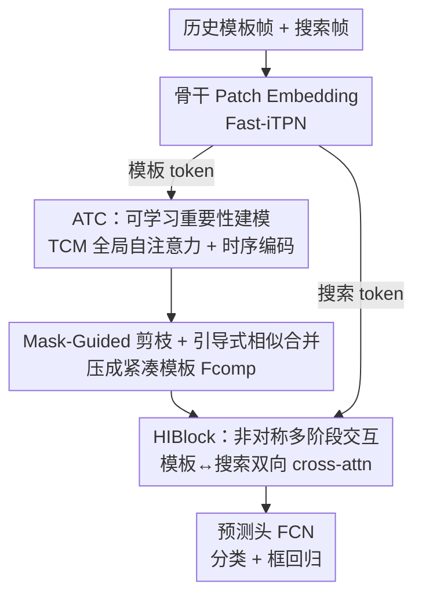

# An Efficient Token Compression Framework for Visual Object Tracking

**会议**: CVPR 2026  
**论文**: [CVF Open Access](https://openaccess.thecvf.com/content/CVPR2026/html/Wu_An_Efficient_Token_Compression_Framework_for_Visual_Object_Tracking_CVPR_2026_paper.html)  
**代码**: https://github.com/PJD-WJ/ETCTrack  
**领域**: 视频理解  
**关键词**: 视觉目标跟踪, Token压缩, 多帧模板, 时空冗余, 注意力交互  

## 一句话总结
针对多帧模板跟踪中视觉 token 爆炸又冗余的问题，ETCTrack 用一个可学习的自适应 token 压缩器（ATC）先把历史模板帧压成精炼子集、再用层级交互块（HIBlock）与搜索区域深度交互，在 7 个跟踪基准上同时刷新精度并降低计算量（模板 token 减 60%、MACs 减 21.4%，精度仅掉 0.4%）。

## 研究背景与动机
**领域现状**：现代基于 Transformer 的跟踪器为了应对目标外观剧变、长时跟踪，普遍走「多帧模板」路线——把多张历史模板帧一起喂进网络，用更丰富的时空线索构建更稳健的目标表征（ODTrack、HIPTrack 等）。

**现有痛点**：多帧带来的直接后果是输入视觉 token 数量暴涨。Transformer 自注意力对 token 数是二次复杂度，token 一多计算量飙升；更糟的是，作者的预实验（OSTrack + 新 backbone）发现，模板帧数加到 5 帧之后精度不升反降——多出来的帧引入了大量**视觉冗余**，反而污染了目标表征。也就是说，「加帧」既贵又可能伤性能。

**核心矛盾**：多帧模板里「信息量」和「冗余/计算代价」是耦合在一起的。已有的 token 压缩做法多是**手工规则**（按注意力图打分、固定空间规则保留中心 token 等），这些非可学习准则未必和最终的跟踪目标对齐，有丢掉关键判别性 token 的风险。

**本文目标**：在多帧模板跟踪中，用一种可学习、端到端的方式消除视觉冗余，**同时**降低计算量并提升精度，而不是在二者间二选一。

**切入角度**：作者借鉴多模态大模型（MLLM）处理长视频时「压缩视觉 token 是平衡能力与算力的根本手段」这一思路，认为它同样适用于多帧跟踪——关键是让压缩器由最终跟踪损失直接监督，学会判断每个 token 的上下文重要性，而非套预定义规则。

**核心 idea**：提出「先压缩、再交互」（compress-then-interact）框架——先用可学习模块把历史模板 token 压成紧凑且判别性强的子集，再让这个精炼模板与搜索特征做层级化深度交互。

## 方法详解

### 整体框架
ETCTrack 接收若干历史模板帧 $Z \in \mathbb{R}^{T\times 3\times H_z\times W_z}$ 和当前搜索帧 $X$，先经骨干网络（Fast-iTPN）做 patch embedding 得到模板 token $F_z\in\mathbb{R}^{N_z\times C}$ 和搜索 token $F_x\in\mathbb{R}^{N_x\times C}$。整条管线分两步走：**（1）压缩**——模板 token 单独送进 Adaptive Token Compressor（ATC），动态过滤冗余 token，构造紧凑模板表征 $F_{comp}$；**（2）交互**——把 $F_{comp}$ 与搜索 token 一起送进由多个 HIBlock 堆叠成的 Hierarchical Interaction Encoder，做非对称、多阶段的特征交互，最后增强后的搜索特征进预测头估计目标框。骨干选 Fast-iTPN 是因为跟踪这类细粒度任务需要多尺度层级特征，而标准 plain ViT 只产单尺度特征，定位不同大小目标时偏弱。

### 关键设计

**1. Adaptive Token Compressor（ATC）：用可学习的全局注意力替代手工规则评估 token 重要性**

ATC 是消除视觉冗余的核心。输入模板特征 $F_z\in\mathbb{R}^{(T\cdot L)\times C}$ 先 reshape 回显式时空结构 $Z_p\in\mathbb{R}^{T\times L\times C}$（$T$ 帧、每帧 $L$ 个 token），加上一个**可学习的时序位置编码** $E_{temp}\in\mathbb{R}^{T\times 1\times C}$ 来区分不同帧的 token，再展平成 $Z_{temp}$。接着送进 Token Correlation Module（TCM）——由 $N_{atc}$ 层自注意力堆叠而成，通过全局自注意力让所有模板 token 充分交互，建模跨帧的时空相关性，从而识别出最具判别性的部分：

$$Z_{context} = \mathrm{TCM}(Z_{temp}) \in \mathbb{R}^{(T\cdot L)\times C}$$

它的关键不在于网络多大，而在于「由最终跟踪目标直接监督地学」token 该留该弃——这正是它优于基于注意力图/空间规则的手工压缩之处：手工准则和跟踪目标未必对齐，容易误删关键 token。消融里 TCM 用 Fast-iTPN 前 8 层即可（无需额外参数），精度/速度都优于从头训的 ViT-B 和 8 层 Transformer，说明「精简且贴合任务」比「单纯堆大」更重要。

**2. Mask-Guided 剪枝 + 引导式相似合并：剪掉冗余的同时不丢语义**

拿到 $Z_{context}$ 后，要真正把 token 数量降下来。作者用一个**固定随机投影**生成 token 重要性分数 $S$（一个随机化的 token 选择机制，逼模型学会基于相似度的高效合并），按 $S$ 降序把 token 划成「保留目标集」$A=\{a_j\}_{j=1}^{K_{target}}$（高分）和「冗余源集」$B=\{b_i\}_{i=1}^{K_{merge}}$（低分）。保留多少由 keep rate $r\in(0,1)$ 决定：

$$K_{target} = \lfloor r\cdot(T\cdot L)\rfloor,\quad K_{merge} = (T\cdot L) - K_{target}$$

为避免直接丢弃 $B$ 造成语义丢失，作者不是「剪掉就算」，而是用**引导式相似合并**——每个源 token $b_i$ 按贪心余弦相似度被吸收进与它最相似的目标 token $a_j$：

$$a'_j = a_j + \sum_{i\in\Omega_j} b_i,\quad \Omega_j = \Big\{ i \mid j = \arg\max_k \frac{b_i\cdot a_k}{\|b_i\|_2\|a_k\|_2} \Big\}$$

最终得到压缩后的特征集 $F_{comp}=\{a'_j\}_{j=1}^{K_{target}}$，既消冗余又保留了被剪 token 的语义信息，是一个高效、上下文感知的模板表征。⚠️ 关于压缩比例：消融表里 $r=0.9$（保留 90%）取得最佳精度（LaSOT +0.5），而摘要宣称「模板 token 减 60%、精度仅掉 0.4%」对应的是更激进的设置，二者口径不同，以原文为准。

**3. Hierarchical Interaction Block（HIBlock）：模板与搜索的非对称、多阶段双向交互**

压完模板还要让它和搜索区域充分交互。已有 one-stream 跟踪器靠联合自注意力做隐式相关，作者认为这不够「显式」，于是设计 HIBlock 做结构化的多阶段交互。给定压缩模板 $F_{comp}\in\mathbb{R}^{K\times C}$ 和搜索 token $F_x\in\mathbb{R}^{N_x\times C}$，单个 block 的流程是：先让模板感知当前搜索上下文（模板做 Q、搜索做 K/V 的 cross-attention）；再把更新后的模板与搜索拼接，过 $M$ 个标准骨干 block 做联合深度建模，输出再拆回模板/搜索；然后反过来让搜索去 query 深编码后的模板，显式引导搜索过程；最后过一个卷积前馈网络（ConvFFN）精炼：

$$F'_{comp} = F_{comp} + \mathrm{CrossAttention}(F_{comp}, F_x, F_x)$$
$$F_{block} = \mathrm{BackboneBlocks}(\mathrm{Concat}(F'_{comp}, F_x))$$
$$F''_x = F'_x + \mathrm{CrossAttention}(F'_x, F''_{comp}, F''_{comp})$$
$$F_{out} = \mathrm{ConvFFN}(F''_x)$$

这种「模板先吸收搜索上下文 → 联合编码 → 搜索再被模板引导」的非对称设计，比单纯联合自注意力更能让模板表征主动引导搜索、搜索上下文又反过来精炼模板，双向信息交换更充分。

### 损失函数 / 训练策略
预测头是全卷积网络（FCN，每分支堆 Conv-BN-ReLU），输出分类得分图、偏移图（补偿下采样离散误差）和归一化的框尺寸。训练联合优化分类与回归：分类用加权 focal loss，回归用 L1 + 广义 IoU loss：

$$L = L_{cls} + \lambda_{iou}L_{iou} + \lambda_{L1}L_1$$

其中 $\lambda_{L1}=5$、$\lambda_{iou}=2$。训练用 LaSOT/GOT-10k/TrackingNet/COCO/VastTrack，AdamW（骨干 lr $2\times10^{-5}$、其余 $2\times10^{-4}$），300 epoch，4×A800，每 batch 2 张搜索 + 5 张模板。推理时 keep ratio 取 0.9、用 5 帧历史模板，并配一个**动态记忆库**——只有当新帧的最大分类得分超过置信阈值 $\tau$ 才入库，保证存的都是可靠模板，缓解长时跟踪的误差累积。

## 实验关键数据

### 主实验
在 GOT-10k / LaSOT / LaSOText / TrackingNet / TNL2K / NfS / OTB100 共 7 个基准上对比 SOTA，ETCTrack 全面领先（下表节选 AUC / AO）：

| 基准（指标） | ETCTrack-B384 | ETCTrack-B224 | 之前最好 | 说明 |
|--------------|---------------|---------------|----------|------|
| GOT-10k (AO) | — | **79.2** | MCITrack-B224 77.9 | B224 即超所有高分辨率模型 |
| LaSOT (AUC) | **75.9** | 74.9 | DreamTrack-B384 75.0 | B384 比 DreamTrack +0.9 AUC / +2.1 P |
| LaSOText (AUC) | **55.1** | 54.6 | DreamTrack-B384 54.5 | 长时小目标场景全指标第一 |
| TrackingNet (AUC) | **87.3** | 86.0 | DreamTrack-B384 86.5 | 野外复杂场景稳健 |
| TNL2K (AUC) | **63.0** | 61.3 | SPMTrack-B384 62.0 | +1.0 AUC |
| NfS (AUC) | **71.2** | 71.3 | ARTrackV2-L384 68.4 | B224 即大幅超更大模型 |
| OTB100 (AUC) | **73.6** | 73.3 | SPMTrack-B384 72.7 | — |

效率上，ETCTrack-B224 在领先精度的同时把模板 token 减 60%、MACs 减 21.4%，精度仅掉 0.4%（图 1）。

### 消融实验
两大核心模块的拆解（基于 ETCTrack-B224，LaSOT）：

| 配置 | ATC | HIBlock | LaSOT AUC | TNL2K AUC | FLOPs(G) |
|------|-----|---------|-----------|-----------|----------|
| 基线 | ✗ | ✗ | 73.7 | 59.9 | 33 |
| 仅 ATC | ✓ | ✗ | 74.4 | 60.6 | 32 |
| 仅 HIBlock | ✗ | ✓ | 74.4 | 60.5 | 36 |
| 完整模型 | ✓ | ✓ | **74.9** | **61.3** | 34 |

keep ratio $r$ 的影响（ETCTrack-B224）：

| Keep Ratio $r$ | LaSOT | LaSOText | TNL2K | MACs(G) |
|----------------|-------|----------|-------|---------|
| 1.0 (w/o ATC) | 74.4 | 53.5 | 60.5 | 35.9 |
| **0.9** | **74.9 (+0.5)** | **54.6 (+1.1)** | **61.3 (+0.8)** | 34.1 |
| 0.7 | 74.5 | 53.8 | 60.8 | 31.7 |
| 0.5 | 74.3 | 54.0 | 60.6 | 28.2 |

### 关键发现
- **ATC 和 HIBlock 各自有效、且互补**：单加 ATC 或单加 HIBlock 都带来 +0.7 AUC；在已装 HIBlock 的基线上再加 ATC 还能再 +0.5 AUC，说明「压缩」和「交互」是两条独立且叠加的增益来源；而且加 ATC 反而把 FLOPs 从 33 降到 32，是「降本增效」。
- **多帧的「收益—冗余」拐点**：模板帧从 3 增到 6，无 ATC 的基线在 5 帧后精度下滑（冗余反噬），而带 ATC 的模型能持续受益（6 帧 75.2 AUC），证明视觉冗余确是多帧跟踪的关键瓶颈。
- **压得越狠不一定越差**：即便 $r=0.5$（砍掉一半 token、MACs 降到 28.2），LaSOT 仍有 74.3，接近不压缩的 74.4——压缩带来的是「去噪」而不只是「省算力」。
- **TCM 架构「小而精」胜过「大」**：Fast-iTPN 前 8 层（不加额外参数）在精度和速度上都超过从头训/MAE 预训练的 ViT-B 和 8 层 Transformer encoder（48 vs 44 fps），说明模型规模不是该任务的决定因素。
- **骨干通用性**：换成 ViT-B，本方法仍带来 LaSOT +3.5、TNL2K +2.2 的增益，模块不挑骨干。

## 亮点与洞察
- **把 MLLM 的「视觉 token 压缩」迁到跟踪**：作者敏锐地把「长视频 token 冗余」与「多帧模板 token 冗余」类比起来，这是一个跨领域的漂亮借用——压缩不只是为省算力，更是为去噪提精度。
- **剪枝 + 合并而非纯剪枝**：用固定随机投影选 token、再把被弃 token 按余弦相似度合并进保留 token，既降数量又不丢语义，比「硬丢」更稳；随机投影做选择这一点反直觉但被实验支持，值得迁移到其他 token 缩减场景。
- **非对称双向交互**：HIBlock 的「模板先吸收搜索上下文 → 联合编码 → 搜索被模板引导」三段式，把 one-stream 的隐式相关变成显式的多阶段引导，思路可迁移到任意需要「模板/查询↔候选」交互的检索类任务。
- **降本增效的直接证据**：ATC 让 FLOPs 不升反降还涨点，打破「加模块=加算力」的惯性，对部署友好。

## 局限与展望
- keep ratio 是预定义超参（推理固定 0.9），并非按帧/按内容自适应决定保留比例；不同序列的冗余程度差异大，固定比例可能不是最优。
- ⚠️ 摘要的「token 减 60%、精度掉 0.4%」与消融里「$r=0.9$ 反而涨点」口径不一致，论文未明确给出 60% 这一数字对应的精确配置，复现时需以代码为准。
- 随机投影生成重要性分数虽被实验验证有效，但「为何随机选择反而能学到好的相似合并」缺乏更深入的机理分析，稳定性/方差未充分讨论。
- 动态记忆库依赖分类置信阈值 $\tau$ 入库，阈值敏感性与在严重遮挡/外观突变下的鲁棒性未单独消融。

## 相关工作与启发
- **vs 手工规则 token 压缩（基于注意力图/固定空间规则）**：它们用非可学习准则衡量 token 重要性，可能与跟踪目标错配、误删关键信息；本文让 ATC 由最终跟踪损失端到端监督地学，准则与目标对齐，且用合并而非硬丢保住语义。
- **vs 多帧模板跟踪（ODTrack / HIPTrack / SPMTrack 等）**：它们直接堆历史帧换更丰富时空线索，但 token 暴涨带来二次计算负担、5 帧后还掉点；本文用「先压缩再交互」把冗余消掉，使「加帧」重新变成净收益。
- **vs one-stream 联合注意力跟踪（OSTrack 等）**：它们靠联合自注意力做隐式特征交互；本文 HIBlock 用显式的多阶段双向 cross-attention，让模板主动引导搜索、搜索反哺模板，交互更结构化。

## 评分
- 新颖性: ⭐⭐⭐⭐ 把 MLLM 的 token 压缩思想系统迁入多帧跟踪，剪枝+引导合并+非对称交互组合扎实，但单个组件多为已有思路的重组。
- 实验充分度: ⭐⭐⭐⭐⭐ 7 个基准全面 SOTA，模块/keep ratio/帧数/TCM 架构/骨干消融齐全，含精度-算力权衡分析。
- 写作质量: ⭐⭐⭐⭐ 结构清晰、动机—方法—实验闭环，但 60% 压缩比例与消融口径的不一致略影响可读性。
- 价值: ⭐⭐⭐⭐ 在跟踪上同时拿到精度与效率收益，模块即插即用、不挑骨干，工程落地价值高。

<!-- RELATED:START -->

## 相关论文

- [\[CVPR 2026\] SpikeTrack: A Spike-driven Framework for Efficient Visual Tracking](spiketrack_a_spike-driven_framework_for_efficient_visual_tracking.md)
- [\[CVPR 2026\] Beyond Explicit Language: Plug-and-Play Visual-to-Linguistic Modeling Toward General Object Tracking](beyond_explicit_language_plug-and-play_visual-to-linguistic_modeling_toward_gene.md)
- [\[ICLR 2026\] FLoC: Facility Location-Based Efficient Visual Token Compression for Long Video Understanding](../../ICLR2026/video_understanding/floc_facility_location-based_efficient_visual_token_compression_for_long_video_u.md)
- [\[ICCV 2025\] General Compression Framework for Efficient Transformer Object Tracking](../../ICCV2025/video_understanding/general_compression_framework_for_efficient_transformer_object_tracking.md)
- [\[CVPR 2026\] StreamingTOM: Streaming Token Compression for Efficient Video Understanding](streamingtom_streaming_token_compression_for_efficient_video_understanding.md)

<!-- RELATED:END -->
