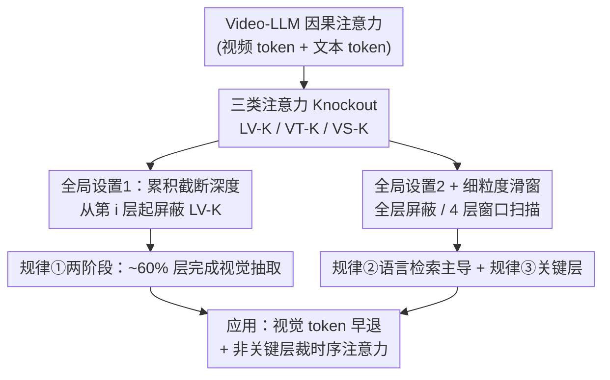

# An Empirical Study on How Video-LLMs Answer Video Questions

**会议**: CVPR 2026  
**论文**: [CVF Open Access](https://openaccess.thecvf.com/content/CVPR2026/html/Gou_An_Empirical_Study_on_How_Video-LLMs_Answer_Video_Questions_CVPR_2026_paper.html)  
**代码**: 待确认  
**领域**: 视频理解  
**关键词**: Video-LLM, 可解释性, 注意力 knockout, 两阶段处理, 视频问答  

## 一句话总结
这篇论文用"注意力 knockout"系统性地解剖了 Video-LLM 回答视频问题的内部机制，发现它们存在清晰的"前层感知、后层推理"两阶段模式、时空建模主要靠语言→视频的检索而非帧内/帧间视频自注意力、且只有少数中间层是关键层，并据此设计了一个简单的视觉 token 早退 + 时序注意力裁剪策略大幅省算力而几乎不掉点。

## 研究背景与动机

**领域现状**：Video-LLM（如 LongVA、InternVideo2.5、LLaVA-Video、LLaVA-OneVision）在视频问答（VideoQA）上表现很强，主流研究都在"堆性能"——扩大视频指令数据、加长输入帧数、改进视频 token 的位置编码。这些模型架构高度趋同：冻结的视觉编码器把视频抽成 token，投影层映射到语言空间，再喂给一个 decoder-only LLM 自回归出答案。

**现有痛点**：几乎没人研究这些模型**内部到底怎么处理视频**。它们被当成黑盒用，但黑盒带来三个问题——可解释性差、效率优化无的放矢（不知道哪些计算是冗余的）、未来模型设计缺乏机制层面的指导。

**核心矛盾**：图像域的 MLLM 可解释性研究已经很丰富（信息流分析、两阶段模式、安全机制定位、冗余视觉 token 削减等），但**高维的视频域几乎是空白**。已有的视频侧工作（如同期一项研究）也只分析外部行为（视频问答强、时序定位弱、对语言扰动敏感而对视频扰动不敏感），没有打开内部。

**本文目标**：回答三个内部机制问题——(1) Video-LLM 是否像图像 VLM 一样有清晰的"前层感知、后层推理"两阶段？(2) 全局来看，三类注意力各自对 VideoQA 贡献多大？(3) 细粒度来看，每一层上每类注意力的影响如何？

**切入角度**：把 LLM 内部对视频的因果注意力**拆成三类信息流**——帧间的时序注意力、帧内的空间注意力、文本→视频的语言检索注意力——然后用 knockout（选择性屏蔽某类注意力）做"因果消融"，看屏蔽后掉多少点，从而归因每类信息流的作用。

**核心 idea**：把 LLM 可解释性里成熟的"attention knockout"迁移到视频域，通过精细控制"屏蔽哪些层 × 屏蔽哪类注意力"两个自由度，第一次系统揭示 Video-LLM 处理视频的内部规律。

## 方法详解

这是一篇 empirical study，"方法"指的是分析工具与实验协议：如何把因果注意力拆开、如何用 knockout 做因果消融、以及在哪些"层范围 × 注意力类型"组合下做对照，从而读出三条规律。

### 整体框架

Video-LLM 的输入序列是有序的：先是 $N$ 帧的视频 token $V=[F_i]_{i=1}^{N}$（每帧 $F_i=\mathrm{Proj}(\mathrm{Enc}_v(x_i))$，用 CLIP-L-14 编码后投影到语言空间，每帧 >100 个 token），后接文本 token $T$，拼成 $\mathrm{MMs}=[F_1,\dots,F_N,T]$，经 $L$ 层 Transformer，最后一层最后一个 token 解码出答案。每层注意力是标准因果注意力 $\mathrm{CausalAttention}(Q,K,V)=\mathrm{softmax}\!\left(\frac{QK^\top}{\sqrt{d_k}}+M\right)V$，其中 $M$ 是因果 mask。

作者把这个因果注意力**按 query/key 的模态归属拆成三类信息流**，对每类设计一个 knockout（把对应位置的注意力 mask 掉），再用两组"层范围"协议去激活/扫描这些 knockout，最后把掉点曲线翻译成三条规律。整条分析流程如下：

### 关键设计

**1. 三类注意力 Knockout：把"视频里发生了什么"拆成可单独关停的三条信息流**

直接观察整体注意力分不清到底是"帧间时序""帧内空间"还是"语言去视频里捞信息"在起作用，所以作者按模态把因果注意力解耦成三类，并各设计一个 knockout 选择性切断：

- **Language-to-Video Knockout（LV-K）**：屏蔽文本 token 对所有视频 token 的注意力，即切断"语言→视频"的检索通路——文本不再能从视频里捞信息。
- **Video Temporal Knockout（VT-K）**：屏蔽不同帧之间视频 token 的注意力，保留帧内空间与语言检索——切断帧间时序交互。
- **Video Spatial Knockout（VS-K）**：屏蔽同一帧内部视频 token 之间的注意力——切断帧内空间交互。

knockout 是 LLM 可解释性里的成熟手段，思路是"屏蔽某条信息流后看任务掉多少点，就反推这条流的因果贡献"。这种因果消融比单纯看注意力权重大小更可靠——注意力分高不代表对最终答案有用，而 knockout 直接量出"没它会差多少"。

**2. 全局设置：用累积截断深度读出"两阶段"，用全层屏蔽读出"谁主导"**

光有 knockout 还需要"在哪些层施加"的协议。形式化地，$L$ 层里每层的配置 $L_i^{KT}\in\{\text{no knockout},\,\text{LV-K},\,\text{VT-K},\,\text{VS-K}\}$。全局设置含两个子协议：

- **全局设置1（累积截断深度）**：从第 $i$ 层开始往后全部施加 LV-K，即 $L_j^{KT}=\text{LV-K}$ 当 $j>i$，否则不屏蔽；$i$ 以步长 2 从浅到深扫描。含义是"模型只能在前 $i$ 层访问视频信息，之后视频对文本关门"。作者定义**层比例（layer ratio）**= 保留语言→视频注意力的层数占总层数的比例，**性能比例（performance ratio）**= 当前 knockout 下性能相对原始无 knockout（100% 层、100% 性能）的比值。若曲线在某个层比例后趋平，说明视觉信息已在前面的层抽取完毕——这正是"两阶段"的证据。
- **全局设置2（全层单类屏蔽）**：一次只选一类 knockout，施加到**所有层** $L_j^{KT}=KT,\ \forall j$，$KT\in\{\text{LV-K},\text{VT-K},\text{VS-K}\}$。三类各跑一遍、比掉点幅度，就能读出哪类注意力对 VideoQA 贡献最大。

**3. 细粒度滑窗：定位"关键层"并验证每层上谁更重要**

全局协议看不出"是不是少数层在挑大梁"。细粒度设置用一个长度为 4 的滑动窗口：对以第 $x$ 层结尾的窗口 $\{x{-}3,x{-}2,x{-}1,x\}$（$x\ge 4$）施加某类 knockout $KT$，窗口外不屏蔽，然后让窗口沿层扫描。这样能逐段量出"屏蔽这几层会掉多少"，从而 (a) 识别出掉点特别大的**关键层（critical layers，如 28 层模型里的第 12–16 层）**，(b) 在每个局部窗口内对比三类 knockout 的影响。这个协议和全局设置1 形成互证——关键层应当落在第一阶段（前 ~60% 层）内。

### 损失函数 / 训练策略
本文不训练新模型、不引入损失函数，所有实验在冻结的开源 Video-LLM 上做推理期 knockout，因此无训练目标。被分析模型统一用均匀采样取 32 帧（额外做了 8/16/32/64 帧的扩展），主体实验在 7B 模型上（另用 32B 模型验证泛化）。

## 实验关键数据

**模型**：LongVA-7B、InternVideo2.5-8B、LLaVA-Video-7B、LLaVA-OneVision-7B（主体），外加 LLaVA-NeXT-Video-32B 验证泛化。
**数据集**：Video-MME（254 小时、2700 QA，3 分钟到 1 小时不等）、MVBench（20 类时序任务、4000 QA）、EgoSchema（5000 第一人称视频，用 500 子集）。
共 500+ 数据点的实验。

### 主实验：三条规律

| 协议 | 操作 | 观察到的现象 | 推出的规律 |
|------|------|-------------|-----------|
| 全局设置1 | 从第 $i$ 层起屏蔽 LV-K，扫描层比例 | 全屏蔽时仅保留 48%–70% 原性能；层比例 0→60% 性能逐步回升，50–60% 区间提升最猛；屏蔽 60% 层之后几乎无影响 | ① **两阶段**：视觉信息主要在前 ~60% 层抽取，后面层负责高层推理 |
| 全局设置2 | 各类 knockout 全层施加 | VT-K、VS-K 全层屏蔽掉点极小；LV-K 全层屏蔽掉点巨大 | ② **语言检索主导**：时空建模主要靠语言→视频检索，而非更贵的帧间/帧内视频自注意力 |
| 细粒度滑窗 | 4 层窗口扫描各类 knockout | 少数中间层（如 12–16）屏蔽后大幅掉点，其余层影响很小；多数单层上 LV-K 影响 > VT-K/VS-K | ③ **关键层**：少数层是 VideoQA 的"影响力离群点"，且落在第一阶段内 |

### 应用：基于两阶段 + 关键层的省算力策略（Tab. 1）

直接把规律落地：视觉 token 在第一阶段后（第 18 层起）早退（exit）、并在非关键的前 8 层只允许帧内空间注意力（裁掉时序注意力）。

| 模型 | 配置 | 注意力 FLOPs | MME | MVBench | EgoSchema |
|------|------|-------------|-----|---------|-----------|
| LLaVA-Video | Baseline | 100% | 62.4 | 61.1 | 58.4 |
| LLaVA-Video | Exit only | 64.3% | 62.0 | 61.1 | 58.0 |
| LLaVA-Video | Exit + window | 37.6% | 60.0 | 60.8 | 58.2 |
| LLaVA-OneVision | Baseline | 100% | 59.1 | 58.3 | 65.2 |
| LLaVA-OneVision | Exit only | 64.3% | 58.2 | 57.3 | 64.4 |
| LLaVA-OneVision | Exit + window | 37.5% | 58.0 | 57.6 | 65.2 |

注意力 FLOPs 压到约 37.5% 时，三个 benchmark 上掉点普遍 <2，部分（如 LLaVA-OneVision 的 EgoSchema）甚至不掉。

### 关键发现
- **视觉信息不是全程都在用**：屏蔽 60% 层之后的语言→视频注意力几乎不影响性能，说明后半程模型基本在"用已经抽好的视觉摘要做推理"，视觉 token 继续参与注意力是冗余计算——这是早退能省算力的根因。
- **最贵的注意力反而最没用**：帧间时序、帧内空间自注意力计算量大，但全层屏蔽几乎不掉点；真正承载时空建模的是更便宜的语言→视频检索。这点在 8/16/32/64 帧下一致成立。
- **关键层因模型/任务而异**：不同模型、不同任务的关键层集合不完全相同，但都落在第一阶段。作者也据此承认固定层配置（前 8 层裁时序、18 层早退）并非最优，动态、按任务自适应才是更好方向。
- **全屏蔽视觉仍保留 48–70% 性能**：说明 LLM 自带的世界知识能"猜"对相当一部分题，但视觉信息确实贡献了关键的那 30–50%。

## 亮点与洞察
- **把"注意力是否有用"从相关变成因果**：不看注意力权重大小，而是 knockout 后量掉点——直接回答"没它会差多少"，规避了"高注意力分≠真有用"的常见误区。这套因果消融范式可迁移到任何想归因模块作用的分析。
- **两个自由度的正交设计很干净**：把分析拆成"屏蔽哪些层（累积截断 / 滑窗）× 屏蔽哪类注意力（LV/VT/VS）"两个旋钮，全局设置看宏观分工、细粒度设置定位关键层，两者互证，结论可信度高。
- **从机制直接推出可落地的效率策略**：两阶段 → 视觉 token 早退；语言检索主导 → 非关键层裁时序注意力。一个纯分析工作能顺手给出近 2.6× 的注意力 FLOPs 削减且几乎不掉点，把"可解释性"变成了"可用性"。
- **"关键层是离群点"这一观察可迁移**：少数中间层挑大梁的现象，对模型剪枝、层级 LoRA、层级量化都有指导意义——该重点保护这些层。

## 局限与展望
- 作者承认固定层配置（裁前 8 层时序、18 层早退）并非最优，关键层随任务变化，理想方案是**动态、任务自适应**地选择早退层与裁剪层，但这超出本文范围。
- ⚠️ 实验只覆盖 4–5 个开源 Video-LLM 和 3 个 VideoQA benchmark，结论是否推广到时序定位、视频描述、长视频检索等其它任务尚未验证（作者也指出这些模型"问答强、时序定位弱"，机制结论未必跨任务通用）。
- 关键层是"逐窗 knockout 掉点"经验定义的，缺少更细的机制解释（这些层到底在算什么），仍偏现象学。
- knockout 是硬屏蔽某类注意力，可能与模型真实使用方式有偏差；不同 knockout 之间的交互（如同时屏蔽两类）未系统探讨。

## 相关工作与启发
- **vs 图像域 MLLM 可解释性（两阶段模式、安全机制定位、冗余视觉 token 削减等）**：图像域已有大量内部机制研究，本文是把这套思路第一次系统搬到高维视频域，并发现视频也存在两阶段模式，但额外揭示了"语言检索主导时空建模""少数关键层"等视频特有规律。
- **vs 同期 Video-LLM 行为分析工作（外部行为，问答强/定位弱、对语言敏感）**：那篇只看输入输出的外部行为，本文打开内部、做注意力级因果消融，二者互补——外部"对语言敏感"恰好与本文"语言→视频检索主导"在机制上呼应。
- **vs 视觉 token 削减/早退类效率方法**：很多工作靠启发式或额外训练删视觉 token，本文则用机制分析（两阶段 + 关键层）给出删减的"理论依据"，且不需训练、即插即用。

## 评分
- 新颖性: ⭐⭐⭐⭐⭐ 首次系统揭示 Video-LLM 处理视频的内部机制，把图像域 knockout 范式扩展到视频并发现视频特有规律。
- 实验充分度: ⭐⭐⭐⭐ 5 模型 × 3 benchmark × 500+ 数据点，并用 32B 与多帧长验证泛化；但任务局限于 VideoQA。
- 写作质量: ⭐⭐⭐⭐ 三个问题—三条规律—一个应用的结构清晰，协议形式化到位；个别图表依赖正文描述。
- 价值: ⭐⭐⭐⭐⭐ 兼顾可解释性与效率，机制结论直接指导剪枝/早退/层级优化，落地性强。

<!-- RELATED:START -->

## 相关论文

- [\[ICCV 2025\] An Empirical Study of Autoregressive Pre-training from Videos](../../ICCV2025/video_understanding/an_empirical_study_of_autoregressive_pre-training_from_videos.md)
- [\[CVPR 2026\] LensWalk: Agentic Video Understanding by Planning How You See in Videos](lenswalk_agentic_video_understanding_by_planning_how_you_see_in_videos.md)
- [\[CVPR 2026\] StreamReady: Learning What to Answer and When in Long Streaming Videos](streamready_learning_what_to_answer_and_when_in_long_streaming_videos.md)
- [\[CVPR 2026\] Unified Spatiotemporal Token Compression for Video-LLMs at Ultra-Low Retention](unified_spatiotemporal_token_compression_for_video-llms_at_ultra-low_retention.md)
- [\[CVPR 2026\] Video Panels for Long Video Understanding](video_panels_for_long_video_understanding.md)

<!-- RELATED:END -->
