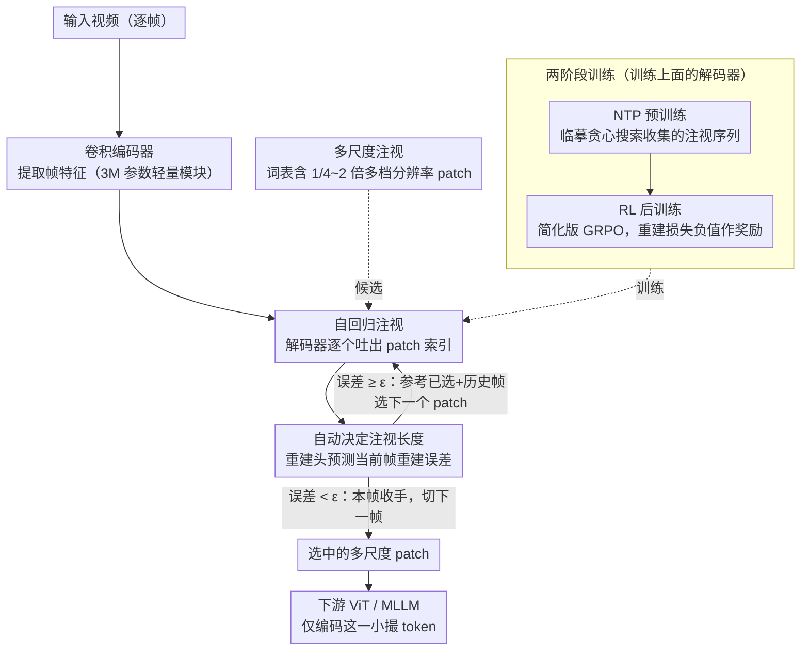

# Attend Before Attention: Efficient and Scalable Video Understanding via Autoregressive Gazing

**会议**: CVPR 2026  
**arXiv**: [2603.12254](https://arxiv.org/abs/2603.12254)  
**代码**: [https://autogaze.github.io/](https://autogaze.github.io/)  
**领域**: 视频理解 / 高效推理  
**关键词**: AutoGaze, 自回归注视, 多尺度patch选择, token压缩, 长视频高分辨率

## 一句话总结

提出 AutoGaze，一个仅 3M 参数的轻量模块，在 ViT 之前自回归选择最少的多尺度 patch 集合以重建视频，去除 4×-100× 时空冗余，实现 ViT 最高 19× / MLLM 最高 10× 加速，首次使 MLLM 可扩展到 1K 帧 4K 分辨率视频，在 VideoMME 上达到 67.0%。

## 研究背景与动机

**领域现状**：多模态大语言模型（MLLM）如 Qwen2.5-VL、NVILA 等推动了通用视频理解，但受限于 ViT 和 LLM 对每个像素的均等处理——视频存在大量时空冗余（静态背景、低变化区域）。

**现有痛点**：(1) 现有 token 缩减方法（FastV、ToMe、VisionZip 等）仅在 ViT 内部或 ViT-LLM 之间剪枝 token，ViT 本身仍需处理所有像素，是主要效率瓶颈；(2) 基于注意力分数的启发式方法效果不如学习式方法；(3) 涉及搜索和推理的方法引入额外开销，进一步限制可扩展性；(4) 现有基准只关注长视频但不关注高分辨率。

**核心矛盾**：人类通过扫视（saccade）选择性关注信息丰富的区域高效处理视频流，而模型均等处理每个像素——如何让模型在"看"之前先决定"看哪里"？

**本文目标**：在 ViT 之前去除视频的时空冗余 patch，从根本上降低视觉编码成本，使 MLLM 可扩展到长时间高分辨率视频。

**切入角度**：模拟人类注视行为——自回归预测哪些多尺度 patch 能以最少数量重建当前帧（在给定误差阈值内）。

**核心 idea**：在注意力机制之前先"注视"——用自回归模型选出最少的 patch，ViT 只需处理这些 patch。

## 方法详解

### 整体框架

AutoGaze 想解决的事很直接：视频里大片背景和低变化区域都是冗余，但 ViT 把每个 patch 一视同仁地编码，算力全浪费在没信息的像素上。它的做法是在 ViT 之前插一个仅 3M 参数的轻量模块（一个卷积编码器 + 一个自回归 Transformer 解码器），让这个模块先"扫视"一遍，挑出能重建当前帧的最少 patch，再把这一小撮 patch 喂给 ViT/MLLM。

整条流水线像人眼读一段视频：逐帧编码后，解码器参考当前帧特征和历史注视记录，自回归地一个接一个吐出 patch 索引；每吐一个就顺手预测"用已选这些 patch 重建当前帧"的误差，一旦误差掉到用户给的阈值以下就停手、切到下一帧。最后只有被选中的多尺度 patch 进入下游网络——同样一段视频，ViT 看到的 token 可能只剩百分之几。

### 关键设计

**1. 自回归注视（Autoregressive Gazing）：把"看哪里"建模成序列生成**

均等处理每个像素是 ViT 效率的根本病因，AutoGaze 的回答是把 patch 选择变成一个自回归序列预测问题。给定 $T$ 帧视频 $\bm{X}^{1:T}$，模型逐帧输出 patch 索引序列 $p_{1:N^1}^1, \ldots, p_{1:N^T}^T$（每个 $p_k^t \in \{1, \ldots, V\}$ 指向词表里的某个候选 patch），优化目标是在最少 patch 下让重建误差最小：

$$\min_{p_1^1, \ldots, p_{N^T}^T} L\big(\bm{X}^{1:T}, \text{Recon}(\bm{X}^1[p_1^1], \ldots, \bm{X}^T[p_{N^T}^T])\big)$$

这里的 $\text{Recon}$ 是一个带块因果注意力的 VideoMAE，$L$ 取像素重建损失与感知损失的加权和。之所以用自回归而非一次性打分挑 top-k，是因为"下一个该选哪个 patch"天然要看前面已经选了什么、前几帧又注视过哪里——这种条件依赖让模型自动避开跨帧重复选择同一块静态区域，把预算花在新出现的信息上。

**2. 自动决定注视长度：让每帧自适应地决定看多少**

视频帧的冗余程度参差不齐——一帧静止的纯色背景只需要极少 patch，一帧剧烈运动的画面则需要更多。如果对所有帧固定 token 预算，要么浪费要么欠采样。AutoGaze 在解码器上挂一个额外的预测头，每解码出一个 $p_k^t$ 就估计"用当前已选 patch 重建这一帧"的损失，一旦预测损失 $< \epsilon$（用户指定阈值）就停止本帧注视。于是每帧的 token 数不再是超参，而是由内容自己决定的变量，整段视频的总开销随实际冗余量自动伸缩。

**3. 多尺度注视：给不同细节区域配不同分辨率**

只用单一尺寸的 patch 会两头吃亏：覆盖一片纯色用细尺度 patch 太浪费，捕捉精细纹理用粗尺度又看不清。AutoGaze 把解码器的词表扩成多个尺度（如 $224\times224$ 的 $1/4, 1/2, 1, 2$ 倍），模型可以为平滑区域选一个粗尺度低分辨率 patch 一把盖住，为纹理密集处选细尺度高分辨率 patch 精确刻画。下游 ViT 则对不同尺度分别做 patch embedding 并插值位置编码，从而能接受这种混合分辨率的输入。

**4. 两阶段训练：先临摹贪心解、再用 RL 超越它**

注视序列没有现成标签，AutoGaze 的训练分两步走。先做 NTP 预训练：在视频上跑贪心搜索（逐个穷举、每步挑使重建损失最低的 patch）收集出一批近似最优的注视序列当"教科书"，用 next-token-prediction 交叉熵让模型临摹

$$L_{NTP} = -\sum_t \sum_k \log \pi_\theta(\tilde{p}_k^t \mid \bm{X}^{1:t}, \ldots)$$

同时用 $\ell_2$ 损失监督那个重建损失预测头。但贪心解只是逐步局部最优、并非全局最优，于是第二步做 RL 后训练：用简化版 GRPO，直接拿重建损失（取负）当奖励

$$L_{GRPO} = -\sum_t \sum_k \frac{\pi_\theta(p_k^t)}{\pi_{\theta_{detached}}(p_k^t)} A_k^t$$

让模型在自己 on-policy 生成的序列上探索，找到比贪心教科书更省 patch 的注视策略。这个"先模仿、再用强化学习突破上界"的范式与 LLM 的训练路线高度一致。

### 一个完整示例：注视一帧 4K 静态画面

拿一帧以静止背景为主、只有局部物体在动的 4K 画面走一遍。这帧先被切成一批多尺度候选 patch（词表里同时含粗、细两档）。解码器从第 1 步开始自回归地选：第一个落在变化最明显的运动区域、用细尺度 patch 精确刻画；此时重建头预测"只用这 1 个 patch 重建整帧"误差很高，远在阈值之上，于是继续。第 2、3 个 patch 转去覆盖大片平滑背景，每个都用粗尺度一把盖住一大块，预测误差快速下降；几步之后误差跌破阈值（如 0.7），本帧立即收手。整段视频按帧重复这个过程，静态帧只点几个 patch、运动帧多点几个——文中给出的量级是 30-FPS 4K 视频整体只需约 1% 的 patch。

> ⚠️ 上述每帧选取的具体 patch 个数为示意，确切数值以原文为准；阈值 0.7、4K 视频 ~1% patch 等为原文给出的设定与观察。

### 损失函数 / 训练策略

- 预训练数据：800K 视频（自中心、他中心、自然、文本丰富场景），采样为 16 帧 224 分辨率
- 贪心搜索收集注视序列：逐个穷举找重建损失最低的 patch，记录每步重建损失作为 NTP 与重建头的监督信号
- RL 后训练：在 on-policy 生成的注视序列上用重建损失负值作奖励，优势函数取折扣后的未来帧重建损失
- 多 token 预测：用多个头同时输出多个 patch 索引以加速推理
- 任意分辨率/时长推理：把视频切成 $16 \times 224 \times 224$ 时空瓦片，每个瓦片独立运行 AutoGaze 后再合并，于是 16 帧/224 训练的模型能直接处理 1K 帧/4K 视频

## 实验关键数据

### 主实验

| 模型 | 最大帧数 | 最大分辨率 | VideoMME(w/o sub) | VideoMME(w/ sub) | MVBench | L-VidBench | HLVid |
|------|---------|-----------|-------------------|------------------|---------|------------|-------|
| GPT-4o | - | - | 71.9 | 77.2 | 64.6 | 66.7 | 49.3 |
| Qwen2.5-VL-7B | 48 | 896 | 65.1 | 71.6 | 69.6 | 56.0 | 48.1 |
| VideoChat-Flash | 10000 | 448 | 65.3 | 69.7 | 74.0 | 64.7 | 46.6 |
| NVILA-8B-Video | 256 | 448 | 64.2 | 70.0 | 68.1 | 57.7 | 42.5 |
| **NVILA + AutoGaze** | **1024** | **3584** | **67.0** | **71.8** | 69.7 | **61.0** | **52.6** |
| vs NVILA 基线 | ×4 | ×8 | +2.8 | +1.8 | +1.6 | +3.3 | **+10.1** |

> AutoGaze 使 NVILA-8B 在帧数和分辨率上扩展 4x/8x，VideoMME 达 67.0%。HLVid 提升 10.1%，超越 GPT-4o (+3.3%)。

### 消融实验

| 类型 | 方法 | ViT延迟 | LLM延迟 | V-MME | L-Vid |
|------|------|---------|---------|-------|-------|
| - | 无缩减 | 2.20s | 1.42s | 53.4 | 51.1 |
| S-PA | 空间池化 | 2.20s | 0.18s | 51.5 | 47.2 |
| S-PA | ToMe | 2.23s | 0.11s | 51.5 | 49.3 |
| S-PD | FastV | 2.23s | 0.38s | 53.0 | 46.3 |
| T-PA | 时间池化 | 2.20s | 0.13s | 52.2 | 50.0 |
| **AutoGaze** | 学习式 | **降低** | **降低** | **同等/更优** | **同等/更优** |

> 现有方法仅降低 LLM 延迟（ViT 不变），AutoGaze 同时降低 ViT 和 LLM 延迟。在相同 6.25% token 选择率下全面优于启发式方法。

### 关键发现

- **自适应注视行为**：AutoGaze 自动关注运动区域（光流高的 patch 被更频繁选择）、用细尺度捕捉精细纹理、用粗尺度覆盖平滑区域
- **重建阈值 0.7 最优**：通常导致下游性能下降 <0.5%
- **冗余随 FPS/分辨率增大而增大**：30-FPS 4K 视频仅需 ~1% patch
- **OOD 泛化性**：在 CCTV 监控、机器人操作、风格迁移等训练分布外视频上，AutoGaze 依然稳健追踪变化区域
- **HLVid 新基准**：首个长时间高分辨率视频 QA 基准（268 QA，5分钟 4K 视频），验证了高分辨率理解的必要性

## 亮点与洞察

- **在注意力之前注意**：概念优雅——将 patch 选择从模型内部移到模型之前，从根本上解决 ViT 的计算瓶颈，而非在 ViT 输出后裁剪
- **仅 3M 参数**：overhead 极小（相比 ViT 的数百M参数），添加 AutoGaze 的边际成本几乎可忽略
- **NTP + RL 训练范式**：先用贪心搜索收集"教科书"注视序列做预训练，再用 RL 超越教科书——与 LLM 的训练范式高度一致
- **任意分辨率/时长推理**：通过时空瓦片化，在 16帧/224分辨率训练的模型可直接推理 1K帧/4K视频
- **HLVid 基准贡献**：填补了高分辨率长视频 QA 基准的空白

## 局限与展望

- 某些基准上扩展到过长/过高分辨率反而有害——需要自适应选择最优帧数/分辨率
- 当前训练数据仅 16帧/224分辨率，更大规模训练可能进一步提升
- AutoGaze 的注视决策是 prompt-agnostic 的，不根据用户问题调整关注区域——prompt-dependent 版本可能更优
- 多 token 预测的精度-速度权衡需进一步研究
- 未探索与 Flash Attention 等硬件级优化的协同效果

## 相关工作与启发

- **VideoMAE**：作为 AutoGaze 的重建器，提供了"从少量 patch 重建完整帧"的能力基础
- **ToMe / FastV / VisionZip**：都在 ViT 内部或之后做 token 缩减，AutoGaze 将缩减前移到 ViT 之前
- **NVILA**：AutoGaze 的下游 MLLM，验证了方法的通用性
- **启发**：(1) "在处理之前先做粗粒度筛选"的思路可推广到 3D 点云、音频等其他模态；(2) 自回归 patch 选择本质是视觉 token 的"压缩编码"，与信息论中的率失真理论有深层联系

## 评分

- 新颖性: ⭐⭐⭐⭐⭐ "在注意力之前注意"的概念简洁而深刻，从根本上解决ViT效率瓶颈
- 技术深度: ⭐⭐⭐⭐ NTP+RL训练、自适应停止、多尺度注视的设计精良
- 实验充分度: ⭐⭐⭐⭐⭐ 行为分析+效率测试+基准对比+消融+OOD测试+新基准
- 写作质量: ⭐⭐⭐⭐⭐ 图表精美，直觉清晰，人类注视的类比恰到好处
- 实用价值: ⭐⭐⭐⭐⭐ 直接解决MLLM处理长高分辨率视频的核心瓶颈

<!-- RELATED:START -->

## 相关论文

- [\[CVPR 2026\] Adaptive Capacity Autoregressive Visual Tracking](adaptive_capacity_autoregressive_visual_tracking.md)
- [\[CVPR 2026\] Understanding Temporal Logic Consistency in Video-Language Models through Cross-Modal Attention Discriminability](understanding_temporal_logic_consistency_in_video-language_models_through_cross-.md)
- [\[CVPR 2026\] GIFT: Global Irreplaceability Frame Targeting for Efficient Video Understanding](gift_global_irreplaceability_frame_targeting_for_efficient_video_understanding.md)
- [\[CVPR 2026\] Efficient Frame Selection for Long Video Understanding via Reinforcement Learning](efficient_frame_selection_for_long_video_understanding_via_reinforcement_learnin.md)
- [\[ICLR 2026\] VideoNSA: Native Sparse Attention Scales Video Understanding](../../ICLR2026/video_understanding/videonsa_native_sparse_attention_scales_video_understanding.md)

<!-- RELATED:END -->
