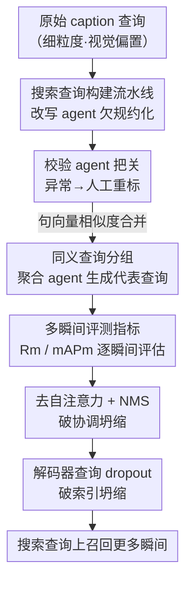

# Beyond Caption-Based Queries in Video Moment Retrieval

**会议**: CVPR 2026  
**论文**: [CVF Open Access](https://openaccess.thecvf.com/content/CVPR2026/html/Pujol-Perich_Beyond_Caption-Based_Queries_in_Video_Moment_Retrieval_CVPR_2026_paper.html)  
**代码**: 项目主页（论文称 code/models/data 已开放，未给出明确仓库链接）  
**领域**: 视频理解  
**关键词**: 视频时刻检索, 搜索查询, DETR, 查询坍缩, 多瞬间检索  

## 一句话总结
本文指出现有视频时刻检索（VMR）模型在「描述式 caption 查询」上训练、却在「真实搜索查询」上崩盘，根因是 DETR 解码器查询坍缩到只有 4 个活跃；通过构建三个搜索查询基准 + 去掉解码器自注意力 + 查询 dropout 两处架构改动，在搜索查询上把 mAPm 最高提升 14.82%、多瞬间查询上提升 21.83%。

## 研究背景与动机
**领域现状**：视频时刻检索（Video Moment Retrieval, VMR）的任务是给定一段视频和一句文本查询，定位出视频里对应的时间片段。当前主流方法几乎都基于 DETR——用 $K$ 个可学习的 decoder query，每个 query 负责预测一个候选片段及其置信度，属于 proposal-free 的单阶段架构（CG-DETR、LD-DETR 等）。这些方法在 HD-EPIC、YouCook2、ActivityNet-Captions 等基准上刷得很高。

**现有痛点**：但这些基准的查询全部来自 **caption**——标注员**先看完视频再写**一句精细描述。本文称之为 caption-based query，它天然带有「视觉偏置」：用词过分细致、与画面一一对应（HD-EPIC 平均 16.47 词/查询）。而真实用户检索时**没看过视频**，输入的是更短、更抽象、欠规约（under-specified）的 search query，比如把「一个穿黄色球衣的人在禁区附近截下传球并凌空抽射破门」简化成「什么时候进球了？」。两者分布差异巨大。

**核心矛盾**：欠规约的搜索查询往往对应视频里的**多个** ground-truth 瞬间（如「有人在做饭」可同时匹配「炒洋葱」和「搅汤」两段），而 caption 查询永远只对应**单个**瞬间。模型在「单瞬间先验」下训练，到了「多瞬间」评测时根本无力检索全部片段。作者把退化拆成两个 gap：**语言 gap**（用词从具体到抽象的分布漂移）和**多瞬间 gap**（单瞬间训练→多瞬间评测的错配）。实测 CG-DETR/LD-DETR 在搜索查询上 Rm@0.3 相对退化最高达 71.75%/77.40%。

**本文目标**：(1) 给 VMR 造出贴近真实搜索场景的基准；(2) 在不重标注、不改训练范式的前提下，从模型架构侧缓解多瞬间 gap。语言 gap 留给未来的更强 VLM 解决。

**切入角度 / 核心 idea**：作者发现退化的关键机制是 **active decoder-query collapse**——评测搜索查询时无论目标有几个瞬间，模型活跃的 decoder query 始终只有约 4 个，等于「算力预算」被锁死，4 瞬间的实例最多只能召回 50%。于是核心 idea 是：**别去重标数据，而是从结构上打破让模型只激活少数 query 的两个机制（自注意力协调坍缩 + 索引坍缩）**，让活跃 query 数量随瞬间数自然增长。

## 方法详解

### 整体框架
本文是「诊断 + 基准 + 修复」三段式工作。**第一条线（数据侧）**把已有的密集标注 caption 数据集自动改写成搜索查询基准：每条 caption 先被一个「改写 agent」欠规约化、再被一个「校验 agent」把关（异常交人工修），然后把语义相近的多条查询**分组合并**成一个代表性搜索查询，于是单瞬间数据集就被扩成了多瞬间数据集（HD-EPIC-S1/S2/S3、YC2-S、ANC-S）。**第二条线（模型侧）**先用新指标 Rm / mAPm 量化退化、定位到 active decoder-query collapse，再对 DETR 解码器做两处微调（去自注意力 + 查询 dropout）把活跃 query 解放出来。

下图是数据侧的搜索查询构建流水线（多 agent 串行 + 分组聚合，是本文基准的来源）：

### 关键设计

**1. 搜索查询基准构建流水线：把单瞬间 caption 数据集自动改写成多瞬间搜索基准**

痛点是「重新采集搜索查询数据集」几乎不可行——很难把「文本标注」和「看视频」这两件事解耦。作者反其道而行：**复用已有的密集标注数据集**，用流水线把 caption「降规约」。流水线两阶段：① **逐查询欠规约**——基于 Gemma-12B 实例化两个协作 agent，**改写 agent** 把细粒度 caption 改成省略主语/宾语/意图的粗略版本（「一个人系跑鞋准备跑马拉松」→「一个人准备运动」），**校验 agent** 标记不一致的改写、交人工修正以防幻觉；② **查询分组**——一条欠规约查询可能对应多个有效瞬间，于是用预训练句向量编码器算两两相似度，把高相似的原查询并成一组形成**多瞬间实例**，再用一个聚合 agent 把每组总结成一条代表性搜索查询。之所以必须用**密集标注**数据集，是因为查询变粗后会牵出原本未标的额外瞬间，只有密集标注才能自动找全这些对应关系（稀疏标注就得大量人工补标）。最终产出三套「-S」基准，多瞬间查询占比最高达 47.47%，平均查询长度缩短最高 82%。

**2. 多瞬间评测指标 Rm / mAPm：让指标按「逐个瞬间」而非「整条查询」打分**

痛点是传统 R1、mAP 在多瞬间场景下会失真：R1 只看 top-1，2 瞬间查询里命中一个就算对、漏掉另一个完全不罚；mAP 把一条查询的所有 GT 瞬间聚成一个分数，某个难瞬间漏检会被其它易瞬间「掩盖」。作者把二者改造成**逐瞬间**版本。多瞬间召回 $R_m$ 对每个 GT 瞬间 $g_i$ 单独判：在 IoU 阈值 $\tau$ 下，只要检测到它的预测置信度最高、**或**所有更高置信度的预测都正确命中了其它 GT 瞬间，就记 $R_m(g_i,\tau)=1$，再对全体瞬间求平均：

$$R_m(\tau) = \frac{1}{|G|}\sum_{g_i\in G} R_m(g_i,\tau)$$

多瞬间 $\text{mAP}_m$ 同理对每个 $g_i$ 单独算 PR 曲线：与 $g_i$ 的 IoU$\ge\tau$ 的预测算 TP，不匹配任何 GT 的算 FP，而匹配**其它** GT 瞬间的预测被**忽略**（避免「检对了别的瞬间」反而拖累 $g_i$ 的分数），再对各瞬间分数求平均。这套指标的关键就是「忽略命中其它 GT 的预测」，从而公平度量每个瞬间是否被独立检索到。

**3. 去掉解码器自注意力 + NMS：破解协调坍缩（coordination collapse）**

定位到的第一个结构性病因是 decoder 层里的自注意力（SA）。标准 DETR 解码器层为 $\hat{Q}^{l+1} = \text{FFN}(\text{CA}(\text{SA}(\hat{Q}^l), M))$，其中 $M\in\mathbb{R}^{T\times F}$ 是融合后的多模态特征，CA 是交叉注意力。CA 负责注入跨模态信息，而 SA 的本意是「把 decoder query 互相推开避免冗余」——但副作用是逼着多数 query 互相「协商」谁来负责那个唯一瞬间、其余主动失活，正好被单瞬间先验利用。作者的做法干脆**整个删掉 SA**，损失不变：$Q^{l+1} = \text{FFN}(\text{CA}(Q^l, M))$。砍掉 query 间通信后，每个 query 独立行动、不再走「协调式捷径」；但也丢了 DETR 自带的去冗余机制，于是在后处理加 **NMS** 过滤重叠预测补回来。删 SA 看似激进，却直接拆掉了「让 query 抱团失活」的源头。

**4. 解码器查询 dropout：破解索引坍缩（index collapse）**

只删 SA 还不够——模型仍会过拟合单瞬间先验，表现为**索引坍缩**：固定的少数几个 query 索引（如 1–4 号）反复主导输出，其余永久沉睡。原因是训练时单瞬间先验让模型把「检测那个唯一瞬间」绑定到由初始化决定的固定几个索引上，并在训练中不断自我强化。对策是一个**针对性的查询 dropout**：每次训练迭代随机把 $k\%$ 的可学习 query 置零，

$$\hat{Q} = Q \odot M,\quad M \sim \mathcal{B}(1-k)$$

$\mathcal{B}$ 是保留概率为 $(1-k)$ 的伯努利分布。这种轻量随机正则强迫监督信号分摊到更多 query 上、不让模型死守固定子集。两处改动合称 **-SA+QD**：协调坍缩和索引坍缩**必须一起解**，单独任何一个都只能让活跃 query 数微增、压不住坍缩；合在一起则把活跃 query 数从约 3.6 提到约 6.4（近翻倍），随瞬间数稳步增长。值得强调的是，-SA+QD **保留了 DETR 的 1-to-1 匹配**，正是这种「query 之间的竞争」保证了新激活出来的 query 彼此多样、不退化成对同一瞬间的冗余预测（消融证明换成 1-to-k 匹配会让 query 全激活但预测高度冗余、性能反降）。

### 损失函数 / 训练策略
不改任何训练损失与训练范式——这是本文卖点之一：仅删除解码器 SA、加查询 dropout（最优 $k=0.25$）、推理加 NMS，沿用原模型（CG-DETR / LD-DETR）的训练配置即可，因此能直接复用所有现有 VMR 训练集与训练流程。

## 实验关键数据

### 主实验
在 HD-EPIC-S{1,2,3} 上，-SA+QD 对两个代表模型都稳定提升（Rm/mAPm，IoU∈{0.1,0.3,0.5} 平均，节选自原表 2）：

| 模型 / 基准 | 变体 | Rm@0.1 | Rm Avg | mAPm@0.1 | mAPm Avg |
|------|------|------|------|------|------|
| CG-DETR / S2 | base | 24.71 | 16.04 | 32.15 | 20.84 |
| CG-DETR / S2 | **-SA+QD** | **26.17** | **17.52** | **35.38** | **23.93** |
| CG-DETR / S3 | base | 9.50 | 5.39 | 16.20 | 9.26 |
| CG-DETR / S3 | **-SA+QD** | **10.57** | **6.84** | **17.27** | **11.15** |
| LD-DETR / S1 | base | 29.42 | 19.89 | 36.55 | 24.74 |
| LD-DETR / S1 | **-SA+QD** | **30.18** | **20.42** | **40.50** | **27.66** |

整体上搜索查询 mAPm 最高提升 14.82%、**多瞬间**搜索查询最高提升 21.83%；与「直接在欠规约查询上训练」的 oracle 相比，-SA+QD 能补回约 **70%** 的 oracle 差距。在 YC2-S 上 mAPm@0.3 绝对提升最高 2.96，多瞬间 gap 更小的 ANC-S 上也持平或略升。

> ⚠️ 正文称 HD-EPIC-S2 的 CG-DETR Rm@0.1 从 24.71 提到「26.71」，但表 2 列的是 26.17，疑为正文笔误，此处以表格为准。

### 消融实验
两处改动缺一不可（CG-DETR / HD-EPIC-S2，原表 7）：

| -SA | +QD | Rm | mAPm | # 活跃 query |
|:---:|:---:|------|------|------|
| | | 16.04 | 20.84 | 3.64±1.18 |
| ✓ | | 15.31 | 21.02 | 3.72±1.16 |
| | ✓ | 16.50 | 21.43 | 3.77±1.28 |
| ✓ | ✓ | **17.52** | **23.93** | **6.43±2.16** |

查询 dropout 率敏感性（原表 8）：

| $k$ | Rm | mAPm |
|------|------|------|
| 0.00 | 15.31 | 21.02 |
| **0.25** | **17.52** | **23.93** |
| 0.50 | 0.99 | 3.84 |

### 关键发现
- **活跃 query 数是核心因果**：base 模型无论查询对应几个瞬间，活跃 query 始终锁在约 4 个（图 5），直接限死多瞬间召回上界；-SA+QD 让其随瞬间数稳步增长。
- **单独任一改动几乎无效**：只删 SA 或只加 QD，活跃 query 仅微增、mAPm 几乎不动；合用才把活跃 query 近翻倍、mAPm +3.09，证明协调坍缩与索引坍缩须联合求解。
- **增量主要来自多瞬间**：拆分单/多瞬间看，单瞬间仅小幅改善，多瞬间 mAPm@0.3 最高暴涨 34.3%，正好对症「多瞬间 gap」。
- **只增活跃 query 不够，必须保多样性**：1-to-k 匹配能把活跃 query 拉到 20 个，但预测高度冗余（%match P 翻倍而 %match GT 反降），泛化下降；保留 1-to-1 匹配的竞争才让新激活的 query 互补有效。
- **dropout 率过大致崩**：$k=0.5$ 时 mAPm 暴跌到 3.84，说明只能用轻量随机正则。

## 亮点与洞察
- **把「数据问题」翻译成「架构病灶」**：作者没有去重标数据，而是把「搜索查询泛化差」一路归因到一个可量化、可可视化的现象——active decoder-query collapse（活跃 query 锁死在约 4 个），这种「先找到机制再对症下药」的诊断路径非常值得借鉴。
- **负向结论同样有价值**：消融系统性地否掉了「1-to-k 匹配 / group matching / 数据增强」等增加活跃 query 的常见手段，指出它们要么牺牲多样性、要么破坏时序连贯，反衬出「保留 1-to-1 竞争 + 删 SA + dropout」的必要性。
- **两个可迁移 trick**：删自注意力打破 query 协调、查询 dropout 打散索引依赖——这两招在「DETR 系列普遍存在 query 坍缩」的目标检测、时序动作检测、3D 检测里都可能直接复用。
- **指标设计的洞察**：Rm/mAPm「忽略命中其它 GT 的预测」这一条，干净地解决了多瞬间下「检对了别的反而拖累当前瞬间」的评测假象。

## 局限与展望
- **语言 gap 未解**：本文只攻多瞬间 gap，明确把语言层面的欠规约（抽象名词、模糊指代）留给未来更强的 VLM，因此在 S3 这种极端欠规约基准上绝对分数仍很低（mAPm Avg 仅约 11）。
- **基准依赖 LLM 改写**：搜索查询由 Gemma-12B 改写 + 校验 agent 生成，虽有人工兜底，但「LLM 改写出的欠规约查询」与真实用户查询的分布是否一致，仍是间接近似（作者在补充材料里做了真实性验证）。
- **依赖密集标注**：流水线只能作用于密集标注数据集，稀疏标注集需大量人工补标，限制了可扩展的数据来源。
- **改进思路**：把语言 gap 与多瞬间 gap 联合建模，或在训练阶段就显式注入多瞬间监督而非仅靠架构正则，可能进一步逼近 oracle。

## 相关工作与启发
- **vs 重标注 / 多瞬间数据集（如 QVHighlights 系）**：他们靠采集每查询多个标注瞬间来缓解单瞬间先验，代价是昂贵重标或丢弃大量现有数据；本文纯从模型侧改架构，复用所有现有训练集。
- **vs DETR 收敛加速类匹配策略（1-to-k / group / hybrid matching）**：这些方法增加监督信号主要为**加速收敛**，本文实验证明它们压不住单瞬间先验、还会牺牲 query 多样性导致冗余预测；本文的 -SA+QD 在增加活跃 query 的同时靠 1-to-1 匹配保住多样性。
- **vs 视觉中心的 VMR 泛化研究（动作时长、时序偏置）**：以往泛化分析多从视觉侧切入，本文转向**语言侧偏置**——揭示「用 caption 当训练查询」这一数据构造方式本身是泛化瓶颈的根源。

## 评分
- 新颖性: ⭐⭐⭐⭐⭐ 把 VMR 从「caption 查询」推向「真实搜索查询」是被长期忽略的视角，且诊断出 active decoder-query collapse 这一可操作机制。
- 实验充分度: ⭐⭐⭐⭐ 三数据集 × 两模型 × 多 IoU + 充分消融（含大量负向对比），但绝对分数偏低、语言 gap 未实验覆盖。
- 写作质量: ⭐⭐⭐⭐ 问题—诊断—修复的叙事清晰，新指标定义到位；正文与表格个别数字不一致（26.71 vs 26.17）略有瑕疵。
- 价值: ⭐⭐⭐⭐ 提供新基准 + 即插即用的两处架构改动，对 DETR 系 VMR 乃至更广的查询坍缩问题有直接参考价值。

<!-- RELATED:START -->

## 相关论文

- [\[NeurIPS 2025\] When One Moment Isn't Enough: Multi-Moment Retrieval with Cross-Moment Interactions](../../NeurIPS2025/video_understanding/when_one_moment_isnt_enough_multi-moment_retrieval_with_cross-moment_interaction.md)
- [\[CVPR 2026\] SAIL: Similarity-Aware Guidance and Inter-Caption Augmentation-based Learning for Weakly-Supervised Dense Video Captioning](sail_similarity-aware_guidance_and_inter-caption_augmentation-based_learning_for.md)
- [\[CVPR 2026\] Compositional Transformation Reasoning for Composed Video Retrieval](compositional_transformation_reasoning_for_composed_video_retrieval.md)
- [\[CVPR 2026\] StreamRAG: Enhancing Real-Time Video Understanding with Retrieval Augmentation](streamrag_enhancing_real-time_video_understanding_with_retrieval_augmentation.md)
- [\[CVPR 2026\] Stay in your Lane: Role Specific Queries with Overlap Suppression Loss for Dense Video Captioning](stay_in_your_lane_role_specific_queries_with_overlap_suppression_loss_for_dense_.md)

<!-- RELATED:END -->
